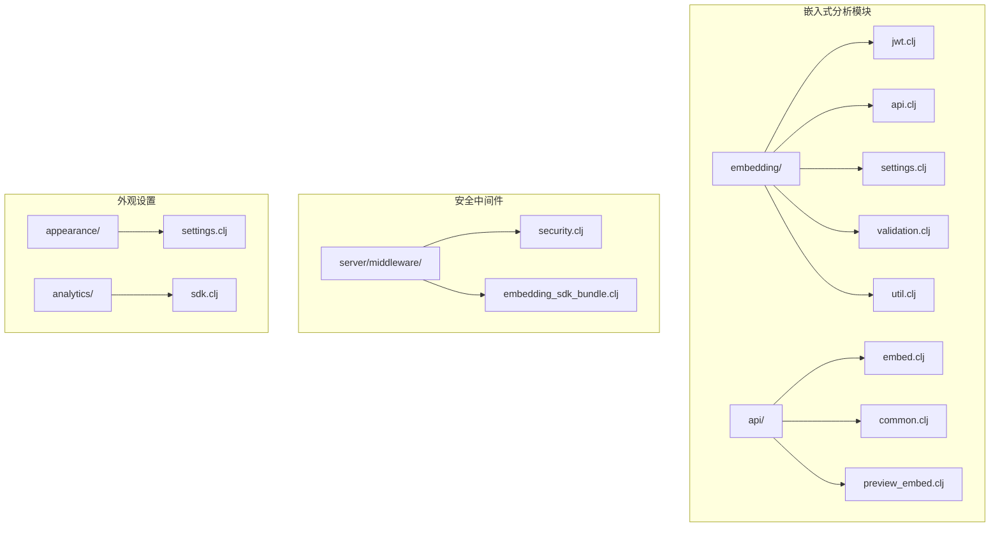
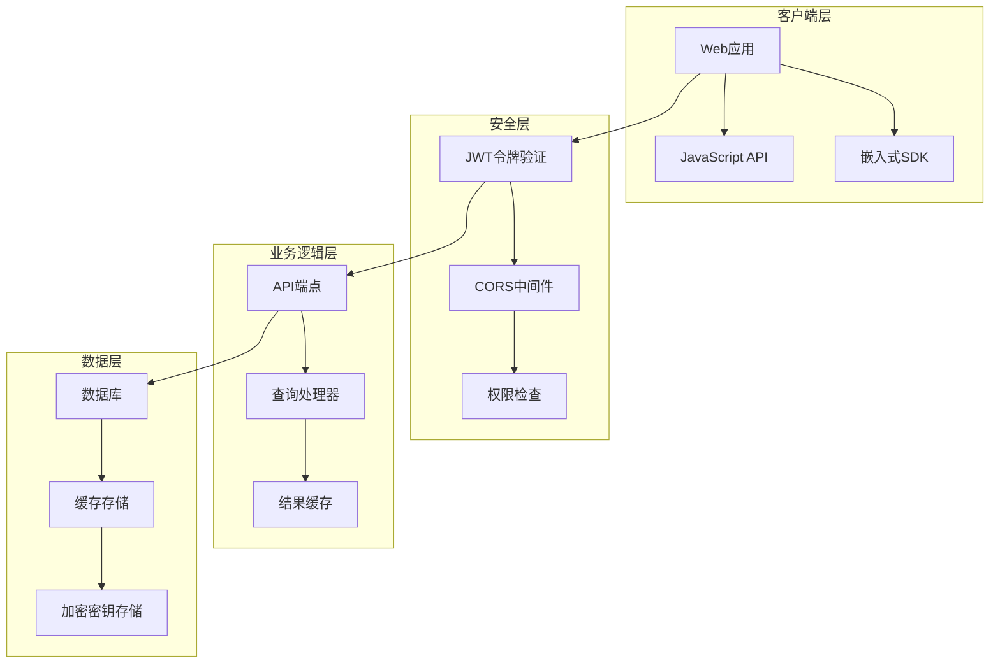
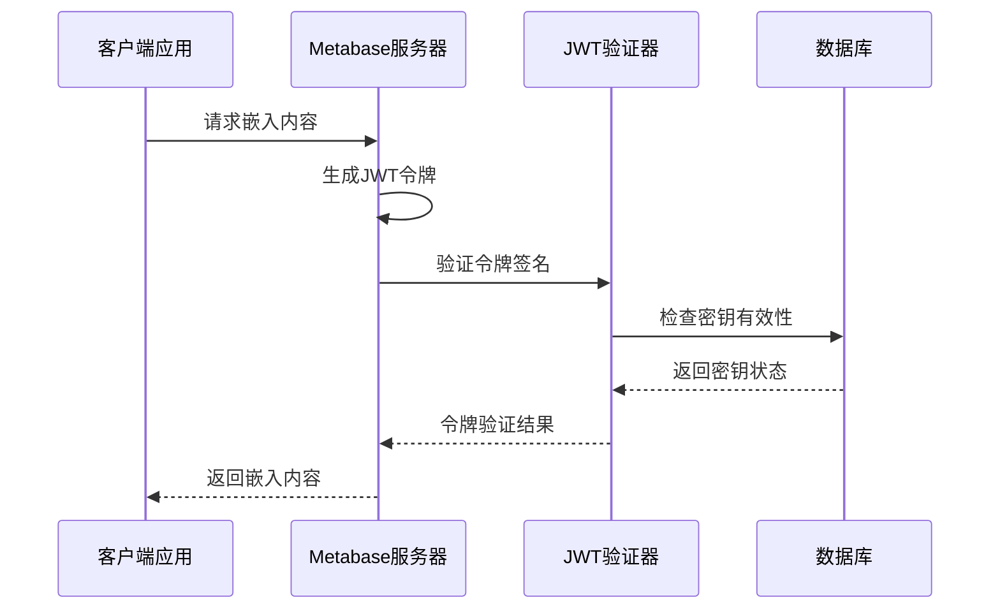
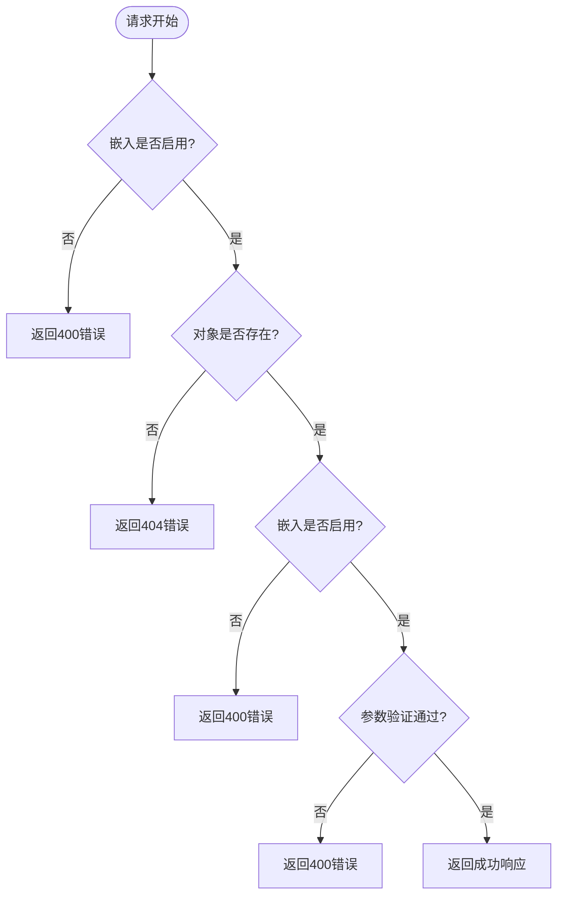
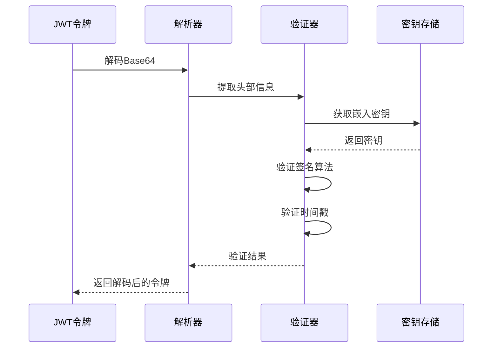
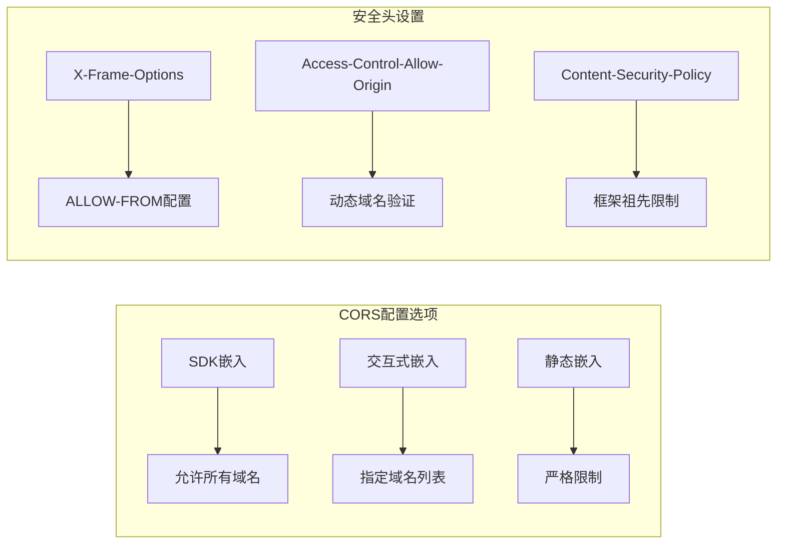
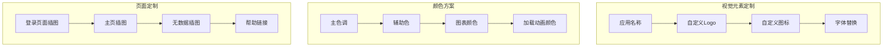
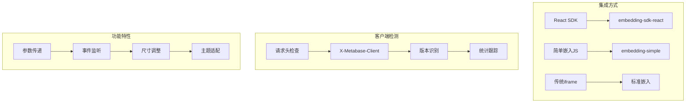
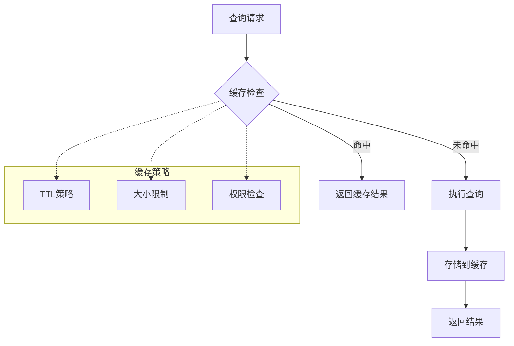

# 嵌入式分析集成

<cite>
**本文档中引用的文件**
- [jwt.clj](file://src/metabase/embedding/jwt.clj)
- [api.clj](file://src/metabase/embedding/api.clj)
- [embed.clj](file://src/metabase/embedding/api/embed.clj)
- [common.clj](file://src/metabase/embedding/api/common.clj)
- [preview_embed.clj](file://src/metabase/embedding/api/preview_embed.clj)
- [validation.clj](file://src/metabase/embedding/validation.clj)
- [settings.clj](file://src/metabase/embedding/settings.clj)
- [util.clj](file://src/metabase/embedding/util.clj)
- [security.clj](file://src/metabase/server/middleware/security.clj)
- [embedding_sdk_bundle.clj](file://src/metabase/server/middleware/embedding_sdk_bundle.clj)
- [settings.clj](file://src/metabase/appearance/settings.clj)
- [sdk.clj](file://src/metabase/analytics/sdk.clj)
</cite>

## 目录
1. [简介](#简介)
2. [项目结构](#项目结构)
3. [核心组件](#核心组件)
4. [架构概览](#架构概览)
5. [详细组件分析](#详细组件分析)
6. [JWT令牌安全机制](#jwt令牌安全机制)
7. [CORS配置与安全](#cors配置与安全)
8. [白标配置与样式定制](#白标配置与样式定制)
9. [前端JavaScript集成](#前端javascript集成)
10. [性能优化与缓存](#性能优化与缓存)
11. [故障排除指南](#故障排除指南)
12. [结论](#结论)

## 简介

Metabase嵌入式分析集成是一个强大的系统，允许开发者将Metabase的可视化内容安全地嵌入到第三方应用程序中。该系统通过JWT（JSON Web Token）令牌实现安全的身份验证和授权，支持多种嵌入模式，包括静态嵌入、交互式嵌入和SDK嵌入。

本文档详细介绍了如何使用JWT令牌安全地将Metabase可视化内容嵌入到第三方应用中，涵盖令牌生成、签名验证、资源权限控制和CORS配置等关键方面。

## 项目结构

嵌入式分析集成的核心文件组织结构如下：



**图表来源**
- [jwt.clj](file://src/metabase/embedding/jwt.clj#L1-L51)
- [api.clj](file://src/metabase/embedding/api.clj#L1-L17)
- [security.clj](file://src/metabase/server/middleware/security.clj#L1-L50)

**章节来源**
- [jwt.clj](file://src/metabase/embedding/jwt.clj#L1-L51)
- [api.clj](file://src/metabase/embedding/api.clj#L1-L17)
- [settings.clj](file://src/metabase/embedding/settings.clj#L1-L315)

## 核心组件

嵌入式分析集成包含以下核心组件：

### JWT令牌管理器
负责JWT令牌的生成、签名验证和解析，确保通信的安全性。

### API端点处理器
提供RESTful API端点，支持卡片和仪表板的嵌入访问。

### 权限验证系统
实施细粒度的权限控制，确保只有授权用户可以访问特定的可视化内容。

### CORS安全中间件
管理跨域资源共享策略，保护嵌入内容免受恶意攻击。

### 白标配置系统
支持品牌定制，允许企业使用自己的标识和颜色方案。

**章节来源**
- [jwt.clj](file://src/metabase/embedding/jwt.clj#L30-L50)
- [embed.clj](file://src/metabase/embedding/api/embed.clj#L1-L50)
- [validation.clj](file://src/metabase/embedding/validation.clj#L1-L12)

## 架构概览

嵌入式分析集成采用分层架构设计，确保安全性和可扩展性：



**图表来源**
- [jwt.clj](file://src/metabase/embedding/jwt.clj#L30-L50)
- [security.clj](file://src/metabase/server/middleware/security.clj#L283-L306)
- [embed.clj](file://src/metabase/embedding/api/embed.clj#L132-L161)

## 详细组件分析

### JWT令牌生成与验证

JWT令牌是嵌入式分析集成安全性的核心。系统使用HMAC SHA-256算法对令牌进行签名：



**图表来源**
- [jwt.clj](file://src/metabase/embedding/jwt.clj#L30-L50)
- [validation.clj](file://src/metabase/embedding/validation.clj#L1-L12)

### API端点架构

嵌入式API提供了标准化的端点来访问卡片和仪表板：

| 端点类型 | 路径模式 | 功能描述 | 认证要求 |
|---------|---------|---------|---------|
| 卡片获取 | `/api/embed/card/:token` | 获取单个卡片的元数据 | JWT令牌 |
| 卡片查询 | `/api/embed/card/:token/query` | 执行卡片查询并返回结果 | JWT令牌 |
| 仪表板获取 | `/api/embed/dashboard/:token` | 获取仪表板及其组件 | JWT令牌 |
| 参数值获取 | `/api/embed/*/params/:param-key/values` | 获取参数的可用值 | JWT令牌 |

**章节来源**
- [embed.clj](file://src/metabase/embedding/api/embed.clj#L132-L367)
- [common.clj](file://src/metabase/embedding/api/common.clj#L1-L100)

### 权限控制系统

权限控制实现了多层安全检查：



**图表来源**
- [common.clj](file://src/metabase/embedding/api/common.clj#L60-L80)
- [validation.clj](file://src/metabase/embedding/validation.clj#L8-L12)

**章节来源**
- [common.clj](file://src/metabase/embedding/api/common.clj#L60-L120)
- [validation.clj](file://src/metabase/embedding/validation.clj#L1-L12)

## JWT令牌安全机制

### 令牌结构与字段

JWT令牌包含以下关键字段：

| 字段名 | 类型 | 描述 | 必需性 |
|-------|------|------|-------|
| `resource` | 对象 | 指定要访问的资源类型和ID | 必需 |
| `params` | 对象 | 查询参数和过滤条件 | 可选 |
| `_embedding_params` | 对象 | 嵌入参数配置（仅预览模式） | 可选 |

### 签名验证流程



**图表来源**
- [jwt.clj](file://src/metabase/embedding/jwt.clj#L15-L30)

### 安全最佳实践

1. **密钥管理**：使用强随机数生成器生成32字节的十六进制密钥
2. **算法选择**：强制使用HMAC SHA-256算法，禁用`none`算法
3. **时间戳验证**：允许60秒的时钟偏差容差
4. **密钥轮换**：定期更新嵌入密钥以提高安全性

**章节来源**
- [jwt.clj](file://src/metabase/embedding/jwt.clj#L15-L50)
- [settings.clj](file://src/metabase/embedding/settings.clj#L15-L30)

## CORS配置与安全

### 跨域资源共享策略

系统实现了灵活的CORS配置，支持多种嵌入场景：



**图表来源**
- [security.clj](file://src/metabase/server/middleware/security.clj#L283-L306)
- [settings.clj](file://src/metabase/embedding/settings.clj#L150-L200)

### 安全头配置

系统自动添加以下安全头：

| 安全头 | 值 | 用途 |
|-------|----|----- |
| `X-Frame-Options` | ALLOW-FROM origin | 防止点击劫持攻击 |
| `X-XSS-Protection` | 1; mode=block | 启用XSS过滤 |
| `X-Content-Type-Options` | nosniff | 防止MIME类型嗅探 |
| `Content-Security-Policy` | 限制框架祖先 | 加强内容安全策略 |

**章节来源**
- [security.clj](file://src/metabase/server/middleware/security.clj#L261-L306)
- [settings.clj](file://src/metabase/embedding/settings.clj#L150-L250)

## 白标配置与样式定制

### 品牌定制选项

Metabase支持全面的品牌定制，包括：



**图表来源**
- [settings.clj](file://src/metabase/appearance/settings.clj#L71-L150)

### 配置参数详解

| 配置项 | 类型 | 默认值 | 描述 |
|-------|------|-------|------|
| `application-name` | 字符串 | "Metabase" | 应用程序显示名称 |
| `application-logo-url` | 字符串 | "app/assets/img/logo.svg" | 自定义Logo路径 |
| `application-colors` | JSON对象 | {} | 主题颜色配置 |
| `application-font` | 字符串 | "Lato" | 主要字体族 |
| `help-link` | 关键字 | :metabase | 帮助链接行为 |

**章节来源**
- [settings.clj](file://src/metabase/appearance/settings.clj#L10-L100)
- [settings.clj](file://src/metabase/appearance/settings.clj#L197-L247)

## 前端JavaScript集成

### SDK集成方式

系统提供多种前端集成方式：



**图表来源**
- [util.clj](file://src/metabase/embedding/util.clj#L1-L22)
- [sdk.clj](file://src/metabase/analytics/sdk.clj#L26-L78)

### 嵌入代码示例

以下是不同集成方式的代码示例：

#### React SDK集成
```javascript
// React应用中的嵌入代码
import { createEmbed } from '@metabase/embedding-sdk';

const embed = createEmbed({
  type: 'card',
  token: 'your-jwt-token',
  baseUrl: 'https://your-metabase-instance.com',
  elementId: 'metabase-container'
});
```

#### 简单嵌入JS集成
```javascript
// 使用JavaScript API的嵌入方式
window.MetabaseEmbed.createCardEmbed({
  token: 'your-jwt-token',
  container: '#metabase-container',
  params: { date_range: 'Last 7 days' }
});
```

**章节来源**
- [util.clj](file://src/metabase/embedding/util.clj#L1-L22)
- [embedding_sdk_bundle.clj](file://src/metabase/server/middleware/embedding_sdk_bundle.clj#L1-L41)

## 性能优化与缓存

### 查询缓存机制

系统实现了智能查询缓存来提升性能：



**图表来源**
- [cache.clj](file://src/metabase/query_processor/middleware/cache.clj#L176-L245)

### 缓存配置参数

| 参数 | 默认值 | 描述 |
|------|-------|------|
| `enable-query-caching` | true | 是否启用查询缓存 |
| `query-caching-min-trigger-count` | 500 | 缓存触发最小行数 |
| `query-caching-max-kb` | 10240 | 最大缓存结果大小(KB) |
| `cache-blocked-tags` | [] | 禁止缓存的标签 |

### 性能监控

系统提供详细的性能指标跟踪：

- 查询执行时间统计
- 缓存命中率监控  
- 嵌入客户端使用情况
- 错误率和响应时间分析

**章节来源**
- [cache.clj](file://src/metabase/query_processor/middleware/cache.clj#L176-L245)
- [sdk.clj](file://src/metabase/analytics/sdk.clj#L54-L78)

## 故障排除指南

### 常见问题诊断

#### 令牌无效问题

**症状**：收到400错误，提示"Token is missing value for keypath"

**可能原因**：
1. JWT令牌格式不正确
2. 缺少必需的资源字段
3. 令牌签名验证失败

**解决方案**：
```javascript
// 检查令牌结构
console.log('令牌头部:', jwt_decode(token));
console.log('令牌载荷:', jwt_decode(token, {complete: true}).payload);
```

#### 跨域错误

**症状**：浏览器控制台显示CORS错误

**诊断步骤**：
1. 检查嵌入域名是否在允许列表中
2. 验证CORS头部配置
3. 确认SSL证书有效性

**解决方案**：
```javascript
// 在Metabase设置中添加允许的域名
embedding-app-origins-sdk: "https://your-app.com https://app.your-domain.com"
```

#### 权限拒绝

**症状**：访问被拒绝或403错误

**检查清单**：
1. 确认嵌入功能已启用
2. 验证对象的嵌入权限设置
3. 检查用户权限级别

### 性能优化建议

#### 查询优化

1. **合理设置缓存阈值**：根据数据量调整`query-caching-min-trigger-count`
2. **限制结果集大小**：避免返回过多数据影响性能
3. **使用索引**：确保查询字段有适当的数据库索引

#### 网络优化

1. **启用压缩**：配置Gzip压缩减少传输数据量
2. **CDN加速**：使用CDN分发静态资源
3. **连接复用**：利用HTTP/2多路复用特性

#### 内存管理

1. **监控内存使用**：定期检查服务器内存占用
2. **优化缓存策略**：平衡缓存大小和命中率
3. **清理过期数据**：定期清理历史查询记录

**章节来源**
- [common.clj](file://src/metabase/embedding/api/common.clj#L55-L80)
- [validation.clj](file://src/metabase/embedding/validation.clj#L8-L12)

## 结论

Metabase嵌入式分析集成提供了一个完整、安全且高性能的解决方案，用于将数据分析功能嵌入到第三方应用程序中。通过JWT令牌认证、CORS安全控制、白标定制和智能缓存机制，该系统能够满足各种复杂的业务需求。

关键优势包括：
- **安全性**：基于JWT的强身份验证和授权机制
- **灵活性**：支持多种嵌入模式和定制选项
- **性能**：智能缓存和查询优化确保良好用户体验
- **易用性**：提供丰富的前端SDK和详细的文档

对于开发者而言，理解这些核心概念和最佳实践将有助于构建稳定可靠的嵌入式分析解决方案。随着业务的发展，可以根据具体需求进一步优化配置和扩展功能。