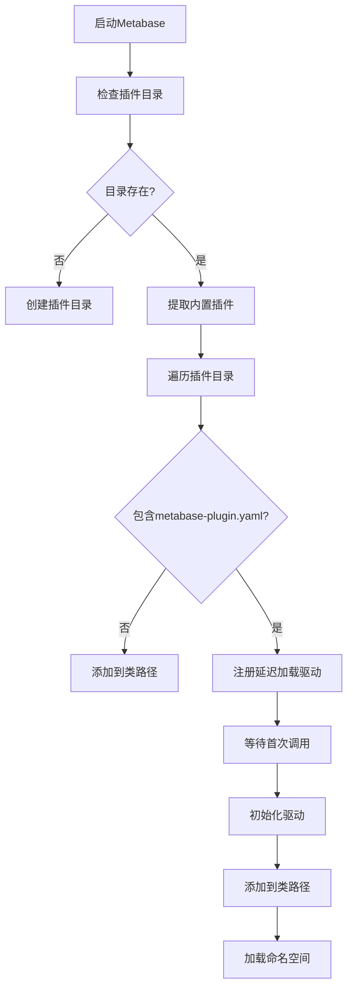
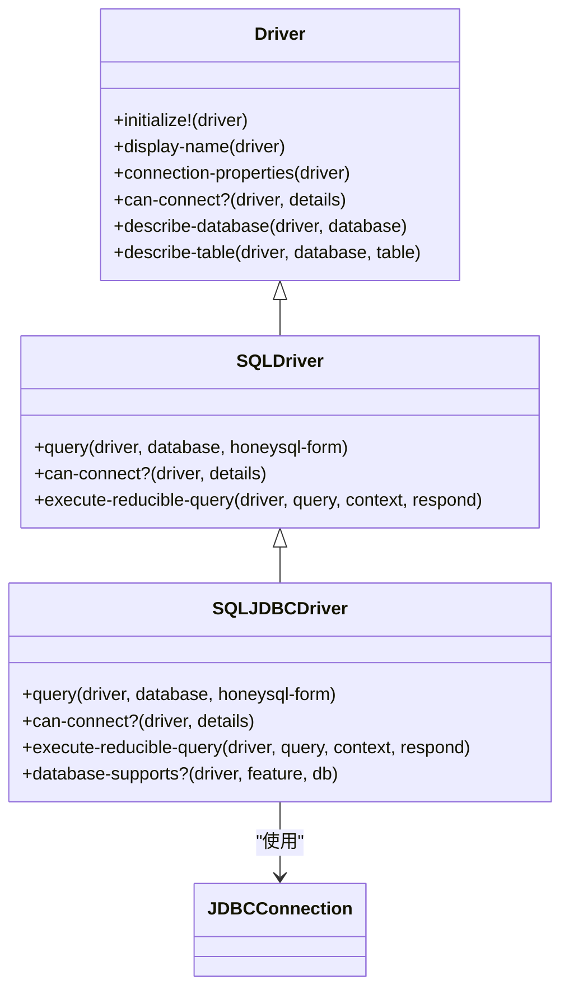
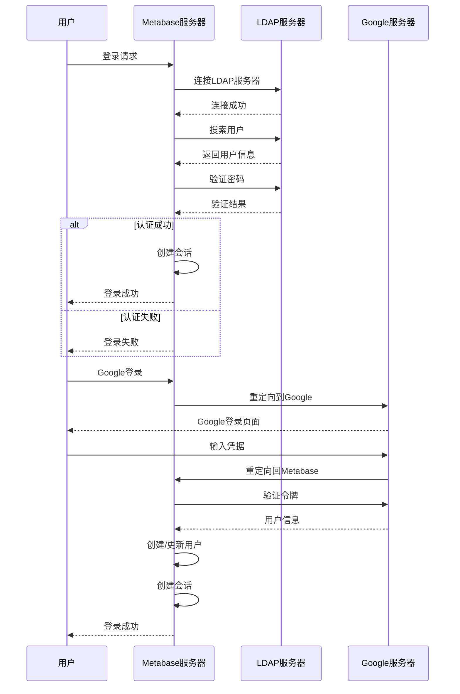
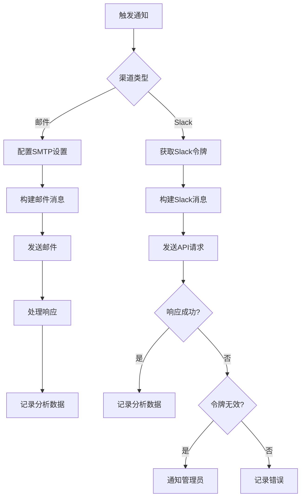
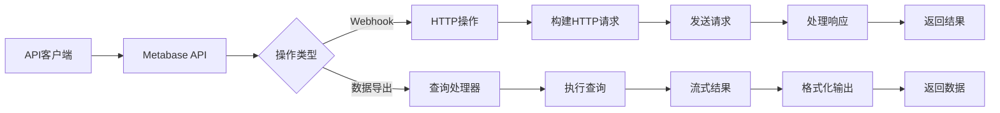
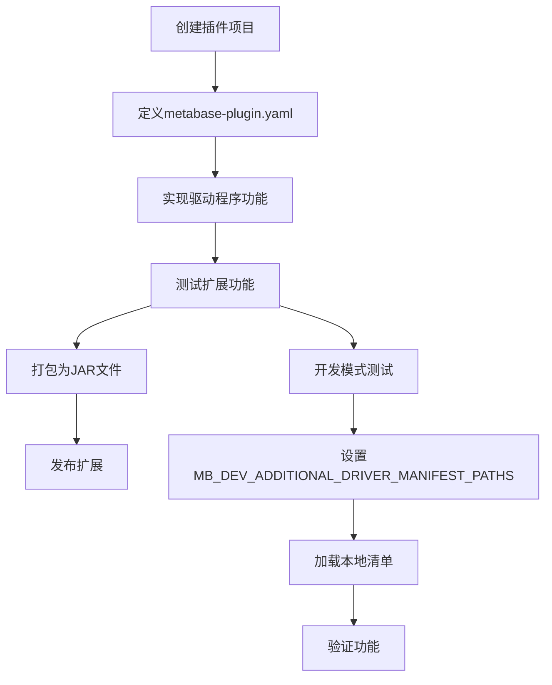

# 扩展与集成

<cite>
**本文档中引用的文件**  
- [core.clj](file://src/metabase/plugins/core.clj)
- [impl.clj](file://src/metabase/plugins/impl.clj)
- [init_steps.clj](file://src/metabase/plugins/init_steps.clj)
- [initialize.clj](file://src/metabase/plugins/initialize.clj)
- [lazy_loaded_driver.clj](file://src/metabase/plugins/lazy_loaded_driver.clj)
- [jdbc_proxy.clj](file://src/metabase/plugins/jdbc_proxy.clj)
- [driver.clj](file://src/metabase/driver.clj)
- [sql_jdbc.clj](file://src/metabase/driver/sql_jdbc.clj)
- [core.clj](file://src/metabase/auth_provider/core.clj)
- [impl.clj](file://src/metabase/auth_provider/impl.clj)
- [core.clj](file://src/metabase/channel/core.clj)
- [email.clj](file://src/metabase/channel/email.clj)
- [slack.clj](file://src/metabase/channel/slack.clj)
- [settings.clj](file://src/metabase/sso/settings.clj)
- [core.clj](file://src/metabase/sso/core.clj)
- [api.clj](file://src/metabase/sso/api.clj)
</cite>

## 目录
1. [插件系统架构](#插件系统架构)
2. [数据库驱动开发指南](#数据库驱动开发指南)
3. [认证提供者扩展机制](#认证提供者扩展机制)
4. [通知渠道扩展](#通知渠道扩展)
5. [API集成最佳实践](#api集成最佳实践)
6. [扩展开发工作流程](#扩展开发工作流程)

## 插件系统架构

Metabase的插件系统基于JAR文件和YAML清单文件实现，支持在运行时动态加载和初始化插件。插件系统的核心组件包括插件发现、加载和初始化流程。

插件系统通过`metabase.plugins.impl`命名空间中的函数实现插件的加载和初始化。系统首先检查插件目录（默认为`./plugins`），创建目录（如果不存在），然后从Metabase uberjar中提取内置插件到插件目录。对于不包含Metabase插件清单的JAR文件，系统直接将其添加到类路径；对于包含`metabase-plugin.yaml`清单文件的JAR文件，系统注册延迟加载的Metabase驱动程序。

**Diagram sources**
- [impl.clj](file://src/metabase/plugins/impl.clj#L176-L199)
- [initialize.clj](file://src/metabase/plugins/initialize.clj#L0-L24)

**Section sources**
- [impl.clj](file://src/metabase/plugins/impl.clj#L176-L199)
- [initialize.clj](file://src/metabase/plugins/initialize.clj#L0-L24)

## 数据库驱动开发指南

Metabase的数据库驱动系统基于多方法（multimethod）架构，允许驱动程序实现特定于数据库的功能。驱动程序必须实现或继承`metabase.driver`命名空间中定义的一些或所有多方法，并通过`register!`函数注册。

驱动程序可以基于父驱动程序继承功能，SQL数据库驱动程序可以使用`:sql`作为父级，JDBC-based SQL驱动程序可以使用`:sql-jdbc`作为父级。系统提供了`metabase.driver.sql`和`metabase.driver.sql-jdbc`命名空间，其中包含子驱动程序应实现的附加多方法。

驱动程序接口包括多个多方法，如`initialize!`、`display-name`、`connection-properties`、`can-connect?`等。`initialize!`方法在首次调用非平凡驱动程序方法时自动调用一次，用于执行一次性初始化（如注册内部使用的JDBC驱动程序）。延迟加载的驱动程序会自动获得`initialize!`方法的实现，该实现执行插件清单中指定的`init-steps`。

**Diagram sources**
- [driver.clj](file://src/metabase/driver.clj#L184-L205)
- [sql_jdbc.clj](file://src/metabase/driver/sql_jdbc.clj#L0-L200)

**Section sources**
- [driver.clj](file://src/metabase/driver.clj#L184-L205)
- [sql_jdbc.clj](file://src/metabase/driver/sql_jdbc.clj#L0-L200)

## 认证提供者扩展机制

Metabase支持通过扩展机制集成第三方身份验证提供者，如LDAP和Google。认证提供者通过`metabase.sso`命名空间中的函数和设置实现。

对于LDAP认证，系统通过`metabase.sso.ldap`命名空间中的函数实现LDAP服务器连接、用户搜索和密码验证。`ldap-enabled`设置控制LDAP认证是否启用，`ldap-host`和`ldap-port`设置指定LDAP服务器的主机和端口。系统还支持LDAP组到Metabase组的映射，允许基于LDAP组成员身份控制用户权限。

对于Google认证，系统通过`metabase.sso.google`命名空间中的函数实现Google Sign-In集成。`google-auth-enabled`设置控制Google认证是否启用，`google-auth-client-id`设置指定Google Sign-In的客户端ID。系统使用OAuth 2.0协议与Google API通信，验证用户身份并创建或更新Metabase用户。

**Diagram sources**
- [settings.clj](file://src/metabase/sso/settings.clj#L132-L162)
- [core.clj](file://src/metabase/sso/core.clj#L0-L43)
- [api.clj](file://src/metabase/sso/api.clj#L0-L15)

**Section sources**
- [settings.clj](file://src/metabase/sso/settings.clj#L132-L162)
- [core.clj](file://src/metabase/sso/core.clj#L0-L43)
- [api.clj](file://src/metabase/sso/api.clj#L0-L15)

## 通知渠道扩展

Metabase的通知系统允许通过不同渠道发送通知，如邮件和Slack。通知渠道通过`metabase.channel`命名空间中的多方法实现，包括`can-connect?`、`render-notification`和`send!`。

邮件通知通过`metabase.channel.email`命名空间实现，使用SMTP协议发送邮件。系统支持配置SMTP主机、端口、用户名、密码和安全设置（TLS、SSL或STARTTLS）。`send-email!`函数负责发送邮件，`send-message-or-throw!`函数处理发送过程中的异常并记录分析数据。

Slack通知通过`metabase.channel.slack`命名空间实现，使用Slack Web API发送消息。系统支持通过Bot用户令牌或App级别令牌进行认证。`POST`函数用于向Slack API发送POST请求，`handle-response`函数处理API响应，检测无效或已撤销的令牌并通知管理员。

**Diagram sources**
- [email.clj](file://src/metabase/channel/email.clj#L0-L199)
- [slack.clj](file://src/metabase/channel/slack.clj#L0-L199)

**Section sources**
- [email.clj](file://src/metabase/channel/email.clj#L0-L199)
- [slack.clj](file://src/metabase/channel/slack.clj#L0-L199)

## API集成最佳实践

Metabase的API集成支持Webhook和数据导出功能。系统通过`metabase.actions`命名空间提供API操作功能，允许执行自定义操作和数据写入。

Webhook支持通过HTTP操作实现，允许向外部系统发送HTTP请求。系统使用`metabase.actions.http-action`命名空间中的函数处理HTTP请求，支持GET、POST、PUT和DELETE方法。开发者可以定义操作参数、请求头和请求体，系统会自动处理响应并返回结果。

数据导出功能通过查询处理器和流式API实现。系统支持将查询结果导出为多种格式，如CSV、JSON和Excel。`execute-reducible-query`多方法允许驱动程序执行可还原的查询，返回可减少的行序列。系统使用`metabase.query-processor.reducible/reducible-rows`函数创建可还原的流式结果。

**Section sources**
- [actions/core.clj](file://src/metabase/actions/core.clj#L0-L62)
- [actions/http-action.clj](file://src/metabase/actions/http_action.clj#L0-L20)

## 扩展开发工作流程

开发、测试和发布Metabase扩展的完整工作流程包括以下步骤：创建插件项目、定义插件清单、实现驱动程序或多方法、测试扩展功能、打包为JAR文件和发布。

插件清单文件`metabase-plugin.yaml`定义了插件的元数据和初始化步骤。清单文件包括插件名称、版本、驱动程序信息和初始化步骤。初始化步骤可以包括加载命名空间和注册JDBC驱动程序。

测试扩展时，建议使用开发模式运行Metabase，通过设置`MB_DEV_ADDITIONAL_DRIVER_MANIFEST_PATHS`环境变量加载本地插件清单。系统会模拟从uberjar加载插件的行为，允许在开发过程中测试插件功能。

**Section sources**
- [init_steps.clj](file://src/metabase/plugins/init_steps.clj#L0-L30)
- [lazy_loaded_driver.clj](file://src/metabase/plugins/lazy_loaded_driver.clj#L0-L31)
- [impl.clj](file://src/metabase/plugins/impl.clj#L127-L148)