# 依赖管理

<cite>
**本文档中引用的文件**
- [dependencies.clj](file://src/metabase/plugins/dependencies.clj)
- [impl.clj](file://src/metabase/plugins/impl.clj)
- [initialize.clj](file://src/metabase/plugins/initialize.clj)
- [init_steps.clj](file://src/metabase/plugins/init_steps.clj)
- [lazy_loaded_driver.clj](file://src/metabase/plugins/lazy_loaded_driver.clj)
- [core.clj](file://src/metabase/plugins/core.clj)
</cite>

## 目录
1. [简介](#简介)
2. [项目结构概览](#项目结构概览)
3. [核心组件分析](#核心组件分析)
4. [架构概览](#架构概览)
5. [详细组件分析](#详细组件分析)
6. [依赖声明格式与语义规则](#依赖声明格式与语义规则)
7. [运行时依赖验证机制](#运行时依赖验证机制)
8. [拓扑排序与循环依赖检测](#拓扑排序与循环依赖检测)
9. [版本兼容性检查](#版本兼容性检查)
10. [依赖传递性控制](#依赖传递性控制)
11. [最佳实践与解决方案](#最佳实践与解决方案)
12. [故障排除指南](#故障排除指南)
13. [总结](#总结)

## 简介

Metabase的插件依赖管理系统是一个复杂而精密的架构，负责处理插件之间的依赖关系、版本兼容性、循环依赖检测以及运行时验证。该系统通过多层次的依赖解析算法确保插件能够正确加载和初始化，同时提供灵活的依赖声明格式和强大的错误处理机制。

本文档深入解析了`dependencies.clj`中定义的依赖解析算法，包括拓扑排序、循环依赖检测和版本兼容性检查等核心功能，并提供了完整的依赖管理最佳实践指导。

## 项目结构概览

Metabase插件依赖管理系统的核心文件组织如下：

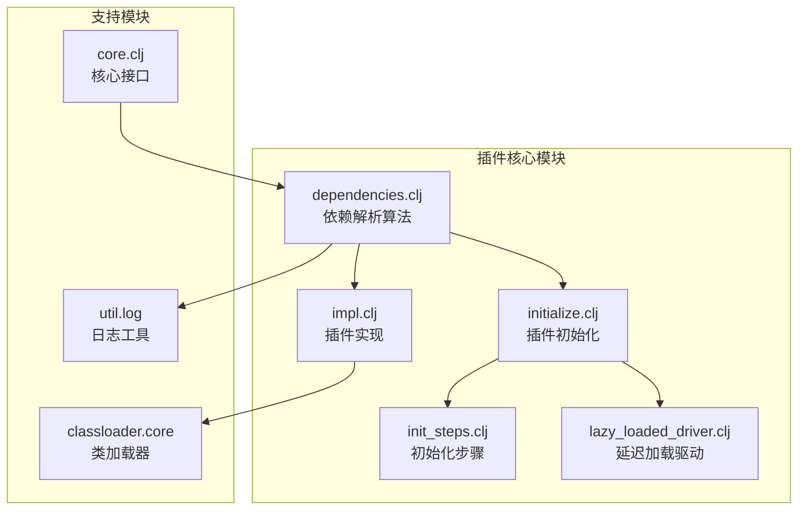

**图表来源**
- [dependencies.clj](file://src/metabase/plugins/dependencies.clj#L1-L117)
- [impl.clj](file://src/metabase/plugins/impl.clj#L1-L201)
- [initialize.clj](file://src/metabase/plugins/initialize.clj#L1-L60)

**章节来源**
- [dependencies.clj](file://src/metabase/plugins/dependencies.clj#L1-L117)
- [impl.clj](file://src/metabase/plugins/impl.clj#L1-L201)

## 核心组件分析

### 依赖类型识别系统

Metabase插件依赖管理系统实现了智能的依赖类型识别机制，能够自动识别三种主要的依赖类型：

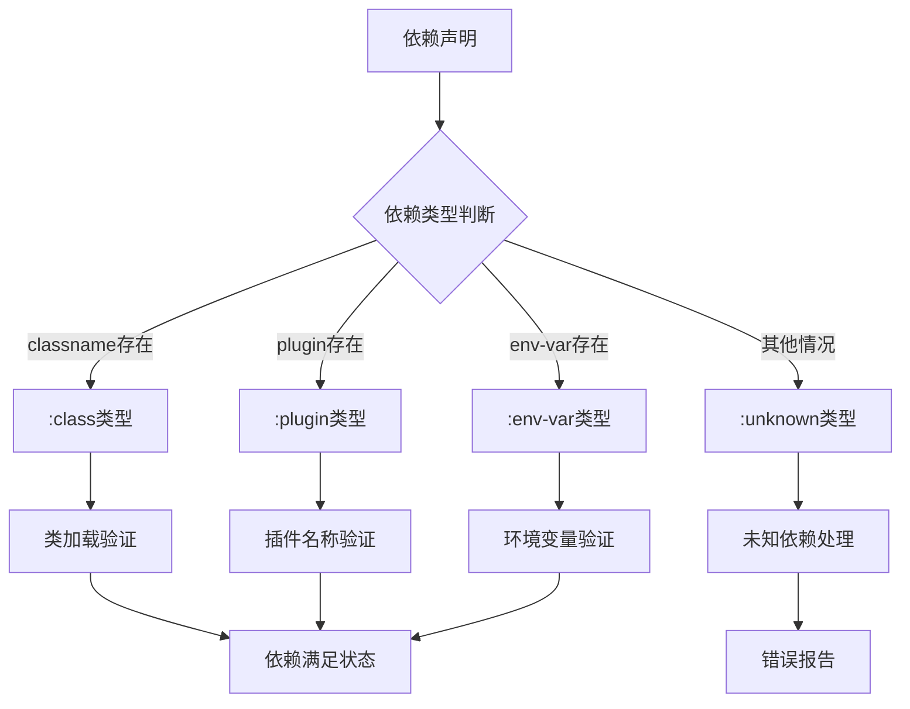

**图表来源**
- [dependencies.clj](file://src/metabase/plugins/dependencies.clj#L18-L26)

### 多方法依赖验证系统

系统采用Clojure的多方法(MultiMethod)机制实现不同类型的依赖验证：

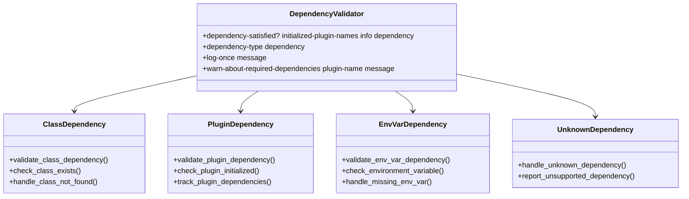

**图表来源**
- [dependencies.clj](file://src/metabase/plugins/dependencies.clj#L28-L117)

**章节来源**
- [dependencies.clj](file://src/metabase/plugins/dependencies.clj#L18-L117)

## 架构概览

Metabase插件依赖管理系统采用分层架构设计，从底层的依赖类型识别到顶层的插件初始化，形成了完整的依赖管理流水线：

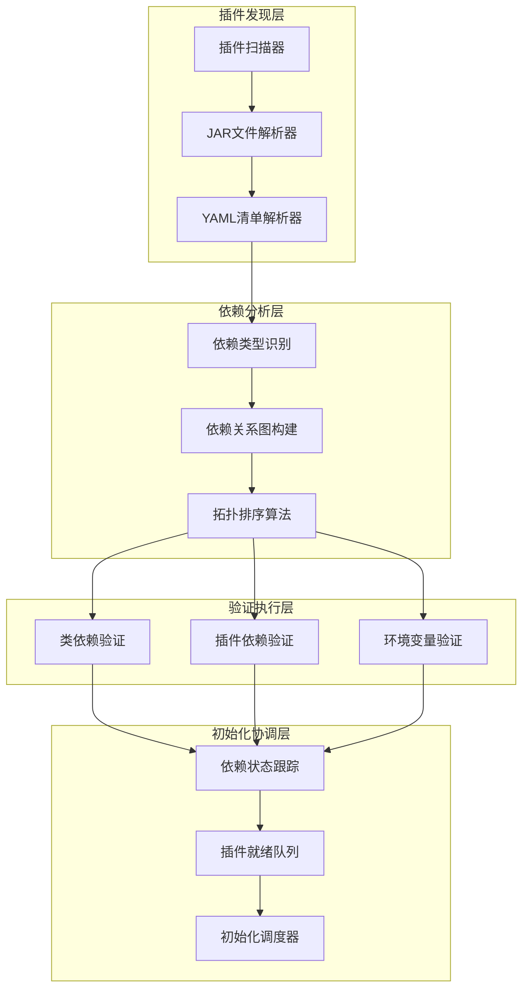

**图表来源**
- [impl.clj](file://src/metabase/plugins/impl.clj#L106-L148)
- [initialize.clj](file://src/metabase/plugins/initialize.clj#L20-L48)

## 详细组件分析

### 依赖解析算法核心

依赖解析算法是整个系统的核心，它实现了复杂的依赖关系处理逻辑：

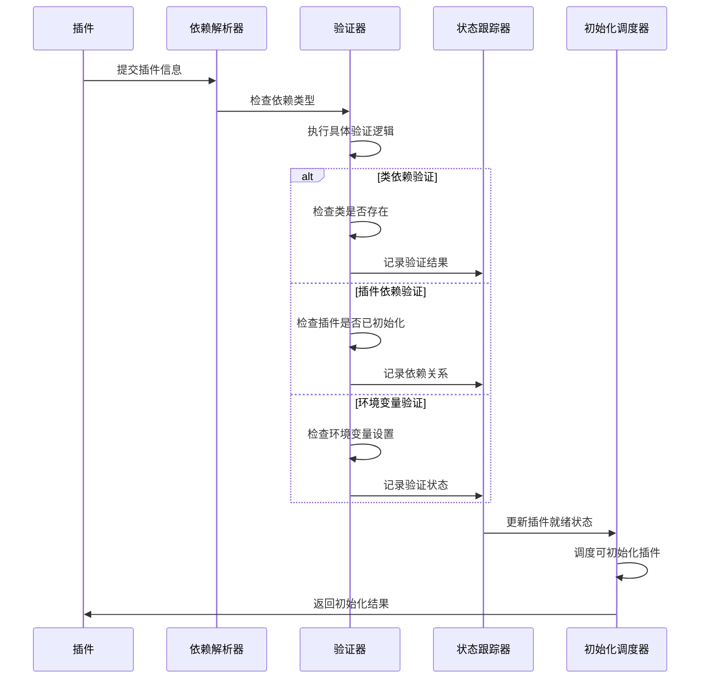

**图表来源**
- [dependencies.clj](file://src/metabase/plugins/dependencies.clj#L75-L117)
- [initialize.clj](file://src/metabase/plugins/initialize.clj#L20-L48)

### 插件就绪状态管理

系统维护了一个原子状态来跟踪插件的初始化状态：

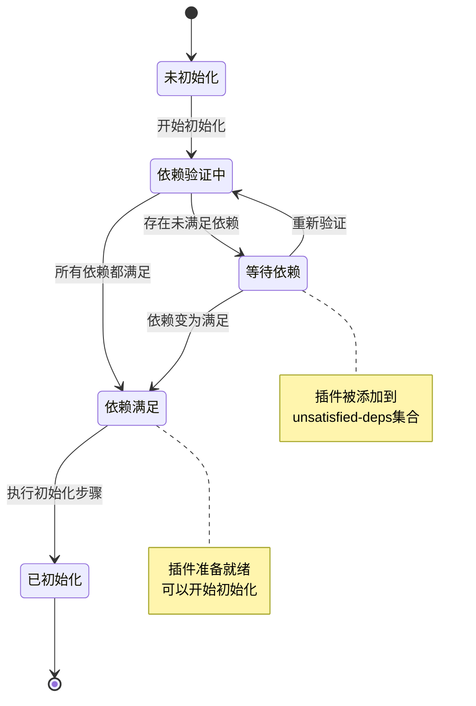

**图表来源**
- [dependencies.clj](file://src/metabase/plugins/dependencies.clj#L10-L12)
- [initialize.clj](file://src/metabase/plugins/initialize.clj#L13-L14)

**章节来源**
- [dependencies.clj](file://src/metabase/plugins/dependencies.clj#L75-L117)
- [initialize.clj](file://src/metabase/plugins/initialize.clj#L20-L48)

## 依赖声明格式与语义规则

### :dependencies键语义

在Metabase插件清单(`metabase-plugin.yaml`)中，`:dependencies`键定义了插件的依赖关系。每个依赖项可以是以下三种类型之一：

#### 类依赖(Class Dependencies)
```yaml
dependencies:
  - class: "com.example.MyClass"
    message: "需要Java 8或更高版本"
```

#### 插件依赖(Plugin Dependencies)
```yaml
dependencies:
  - plugin: "google-drive"
```

#### 环境变量依赖(Environment Variable Dependencies)
```yaml
dependencies:
  - env-var: "GOOGLE_API_KEY"
```

### 依赖声明语法规则

| 依赖类型 | 必需字段 | 可选字段 | 语义说明 |
|---------|---------|---------|----------|
| :class | `class` | `message` | 检查指定类是否存在于类路径中 |
| :plugin | `plugin` | - | 检查指定插件是否已成功初始化 |
| :env-var | `env-var` | - | 检查环境变量是否已设置且非空 |

### 依赖声明最佳实践

1. **明确的错误消息**: 为每个依赖声明提供清晰的错误消息
2. **合理的依赖顺序**: 将强依赖放在弱依赖之前
3. **最小化依赖**: 只声明必要的依赖关系
4. **向后兼容**: 考虑版本兼容性问题

**章节来源**
- [dependencies.clj](file://src/metabase/plugins/dependencies.clj#L18-L26)
- [dependencies.clj](file://src/metabase/plugins/dependencies.clj#L41-L46)

## 运行时依赖验证机制

### 依赖验证流程

运行时依赖验证采用多阶段验证机制，确保插件能够在运行时正常工作：

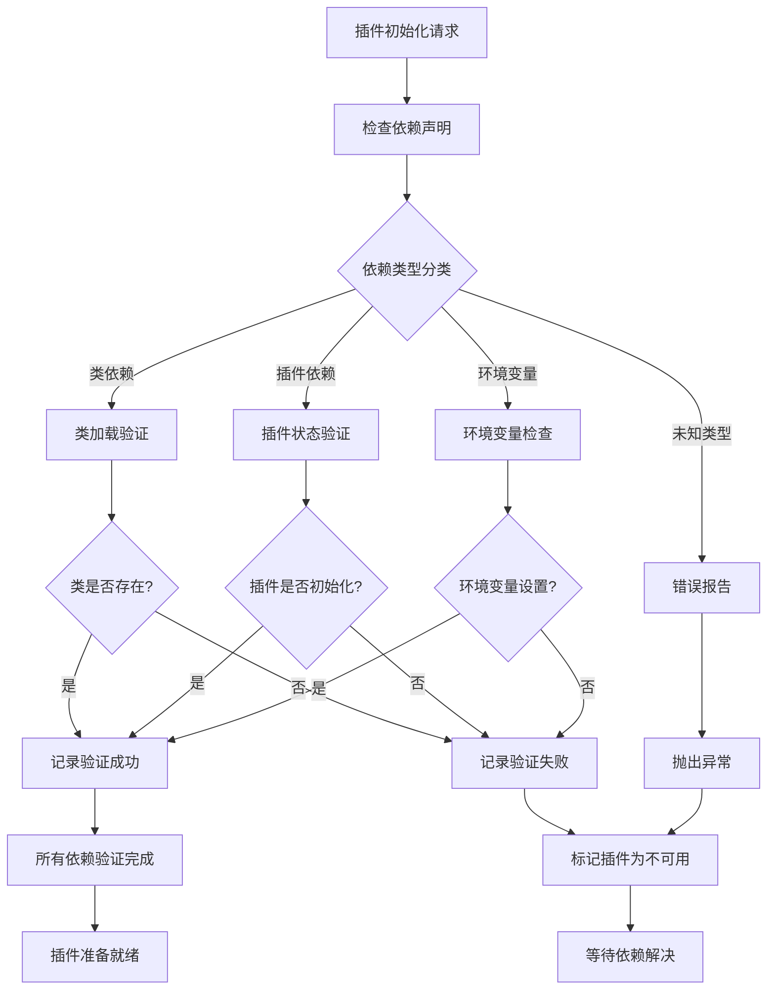

**图表来源**
- [dependencies.clj](file://src/metabase/plugins/dependencies.clj#L28-L117)

### 缺失依赖错误提示策略

系统实现了智能的错误提示机制，能够提供详细的诊断信息：

#### 错误分类与处理

| 错误类型 | 错误消息格式 | 处理策略 |
|---------|-------------|----------|
| 类不存在 | `"Class not found: {classname}"` | 记录详细错误信息，建议检查JAR包 |
| 插件未初始化 | `"Plugin '{plugin}' depends on plugin '{dependency}'"` | 提示用户安装依赖插件 |
| 环境变量缺失 | `"Environment variable '{var}' not set"` | 指导用户配置环境变量 |
| 未知依赖类型 | `"Plugin declares unsupported dependency type"` | 引导用户参考文档 |

### 日志记录与重复抑制

系统采用了智能的日志记录机制，避免重复信息：

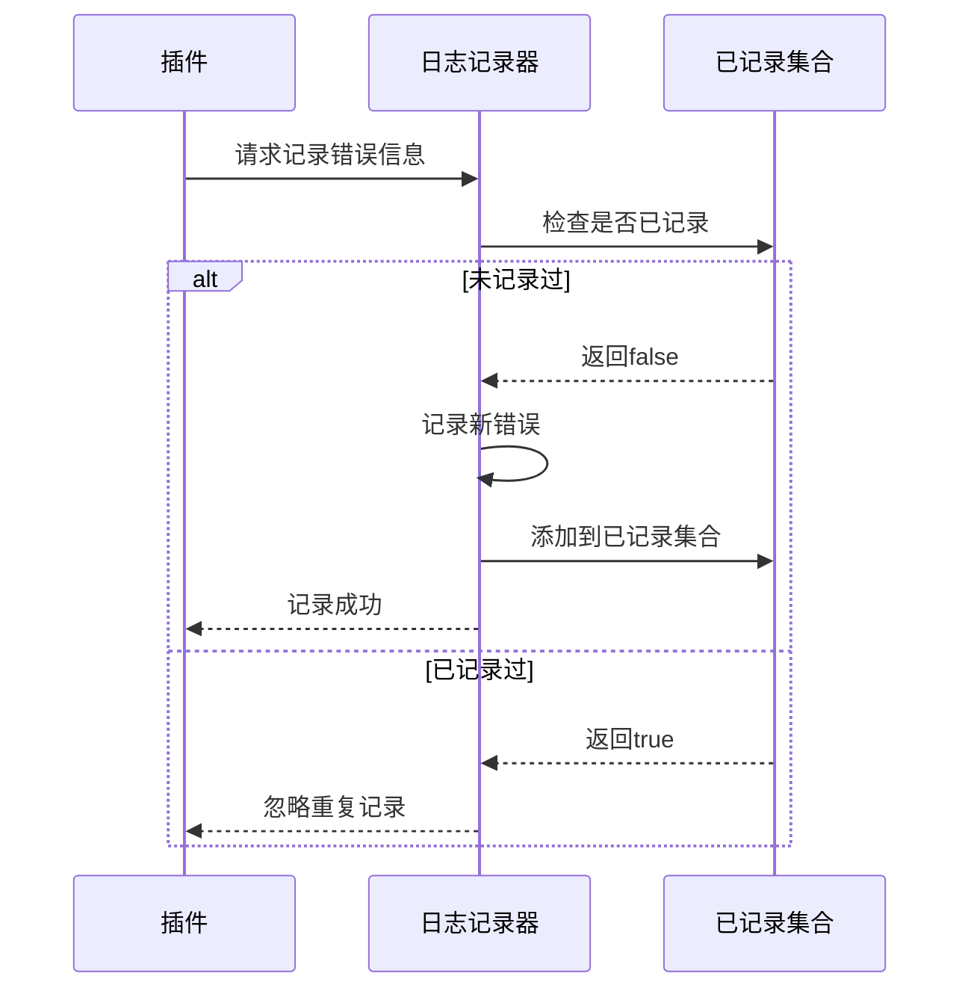

**图表来源**
- [dependencies.clj](file://src/metabase/plugins/dependencies.clj#L48-L62)

**章节来源**
- [dependencies.clj](file://src/metabase/plugins/dependencies.clj#L28-L117)

## 拓扑排序与循环依赖检测

### 拓扑排序算法实现

虽然当前的依赖管理系统没有显式的拓扑排序函数，但它实现了类似的依赖解析逻辑：

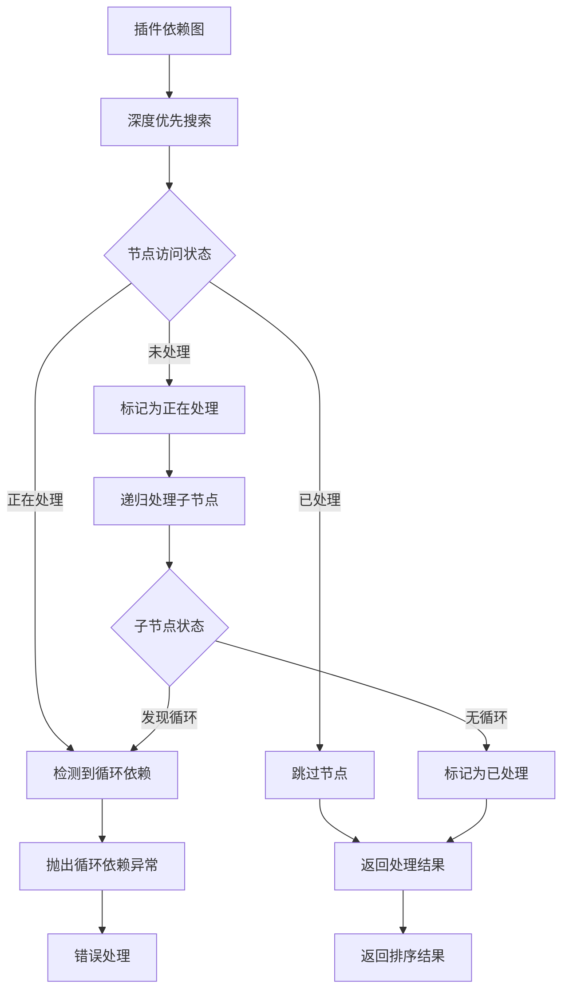

**图表来源**
- [dependencies.clj](file://src/metabase/plugins/dependencies.clj#L75-L117)

### 循环依赖检测机制

系统通过状态跟踪实现了隐式的循环依赖检测：

1. **处理状态跟踪**: 使用`processing`集合跟踪正在处理的节点
2. **已完成状态跟踪**: 使用`processed`集合跟踪已完成处理的节点
3. **循环检测**: 当遇到已在处理状态的节点时，检测到循环

### 依赖解析顺序优化

系统按照以下优先级处理插件：

1. **无插件清单的JAR**: 优先加载基础依赖库
2. **有插件清单的JAR**: 延迟加载，按依赖关系排序
3. **本地开发插件**: 支持热重载和调试

**章节来源**
- [impl.clj](file://src/metabase/plugins/impl.clj#L106-L148)

## 版本兼容性检查

### 版本兼容性策略

虽然当前实现主要关注依赖关系而非版本兼容性，但系统设计考虑了版本管理的需求：

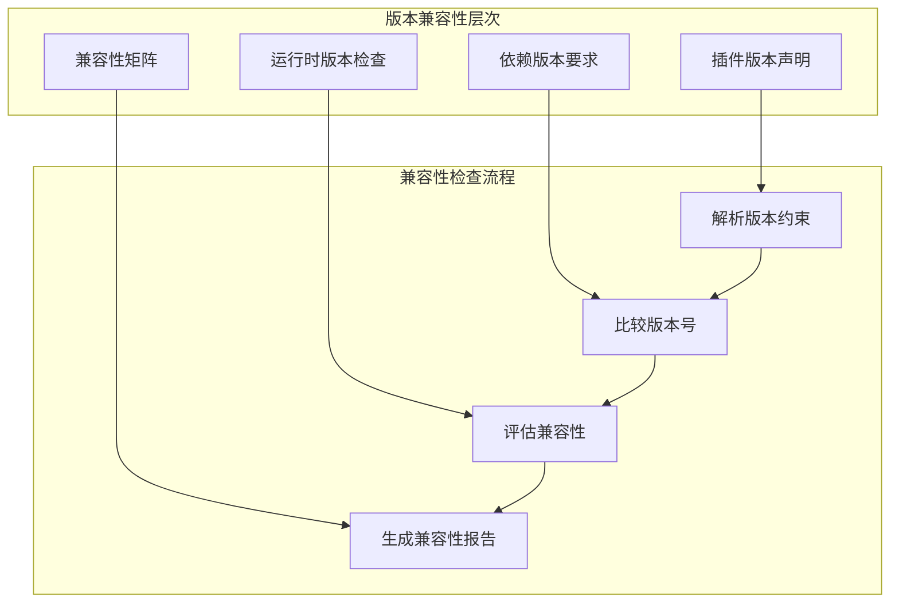

### 版本范围定义最佳实践

1. **语义化版本控制**: 使用`MAJOR.MINOR.PATCH`格式
2. **版本约束语法**: 支持`>=`, `<=`, `~>`, `=`等操作符
3. **向后兼容性**: 默认保持向后兼容
4. **破坏性变更**: 明确标记主要版本变更

### 兼容性检查扩展点

系统为未来的版本兼容性检查预留了扩展点：

```clojure
;; 示例：版本兼容性检查接口
(defmulti ^:private version-compatible?
  {:arglists '([plugin-version dependency-version])}
  (fn [pv dv] [(version-type pv) (version-type dv)]))

(defmethod version-compatible? :default
  [plugin-version dependency-version]
  (compare-versions plugin-version dependency-version))
```

## 依赖传递性控制

### 传递性控制机制

Metabase插件系统通过多种机制控制依赖的传递性：

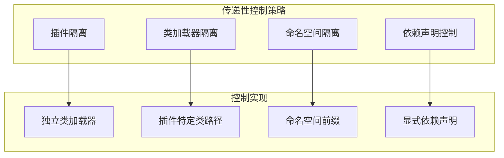

### 依赖隔离策略

1. **类加载器隔离**: 每个插件使用独立的类加载器
2. **命名空间隔离**: 避免命名空间冲突
3. **资源隔离**: 独立的资源文件访问
4. **配置隔离**: 独立的配置管理

### 依赖声明优化

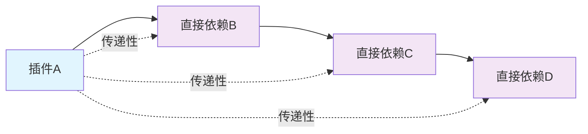

**图表来源**
- [lazy_loaded_driver.clj](file://src/metabase/plugins/lazy_loaded_driver.clj#L55-L73)

**章节来源**
- [lazy_loaded_driver.clj](file://src/metabase/plugins/lazy_loaded_driver.clj#L55-L73)

## 最佳实践与解决方案

### 依赖冲突解决方案

当遇到依赖冲突时，系统提供了多种解决方案：

#### 解决方案分类

| 冲突类型 | 解决策略 | 实现方式 |
|---------|---------|----------|
| 类版本冲突 | 类加载器隔离 | 独立类加载器实例 |
| 插件版本冲突 | 依赖声明优化 | 显式版本要求 |
| 环境变量冲突 | 配置覆盖 | 环境变量优先级 |
| 资源文件冲突 | 命名空间隔离 | 唯一命名空间 |

#### 冲突检测与处理流程

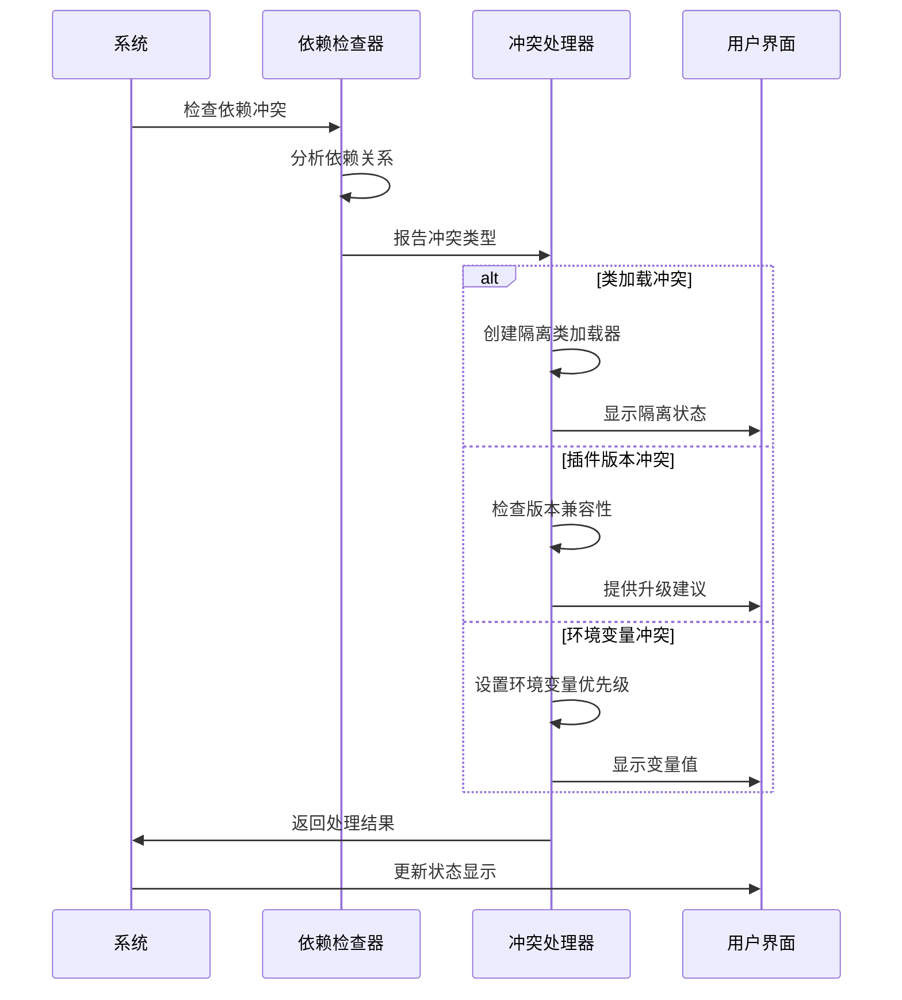

### 性能优化策略

1. **延迟加载**: 插件仅在需要时加载
2. **缓存机制**: 缓存依赖验证结果
3. **并行处理**: 并行验证独立依赖
4. **增量更新**: 仅重新验证变化的依赖

### 调试与监控

系统提供了丰富的调试和监控功能：

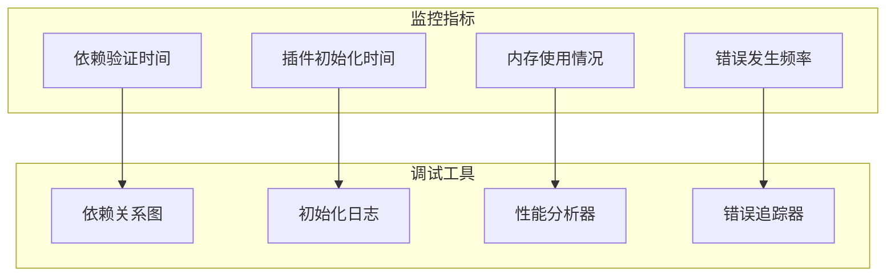

**章节来源**
- [dependencies.clj](file://src/metabase/plugins/dependencies.clj#L75-L117)
- [initialize.clj](file://src/metabase/plugins/initialize.clj#L20-L48)

## 故障排除指南

### 常见依赖问题及解决方案

#### 问题分类与诊断

| 问题类型 | 症状 | 诊断方法 | 解决方案 |
|---------|------|---------|----------|
| 类找不到 | ClassNotFoundException | 检查JAR包包含 | 添加缺失的依赖JAR |
| 插件未初始化 | 插件依赖错误 | 检查插件加载顺序 | 安装或启用依赖插件 |
| 环境变量缺失 | 环境变量验证失败 | 检查环境配置 | 设置必需的环境变量 |
| 循环依赖 | 初始化卡死 | 分析依赖图 | 重构依赖关系 |

#### 诊断工具使用

1. **依赖关系可视化**: 查看插件间的依赖关系
2. **初始化状态跟踪**: 监控插件初始化进度
3. **错误日志分析**: 分析详细的错误信息
4. **性能监控**: 监控依赖验证性能

### 错误恢复机制

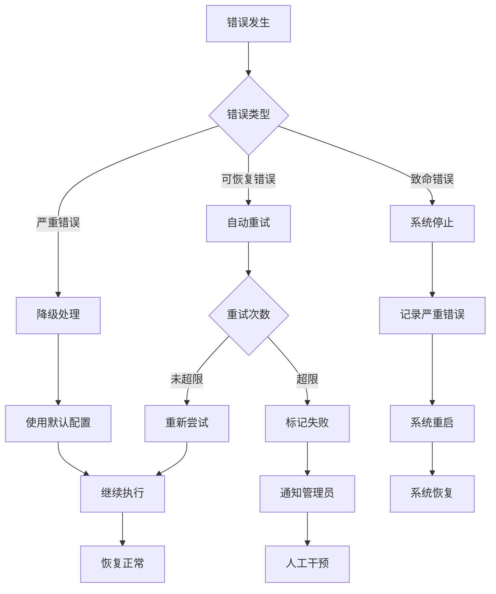

**章节来源**
- [dependencies.clj](file://src/metabase/plugins/dependencies.clj#L48-L62)

## 总结

Metabase的插件依赖管理系统是一个高度复杂和精密的架构，它成功地解决了插件生态系统中的关键挑战：

### 核心优势

1. **智能依赖识别**: 自动识别和处理多种类型的依赖
2. **强大的验证机制**: 提供全面的运行时依赖验证
3. **灵活的错误处理**: 智能的错误提示和恢复策略
4. **优秀的性能特性**: 延迟加载和并行处理优化
5. **完善的调试支持**: 丰富的诊断和监控功能

### 设计亮点

- **多方法架构**: 利用Clojure的多方法实现灵活的依赖验证
- **状态管理**: 使用原子操作确保线程安全的状态管理
- **日志优化**: 智能的日志记录避免重复信息
- **扩展性设计**: 为未来功能扩展预留了充分的空间

### 应用价值

该依赖管理系统不仅保证了Metabase插件生态系统的稳定性和可靠性，还为开发者提供了强大而易用的插件开发框架。通过深入理解这些机制，开发者可以更好地设计和实现高质量的Metabase插件，同时避免常见的依赖问题。

这个系统的设计理念和实现技术对于构建大型软件系统的依赖管理具有重要的参考价值，特别是在需要处理复杂依赖关系和版本兼容性的场景中。