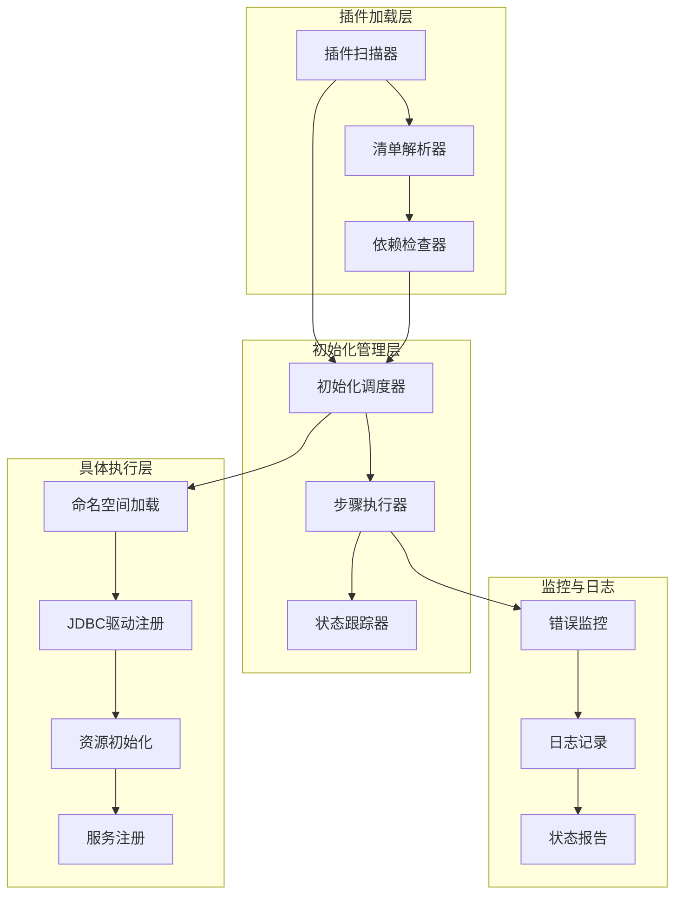
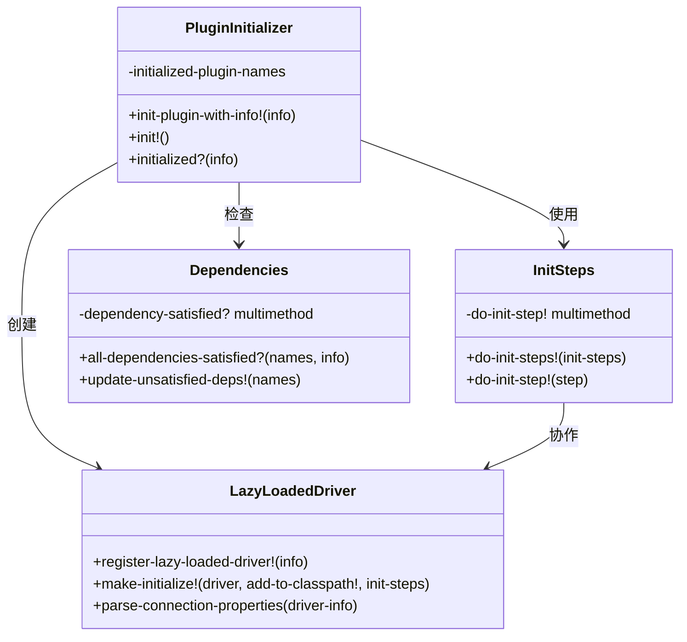
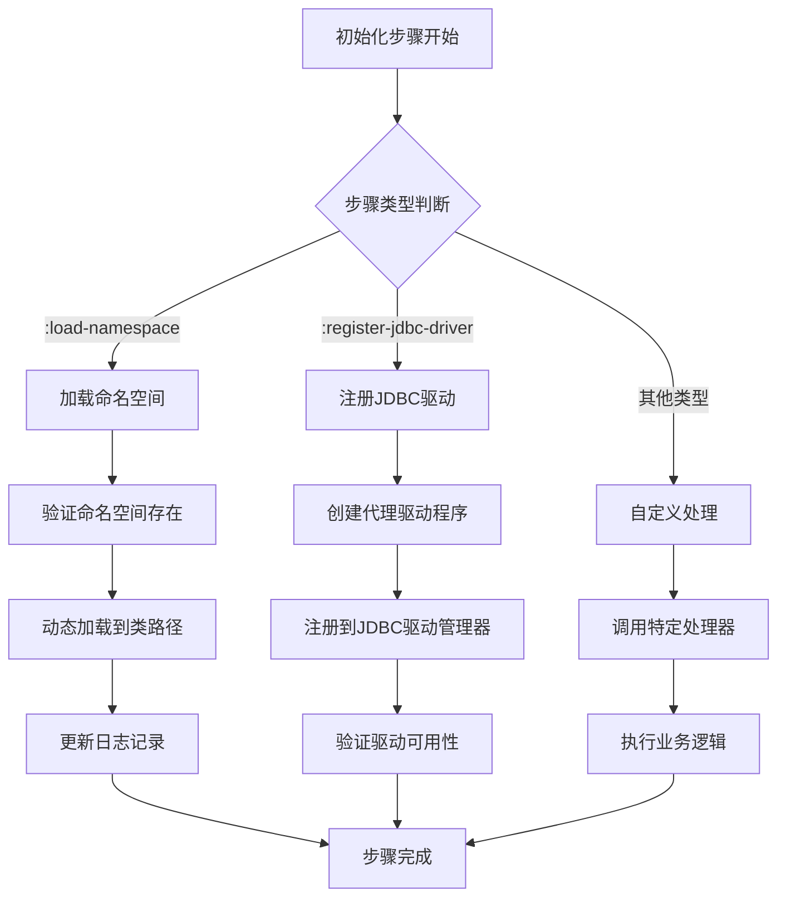
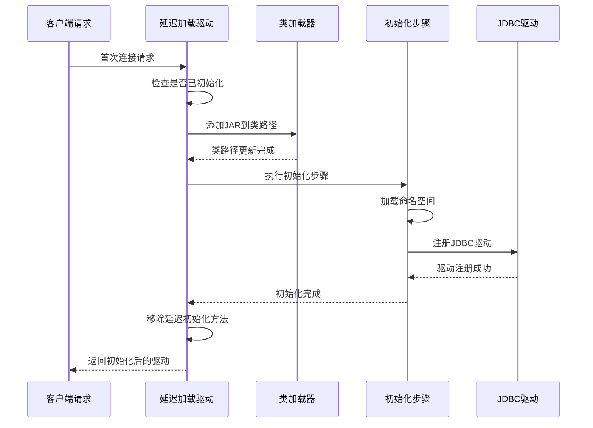
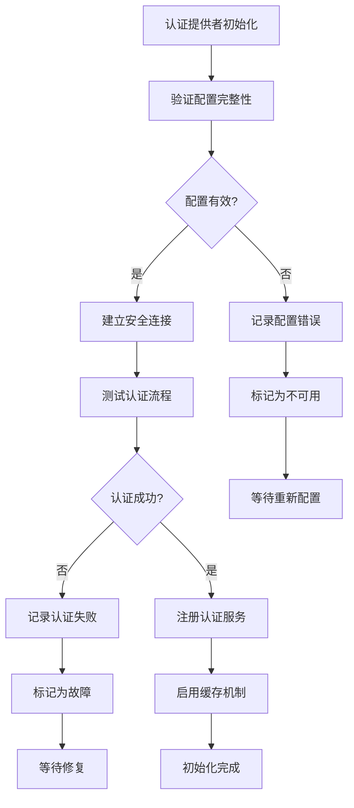
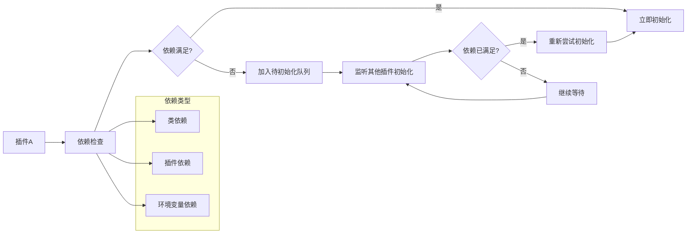
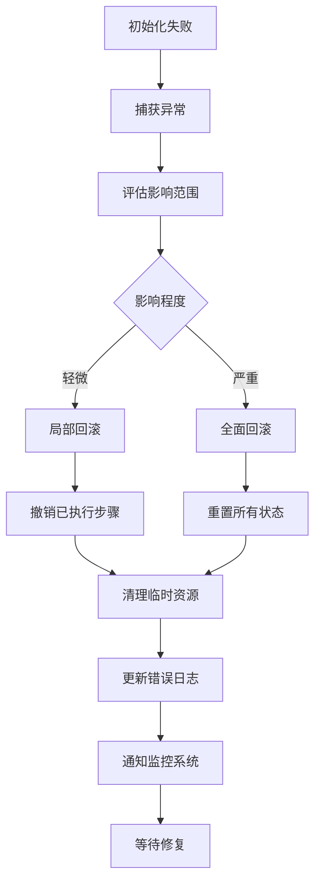
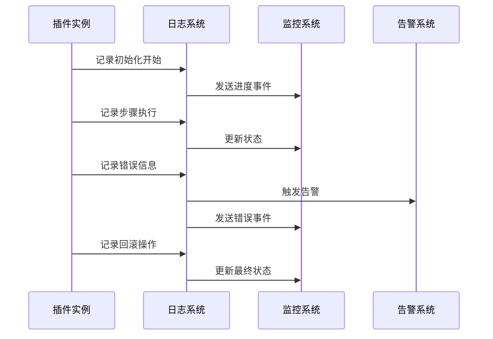
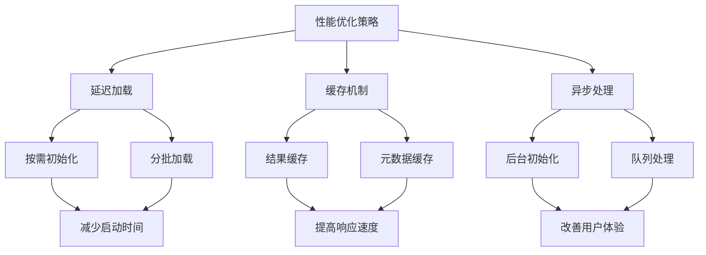
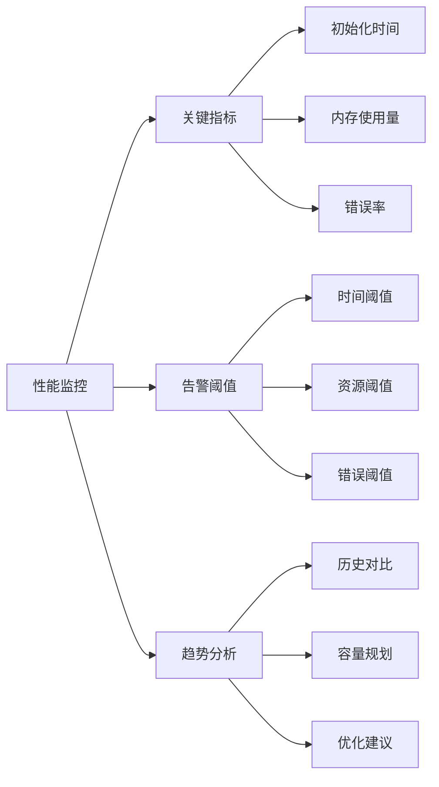

# Metabase插件初始化技术文档

<cite>
**本文档中引用的文件**
- [init_steps.clj](file://src/metabase/plugins/init_steps.clj)
- [initialize.clj](file://src/metabase/plugins/initialize.clj)
- [lazy_loaded_driver.clj](file://src/metabase/plugins/lazy_loaded_driver.clj)
- [dependencies.clj](file://src/metabase/plugins/dependencies.clj)
- [impl.clj](file://src/metabase/plugins/impl.clj)
- [core.clj](file://src/metabase/plugins/core.clj)
</cite>

## 目录
1. [概述](#概述)
2. [插件初始化架构](#插件初始化架构)
3. [初始化步骤机制](#初始化步骤机制)
4. [插件类型与初始化差异](#插件类型与初始化差异)
5. [依赖管理与回滚策略](#依赖管理与回滚策略)
6. [错误处理与日志记录](#错误处理与日志记录)
7. [最佳实践指南](#最佳实践指南)
8. [故障排除指南](#故障排除指南)
9. [总结](#总结)

## 概述

Metabase插件初始化是一个复杂而精密的过程，涉及多个层次的协调工作。该系统采用分阶段、可扩展的设计模式，支持多种插件类型（数据库驱动、认证提供者等），并具备完善的错误处理和回滚机制。

插件初始化过程主要包含三个核心阶段：预初始化（pre-init）、初始化（init）和后初始化（post-init）。每个阶段都有明确的职责划分，并通过多态分发机制实现不同类型插件的差异化处理。

## 插件初始化架构

### 系统架构概览



**图表来源**
- [impl.clj](file://src/metabase/plugins/impl.clj#L176-L199)
- [initialize.clj](file://src/metabase/plugins/initialize.clj#L17-L48)

### 核心组件关系



**图表来源**
- [initialize.clj](file://src/metabase/plugins/initialize.clj#L17-L48)
- [init_steps.clj](file://src/metabase/plugins/init_steps.clj#L17-L31)
- [lazy_loaded_driver.clj](file://src/metabase/plugins/lazy_loaded_driver.clj#L55-L93)

**章节来源**
- [impl.clj](file://src/metabase/plugins/impl.clj#L176-L199)
- [initialize.clj](file://src/metabase/plugins/initialize.clj#L1-L24)

## 初始化步骤机制

### 多态分发定义

Metabase使用Clojure的多态函数（multimethod）机制来实现初始化步骤的动态分发。这种设计允许不同类型的插件根据其特性执行特定的初始化逻辑。



**图表来源**
- [init_steps.clj](file://src/metabase/plugins/init_steps.clj#L17-L31)

### 初始化步骤类型详解

| 步骤类型 | 功能描述 | 执行时机 | 错误处理 |
|---------|---------|---------|---------|
| `:load-namespace` | 加载插件命名空间到运行时环境 | 预初始化阶段 | 记录错误并跳过 |
| `:register-jdbc-driver` | 注册JDBC驱动程序 | 初始化阶段 | 抛出异常阻止后续步骤 |
| 自定义步骤 | 插件特定的初始化逻辑 | 后初始化阶段 | 根据插件类型决定处理策略 |

**章节来源**
- [init_steps.clj](file://src/metabase/plugins/init_steps.clj#L17-L31)

## 插件类型与初始化差异

### 数据库驱动插件

数据库驱动插件是最复杂的插件类型，需要特殊的初始化处理以确保性能和稳定性。



**图表来源**
- [lazy_loaded_driver.clj](file://src/metabase/plugins/lazy_loaded_driver.clj#L55-L73)

### 认证提供者插件

认证提供者插件专注于安全性和可靠性，具有严格的初始化要求。



**图表来源**
- [driver.clj](file://src/metabase/driver.clj#L1074-L1102)

### 其他插件类型

| 插件类型 | 初始化特点 | 资源需求 | 并发处理 |
|---------|-----------|---------|---------|
| 数据库驱动 | 延迟加载，按需初始化 | 中等内存，网络连接 | 支持并发连接 |
| 认证提供者 | 强制同步初始化 | 低内存，安全通道 | 不支持并发 |
| 数据转换器 | 静态配置初始化 | 极低内存，CPU密集 | 支持并行处理 |
| 可视化插件 | 快速加载初始化 | 低内存，静态资源 | 支持并行加载 |

**章节来源**
- [lazy_loaded_driver.clj](file://src/metabase/plugins/lazy_loaded_driver.clj#L72-L93)
- [driver.clj](file://src/metabase/driver.clj#L184-L205)

## 依赖管理与回滚策略

### 依赖检查机制



**图表来源**
- [dependencies.clj](file://src/metabase/plugins/dependencies.clj#L91-L115)

### 回滚策略实现

当插件初始化失败时，系统会执行以下回滚操作：

1. **状态恢复**：撤销部分初始化的操作
2. **资源清理**：释放已分配的系统资源
3. **依赖解除**：移除对其他组件的依赖引用
4. **通知机制**：向监控系统报告失败状态



**图表来源**
- [dependencies.clj](file://src/metabase/plugins/dependencies.clj#L32-L58)

**章节来源**
- [dependencies.clj](file://src/metabase/plugins/dependencies.clj#L91-L115)

## 错误处理与日志记录

### 错误分类与处理策略

| 错误类型 | 处理策略 | 日志级别 | 恢复机制 |
|---------|---------|---------|---------|
| 配置错误 | 记录并跳过 | WARN | 手动修复后重启 |
| 依赖缺失 | 延迟初始化 | INFO | 等待依赖解决 |
| 类加载失败 | 抛出异常 | ERROR | 系统级回滚 |
| 运行时异常 | 局部恢复 | DEBUG | 重试机制 |

### 日志记录机制



**图表来源**
- [dependencies.clj](file://src/metabase/plugins/dependencies.clj#L32-L58)

**章节来源**
- [dependencies.clj](file://src/metabase/plugins/dependencies.clj#L32-L58)

## 最佳实践指南

### 插件开发最佳实践

1. **初始化步骤设计**
   - 将耗时操作放在延迟初始化阶段
   - 确保初始化步骤的幂等性
   - 提供详细的错误信息和恢复建议

2. **资源管理**
   - 使用连接池管理数据库连接
   - 实现优雅的资源释放机制
   - 监控资源使用情况

3. **配置验证**
   - 在初始化前验证所有必需配置
   - 提供默认值和配置示例
   - 支持配置热更新

### 性能优化建议



### 集成方式指南

1. **与系统组件集成**
   - 遵循Metabase的插件接口规范
   - 实现必要的回调函数
   - 处理并发访问控制

2. **与外部系统集成**
   - 实现重试和熔断机制
   - 支持配置化的连接参数
   - 提供健康检查接口

**章节来源**
- [impl.clj](file://src/metabase/plugins/impl.clj#L176-L199)
- [initialize.clj](file://src/metabase/plugins/initialize.clj#L17-L48)

## 故障排除指南

### 常见问题诊断

| 问题症状 | 可能原因 | 诊断方法 | 解决方案 |
|---------|---------|---------|---------|
| 插件加载失败 | 清单文件格式错误 | 检查YAML语法 | 修正清单文件 |
| 依赖冲突 | 版本不兼容 | 查看依赖树 | 升级或降级依赖 |
| 初始化超时 | 资源竞争 | 分析日志时间线 | 优化资源分配 |
| 内存泄漏 | 资源未正确释放 | 内存分析工具 | 修复资源管理 |

### 调试技巧

1. **启用详细日志**
   ```bash
   export MB_LOG_LEVEL=DEBUG
   ```

2. **使用开发模式**
   ```bash
   export MB_DEV_MODE=true
   ```

3. **监控系统指标**
   - CPU使用率
   - 内存占用
   - 网络连接数
   - 错误率统计

### 性能监控



## 总结

Metabase插件初始化系统是一个高度模块化和可扩展的架构，通过精心设计的分阶段初始化机制，支持多种插件类型的差异化处理。系统具备完善的依赖管理、错误处理和回滚策略，确保了插件系统的稳定性和可靠性。

关键特性包括：
- **分阶段初始化**：pre-init、init、post-init三个明确阶段
- **多态分发**：支持不同类型插件的定制化处理
- **依赖管理**：智能的依赖检查和延迟初始化
- **错误处理**：完善的错误捕获和回滚机制
- **性能优化**：延迟加载和资源管理策略

通过遵循本文档提供的最佳实践和故障排除指南，开发者可以构建高质量、高性能的Metabase插件，为用户提供卓越的数据分析体验。