# 插件加载流程

<cite>
**本文档中引用的文件**
- [lazy_loaded_driver.clj](file://src/metabase/plugins/lazy_loaded_driver.clj)
- [jdbc_proxy.clj](file://src/metabase/plugins/jdbc_proxy.clj)
- [core.clj](file://src/metabase/plugins/core.clj)
- [dependencies.clj](file://src/metabase/plugins/dependencies.clj)
- [impl.clj](file://src/metabase/plugins/impl.clj)
- [initialize.clj](file://src/metabase/plugins/initialize.clj)
- [init_steps.clj](file://src/metabase/plugins/init_steps.clj)
- [classloader/core.clj](file://src/metabase/classloader/core.clj)
- [classloader/impl.clj](file://src/metabase/classloader/impl.clj)
</cite>

## 目录
1. [概述](#概述)
2. [系统架构](#系统架构)
3. [类加载器隔离机制](#类加载器隔离机制)
4. [延迟加载驱动实现](#延迟加载驱动实现)
5. [JDBC代理模式](#jdbc代理模式)
6. [插件依赖解析](#插件依赖解析)
7. [插件初始化流程](#插件初始化流程)
8. [资源管理与垃圾回收](#资源管理与垃圾回收)
9. [最佳实践](#最佳实践)
10. [故障排除指南](#故障排除指南)

## 概述

Metabase的插件加载系统是一个复杂而精密的架构，旨在确保插件依赖的独立性和版本冲突的避免。该系统通过多层隔离机制、延迟加载策略和智能依赖解析，为Metabase提供了强大而灵活的扩展能力。

核心设计理念包括：
- **类加载器隔离**：每个插件使用独立的类加载器，防止类冲突
- **延迟加载**：非关键组件在需要时才加载，优化启动性能
- **依赖管理**：智能解析和解决插件间的依赖关系
- **资源隔离**：确保插件资源不会相互干扰

## 系统架构

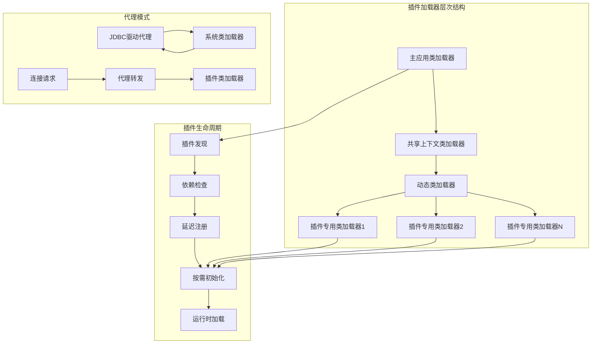

**图表来源**
- [classloader/impl.clj](file://src/metabase/classloader/impl.clj#L26-L45)
- [lazy_loaded_driver.clj](file://src/metabase/plugins/lazy_loaded_driver.clj#L55-L73)

## 类加载器隔离机制

### 动态类加载器架构

Metabase使用分层的类加载器架构来确保插件间的完全隔离：

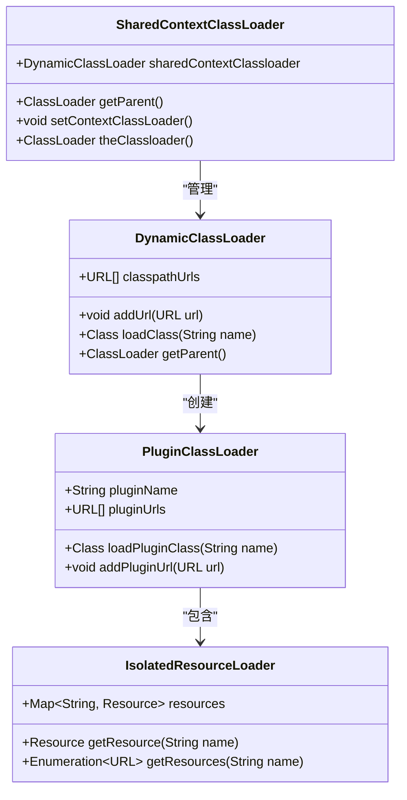

**图表来源**
- [classloader/impl.clj](file://src/metabase/classloader/impl.clj#L26-L74)
- [classloader/impl.clj](file://src/metabase/classloader/impl.clj#L112-L138)

### 类加载器层次结构

系统采用以下层次结构：

1. **平台类加载器**：Java标准库类
2. **系统类加载器**：应用程序类路径
3. **共享上下文类加载器**：Metabase核心类
4. **动态类加载器**：运行时扩展点
5. **插件专用类加载器**：每个插件独立实例

### 资源隔离策略

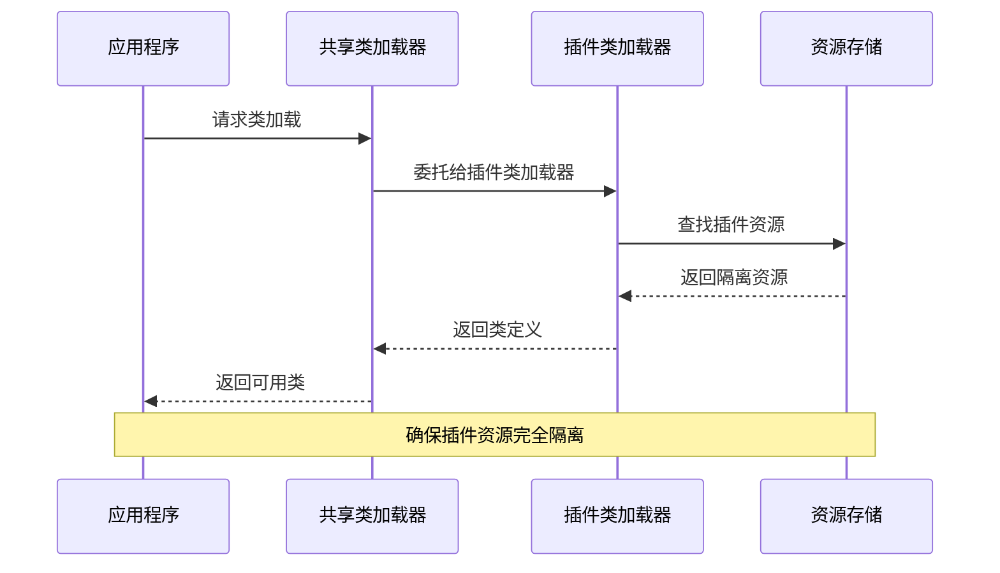

**图表来源**
- [classloader/impl.clj](file://src/metabase/classloader/impl.clj#L73-L93)
- [classloader/impl.clj](file://src/metabase/classloader/impl.clj#L112-L138)

**章节来源**
- [classloader/impl.clj](file://src/metabase/classloader/impl.clj#L26-L166)

## 延迟加载驱动实现

### 延迟加载机制原理

Metabase的延迟加载驱动系统通过创建轻量级的占位符驱动来实现，只有在真正需要时才进行完整初始化。

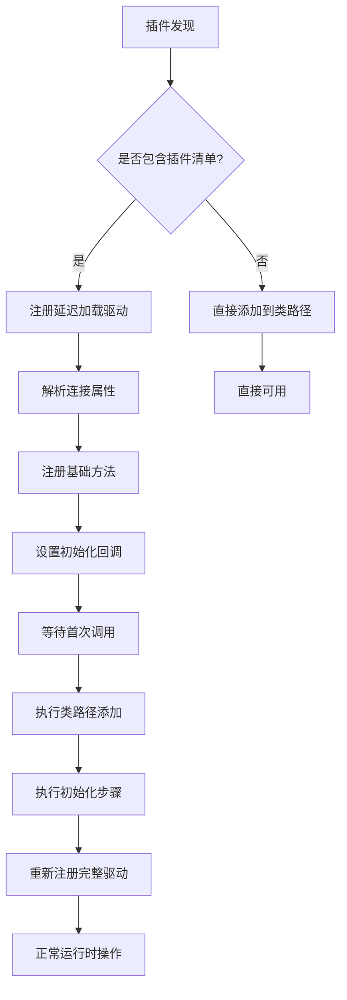

**图表来源**
- [lazy_loaded_driver.clj](file://src/metabase/plugins/lazy_loaded_driver.clj#L55-L73)
- [initialize.clj](file://src/metabase/plugins/initialize.clj#L15-L48)

### 连接属性解析

延迟加载驱动系统能够智能解析和验证连接属性：

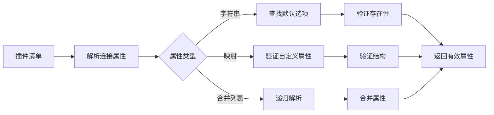

**图表来源**
- [lazy_loaded_driver.clj](file://src/metabase/plugins/lazy_loaded_driver.clj#L22-L54)

### 初始化回调机制

延迟加载驱动的核心是智能的初始化回调：

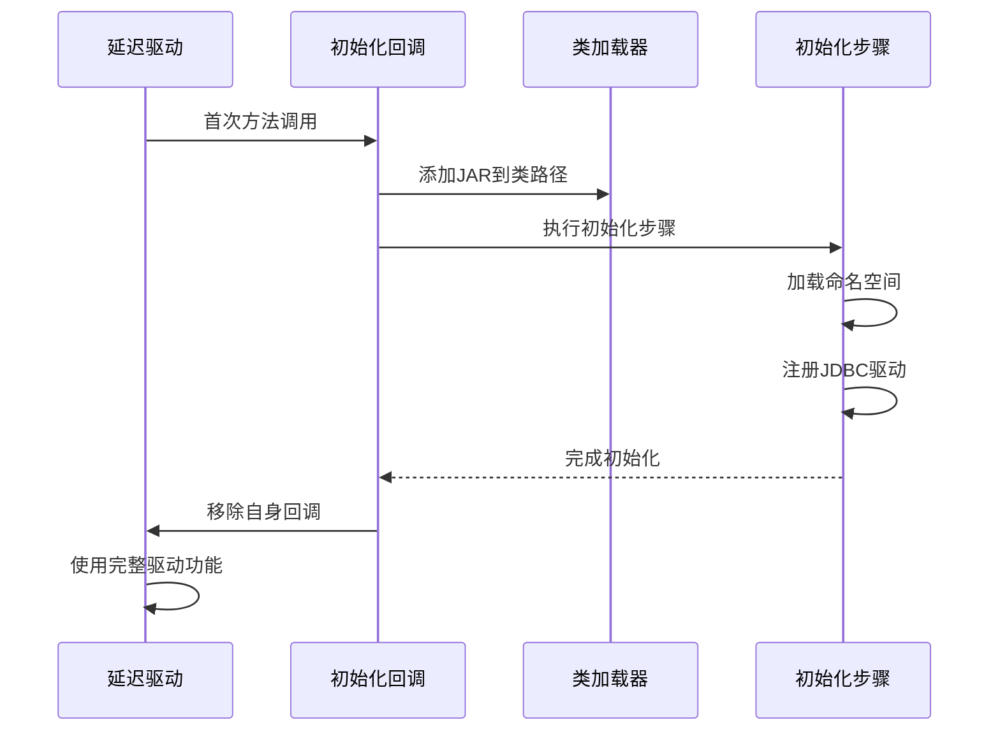

**图表来源**
- [lazy_loaded_driver.clj](file://src/metabase/plugins/lazy_loaded_driver.clj#L48-L73)
- [init_steps.clj](file://src/metabase/plugins/init_steps.clj#L20-L31)

**章节来源**
- [lazy_loaded_driver.clj](file://src/metabase/plugins/lazy_loaded_driver.clj#L1-L115)
- [initialize.clj](file://src/metabase/plugins/initialize.clj#L1-L60)

## JDBC代理模式

### 代理驱动架构

为了绕过Java JDBC DriverManager的限制，Metabase实现了JDBC代理模式：

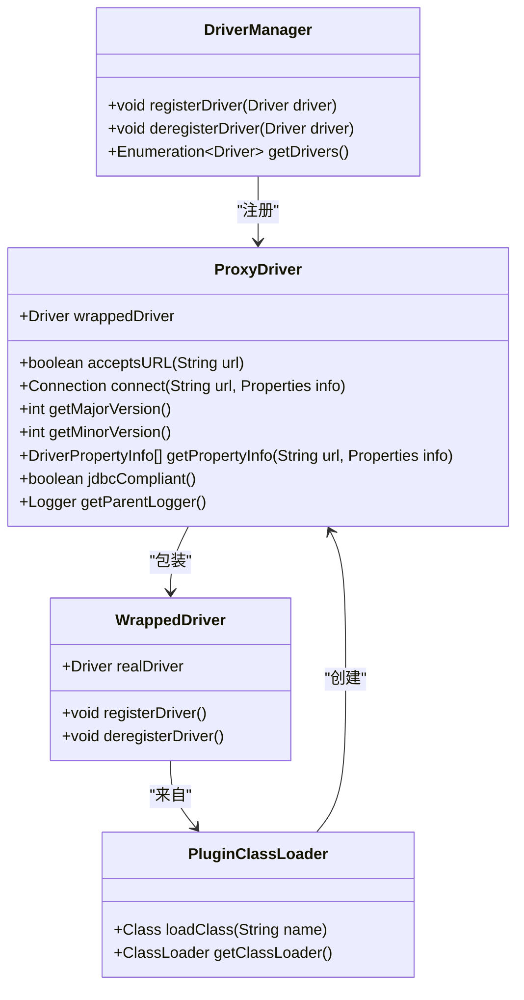

**图表来源**
- [jdbc_proxy.clj](file://src/metabase/plugins/jdbc_proxy.clj#L25-L50)
- [jdbc_proxy.clj](file://src/metabase/plugins/jdbc_proxy.clj#L52-L75)

### 代理创建流程

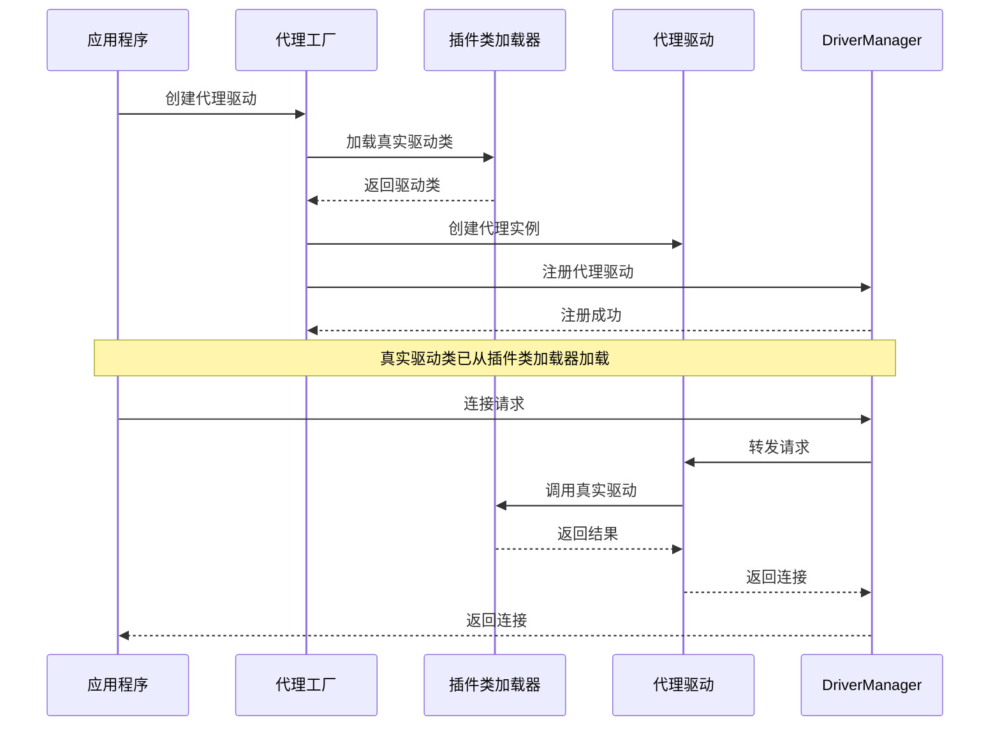

**图表来源**
- [jdbc_proxy.clj](file://src/metabase/plugins/jdbc_proxy.clj#L52-L75)

### 系统类加载器检测

代理系统会检测驱动是否由系统类加载器加载，以避免不必要的代理开销：

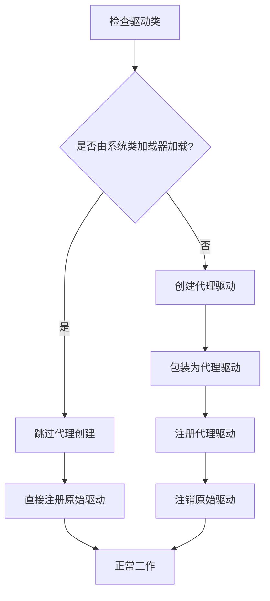

**图表来源**
- [jdbc_proxy.clj](file://src/metabase/plugins/jdbc_proxy.clj#L52-L75)

**章节来源**
- [jdbc_proxy.clj](file://src/metabase/plugins/jdbc_proxy.clj#L1-L76)

## 插件依赖解析

### 依赖类型系统

Metabase支持多种类型的插件依赖：

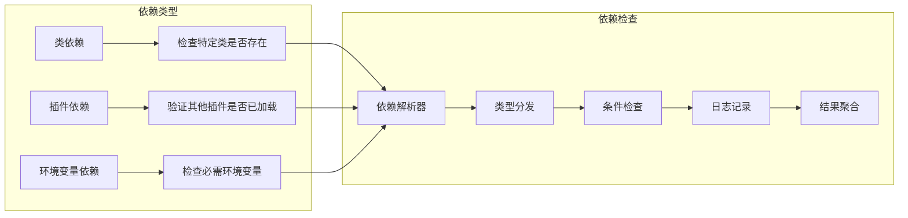

**图表来源**
- [dependencies.clj](file://src/metabase/plugins/dependencies.clj#L15-L45)

### 依赖解析算法

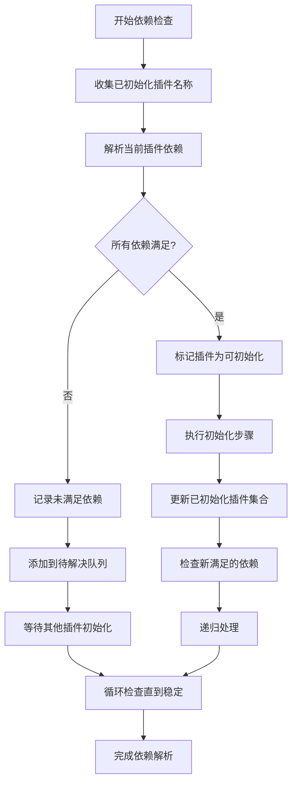

**图表来源**
- [dependencies.clj](file://src/metabase/plugins/dependencies.clj#L75-L116)

### 冲突解决策略

当多个插件声明相同依赖时，系统采用以下策略：

1. **优先级排序**：根据依赖类型确定优先级
2. **版本兼容性**：检查版本兼容性矩阵
3. **回退机制**：提供备用依赖方案
4. **用户干预**：在必要时提示用户选择

**章节来源**
- [dependencies.clj](file://src/metabase/plugins/dependencies.clj#L1-L117)

## 插件初始化流程

### 初始化步骤架构

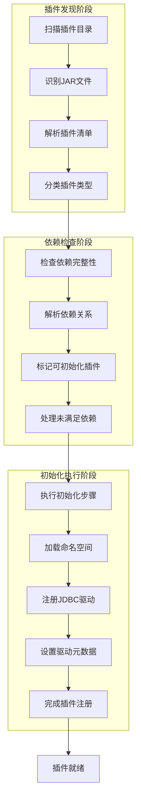

**图表来源**
- [impl.clj](file://src/metabase/plugins/impl.clj#L148-L199)
- [initialize.clj](file://src/metabase/plugins/initialize.clj#L15-L48)

### 插件清单解析

插件清单（metabase-plugin.yaml）是插件配置的核心：

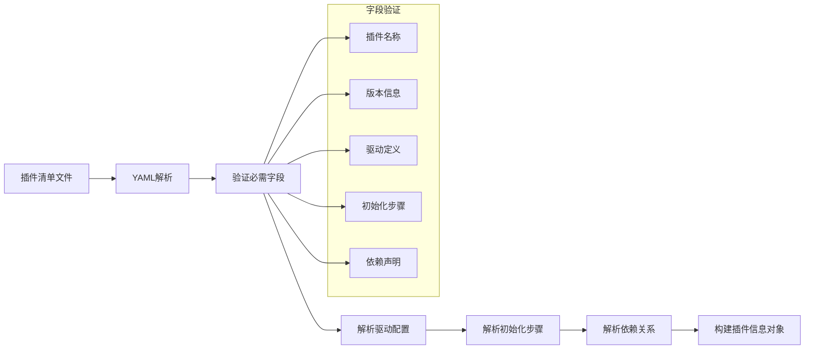

**图表来源**
- [impl.clj](file://src/metabase/plugins/impl.clj#L81-L85)
- [initialize.clj](file://src/metabase/plugins/initialize.clj#L47-L58)

### 并发初始化控制

系统使用原子操作和锁机制确保初始化过程的线程安全：

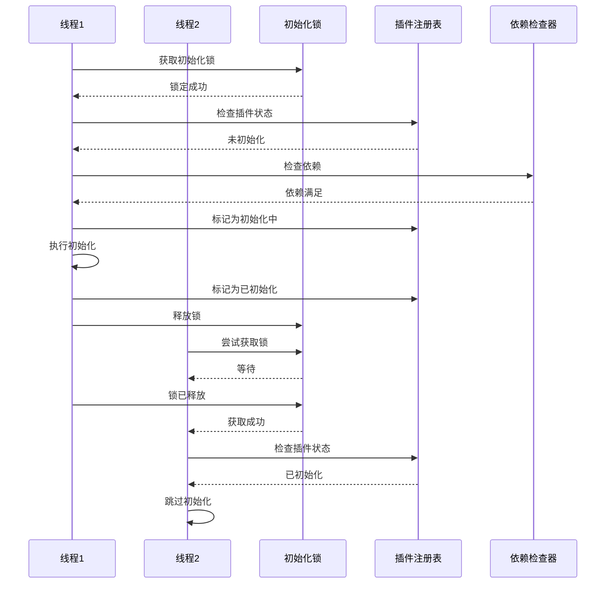

**图表来源**
- [initialize.clj](file://src/metabase/plugins/initialize.clj#L47-L58)

**章节来源**
- [impl.clj](file://src/metabase/plugins/impl.clj#L1-L201)
- [initialize.clj](file://src/metabase/plugins/initialize.clj#L1-L60)

## 资源管理与垃圾回收

### 类加载器生命周期管理

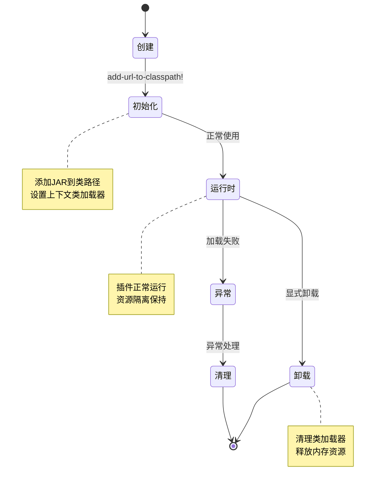

**图表来源**
- [classloader/impl.clj](file://src/metabase/classloader/impl.clj#L155-L166)

### 内存泄漏防护

系统采用多种策略防止内存泄漏：

1. **弱引用管理**：对临时对象使用弱引用
2. **自动清理**：定期清理未使用的类加载器
3. **资源监控**：监控类加载器的内存使用
4. **异常恢复**：在异常情况下自动清理资源

### 垃圾回收优化

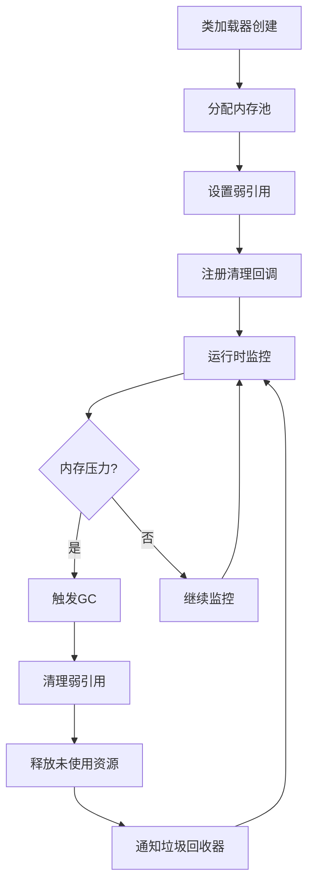

**章节来源**
- [classloader/impl.clj](file://src/metabase/classloader/impl.clj#L155-L166)

## 最佳实践

### 插件开发指南

1. **使用延迟加载**：对于大型或不常用的组件，始终使用延迟加载
2. **明确依赖声明**：在插件清单中准确声明所有依赖
3. **资源隔离**：确保插件资源不会与其他插件冲突
4. **错误处理**：实现健壮的错误处理和恢复机制

### 性能优化建议

1. **按需初始化**：只在真正需要时加载插件
2. **缓存策略**：合理使用缓存减少重复加载
3. **并发控制**：避免在初始化过程中阻塞主线程
4. **资源预热**：对关键资源进行预热加载

### 安全考虑

1. **权限控制**：严格控制插件的访问权限
2. **沙箱隔离**：确保插件无法访问敏感系统资源
3. **签名验证**：验证插件的数字签名
4. **审计日志**：记录插件的所有操作

## 故障排除指南

### 常见问题诊断

| 问题类型 | 症状 | 可能原因 | 解决方案 |
|---------|------|----------|----------|
| 类加载失败 | ClassNotFoundException | 类路径配置错误 | 检查类路径设置，确保JAR文件正确添加 |
| 依赖冲突 | NoSuchMethodError | 版本不兼容 | 更新依赖版本，检查兼容性矩阵 |
| 内存泄漏 | OutOfMemoryError | 类加载器未正确释放 | 实现正确的清理逻辑，使用弱引用 |
| 初始化超时 | TimeoutException | 依赖项不可用 | 检查网络连接，验证依赖服务状态 |

### 调试工具和技术

1. **类加载器跟踪**：监控类加载器的活动
2. **依赖图分析**：可视化插件依赖关系
3. **内存使用分析**：监控内存使用情况
4. **性能剖析**：识别性能瓶颈

### 日志分析

系统提供详细的日志记录，帮助诊断问题：

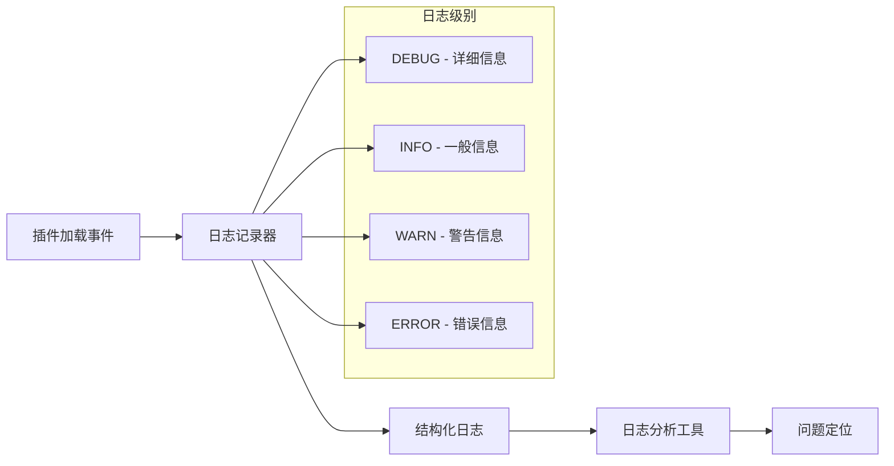

**章节来源**
- [classloader/impl.clj](file://src/metabase/classloader/impl.clj#L155-L166)
- [dependencies.clj](file://src/metabase/plugins/dependencies.clj#L45-L75)

## 结论

Metabase的插件加载系统是一个高度工程化的解决方案，通过精心设计的架构和多层保护机制，确保了插件系统的稳定性、性能和安全性。该系统的核心优势包括：

- **完全隔离**：通过类加载器隔离确保插件间无冲突
- **智能延迟**：按需加载优化启动性能
- **健壮依赖**：完善的依赖解析和冲突解决机制
- **资源管理**：有效的资源管理和垃圾回收策略

这种设计不仅满足了当前的需求，也为未来的扩展奠定了坚实的基础。开发者可以基于这些机制构建强大的插件系统，同时确保系统的整体稳定性和性能。