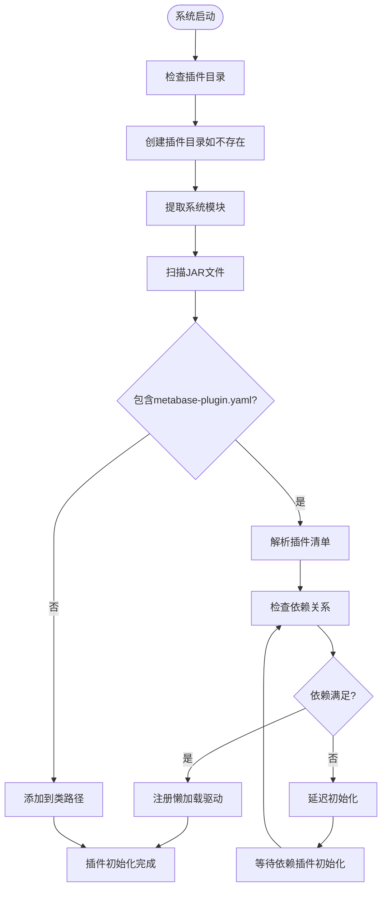
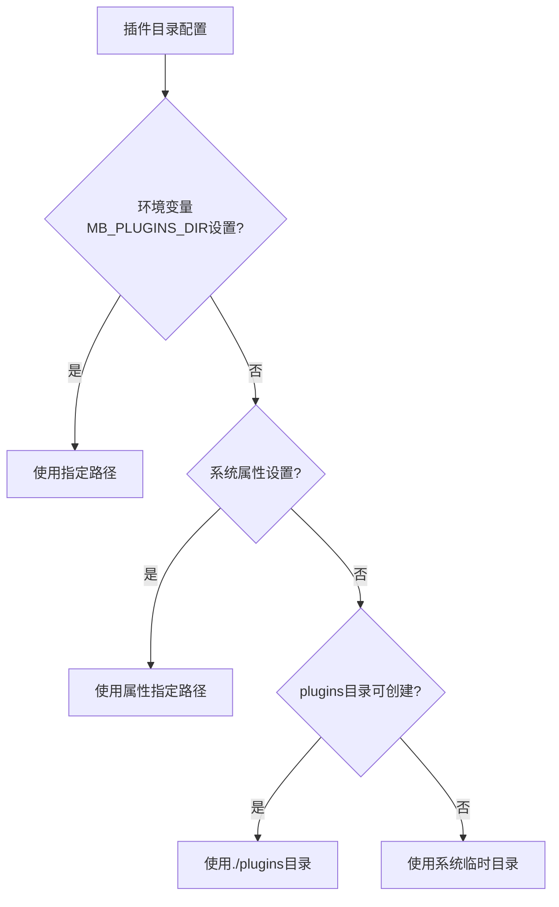
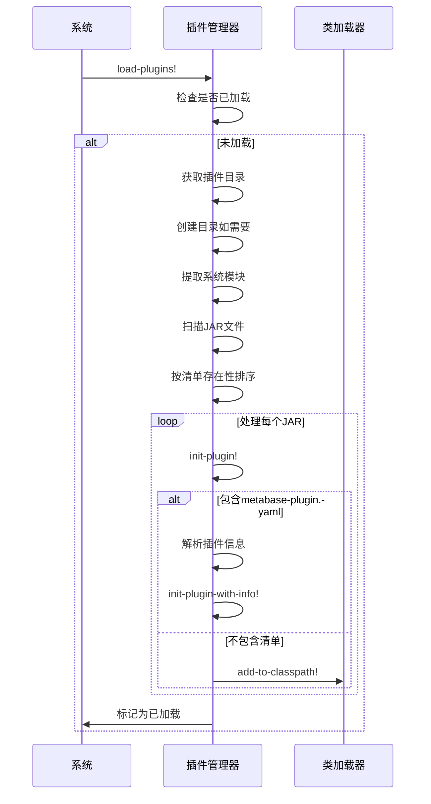
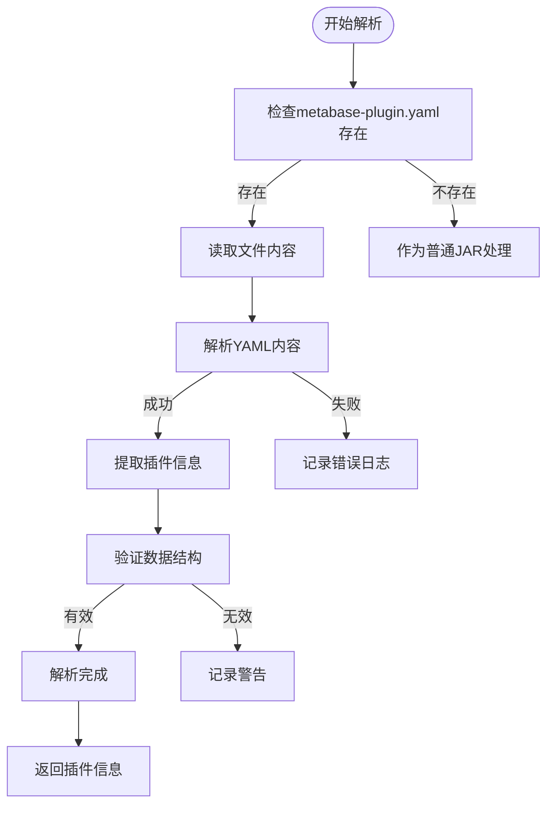
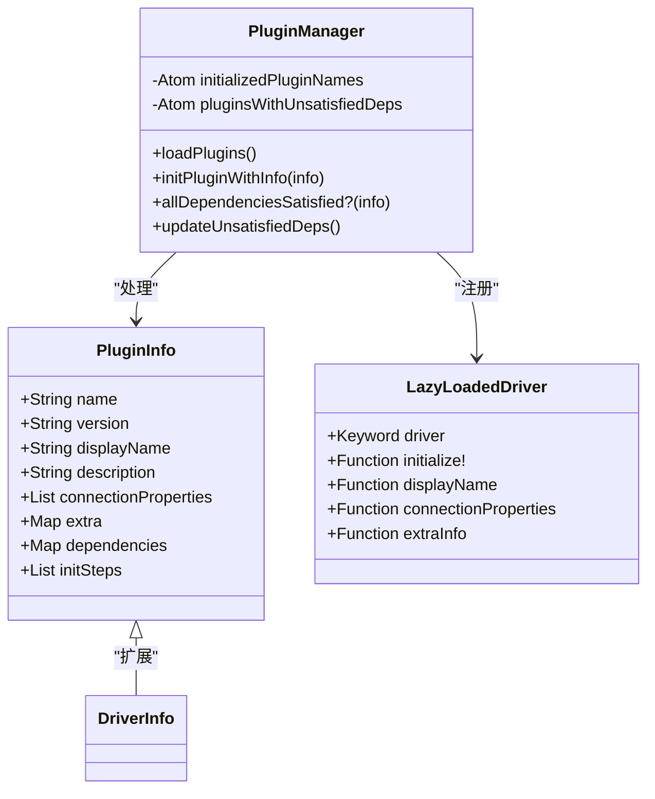
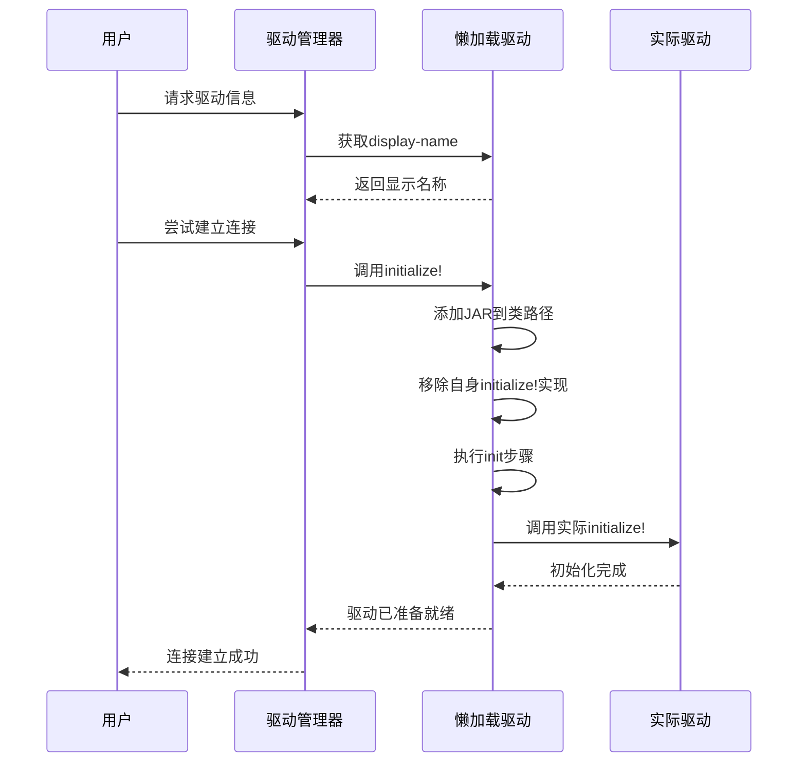
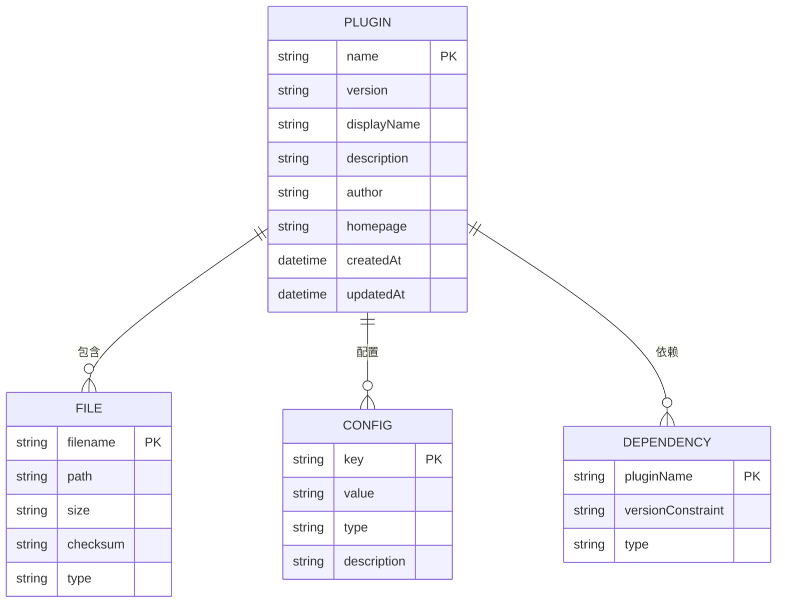
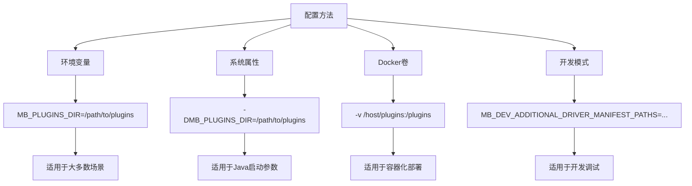

# 插件发现机制

<cite>
**本文档中引用的文件**  
- [core.clj](file://src/metabase/plugins/core.clj)
- [impl.clj](file://src/metabase/plugins/impl.clj)
- [initialize.clj](file://src/metabase/plugins/initialize.clj)
- [dependencies.clj](file://src/metabase/plugins/dependencies.clj)
- [lazy_loaded_driver.clj](file://src/metabase/plugins/lazy_loaded_driver.clj)
- [other-env-vars.md](file://src/metabase/cmd/resources/other-env-vars.md)
</cite>

## 目录
1. [插件发现机制概述](#插件发现机制概述)
2. [插件目录与路径配置](#插件目录与路径配置)
3. [插件扫描与加载流程](#插件扫描与加载流程)
4. [插件描述符解析](#插件描述符解析)
5. [插件元数据加载](#插件元数据加载)
6. [插件依赖管理](#插件依赖管理)
7. [懒加载驱动注册](#懒加载驱动注册)
8. [插件命名规范与目录结构](#插件命名规范与目录结构)
9. [插件发现失败排查](#插件发现失败排查)
10. [自定义插件路径配置示例](#自定义插件路径配置示例)

## 插件发现机制概述

Metabase插件发现机制负责识别、加载和初始化系统中的插件JAR文件。该机制通过类路径扫描来发现插件，解析插件描述符文件（metabase-plugin.yaml），并验证其完整性。插件可以是Metabase自身附带的模块，也可以是用户手动添加的第三方插件。系统在启动时执行插件加载过程，确保所有插件按正确顺序初始化。

**插件发现机制的核心特点：**
- 支持从默认插件目录和自定义路径加载插件
- 通过metabase-plugin.yaml文件识别插件并解析元数据
- 实现懒加载驱动机制，优化系统启动性能
- 支持插件间的依赖关系管理
- 提供详细的错误日志和故障排查信息

**插件发现流程：**
1. 确定插件目录路径（默认为./plugins或环境变量指定路径）
2. 创建插件目录（如果不存在）
3. 扫描目录中的JAR文件
4. 区分包含插件清单的JAR和普通JAR
5. 按照依赖关系顺序初始化插件
6. 注册懒加载驱动（如适用）



**图示来源**
- [impl.clj](file://src/metabase/plugins/impl.clj#L176-L199)
- [initialize.clj](file://src/metabase/plugins/initialize.clj#L23-L48)

## 插件目录与路径配置

Metabase插件系统使用特定的目录结构来管理和加载插件。系统首先确定插件目录的路径，然后在此目录中搜索和加载插件JAR文件。

### 默认插件目录
默认情况下，Metabase使用当前工作目录下的`plugins`子目录作为插件目录。如果该目录不存在，系统会自动创建它。这是最常用的插件安装位置，适用于大多数部署场景。

### 自定义插件目录
用户可以通过环境变量`MB_PLUGINS_DIR`或系统属性来指定自定义的插件目录路径。这种配置方式提供了更大的灵活性，允许将插件存储在特定位置，便于管理和备份。

### 临时目录回退机制
如果指定的插件目录无法创建或没有写入权限，Metabase会自动回退到系统的临时目录。这种机制确保了即使在配置错误的情况下，系统仍然能够正常启动，避免因插件问题导致服务中断。

### 插件目录优先级
1. 环境变量`MB_PLUGINS_DIR`指定的路径
2. 系统属性指定的路径
3. 当前工作目录下的`plugins`子目录
4. 系统临时目录（作为最后的回退选项）



**图示来源**
- [impl.clj](file://src/metabase/plugins/impl.clj#L35-L58)
- [other-env-vars.md](file://src/metabase/cmd/resources/other-env-vars.md#L397-L431)

**本节来源**
- [impl.clj](file://src/metabase/plugins/impl.clj#L35-L58)
- [other-env-vars.md](file://src/metabase/cmd/resources/other-env-vars.md#L397-L431)

## 插件扫描与加载流程

Metabase的插件扫描与加载流程是一个系统化的过程，确保所有插件能够被正确识别和初始化。该流程在系统启动时执行，且只会执行一次，保证了插件加载的幂等性。

### 扫描流程
1. **获取插件目录**：调用`plugins-dir`函数获取插件目录的路径
2. **创建目录**：如果目录不存在，则创建它
3. **验证权限**：检查目录的读写权限
4. **文件遍历**：递归扫描目录中的所有文件
5. **文件过滤**：筛选出以`.jar`结尾的可读文件
6. **特殊处理**：排除已知的不需要加载的JAR文件（如spark-deps.jar）

### 加载流程
1. **提取系统模块**：从Metabase uberjar中提取内置的模块到插件目录
2. **排序处理**：按照是否包含插件清单对JAR文件进行排序
3. **初始化插件**：依次处理每个JAR文件
4. **依赖管理**：处理插件间的依赖关系
5. **懒加载注册**：为支持懒加载的插件注册占位符

### 加载顺序优化
系统特别优化了JAR文件的加载顺序，确保不包含插件清单的JAR文件（通常是依赖库）优先加载。这种排序策略保证了依赖库在需要它们的插件之前被添加到类路径中，避免了类加载错误。



**图示来源**
- [impl.clj](file://src/metabase/plugins/impl.clj#L148-L178)
- [impl.clj](file://src/metabase/plugins/impl.clj#L81-L107)

**本节来源**
- [impl.clj](file://src/metabase/plugins/impl.clj#L148-L178)
- [impl.clj](file://src/metabase/plugins/impl.clj#L81-L107)

## 插件描述符解析

插件描述符（metabase-plugin.yaml）是Metabase插件的核心配置文件，它定义了插件的元数据、依赖关系和初始化步骤。系统通过解析这个YAML文件来获取插件的详细信息。

### 描述符文件位置
插件描述符文件必须位于JAR文件的根目录下，文件名为`metabase-plugin.yaml`。系统使用`u.files/file-exists-in-archive?`函数检查JAR文件中是否存在该文件。

### 解析过程
1. **文件读取**：使用`u.files/slurp-file-from-archive`从JAR文件中读取`metabase-plugin.yaml`
2. **YAML解析**：通过`yaml/parse-string`将YAML内容转换为Clojure数据结构
3. **数据验证**：检查解析后的数据结构是否符合预期格式
4. **信息提取**：提取插件名称、版本、依赖关系等关键信息

### 描述符结构
插件描述符包含以下主要部分：
- **info**：插件基本信息（名称、版本等）
- **driver**：驱动程序配置
- **init**：初始化步骤
- **dependencies**：依赖关系
- **extra**：扩展信息

### 错误处理
如果插件描述符文件不存在或格式错误，系统会记录相应的错误日志。对于格式错误的YAML文件，解析过程会返回nil，导致插件被当作普通JAR文件处理（仅添加到类路径）。



**图示来源**
- [impl.clj](file://src/metabase/plugins/impl.clj#L81-L84)
- [impl.clj](file://src/metabase/plugins/impl.clj#L106-L107)

**本节来源**
- [impl.clj](file://src/metabase/plugins/impl.clj#L81-L84)
- [impl.clj](file://src/metabase/plugins/impl.clj#L106-L107)

## 插件元数据加载

插件元数据加载是插件初始化过程中的关键步骤，它负责从插件描述符中提取并处理插件的各种属性信息。这些元数据包括插件名称、版本、显示名称、连接属性等。

### 元数据字段
系统从`metabase-plugin.yaml`文件中解析以下元数据字段：

| 字段名称 | 类型 | 描述 |
|---------|------|------|
| name | 字符串 | 插件唯一标识符 |
| version | 字符串 | 插件版本号 |
| display-name | 字符串 | 插件显示名称 |
| description | 字符串 | 插件描述 |
| author | 字符串 | 插件作者 |
| homepage | 字符串 | 插件主页URL |
| connection-properties | 列表 | 连接属性配置 |
| extra | 映射 | 扩展信息 |

### 加载过程
1. **信息获取**：调用`plugin-info`函数获取解析后的插件信息
2. **依赖检查**：验证插件的所有依赖是否已满足
3. **初始化步骤**：执行插件定义的初始化步骤
4. **驱动注册**：注册插件提供的驱动程序
5. **状态记录**：标记插件为已初始化状态

### 懒加载支持
对于支持懒加载的插件，系统不会立即执行所有初始化步骤，而是注册一个占位符驱动。当该驱动首次被使用时，才会执行完整的初始化过程，包括将JAR文件添加到类路径和加载驱动命名空间。

### 状态管理
系统使用原子变量`initialized-plugin-names`来跟踪已初始化的插件名称。这种机制确保了每个插件只被初始化一次，并且可以正确处理插件间的依赖关系。



**图示来源**
- [initialize.clj](file://src/metabase/plugins/initialize.clj#L23-L48)
- [lazy_loaded_driver.clj](file://src/metabase/plugins/lazy_loaded_driver.clj#L60-L114)

**本节来源**
- [initialize.clj](file://src/metabase/plugins/initialize.clj#L23-L48)
- [lazy_loaded_driver.clj](file://src/metabase/plugins/lazy_loaded_driver.clj#L60-L114)

## 插件依赖管理

Metabase插件系统提供了强大的依赖管理功能，确保插件能够按正确的顺序初始化，并在所有依赖都满足后才激活。

### 依赖类型
系统支持三种主要的依赖类型：

1. **类依赖**（class）：依赖特定的Java类
2. **插件依赖**（plugin）：依赖其他插件
3. **环境变量依赖**（env-var）：依赖特定的环境变量

### 依赖检查流程
1. **依赖解析**：从插件描述符中提取依赖列表
2. **类型识别**：确定每个依赖的类型
3. **状态检查**：验证依赖是否已满足
4. **错误处理**：记录未满足依赖的详细信息

### 依赖满足条件
- **类依赖**：指定的Java类能够在类路径中找到
- **插件依赖**：指定的插件已经成功初始化
- **环境变量依赖**：指定的环境变量已设置且非空

### 延迟初始化机制
对于具有未满足依赖的插件，系统会将其添加到待处理队列中。每当有新插件初始化完成时，系统会重新检查这些待处理插件的依赖状态。一旦所有依赖都满足，插件就会被自动初始化。

### 循环依赖检测
系统通过跟踪依赖关系图来检测潜在的循环依赖。如果发现循环依赖，会记录错误日志并阻止相关插件的初始化，避免系统陷入无限循环。


**图示来源**
- [dependencies.clj](file://src/metabase/plugins/dependencies.clj#L20-L115)
- [initialize.clj](file://src/metabase/plugins/initialize.clj#L23-L48)

**本节来源**
- [dependencies.clj](file://src/metabase/plugins/dependencies.clj#L20-L115)
- [initialize.clj](file://src/metabase/plugins/initialize.clj#L23-L48)

## 懒加载驱动注册

懒加载驱动是Metabase插件系统的重要特性，它允许在需要时才加载和初始化驱动程序，从而优化系统启动性能和内存使用。

### 懒加载优势
1. **快速启动**：不需要立即加载所有驱动
2. **节省内存**：未使用的驱动不会占用内存
3. **按需加载**：只有在实际使用时才加载驱动
4. **错误隔离**：驱动加载错误不会影响系统启动

### 注册过程
1. **创建占位符**：为驱动创建基本的多方法实现
2. **注册初始化函数**：设置`initialize!`方法的懒加载实现
3. **设置显示信息**：提供`display-name`和`connection-properties`
4. **注册驱动**：将占位符驱动注册到驱动管理器

### 占位符驱动方法
懒加载驱动实现了以下关键方法作为占位符：

- **initialize!**：真正的初始化逻辑，当驱动首次使用时触发
- **display-name**：返回驱动的显示名称
- **connection-properties**：返回连接属性配置
- **extra-info**：返回扩展信息
- **superseded-by**：返回替代此驱动的新驱动

### 初始化触发
当系统首次尝试使用懒加载驱动时（如访问其连接属性或尝试建立连接），会触发`initialize!`方法的执行。此时，系统会：
1. 将JAR文件添加到类路径
2. 执行插件定义的初始化步骤
3. 调用驱动的实际`initialize!`实现（如果存在）



**图示来源**
- [lazy_loaded_driver.clj](file://src/metabase/plugins/lazy_loaded_driver.clj#L60-L114)
- [initialize.clj](file://src/metabase/plugins/initialize.clj#L23-L48)

**本节来源**
- [lazy_loaded_driver.clj](file://src/metabase/plugins/lazy_loaded_driver.clj#L60-L114)
- [initialize.clj](file://src/metabase/plugins/initialize.clj#L23-L48)

## 插件命名规范与目录结构

Metabase插件遵循特定的命名规范和目录结构，以确保插件能够被正确识别和加载。

### 命名规范
1. **插件名称**：必须是唯一的字符串，通常使用小写字母和连字符
2. **JAR文件名**：建议与插件名称一致，便于识别
3. **版本格式**：遵循语义化版本规范（如1.0.0）
4. **命名空间**：Clojure命名空间应与插件功能相关

### 目录结构要求
插件JAR文件必须包含以下基本结构：

```
plugin-name-version.jar
├── metabase-plugin.yaml
├── META-INF/
│   └── ...
├── com/
│   └── ... (Java类)
└── metabase/
    └── ... (Clojure命名空间)
```

### 必需文件
1. **metabase-plugin.yaml**：插件描述符文件，必须位于JAR根目录
2. **主命名空间**：包含驱动实现的主要Clojure文件
3. **资源文件**：如图标、文档等（可选）

### 推荐实践
- 使用有意义的插件名称，避免使用通用名称
- 在插件名称中包含供应商或组织标识
- 遵循一致的版本号递增策略
- 在JAR文件名中包含版本号
- 保持JAR文件结构清晰和组织良好

### UUID生成策略
虽然Metabase插件系统主要使用名称作为唯一标识符，但在需要UUID的场景下，系统通常采用以下策略：
1. 基于插件名称和版本生成确定性UUID
2. 使用标准UUID生成算法创建随机UUID
3. 在插件注册时生成并持久化UUID



**图示来源**
- [impl.clj](file://src/metabase/plugins/impl.clj#L81-L84)
- [lazy_loaded_driver.clj](file://src/metabase/plugins/lazy_loaded_driver.clj#L60-L114)

**本节来源**
- [impl.clj](file://src/metabase/plugins/impl.clj#L81-L84)
- [lazy_loaded_driver.clj](file://src/metabase/plugins/lazy_loaded_driver.clj#L60-L114)

## 插件发现失败排查

当插件发现失败时，系统提供了详细的日志信息和排查方法。以下是常见的插件发现失败原因及相应的解决方案。

### 常见失败原因
1. **目录权限问题**：插件目录没有写入权限
2. **JAR文件损坏**：插件JAR文件不完整或已损坏
3. **清单文件缺失**：缺少metabase-plugin.yaml文件
4. **YAML格式错误**：插件描述符语法错误
5. **依赖缺失**：插件依赖的类、插件或环境变量不存在
6. **命名冲突**：插件名称与其他插件冲突
7. **版本不兼容**：插件版本与Metabase版本不兼容

### 排查步骤
1. **检查日志**：查看系统启动日志中的插件相关消息
2. **验证文件**：确认JAR文件完整且可读
3. **检查权限**：确保插件目录有适当的读写权限
4. **验证清单**：检查metabase-plugin.yaml格式是否正确
5. **确认依赖**：验证所有依赖项是否可用
6. **测试加载**：尝试单独加载问题插件

### 日志分析
系统在插件加载过程中会输出详细的日志信息：
- **INFO级别**：正常的加载过程和成功消息
- **WARN级别**：非致命问题，如spark-deps.jar警告
- **ERROR级别**：加载失败和严重问题

### 具体错误示例
- **目录创建失败**：检查MB_PLUGINS_DIR环境变量设置
- **JAR加载失败**：验证JAR文件完整性和权限
- **依赖不满足**：安装缺失的依赖插件或设置环境变量
- **类找不到**：确保依赖库已正确添加到类路径


**图示来源**
- [impl.clj](file://src/metabase/plugins/impl.clj#L35-L58)
- [dependencies.clj](file://src/metabase/plugins/dependencies.clj#L20-L115)

**本节来源**
- [impl.clj](file://src/metabase/plugins/impl.clj#L35-L58)
- [dependencies.clj](file://src/metabase/plugins/dependencies.clj#L20-L115)

## 自定义插件路径配置示例

Metabase提供了多种方式来配置自定义插件路径，以适应不同的部署环境和需求。

### 环境变量配置
通过设置`MB_PLUGINS_DIR`环境变量来指定插件目录：

```bash
# Linux/Mac
export MB_PLUGINS_DIR="/opt/metabase/plugins"
java -jar metabase.jar

# Windows
set MB_PLUGINS_DIR=C:\metabase\plugins
java -jar metabase.jar
```

### 系统属性配置
通过Java系统属性指定插件目录：

```bash
java -DMB_PLUGINS_DIR=/custom/plugins/path -jar metabase.jar
```

### Docker配置
在Docker环境中配置插件路径：

```dockerfile
# Dockerfile
ENV MB_PLUGINS_DIR=/plugins
VOLUME /plugins

# docker-compose.yml
services:
  metabase:
    image: metabase/metabase:v0.46.0
    environment:
      - MB_PLUGINS_DIR=/plugins
    volumes:
      - ./plugins:/plugins
```

### 开发模式配置
在开发环境中，可以使用额外的驱动清单路径：

```bash
# 设置额外的驱动清单路径
export MB_DEV_ADDITIONAL_DRIVER_MANIFEST_PATHS="/path/to/driver1/metabase-plugin.yaml,/path/to/driver2/metabase-plugin.yaml"
```

### 配置优先级
配置项的优先级从高到低为：
1. 系统属性（-D参数）
2. 环境变量（MB_PLUGINS_DIR）
3. 默认路径（./plugins）

### 最佳实践
- 在生产环境中明确指定插件目录
- 确保插件目录有适当的备份策略
- 使用绝对路径避免歧义
- 为插件目录设置适当的文件权限
- 在容器化部署中使用卷挂载



**图示来源**
- [impl.clj](file://src/metabase/plugins/impl.clj#L35-L58)
- [other-env-vars.md](file://src/metabase/cmd/resources/other-env-vars.md#L397-L431)

**本节来源**
- [impl.clj](file://src/metabase/plugins/impl.clj#L35-L58)
- [other-env-vars.md](file://src/metabase/cmd/resources/other-env-vars.md#L397-L431)