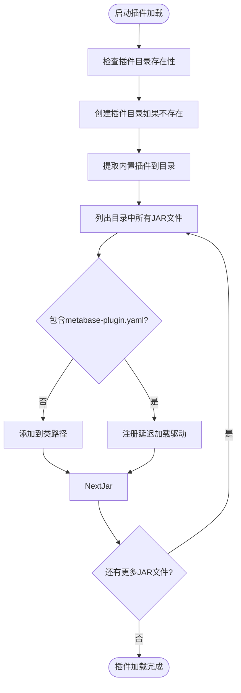
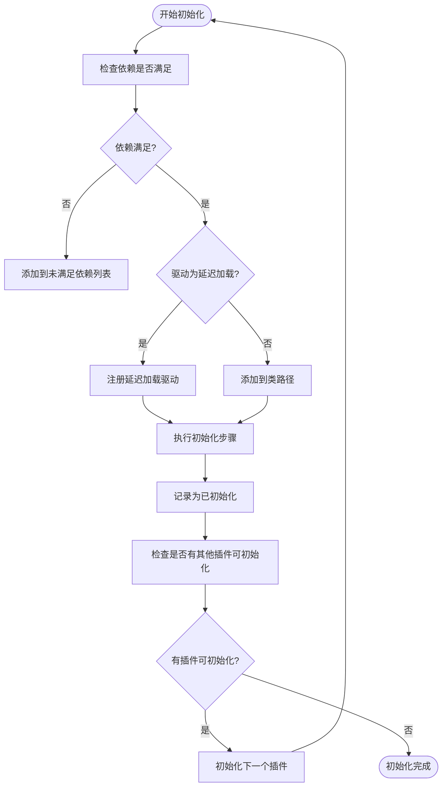
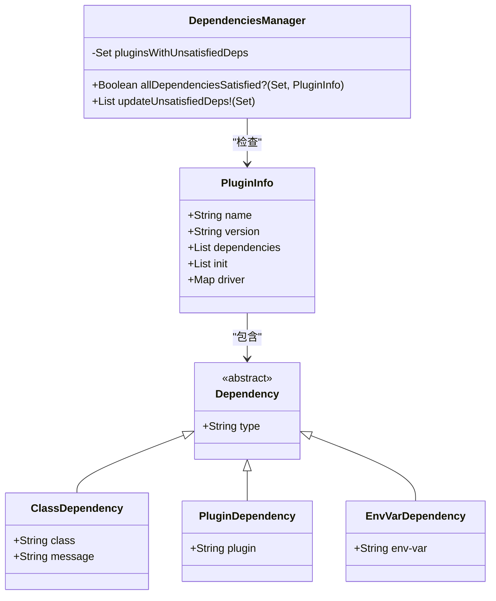
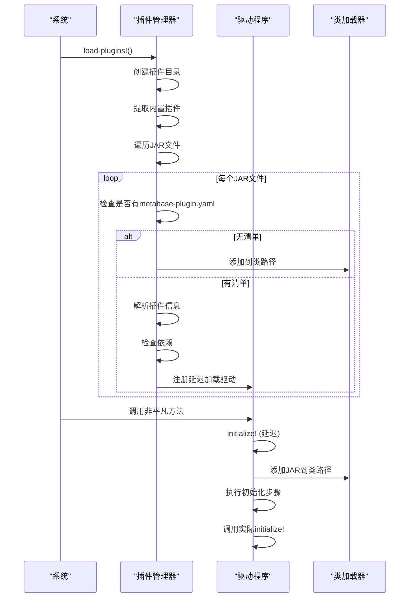
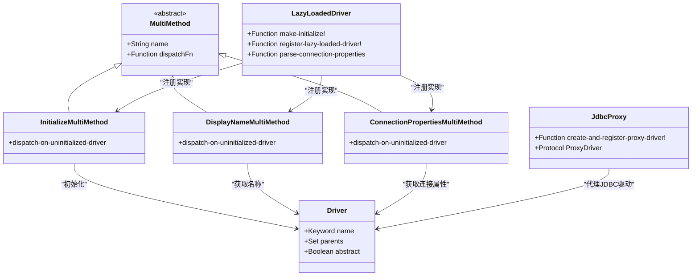

# 插件系统

<cite>
**本文档中引用的文件**  
- [core.clj](file://src/metabase/plugins/core.clj)
- [impl.clj](file://src/metabase/plugins/impl.clj)
- [initialize.clj](file://src/metabase/plugins/initialize.clj)
- [init_steps.clj](file://src/metabase/plugins/init_steps.clj)
- [dependencies.clj](file://src/metabase/plugins/dependencies.clj)
- [lazy_loaded_driver.clj](file://src/metabase/plugins/lazy_loaded_driver.clj)
- [jdbc_proxy.clj](file://src/metabase/plugins/jdbc_proxy.clj)
- [driver.clj](file://src/metabase/driver.clj)
</cite>

## 目录
1. [插件发现与加载机制](#插件发现与加载机制)
2. [插件初始化流程](#插件初始化流程)
3. [插件元数据与依赖管理](#插件元数据与依赖管理)
4. [插件生命周期管理](#插件生命周期管理)
5. [多态分发机制在插件架构中的应用](#多态分发机制在插件架构中的应用)
6. [插件开发最佳实践](#插件开发最佳实践)
7. [插件打包与分发指南](#插件打包与分发指南)
8. [开发环境调试](#开发环境调试)

## 插件发现与加载机制

Metabase插件系统通过`load-plugins!`函数实现插件的发现和加载。插件可以是Metabase自身附带的JAR文件（位于`resources/modules`目录下），也可以是用户手动添加到Metabase插件目录（默认为`./plugins`）中的JAR文件。

插件加载过程包括以下步骤：
1. 创建插件目录（如果不存在）
2. 将Metabase自带的插件从uberjar中提取到插件目录
3. 遍历插件目录中的所有JAR文件
4. 对于不包含Metabase插件清单的JAR文件，直接添加到类路径
5. 对于包含插件清单（`metabase-plugin.yaml`文件）的JAR文件，注册延迟加载的Metabase驱动程序

插件目录的位置可以通过环境变量`MB_PLUGINS_DIR`进行配置。如果无法使用指定目录，系统会回退到临时目录以确保启动成功。



**Diagram sources**
- [impl.clj](file://src/metabase/plugins/impl.clj#L150-L199)

**Section sources**
- [impl.clj](file://src/metabase/plugins/impl.clj#L0-L200)

## 插件初始化流程

插件初始化流程由`init-plugin-with-info!`函数控制，该函数根据插件清单中的信息执行初始化步骤。初始化过程在Metabase启动时进行，前提是插件的所有依赖都已满足。

对于驱动插件，如果指定了`lazy-load`，则初始化步骤会在首次调用非平凡驱动方法（如连接数据库）时延迟执行；对于其他Metabase插件，这些步骤在启动时执行。

初始化流程包括：
1. 检查插件依赖是否全部满足
2. 对于延迟加载的驱动，注册延迟加载的占位驱动程序
3. 执行插件清单中指定的初始化步骤
4. 记录插件为已初始化状态



**Diagram sources**
- [initialize.clj](file://src/metabase/plugins/initialize.clj#L0-L60)
- [init_steps.clj](file://src/metabase/plugins/init_steps.clj#L0-L30)

**Section sources**
- [initialize.clj](file://src/metabase/plugins/initialize.clj#L0-L60)
- [init_steps.clj](file://src/metabase/plugins/init_steps.clj#L0-L30)

## 插件元数据与依赖管理

插件元数据通过`metabase-plugin.yaml`文件定义，该文件包含插件的基本信息、驱动信息和初始化步骤。系统通过`plugin-info`函数从JAR文件中读取此YAML文件并解析为Clojure数据结构。

依赖管理通过`dependencies`命名空间实现，支持三种类型的依赖：
- **类依赖**：检查指定的Java类是否可在类加载器中找到
- **插件依赖**：检查指定的插件是否已初始化
- **环境变量依赖**：检查指定的环境变量是否已设置

依赖检查采用短路评估，一旦发现不满足的依赖就会记录警告并返回false。系统维护一个包含未满足依赖的插件集合，并在其他插件初始化后重新检查这些插件的依赖是否已满足。



**Diagram sources**
- [impl.clj](file://src/metabase/plugins/impl.clj#L80-L90)
- [dependencies.clj](file://src/metabase/plugins/dependencies.clj#L0-L116)

**Section sources**
- [impl.clj](file://src/metabase/plugins/impl.clj#L80-L90)
- [dependencies.clj](file://src/metabase/plugins/dependencies.clj#L0-L116)

## 插件生命周期管理

插件生命周期包括启动、运行时交互和关闭三个阶段。系统通过一系列协调机制确保插件按正确顺序初始化和清理。

### 启动过程
启动时，系统首先加载所有插件，然后按依赖关系顺序初始化它们。使用原子变量`initialized-plugin-names`跟踪已初始化的插件名称，确保每个插件只初始化一次。

### 运行时交互
运行时，延迟加载的驱动程序在首次调用非平凡方法时被激活。此时，系统执行以下操作：
1. 将驱动JAR添加到类路径
2. 移除当前的`initialize!`方法实现
3. 执行插件清单中指定的初始化步骤
4. 调用驱动的实际`initialize!`方法（如果存在）

### 关闭过程
虽然当前代码中没有显式的关闭逻辑，但基于JVM的生命周期，插件资源会在应用关闭时由垃圾回收器清理。对于需要显式清理的资源，建议在驱动的`initialize!`方法中注册关闭钩子。



**Diagram sources**
- [impl.clj](file://src/metabase/plugins/impl.clj#L150-L199)
- [lazy_loaded_driver.clj](file://src/metabase/plugins/lazy_loaded_driver.clj#L0-L114)
- [initialize.clj](file://src/metabase/plugins/initialize.clj#L0-L60)

**Section sources**
- [impl.clj](file://src/metabase/plugins/impl.clj#L150-L199)
- [lazy_loaded_driver.clj](file://src/metabase/plugins/lazy_loaded_driver.clj#L0-L114)
- [initialize.clj](file://src/metabase/plugins/initialize.clj#L0-L60)

## 多态分发机制在插件架构中的应用

Metabase使用Clojure的多方法（multimethod）系统实现插件架构的多态分发。核心机制体现在`driver`命名空间中的各种多方法，如`initialize!`、`display-name`和`connection-properties`。

关键特性包括：
- **延迟初始化分发**：使用`dispatch-on-uninitialized-driver`函数，仅加载驱动命名空间而不初始化
- **已初始化分发**：使用`the-initialized-driver`函数，确保驱动已完全初始化
- **特殊初始化处理**：`initialize!`方法不使用层次结构分发，避免父驱动实现被多次调用

对于延迟加载的驱动，系统在注册时动态添加多方法实现，这些实现包装了实际的初始化逻辑。当驱动被首次使用时，触发完整的初始化流程，包括类路径更新、命名空间加载和JDBC驱动注册。



**Diagram sources**
- [driver.clj](file://src/metabase/driver.clj#L0-L200)
- [lazy_loaded_driver.clj](file://src/metabase/plugins/lazy_loaded_driver.clj#L0-L114)
- [jdbc_proxy.clj](file://src/metabase/plugins/jdbc_proxy.clj#L0-L75)

**Section sources**
- [driver.clj](file://src/metabase/driver.clj#L0-L200)
- [lazy_loaded_driver.clj](file://src/metabase/plugins/lazy_loaded_driver.clj#L0-L114)
- [jdbc_proxy.clj](file://src/metabase/plugins/jdbc_proxy.clj#L0-L75)

## 插件开发最佳实践

### 命名约定
- 插件名称应使用小写字母和连字符（kebab-case）
- 驱动名称应使用小写关键字（如`:my-driver`）
- Java类名应遵循PascalCase约定
- Clojure命名空间应使用小写字母和连字符

### 版本控制
- 遵循语义化版本控制（SemVer）
- 在`metabase-plugin.yaml`中明确指定版本
- 保持向后兼容性，特别是在API变更时
- 使用`superseded-by`字段标记已弃用的插件

### 兼容性策略
- 明确声明对Metabase核心版本的依赖
- 避免使用内部API，优先使用公共接口
- 在插件清单中声明所有外部依赖
- 测试插件在不同JVM版本下的兼容性

### 初始化步骤最佳实践
- 将耗时操作（如JDBC驱动注册）放在`init`步骤中
- 使用`:load-namespace`步骤加载必要的Clojure命名空间
- 使用`:register-jdbc-driver`步骤注册JDBC驱动
- 确保初始化步骤幂等，可安全重复执行

## 插件打包与分发指南

### 插件结构
```
my-driver.jar
├── metabase-plugin.yaml
├── my_driver/
│   └── core.clj
└── lib/
    └── external-library.jar
```

### 打包步骤
1. 创建包含插件代码的JAR文件
2. 在JAR根目录添加`metabase-plugin.yaml`清单文件
3. 将所有依赖库包含在JAR文件中或确保它们在类路径上
4. 使用标准JAR工具或构建工具（如Leiningen）打包

### 清单文件示例
```yaml
name: my-driver
version: 1.0.0
description: My custom database driver
driver:
  name: my-driver
  class: com.example.MyDriver
  connection-properties:
    - host
    - port
    - database
init:
  - step: load-namespace
    namespace: my-driver.core
  - step: register-jdbc-driver
    class: com.example.MyDriver
```

### 分发方式
- **内置分发**：将插件JAR放入Metabase的`modules`目录，随主应用一起发布
- **用户安装**：提供JAR文件下载，用户手动放入`plugins`目录
- **Maven中央仓库**：发布到公共仓库，通过依赖管理工具集成
- **私有仓库**：在企业内部仓库中托管，受控分发

## 开发环境调试

### 开发模式特性
在开发或测试模式下，系统支持从本地路径加载插件清单，模拟从uberjar加载插件的行为。这通过`MB_DEV_ADDITIONAL_DRIVER_MANIFEST_PATHS`环境变量实现，可以指定多个以逗号分隔的清单文件路径。

### 调试技巧
- 启用详细日志记录以跟踪插件加载过程
- 使用`plugins-dir-info`函数检查插件目录状态
- 在开发环境中设置`MB_PLUGINS_DIR`指向工作目录
- 利用`load-local-plugin-manifests!`函数加载本地清单进行测试

### 常见问题排查
- **插件未加载**：检查JAR文件是否在正确目录，验证文件权限
- **依赖不满足**：确认所有类依赖和插件依赖都已就位
- **初始化失败**：查看日志中的具体错误信息，检查初始化步骤
- **类找不到**：确保JDBC驱动等依赖库已正确包含在类路径中

**Section sources**
- [impl.clj](file://src/metabase/plugins/impl.clj#L120-L150)
- [initialize.clj](file://src/metabase/plugins/initialize.clj#L0-L60)
- [init_steps.clj](file://src/metabase/plugins/init_steps.clj#L0-L30)