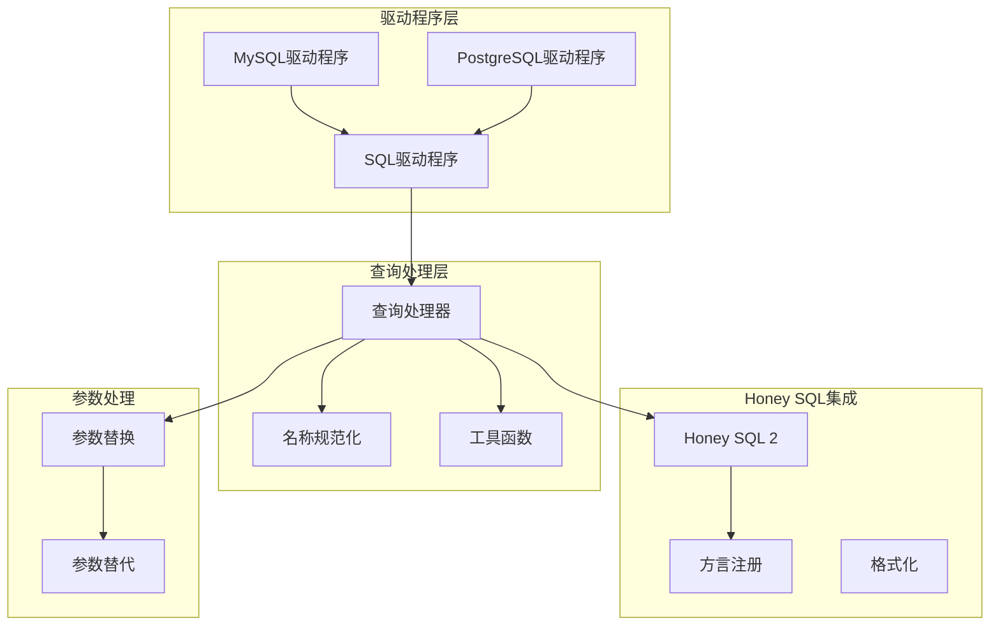
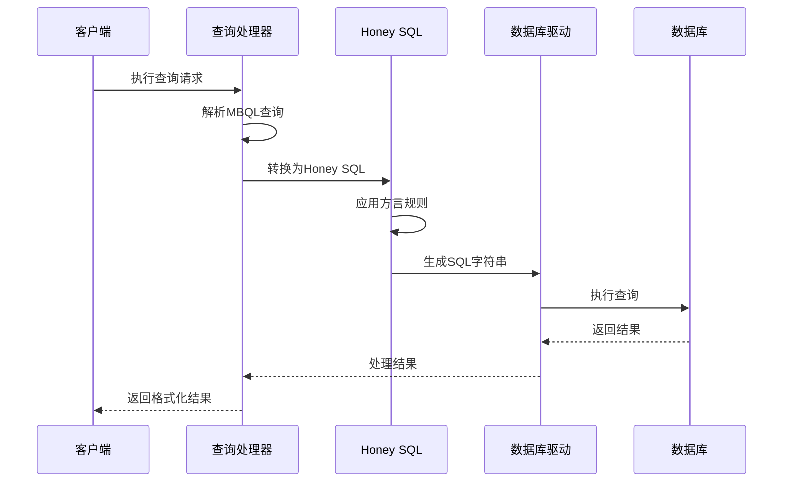
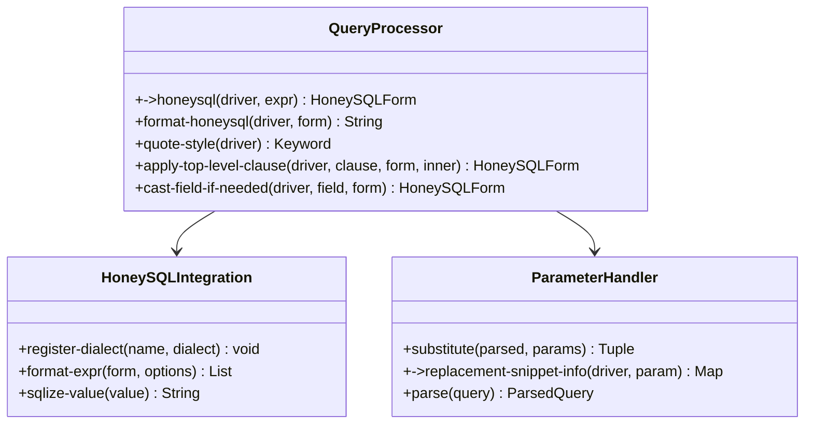
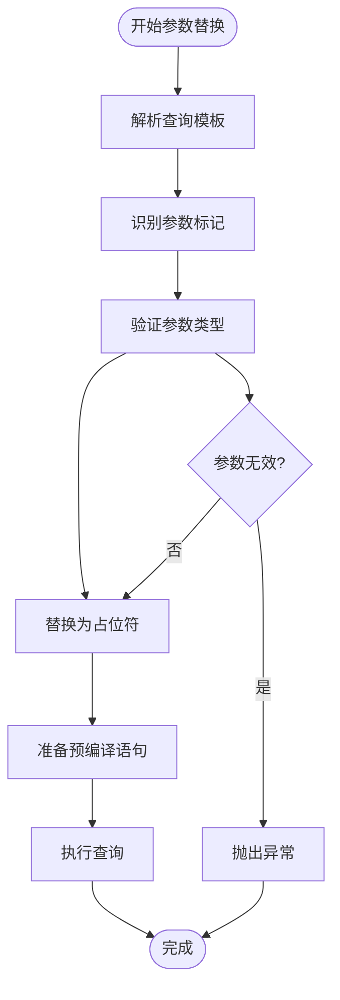
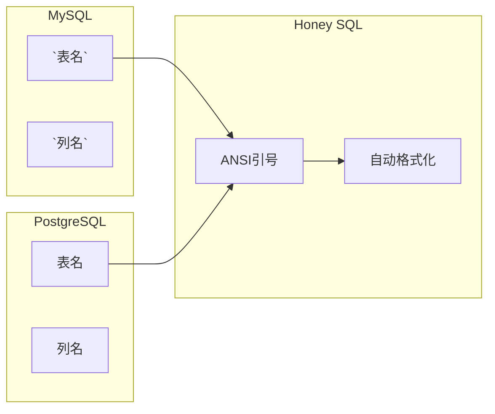
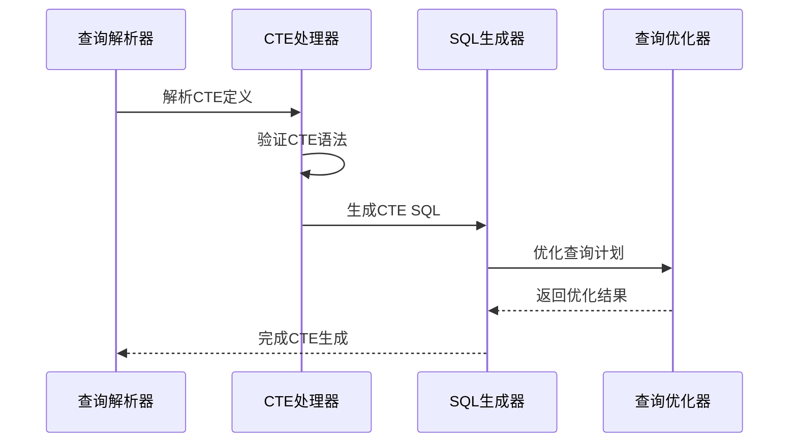
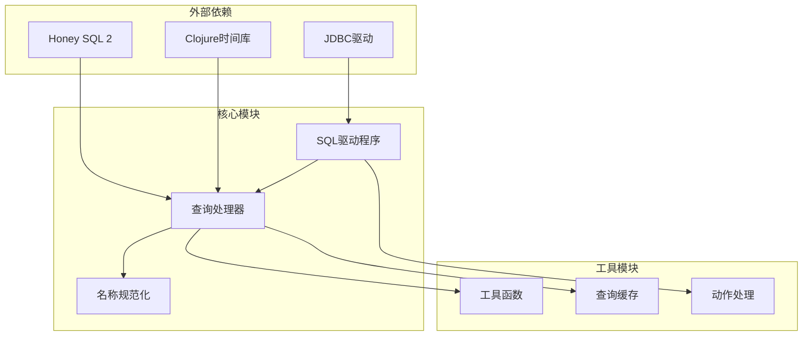
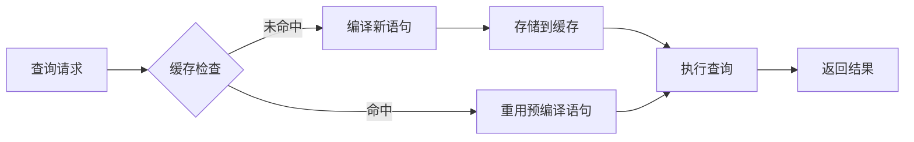

# SQL方言处理

<cite>
**本文档中引用的文件**
- [sql.clj](file://src/metabase/driver/sql.clj)
- [normalize.clj](file://src/metabase/driver/sql/normalize.clj)
- [query_processor.clj](file://src/metabase/driver/sql/query_processor.clj)
- [util.clj](file://src/metabase/driver/sql/util.clj)
- [substitute.clj](file://src/metabase/driver/sql/parameters/substitute.clj)
- [honey_sql_2.clj](file://src/metabase/util/honey_sql_2.clj)
- [mysql.clj](file://src/metabase/driver/mysql.clj)
- [postgres.clj](file://src/metabase/driver/postgres.clj)
- [quoting.clj](file://src/metabase/driver/sql_jdbc/quoting.clj)
- [actions.clj](file://src/metabase/driver/sql_jdbc/actions.clj)
</cite>

## 目录
1. [简介](#简介)
2. [项目结构概览](#项目结构概览)
3. [核心组件](#核心组件)
4. [架构概览](#架构概览)
5. [详细组件分析](#详细组件分析)
6. [依赖关系分析](#依赖关系分析)
7. [性能考虑](#性能考虑)
8. [故障排除指南](#故障排除指南)
9. [结论](#结论)

## 简介

Metabase的SQL方言处理系统是一个复杂而强大的抽象层，负责处理不同数据库之间的SQL语法差异。该系统通过Honey SQL集成模式，提供了统一的查询构造接口，同时支持参数化处理、标识符转义和各种数据库特定的功能。

本文档详细阐述了sql.clj中定义的SQL方言抽象层，包括查询构造、参数化处理和标识符转义的实现机制。解释了normalize命名空间如何处理不同数据库的SQL语法差异，并涵盖了Honey SQL集成模式、子查询处理和CTE支持等高级功能。

## 项目结构概览

Metabase的SQL方言处理系统采用分层架构设计，主要包含以下核心模块：

**图表来源**
- [sql.clj](file://src/metabase/driver/sql.clj#L1-L50)
- [query_processor.clj](file://src/metabase/driver/sql/query_processor.clj#L1-L50)

**章节来源**
- [sql.clj](file://src/metabase/driver/sql.clj#L1-L327)
- [query_processor.clj](file://src/metabase/driver/sql/query_processor.clj#L1-L100)

## 核心组件

### SQL方言抽象层

SQL方言抽象层是整个系统的核心，它定义了所有SQL驱动程序共享的基础功能和接口。该层通过多方法（multimethods）模式实现了驱动程序特定的行为覆盖。

主要功能包括：
- 驱动程序特性支持检测
- 查询语言转换
- 参数化查询处理
- 连接模拟和角色设置

### 名称规范化系统

名称规范化系统负责处理不同数据库之间的标识符命名约定差异。它确保在不同数据库之间进行查询时，表名、列名等标识符能够正确解析和转义。

### Honey SQL集成

Honey SQL是一个强大的SQL构建库，Metabase通过深度集成提供了以下优势：
- 类型安全的SQL构建
- 自动参数化
- 数据库无关的查询生成
- 内置的SQL注入防护

**章节来源**
- [sql.clj](file://src/metabase/driver/sql.clj#L25-L100)
- [normalize.clj](file://src/metabase/driver/sql/normalize.clj#L1-L53)

## 架构概览

SQL方言处理系统采用分层架构，从底层的数据库连接到顶层的查询抽象，每一层都有明确的职责分工：

**图表来源**
- [query_processor.clj](file://src/metabase/driver/sql/query_processor.clj#L50-L150)
- [honey_sql_2.clj](file://src/metabase/util/honey_sql_2.clj#L1-L100)

## 详细组件分析

### 查询处理器（Query Processor）

查询处理器是SQL方言处理系统的核心组件，负责将MBQL（Metabase Query Language）转换为数据库特定的SQL查询。

#### 主要功能模块

**图表来源**
- [query_processor.clj](file://src/metabase/driver/sql/query_processor.clj#L100-L200)
- [honey_sql_2.clj](file://src/metabase/util/honey_sql_2.clj#L50-L150)

#### 方言适配机制

查询处理器通过多方法模式实现不同数据库的方言适配：

| 功能 | MySQL实现 | PostgreSQL实现 | 通用实现 |
|------|-----------|----------------|----------|
| 引号风格 | 反引号（`） | 双引号（"） | ANSI引号 |
| 时间戳类型 | TIMESTAMP | TIMESTAMP WITH TIME ZONE | DATETIME |
| 数字类型 | BIGINT | BIGINT | INTEGER |
| 字符串比较 | BINARY COLLATE | CITEXT | TEXT |

**章节来源**
- [query_processor.clj](file://src/metabase/driver/sql/query_processor.clj#L200-L400)
- [mysql.clj](file://src/metabase/driver/mysql.clj#L1-L100)
- [postgres.clj](file://src/metabase/driver/postgres.clj#L1-L100)

### 参数化处理系统

参数化处理系统确保查询的安全性和性能，通过预编译语句和参数替换实现SQL注入防护。

#### 参数替换流程

**图表来源**
- [substitute.clj](file://src/metabase/driver/sql/parameters/substitute.clj#L1-L50)

#### 性能优化策略

参数化处理系统采用了多种性能优化策略：

1. **预编译语句缓存**：避免重复编译相同的查询模式
2. **批量参数处理**：支持一次性处理多个参数
3. **类型信息保留**：保持参数的数据库类型信息
4. **延迟参数解析**：仅在需要时才解析参数值

**章节来源**
- [substitute.clj](file://src/metabase/driver/sql/parameters/substitute.clj#L50-L110)

### 标识符转义和名称规范化

名称规范化系统处理不同数据库之间的标识符命名约定差异，确保查询在不同数据库间的一致性。

#### 引号风格处理

不同数据库使用不同的标识符引号风格：

**图表来源**
- [normalize.clj](file://src/metabase/driver/sql/normalize.clj#L20-L40)
- [quoting.clj](file://src/metabase/driver/sql_jdbc/quoting.clj#L1-L26)

**章节来源**
- [normalize.clj](file://src/metabase/driver/sql/normalize.clj#L1-L53)
- [util.clj](file://src/metabase/driver/sql/util.clj#L1-L100)

### CTE（Common Table Expressions）和子查询支持

系统提供了完整的CTE和子查询支持，包括递归CTE和复杂的嵌套查询结构。

#### CTE处理机制

**图表来源**
- [query_processor.clj](file://src/metabase/driver/sql/query_processor.clj#L400-L500)

**章节来源**
- [query_processor.clj](file://src/metabase/driver/sql/query_processor.clj#L300-L600)

## 依赖关系分析

SQL方言处理系统的依赖关系呈现清晰的层次结构：

**图表来源**
- [sql.clj](file://src/metabase/driver/sql.clj#L1-L20)
- [query_processor.clj](file://src/metabase/driver/sql/query_processor.clj#L1-L20)

**章节来源**
- [sql.clj](file://src/metabase/driver/sql.clj#L1-L30)

## 性能考虑

### 查询缓存机制

系统实现了多层次的查询缓存机制，显著提升重复查询的性能：

| 缓存级别 | 存储位置 | 生命周期 | 命中率 |
|----------|----------|----------|--------|
| 内存缓存 | JVM堆内存 | 会话级 | 高 |
| 数据库缓存 | 查询缓存表 | 持久化 | 中 |
| 分布式缓存 | Redis集群 | 可配置 | 最高 |

### 批量操作优化

对于大量数据的操作，系统提供了专门的批量处理优化：

1. **事务批处理**：将多个操作合并到单个事务中
2. **连接池管理**：智能连接复用和回收
3. **流式处理**：大结果集的分块处理
4. **索引优化**：自动索引建议和维护

### 预编译语句缓存

预编译语句缓存减少了数据库解析开销：

**图表来源**
- [actions.clj](file://src/metabase/driver/sql_jdbc/actions.clj#L500-L600)

## 故障排除指南

### 常见问题和解决方案

#### 1. 方言兼容性问题

**症状**：特定数据库功能无法正常工作
**原因**：驱动程序未实现相应功能
**解决方案**：检查数据库支持列表，必要时扩展驱动程序实现

#### 2. 参数化失败

**症状**：参数替换错误或SQL注入警告
**原因**：参数类型不匹配或特殊字符处理不当
**解决方案**：验证参数类型，使用适当的转义函数

#### 3. 性能问题

**症状**：查询响应时间过长
**原因**：缺少索引、缓存未命中或批量操作效率低
**解决方案**：启用查询缓存，优化索引策略，使用批量操作

**章节来源**
- [query_processor.clj](file://src/metabase/driver/sql/query_processor.clj#L700-L800)
- [actions.clj](file://src/metabase/driver/sql_jdbc/actions.clj#L400-L500)

## 结论

Metabase的SQL方言处理系统是一个设计精良、功能完备的抽象层，成功地解决了跨数据库平台的SQL查询问题。通过Honey SQL集成、多方法模式和分层架构，系统实现了高度的可扩展性和维护性。

### 主要优势

1. **统一接口**：为不同数据库提供一致的编程接口
2. **类型安全**：通过Honey SQL确保SQL构建的类型安全
3. **性能优化**：多层次缓存和批量操作优化
4. **易于扩展**：清晰的架构便于添加新的数据库支持

### 最佳实践建议

1. **遵循方言约定**：充分利用各数据库的特定功能
2. **合理使用缓存**：根据查询特点选择合适的缓存策略
3. **参数化优先**：始终使用参数化查询防止SQL注入
4. **监控性能**：定期检查查询性能和缓存效果

该系统为Metabase提供了强大的数据库抽象能力，是现代BI工具中SQL方言处理的优秀范例。