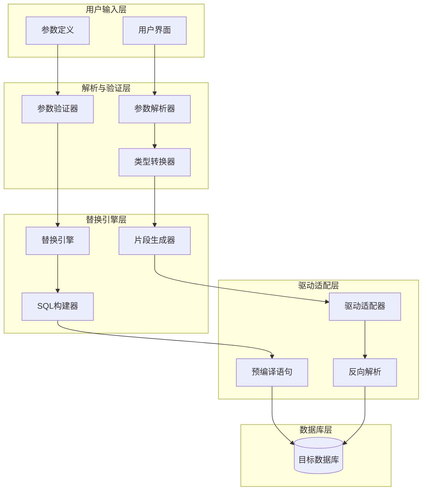
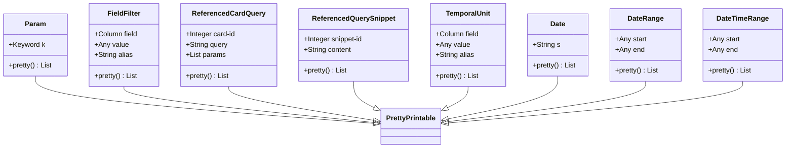
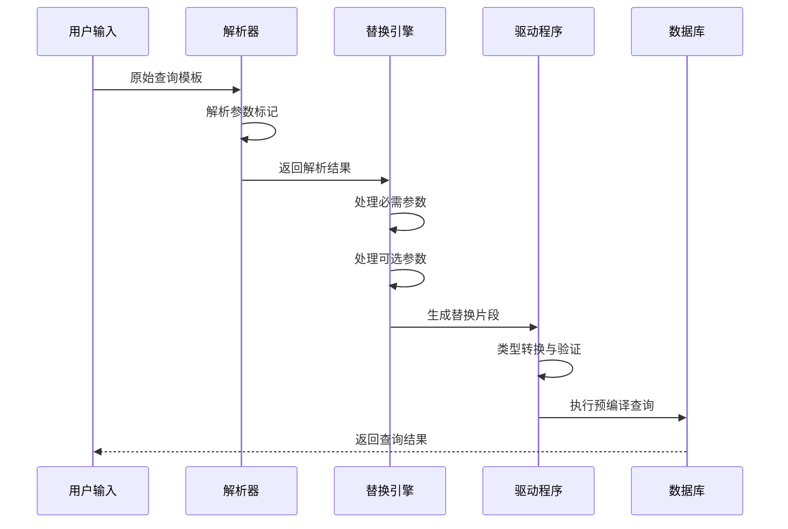
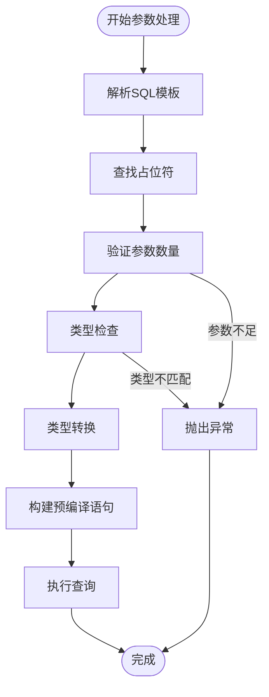
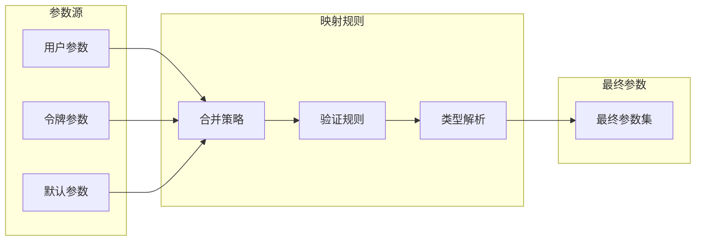
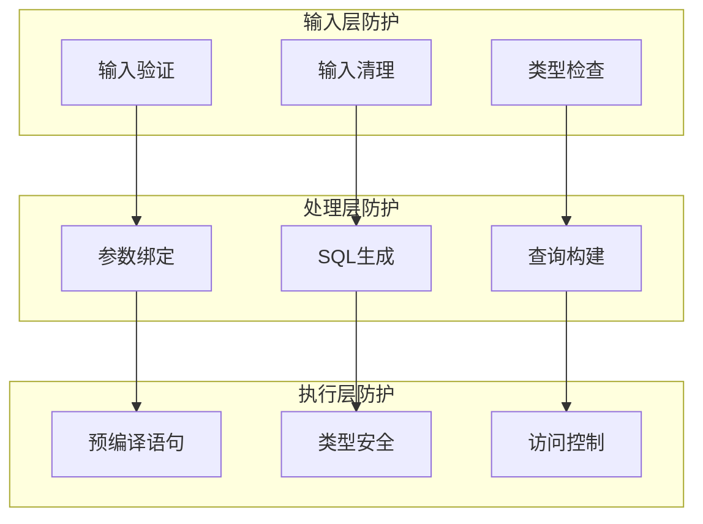
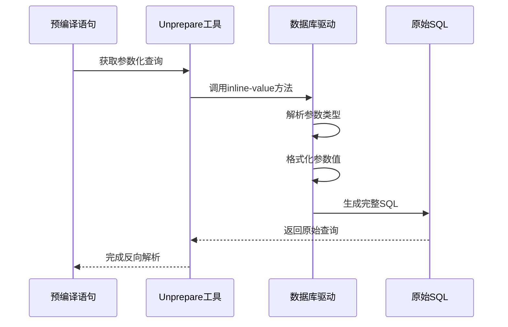
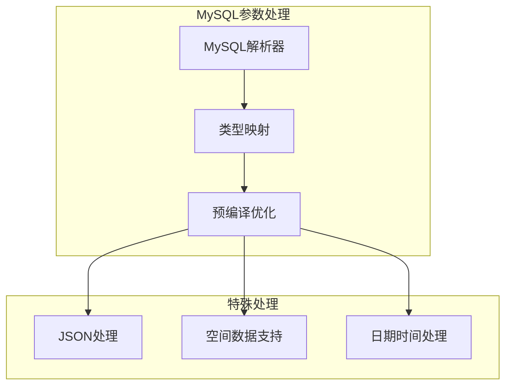
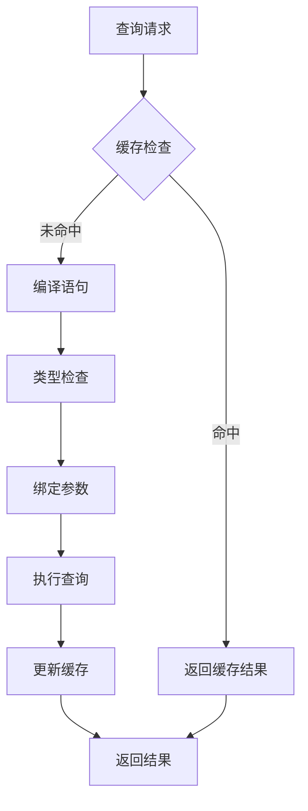
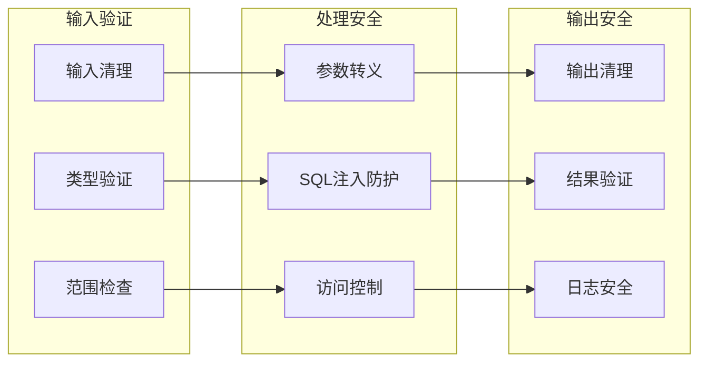

# 参数化处理

<cite>
**本文档中引用的文件**
- [substitution.clj](file://src/metabase/driver/sql/parameters/substitution.clj)
- [substitute.clj](file://src/metabase/driver/sql/parameters/substitute.clj)
- [unprepare.clj](file://src/metabase/driver/sql/util/unprepare.clj)
- [parameters.clj](file://src/metabase/driver/common/parameters.clj)
- [parse.clj](file://src/metabase/driver/common/parameters/parse.clj)
- [values.clj](file://src/metabase/driver/common/parameters/values.clj)
- [native.clj](file://src/metabase/query_processor/middleware/parameters/native.clj)
- [query_processor.clj](file://src/metabase/driver/sql/query_processor.clj)
- [mysql.clj](file://src/metabase/driver/mysql.clj)
- [h2.clj](file://src/metabase/driver/h2.clj)
</cite>

## 目录
1. [简介](#简介)
2. [系统架构概览](#系统架构概览)
3. [核心组件分析](#核心组件分析)
4. [参数替换机制](#参数替换机制)
5. [命名参数与位置参数](#命名参数与位置参数)
6. [SQL注入防护](#sql注入防护)
7. [unprepare工具详解](#unprepare工具详解)
8. [驱动特定行为](#驱动特定行为)
9. [性能优化与缓存](#性能优化与缓存)
10. [最佳实践指南](#最佳实践指南)
11. [故障排除](#故障排除)
12. [总结](#总结)

## 简介

Metabase的参数化处理系统是一个精心设计的安全框架，用于将用户输入安全地嵌入SQL查询中，防止SQL注入攻击。该系统通过分层架构实现了参数替换、类型转换、安全验证和性能优化等功能。

系统的核心设计理念是：
- **安全性优先**：所有用户输入都经过严格的参数化处理
- **类型安全**：支持多种数据类型的自动转换和验证
- **驱动兼容性**：为不同数据库驱动提供统一的接口
- **性能优化**：通过预编译语句和缓存机制提升执行效率

## 系统架构概览

参数化处理系统采用多层架构设计，确保安全性和可扩展性：

**图表来源**
- [substitution.clj](file://src/metabase/driver/sql/parameters/substitution.clj#L1-L50)
- [substitute.clj](file://src/metabase/driver/sql/parameters/substitute.clj#L1-L50)

## 核心组件分析

### 参数类型系统

Metabase定义了丰富的参数类型来处理不同的数据需求：

**图表来源**
- [parameters.clj](file://src/metabase/driver/common/parameters.clj#L15-L80)

### 替换机制流程

参数替换过程遵循严格的步骤序列：

**图表来源**
- [substitute.clj](file://src/metabase/driver/sql/parameters/substitute.clj#L70-L110)

**章节来源**
- [substitution.clj](file://src/metabase/driver/sql/parameters/substitution.clj#L1-L411)
- [substitute.clj](file://src/metabase/driver/sql/parameters/substitute.clj#L1-L110)
- [parameters.clj](file://src/metabase/driver/common/parameters.clj#L1-L131)

## 参数替换机制

### 命名参数处理

命名参数使用`{{param_name}}`语法，系统会将其替换为适当的SQL占位符：

| 参数类型 | 替换模式 | 示例 | 安全级别 |
|---------|---------|------|---------|
| 字符串 | `?` | `'John Doe'` | 高 |
| 数字 | `?` | `42` | 高 |
| 布尔值 | `?` | `true` | 高 |
| 日期 | `?` | `#t"2024-01-01"` | 中 |
| 枚举 | `?` | `:eq` | 高 |

### 位置参数处理

位置参数使用`?`占位符，系统按顺序绑定参数值：

**图表来源**
- [substitution.clj](file://src/metabase/driver/sql/parameters/substitution.clj#L50-L100)

**章节来源**
- [substitution.clj](file://src/metabase/driver/sql/parameters/substitution.clj#L50-L200)

## 命名参数与位置参数

### 命名参数特性

命名参数提供了更好的可读性和维护性：

- **自描述性**：参数名称直接反映其用途
- **位置无关**：参数可以在SQL中的任意位置
- **类型安全**：支持复杂的数据类型
- **条件处理**：支持可选参数和条件逻辑

### 位置参数特性

位置参数适用于简单的查询场景：

- **简洁性**：语法简单，易于理解
- **性能优势**：预编译时开销较小
- **兼容性**：广泛支持各种数据库驱动
- **批量操作**：适合批量插入和更新

### 参数映射策略

系统支持灵活的参数映射机制：

**图表来源**
- [native.clj](file://src/metabase/query_processor/middleware/parameters/native.clj#L1-L50)

**章节来源**
- [parse.clj](file://src/metabase/driver/common/parameters/parse.clj#L1-L47)
- [native.clj](file://src/metabase/query_processor/middleware/parameters/native.clj#L1-L21)

## SQL注入防护

### 多层防护机制

Metabase实现了多层次的安全防护：

**图表来源**
- [substitution.clj](file://src/metabase/driver/sql/parameters/substitution.clj#L200-L300)

### 安全验证规则

| 验证类型 | 检查内容 | 防护效果 |
|---------|---------|---------|
| 输入验证 | 参数格式和范围 | 阻止恶意输入 |
| 类型验证 | 数据类型一致性 | 防止类型混淆攻击 |
| 权限验证 | 访问权限检查 | 限制敏感操作 |
| 输出验证 | 结果集过滤 | 防止信息泄露 |

### 注入攻击防护

系统针对常见的SQL注入攻击提供专门防护：

- **字符串注入**：自动转义特殊字符
- **数字注入**：严格类型检查
- **布尔注入**：逻辑验证
- **时间注入**：时间范围验证
- **枚举注入**：预定义集合检查

**章节来源**
- [substitution.clj](file://src/metabase/driver/sql/parameters/substitution.clj#L300-L411)

## unprepare工具详解

### 反向解析功能

unprepare工具负责将预编译语句还原为原始SQL查询：

**图表来源**
- [unprepare.clj](file://src/metabase/driver/sql/util/unprepare.clj#L1-L26)

### 实现细节

unprepare工具的核心实现包括：

- **参数内联**：将`?`占位符替换为实际值
- **类型处理**：正确处理不同数据类型的格式化
- **转义处理**：确保特殊字符被正确转义
- **注释保留**：保持SQL注释的完整性

### 使用场景

unprepare工具在以下场景中发挥重要作用：

- **调试支持**：帮助开发者理解生成的SQL
- **审计追踪**：记录实际执行的查询
- **性能分析**：分析查询执行计划
- **错误诊断**：定位参数绑定问题

**章节来源**
- [unprepare.clj](file://src/metabase/driver/sql/util/unprepare.clj#L1-L26)

## 驱动特定行为

### MySQL驱动特性

MySQL驱动实现了特定的参数处理逻辑：

**图表来源**
- [mysql.clj](file://src/metabase/driver/mysql.clj#L1-L100)

### H2驱动特性

H2驱动具有独特的参数处理能力：

- **内置解析器**：利用H2的原生解析器
- **命令类型检测**：识别SQL命令类型
- **安全选项**：自动移除危险配置项
- **时区处理**：智能时区转换

### 跨驱动兼容性

系统通过多态机制确保跨驱动兼容：

| 功能 | MySQL | H2 | PostgreSQL | SQLite |
|------|-------|----|------------|--------|
| 参数绑定 | ✓ | ✓ | ✓ | ✓ |
| 类型转换 | ✓ | ✓ | ✓ | ✓ |
| 预编译优化 | ✓ | ✓ | ✓ | ✓ |
| 错误处理 | ✓ | ✓ | ✓ | ✓ |

**章节来源**
- [mysql.clj](file://src/metabase/driver/mysql.clj#L1-L199)
- [h2.clj](file://src/metabase/driver/h2.clj#L1-L100)

## 性能优化与缓存

### 预编译语句缓存

系统实现了智能的预编译语句缓存机制：

**图表来源**
- [query_processor.clj](file://src/metabase/driver/sql/query_processor.clj#L1600-L1700)

### 缓存策略

| 缓存类型 | 生命周期 | 大小限制 | 清理策略 |
|---------|---------|---------|---------|
| 预编译语句 | 会话级 | 1000条 | LRU |
| 查询结果 | 分钟级 | 1GB | TTL |
| 元数据缓存 | 连接级 | 100MB | 手动清理 |

### 性能基准测试建议

为了评估参数化处理的性能，建议进行以下测试：

1. **基准测试指标**
   - 参数替换延迟
   - 预编译语句编译时间
   - 内存使用量
   - 并发处理能力

2. **测试场景**
   - 单参数查询
   - 多参数复杂查询
   - 大数据量批量操作
   - 高并发压力测试

3. **监控指标**
   - CPU使用率
   - 内存分配
   - 数据库连接池状态
   - 错误率统计

**章节来源**
- [query_processor.clj](file://src/metabase/driver/sql/query_processor.clj#L1-L200)

## 最佳实践指南

### 参数设计原则

1. **最小权限原则**
   - 只暴露必要的参数
   - 避免敏感信息暴露
   - 实施细粒度权限控制

2. **类型安全设计**
   - 明确指定参数类型
   - 实施严格的输入验证
   - 提供友好的错误提示

3. **性能优化考虑**
   - 合理使用预编译语句
   - 避免频繁的参数重新绑定
   - 优化参数传递路径

### 安全编码规范

### 错误处理策略

- **优雅降级**：参数错误时提供默认值
- **详细日志**：记录详细的错误信息
- **用户友好**：提供清晰的错误提示
- **安全审计**：记录所有安全相关事件

## 故障排除

### 常见问题诊断

| 问题类型 | 症状 | 可能原因 | 解决方案 |
|---------|------|---------|---------|
| 参数绑定失败 | SQL语法错误 | 类型不匹配 | 检查参数类型定义 |
| 性能下降 | 查询响应慢 | 缓存失效 | 清理缓存并优化查询 |
| 内存泄漏 | 内存持续增长 | 预编译语句未释放 | 检查连接池配置 |
| 安全警告 | 权限拒绝 | 参数验证失败 | 更新安全策略 |

### 调试工具

系统提供了多种调试工具：

- **参数跟踪**：监控参数传递过程
- **SQL生成器**：查看生成的SQL语句
- **性能分析器**：分析执行性能
- **安全审计器**：检查安全策略执行

### 日志分析

关键日志点包括：

1. **参数解析阶段**：记录解析错误和警告
2. **类型转换阶段**：记录类型转换失败
3. **SQL生成阶段**：记录生成的SQL语句
4. **执行阶段**：记录执行时间和错误

**章节来源**
- [values.clj](file://src/metabase/driver/common/parameters/values.clj#L300-L357)

## 总结

Metabase的参数化处理系统是一个功能完备、安全可靠的解决方案，它通过以下关键特性确保系统的安全性和性能：

### 核心优势

1. **安全性保障**
   - 多层防护机制
   - 自动SQL注入防护
   - 类型安全保证

2. **性能优化**
   - 智能缓存机制
   - 预编译语句优化
   - 并发处理支持

3. **兼容性设计**
   - 多数据库驱动支持
   - 统一接口抽象
   - 驱动特定优化

4. **开发友好**
   - 清晰的API设计
   - 完善的错误处理
   - 丰富的调试工具

### 技术创新

- **动态参数绑定**：运行时类型推断和转换
- **智能缓存策略**：基于使用模式的缓存优化
- **跨驱动抽象**：统一的参数处理接口
- **安全自动化**：内置的安全检查和防护

该系统为现代Web应用程序提供了企业级的参数化处理能力，既保证了安全性，又兼顾了性能和易用性。通过合理的架构设计和最佳实践的应用，能够有效防范各种安全威胁，同时提供优秀的用户体验。