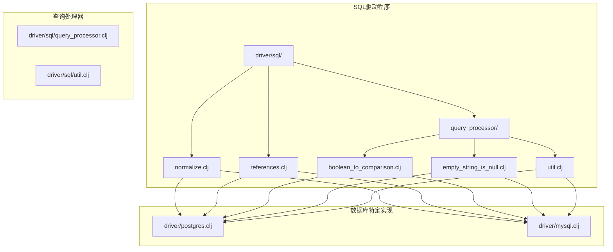
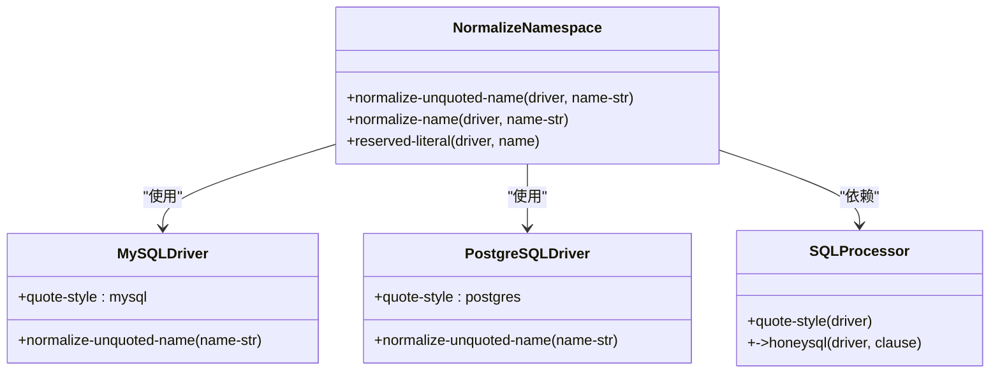
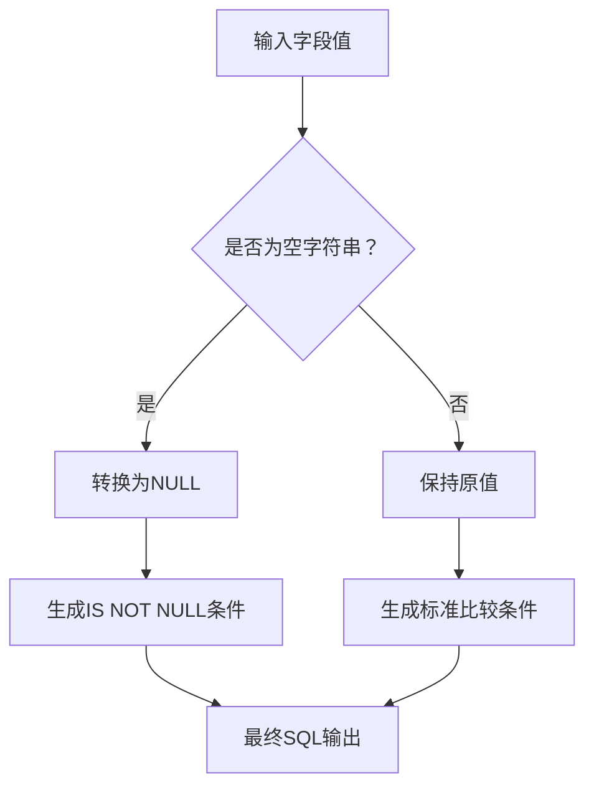
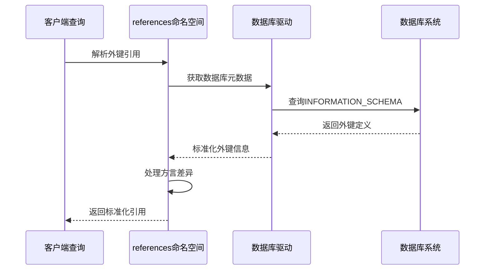
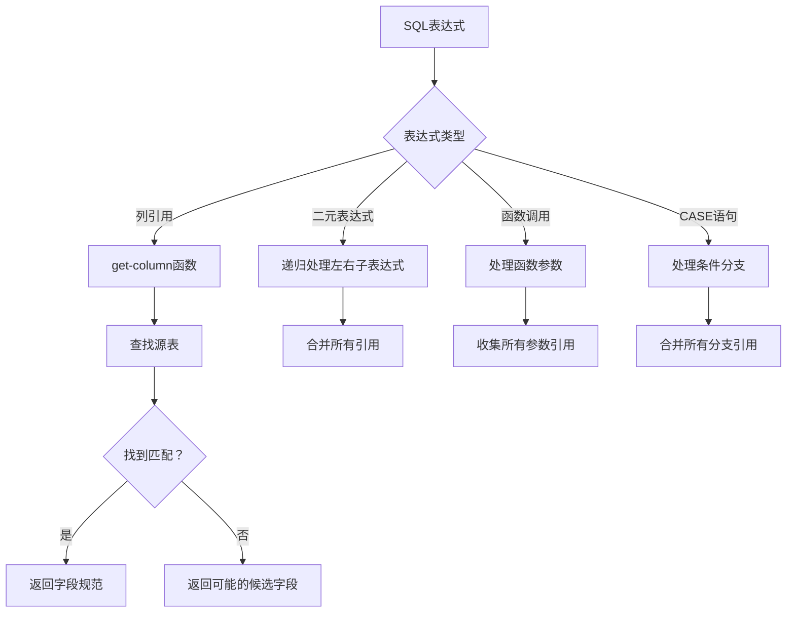
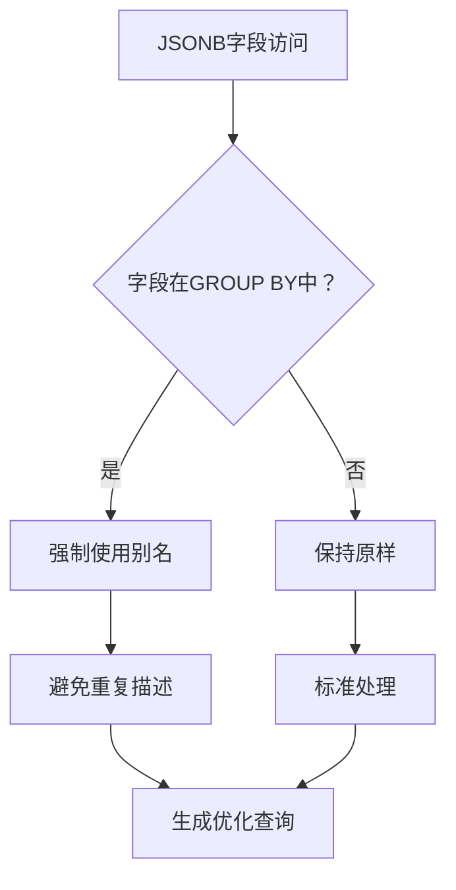
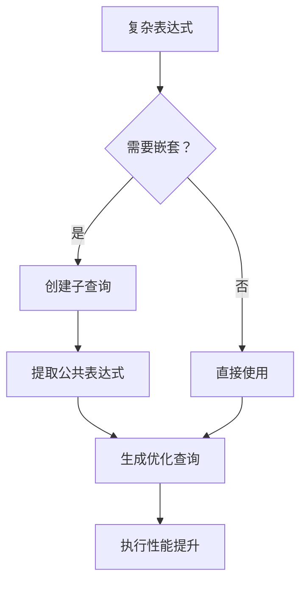
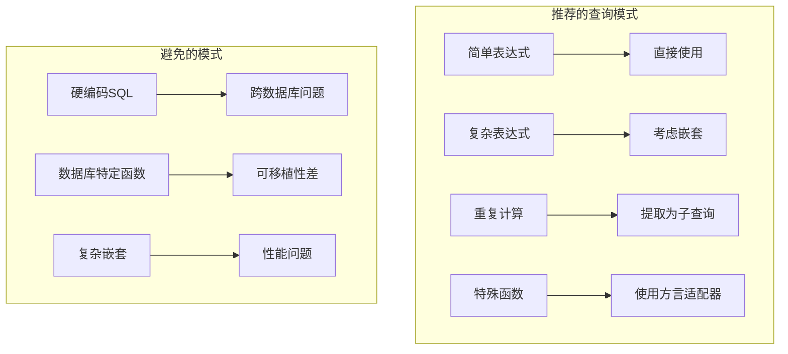
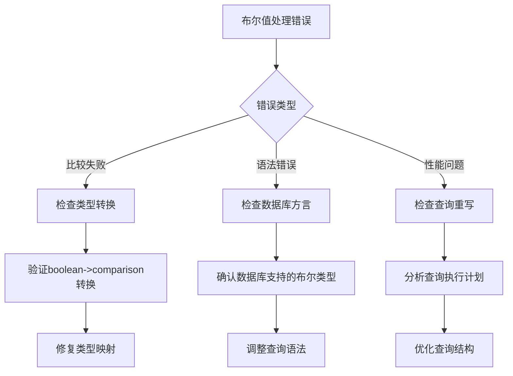

# 方言特定优化技术指南

<cite>
**本文档中引用的文件**
- [normalize.clj](file://src/metabase/driver/sql/normalize.clj)
- [references.clj](file://src/metabase/driver/sql/references.clj)
- [query_processor.clj](file://src/metabase/driver/sql/query_processor.clj)
- [empty_string_is_null.clj](file://src/metabase/driver/sql/query_processor/empty_string_is_null.clj)
- [boolean_to_comparison.clj](file://src/metabase/driver/sql/query_processor/boolean_to_comparison.clj)
- [postgres.clj](file://src/metabase/driver/postgres.clj)
- [mysql.clj](file://src/metabase/driver/mysql.clj)
- [util.clj](file://src/metabase/driver/sql/util.clj)
</cite>

## 目录
1. [简介](#简介)
2. [项目结构概览](#项目结构概览)
3. [normalize命名空间：SQL语法归一化](#normalize命名空间sql语法归一化)
4. [references命名空间：外键引用处理](#references命名空间外键引用处理)
5. [数据库特定方言处理](#数据库特定方言处理)
6. [性能优化策略](#性能优化策略)
7. [最佳实践指导](#最佳实践指导)
8. [故障排除指南](#故障排除指南)
9. [总结](#总结)

## 简介

Metabase的方言特定优化系统是一个复杂而精密的架构，旨在为不同的数据库管理系统（DBMS）提供统一的查询处理接口。该系统通过normalize命名空间处理SQL语法的标准化，通过references命名空间管理外键引用的方言差异，并通过查询处理器实现针对特定数据库特性的性能优化。

本指南将深入探讨这些核心组件的工作原理，重点分析MySQL、PostgreSQL等主流数据库的方言差异处理策略，以及如何利用特定数据库特性进行查询重写和性能优化。

## 项目结构概览

Metabase的方言特定优化系统主要分布在以下关键目录中：



**图表来源**
- [normalize.clj](file://src/metabase/driver/sql/normalize.clj#L1-L53)
- [references.clj](file://src/metabase/driver/sql/references.clj#L1-L344)

**章节来源**
- [normalize.clj](file://src/metabase/driver/sql/normalize.clj#L1-L53)
- [references.clj](file://src/metabase/driver/sql/references.clj#L1-L344)

## normalize命名空间：SQL语法归一化

normalize命名空间是Metabase方言特定优化的核心组件之一，负责处理不同数据库之间的SQL语法差异，特别是NULL值处理和布尔值表示等关键问题。

### 核心功能架构



**图表来源**
- [normalize.clj](file://src/metabase/driver/sql/normalize.clj#L8-L32)
- [query_processor.clj](file://src/metabase/driver/sql/query_processor.clj#L1-L50)

### NULL值处理策略

normalize命名空间实现了智能的NULL值处理机制，特别针对MySQL的空字符串转换问题：

#### MySQL空字符串转换

在MySQL中，空字符串（''）与NULL值的行为存在显著差异。normalize命名空间提供了专门的处理逻辑：



**图表来源**
- [empty_string_is_null.clj](file://src/metabase/driver/sql/query_processor/empty_string_is_null.clj#L10-L20)

#### 布尔值表示差异

不同数据库对布尔值的表示方式存在重大差异：

| 数据库 | 布尔值表示 | 处理策略 |
|--------|------------|----------|
| PostgreSQL | BOOLEAN类型 | 直接支持布尔类型 |
| MySQL | TINYINT(1)或BIT | 数字类型表示 |
| Oracle | NUMBER(1) | 数字类型表示 |
| SQL Server | BIT | 专用位类型 |

**章节来源**
- [normalize.clj](file://src/metabase/driver/sql/normalize.clj#L35-L51)
- [boolean_to_comparison.clj](file://src/metabase/driver/sql/query_processor/boolean_to_comparison.clj#L1-L110)

## references命名空间：外键引用处理

references命名空间专门处理不同数据库系统中外键引用的方言差异，确保查询语义的一致性。

### 外键引用处理架构



**图表来源**
- [references.clj](file://src/metabase/driver/sql/references.clj#L100-L150)

### 字段引用解析

references命名空间实现了复杂的字段引用解析机制，能够处理各种SQL表达式：



**图表来源**
- [references.clj](file://src/metabase/driver/sql/references.clj#L120-L180)

**章节来源**
- [references.clj](file://src/metabase/driver/sql/references.clj#L100-L200)

## 数据库特定方言处理

### MySQL方言处理

MySQL作为最广泛使用的开源数据库，在Metabase中有专门的方言处理策略：

#### 类型映射和转换

MySQL的类型系统与标准SQL存在差异，特别是在布尔值和数值类型方面：

```mermaid
graph LR
subgraph "MySQL类型处理"
A[TINYINT(1)] --> B[转换为BIT类型]
C[空字符串] --> D[转换为NULL]
E[BOOLEAN常量] --> F[数字表示]
end
subgraph "查询重写"
G[原始查询] --> H[类型检查]
H --> I[条件转换]
I --> J[重写后的查询]
end
```

**图表来源**
- [mysql.clj](file://src/metabase/driver/mysql.clj#L1096-L1118)

#### 空字符串处理

MySQL对空字符串的特殊处理需要在查询生成阶段进行干预：

**章节来源**
- [mysql.clj](file://src/metabase/driver/mysql.clj#L1096-L1118)
- [empty_string_is_null.clj](file://src/metabase/driver/sql/query_processor/empty_string_is_null.clj#L1-L21)

### PostgreSQL方言处理

PostgreSQL作为功能最丰富的开源数据库，在Metabase中有专门的优化处理：

#### JSONB字段优化

PostgreSQL的JSONB类型需要特殊的查询处理逻辑：



**图表来源**
- [postgres.clj](file://src/metabase/driver/postgres.clj#L741-L766)

#### JSON查询重写

PostgreSQL的JSON查询需要特殊的语法处理：

**章节来源**
- [postgres.clj](file://src/metabase/driver/postgres.clj#L678-L714)
- [postgres.clj](file://src/metabase/driver/postgres.clj#L741-L795)

## 性能优化策略

### 利用特定数据库特性

不同数据库都有其独特的性能优化特性，Metabase通过查询重写技术充分利用这些优势：

#### PostgreSQL JSONB索引优化

PostgreSQL的JSONB类型支持高效的索引和查询：


**图表来源**
- [postgres.clj](file://src/metabase/driver/postgres.clj#L678-L714)

#### MySQL字符集优化

MySQL的字符集处理对性能有重要影响：

**章节来源**
- [postgres.clj](file://src/metabase/driver/postgres.clj#L678-L795)
- [mysql.clj](file://src/metabase/driver/mysql.clj#L86-L107)

### 查询重写技术

#### 表达式嵌套优化

为了提高查询性能，Metabase实现了表达式嵌套优化：



**图表来源**
- [query_processor.clj](file://src/metabase/driver/sql/query_processor.clj#L50-L100)

#### 字段别名去重

Oracle等数据库对重复字段名称的处理限制需要特殊的去重策略：

**章节来源**
- [util.clj](file://src/metabase/driver/sql/util.clj#L50-L100)
- [query_processor.clj](file://src/metabase/driver/sql/query_processor.clj#L50-L150)

## 最佳实践指导

### 避免跨方言不兼容操作

在设计跨数据库应用时，应遵循以下最佳实践：

#### 类型安全原则

1. **明确类型声明**：始终为数据库字段指定明确的数据类型
2. **避免隐式转换**：使用显式的类型转换函数
3. **测试多数据库兼容性**：在目标数据库上验证查询行为

#### 查询模式建议



### 性能监控和调优

#### 查询性能分析

1. **执行计划分析**：定期检查查询执行计划
2. **索引使用监控**：确保正确使用数据库索引
3. **资源消耗跟踪**：监控CPU和内存使用情况

#### 优化策略实施

**章节来源**
- [util.clj](file://src/metabase/driver/sql/util.clj#L150-L192)

## 故障排除指南

### 常见方言问题诊断

#### 布尔值处理错误

当遇到布尔值处理问题时，可以按照以下步骤排查：



#### 外键引用问题

外键引用问题的诊断流程：

**章节来源**
- [references.clj](file://src/metabase/driver/sql/references.clj#L200-L300)

### 调试工具和技术

#### 查询日志分析

1. **启用详细日志**：配置数据库连接的日志级别
2. **分析执行时间**：识别性能瓶颈
3. **检查错误消息**：理解具体失败原因

#### 测试策略

1. **单元测试**：为每个方言特定功能编写测试
2. **集成测试**：验证跨数据库兼容性
3. **性能测试**：评估查询优化效果

## 总结

Metabase的方言特定优化系统展现了现代数据库抽象层的设计精髓。通过normalize命名空间的SQL语法归一化、references命名空间的外键引用处理，以及针对特定数据库特性的查询重写，该系统成功地解决了跨数据库应用开发中的核心挑战。

### 关键成就

1. **统一的查询接口**：为开发者提供一致的编程模型
2. **自动方言适配**：透明处理数据库间的语法差异
3. **性能优化集成**：充分利用各数据库的特性优势
4. **可扩展架构**：支持新数据库类型的快速集成

### 未来发展方向

随着数据库技术的不断发展，方言特定优化系统将继续演进，重点关注：
- 新兴数据库系统的支持
- AI驱动的查询优化
- 更精细的性能调优策略
- 更强的向后兼容性保证

通过深入理解和正确运用这些优化技术，开发者可以构建出既高性能又具有强大兼容性的数据库应用程序。