# 查询构造

<cite>
**本文档中引用的文件**   
- [sql.clj](file://src/metabase/driver/sql/query_processor.clj)
- [query_processor.clj](file://src/metabase/query_processor.clj)
</cite>

## 目录
1. [引言](#引言)
2. [核心组件分析](#核心组件分析)
3. [Honey SQL 构造机制](#honey-sql-构造机制)
4. [MBQL 到 SQL 的转换流程](#mbql-到-sql-的转换流程)
5. [CTE 与子查询处理](#cte-与子查询处理)
6. [多层查询构造](#多层查询构造)
7. [性能影响分析](#性能影响分析)
8. [数据库方言兼容性](#数据库方言兼容性)
9. [结论](#结论)

## 引言
Metabase 系统中的查询构造模块负责将 Metabase 查询语言（MBQL）转换为标准 SQL 语句。该系统通过 Honey SQL 库实现 SQL 语句的构建，支持复杂的查询转换，包括 SELECT、FROM、WHERE、JOIN 等子句的生成。查询处理器在 MBQL 到 SQL 的转换过程中扮演核心角色，确保查询语义的完整性和正确性。本技术文档详细描述了 sql.clj 文件中如何通过 Honey SQL 构建标准 SQL 语句，以及 query_processor 命名空间在转换过程中的作用。

## 核心组件分析

Metabase 的查询构造系统主要由两个核心组件构成：sql.clj 文件和 query_processor 命名空间。sql.clj 文件位于 src/metabase/driver/sql/query_processor.clj 路径下，是 SQL 查询处理器的主要实现文件。该文件定义了将 MBQL 查询转换为 Honey SQL 形式的各种多方法（multimethods），包括 ->honeysql、apply-top-level-clause 等关键函数。query_processor 命名空间则提供了查询处理的入口点和中间件管道，协调整个查询转换过程。

**Section sources**
- [sql.clj](file://src/metabase/driver/sql/query_processor.clj#L0-L36)
- [query_processor.clj](file://src/metabase/query_processor.clj#L0-L116)

## Honey SQL 构造机制

### Honey SQL 基础
Honey SQL 是一个 Clojure 库，用于以数据结构的形式构建 SQL 语句。在 Metabase 中，Honey SQL 被用作 MBQL 到 SQL 转换的中间表示。查询处理器首先将 MBQL 查询转换为 Honey SQL 形式，然后使用 sql/format 函数将其编译为最终的 SQL 字符串。

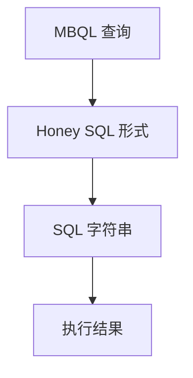

**Diagram sources**
- [sql.clj](file://src/metabase/driver/sql/query_processor.clj#L275-L307)

### ->honeysql 多方法
->honeysql 是查询处理器中的核心多方法，负责将 MBQL 表达式转换为 Honey SQL 形式。该方法根据驱动程序和表达式类型进行分派，支持各种 MBQL 子句的转换。

```mermaid
classDiagram
class ->honeysql {
+driver : Keyword
+x : Any
+return : HoneySQLForm
}
class apply-top-level-clause {
+driver : Keyword
+top-level-clause : Keyword
+honeysql-form : Map
+inner-query : Map
+return : Map
}
class format-honeysql {
+driver : Keyword
+honeysql-form : Map
+return : Vector
}
->honeysql --> apply-top-level-clause : "调用"
apply-top-level-clause --> format-honeysql : "调用"
```

**Diagram sources**
- [sql.clj](file://src/metabase/driver/sql/query_processor.clj#L275-L307)

## MBQL 到 SQL 的转换流程

### 转换流程概述
MBQL 到 SQL 的转换流程遵循一个系统化的步骤，确保查询的各个部分按正确的顺序处理。查询处理器首先对 MBQL 查询进行预处理，然后逐步应用各个顶层子句，最后生成最终的 SQL 语句。

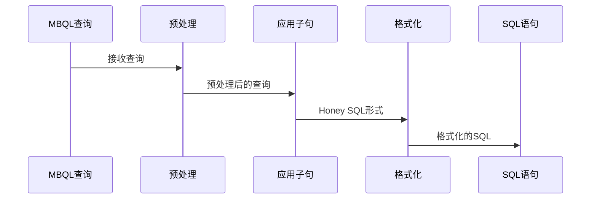

**Diagram sources**
- [sql.clj](file://src/metabase/driver/sql/query_processor.clj#L2067-L2091)

### 子句生成逻辑
查询处理器通过 apply-top-level-clause 多方法处理各种顶层 MBQL 子句。每个子句都有特定的处理逻辑，确保生成正确的 SQL 结构。

#### SELECT 子句
SELECT 子句的生成通过 :aggregation 和 :fields 子句处理。聚合函数如 :count、:sum 等被转换为相应的 SQL 聚合函数。

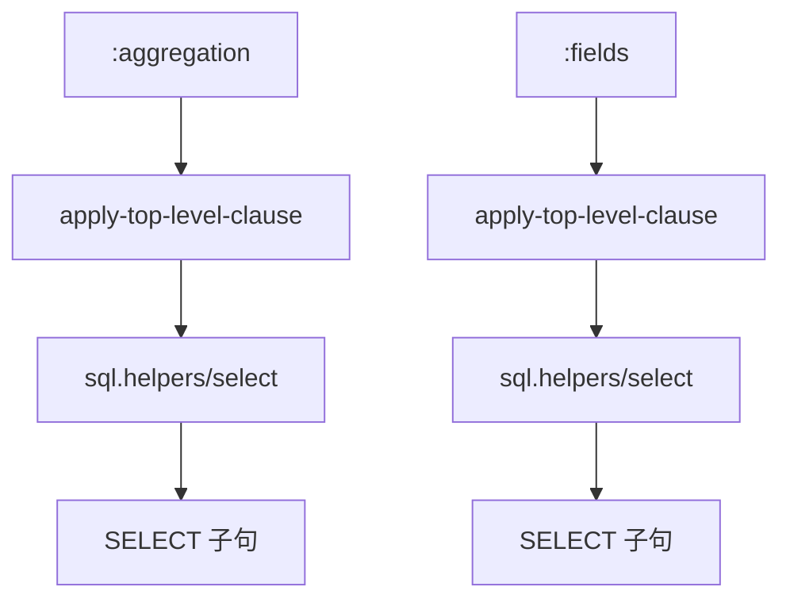

**Diagram sources**
- [sql.clj](file://src/metabase/driver/sql/query_processor.clj#L1704-L1742)

#### FROM 子句
FROM 子句的生成通过 :source-table 子句处理。查询处理器首先获取表元数据，然后使用 ->honeysql 将其转换为 Honey SQL 标识符。

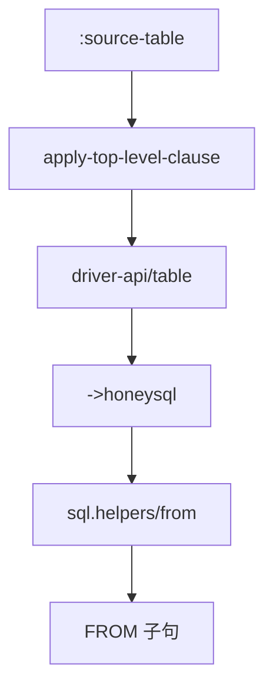

**Diagram sources**
- [sql.clj](file://src/metabase/driver/sql/query_processor.clj#L1834-L1858)

#### WHERE 子句
WHERE 子句的生成通过 :filter 子句处理。查询处理器递归地将过滤条件转换为 Honey SQL 形式，支持复杂的逻辑表达式。

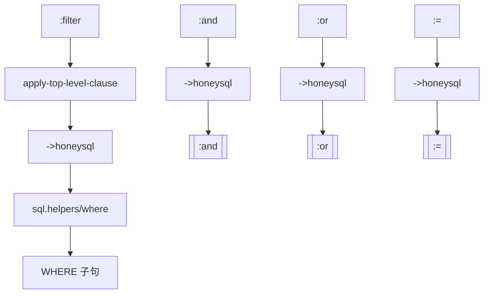

**Diagram sources**
- [sql.clj](file://src/metabase/driver/sql/query_processor.clj#L1739-L1780)

#### JOIN 子句
JOIN 子句的生成通过 :joins 子句处理。查询处理器使用 join->honeysql 多方法将每个连接转换为 Honey SQL 形式。

```mermaid
classDiagram
class join->honeysql {
+driver : Keyword
+join : Map
+return : HoneySQLJoin
}
class join-source {
+driver : Keyword
+join : Map
+return : HoneySQLForm
}
join->honeysql --> join-source : "调用"
join-source --> join->honeysql : "返回"
```

**Diagram sources**
- [sql.clj](file://src/metabase/driver/sql/query_processor.clj#L1739-L1780)

## CTE 与子查询处理

### CTE 处理机制
公共表表达式（CTE）在 Metabase 中通过 WITH 子句实现。当查询包含具有歧义列名的源查询时，查询处理器会使用 WITH 语句来重命名源列。

```mermaid
flowchart TD
A[源查询] --> B[apply-source-query]
B --> C{是否有歧义列名?}
C --> |是| D[使用WITH语句]
C --> |否| E[直接FROM]
D --> F[WITH ... SELECT]
E --> G[FROM (子查询)]
```

**Diagram sources**
- [sql.clj](file://src/metabase/driver/sql/query_processor.clj#L2000-L2092)

### 子查询处理
子查询的处理机制与 CTE 类似，但更侧重于嵌套查询的语义完整性。查询处理器确保子查询中的列引用正确解析，并在必要时添加适当的别名。

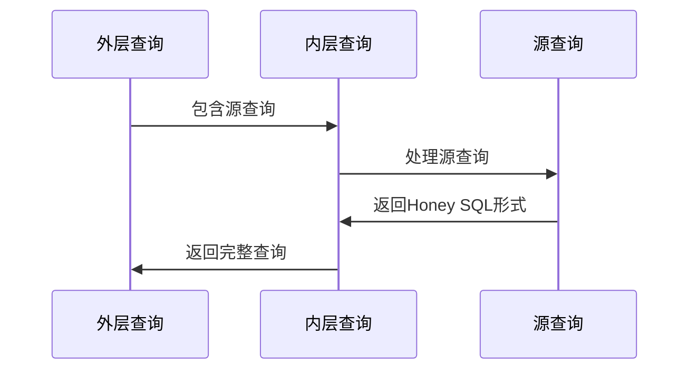

**Diagram sources**
- [sql.clj](file://src/metabase/driver/sql/query_processor.clj#L2000-L2092)

## 多层查询构造

### 多层查询流程
多层查询的构造流程涉及递归处理源查询和应用各种转换。查询处理器通过 apply-clauses 函数递归地处理查询的各个部分。

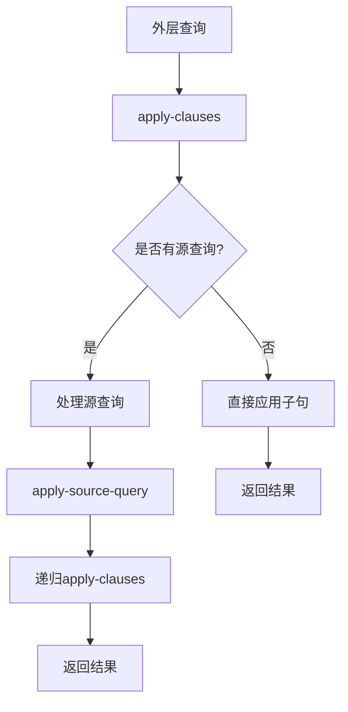

**Diagram sources**
- [sql.clj](file://src/metabase/driver/sql/query_processor.clj#L2000-L2092)

### 语义完整性保持
为了保持嵌套查询的语义完整性，查询处理器采用多种机制，包括别名管理、类型信息保留和上下文绑定。

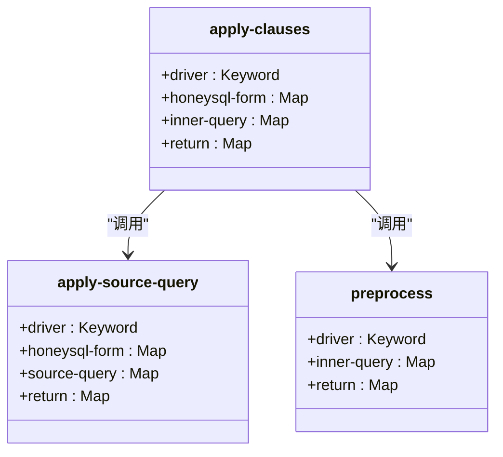

**Diagram sources**
- [sql.clj](file://src/metabase/driver/sql/query_processor.clj#L2000-L2092)

## 性能影响分析

### 查询编译性能
查询编译过程的性能主要受查询复杂度和嵌套深度的影响。复杂的多层查询需要更多的递归调用和数据结构转换，可能导致性能下降。

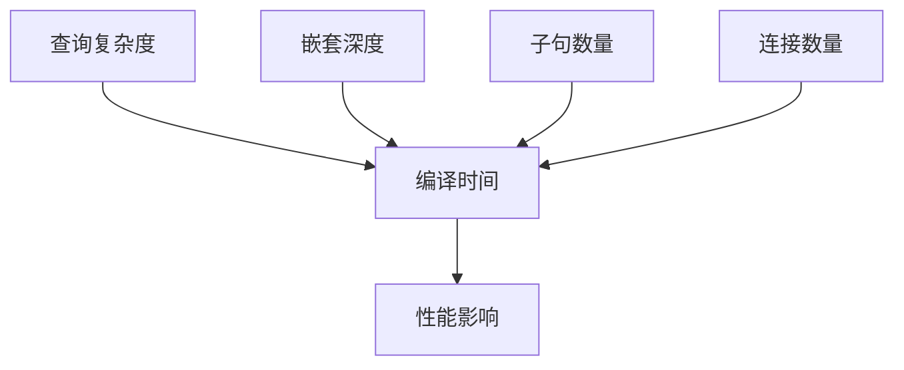

**Diagram sources**
- [sql.clj](file://src/metabase/driver/sql/query_processor.clj#L2000-L2092)

### 优化策略
为了优化查询性能，系统采用了多种策略，包括预处理、中间件管道和缓存机制。

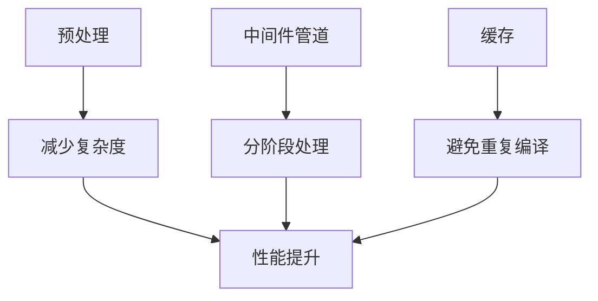

**Diagram sources**
- [sql.clj](file://src/metabase/driver/sql/query_processor.clj#L2000-L2092)

## 数据库方言兼容性

### 兼容性处理策略
Metabase 通过多方法和驱动程序特定的实现来处理不同数据库方言的兼容性问题。每个驱动程序可以重写默认行为以适应特定的 SQL 语法。

```mermaid
classDiagram
class quote-style {
+driver : Keyword
+return : Keyword
}
class format-honeysql {
+driver : Keyword
+honeysql-form : Map
+return : Vector
}
class add-interval-honeysql-form {
+driver : Keyword
+hsql-form : Any
+amount : Number
+unit : Keyword
+return : Vector
}
quote-style --> format-honeysql : "影响"
add-interval-honeysql-form --> format-honeysql : "使用"
```

**Diagram sources**
- [sql.clj](file://src/metabase/driver/sql/query_processor.clj#L1880-L1910)

### LIMIT/OFFSET 语法差异
不同数据库在 LIMIT/OFFSET 语法上存在差异，Metabase 通过 :page 子句的特定处理来解决这个问题。

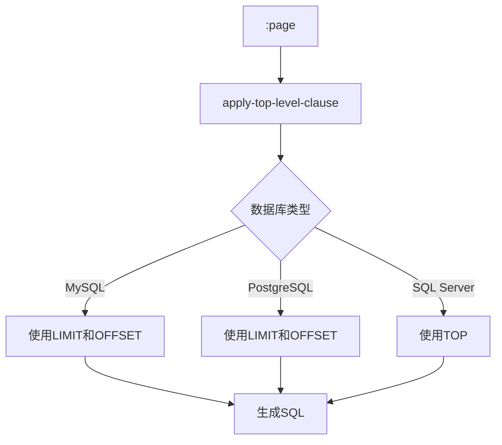

**Diagram sources**
- [sql.clj](file://src/metabase/driver/sql/query_processor.clj#L1908-L1938)

## 结论
Metabase 的查询构造系统通过 Honey SQL 库实现了强大的 MBQL 到 SQL 转换能力。系统采用模块化设计，通过多方法和中间件管道处理各种查询场景。CTE 和子查询的处理机制确保了嵌套查询的语义完整性，而数据库方言兼容性策略则保证了系统在不同数据库环境下的正常运行。尽管复杂的多层查询可能带来性能挑战，但系统的优化策略有效缓解了这些问题。整体而言，该查询构造系统为 Metabase 提供了灵活、可靠和高效的查询处理能力。