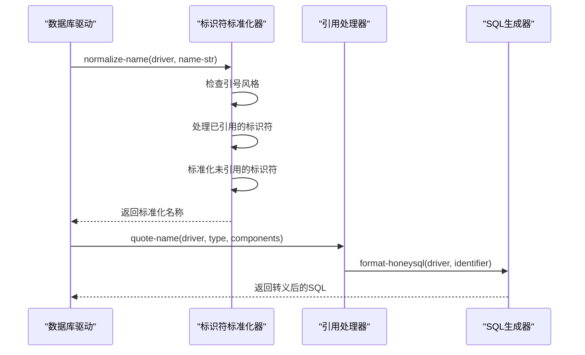
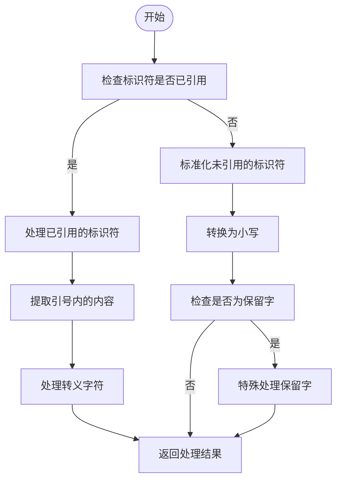
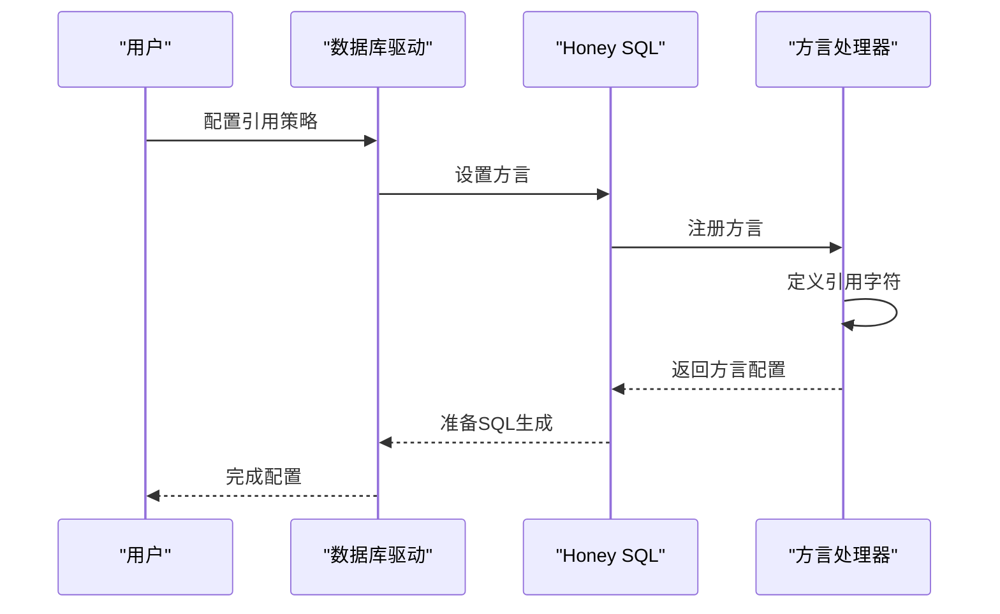
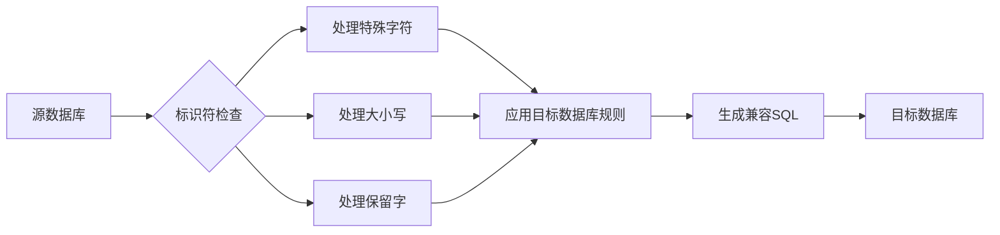

# 标识符转义

<cite>
**本文档中引用的文件**  
- [sql.clj](file://src/metabase/driver/sql.clj)
- [normalize.clj](file://src/metabase/driver/sql/normalize.clj)
- [quoting.clj](file://src/metabase/driver/sql_jdbc/quoting.clj)
- [honey_sql_2.clj](file://src/metabase/util/honey_sql_2.clj)
- [mysql.clj](file://src/metabase/driver/mysql.clj)
- [postgres.clj](file://src/metabase/driver/postgres.clj)
</cite>

## 目录
1. [引言](#引言)
2. [核心组件分析](#核心组件分析)
3. [标识符标准化处理](#标识符标准化处理)
4. [跨数据库标识符转义策略](#跨数据库标识符转义策略)
5. [复杂标识符处理](#复杂标识符处理)
6. [大小写敏感性处理](#大小写敏感性处理)
7. [Honey SQL集成配置](#honey-sql集成配置)
8. [迁移冲突解决方案](#迁移冲突解决方案)

## 引言
本文档深入分析Metabase系统中标识符转义的实现机制，重点研究SQL驱动中的quote-name-parts多态方法。文档将详细解释normalize命名空间如何为不同数据库（如MySQL、PostgreSQL、SQL Server）标准化标识符处理规则，涵盖复杂标识符的转义策略和大小写敏感性处理。

## 核心组件分析

**Section sources**
- [sql.clj](file://src/metabase/driver/sql.clj#L1-L326)
- [honey_sql_2.clj](file://src/metabase/util/honey_sql_2.clj#L1-L519)

## 标识符标准化处理

```mermaid
classDiagram
class normalize-unquoted-name {
+normalize-unquoted-name(driver, name-str)
+normalize-name(driver, name-str)
+reserved-literal(driver, name)
}
class quote-style {
+quote-style(driver)
+with-quoting(driver, body)
}
normalize-unquoted-name --> quote-style : "uses"
```

**Diagram sources**
- [normalize.clj](file://src/metabase/driver/sql/normalize.clj#L1-L52)
- [sql.clj](file://src/metabase/driver/sql.clj#L468-L495)

**Section sources**
- [normalize.clj](file://src/metabase/driver/sql/normalize.clj#L1-L52)

## 跨数据库标识符转义策略



**Diagram sources**
- [sql.clj](file://src/metabase/driver/sql.clj#L28-L54)
- [quoting.clj](file://src/metabase/driver/sql_jdbc/quoting.clj#L1-L27)

**Section sources**
- [sql.clj](file://src/metabase/driver/sql.clj#L28-L54)
- [quoting.clj](file://src/metabase/driver/sql_jdbc/quoting.clj#L1-L27)

## 复杂标识符处理



**Diagram sources**
- [normalize.clj](file://src/metabase/driver/sql/normalize.clj#L1-L52)
- [honey_sql_2.clj](file://src/metabase/util/honey_sql_2.clj#L97-L142)

**Section sources**
- [normalize.clj](file://src/metabase/driver/sql/normalize.clj#L1-L52)

## 大小写敏感性处理

```mermaid
classDiagram
class Identifier {
+identifier(identifier-type, components)
+identifier->components(identifier)
+identifier?
+IdentifierType
}
class format-identifier {
+format-identifier(tag, args)
}
class quote-style {
+quote-style(driver)
}
Identifier --> format-identifier : "uses"
format-identifier --> quote-style : "depends on"
```

**Diagram sources**
- [honey_sql_2.clj](file://src/metabase/util/honey_sql_2.clj#L97-L172)
- [sql.clj](file://src/metabase/driver/sql.clj#L502)

**Section sources**
- [honey_sql_2.clj](file://src/metabase/util/honey_sql_2.clj#L97-L172)

## Honey SQL集成配置



**Diagram sources**
- [mysql.clj](file://src/metabase/driver/mysql.clj#L703)
- [postgres.clj](file://src/metabase/driver/postgres.clj#L1-L200)

**Section sources**
- [mysql.clj](file://src/metabase/driver/mysql.clj#L703)
- [postgres.clj](file://src/metabase/driver/postgres.clj#L1-L200)

## 迁移冲突解决方案



**Diagram sources**
- [normalize.clj](file://src/metabase/driver/sql/normalize.clj#L1-L52)
- [sql.clj](file://src/metabase/driver/sql.clj#L1-L326)

**Section sources**
- [normalize.clj](file://src/metabase/driver/sql/normalize.clj#L1-L52)