# 元数据发现机制

<cite>
**本文档中引用的文件**
- [describe_table.clj](file://src/metabase/driver/sql_jdbc/sync/describe_table.clj)
- [describe_database.clj](file://src/metabase/driver/sql_jdbc/sync/describe_database.clj)
- [interface.clj](file://src/metabase/driver/sql_jdbc/sync/interface.clj)
- [execute.clj](file://src/metabase/driver/sql_jdbc/execute.clj)
- [common.clj](file://src/metabase/driver/sql_jdbc/sync/common.clj)
- [metadata.clj](file://src/metabase/driver/sql_jdbc/metadata.clj)
- [h2.clj](file://src/metabase/driver/h2.clj)
- [mysql.clj](file://src/metabase/driver/mysql.clj)
- [postgres.clj](file://src/metabase/driver/postgres.clj)
- [catch_exceptions.clj](file://src/metabase/query_processor/middleware/catch_exceptions.clj)
- [jvm.clj](file://src/metabase/util/jvm.clj)
- [util.clj](file://src/metabase/sync/util.clj)
</cite>

## 目录
1. [简介](#简介)
2. [系统架构概览](#系统架构概览)
3. [核心组件分析](#核心组件分析)
4. [JDBC元数据提取流程](#jdbc元数据提取流程)
5. [metadata命名空间映射机制](#metadata命名空间映射机制)
6. [数据库特定实现差异](#数据库特定实现差异)
7. [分页查询优化](#分页查询优化)
8. [性能调优技巧](#性能调优技巧)
9. [错误处理与重试机制](#错误处理与重试机制)
10. [故障排除指南](#故障排除指南)
11. [总结](#总结)

## 简介

Metabase的元数据发现机制是一个复杂而精密的系统，负责从各种关系型数据库中提取和映射表结构信息。该机制通过JDBC元数据接口实现跨数据库的统一抽象，支持多种数据库类型（H2、MySQL、PostgreSQL等），并提供了强大的错误处理和性能优化能力。

本文档深入解析了describe_database和describe_table函数的实现细节，展示了JDBC ResultSet到Metabase内部元数据模型的转换过程，以及针对不同数据库的特殊处理策略。

## 系统架构概览

元数据发现机制采用分层架构设计，主要包含以下层次：

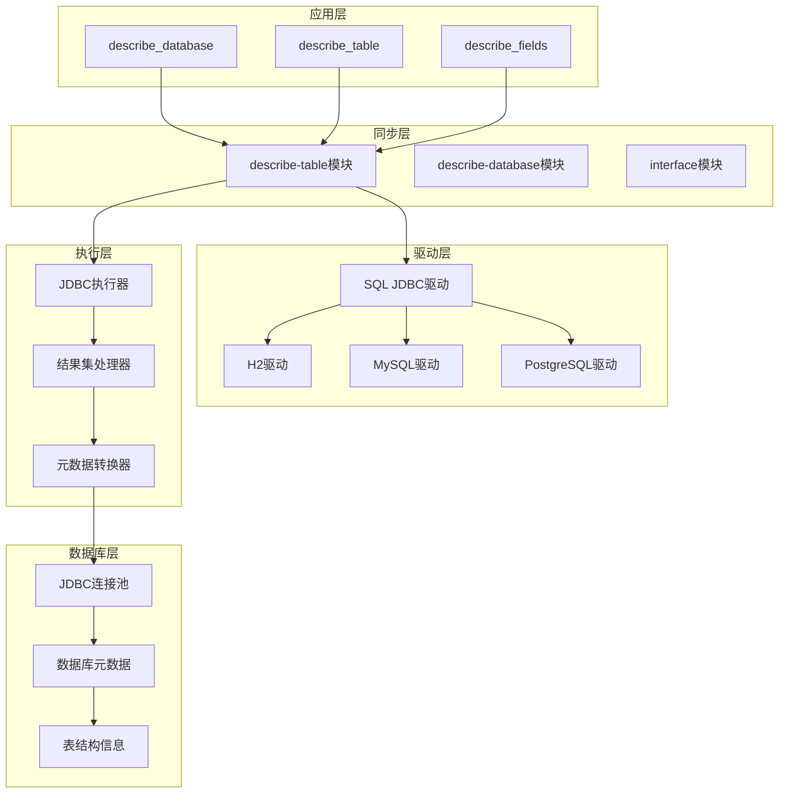

**图表来源**
- [describe_table.clj](file://src/metabase/driver/sql_jdbc/sync/describe_table.clj#L1-L50)
- [describe_database.clj](file://src/metabase/driver/sql_jdbc/sync/describe_database.clj#L1-L50)
- [interface.clj](file://src/metabase/driver/sql_jdbc/sync/interface.clj#L1-L50)

## 核心组件分析

### describe_table函数族

describe_table系列函数是元数据发现的核心入口点，提供了多层次的元数据提取能力：

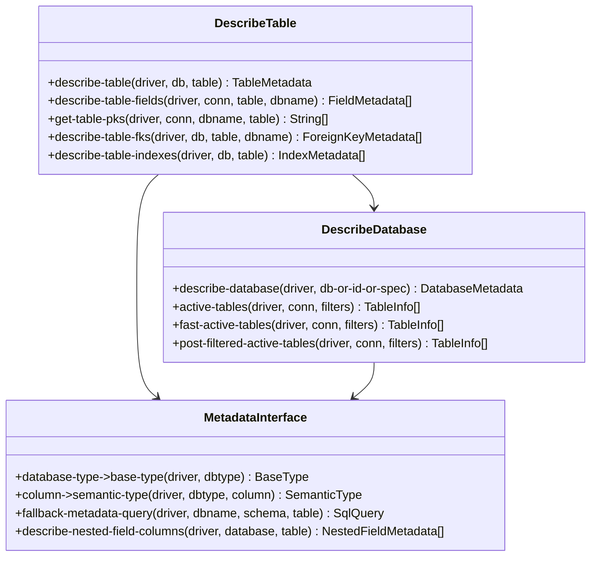

**图表来源**
- [describe_table.clj](file://src/metabase/driver/sql_jdbc/sync/describe_table.clj#L257-L300)
- [describe_database.clj](file://src/metabase/driver/sql_jdbc/sync/describe_database.clj#L250-L290)
- [interface.clj](file://src/metabase/driver/sql_jdbc/sync/interface.clj#L50-L100)

**章节来源**
- [describe_table.clj](file://src/metabase/driver/sql_jdbc/sync/describe_table.clj#L257-L300)
- [describe_database.clj](file://src/metabase/driver/sql_jdbc/sync/describe_database.clj#L250-L290)

### 元数据提取管道

元数据提取过程遵循严格的管道模式，确保数据的一致性和完整性：

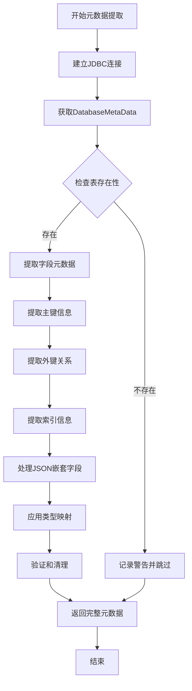

**图表来源**
- [describe_table.clj](file://src/metabase/driver/sql_jdbc/sync/describe_table.clj#L322-L356)
- [common.clj](file://src/metabase/driver/sql_jdbc/sync/common.clj#L1-L30)

## JDBC元数据提取流程

### 字段元数据提取

字段元数据提取是整个流程中最复杂的部分，涉及多个JDBC方法的组合使用：

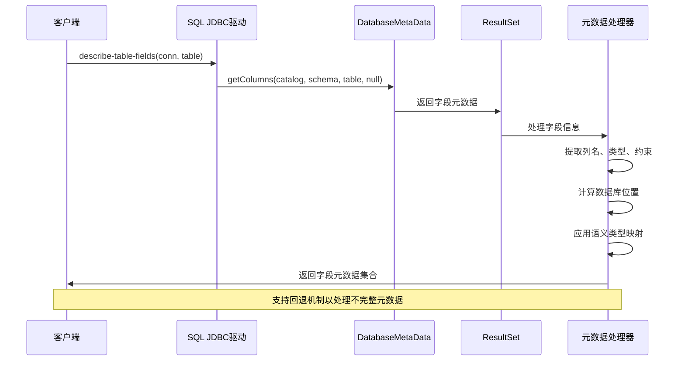

**图表来源**
- [describe_table.clj](file://src/metabase/driver/sql_jdbc/sync/describe_table.clj#L132-L170)
- [execute.clj](file://src/metabase/driver/sql_jdbc/execute.clj#L659-L694)

### 主键和外键发现

主键和外键信息的提取采用了多阶段的方法，确保在不同数据库环境下的兼容性：

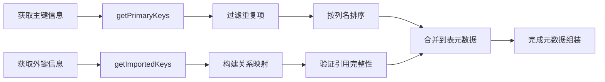

**图表来源**
- [describe_table.clj](file://src/metabase/driver/sql_jdbc/sync/describe_table.clj#L281-L322)
- [describe_table.clj](file://src/metabase/driver/sql_jdbc/sync/describe_table.clj#L400-L435)

**章节来源**
- [describe_table.clj](file://src/metabase/driver/sql_jdbc/sync/describe_table.clj#L132-L170)
- [describe_table.clj](file://src/metabase/driver/sql_jdbc/sync/describe_table.clj#L281-L322)

### 索引信息提取

索引信息的提取考虑了不同数据库的索引特性，提供了统一的抽象：

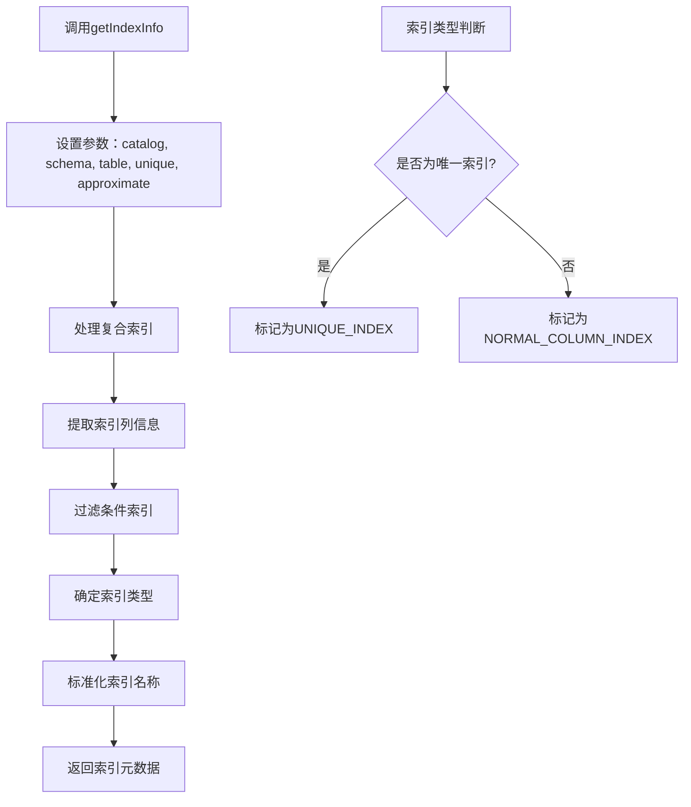

**图表来源**
- [describe_table.clj](file://src/metabase/driver/sql_jdbc/sync/describe_table.clj#L457-L490)

## metadata命名空间映射机制

### JDBC ResultSet到Metabase模型的映射

metadata命名空间负责将JDBC ResultSet中的原始数据转换为Metabase内部使用的标准化格式：

| JDBC元数据字段 | Metabase内部字段 | 类型转换规则 | 特殊处理 |
|---------------|-----------------|-------------|----------|
| COLUMN_NAME | :name | 字符串 | 去除转义字符 |
| TYPE_NAME | :database-type | 数据库类型 | 转换为关键字 |
| DATA_TYPE | :base-type | 基础类型 | 使用类型映射表 |
| IS_NULLABLE | :database-is-nullable | 布尔值 | 映射YES/NO字符串 |
| COLUMN_DEF | :database-default | 字符串 | 处理空值情况 |
| IS_AUTOINCREMENT | :database-is-auto-increment | 布尔值 | 验证AUTO_INCREMENT属性 |
| REMARKS | :field-comment | 字符串 | 过滤空白内容 |

**章节来源**
- [metadata.clj](file://src/metabase/driver/sql_jdbc/metadata.clj#L31-L40)
- [execute.clj](file://src/metabase/driver/sql_jdbc/execute.clj#L659-L694)

### 类型系统映射

不同类型数据库的列类型需要经过复杂的映射过程才能适配Metabase的类型系统：

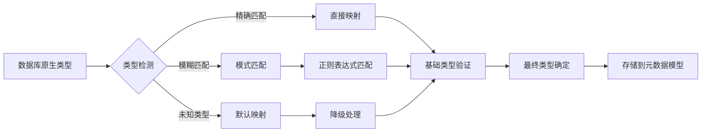

**图表来源**
- [describe_table.clj](file://src/metabase/driver/sql_jdbc/sync/describe_table.clj#L60-L85)

## 数据库特定实现差异

### H2数据库特殊处理

H2数据库由于其独特的特性和限制，需要特殊的处理逻辑：

| 特性 | H2处理方式 | 影响范围 |
|------|-----------|----------|
| 索引信息 | 不支持索引同步 | 禁用索引相关功能 |
| 表权限 | 基本权限检查 | 简化权限验证 |
| 时间类型 | JVM时区依赖 | 自动检测系统时区 |
| JSON处理 | 内置JSON支持 | 启用JSON字段展开 |

**章节来源**
- [h2.clj](file://src/metabase/driver/h2.clj#L59-L83)
- [h2.clj](file://src/metabase/driver/h2.clj#L320-L354)

### MySQL数据库优化

MySQL数据库针对其特有的功能进行了专门优化：

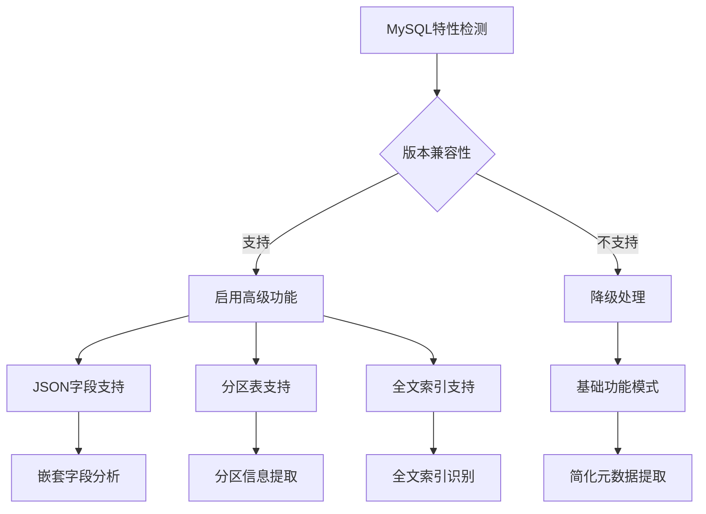

**图表来源**
- [mysql.clj](file://src/metabase/driver/mysql.clj#L50-L100)

### PostgreSQL数据库增强

PostgreSQL作为最完整的SQL数据库，提供了丰富的元数据信息：

| 功能特性 | 实现方式 | 性能影响 |
|---------|---------|----------|
| 枚举类型 | pg_enum系统表查询 | 中等查询开销 |
| 外部表 | FOREIGN TABLE检测 | 额外权限检查 |
| 分区表 | PARTITIONED TABLE标识 | 复杂表结构分析 |
| 扩展类型 | 用户定义类型解析 | 类型映射缓存 |

**章节来源**
- [postgres.clj](file://src/metabase/driver/postgres.clj#L150-L200)

## 分页查询优化

### 大型数据库的挑战

对于包含大量表的大数据库，传统的全量扫描方法会导致严重的性能问题。Metabase采用了多种优化策略：

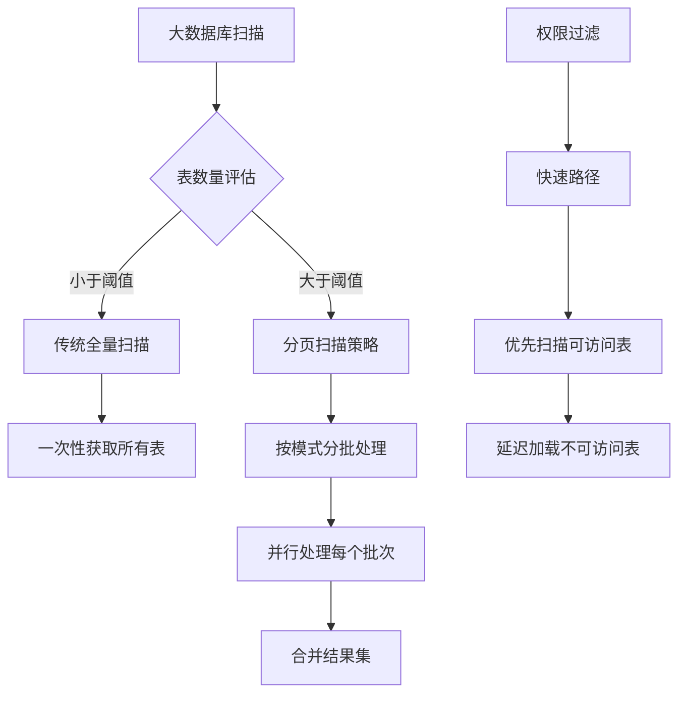

**图表来源**
- [describe_database.clj](file://src/metabase/driver/sql_jdbc/sync/describe_database.clj#L200-L250)

### 权限感知的扫描策略

为了提高效率，系统实现了基于权限的智能扫描：

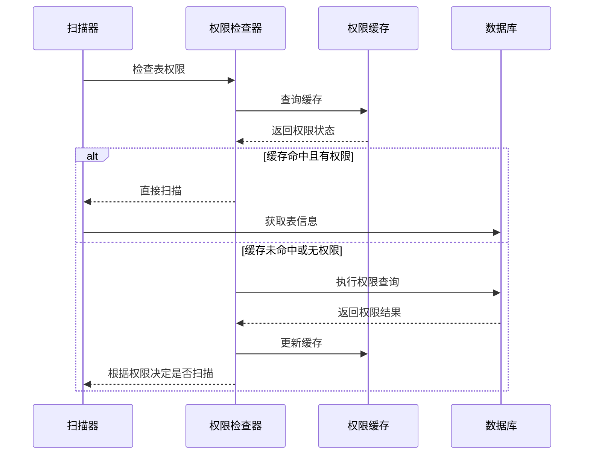

**图表来源**
- [describe_database.clj](file://src/metabase/driver/sql_jdbc/sync/describe_database.clj#L100-L150)

**章节来源**
- [describe_database.clj](file://src/metabase/driver/sql_jdbc/sync/describe_database.clj#L200-L250)

## 性能调优技巧

### 连接池优化

合理的连接池配置对元数据发现性能至关重要：

| 参数 | 推荐值 | 说明 |
|------|-------|------|
| initial-size | 2-4 | 初始连接数 |
| max-active | 10-20 | 最大并发连接 |
| max-wait | 30秒 | 连接等待超时 |
| test-on-borrow | true | 连接有效性检查 |
| validation-query | SELECT 1 | 简单验证查询 |

### 查询优化策略

针对不同的数据库场景，系统采用了多种查询优化技术：

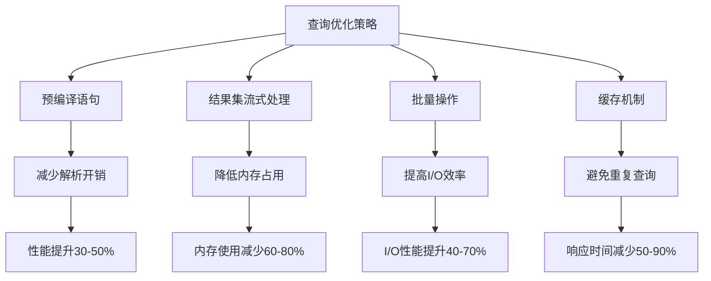

### 内存管理优化

对于大型数据库，内存管理是关键因素：

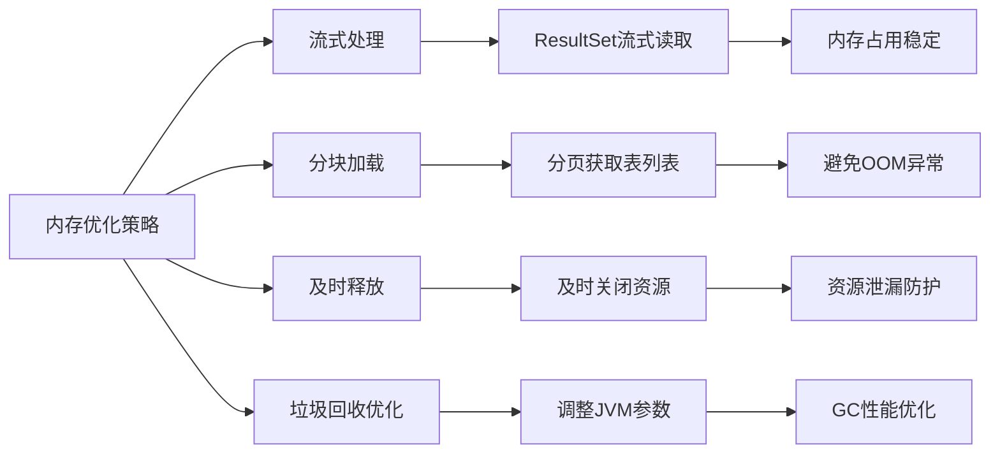

## 错误处理与重试机制

### 异常分类与处理

元数据发现过程中可能遇到的各种异常及其处理策略：

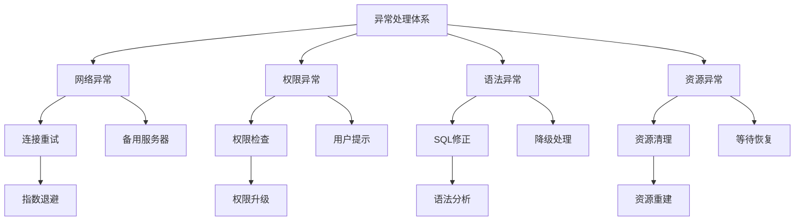

**图表来源**
- [catch_exceptions.clj](file://src/metabase/query_processor/middleware/catch_exceptions.clj#L34-L66)

### 自动重试机制

系统实现了智能的自动重试机制，能够根据异常类型和上下文决定是否重试：

| 异常类型 | 重试策略 | 最大重试次数 | 退避算法 |
|---------|---------|-------------|----------|
| 网络超时 | 指数退避 | 3次 | 2^attempt秒 |
| 权限拒绝 | 不重试 | 0次 | 立即失败 |
| 数据库锁定 | 线性退避 | 5次 | 5*attempt秒 |
| 资源不足 | 等待恢复 | 10次 | 10秒固定间隔 |

**章节来源**
- [catch_exceptions.clj](file://src/metabase/query_processor/middleware/catch_exceptions.clj#L34-L66)
- [jvm.clj](file://src/metabase/util/jvm.clj#L144-L184)

### 回退机制

当主要的元数据提取方法失败时，系统会自动切换到备用方案：

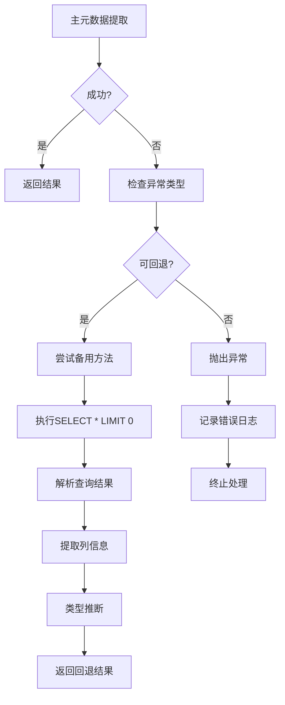

**图表来源**
- [describe_table.clj](file://src/metabase/driver/sql_jdbc/sync/describe_table.clj#L109-L132)

## 故障排除指南

### 常见问题诊断

| 问题症状 | 可能原因 | 诊断方法 | 解决方案 |
|---------|---------|---------|----------|
| 元数据提取缓慢 | 大量表或权限检查 | 查看日志时间戳 | 启用分页扫描 |
| 权限相关错误 | 用户权限不足 | 检查数据库权限 | 升级用户权限 |
| 类型映射错误 | 数据库类型不支持 | 查看类型映射日志 | 添加自定义映射 |
| 连接超时 | 网络或数据库问题 | 测试连接可用性 | 调整连接参数 |

### 性能监控指标

关键性能指标的监控和告警：

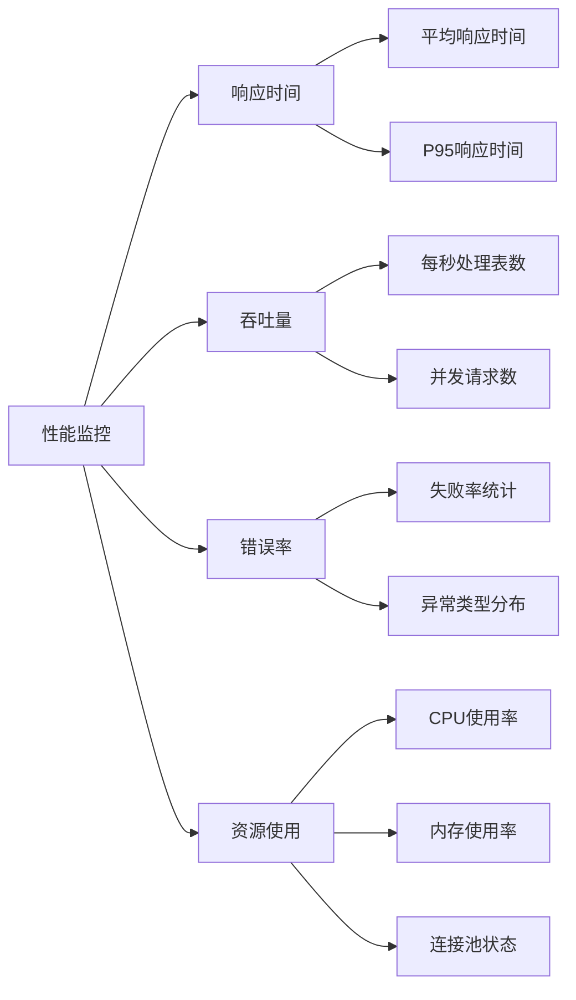

### 调试工具和技巧

有效的调试方法和工具使用：

1. **日志级别调整**：将日志级别设置为DEBUG以获取详细的执行信息
2. **连接测试**：使用简单的SELECT查询测试数据库连接
3. **权限验证**：手动执行相同的元数据查询验证权限
4. **性能分析**：使用数据库的执行计划分析查询性能

**章节来源**
- [util.clj](file://src/metabase/sync/util.clj#L176-L209)

## 总结

Metabase的元数据发现机制是一个高度工程化的系统，它成功地解决了跨数据库的元数据提取挑战。通过精心设计的分层架构、智能的错误处理机制和多样化的性能优化策略，该系统能够在各种复杂的生产环境中稳定运行。

### 关键优势

1. **跨数据库兼容性**：统一的抽象层屏蔽了不同数据库的差异
2. **高性能设计**：分页扫描、权限感知和智能缓存显著提升了处理效率
3. **健壮性保证**：完善的错误处理和回退机制确保了系统的稳定性
4. **可扩展性**：模块化的设计使得新数据库类型的接入变得简单

### 最佳实践建议

1. **合理配置连接池**：根据数据库规模和并发需求调整连接参数
2. **监控关键指标**：定期检查响应时间和错误率等关键指标
3. **定期维护**：清理不必要的表和索引以保持最佳性能
4. **权限优化**：最小化元数据发现所需的数据库权限

这个系统不仅展示了现代数据仓库软件的技术深度，也为其他类似项目提供了宝贵的参考价值。