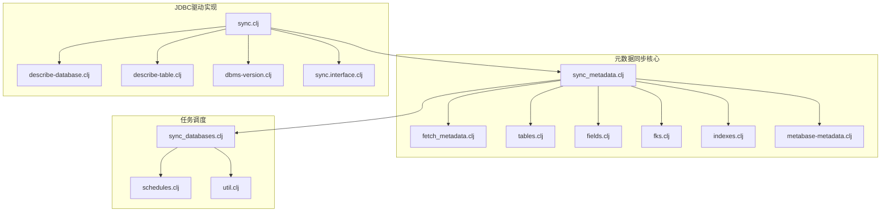
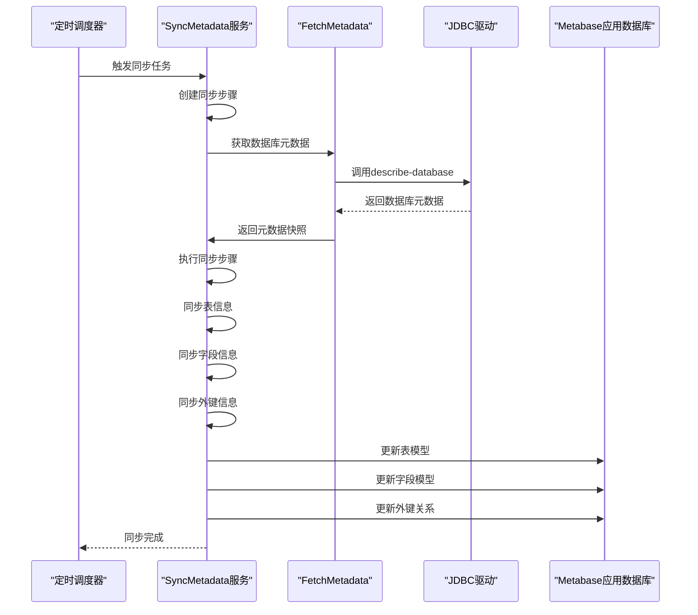
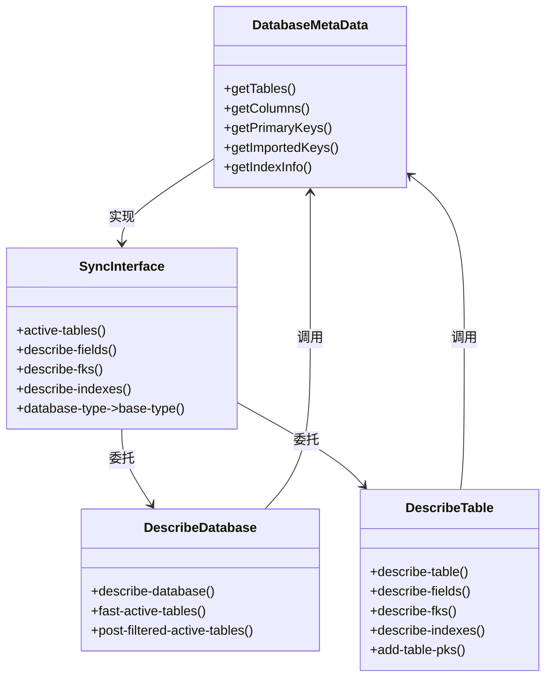
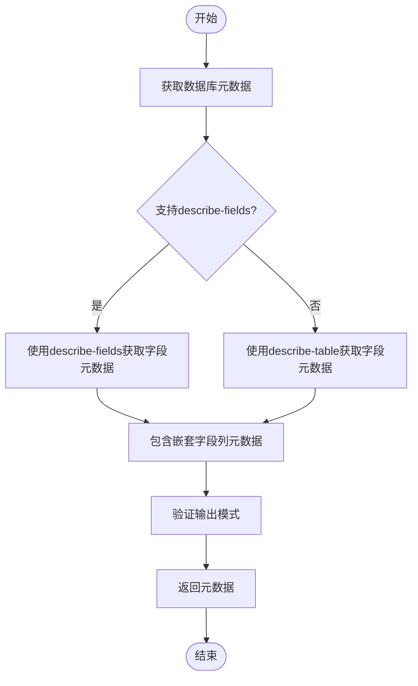
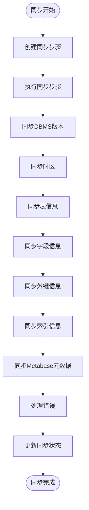
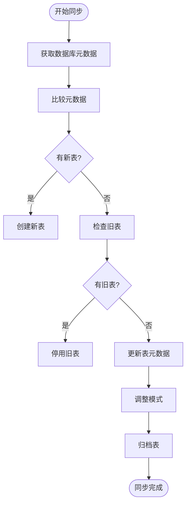
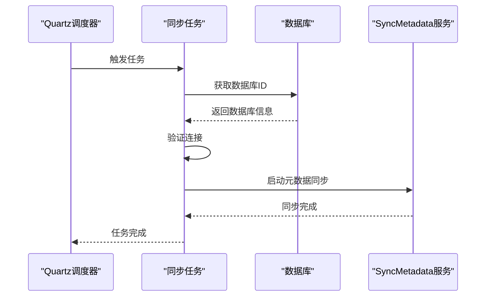
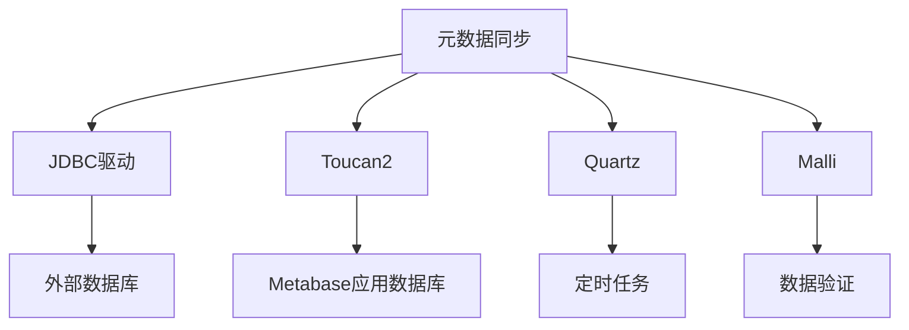

# 元数据同步机制

<cite>
**本文档中引用的文件**  
- [sync.clj](file://src/metabase/driver/sql_jdbc/sync.clj)
- [sync_metadata.clj](file://src/metabase/sync/sync_metadata.clj)
- [fetch_metadata.clj](file://src/metabase/sync/fetch_metadata.clj)
- [tables.clj](file://src/metabase/sync/sync_metadata/tables.clj)
- [fields.clj](file://src/metabase/sync/sync_metadata/fields.clj)
- [fks.clj](file://src/metabase/sync/sync_metadata/fks.clj)
- [util.clj](file://src/metabase/sync/util.clj)
- [schedules.clj](file://src/metabase/sync/schedules.clj)
- [sync_databases.clj](file://src/metabase/sync/task/sync_databases.clj)
- [core.clj](file://src/metabase/sync/core.clj)
- [interface.clj](file://src/metabase/sync/interface.clj)
</cite>

## 目录
1. [简介](#简介)
2. [项目结构](#项目结构)
3. [核心组件](#核心组件)
4. [架构概述](#架构概述)
5. [详细组件分析](#详细组件分析)
6. [依赖分析](#依赖分析)
7. [性能考虑](#性能考虑)
8. [故障排除指南](#故障排除指南)
9. [结论](#结论)

## 简介
本文档深入解析Metabase中的元数据同步机制，重点分析数据库元数据发现流程，包括表、字段、主键和外键的提取策略。文档详细说明了metadata命名空间如何将JDBC元数据映射到Metabase内部模型，涵盖增量同步算法、缓存策略和性能优化技巧。同时提供处理大型数据库（百万级表）的特殊考虑和配置建议，并结合sync_metadata核心服务分析定时同步任务的调度与执行。

## 项目结构
Metabase的元数据同步机制主要分布在`src/metabase/sync`和`src/metabase/driver/sql_jdbc`目录下。核心同步逻辑位于`sync_metadata.clj`文件中，负责协调整个元数据同步过程。`fetch_metadata.clj`文件负责从外部数据库获取元数据快照，而`tables.clj`、`fields.clj`和`fks.clj`分别处理表、字段和外键的同步。驱动相关的JDBC元数据同步实现在`sql_jdbc`命名空间中。

**Diagram sources**
- [sync_metadata.clj](file://src/metabase/sync/sync_metadata.clj#L1-L79)
- [fetch_metadata.clj](file://src/metabase/sync/fetch_metadata.clj#L1-L127)
- [tables.clj](file://src/metabase/sync/sync_metadata/tables.clj#L1-L409)
- [fields.clj](file://src/metabase/sync/sync_metadata/fields.clj#L1-L148)
- [fks.clj](file://src/metabase/sync/sync_metadata/fks.clj#L1-L150)
- [sync.clj](file://src/metabase/driver/sql_jdbc/sync.clj#L1-L55)
- [sync_databases.clj](file://src/metabase/sync/task/sync_databases.clj#L1-L368)
- [schedules.clj](file://src/metabase/sync/schedules.clj#L1-L75)

**Section sources**
- [sync_metadata.clj](file://src/metabase/sync/sync_metadata.clj#L1-L79)
- [fetch_metadata.clj](file://src/metabase/sync/fetch_metadata.clj#L1-L127)
- [tables.clj](file://src/metabase/sync/sync_metadata/tables.clj#L1-L409)
- [fields.clj](file://src/metabase/sync/sync_metadata/fields.clj#L1-L148)
- [fks.clj](file://src/metabase/sync/sync_metadata/fks.clj#L1-L150)
- [sync.clj](file://src/metabase/driver/sql_jdbc/sync.clj#L1-L55)
- [sync_databases.clj](file://src/metabase/sync/task/sync_databases.clj#L1-L368)
- [schedules.clj](file://src/metabase/sync/schedules.clj#L1-L75)

## 核心组件
元数据同步机制的核心组件包括`sync_metadata.clj`中的同步协调器、`fetch_metadata.clj`中的元数据获取器以及`tables.clj`、`fields.clj`和`fks.clj`中的具体同步实现。这些组件共同协作，确保Metabase应用数据库中的表、字段和外键信息与外部数据库保持同步。

**Section sources**
- [sync_metadata.clj](file://src/metabase/sync/sync_metadata.clj#L1-L79)
- [fetch_metadata.clj](file://src/metabase/sync/fetch_metadata.clj#L1-L127)
- [tables.clj](file://src/metabase/sync/sync_metadata/tables.clj#L1-L409)
- [fields.clj](file://src/metabase/sync/sync_metadata/fields.clj#L1-L148)
- [fks.clj](file://src/metabase/sync/sync_metadata/fks.clj#L1-L150)

## 架构概述
Metabase的元数据同步架构采用分层设计，从JDBC驱动层获取元数据，通过同步协调器组织同步步骤，最终更新Metabase应用数据库中的模型。整个过程由定时任务驱动，支持增量同步和错误处理。

**Diagram sources**
- [sync_metadata.clj](file://src/metabase/sync/sync_metadata.clj#L1-L79)
- [fetch_metadata.clj](file://src/metabase/sync/fetch_metadata.clj#L1-L127)
- [sync_databases.clj](file://src/metabase/sync/task/sync_databases.clj#L1-L368)

## 详细组件分析

### 数据库元数据发现流程分析
sync.clj文件实现了基于JDBC DatabaseMetaData的同步相关驱动多方法。该文件通过导入sql-jdbc.sync.interface、sql-jdbc.describe-database、sql-jdbc.describe-table等命名空间，提供了active-tables、describe-fields、describe-fks等关键函数，用于发现数据库中的表、字段和外键信息。

**Diagram sources**
- [sync.clj](file://src/metabase/driver/sql_jdbc/sync.clj#L1-L55)
- [sync.interface.clj](file://src/metabase/driver/sql_jdbc/sync/interface.clj#L1-L50)

**Section sources**
- [sync.clj](file://src/metabase/driver/sql_jdbc/sync.clj#L1-L55)

### metadata命名空间映射机制分析
metadata命名空间负责将JDBC元数据映射到Metabase内部模型。fetch_metadata.clj文件提供了db-metadata、table-fields-metadata、fields-metadata等函数，这些函数从外部数据库获取元数据快照，并验证输出模式。

**Diagram sources**
- [fetch_metadata.clj](file://src/metabase/sync/fetch_metadata.clj#L1-L127)

**Section sources**
- [fetch_metadata.clj](file://src/metabase/sync/fetch_metadata.clj#L1-L127)

### 增量同步算法与缓存策略
sync_metadata.clj文件实现了增量同步算法，通过比较外部数据库元数据和Metabase应用数据库中的现有元数据，只更新发生变化的部分。该文件还实现了缓存策略，通过sync-util/create-sync-step创建同步步骤，并使用sync-util/run-sync-operation执行同步操作。

**Diagram sources**
- [sync_metadata.clj](file://src/metabase/sync/sync_metadata.clj#L1-L79)
- [util.clj](file://src/metabase/sync/util.clj#L1-L651)

**Section sources**
- [sync_metadata.clj](file://src/metabase/sync/sync_metadata.clj#L1-L79)
- [util.clj](file://src/metabase/sync/util.clj#L1-L651)

### 大型数据库处理策略
对于大型数据库（百万级表），系统采用了一系列优化策略。tables.clj文件中的sync-tables-and-database!函数实现了表的增量同步，通过比较新旧表元数据集来确定需要创建、更新或停用的表。系统还实现了表归档机制，将长时间未激活的表标记为归档状态。

**Diagram sources**
- [tables.clj](file://src/metabase/sync/sync_metadata/tables.clj#L1-L409)

**Section sources**
- [tables.clj](file://src/metabase/sync/sync_metadata/tables.clj#L1-L409)

### 定时同步任务调度分析
sync_databases.clj文件实现了定时同步任务的调度与执行。系统使用Quartz调度器来管理同步任务，支持SyncAndAnalyzeDatabase和UpdateFieldValues两种任务类型。schedules.clj文件定义了默认的同步计划，包括每小时一次的元数据同步和每天一次的字段值缓存。

**Diagram sources**
- [sync_databases.clj](file://src/metabase/sync/task/sync_databases.clj#L1-L368)
- [schedules.clj](file://src/metabase/sync/schedules.clj#L1-L75)

**Section sources**
- [sync_databases.clj](file://src/metabase/sync/task/sync_databases.clj#L1-L368)
- [schedules.clj](file://src/metabase/sync/schedules.clj#L1-L75)

## 依赖分析
元数据同步机制依赖于多个核心组件和外部库。系统依赖JDBC驱动来访问外部数据库，依赖Toucan2进行应用数据库操作，依赖Quartz进行任务调度。各组件之间的依赖关系清晰，通过接口隔离实现了良好的模块化设计。

**Diagram sources**
- [sync.clj](file://src/metabase/driver/sql_jdbc/sync.clj#L1-L55)
- [sync_metadata.clj](file://src/metabase/sync/sync_metadata.clj#L1-L79)
- [sync_databases.clj](file://src/metabase/sync/task/sync_databases.clj#L1-L368)

**Section sources**
- [sync.clj](file://src/metabase/driver/sql_jdbc/sync.clj#L1-L55)
- [sync_metadata.clj](file://src/metabase/sync/sync_metadata.clj#L1-L79)
- [sync_databases.clj](file://src/metabase/sync/task/sync_databases.clj#L1-L368)

## 性能考虑
系统在设计时充分考虑了性能优化。通过增量同步减少不必要的数据库操作，通过批量更新提高数据库操作效率，通过错误处理机制确保同步过程的稳定性。对于大型数据库，系统采用分批处理和并行执行策略，避免单次操作耗时过长。

## 故障排除指南
当元数据同步出现问题时，可以检查以下方面：数据库连接是否正常，JDBC驱动是否支持所需功能，同步任务是否被正确调度，应用数据库是否有足够的权限执行更新操作。系统提供了详细的日志记录，可以帮助定位问题根源。

**Section sources**
- [util.clj](file://src/metabase/sync/util.clj#L1-L651)
- [sync_databases.clj](file://src/metabase/sync/task/sync_databases.clj#L1-L368)

## 结论
Metabase的元数据同步机制设计精巧，功能完整。通过分层架构和模块化设计，系统实现了高效、可靠的元数据同步。增量同步算法和缓存策略确保了系统在处理大型数据库时的性能表现。定时任务调度机制保证了元数据的及时更新。整体设计体现了良好的软件工程实践，为系统的稳定运行提供了坚实基础。