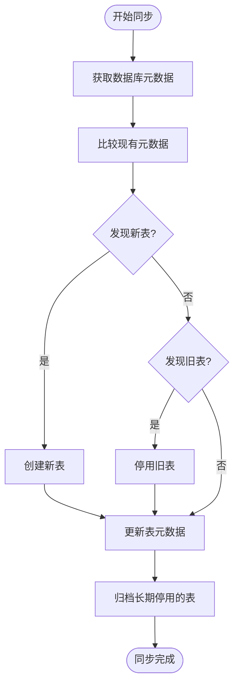
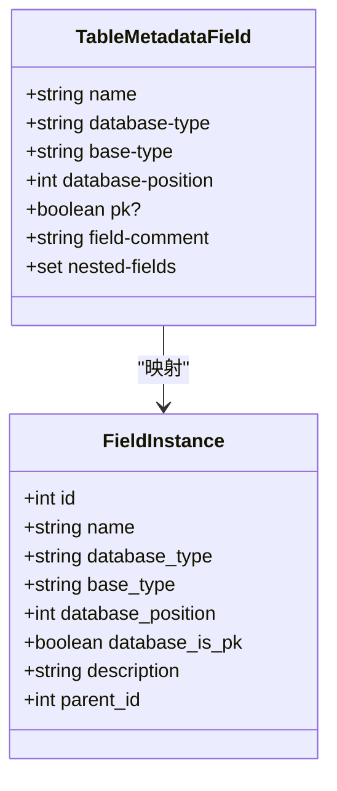
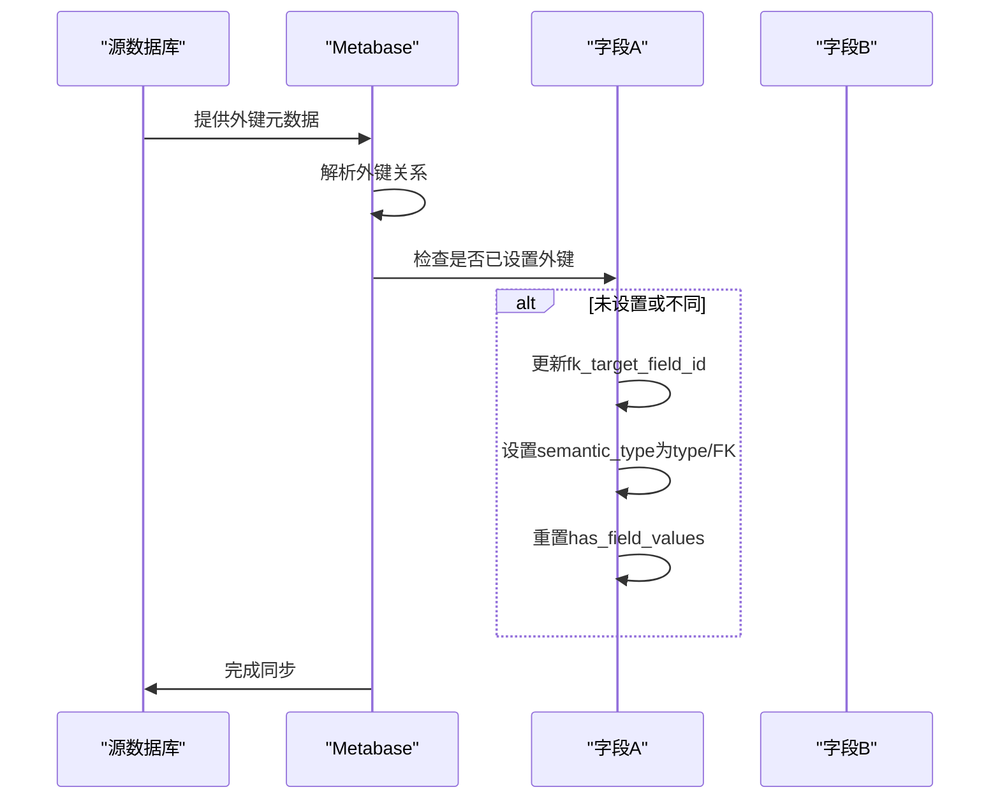
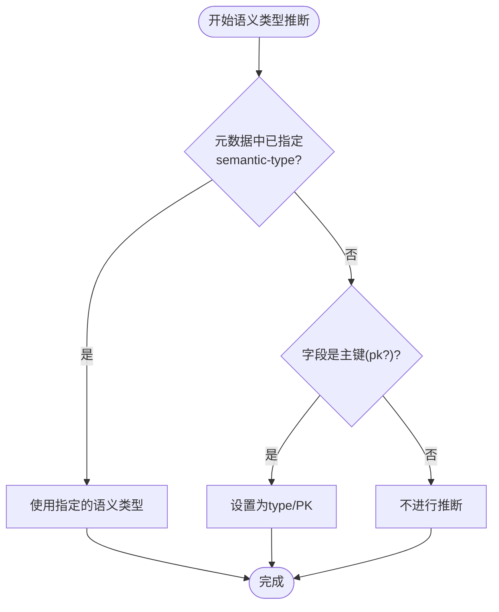

# 元数据映射与转换

<cite>
**本文档引用的文件**  
- [common.clj](file://src/metabase/sync/sync_metadata/fields/common.clj)
- [tables.clj](file://src/metabase/sync/sync_metadata/tables.clj)
- [fields.clj](file://src/metabase/sync/sync_metadata/fields.clj)
- [fks.clj](file://src/metabase/sync/sync_metadata/fks.clj)
- [fetch_metadata.clj](file://src/metabase/sync/fetch_metadata.clj)
- [our_metadata.clj](file://src/metabase/sync/sync_metadata/fields/our_metadata.clj)
- [sync_metadata.clj](file://src/metabase/sync/sync_metadata/fields/sync_metadata.clj)
- [interface.clj](file://src/metabase/sync/interface.clj)
</cite>

## 目录
1. [引言](#引言)
2. [元数据标准化流程](#元数据标准化流程)
3. [表映射规则](#表映射规则)
4. [字段映射规则](#字段映射规则)
5. [外键映射规则](#外键映射规则)
6. [字段语义类型推断](#字段语义类型推断)
7. [元数据缓存策略](#元数据缓存策略)
8. [数据库特定元数据处理](#数据库特定元数据处理)
9. [转换示例](#转换示例)

## 引言
本文档详细阐述了Metabase系统中元数据映射与转换的完整流程。文档重点分析了如何将原始JDBC元数据转换为Metabase内部模型，涵盖了表、字段和外键的映射规则，包括名称规范化、类型映射和属性转换等核心机制。通过深入解析`common.clj`、`tables.clj`、`fields.clj`和`fks.clj`等关键文件，本文档揭示了元数据标准化的内部工作原理，为理解Metabase的数据同步机制提供了全面的技术参考。

## 元数据标准化流程
Metabase的元数据标准化流程是一个系统化的转换过程，旨在将不同数据库的原始JDBC元数据统一为Metabase内部一致的模型。该流程始于`fetch_metadata.clj`文件，其中定义了从数据库获取元数据的核心函数。`db-metadata`函数通过调用驱动程序的`describe-database`方法获取数据库的基本信息和表结构，而`table-fields-metadata`函数则负责获取特定表的字段元数据。

整个标准化流程遵循一个清晰的模式：首先从外部数据库获取原始元数据（`db-metadata`），然后与Metabase应用数据库中已有的元数据（`our-metadata`）进行比较。通过这种对比，系统能够识别出需要创建、更新或停用的元数据对象。`sync-tables-and-database!`函数是这一流程的核心，它协调了表和数据库元数据的同步，确保Metabase中的元数据视图与源数据库保持一致。

**Section sources**
- [fetch_metadata.clj](file://src/metabase/sync/fetch_metadata.clj#L0-L126)
- [tables.clj](file://src/metabase/sync/sync_metadata/tables.clj#L0-L408)

## 表映射规则
表映射规则定义了如何将数据库中的表结构转换为Metabase内部的表模型。`tables.clj`文件中的`create-or-reactivate-table!`函数负责处理表的创建和重新激活。当发现新表时，系统会调用`create-table!`函数创建新的表实例，该函数会设置表的活跃状态、数据库ID、模式、描述等属性。

表的可见性管理是映射规则的重要组成部分。`cruft-dependent-cols`函数根据表名自动判断表的可见性类型。系统内置了一组正则表达式模式（`crufty-table-patterns`），用于识别来自Rails、Django等框架的"杂项"表（如`schema_migrations`、`django_session`等）。匹配这些模式的表将被自动标记为`cruft`类型，即默认对用户隐藏。

**Diagram sources**
- [tables.clj](file://src/metabase/sync/sync_metadata/tables.clj#L0-L408)

**Section sources**
- [tables.clj](file://src/metabase/sync/sync_metadata/tables.clj#L0-L408)

## 字段映射规则
字段映射规则是元数据转换中最复杂的部分，涉及字段的创建、更新和属性同步。`fields.clj`文件将字段同步过程分解为三个主要步骤：获取现有元数据、同步字段实例和更新实例元数据。

`our_metadata.clj`文件中的`our-metadata`函数负责从Metabase应用数据库中重构字段元数据，使其格式与从数据库获取的元数据相匹配。这为后续的比较和同步操作提供了基础。`sync-instances`和`sync-metadata`命名空间分别处理字段实例的创建/停用和元数据属性的更新。

字段的名称规范化通过`canonical-name`函数实现，该函数将字段名转换为小写形式，以忽略大小写差异。`update-field-metadata-if-needed!`函数负责检测并更新字段的各种属性，包括数据库类型、基础类型、注释、主键状态等。只有当旧值为空时，系统才会同步注释，以避免覆盖用户自定义的描述。

**Diagram sources**
- [fields.clj](file://src/metabase/sync/sync_metadata/fields.clj#L0-L147)
- [our_metadata.clj](file://src/metabase/sync/sync_metadata/fields/our_metadata.clj#L0-L89)
- [sync_metadata.clj](file://src/metabase/sync/sync_metadata/fields/sync_metadata.clj#L0-L233)

**Section sources**
- [fields.clj](file://src/metabase/sync/sync_metadata/fields.clj#L0-L147)
- [our_metadata.clj](file://src/metabase/sync/sync_metadata/fields/our_metadata.clj#L0-L89)
- [sync_metadata.clj](file://src/metabase/sync/sync_metadata/fields/sync_metadata.clj#L0-L233)

## 外键映射规则
外键映射规则定义了如何将数据库中的外键约束转换为Metabase内部的字段关系。`fks.clj`文件中的`sync-fks!`函数负责协调整个外键同步过程。系统首先通过`fetch-metadata/fk-metadata`获取外键元数据，然后对每个外键条目调用`mark-fk!`函数进行处理。

`mark-fk!`函数使用`mark-fk-sql`生成的SQL语句来更新字段的外键目标。该SQL语句根据不同数据库类型（MySQL、PostgreSQL、H2）生成相应的更新语句。在更新外键目标字段ID的同时，系统还会重置`has_field_values`属性（如果其值为`auto-list`），并将`semantic_type`设置为`type/FK`。

外键同步的一个重要特性是它不会覆盖用户手动设置的外键关系。SQL语句中的`valid-condition`确保只有当`fk_target_field_id`为空或与新目标不同时，才会进行更新，从而保护了用户的自定义配置。

**Diagram sources**
- [fks.clj](file://src/metabase/sync/sync_metadata/fks.clj#L0-L149)

**Section sources**
- [fks.clj](file://src/metabase/sync/sync_metadata/fks.clj#L0-L149)

## 字段语义类型推断
字段语义类型推断是Metabase智能分析的核心功能之一，它能够自动为字段分配有意义的语义类型。`common.clj`文件中的`semantic-type`函数实现了这一逻辑。该函数首先检查字段元数据中是否已明确指定了`semantic-type`，如果有则直接使用。

如果未指定语义类型，系统会根据字段的其他属性进行推断。目前最主要的推断规则是主键检测：如果字段的`pk?`属性为真，则将其语义类型设置为`type/PK`。这一规则确保了主键字段能够被正确识别和处理。

**Diagram sources**
- [common.clj](file://src/metabase/sync/sync_metadata/fields/common.clj#L0-L94)

**Section sources**
- [common.clj](file://src/metabase/sync/sync_metadata/fields/common.clj#L0-L94)

## 元数据缓存策略
Metabase采用了一种基于应用数据库的元数据缓存策略，将从外部数据库获取的元数据持久化存储在自身的应用数据库中。这种策略通过`toucan2` ORM框架实现，将表、字段等元数据对象映射为应用数据库中的模型实例。

缓存的更新是增量式的。系统通过比较`db-metadata`（来自源数据库）和`our-metadata`（来自应用数据库）的差异，仅对发生变化的元数据进行更新。这种差异同步机制（diff-based synchronization）极大地提高了同步效率，避免了全量刷新的开销。

对于长期停用的表，系统还实现了归档机制。`archive-tables!`函数会定期检查已停用超过14天的表，并将其标记为归档状态，同时在表名后添加`__mbarchiv__`前缀。这有助于清理元数据缓存，保持应用数据库的整洁。

**Section sources**
- [tables.clj](file://src/metabase/sync/sync_metadata/tables.clj#L0-L408)
- [fields.clj](file://src/metabase/sync/sync_metadata/fields.clj#L0-L147)

## 数据库特定元数据处理
Metabase通过驱动程序架构支持多种数据库，每种数据库可能具有独特的元数据特性。系统通过`driver.u/supports?`函数检测数据库驱动程序的功能支持情况，从而启用或禁用特定的元数据处理逻辑。

例如，对于支持模式（schemas）的数据库，系统会启用多级模式支持，正确处理模式限定的表名。对于支持嵌套字段的数据库（如JSON字段），系统会调用`describe-nested-field-columns`方法获取嵌套字段的元数据，并通过`include-nested-fields-for-table`函数将其合并到主字段元数据中。

此外，系统还处理了不同数据库在SQL语法上的差异。`mark-fk-sql`函数根据数据库类型（MySQL、PostgreSQL、H2）生成相应的SQL更新语句，确保外键同步操作能够在不同数据库上正确执行。

**Section sources**
- [fetch_metadata.clj](file://src/metabase/sync/fetch_metadata.clj#L0-L126)
- [fks.clj](file://src/metabase/sync/sync_metadata/fks.clj#L0-L149)

## 转换示例
以下是一个具体的元数据转换示例，展示了从PostgreSQL数据库同步一个用户表的完整过程：

1. **获取原始元数据**：系统通过JDBC `DatabaseMetaData`获取`users`表的元数据，包括字段`id`（整数，主键）、`name`（文本）、`email`（文本）和`created_at`（时间戳）。

2. **标准化处理**：`canonical-name`函数将所有字段名转换为小写，`semantic-type`函数将`id`字段的语义类型推断为`type/PK`。

3. **表映射**：系统检查`our-metadata`，发现`users`表不存在，于是调用`create-table!`创建新表，并设置其可见性为正常。

4. **字段映射**：系统为每个字段创建`Field`实例，设置其基础类型、数据库类型和位置等属性。`name`和`email`字段的描述信息从数据库注释中同步。

5. **外键映射**：系统检测到`orders`表的`user_id`字段引用了`users.id`，于是调用`mark-fk!`将`orders.user_id`的`fk_target_field_id`设置为`users.id`的字段ID，并将其语义类型设置为`type/FK`。

6. **缓存更新**：所有变更被持久化到Metabase的应用数据库中，完成整个同步过程。

**Section sources**
- [tables.clj](file://src/metabase/sync/sync_metadata/tables.clj#L0-L408)
- [fields.clj](file://src/metabase/sync/sync_metadata/fields.clj#L0-L147)
- [fks.clj](file://src/metabase/sync/sync_metadata/fks.clj#L0-L149)