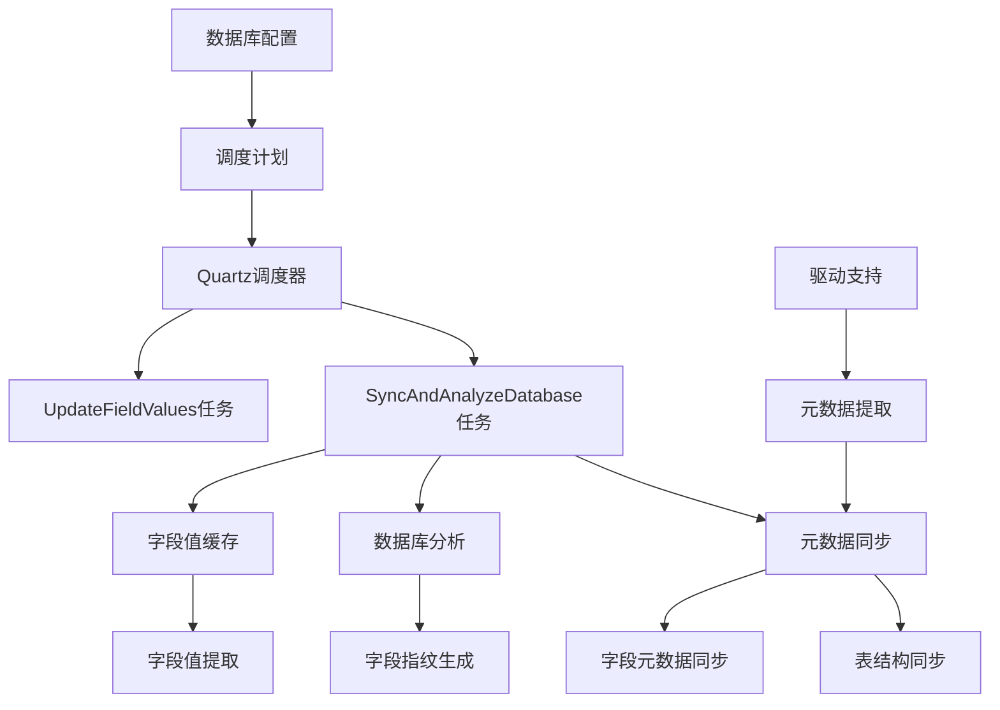
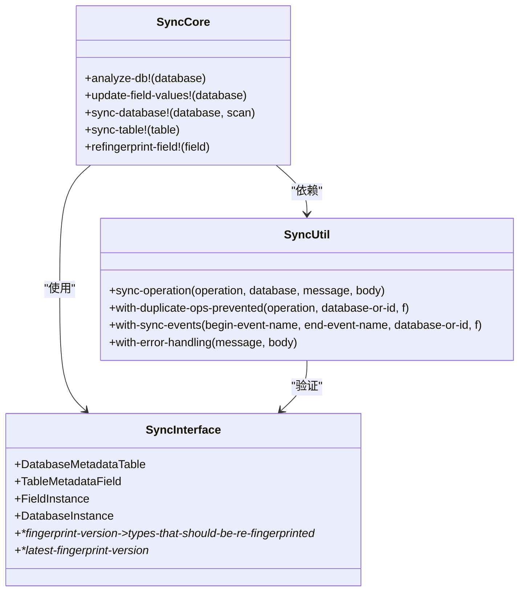
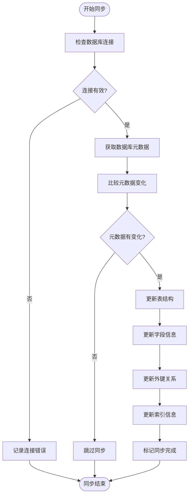
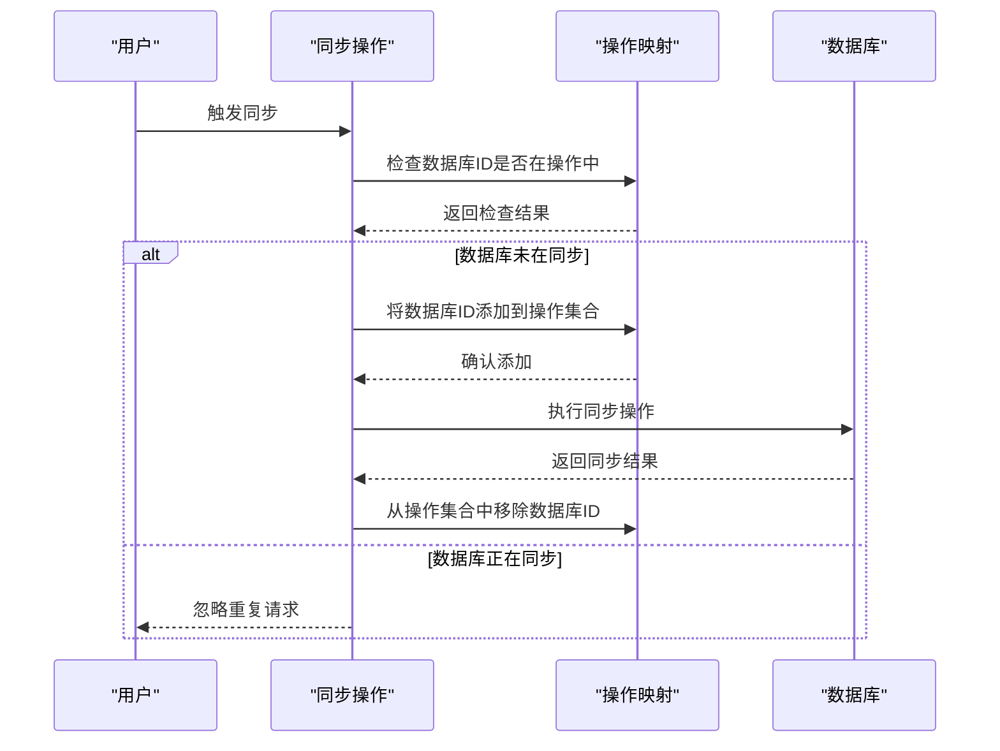
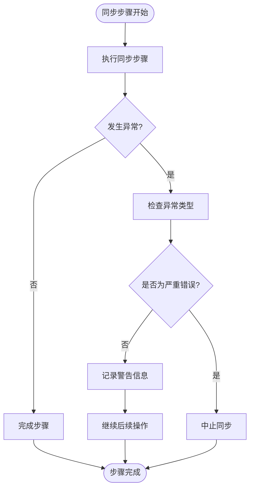
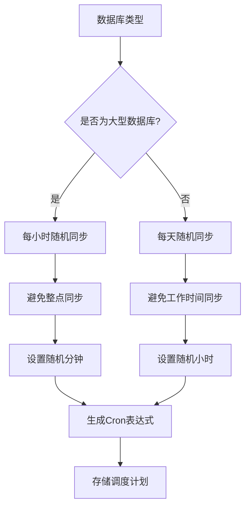
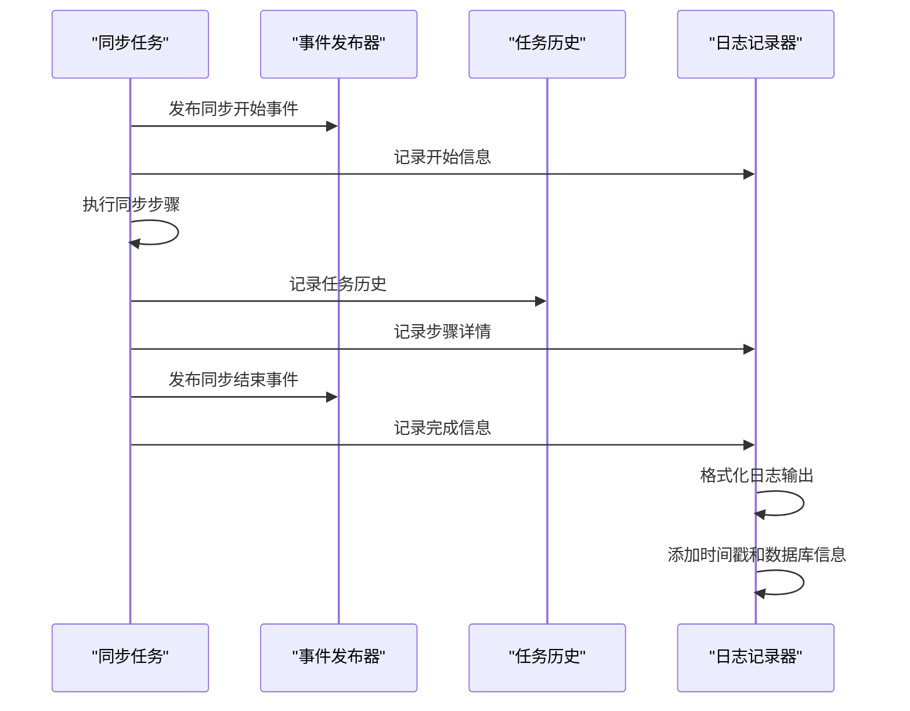

# 同步调度与执行

<cite>
**本文档引用的文件**  
- [sync_databases.clj](file://src/metabase/sync/task/sync_databases.clj)
- [schedules.clj](file://src/metabase/sync/schedules.clj)
- [core.clj](file://src/metabase/sync/core.clj)
- [interface.clj](file://src/metabase/sync/interface.clj)
- [sync.clj](file://src/metabase/sync/sync.clj)
- [util.clj](file://src/metabase/sync/util.clj)
- [settings.clj](file://src/metabase/sync/settings.clj)
</cite>

## 目录
1. [引言](#引言)
2. [同步调度架构](#同步调度架构)
3. [核心同步执行框架](#核心同步执行框架)
4. [增量同步检测机制](#增量同步检测机制)
5. [并发控制与资源限制](#并发控制与资源限制)
6. [错误处理与失败重试策略](#错误处理与失败重试策略)
7. [配置示例与同步策略](#配置示例与同步策略)
8. [监控与日志记录机制](#监控与日志记录机制)
9. [结论](#结论)

## 引言
Metabase系统中的元数据同步调度机制负责定期从连接的数据库中提取和更新元数据信息，包括表结构、字段信息、外键关系等。该机制通过Quartz调度器实现定时任务管理，确保数据库元数据的准确性和时效性。本文档深入分析了同步调度的核心组件，包括任务调度配置、执行流程、错误处理以及监控机制，为系统维护和性能优化提供全面的技术指导。

## 同步调度架构

**Diagram sources**
- [sync_databases.clj](file://src/metabase/sync/task/sync_databases.clj#L1-L368)
- [schedules.clj](file://src/metabase/sync/schedules.clj#L1-L75)

**Section sources**
- [sync_databases.clj](file://src/metabase/sync/task/sync_databases.clj#L1-L368)
- [schedules.clj](file://src/metabase/sync/schedules.clj#L1-L75)

## 核心同步执行框架

Metabase的同步执行框架由多个核心组件构成，通过分层设计实现了元数据同步、分析和缓存的分离。`core.clj`文件定义了主要的同步API，而`interface.clj`提供了统一的数据结构和常量定义。

**Diagram sources**
- [core.clj](file://src/metabase/sync/core.clj#L1-L37)
- [interface.clj](file://src/metabase/sync/interface.clj#L1-L200)
- [util.clj](file://src/metabase/sync/util.clj#L1-L651)

**Section sources**
- [core.clj](file://src/metabase/sync/core.clj#L1-L37)
- [interface.clj](file://src/metabase/sync/interface.clj#L1-L200)

## 增量同步检测机制

Metabase采用增量同步策略，通过比较数据库元数据的变化来决定需要更新的内容。该机制基于数据库和表的最后同步时间戳，避免了全量同步带来的性能开销。

**Diagram sources**
- [sync.clj](file://src/metabase/sync/sync.clj#L1-L100)
- [fetch_metadata.clj](file://src/metabase/sync/fetch_metadata.clj#L1-L127)

**Section sources**
- [sync.clj](file://src/metabase/sync/sync.clj#L1-L100)
- [fetch_metadata.clj](file://src/metabase/sync/fetch_metadata.clj#L1-L127)

## 并发控制与资源限制

为了防止同一数据库的多个同步任务同时执行，Metabase实现了并发控制机制。通过原子操作和数据库ID的集合管理，确保每个数据库在任何时刻只有一个同步操作在进行。

**Diagram sources**
- [util.clj](file://src/metabase/sync/util.clj#L64-L91)
- [sync.clj](file://src/metabase/sync/sync.clj#L24-L30)

**Section sources**
- [util.clj](file://src/metabase/sync/util.clj#L64-L91)

## 错误处理与失败重试策略

Metabase的同步机制包含完善的错误处理策略，能够区分可恢复和不可恢复的异常。对于网络连接等临时性错误，系统会记录警告并继续执行后续操作；而对于SSL握手等严重错误，则会中断同步流程。

**Diagram sources**
- [util.clj](file://src/metabase/sync/util.clj#L208-L242)
- [sync_databases.clj](file://src/metabase/sync/task/sync_databases.clj#L1-L368)

**Section sources**
- [util.clj](file://src/metabase/sync/util.clj#L208-L242)

## 配置示例与同步策略

Metabase允许为不同规模的数据库设置合适的同步策略。通过`schedules.clj`文件中的默认配置，系统可以为小型和大型数据库分配不同的同步频率。

**Diagram sources**
- [schedules.clj](file://src/metabase/sync/schedules.clj#L1-L75)
- [sync_databases.clj](file://src/metabase/sync/task/sync_databases.clj#L1-L368)

**Section sources**
- [schedules.clj](file://src/metabase/sync/schedules.clj#L1-L75)

## 监控与日志记录机制

同步任务的监控和日志记录是确保系统稳定运行的关键。Metabase通过事件发布、任务历史记录和详细的日志输出，提供了全面的监控能力。

**Diagram sources**
- [util.clj](file://src/metabase/sync/util.clj#L100-L150)
- [sync_databases.clj](file://src/metabase/sync/task/sync_databases.clj#L1-L368)

**Section sources**
- [util.clj](file://src/metabase/sync/util.clj#L100-L150)

## 结论
Metabase的元数据同步调度机制通过Quartz调度器、分层执行框架和完善的错误处理策略，实现了高效、可靠的数据库元数据管理。系统采用增量同步、并发控制和智能调度策略，既保证了数据的实时性，又避免了对数据库性能的过度影响。通过详细的监控和日志记录，运维人员可以全面了解同步任务的执行情况，及时发现和解决问题。该机制的设计充分考虑了不同规模数据库的需求，为系统的可扩展性和稳定性提供了坚实的基础。