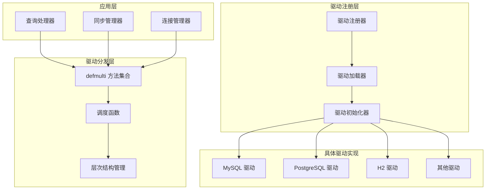
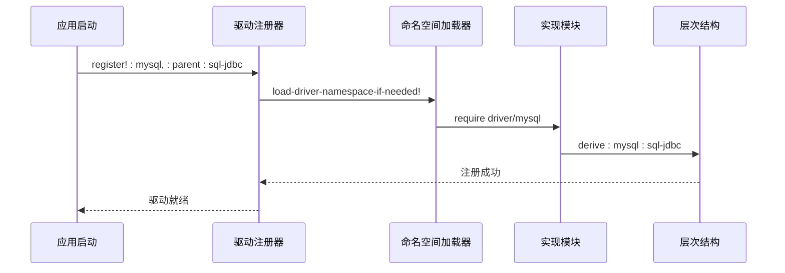
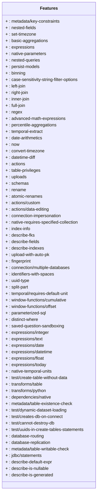
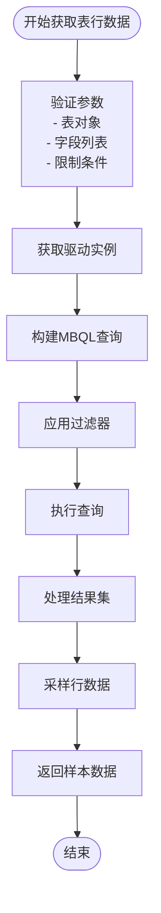
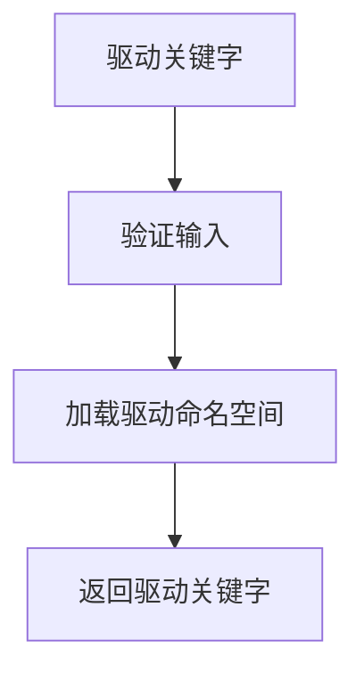
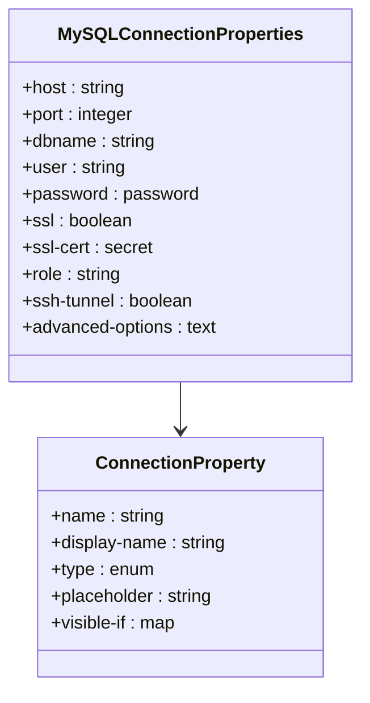

# Metabase驱动多态分发机制架构文档

<cite>
**本文档引用的文件**
- [driver.clj](file://src/metabase/driver.clj)
- [driver/init.clj](file://src/metabase/driver/init.clj)
- [driver/impl.clj](file://src/metabase/driver/impl.clj)
- [driver/sql.clj](file://src/metabase/driver/sql.clj)
- [driver/sql_jdbc.clj](file://src/metabase/driver/sql_jdbc.clj)
- [driver/mysql.clj](file://src/metabase/driver/mysql.clj)
- [driver/postgres.clj](file://src/metabase/driver/postgres.clj)
- [driver/common/table_rows_sample.clj](file://src/metabase/driver/common/table_rows_sample.clj)
- [driver/common.clj](file://src/metabase/driver/common.clj)
</cite>

## 目录
1. [概述](#概述)
2. [多态分发核心架构](#多态分发核心架构)
3. [驱动注册与层次结构](#驱动注册与层次结构)
4. [核心协议方法详解](#核心协议方法详解)
5. [调度函数设计原理](#调度函数设计原理)
6. [具体驱动实现示例](#具体驱动实现示例)
7. [性能优化与监控](#性能优化与监控)
8. [调试与故障排除](#调试与故障排除)
9. [最佳实践指南](#最佳实践指南)
10. [总结](#总结)

## 概述

Metabase的驱动多态分发机制是其核心架构的重要组成部分，通过Clojure的`defmulti`和`defmethod`系统实现了灵活的数据库驱动抽象层。该机制允许Metabase支持多种数据库类型，同时保持统一的接口设计。

### 核心特性

- **动态分发**：基于数据库类型的运行时方法选择
- **继承层次**：支持驱动间的继承关系和方法重用
- **延迟加载**：按需加载驱动实现，优化启动性能
- **插件化**：支持第三方驱动扩展

## 多态分发核心架构

### 架构概览



**图表来源**
- [driver.clj](file://src/metabase/driver.clj#L119-L146)
- [driver/impl.clj](file://src/metabase/driver/impl.clj#L27-L65)

### 多态分发机制原理

Metabase使用Clojure的多态函数系统实现驱动分发：

1. **defmulti定义**：为每个驱动功能定义多态函数
2. **调度函数**：确定调用哪个具体实现
3. **defmethod注册**：为特定驱动类型注册实现

**章节来源**
- [driver.clj](file://src/metabase/driver.clj#L145-L168)

## 驱动注册与层次结构

### 注册流程



**图表来源**
- [driver/impl.clj](file://src/metabase/driver/impl.clj#L141-L169)

### 层次结构设计

驱动采用树状层次结构，支持方法继承：

- **根节点**：`:metabase.driver/driver`
- **抽象父类**：`:sql`, `:sql-jdbc`
- **具体驱动**：`:mysql`, `:postgres`, `:h2`

**章节来源**
- [driver/impl.clj](file://src/metabase/driver/impl.clj#L27-L65)

## 核心协议方法详解

### 主要协议方法

#### features（功能特性）



**图表来源**
- [driver.clj](file://src/metabase/driver.clj#L540-L799)

#### connection-properties（连接属性）

连接属性定义了用户配置数据库连接所需的参数：

| 属性名称 | 类型 | 描述 | 默认值 |
|---------|------|------|--------|
| host | string | 数据库主机地址 | localhost |
| port | integer | 数据库端口号 | 5432 |
| dbname | string | 数据库名称 | - |
| user | string | 用户名 | - |
| password | password | 密码 | - |
| ssl | boolean | 启用SSL连接 | false |
| additional-options | text | 额外连接选项 | - |

**章节来源**
- [driver/mysql.clj](file://src/metabase/driver/mysql.clj#L200-L250)
- [driver/postgres.clj](file://src/metabase/driver/postgres.clj#L150-L200)

#### table-rows（表行数据）

`table-rows`方法负责从数据库表中获取样本数据：



**图表来源**
- [driver/common/table_rows_sample.clj](file://src/metabase/driver/common/table_rows_sample.clj#L73-L110)

**章节来源**
- [driver/common/table_rows_sample.clj](file://src/metabase/driver/common/table_rows_sample.clj#L99-L110)

## 调度函数设计原理

### 调度函数类型

Metabase使用两种主要的调度函数：

#### dispatch-on-uninitialized-driver

用于不需要初始化的轻量级操作：



**图表来源**
- [driver.clj](file://src/metabase/driver.clj#L119-L146)

#### dispatch-on-initialized-driver

确保驱动已初始化后再进行操作：


**图表来源**
- [driver.clj](file://src/metabase/driver.clj#L145-L168)

### 性能影响分析

调度函数的性能考虑：

1. **命名空间加载开销**：首次访问时需要加载
2. **初始化延迟**：避免不必要的初始化
3. **缓存机制**：已注册驱动的快速查找

**章节来源**
- [driver/impl.clj](file://src/metabase/driver/impl.clj#L89-L113)

## 具体驱动实现示例

### MySQL驱动实现

MySQL驱动展示了完整的驱动实现模式：

#### 功能支持声明

```clojure
(doseq [[feature supported?] {;; MySQL特性配置
                              :case-sensitivity-string-filter-options false
                              :connection-impersonation               true
                              :connection-impersonation-requires-role true
                              :describe-fields                        true
                              :describe-fks                           true
                              :convert-timezone                       true
                              :datetime-diff                          true
                              :full-join                              false
                              :now                                    true
                              :percentile-aggregations                false
                              :persist-models                         true
                              :schemas                                false
                              :uploads                                true
                              :identifiers-with-spaces                true
                              :rename                                 true
                              :atomic-renames                         true
                              :expressions/integer                    true
                              :expressions/float                      true
                              :expressions/date                       true
                              :expressions/text                       true
                              :split-part                             true
                              :window-functions/offset                false
                              :expression-literals                    true
                              :database-routing                       true
                              :metadata/table-existence-check         true
                              :transforms/python                      true
                              :transforms/table                       true
                              :describe-default-expr                  true
                              :describe-is-nullable                   true
                              :describe-is-generated                  true}]}
```

**章节来源**
- [driver/mysql.clj](file://src/metabase/driver/mysql.clj#L50-L80)

#### 连接属性实现



**图表来源**
- [driver/mysql.clj](file://src/metabase/driver/mysql.clj#L200-L250)

### PostgreSQL驱动实现

PostgreSQL驱动提供了更丰富的功能支持：

#### 高级特性支持

- **JSON字段支持**：完整的JSON查询能力
- **枚举类型**：PostgreSQL特有的枚举类型
- **高级数学表达式**：复杂的数学运算支持
- **窗口函数**：完整的窗口函数支持

**章节来源**
- [driver/postgres.clj](file://src/metabase/driver/postgres.clj#L50-L80)

## 性能优化与监控

### 加载时序优化

```mermaid
gantt
title 驱动加载时序图
dateFormat X
axisFormat %s
section 初始化阶段
驱动注册 :0, 10
命名空间加载 :10, 20
方法注册 :20, 30
section 运行时阶段
查询处理 :30, 50
元数据同步 :50, 70
连接管理 :70, 90
```



### 性能监控指标

1. **方法解析时间**：调度函数执行时间
2. **命名空间加载时间**：驱动加载耗时
3. **初始化时间**：驱动初始化耗时
4. **内存使用**：驱动相关内存占用

### 优化策略

- **延迟初始化**：按需初始化驱动
- **命名空间缓存**：避免重复加载
- **方法缓存**：缓存方法查找结果
- **并发控制**：读写锁保护驱动注册

**章节来源**
- [driver/impl.clj](file://src/metabase/driver/impl.clj#L27-L65)

## 调试与故障排除

### 多态分发问题诊断

#### 常见问题及解决方案

1. **方法未找到**
   - 检查驱动是否正确注册
   - 验证调度函数返回值
   - 确认方法实现存在

2. **初始化失败**
   - 检查依赖项是否满足
   - 验证命名空间加载
   - 查看错误日志

3. **性能问题**
   - 分析方法解析时间
   - 检查命名空间加载频率
   - 监控内存使用情况

### 调试工具和技术

#### 方法解析跟踪

```clojure
;; 启用方法解析跟踪
(defn trace-dispatch
  [dispatch-fn & args]
  (let [result (apply dispatch-fn args)]
    (println "Dispatched to:" result)
    result))
```

#### 协议一致性检查

```clojure
;; 检查驱动实现完整性
(defn check-driver-implementation
  [driver]
  (let [required-methods #{:features :connection-properties :table-rows}
        available-methods (keys (methods driver))]
    (set/difference required-methods available-methods)))
```

**章节来源**
- [driver/impl.clj](file://src/metabase/driver/impl.clj#L112-L144)

## 最佳实践指南

### 驱动开发最佳实践

1. **继承设计**
   - 合理使用父类继承
   - 避免循环依赖
   - 明确抽象边界

2. **方法实现**
   - 提供默认实现
   - 处理异常情况
   - 文档化功能特性

3. **性能考虑**
   - 延迟加载资源
   - 缓存计算结果
   - 优化网络请求

4. **测试策略**
   - 单元测试覆盖
   - 集成测试验证
   - 性能基准测试

### 扩展开发指南

#### 创建新驱动

1. **注册驱动**
   ```clojure
   (driver/register! :my-driver :parent :sql-jdbc)
   ```

2. **实现必需方法**
   - `features`
   - `connection-properties`
   - `can-connect?`

3. **添加特定功能**
   - 查询处理
   - 元数据获取
   - 特殊语法支持

**章节来源**
- [driver/sql_jdbc.clj](file://src/metabase/driver/sql_jdbc.clj#L30-L40)

## 总结

Metabase的驱动多态分发机制是一个精心设计的架构系统，它通过以下关键特性实现了数据库驱动的灵活性和可扩展性：

### 核心优势

1. **统一接口**：所有数据库驱动共享相同的API
2. **灵活扩展**：支持新数据库类型的无缝集成
3. **性能优化**：按需加载和初始化机制
4. **类型安全**：Clojure的多态系统保证类型安全

### 设计亮点

- **层次化继承**：支持驱动间的继承关系
- **延迟加载**：优化启动时间和内存使用
- **方法缓存**：提高运行时性能
- **错误处理**：完善的异常处理机制

### 应用价值

该机制使得Metabase能够：
- 支持超过20种不同的数据库系统
- 提供一致的用户体验
- 便于维护和扩展
- 保证系统的稳定性和可靠性

通过深入理解这个多态分发机制，开发者可以更好地扩展Metabase的功能，或者在自己的项目中应用类似的架构设计模式。