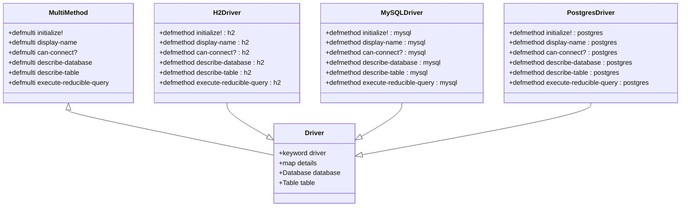

# 数据库驱动开发

<cite>
**本文档中引用的文件**   
- [driver.clj](file://src/metabase/driver.clj)
- [sql_jdbc.clj](file://src/metabase/driver/sql_jdbc.clj)
- [h2.clj](file://src/metabase/driver/h2.clj)
- [mysql.clj](file://src/metabase/driver/mysql.clj)
- [postgres.clj](file://src/metabase/driver/postgres.clj)
- [sql.clj](file://src/metabase/driver/sql.clj)
- [ddl/interface.clj](file://src/metabase/driver/ddl/interface.clj)
</cite>

## 目录
1. [引言](#引言)
2. [多态分发机制](#多态分发机制)
3. [SQL方言处理策略](#sql方言处理策略)
4. [连接管理与事务处理](#连接管理与事务处理)
5. [错误映射与最佳实践](#错误映射与最佳实践)
6. [新数据库驱动创建指南](#新数据库驱动创建指南)
7. [H2、MySQL和PostgreSQL驱动分析](#h2mysql和postgresql驱动分析)
8. [结论](#结论)

## 引言

Metabase是一个开源的数据分析平台，其核心功能之一是通过数据库驱动与各种数据源进行交互。本文档深入探讨了Metabase中数据库驱动的开发技术，重点分析了`driver.clj`中定义的多态分发机制、SQL方言处理策略、连接管理、事务处理和错误映射的最佳实践。文档还提供了从零开始创建新数据库驱动的分步指南，并结合H2、MySQL和PostgreSQL驱动的具体实现，分析不同数据库的适配模式和特殊处理需求。

Metabase的驱动架构基于Clojure的多态分发机制，通过`defmulti`和`defmethod`实现数据库类型特异性行为。驱动系统支持多种数据库，包括关系型数据库（如MySQL、PostgreSQL）和非关系型数据库（如MongoDB）。每个驱动都实现了特定的接口方法，以支持数据库的连接、查询、元数据同步等功能。

**Section sources**
- [driver.clj](file://src/metabase/driver.clj#L1-L50)

## 多态分发机制

Metabase使用Clojure的多态分发机制来实现数据库类型特异性行为。核心是`defmulti`宏，它定义了一个多态函数，可以根据不同的数据库类型分发到不同的实现方法。`dispatch-on-initialized-driver`是主要的分发函数，它确保在调用方法之前驱动已被初始化。

**Diagram sources**
- [driver.clj](file://src/metabase/driver.clj#L150-L200)
- [h2.clj](file://src/metabase/driver/h2.clj#L50-L100)
- [mysql.clj](file://src/metabase/driver/mysql.clj#L50-L100)
- [postgres.clj](file://src/metabase/driver/postgres.clj#L50-L100)

### 分发函数

`dispatch-on-initialized-driver`是核心分发函数，它接收驱动关键字作为参数，并确保驱动在分发前已被初始化。这个函数通过`the-initialized-driver`来加载和初始化驱动，然后返回驱动关键字进行分发。

**Diagram sources**
- [driver.clj](file://src/metabase/driver.clj#L180-L200)

### 方法实现

每个驱动通过`defmethod`实现特定的方法。例如，`initialize!`方法用于驱动的初始化，`display-name`方法返回驱动的显示名称，`can-connect?`方法检查是否可以连接到数据库。

**Section sources**
- [driver.clj](file://src/metabase/driver.clj#L200-L300)
- [h2.clj](file://src/metabase/driver/h2.clj#L100-L150)
- [mysql.clj](file://src/metabase/driver/mysql.clj#L100-L150)
- [postgres.clj](file://src/metabase/driver/postgres.clj#L100-L150)

## SQL方言处理策略

Metabase通过`sql.clj`和`sql_jdbc.clj`文件中的函数来处理不同数据库的SQL方言。这些函数负责查询构造、参数化和元数据同步。

### 查询构造

`mbql->native`方法将MBQL（Metabase Query Language）转换为原生SQL。`prettify-native-form`方法格式化原生SQL并修复参数。

**Diagram sources**
- [sql.clj](file://src/metabase/driver/sql.clj#L50-L100)

### 参数化

`substitute-native-parameters`方法处理原生参数的替换。它解析查询中的参数并将其替换为实际值。

**Diagram sources**
- [sql.clj](file://src/metabase/driver/sql.clj#L120-L150)

### 元数据同步

`describe-database`和`describe-table`方法用于获取数据库和表的元数据。这些方法返回的信息用于同步数据库结构。

**Section sources**
- [sql.clj](file://src/metabase/driver/sql.clj#L50-L150)
- [sql_jdbc.clj](file://src/metabase/driver/sql_jdbc.clj#L100-L150)

## 连接管理与事务处理

Metabase通过`sql_jdbc.clj`文件中的函数来管理数据库连接和事务。

### 连接管理

`connection-details->spec`方法将连接详情转换为JDBC连接规范。`can-connect?`方法检查是否可以连接到数据库。

**Diagram sources**
- [sql_jdbc.clj](file://src/metabase/driver/sql_jdbc.clj#L50-L100)
- [h2.clj](file://src/metabase/driver/h2.clj#L200-L250)
- [mysql.clj](file://src/metabase/driver/mysql.clj#L200-L250)
- [postgres.clj](file://src/metabase/driver/postgres.clj#L200-L250)

### 事务处理

`execute-reducible-query`方法执行可还原的查询，支持事务处理。`do-with-resilient-connection`方法在连接失败时提供恢复机制。

**Section sources**
- [sql_jdbc.clj](file://src/metabase/driver/sql_jdbc.clj#L150-L200)
- [h2.clj](file://src/metabase/driver/h2.clj#L300-L350)
- [mysql.clj](file://src/metabase/driver/mysql.clj#L300-L350)
- [postgres.clj](file://src/metabase/driver/postgres.clj#L300-L350)

## 错误映射与最佳实践

Metabase通过`humanize-connection-error-message`方法将数据库连接错误映射为用户友好的消息。

### 错误映射

`humanize-connection-error-message`方法根据错误消息的正则表达式匹配，返回相应的用户友好消息。

**Diagram sources**
- [h2.clj](file://src/metabase/driver/h2.clj#L400-L450)
- [mysql.clj](file://src/metabase/driver/mysql.clj#L400-L450)
- [postgres.clj](file://src/metabase/driver/postgres.clj#L400-L450)

### 最佳实践

- 使用`with-driver`宏来绑定当前驱动。
- 实现`initialize!`方法进行驱动初始化。
- 使用`defmethod`实现特定的驱动方法。
- 确保驱动的连接详情安全，避免恶意输入。

**Section sources**
- [driver.clj](file://src/metabase/driver.clj#L300-L350)
- [h2.clj](file://src/metabase/driver/h2.clj#L450-L500)
- [mysql.clj](file://src/metabase/driver/mysql.clj#L450-L500)
- [postgres.clj](file://src/metabase/driver/postgres.clj#L450-L500)

## 新数据库驱动创建指南

创建新的数据库驱动需要实现核心协议、DDL支持和性能优化技巧。

### 核心协议实现

1. 注册驱动：使用`driver/register!`注册新驱动。
2. 实现多态方法：为新驱动实现`initialize!`、`display-name`、`can-connect?`等方法。
3. 处理连接：实现`connection-details->spec`方法来处理连接详情。

### DDL支持

实现`create-table!`、`drop-table!`、`truncate!`等方法来支持DDL操作。

### 性能优化技巧

- 使用连接池来管理数据库连接。
- 优化查询构造，减少不必要的元数据查询。
- 使用缓存来存储频繁访问的元数据。

**Section sources**
- [driver.clj](file://src/metabase/driver.clj#L350-L400)
- [sql_jdbc.clj](file://src/metabase/driver/sql_jdbc.clj#L200-L250)
- [ddl/interface.clj](file://src/metabase/driver/ddl/interface.clj#L1-L50)

## H2、MySQL和PostgreSQL驱动分析

### H2驱动

H2驱动实现了H2数据库的特有功能，如`can-connect?`方法检查连接字符串的安全性，`execute-reducible-query`方法执行查询。

**Section sources**
- [h2.clj](file://src/metabase/driver/h2.clj#L1-L799)

### MySQL驱动

MySQL驱动实现了MySQL数据库的特有功能，如`can-connect?`方法检查MySQL版本，`execute-reducible-query`方法执行查询。

**Section sources**
- [mysql.clj](file://src/metabase/driver/mysql.clj#L1-L1164)

### PostgreSQL驱动

PostgreSQL驱动实现了PostgreSQL数据库的特有功能，如`can-connect?`方法检查PostgreSQL连接，`execute-reducible-query`方法执行查询。

**Section sources**
- [postgres.clj](file://src/metabase/driver/postgres.clj#L1-L1270)

## 结论

Metabase的数据库驱动开发基于Clojure的多态分发机制，通过`defmulti`和`defmethod`实现数据库类型特异性行为。驱动系统支持多种数据库，每个驱动都实现了特定的接口方法来支持连接、查询、元数据同步等功能。通过理解多态分发机制、SQL方言处理策略、连接管理、事务处理和错误映射的最佳实践，可以有效地创建和维护新的数据库驱动。