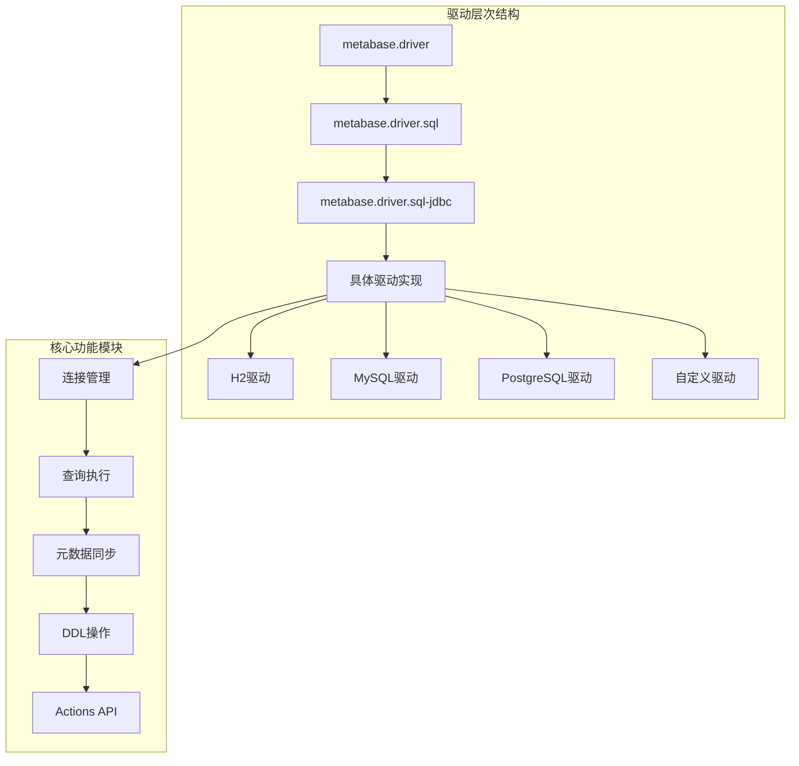
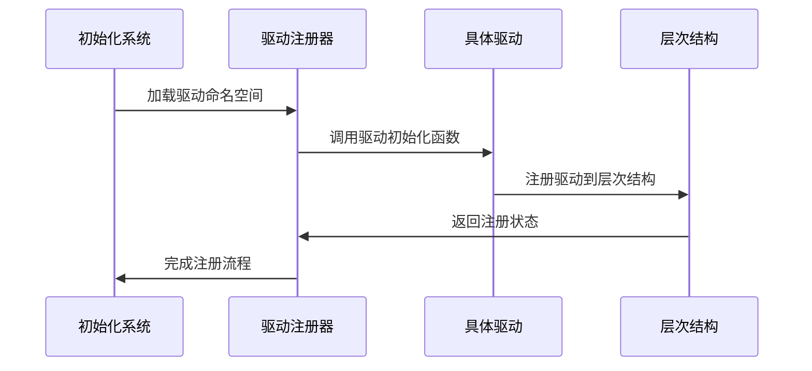
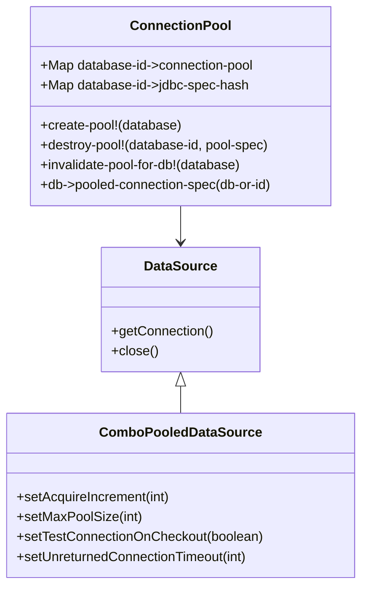
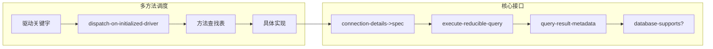
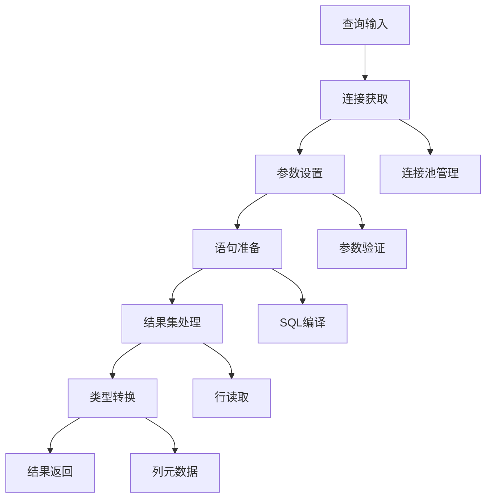
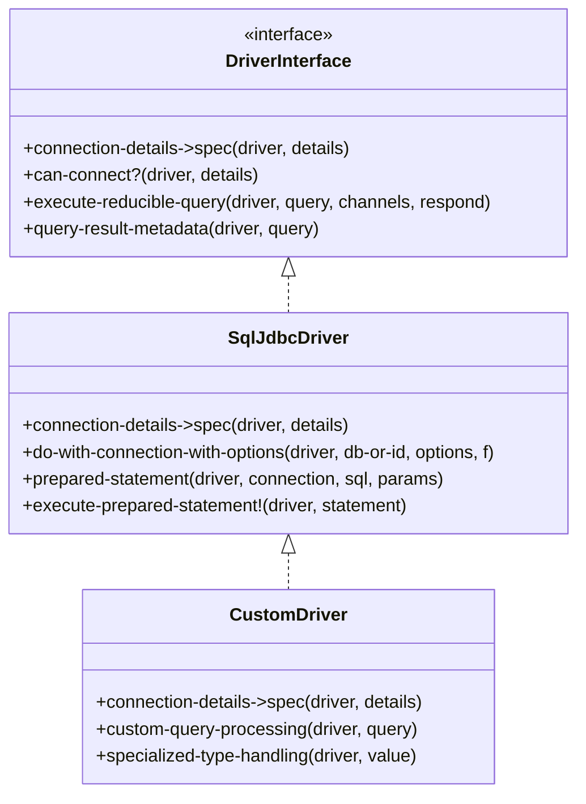
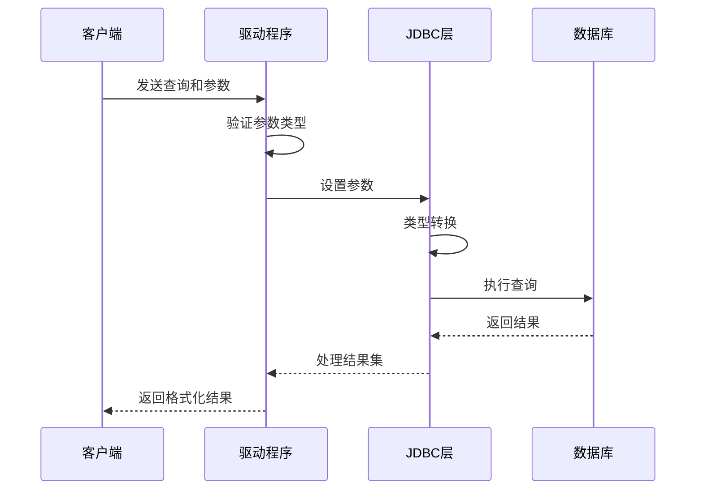
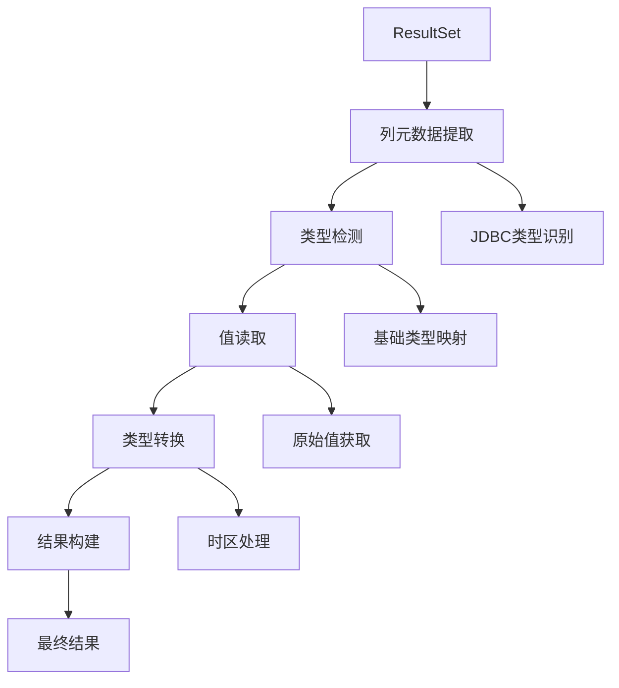
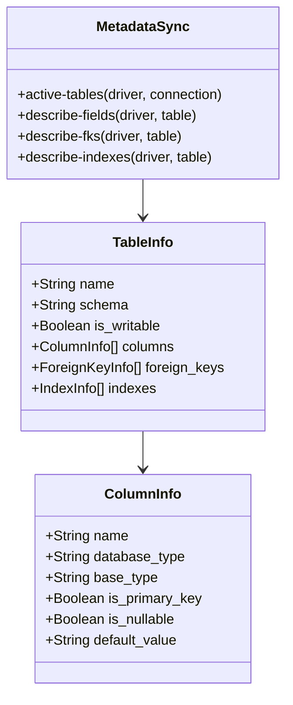
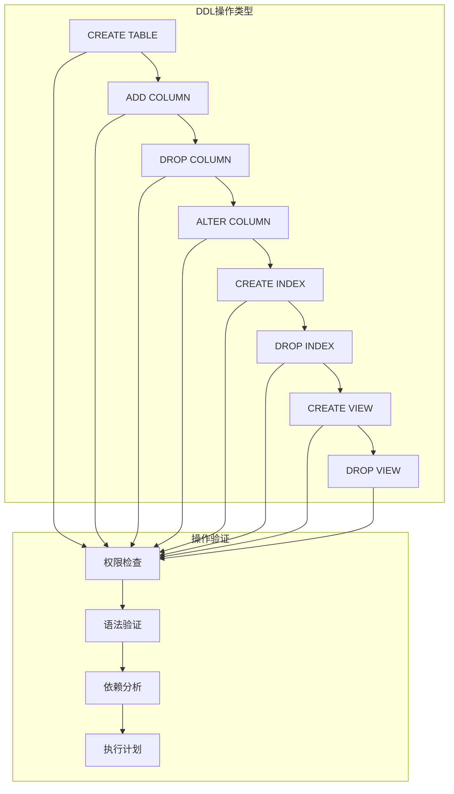

# 新数据库驱动开发指南

<cite>
**本文档中引用的文件**
- [sql_jdbc/connection.clj](file://src/metabase/driver/sql_jdbc/connection.clj)
- [sql_jdbc/actions.clj](file://src/metabase/driver/sql_jdbc/actions.clj)
- [sql_jdbc/metadata.clj](file://src/metabase/driver/sql_jdbc/metadata.clj)
- [sql_jdbc/sync.clj](file://src/metabase/driver/sql_jdbc/sync.clj)
- [sql_jdbc/execute.clj](file://src/metabase/driver/sql_jdbc/execute.clj)
- [h2.clj](file://src/metabase/driver/h2.clj)
- [mysql.clj](file://src/metabase/driver/mysql.clj)
- [postgres.clj](file://src/metabase/driver/postgres.clj)
- [sql_jdbc/sync/interface.clj](file://src/metabase/driver/sql_jdbc/sync/interface.clj)
- [ddl/interface.clj](file://src/metabase/driver/ddl/interface.clj)
- [driver/init.clj](file://src/metabase/driver/init.clj)
- [driver/settings.clj](file://src/metabase/driver/settings.clj)
- [driver_methods.clj](file://src/metabase/cmd/driver_methods.clj)
</cite>

## 目录
1. [简介](#简介)
2. [项目结构概览](#项目结构概览)
3. [核心组件分析](#核心组件分析)
4. [架构概览](#架构概览)
5. [详细组件分析](#详细组件分析)
6. [驱动开发检查清单](#驱动开发检查清单)
7. [与现有驱动的对比分析](#与现有驱动的对比分析)
8. [测试策略](#测试策略)
9. [性能基准测试](#性能基准测试)
10. [生产部署验证](#生产部署验证)
11. [故障排除指南](#故障排除指南)
12. [结论](#结论)

## 简介

本指南提供了从零开始开发新数据库驱动的完整分步指导。Metabase采用模块化架构，通过多方法（multimethod）系统实现对不同数据库的支持。本指南将基于Metabase现有的H2、MySQL和PostgreSQL驱动实现，展示如何为新的数据库系统开发兼容的驱动程序。

## 项目结构概览

Metabase的驱动系统采用层次化设计，主要分为以下几个层次：



**图表来源**
- [driver/init.clj](file://src/metabase/driver/init.clj#L1-L17)
- [sql_jdbc/connection.clj](file://src/metabase/driver/sql_jdbc/connection.clj#L1-L50)

**章节来源**
- [driver/init.clj](file://src/metabase/driver/init.clj#L1-L17)

## 核心组件分析

### 驱动注册机制

Metabase使用动态注册系统来管理驱动程序。每个驱动都需要在初始化时注册到系统中：



**图表来源**
- [driver/init.clj](file://src/metabase/driver/init.clj#L10-L17)

### 连接池管理

连接池是驱动系统的核心组件，负责管理数据库连接的生命周期：



**图表来源**
- [sql_jdbc/connection.clj](file://src/metabase/driver/sql_jdbc/connection.clj#L150-L250)

**章节来源**
- [sql_jdbc/connection.clj](file://src/metabase/driver/sql_jdbc/connection.clj#L1-L383)

## 架构概览

### 多方法系统架构

Metabase采用多方法系统来实现驱动的可扩展性：



**图表来源**
- [sql_jdbc/execute.clj](file://src/metabase/driver/sql_jdbc/execute.clj#L1-L100)

### 查询处理流水线

查询处理涉及多个阶段的协调工作：



**图表来源**
- [sql_jdbc/execute.clj](file://src/metabase/driver/sql_jdbc/execute.clj#L400-L600)

**章节来源**
- [sql_jdbc/execute.clj](file://src/metabase/driver/sql_jdbc/execute.clj#L1-L799)

## 详细组件分析

### 连接管理组件

连接管理是驱动系统的基础，负责建立和维护数据库连接：

#### 核心接口定义



**图表来源**
- [sql_jdbc/connection.clj](file://src/metabase/driver/sql_jdbc/connection.clj#L30-L80)
- [sql_jdbc/execute.clj](file://src/metabase/driver/sql_jdbc/execute.clj#L100-L200)

#### 连接池配置

连接池的配置直接影响系统的性能和稳定性：

| 配置项 | 默认值 | 说明 | 影响因素 |
|--------|--------|------|----------|
| acquireIncrement | 1 | 每次获取连接的数量 | 内存使用和响应时间权衡 |
| maxPoolSize | 15 | 最大连接数 | 并发查询能力和资源限制 |
| minPoolSize | 0 | 最小连接数 | 启动时间和内存占用 |
| maxIdleTime | 10800秒 | 连接最大空闲时间 | 资源回收效率 |
| testConnectionOnCheckout | true | 检查连接有效性 | 连接可靠性保证 |

**章节来源**
- [sql_jdbc/connection.clj](file://src/metabase/driver/sql_jdbc/connection.clj#L80-L150)

### 查询执行组件

查询执行组件负责处理SQL查询的各个阶段：

#### 参数绑定和类型转换



**图表来源**
- [sql_jdbc/execute.clj](file://src/metabase/driver/sql_jdbc/execute.clj#L600-L700)

#### 结果集处理

结果集处理涉及复杂的类型映射和性能优化：



**图表来源**
- [sql_jdbc/execute.clj](file://src/metabase/driver/sql_jdbc/execute.clj#L700-L800)

**章节来源**
- [sql_jdbc/execute.clj](file://src/metabase/driver/sql_jdbc/execute.clj#L400-L799)

### 元数据同步组件

元数据同步确保数据库结构信息的准确性和实时性：

#### 表和字段发现



**图表来源**
- [sql_jdbc/sync/interface.clj](file://src/metabase/driver/sql_jdbc/sync/interface.clj#L1-L50)

#### 数据类型映射

不同类型数据库的数据类型映射关系：

| 基础类型 | H2 | MySQL | PostgreSQL | 自定义数据库 |
|----------|----|-------|------------|-------------|
| Integer | TINYINT, SMALLINT, INTEGER, BIGINT | TINYINT, SMALLINT, INT, BIGINT | SMALLINT, INTEGER, BIGINT | 自定义整数类型 |
| Float | REAL, FLOAT, DOUBLE | FLOAT, DOUBLE | REAL, DOUBLE PRECISION | 自定义浮点类型 |
| Decimal | NUMERIC, DECIMAL | DECIMAL, NUMERIC | DECIMAL, NUMERIC | 自定义精度类型 |
| Text | VARCHAR, CHAR, CLOB | VARCHAR, CHAR, TEXT | VARCHAR, CHAR, TEXT | 自定义文本类型 |
| Date | DATE | DATE | DATE | 自定义日期类型 |
| DateTime | TIMESTAMP | DATETIME, TIMESTAMP | TIMESTAMP, TIMESTAMPTZ | 自定义时间类型 |
| Boolean | BOOLEAN | BOOLEAN | BOOLEAN | 自定义布尔类型 |

**章节来源**
- [sql_jdbc/sync/interface.clj](file://src/metabase/driver/sql_jdbc/sync/interface.clj#L1-L176)

### DDL操作组件

DDL（数据定义语言）操作组件处理数据库结构的创建和修改：

#### 支持的DDL操作



**图表来源**
- [ddl/interface.clj](file://src/metabase/driver/ddl/interface.clj#L1-L50)

**章节来源**
- [ddl/interface.clj](file://src/metabase/driver/ddl/interface.clj#L1-L104)

## 驱动开发检查清单

### 必需实现的接口

#### 1. 驱动注册和初始化

```clojure
;; 在驱动文件顶部添加
(driver/register! :your-driver, :parent :sql-jdbc)

;; 实现基本驱动信息
(defmethod driver/display-name :your-driver [_] "Your Database Name")
(defmethod driver/contact-info :your-driver [_] "support@yourcompany.com")
(defmethod driver/connection-properties :your-driver [_]
  ;; 返回连接属性定义
  [])
```

#### 2. 连接细节转换

```clojure
(defmethod sql-jdbc.conn/connection-details->spec :your-driver
  [_ details]
  {:subprotocol "your-protocol"
   :classname "com.yourcompany.YourDriver"
   :host (:host details)
   :port (:port details)
   :db (:dbname details)
   :user (:username details)
   :password (:password details)})
```

#### 3. 查询执行支持

```clojure
(defmethod driver/execute-reducible-query :your-driver
  [driver query chans respond]
  ;; 实现查询执行逻辑
  )

(defmethod sql.qp/->honeysql [:your-driver :field]
  [driver [_ id-or-name opts]]
  ;; 实现字段访问语法
  )
```

#### 4. 数据类型映射

```clojure
(defmethod sql-jdbc.sync/database-type->base-type :your-driver
  [_ database-type]
  ;; 映射数据库类型到基础类型
  )

(defmethod sql-jdbc.execute/set-parameter [:your-driver java.time.LocalDateTime]
  [driver prepared-statement i t]
  ;; 实现特定类型的参数设置
  )
```

### 可选但推荐的功能

#### 1. 特殊查询函数支持

```clojure
(defmethod sql.qp/add-interval-honeysql-form :your-driver
  [driver hsql-form amount unit]
  ;; 实现时间间隔计算
  )

(defmethod sql.qp/datetime-diff [:your-driver :day]
  [_driver _unit x y]
  ;; 实现日期差计算
  )
```

#### 2. 错误处理和诊断

```clojure
(defmethod driver/humanize-connection-error-message :your-driver
  [_ messages]
  ;; 将数据库错误消息转换为用户友好的格式
  )

(defmethod sql-jdbc/impl-query-canceled? :your-driver
  [_ ^SQLException e]
  ;; 检测查询是否被取消
  )
```

#### 3. 性能优化

```clojure
(defmethod sql-jdbc.execute/do-with-connection-with-options :your-driver
  [driver db-or-id-or-spec options f]
  ;; 实现自定义连接选项设置
  )
```

## 与现有驱动的对比分析

### H2驱动特点

H2驱动作为嵌入式数据库，具有以下特点：

- **简单性**：不支持时区设置和事务级别调整
- **安全性**：内置安全检查，防止恶意连接字符串
- **限制性**：只支持只读查询和受限的DDL操作

### MySQL驱动特点

MySQL驱动支持丰富的功能特性：

- **版本检测**：自动检测数据库版本并警告不支持的版本
- **SSL支持**：完整的SSL连接配置
- **AWS IAM认证**：支持AWS身份验证
- **MariaDB兼容**：区分MySQL和MariaDB的特定功能

### PostgreSQL驱动特点

PostgreSQL驱动是最完整的实现：

- **完整功能支持**：支持所有高级功能
- **枚举类型**：原生支持PostgreSQL枚举类型
- **JSON处理**：强大的JSON字段处理能力
- **复制支持**：支持数据库复制功能

### 驱动特性对比表

| 功能特性 | H2 | MySQL | PostgreSQL | 自定义驱动 |
|----------|----|-------|------------|-----------|
| 基础连接 | ✅ | ✅ | ✅ | ✅ |
| 查询执行 | ✅ | ✅ | ✅ | ✅ |
| 元数据同步 | ✅ | ✅ | ✅ | ✅ |
| DDL操作 | ⚠️ | ✅ | ✅ | ✅ |
| 时区支持 | ❌ | ✅ | ✅ | ✅ |
| SSL连接 | ❌ | ✅ | ✅ | ✅ |
| 认证方式 | 基础 | 多种 | 多种 | 多种 |
| 性能优化 | 基础 | 中等 | 高度优化 | 可定制 |
| 错误处理 | 基础 | 中等 | 完整 | 可定制 |

**章节来源**
- [h2.clj](file://src/metabase/driver/h2.clj#L1-L100)
- [mysql.clj](file://src/metabase/driver/mysql.clj#L1-L100)
- [postgres.clj](file://src/metabase/driver/postgres.clj#L1-L100)

## 测试策略

### 单元测试框架

#### 1. 驱动接口测试

```clojure
(deftest test-connection-details->spec
  (let [details {:host "localhost" :port 5432 :dbname "test"}
        spec (connection-details->spec :your-driver details)]
    (is (= "localhost" (:host spec)))
    (is (= 5432 (:port spec)))
    (is (= "test" (:db spec)))))
```

#### 2. 查询执行测试

```clojure
(deftest test-basic-query-execution
  (let [query {:type :native :native {:query "SELECT 1"}}
        results (execute-reducible-query :your-driver query nil identity)]
    (is (= 1 (first results)))))
```

#### 3. 类型转换测试

```clojure
(deftest test-timestamp-conversion
  (let [timestamp (java.time.LocalDateTime/now)
        converted (convert-timestamp :your-driver timestamp)]
    (is (instance? java.time.LocalDateTime converted))))
```

### 集成测试策略

#### 1. 数据库连接测试

```clojure
(deftest test-database-connectivity
  (let [test-db {:engine :your-driver
                 :details {:host "localhost" :port 1234 :dbname "test"}}
        can-connect? (can-connect? :your-driver (:details test-db))]
    (is can-connect?)))
```

#### 2. 元数据同步测试

```clojure
(deftest test-metadata-sync
  (let [tables (active-tables :your-driver connection)
        table-names (map :name tables)]
    (is (contains? table-names "users"))
    (is (contains? table-names "orders"))))
```

#### 3. DDL操作测试

```clojure
(deftest test-ddl-operations
  (let [table-name "test_table"
        columns {:id [:int :primary-key]
                 :name [:varchar 255]}
        create-sql (create-table-sql :your-driver table-name columns)]
    (is (string? create-sql))
    (is (re-find #"CREATE TABLE" create-sql))))
```

### 测试工具和辅助函数

#### 1. 测试数据库设置

```clojure
(defn setup-test-database []
  (let [test-db (create-test-database :your-driver)]
    (try
      ;; 执行测试
      (test-functionality test-db)
      (finally
        (cleanup-test-database test-db)))))
```

#### 2. 错误场景测试

```clojure
(deftest test-error-handling
  (let [bad-query {:type :native :native {:query "INVALID SQL"}}
        error (try
                (execute-reducible-query :your-driver bad-query nil identity)
                (catch Exception e e))]
    (is (instance? Exception error))
    (is (re-find #"syntax error" (.getMessage error)))))
```

## 性能基准测试

### 查询性能测试

#### 1. 基础查询性能

```clojure
(defn benchmark-basic-query [driver iterations]
  (let [query {:type :native :native {:query "SELECT * FROM large_table LIMIT 100"}}
        start-time (System/nanoTime)]
    (dotimes [_ iterations]
      (execute-reducible-query driver query nil identity))
    (- (System/nanoTime) start-time)))
```

#### 2. 连接池性能测试

```clojure
(defn benchmark-connection-pool [driver concurrent-users]
  (let [results (atom [])]
    (pmap (fn [_]
            (let [start-time (System/nanoTime)
                  result (execute-reducible-query driver query nil identity)
                  end-time (System/nanoTime)]
              (swap! results conj (- end-time start-time))))
          (range concurrent-users))
    @results))
```

### 内存使用监控

#### 1. 连接池内存使用

```clojure
(defn monitor-connection-memory [driver]
  (let [pool-spec (db->pooled-connection-spec database)
        connection (get-connection pool-spec)]
    (try
      ;; 执行查询
      (execute-reducible-query driver query nil identity)
      (finally
        (.close connection)))))
```

#### 2. 结果集内存优化

```clojure
(defmethod sql-jdbc.execute/reducible-rows :your-driver
  [driver ^ResultSet rs ^ResultSetMetaData rsmeta]
  (let [row-thunk (row-thunk driver rs rsmeta)]
    (driver-api/reducible-rows row-thunk)))
```

### 性能优化建议

#### 1. 连接池配置优化

| 场景 | 推荐配置 | 说明 |
|------|----------|------|
| 高并发读取 | maxPoolSize: 20-50 | 增加并发连接数 |
| 低延迟查询 | maxPoolSize: 5-10 | 减少连接开销 |
| 批量导入 | acquireIncrement: 5 | 批量获取连接 |
| 长连接服务 | maxIdleTime: 300秒 | 保持连接活跃 |

#### 2. 查询优化策略

```clojure
(defmethod sql.qp/->honeysql [:your-driver :optimized-query]
  [driver [_ arg]]
  ;; 实现查询优化逻辑
  (let [optimized-query (optimize-query driver arg)]
    (sql.qp/->honeysql driver optimized-query)))
```

## 生产部署验证

### 部署前验证清单

#### 1. 功能完整性验证

```clojure
(defn validate-driver-completeness [driver]
  (let [required-methods #{'connection-details->spec
                          'execute-reducible-query
                          'query-result-metadata
                          'database-supports?}
        available-methods (set (keys (methods driver)))]
    (doseq [required required-methods]
      (when-not (contains? available-methods required)
        (throw (ex-info (str "Missing required method: " required)
                        {:driver driver :missing required}))))
    true))
```

#### 2. 性能基准验证

```clojure
(defn validate-performance-benchmarks [driver]
  (let [benchmarks {:query-latency {:target 100 :units "ms"}
                    :throughput {:target 1000 :units "qps"}
                    :memory-usage {:target 50 :units "MB"}}
        results (run-performance-tests driver benchmarks)]
    (doseq [[metric target] benchmarks]
      (let [actual (get-in results [metric :actual])
            threshold (get-in results [metric :threshold])]
        (when (> actual threshold)
          (throw (ex-info (str "Performance threshold exceeded for " metric)
                          {:driver driver :metric metric :actual actual :target target})))))))
```

### 监控和告警

#### 1. 关键指标监控

```clojure
(defn setup-driver-monitoring [driver]
  (let [metrics (atom {})]
    (add-metric "driver.connections.active" #(get-in @metrics [:connections :active]))
    (add-metric "driver.query.duration" #(get-in @metrics [:query :duration]))
    (add-metric "driver.errors.total" #(get-in @metrics [:errors :total]))
    
    (add-alert "high-connection-wait" #(> (get-in @metrics [:connections :wait-time]) 5000))
    (add-alert "slow-query" #(> (get-in @metrics [:query :duration]) 10000))
    (add-alert "error-rate" #(> (get-in @metrics [:errors :rate]) 0.05))))
```

#### 2. 健康检查

```clojure
(defn health-check-driver [driver]
  (let [test-query {:type :native :native {:query "SELECT 1"}}
        start-time (System/currentTimeMillis)
        result (try
                 (execute-reducible-query driver test-query nil identity)
                 {:status :healthy
                  :latency (- (System/currentTimeMillis) start-time)}
                 (catch Exception e
                   {:status :unhealthy
                    :error (.getMessage e)}))]
    result))
```

### 故障恢复策略

#### 1. 连接故障恢复

```clojure
(defn recover-from-connection-failure [driver database]
  (let [current-pool (get @database-id->connection-pool (u/the-id database))]
    (when current-pool
      (invalidate-pool-for-db! database)
      (Thread/sleep 1000)
      (db->pooled-connection-spec database))))
```

#### 2. 查询超时处理

```clojure
(defn handle-query-timeout [driver query]
  (let [timeout-handler (fn []
                          (log/warn "Query timeout detected, attempting recovery")
                          (recover-from-connection-failure driver database))]
    (try
      (execute-reducible-query driver query nil identity)
      (catch Exception e
        (if (query-timeout? e)
          (timeout-handler)
          (throw e))))))
```

## 故障排除指南

### 常见问题和解决方案

#### 1. 连接问题

**问题症状**：
- 连接超时
- 认证失败
- 网络不可达

**排查步骤**：
```clojure
(defn diagnose-connection-issue [driver details]
  (let [diagnostics {:network (check-network-connectivity details)
                     :credentials (check-credentials details)
                     :firewall (check-firewall-settings details)}]
    (cond
      (:timeout diagnostics) "Network connectivity issue"
      (:auth-failed diagnostics) "Authentication failure"
      (:blocked diagnostics) "Firewall blocking connection"
      :else "Connection successful")))
```

#### 2. 查询执行问题

**问题症状**：
- 查询超时
- 结果不正确
- 性能下降

**调试工具**：
```clojure
(defn debug-query-execution [driver query]
  (let [start-time (System/nanoTime)
        result (execute-reducible-query driver query nil identity)
        end-time (System/nanoTime)
        execution-time (/ (- end-time start-time) 1000000)]
    {:execution-time execution-time
     :result-count (count result)
     :performance-score (calculate-performance-score execution-time result)}))
```

#### 3. 类型转换问题

**问题症状**：
- 数据截断
- 精度丢失
- 格式错误

**解决方案**：
```clojure
(defmethod sql-jdbc.execute/set-parameter [:your-driver java.time.LocalDateTime]
  [driver prepared-statement i t]
  (try
    (set-object prepared-statement i t Types/TIMESTAMP)
    (catch Exception e
      (log/warn "Timestamp conversion failed, falling back to string representation")
      (set-object prepared-statement i (str t) Types/VARCHAR))))
```

### 日志和监控

#### 1. 详细日志记录

```clojure
(defn log-query-details [driver query params]
  (log/debug (format "Executing query on %s: %s with params: %s"
                     driver
                     (pr-str (:native query))
                     (pr-str params))))
```

#### 2. 性能监控

```clojure
(defn monitor-query-performance [driver query]
  (let [start-time (System/nanoTime)]
    (try
      (execute-reducible-query driver query nil identity)
      (finally
        (let [duration (/ (- (System/nanoTime) start-time) 1000000)]
          (log-performance-metric driver duration))))))

(defn log-performance-metric [driver duration]
  (log/info (format "Query execution time for %s: %.2f ms" driver duration)))
```

**章节来源**
- [driver/settings.clj](file://src/metabase/driver/settings.clj#L1-L190)

## 结论

本指南提供了从零开始开发新数据库驱动的完整路径。通过遵循本指南的步骤和最佳实践，开发者可以：

1. **理解架构**：掌握Metabase驱动系统的层次化设计和多方法调度机制
2. **实现核心功能**：完成连接管理、查询执行、元数据同步等核心功能
3. **优化性能**：应用连接池配置、查询优化等性能提升技术
4. **确保质量**：通过全面的测试策略和监控机制保证驱动质量
5. **支持生产**：建立完善的故障排除和恢复机制

新驱动的开发需要深入理解目标数据库的特性和限制，同时充分利用Metabase现有的基础设施。通过参考H2、MySQL和PostgreSQL等成熟驱动的实现模式，可以快速构建出高质量的数据库驱动程序。

随着数据库技术的不断发展，驱动系统也需要持续演进以支持新的功能和特性。本指南提供的框架和最佳实践为未来的扩展和改进奠定了坚实的基础。