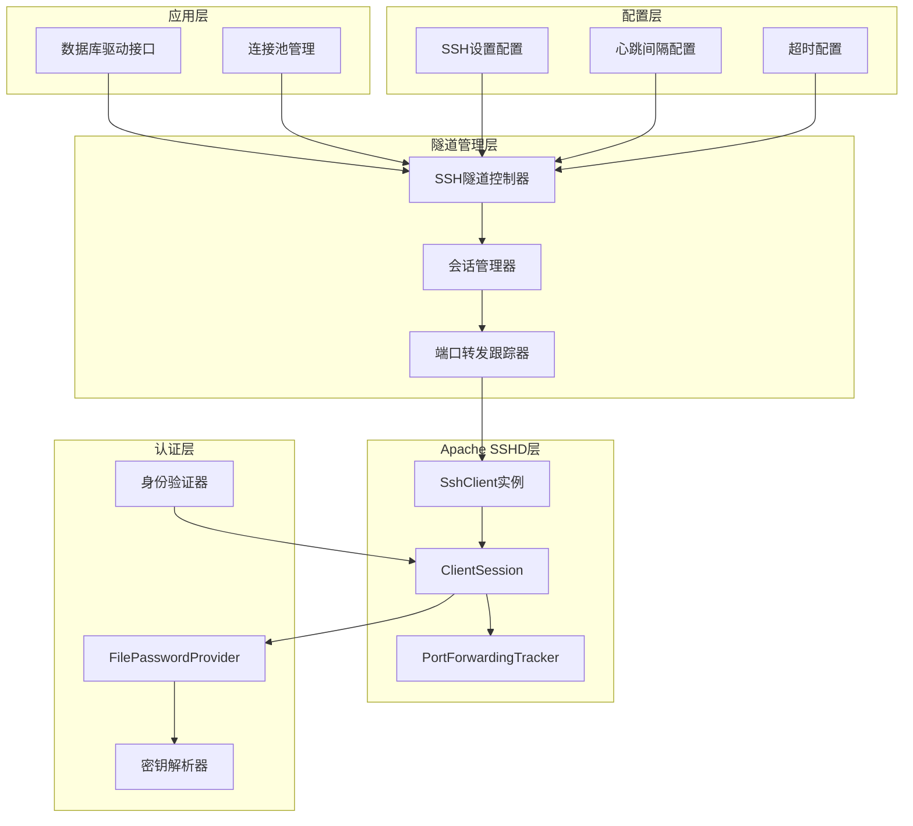
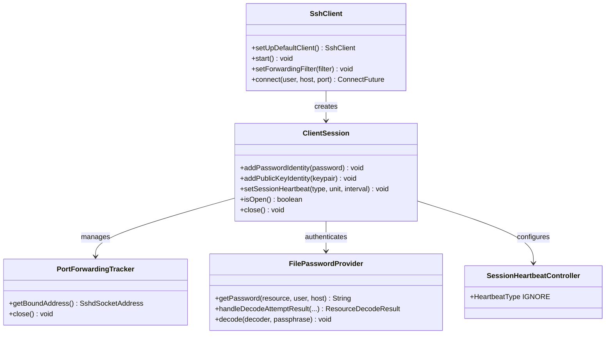
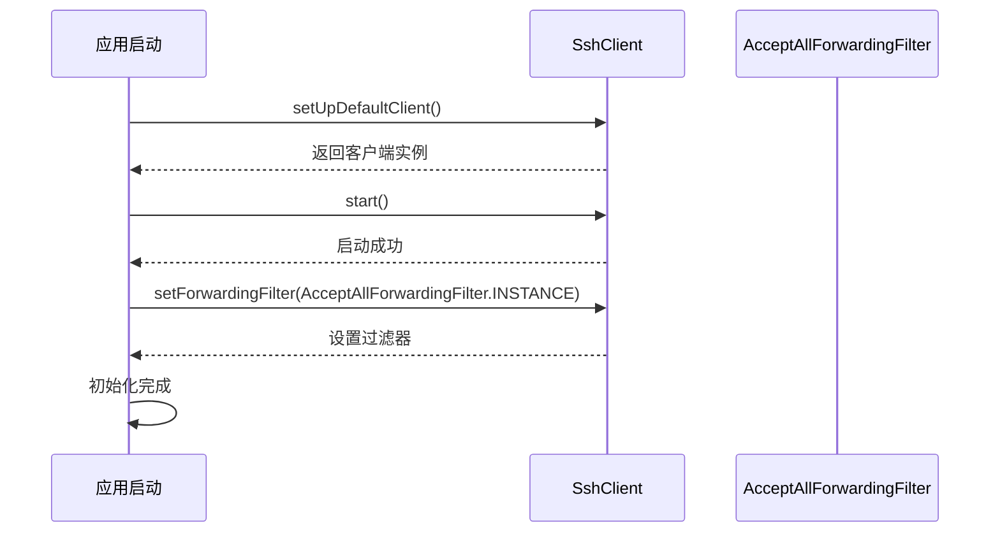
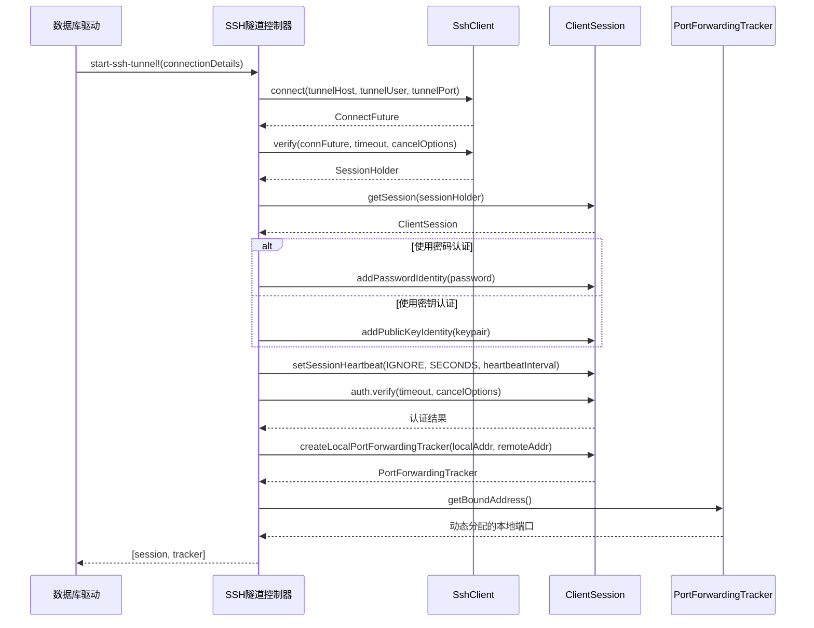
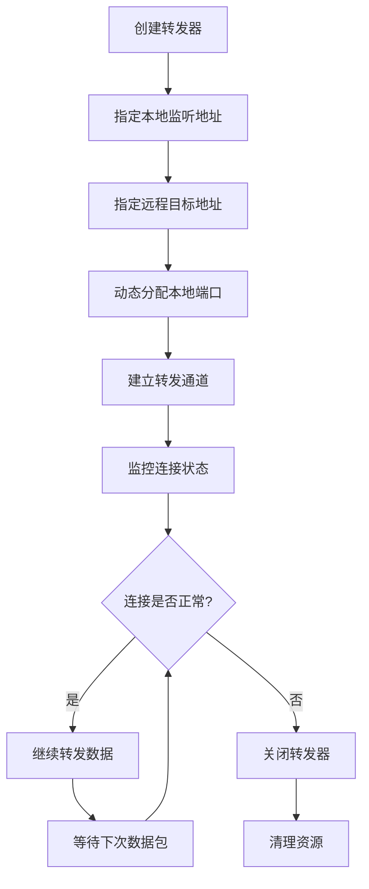
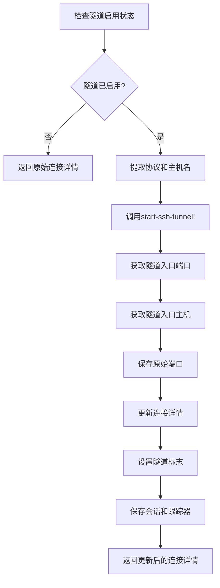
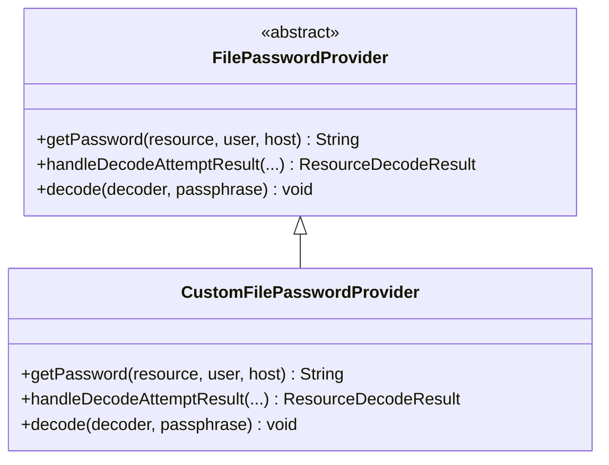
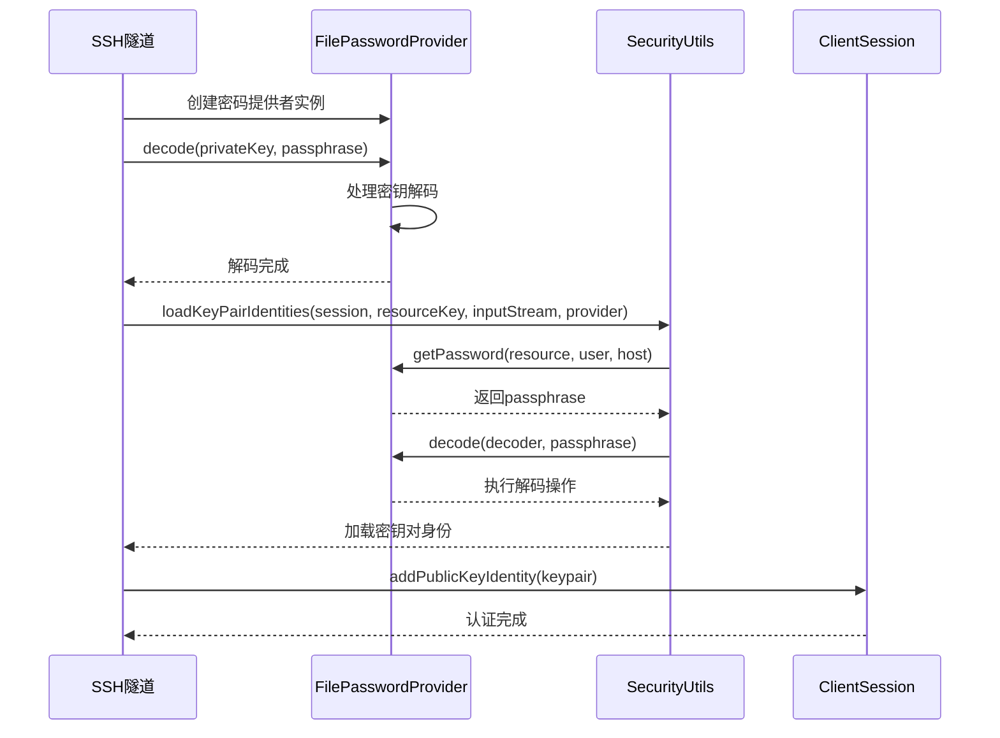
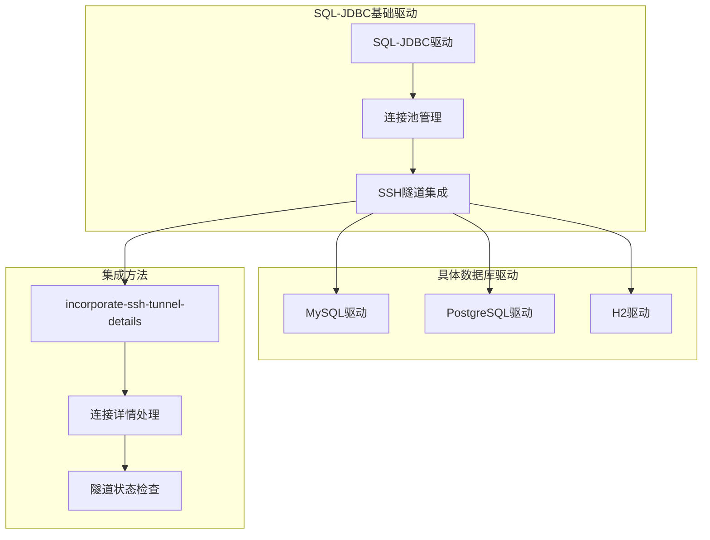
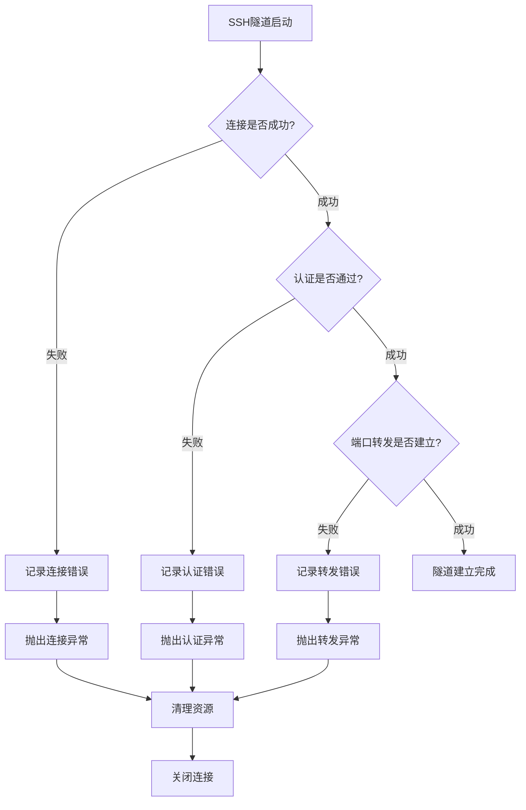

# SSH隧道实现机制技术文档

<cite>
**本文档中引用的文件**
- [ssh_tunnel.clj](file://src/metabase/driver/sql_jdbc/connection/ssh_tunnel.clj)
- [settings.clj](file://src/metabase/driver/settings.clj)
- [connection.clj](file://src/metabase/driver/sql_jdbc/connection.clj)
- [common.clj](file://src/metabase/driver/common.clj)
- [h2.clj](file://src/metabase/driver/h2.clj)
- [mysql.clj](file://src/metabase/driver/mysql.clj)
- [postgres.clj](file://src/metabase/driver/postgres.clj)
</cite>

## 目录
1. [概述](#概述)
2. [系统架构](#系统架构)
3. [核心组件分析](#核心组件分析)
4. [SshClient初始化与配置](#sshclient初始化与配置)
5. [会话建立过程](#会话建立过程)
6. [端口转发跟踪器(PortForwardingTracker)](#端口转发跟踪器portforwardingtracker)
7. [include-ssh-tunnel!函数详解](#include-ssh-tunnel函数详解)
8. [心跳机制(SessionHeartbeatController)](#心跳机制sessionheartbeatcontroller)
9. [私钥解码与身份验证](#私钥解码与身份验证)
10. [驱动程序集成](#驱动程序集成)
11. [错误处理与故障排除](#错误处理与故障排除)
12. [性能考虑](#性能考虑)
13. [总结](#总结)

## 概述

Metabase的SSH隧道实现机制基于Apache SSHD库构建，为JDBC数据仓库提供安全的网络隧道连接功能。该机制允许Metabase通过SSH隧道连接到位于私有网络中的数据库服务器，确保数据传输的安全性和隐私性。

SSH隧道功能支持多种认证方式，包括密码认证和公钥认证，并提供了完善的心跳机制来维持连接的稳定性。整个实现采用分层架构设计，通过多态方法和策略模式实现了对不同数据库驱动的统一支持。

## 系统架构

SSH隧道实现采用模块化架构，主要包含以下层次：

**图表来源**
- [ssh_tunnel.clj](file://src/metabase/driver/sql_jdbc/connection/ssh_tunnel.clj#L1-L33)
- [settings.clj](file://src/metabase/driver/settings.clj#L15-L20)

## 核心组件分析

### 主要类和接口

SSH隧道实现涉及多个关键组件，每个组件承担特定的功能职责：

**图表来源**
- [ssh_tunnel.clj](file://src/metabase/driver/sql_jdbc/connection/ssh_tunnel.clj#L25-L33)
- [ssh_tunnel.clj](file://src/metabase/driver/sql_jdbc/connection/ssh_tunnel.clj#L35-L55)

**节来源**
- [ssh_tunnel.clj](file://src/metabase/driver/sql_jdbc/connection/ssh_tunnel.clj#L1-L33)

## SshClient初始化与配置

### 全局客户端实例

SSH隧道系统维护一个全局的SshClient实例，该实例在整个应用程序生命周期内保持活跃状态：

**图表来源**
- [ssh_tunnel.clj](file://src/metabase/driver/sql_jdbc/connection/ssh_tunnel.clj#L28-L33)

### 配置参数

| 参数名称 | 类型 | 默认值 | 描述 |
|---------|------|--------|------|
| default-ssh-tunnel-port | Integer | 22 | SSH隧道默认端口号 |
| default-ssh-timeout | Long | 30000ms | 连接超时时间 |
| ssh-heartbeat-interval-sec | Integer | 180秒 | 心跳间隔时间 |

**节来源**
- [ssh_tunnel.clj](file://src/metabase/driver/sql_jdbc/connection/ssh_tunnel.clj#L25-L33)
- [settings.clj](file://src/metabase/driver/settings.clj#L15-L20)

## 会话建立过程

### 连接建立流程

SSH会话的建立是一个多步骤的过程，涉及连接、认证和端口转发的协调：

**图表来源**
- [ssh_tunnel.clj](file://src/metabase/driver/sql_jdbc/connection/ssh_tunnel.clj#L58-L100)

### 认证机制

系统支持两种主要的认证方式：

1. **密码认证**: 通过`maybe-add-tunnel-password!`函数添加密码凭据
2. **公钥认证**: 通过`maybe-add-tunnel-private-key!`函数处理私钥认证

**节来源**
- [ssh_tunnel.clj](file://src/metabase/driver/sql_jdbc/connection/ssh_tunnel.clj#L40-L55)

## 端口转发跟踪器(PortForwardingTracker)

### 转发器工作原理

PortForwardingTracker是SSH隧道的核心组件，负责建立本地端口到远程主机的转发连接：

**图表来源**
- [ssh_tunnel.clj](file://src/metabase/driver/sql_jdbc/connection/ssh_tunnel.clj#L89-L92)

### 地址映射机制

转发器使用SshdSocketAddress对象来定义本地和远程地址的映射关系：

- **本地地址**: `SshdSocketAddress.("", 0)` - 监听所有网络接口的动态端口
- **远程地址**: `SshdSocketAddress.(host, port)` - 转发到目标数据库服务器

**节来源**
- [ssh_tunnel.clj](file://src/metabase/driver/sql_jdbc/connection/ssh_tunnel.clj#L89-L92)

## include-ssh-tunnel!函数详解

### 函数核心逻辑

`include-ssh-tunnel!`函数是SSH隧道实现的关键入口点，负责修改连接详情以重定向流量到本地隧道端口：

**图表来源**
- [ssh_tunnel.clj](file://src/metabase/driver/sql_jdbc/connection/ssh_tunnel.clj#L96-L115)

### 连接详情修改机制

该函数通过以下步骤修改连接详情：

1. **协议保留**: 对于包含协议前缀的主机名（如`https://host`），保留协议部分
2. **主机名转换**: 将目标主机名转换为`localhost`，强制通过本地隧道连接
3. **端口重定向**: 将原始端口替换为动态分配的隧道入口端口
4. **状态跟踪**: 保存隧道会话和跟踪器对象用于后续管理

**节来源**
- [ssh_tunnel.clj](file://src/metabase/driver/sql_jdbc/connection/ssh_tunnel.clj#L96-L115)

## 心跳机制(SessionHeartbeatController)

### 心跳配置

SSH隧道使用SessionHeartbeatController来维持连接的活跃状态，防止因网络空闲而导致的连接中断：

**图表来源**
- [ssh_tunnel.clj](file://src/metabase/driver/sql_jdbc/connection/ssh_tunnel.clj#L76-L78)
- [settings.clj](file://src/metabase/driver/settings.clj#L15-L20)

### 心跳作用机制

心跳机制的主要作用包括：

1. **连接保活**: 定期发送心跳包防止中间设备断开空闲连接
2. **网络检测**: 通过心跳响应检测网络连通性
3. **资源管理**: 及时发现并清理失效的连接

**节来源**
- [ssh_tunnel.clj](file://src/metabase/driver/sql_jdbc/connection/ssh_tunnel.clj#L76-L78)
- [settings.clj](file://src/metabase/driver/settings.clj#L15-L20)

## 私钥解码与身份验证

### FilePasswordProvider实现

私钥解码通过自定义的FilePasswordProvider类实现，该类扩展了Apache SSHD的FilePasswordProvider接口：

**图表来源**
- [ssh_tunnel.clj](file://src/metabase/driver/sql_jdbc/connection/ssh_tunnel.clj#L42-L50)

### 密钥认证流程

私钥认证的完整流程如下：

**图表来源**
- [ssh_tunnel.clj](file://src/metabase/driver/sql_jdbc/connection/ssh_tunnel.clj#L42-L55)

### 密钥格式支持

系统支持多种私钥格式：

- **PKCS#8格式**: 现代标准私钥格式
- **PKCS#1格式**: 传统RSA私钥格式  
- **OpenSSH格式**: OpenSSH兼容的私钥格式

**节来源**
- [ssh_tunnel.clj](file://src/metabase/driver/sql_jdbc/connection/ssh_tunnel.clj#L42-L55)

## 驱动程序集成

### 多驱动支持策略

SSH隧道功能通过多态方法实现了对不同数据库驱动的统一支持：

**图表来源**
- [ssh_tunnel.clj](file://src/metabase/driver/sql_jdbc/connection/ssh_tunnel.clj#L117-L130)
- [h2.clj](file://src/metabase/driver/h2.clj#L580-L590)

### 驱动特定实现

不同数据库驱动通过各自的`incorporate-ssh-tunnel-details`方法实现SSH隧道集成：

| 驱动类型 | 实现位置 | 特殊处理 |
|---------|----------|----------|
| SQL-JDBC | ssh_tunnel.clj | 基础SSH隧道逻辑 |
| H2 | h2.clj | TCP协议检查 |
| MySQL | mysql.clj | 协议兼容性处理 |
| PostgreSQL | postgres.clj | SSL配置支持 |

**节来源**
- [ssh_tunnel.clj](file://src/metabase/driver/sql_jdbc/connection/ssh_tunnel.clj#L117-L130)
- [h2.clj](file://src/metabase/driver/h2.clj#L580-L590)

## 错误处理与故障排除

### 常见错误场景

SSH隧道实现包含完善的错误处理机制：

### 故障排除指南

| 错误类型 | 可能原因 | 解决方案 |
|---------|----------|----------|
| 连接超时 | 网络不通或SSH服务不可达 | 检查网络连接和SSH服务状态 |
| 认证失败 | 用户名密码错误或密钥无效 | 验证认证凭据正确性 |
| 端口转发失败 | 目标端口被占用或权限不足 | 检查目标端口可用性和防火墙规则 |
| 心跳超时 | 网络不稳定或中间设备断开空闲连接 | 调整心跳间隔或优化网络配置 |

## 性能考虑

### 连接池管理

SSH隧道与连接池管理系统紧密集成，通过以下机制优化性能：

1. **延迟初始化**: 隧道连接仅在实际需要时建立
2. **连接复用**: 同一数据库的多次查询共享隧道连接
3. **自动清理**: 空闲连接自动关闭以释放资源

### 内存使用优化

- **流式处理**: 大数据量传输采用流式处理避免内存溢出
- **缓冲区管理**: 合理配置缓冲区大小平衡性能和内存使用
- **资源回收**: 及时释放不再使用的隧道资源

### 网络优化

- **压缩传输**: 支持数据压缩减少网络带宽使用
- **批量操作**: 批量执行数据库操作提高网络效率
- **连接复用**: 复用SSH连接减少握手开销

## 总结

Metabase的SSH隧道实现机制是一个功能完整、设计精良的网络安全解决方案。通过基于Apache SSHD库的实现，系统提供了：

1. **安全性**: 通过加密隧道保护数据传输安全
2. **灵活性**: 支持多种认证方式和配置选项
3. **可靠性**: 完善的心跳机制和错误处理
4. **可扩展性**: 模块化设计支持多种数据库驱动
5. **易用性**: 简化的配置界面和自动化管理

该实现充分体现了现代软件架构的最佳实践，为用户提供了既安全又便捷的数据仓库连接方式。通过持续的优化和改进，SSH隧道功能将继续为Metabase用户提供可靠的服务保障。