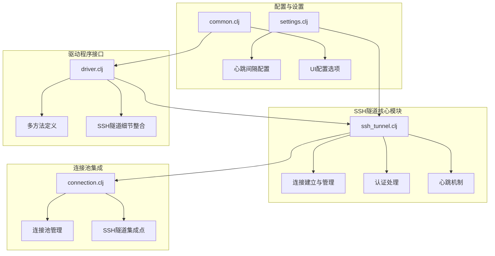
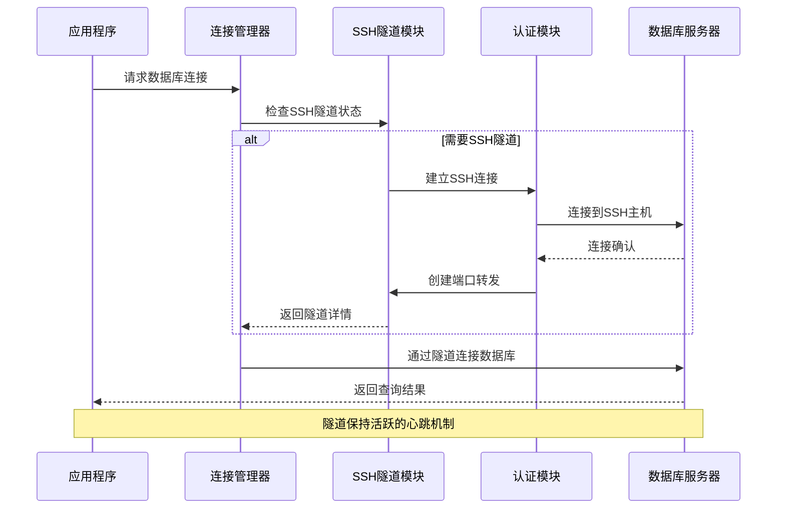
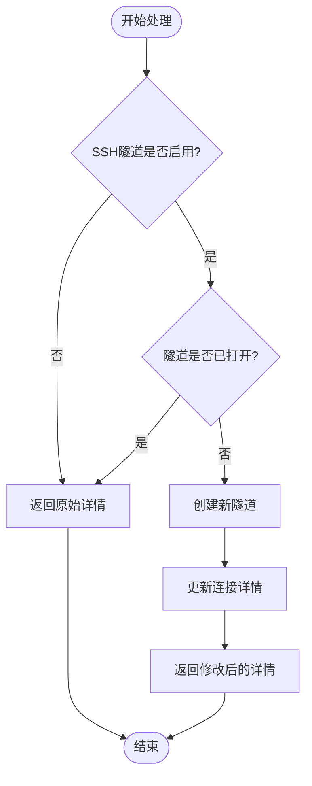
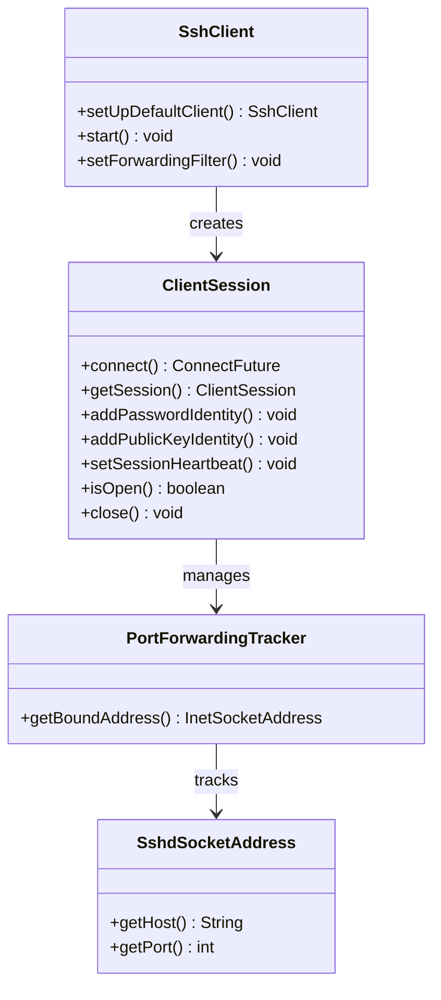
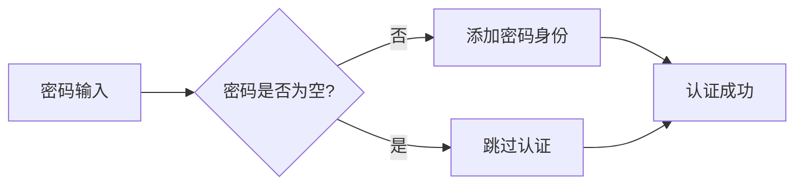
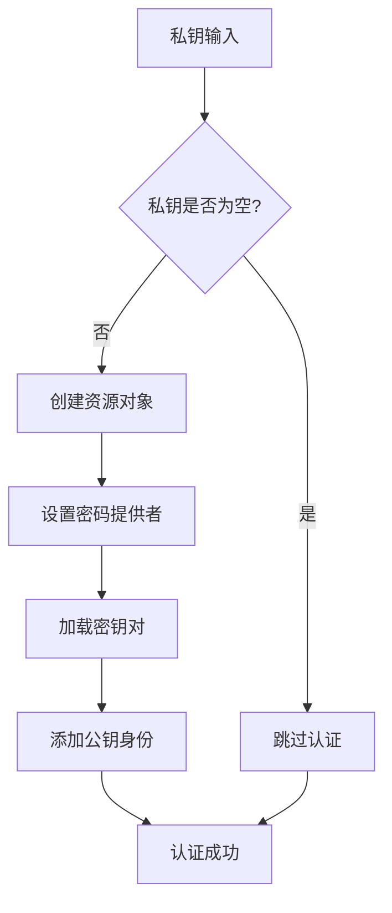
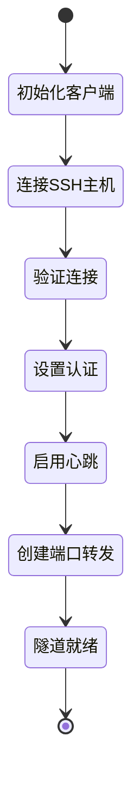
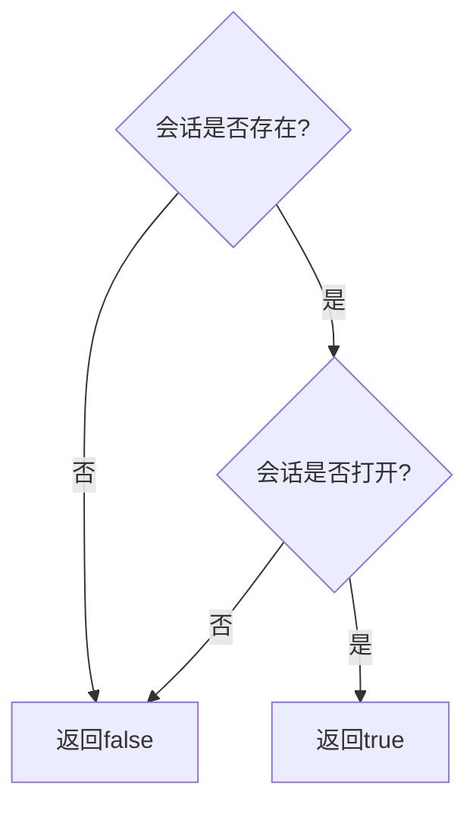
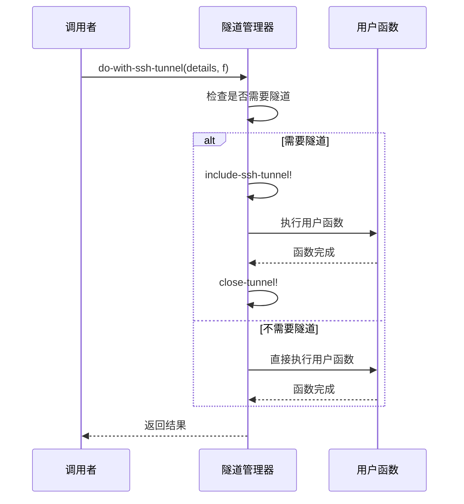
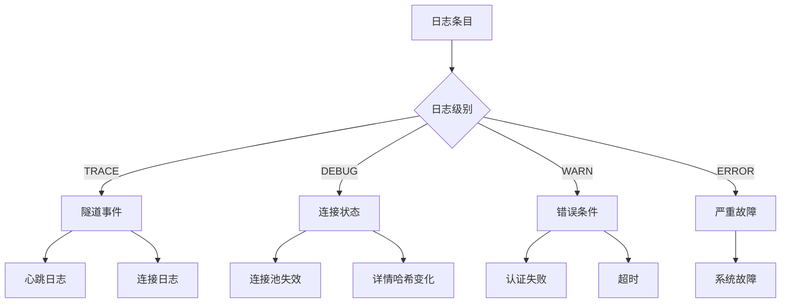

# SSH隧道支持

<cite>
**本文档中引用的文件**
- [ssh_tunnel.clj](file://src/metabase/driver/sql_jdbc/connection/ssh_tunnel.clj)
- [connection.clj](file://src/metabase/driver/sql_jdbc/connection.clj)
- [driver.clj](file://src/metabase/driver.clj)
- [common.clj](file://src/metabase/driver/common.clj)
- [settings.clj](file://src/metabase/driver/settings.clj)
- [util.clj](file://src/metabase/driver/util.clj)
</cite>

## 目录
1. [简介](#简介)
2. [项目结构](#项目结构)
3. [核心组件](#核心组件)
4. [架构概览](#架构概览)
5. [详细组件分析](#详细组件分析)
6. [SSH隧道生命周期管理](#ssh隧道生命周期管理)
7. [配置与设置](#配置与设置)
8. [故障排除指南](#故障排除指南)
9. [最佳实践](#最佳实践)
10. [结论](#结论)

## 简介

Metabase的SSH隧道支持功能为通过SSH安全通道连接到远程数据库提供了强大的基础设施。该功能允许Metabase在不直接暴露数据库的情况下安全地访问位于防火墙后的数据库服务器。SSH隧道支持是基于Apache Mina SSHD库构建的，提供了密码认证和密钥认证两种方式。

SSH隧道支持的核心价值在于：
- 提供安全的数据库连接通道
- 支持多种认证方式（密码和私钥）
- 实现自动的心跳机制保持连接活跃
- 提供完整的隧道生命周期管理
- 集成到Metabase的连接池系统中

## 项目结构

SSH隧道支持功能主要分布在以下关键文件中：

**图表来源**
- [ssh_tunnel.clj](file://src/metabase/driver/sql_jdbc/connection/ssh_tunnel.clj#L1-L163)
- [connection.clj](file://src/metabase/driver/sql_jdbc/connection.clj#L1-L383)
- [driver.clj](file://src/metabase/driver.clj#L1060-L1070)

**章节来源**
- [ssh_tunnel.clj](file://src/metabase/driver/sql_jdbc/connection/ssh_tunnel.clj#L1-L163)
- [connection.clj](file://src/metabase/driver/sql_jdbc/connection.clj#L1-L383)

## 核心组件

SSH隧道支持系统包含以下核心组件：

### SSH客户端管理器
负责管理全局SSH客户端实例，包括客户端初始化、启动和过滤器配置。

### 认证处理器
提供密码认证和公钥认证两种认证方式，支持Passphrase保护的私钥。

### 连接建立器
负责建立SSH连接并创建端口转发隧道，动态分配入口端口。

### 心跳控制器
实现定期心跳机制，确保隧道连接的稳定性。

### 生命周期管理器
提供隧道的创建、验证、关闭等完整生命周期管理功能。

**章节来源**
- [ssh_tunnel.clj](file://src/metabase/driver/sql_jdbc/connection/ssh_tunnel.clj#L25-L35)
- [ssh_tunnel.clj](file://src/metabase/driver/sql_jdbc/connection/ssh_tunnel.clj#L40-L80)

## 架构概览

SSH隧道支持采用分层架构设计，确保了功能的模块化和可扩展性：

**图表来源**
- [connection.clj](file://src/metabase/driver/sql_jdbc/connection.clj#L188-L200)
- [ssh_tunnel.clj](file://src/metabase/driver/sql_jdbc/connection/ssh_tunnel.clj#L56-L85)

## 详细组件分析

### incorporate-ssh-tunnel-details函数分析

`incorporate-ssh-tunnel-details`函数是SSH隧道支持的核心多方法，负责将SSH隧道信息整合到数据库连接详情中：

**图表来源**
- [ssh_tunnel.clj](file://src/metabase/driver/sql_jdbc/connection/ssh_tunnel.clj#L118-L130)

该函数的实现逻辑体现了SSH隧道的状态管理策略：
- 如果SSH隧道未启用，则直接返回原始连接详情
- 如果SSH隧道已打开但连接异常，则标记连接池无效并重新创建
- 如果SSH隧道未打开，则调用`include-ssh-tunnel!`创建新的隧道连接

**章节来源**
- [ssh_tunnel.clj](file://src/metabase/driver/sql_jdbc/connection/ssh_tunnel.clj#L118-L130)

### SSH隧道连接建立流程

SSH隧道的连接建立是一个复杂的多步骤过程：

**图表来源**
- [ssh_tunnel.clj](file://src/metabase/driver/sql_jdbc/connection/ssh_tunnel.clj#L25-L35)
- [ssh_tunnel.clj](file://src/metabase/driver/sql_jdbc/connection/ssh_tunnel.clj#L56-L85)

**章节来源**
- [ssh_tunnel.clj](file://src/metabase/driver/sql_jdbc/connection/ssh_tunnel.clj#L56-L85)

### 认证机制实现

SSH隧道支持两种认证方式：

#### 密码认证
通过`maybe-add-tunnel-password!`函数实现，直接添加密码身份验证：

**图表来源**
- [ssh_tunnel.clj](file://src/metabase/driver/sql_jdbc/connection/ssh_tunnel.clj#L40-L45)

#### 公钥认证
通过`maybe-add-tunnel-private-key!`函数实现，支持Passphrase保护的私钥：

**图表来源**
- [ssh_tunnel.clj](file://src/metabase/driver/sql_jdbc/connection/ssh_tunnel.clj#L46-L65)

**章节来源**
- [ssh_tunnel.clj](file://src/metabase/driver/sql_jdbc/connection/ssh_tunnel.clj#L40-L65)

## SSH隧道生命周期管理

SSH隧道的生命周期管理包括创建、验证、使用和关闭四个阶段：

### 隧道创建阶段

**图表来源**
- [ssh_tunnel.clj](file://src/metabase/driver/sql_jdbc/connection/ssh_tunnel.clj#L56-L85)

### 隧道验证阶段

隧道验证通过`ssh-tunnel-open?`函数检查连接状态：

**图表来源**
- [ssh_tunnel.clj](file://src/metabase/driver/sql_jdbc/connection/ssh_tunnel.clj#L86-L90)

### 隧道使用阶段

在使用阶段，SSH隧道通过`do-with-ssh-tunnel`函数提供临时性的隧道使用：

**图表来源**
- [ssh_tunnel.clj](file://src/metabase/driver/sql_jdbc/connection/ssh_tunnel.clj#L131-L150)

### 隧道关闭阶段

隧道关闭通过`close-tunnel!`函数实现，确保资源正确释放：

**章节来源**
- [ssh_tunnel.clj](file://src/metabase/driver/sql_jdbc/connection/ssh_tunnel.clj#L131-L150)
- [ssh_tunnel.clj](file://src/metabase/driver/sql_jdbc/connection/ssh_tunnel.clj#L131-L140)

## 配置与设置

### SSH心跳间隔配置

SSH隧道支持通过`ssh-heartbeat-interval-sec`设置控制心跳发送频率：

| 配置项 | 类型 | 默认值 | 描述 |
|--------|------|--------|------|
| ssh-heartbeat-interval-sec | integer | 180 | SSH隧道建立时的心跳发送间隔（秒） |

### 连接超时配置

| 配置项 | 类型 | 默认值 | 描述 |
|--------|------|--------|------|
| default-ssh-timeout | long | 30000 | SSH连接超时时间（毫秒） |

### 数据库连接配置

SSH隧道配置通过数据库连接详情中的特定字段实现：

| 字段名 | 类型 | 必需 | 描述 |
|--------|------|------|------|
| tunnel-enabled | boolean | 是 | 是否启用SSH隧道 |
| tunnel-host | string | 是 | SSH隧道主机地址 |
| tunnel-port | integer | 否 | SSH隧道端口，默认22 |
| tunnel-user | string | 是 | SSH隧道用户名 |
| tunnel-auth-option | string | 是 | 认证方式：ssh-key或password |
| tunnel-pass | string | 可选 | SSH隧道密码 |
| tunnel-private-key | string | 可选 | SSH私钥内容 |
| tunnel-private-key-passphrase | string | 可选 | 私钥Passphrase |

**章节来源**
- [settings.clj](file://src/metabase/driver/settings.clj#L14-L18)
- [ssh_tunnel.clj](file://src/metabase/driver/sql_jdbc/connection/ssh_tunnel.clj#L25-L30)
- [common.clj](file://src/metabase/driver/common.clj#L92-L123)

## 故障排除指南

### 常见连接问题及解决方案

#### SSH隧道认证失败

**错误症状**：无法连接到SSH隧道主机，提示认证失败

**可能原因**：
- SSH用户名或密码错误
- 私钥格式不正确
- Passphrase错误
- SSH服务未运行

**解决方案**：
1. 验证SSH用户名和密码的正确性
2. 检查私钥格式是否符合OpenSSH标准
3. 确认Passphrase输入正确
4. 测试直接SSH连接到隧道主机

#### 连接超时问题

**错误症状**：SSH连接建立超时

**可能原因**：
- 网络连接不稳定
- 防火墙阻止SSH连接
- SSH服务响应慢

**解决方案**：
1. 增加连接超时时间设置
2. 检查网络连通性
3. 验证防火墙规则
4. 联系网络管理员

#### 隧道端口冲突

**错误症状**：隧道创建失败，提示端口已被占用

**解决方案**：
1. 使用不同的本地端口
2. 检查是否有其他进程占用端口
3. 重启SSH客户端

### 日志分析指南

SSH隧道相关的日志信息包括：

**图表来源**
- [connection.clj](file://src/metabase/driver/sql_jdbc/connection.clj#L300-L320)
- [util.clj](file://src/metabase/driver/util.clj#L35-L60)

### 错误消息映射表

| 错误类型 | 用户消息 | 解决方案 |
|----------|----------|----------|
| ssh-tunnel-auth-fail | "我们无法连接到SSH隧道主机，请检查用户名和密码" | 验证SSH凭据 |
| ssh-tunnel-connection-fail | "我们无法连接到SSH隧道主机，请检查主机和端口设置" | 检查网络连接 |
| cannot-connect-check-host-and-port | "我们无法连接到数据库，请确保主机和端口设置正确" | 验证数据库连接参数 |

**章节来源**
- [util.clj](file://src/metabase/driver/util.clj#L35-L60)

## 最佳实践

### 安全配置建议

1. **优先使用密钥认证**：相比密码认证，密钥认证更加安全
2. **定期轮换私钥**：建议每6个月轮换一次SSH私钥
3. **限制密钥权限**：使用最小权限原则配置SSH密钥
4. **监控连接活动**：定期检查SSH连接日志

### 性能优化建议

1. **合理设置心跳间隔**：根据网络环境调整心跳间隔
2. **优化连接池配置**：适当增加连接池大小
3. **使用Keep-Alive机制**：启用TCP Keep-Alive防止连接被中间设备断开

### 运维管理建议

1. **建立监控告警**：监控SSH隧道连接状态
2. **定期健康检查**：定期测试SSH隧道连接
3. **备份配置信息**：备份重要的SSH配置信息
4. **文档化配置**：维护详细的SSH隧道配置文档

### 开发调试建议

1. **启用详细日志**：开发环境中启用TRACE级别日志
2. **使用测试环境**：在隔离环境中测试SSH隧道配置
3. **模拟网络故障**：测试网络中断情况下的恢复能力
4. **性能基准测试**：评估SSH隧道对查询性能的影响

## 结论

Metabase的SSH隧道支持功能提供了一个强大而灵活的安全数据库连接解决方案。通过深入理解其实现机制、配置选项和最佳实践，可以有效地利用这一功能来保护数据安全，同时确保系统的稳定性和性能。

关键要点总结：
- SSH隧道支持基于Apache Mina SSHD库构建，提供可靠的连接基础
- 支持多种认证方式，满足不同安全需求
- 实现了完整的生命周期管理，包括创建、验证、使用和关闭
- 提供了丰富的配置选项和故障排除工具
- 遵循最佳实践可以确保系统的安全性和稳定性

通过合理配置和使用SSH隧道支持功能，组织可以在保证数据安全的前提下，充分利用Metabase的强大数据分析能力。