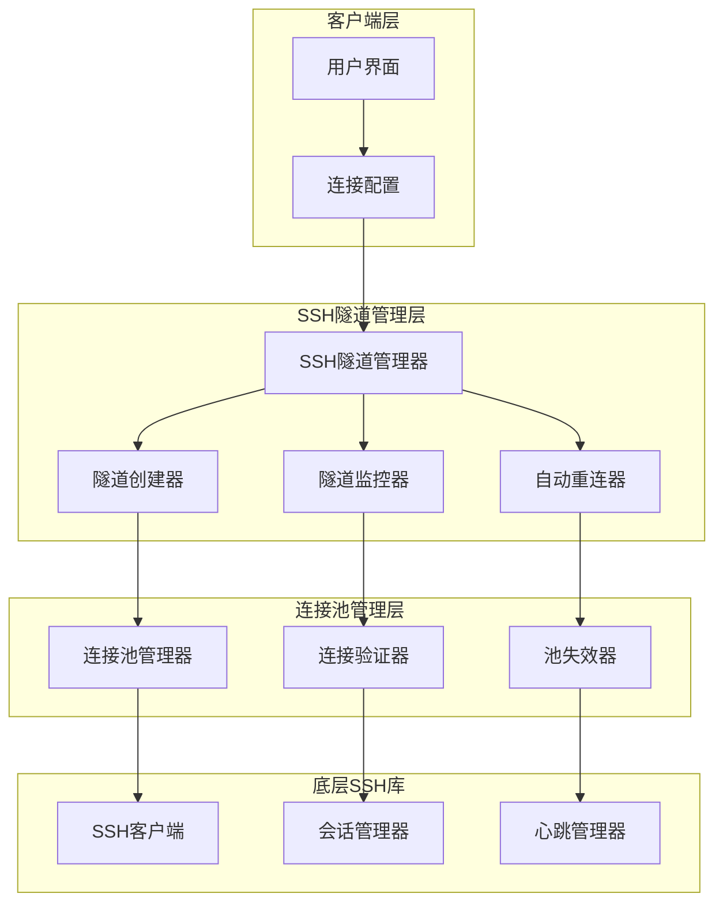
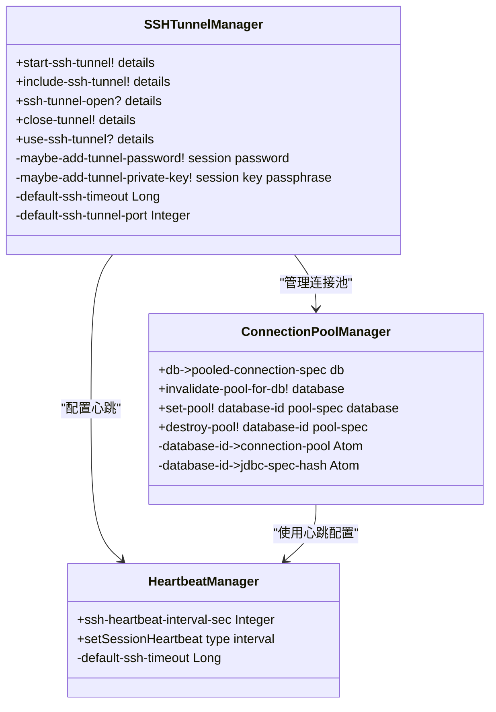
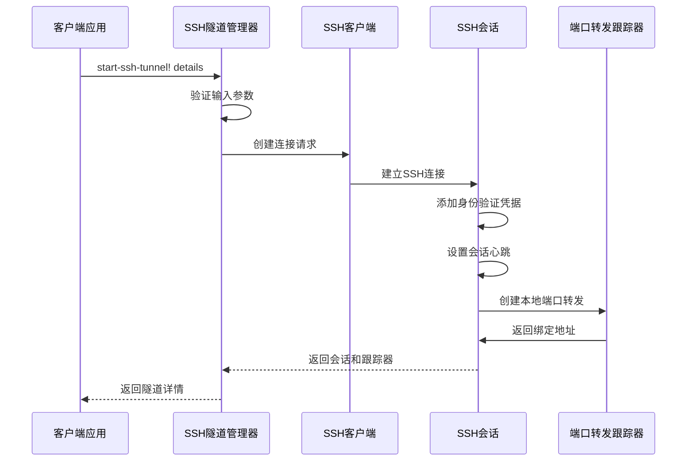
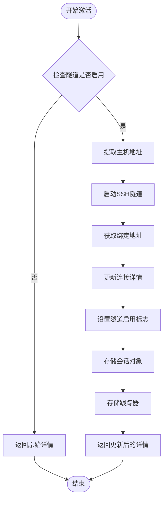
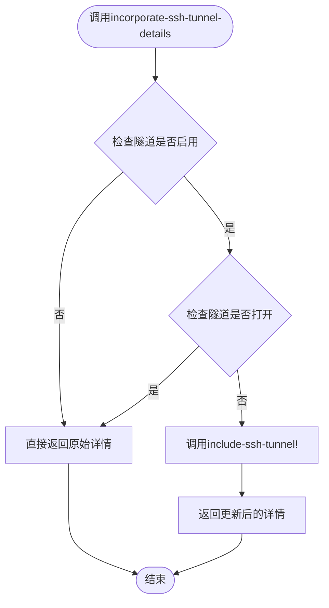
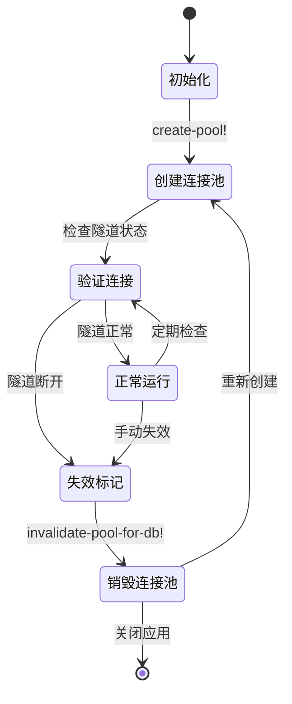
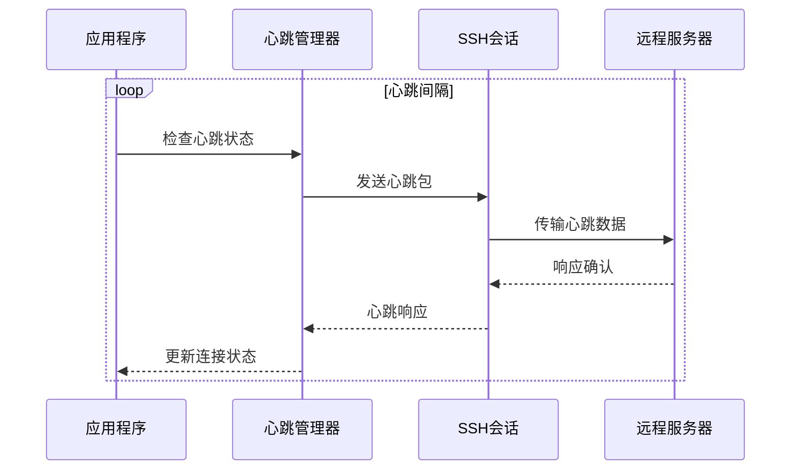
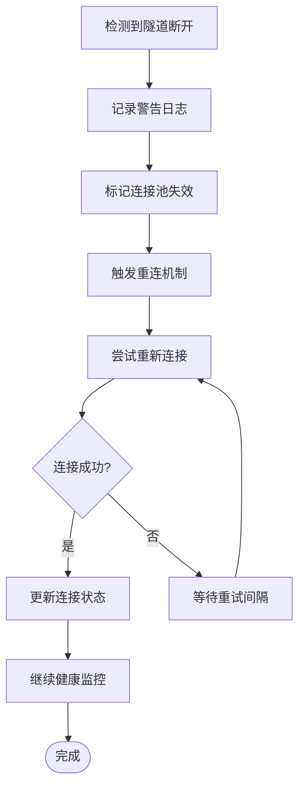
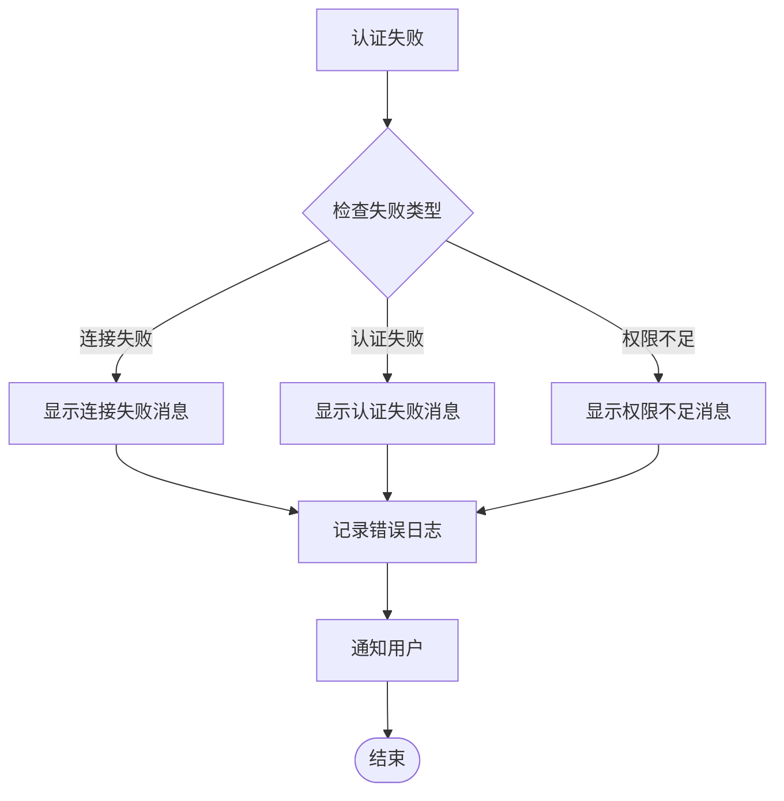

# SSH隧道生命周期管理

<cite>
**本文档引用的文件**
- [ssh_tunnel.clj](file://src/metabase/driver/sql_jdbc/connection/ssh_tunnel.clj)
- [connection.clj](file://src/metabase/driver/sql_jdbc/connection.clj)
- [driver.clj](file://src/metabase/driver.clj)
- [settings.clj](file://src/metabase/driver/settings.clj)
- [common.clj](file://src/metabase/driver/common.clj)
- [util.clj](file://src/metabase/driver/util.clj)
</cite>

## 目录
1. [概述](#概述)
2. [系统架构](#系统架构)
3. [核心组件分析](#核心组件分析)
4. [生命周期管理](#生命周期管理)
5. [多态方法集成](#多态方法集成)
6. [连接池管理](#连接池管理)
7. [监控与重连机制](#监控与重连机制)
8. [调试日志分析](#调试日志分析)
9. [异常处理策略](#异常处理策略)
10. [最佳实践](#最佳实践)

## 概述

Metabase的SSH隧道生命周期管理系统为JDBC驱动程序提供了安全的数据库连接通道。该系统通过Apache MINA SSHD库实现SSH隧道的创建、维护和销毁，确保数据传输的安全性和可靠性。系统支持多种认证方式（密码和私钥），并具备自动重连和状态监控能力。

## 系统架构

**图表来源**
- [ssh_tunnel.clj](file://src/metabase/driver/sql_jdbc/connection/ssh_tunnel.clj#L1-L163)
- [connection.clj](file://src/metabase/driver/sql_jdbc/connection.clj#L1-L383)

## 核心组件分析

### SSH隧道管理器

SSH隧道管理器是整个系统的核心协调组件，负责管理SSH隧道的完整生命周期。

**图表来源**
- [ssh_tunnel.clj](file://src/metabase/driver/sql_jdbc/connection/ssh_tunnel.clj#L56-L161)
- [connection.clj](file://src/metabase/driver/sql_jdbc/connection.clj#L224-L273)

**章节来源**
- [ssh_tunnel.clj](file://src/metabase/driver/sql_jdbc/connection/ssh_tunnel.clj#L1-L163)
- [connection.clj](file://src/metabase/driver/sql_jdbc/connection.clj#L1-L383)

### 连接配置结构

SSH隧道的配置信息通过数据库连接详情传递，包含以下关键字段：

| 配置项 | 类型 | 描述 | 默认值 |
|--------|------|------|--------|
| `tunnel-enabled` | Boolean | 是否启用SSH隧道 | false |
| `tunnel-host` | String | SSH隧道主机地址 | 必填 |
| `tunnel-port` | Integer | SSH隧道端口 | 22 |
| `tunnel-user` | String | SSH用户名 | 必填 |
| `tunnel-pass` | String | SSH密码（可选） | 可选 |
| `tunnel-private-key` | String | SSH私钥内容 | 必填（密钥认证时） |
| `tunnel-private-key-passphrase` | String | 私钥密码短语 | 可选 |
| `tunnel-session` | ClientSession | SSH会话对象 | 动态生成 |
| `tunnel-tracker` | PortForwardingTracker | 端口转发跟踪器 | 动态生成 |
| `tunnel-entrance-port` | Integer | 隧道入口端口 | 动态分配 |
| `tunnel-entrance-host` | String | 隧道入口主机 | 动态分配 |

**章节来源**
- [common.clj](file://src/metabase/driver/common.clj#L80-L123)

## 生命周期管理

### 隧道创建阶段（start-ssh-tunnel!）

隧道创建过程是一个复杂的多步骤操作，涉及连接建立、身份验证和端口转发配置。

**图表来源**
- [ssh_tunnel.clj](file://src/metabase/driver/sql_jdbc/connection/ssh_tunnel.clj#L56-L100)

### 隧道激活阶段（include-ssh-tunnel!）

隧道激活过程更新数据库连接详情，将原始目标地址转换为本地隧道入口地址。

**图表来源**
- [ssh_tunnel.clj](file://src/metabase/driver/sql_jdbc/connection/ssh_tunnel.clj#L96-L115)

### 状态检查阶段（ssh-tunnel-open?）

状态检查通过验证SSH会话的打开状态来确定隧道是否正常工作。

**章节来源**
- [ssh_tunnel.clj](file://src/metabase/driver/sql_jdbc/connection/ssh_tunnel.clj#L90-L100)

### 隧道关闭阶段（close-tunnel!）

隧道关闭过程确保所有资源得到正确释放，并记录详细的关闭日志。

**章节来源**
- [ssh_tunnel.clj](file://src/metabase/driver/sql_jdbc/connection/ssh_tunnel.clj#L133-L142)

## 多态方法集成

### incorporate-ssh-tunnel-details方法

`incorporate-ssh-tunnel-details`是一个多态方法，根据不同的驱动类型执行相应的隧道集成逻辑。

**图表来源**
- [ssh_tunnel.clj](file://src/metabase/driver/sql_jdbc/connection/ssh_tunnel.clj#L118-L131)

**章节来源**
- [ssh_tunnel.clj](file://src/metabase/driver/sql_jdbc/connection/ssh_tunnel.clj#L118-L131)
- [driver.clj](file://src/metabase/driver.clj#L1065-L1070)

## 连接池管理

### 连接池生命周期

连接池管理器负责维护SSH隧道连接池的完整生命周期，包括创建、验证、失效和销毁。

**图表来源**
- [connection.clj](file://src/metabase/driver/sql_jdbc/connection.clj#L224-L273)

### 连接池状态监控

连接池管理器实现了多层次的状态监控机制：

| 监控项目 | 检查频率 | 触发条件 | 处理动作 |
|----------|----------|----------|----------|
| 数据库详情哈希 | 实时 | 哈希值变化 | 失效连接池 |
| 密码过期时间 | 实时 | 密码过期 | 失效连接池 |
| SSH隧道状态 | 实时 | 隧道断开 | 失效连接池 |
| 连接超时 | 实时 | 查询超时 | 记录警告日志 |
| 心跳检测 | 定期 | 心跳失败 | 标记需要重连 |

**章节来源**
- [connection.clj](file://src/metabase/driver/sql_jdbc/connection.clj#L274-L314)

## 监控与重连机制

### 心跳机制

SSH隧道的心跳机制通过Apache MINA SSHD库的会话心跳控制器实现，确保连接的活跃性。

**图表来源**
- [ssh_tunnel.clj](file://src/metabase/driver/sql_jdbc/connection/ssh_tunnel.clj#L74-L76)

### 自动重连策略

当检测到SSH隧道断开时，系统会自动触发重连机制：

**图表来源**
- [connection.clj](file://src/metabase/driver/sql_jdbc/connection.clj#L245-L250)

**章节来源**
- [settings.clj](file://src/metabase/driver/settings.clj#L10-L15)
- [connection.clj](file://src/metabase/driver/sql_jdbc/connection.clj#L245-L250)

## 调试日志分析

### 日志级别配置

SSH隧道系统的日志记录采用分级策略，支持不同级别的调试信息输出：

| 日志级别 | 使用场景 | 示例消息 |
|----------|----------|----------|
| TRACE | 详细执行流程 | "creating ssh tunnel (heartbeating every 180 seconds) user@host:22 -L 12345:host:port" |
| DEBUG | 连接池操作 | "Creating new connection pool for postgres database 123 ..." |
| WARN | 异常情况 | "ssh tunnel for database 123 looks closed; marking pool invalid to reopen it" |
| ERROR | 严重错误 | "Failed to perform action" |

### 关键调试点

系统在以下关键节点记录详细日志：

1. **隧道创建阶段**：记录心跳间隔、认证方式和端口映射信息
2. **连接验证阶段**：记录连接状态和认证结果
3. **重连尝试阶段**：记录重试次数和失败原因
4. **资源清理阶段**：记录会话关闭和资源释放情况

**章节来源**
- [ssh_tunnel.clj](file://src/metabase/driver/sql_jdbc/connection/ssh_tunnel.clj#L74-L76)
- [ssh_tunnel.clj](file://src/metabase/driver/sql_jdbc/connection/ssh_tunnel.clj#L136-L142)

## 异常处理策略

### 认证失败处理

系统针对不同的认证失败场景提供专门的错误处理：

**图表来源**
- [util.clj](file://src/metabase/driver/util.clj#L35-L60)

### 超时处理

SSH隧道连接设置了默认超时时间为30秒，超过此时间将触发超时处理：

| 超时类型 | 默认值 | 处理策略 |
|----------|--------|----------|
| 连接超时 | 30秒 | 重试连接或报告失败 |
| 认证超时 | 30秒 | 切换认证方式或报告失败 |
| 心跳超时 | 180秒 | 标记连接不健康 |

**章节来源**
- [ssh_tunnel.clj](file://src/metabase/driver/sql_jdbc/connection/ssh_tunnel.clj#L29-L30)
- [util.clj](file://src/metabase/driver/util.clj#L35-L91)

## 最佳实践

### 配置建议

1. **认证方式选择**：
   - 生产环境推荐使用SSH密钥认证
   - 密钥认证提供更高的安全性
   - 密码认证适用于临时测试环境

2. **心跳间隔配置**：
   - 默认180秒适合大多数场景
   - 高延迟网络可适当增加间隔
   - 对实时性要求高的场景可减少间隔

3. **连接池大小**：
   - 根据并发查询量调整最大连接数
   - 监控连接池使用率避免资源耗尽

### 监控指标

建议监控以下关键指标以确保SSH隧道的稳定运行：

- 隧道连接成功率
- 平均连接建立时间
- 心跳丢失率
- 连接池命中率
- 重连频率

### 故障排除

当遇到SSH隧道问题时，可以按照以下步骤进行排查：

1. 检查网络连通性
2. 验证SSH服务状态
3. 确认认证凭据有效性
4. 查看系统日志信息
5. 监控资源使用情况

**章节来源**
- [settings.clj](file://src/metabase/driver/settings.clj#L10-L15)
- [common.clj](file://src/metabase/driver/common.clj#L80-L123)