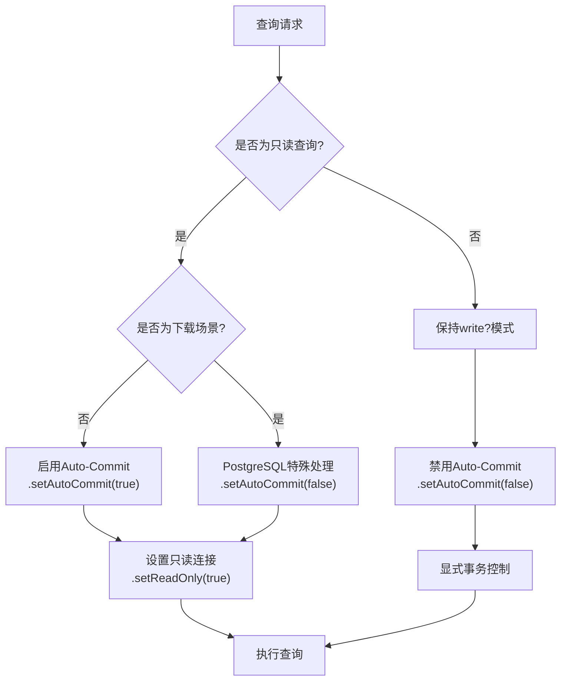
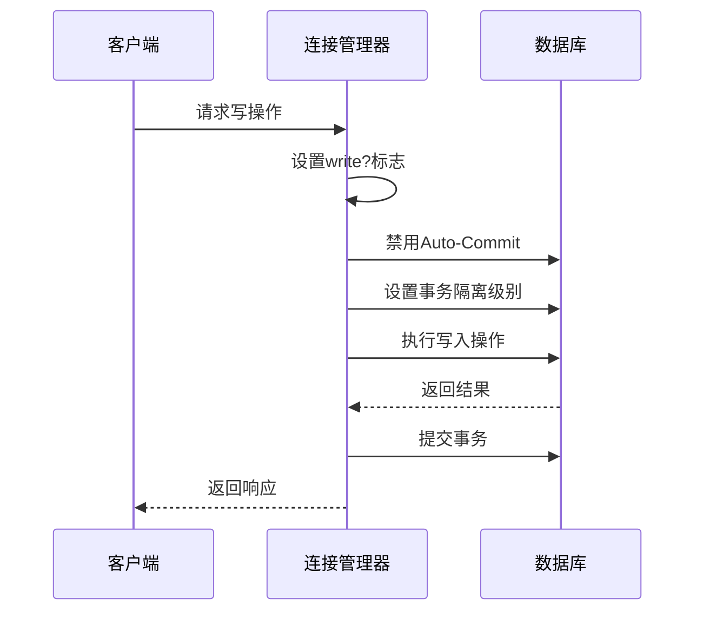
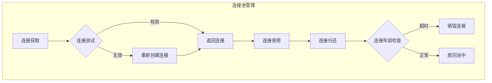
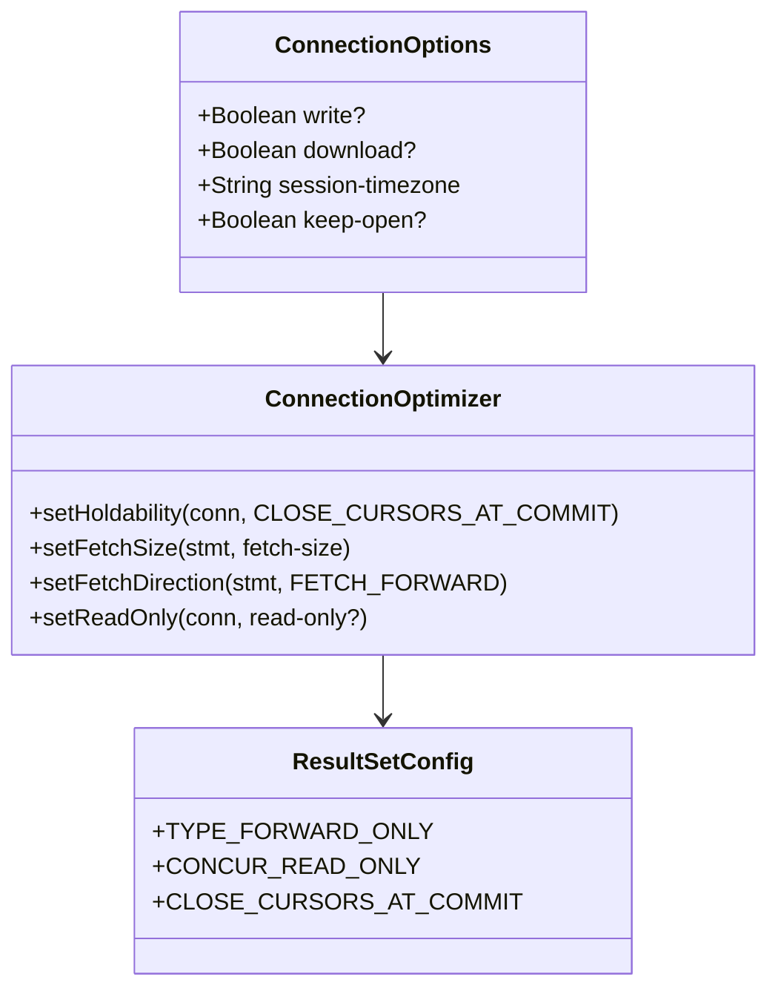
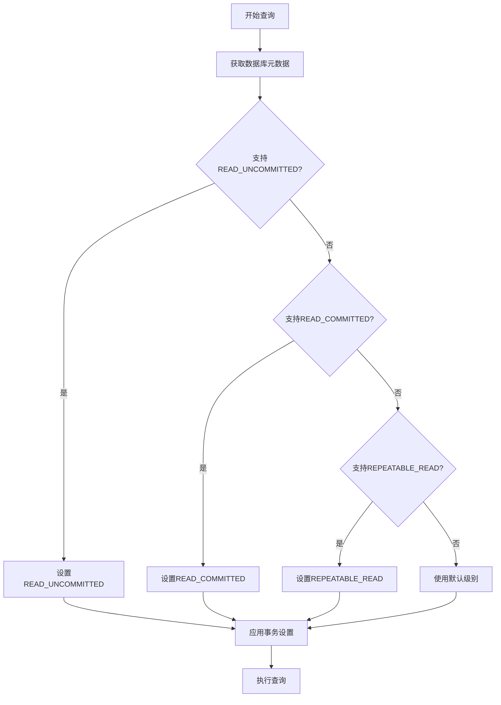
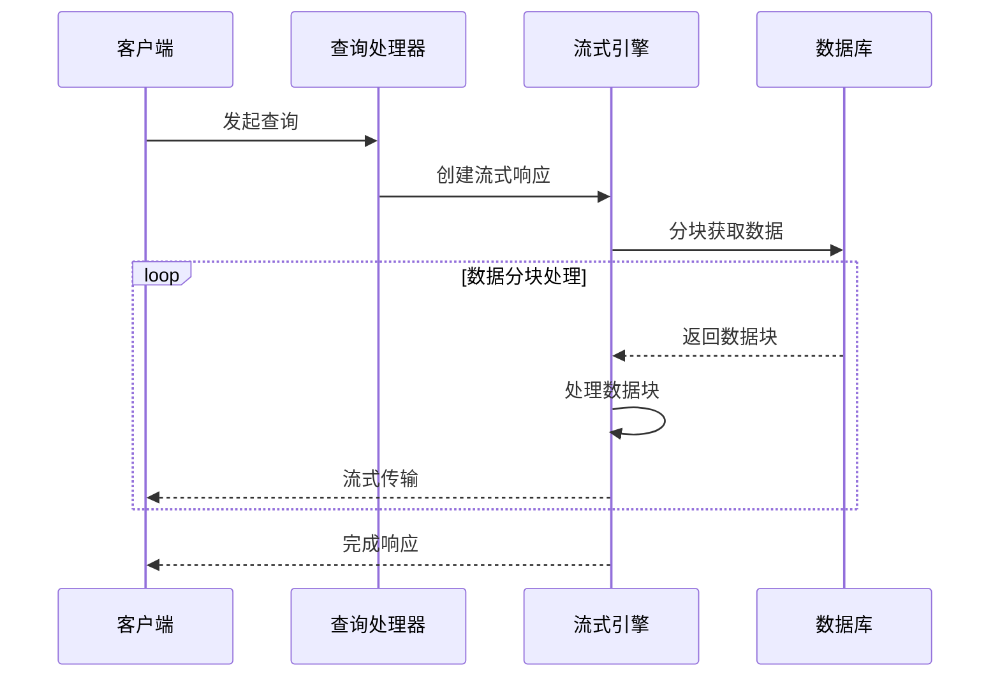
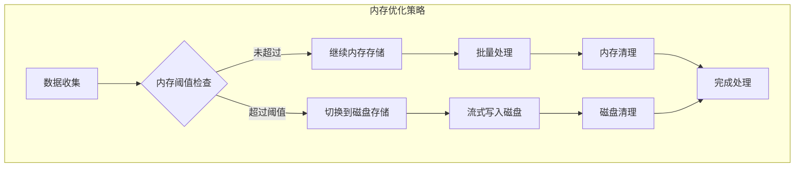
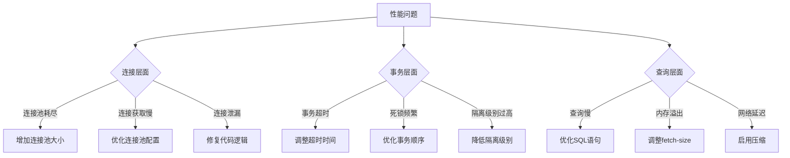

# 事务性能优化实践指南

<cite>
**本文档引用的文件**
- [execute.clj](file://src/metabase/driver/sql_jdbc/execute.clj)
- [connection.clj](file://src/metabase/driver/sql_jdbc/connection.clj)
- [connection_pool_setup.clj](file://src/metabase/app_db/connection_pool_setup.clj)
- [settings.clj](file://src/metabase/driver/settings.clj)
- [streaming.clj](file://src/metabase/query_processor/streaming.clj)
- [temp_storage.clj](file://src/metabase/notification/payload/temp_storage.clj)
- [connection.clj](file://src/metabase/app_db/connection.clj)
</cite>

## 目录
1. [概述](#概述)
2. [自动提交管理策略](#自动提交管理策略)
3. [连接池配置优化](#连接池配置优化)
4. [结果集处理优化](#结果集处理优化)
5. [事务隔离级别调优](#事务隔离级别调优)
6. [高并发查询场景优化](#高并发查询场景优化)
7. [监控与诊断](#监控与诊断)
8. [最佳实践建议](#最佳实践建议)

## 概述

Metabase的事务处理性能优化是一个多层次的系统工程，涉及连接管理、事务控制、结果集处理和资源回收等多个方面。本指南深入分析了Metabase中自动提交管理策略、连接池配置、fetch-size调优等关键性能因素，为高并发查询场景提供全面的优化建议。

## 自动提交管理策略

### 只读连接中的Auto-Commit优化

在只读查询场景中，Metabase采用智能的自动提交策略来避免隐式事务开销：

**图表来源**
- [execute.clj](file://src/metabase/driver/sql_jdbc/execute.clj#L385-L410)

### 写操作场景的事务控制

对于写操作和下载场景，Metabase采用显式事务控制策略：

**图表来源**
- [execute.clj](file://src/metabase/driver/sql_jdbc/execute.clj#L364-L386)

**章节来源**
- [execute.clj](file://src/metabase/driver/sql_jdbc/execute.clj#L364-L410)

## 连接池配置优化

### 应用数据库连接池配置

Metabase为应用数据库和数据仓库数据库分别配置了不同的连接池参数：

| 配置项 | 应用数据库 | 数据仓库数据库 | 说明 |
|--------|------------|----------------|------|
| `maxPoolSize` | 15 | 动态计算 | 根据负载动态调整 |
| `minPoolSize` | 无限制 | 0 | 支持按需分配 |
| `maxIdleTime` | 无限制 | 3小时 | 长时间空闲连接保留 |
| `maxConnectionAge` | 1小时 | 无限制 | 连接生命周期管理 |
| `testConnectionOnCheckout` | 启用 | 启用 | 连接有效性验证 |

### 数据仓库连接池特性

**图表来源**
- [connection.clj](file://src/metabase/driver/sql_jdbc/connection.clj#L85-L141)

**章节来源**
- [connection.clj](file://src/metabase/driver/sql_jdbc/connection.clj#L85-L141)
- [connection_pool_setup.clj](file://src/metabase/app_db/connection_pool_setup.clj#L108-L134)

## 结果集处理优化

### Holdability设置优化

Metabase通过`setHoldability`方法优化结果集处理：

**图表来源**
- [execute.clj](file://src/metabase/driver/sql_jdbc/execute.clj#L498-L532)

### Fetch Size调优策略

| 场景 | Fetch Size | 原因 |
|------|------------|------|
| 一般查询 | 500 | 平衡内存使用和网络效率 |
| 大数据量下载 | 动态调整 | 防止内存溢出 |
| 流式处理 | 分块处理 | 实现渐进式加载 |
| 批处理 | 较大值 | 减少网络往返 |

**章节来源**
- [execute.clj](file://src/metabase/driver/sql_jdbc/execute.clj#L498-L532)
- [settings.clj](file://src/metabase/driver/settings.clj#L161-L177)

## 事务隔离级别调优

### 最佳事务级别选择

**图表来源**
- [execute.clj](file://src/metabase/driver/sql_jdbc/execute.clj#L245-L272)

### 隔离级别性能对比

| 隔离级别 | 锁定范围 | 性能影响 | 适用场景 |
|----------|----------|----------|----------|
| READ_UNCOMMITTED | 无锁定 | 最高 | 日志分析、报表查询 |
| READ_COMMITTED | 行级锁定 | 中等 | 一般业务查询 |
| REPEATABLE_READ | 事务级锁定 | 较低 | 财务统计、审计查询 |
| SERIALIZABLE | 表级锁定 | 最低 | 关键业务操作 |

**章节来源**
- [execute.clj](file://src/metabase/driver/sql_jdbc/execute.clj#L245-L272)

## 高并发查询场景优化

### 流式处理架构

**图表来源**
- [streaming.clj](file://src/metabase/query_processor/streaming.clj#L195-L229)

### 内存管理策略

**图表来源**
- [temp_storage.clj](file://src/metabase/notification/payload/temp_storage.clj#L253-L293)

**章节来源**
- [streaming.clj](file://src/metabase/query_processor/streaming.clj#L165-L229)
- [temp_storage.clj](file://src/metabase/notification/payload/temp_storage.clj#L229-L293)

## 监控与诊断

### 连接池监控指标

| 指标类型 | 监控内容 | 优化目标 |
|----------|----------|----------|
| 连接使用率 | 活跃连接数/最大连接数 | 80-90% |
| 连接等待时间 | 获取连接的平均时间 | <100ms |
| 连接泄漏检测 | 未归还连接数量 | 0 |
| 连接健康状态 | 连接测试失败率 | <1% |

### 性能瓶颈识别

## 最佳实践建议

### 开发阶段优化

1. **连接管理**
   - 在只读查询中启用Auto-Commit
   - 对于写操作明确指定事务边界
   - 使用连接池而非直接连接

2. **查询优化**
   - 设置合适的fetch-size
   - 使用流式处理大数据集
   - 避免不必要的结果集缓存

3. **事务控制**
   - 选择最低必要的事务隔离级别
   - 及时提交或回滚事务
   - 避免长时间持有事务

### 生产环境监控

1. **连接池监控**
   - 定期检查连接池使用情况
   - 监控连接获取时间
   - 设置连接泄漏告警

2. **性能监控**
   - 跟踪查询响应时间
   - 监控内存使用情况
   - 观察CPU和网络使用率

3. **故障排查**
   - 建立性能基线
   - 记录异常情况
   - 制定应急预案

### 配置调优指南

| 场景 | 推荐配置 | 说明 |
|------|----------|------|
| 高并发读取 | Auto-Commit + 流式处理 | 最大化并发能力 |
| 大数据下载 | 低fetch-size + 磁盘存储 | 防止内存溢出 |
| 实时分析 | 中等隔离级别 + 快速提交 | 平衡一致性和性能 |
| 批处理作业 | 批量操作 + 显式事务 | 提高吞吐量 |

通过实施这些优化策略，Metabase能够在各种工作负载下实现最佳的事务处理性能，确保系统的稳定性和可扩展性。