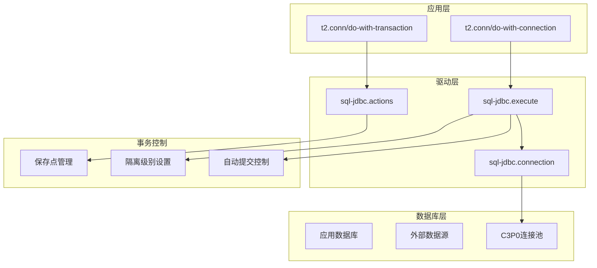
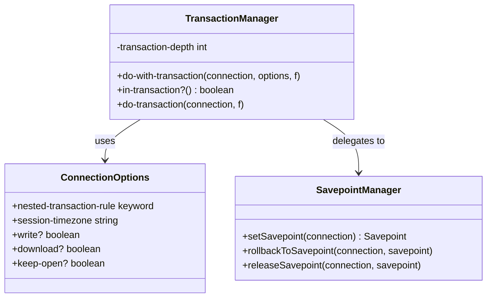
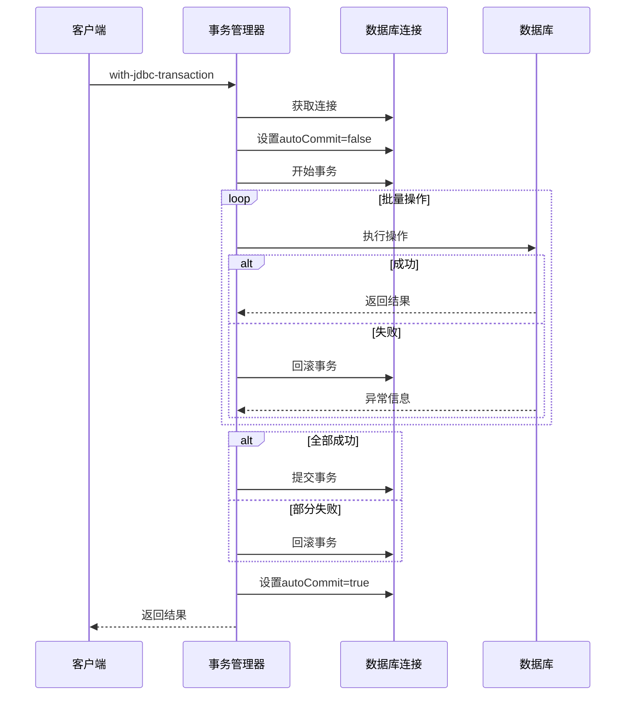
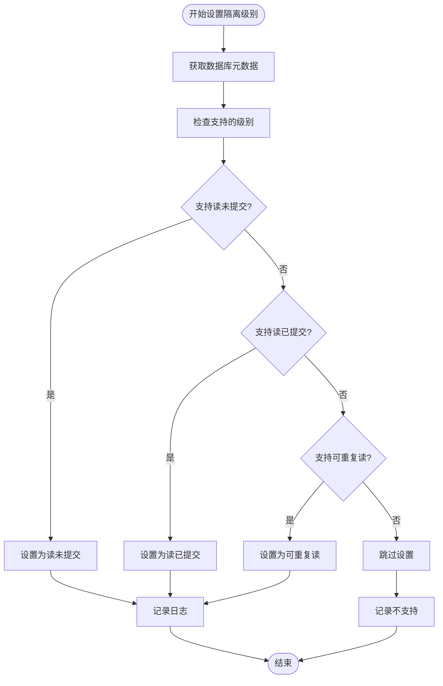
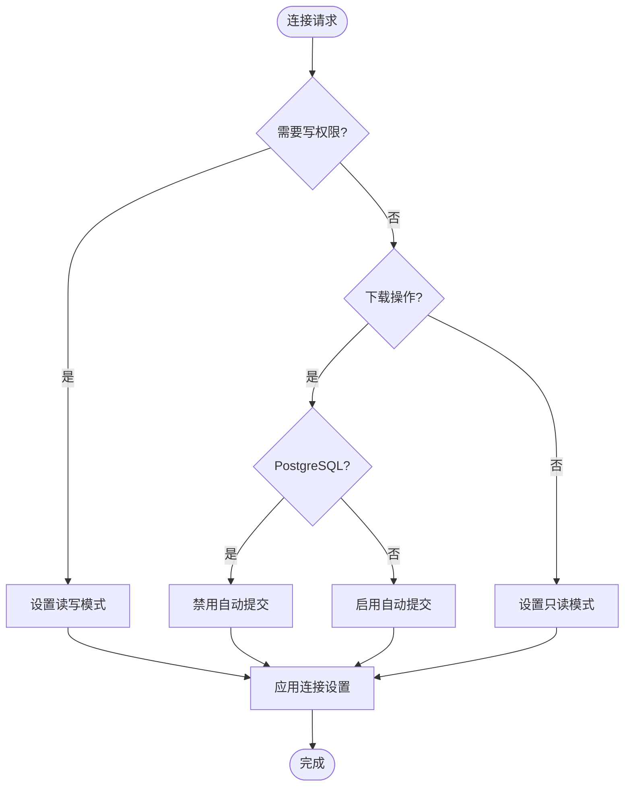
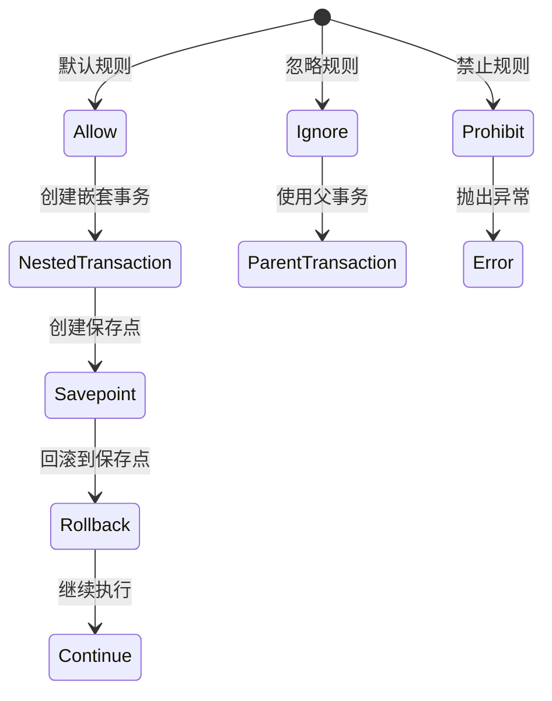
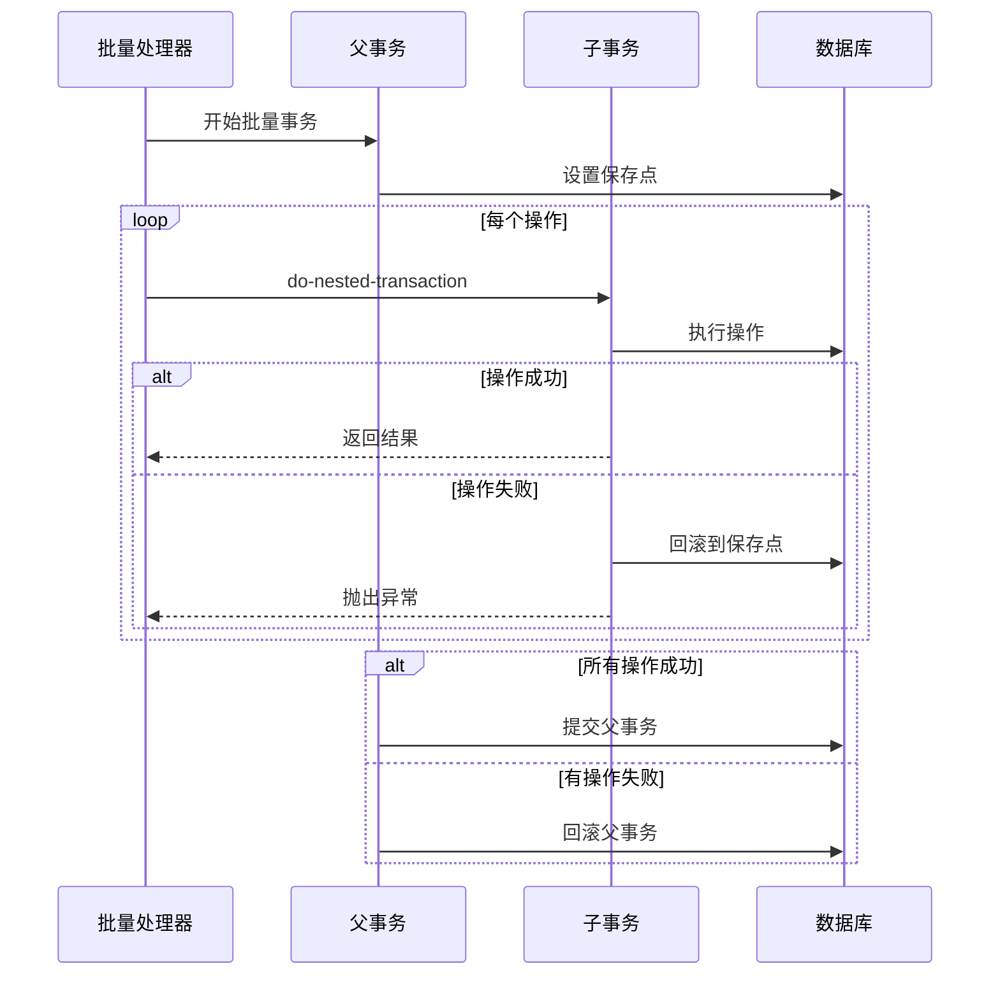
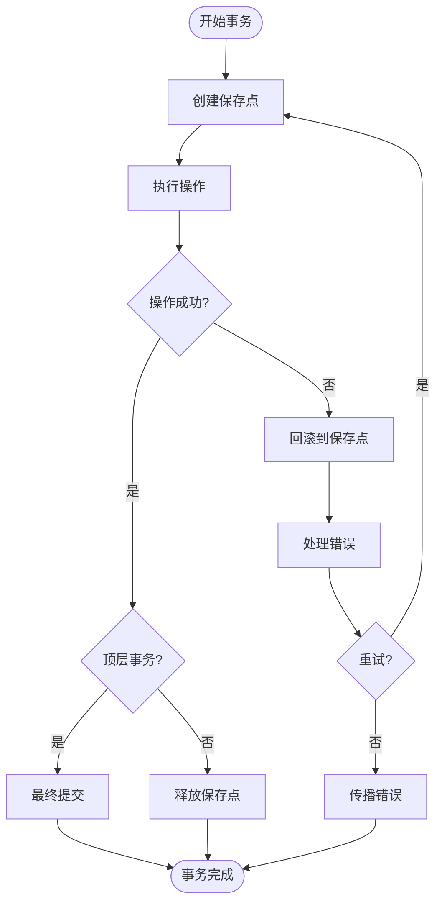
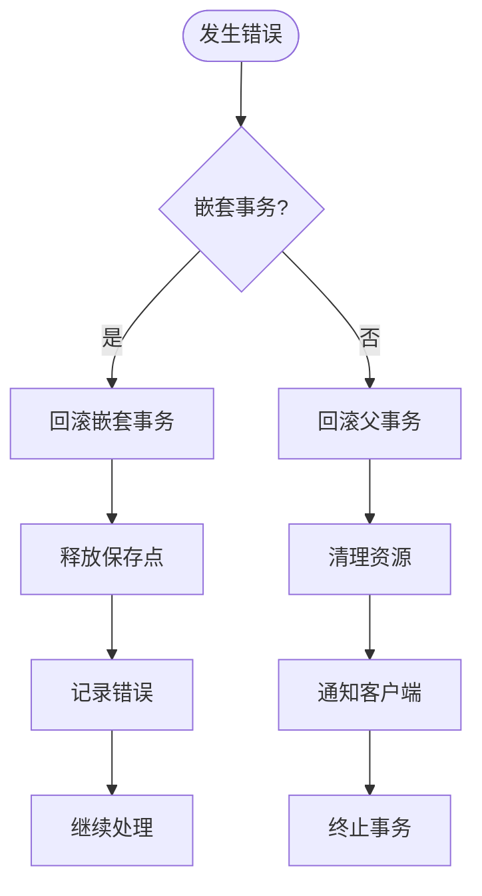
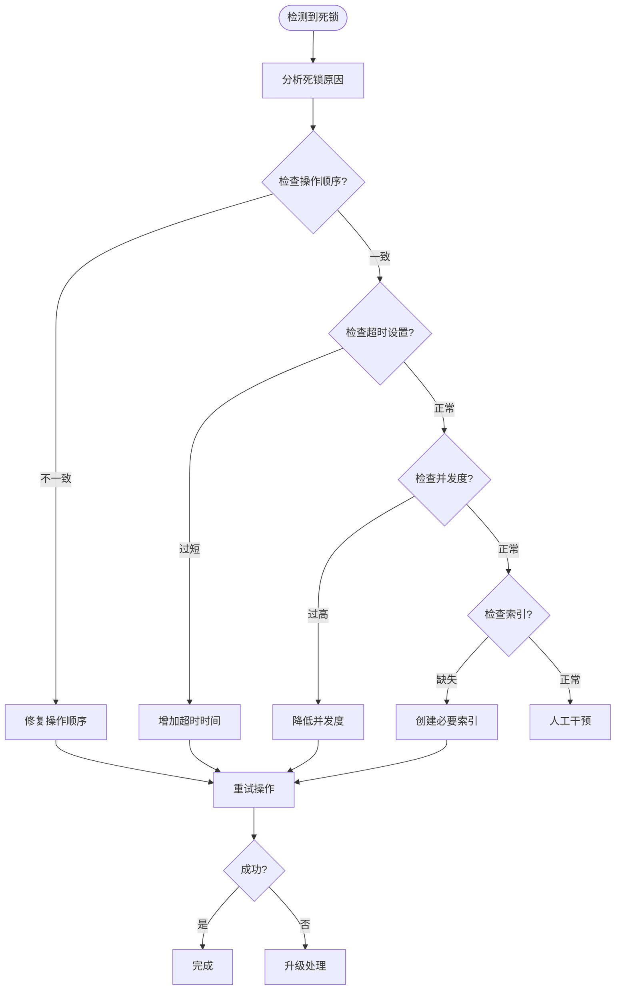

# 事务管理

<cite>
**本文档中引用的文件**
- [connection.clj](file://src/metabase/app_db/connection.clj)
- [execute.clj](file://src/metabase/driver/sql_jdbc/execute.clj)
- [actions.clj](file://src/metabase/driver/sql_jdbc/actions.clj)
- [postgres/actions.clj](file://src/metabase/driver/postgres/actions.clj)
- [env.clj](file://src/metabase/app_db/env.clj)
- [connection.clj](file://src/metabase/driver/sql_jdbc/connection.clj)
- [settings.clj](file://src/metabase/driver/settings.clj)
- [ddl.clj](file://src/metabase/driver/postgres/ddl.clj)
</cite>

## 目录
1. [概述](#概述)
2. [事务管理架构](#事务管理架构)
3. [核心事务组件](#核心事务组件)
4. [事务隔离级别设置](#事务隔离级别设置)
5. [连接配置与管理](#连接配置与管理)
6. [嵌套事务支持](#嵌套事务支持)
7. [保存点机制](#保存点机制)
8. [事务回滚策略](#事务回滚策略)
9. [性能优化](#性能优化)
10. [故障排除指南](#故障排除指南)
11. [最佳实践](#最佳实践)

## 概述

Metabase的事务管理系统是一个高度优化的企业级解决方案，专门设计用于处理复杂的数据库操作场景，特别是在执行批量操作和处理外部数据源时。该系统提供了灵活的事务控制机制，支持嵌套事务、保存点回滚以及多种事务隔离级别的动态配置。

### 主要特性

- **智能事务隔离级别**：根据数据库能力自动选择最优的事务隔离级别
- **嵌套事务支持**：使用保存点实现类似Oracle的嵌套事务功能
- **连接池管理**：高效的连接池配置和资源管理
- **性能优化**：针对不同数据库类型的特定优化策略
- **错误恢复**：完善的事务回滚和错误处理机制

## 事务管理架构

Metabase的事务管理采用分层架构设计，确保了系统的可扩展性和维护性。



**图表来源**
- [connection.clj](file://src/metabase/app_db/connection.clj#L125-L164)
- [execute.clj](file://src/metabase/driver/sql_jdbc/execute.clj#L94-L120)
- [actions.clj](file://src/metabase/driver/sql_jdbc/actions.clj#L184-L213)

## 核心事务组件

### 应用数据库事务管理器

应用数据库的事务管理通过`t2.conn/do-with-transaction`方法实现，该方法提供了对嵌套事务的完整支持。



**图表来源**
- [connection.clj](file://src/metabase/app_db/connection.clj#L125-L210)

### 外部数据源事务处理器

外部数据源的事务处理通过`do-with-jdbc-transaction`函数实现，支持批量操作和错误恢复。



**图表来源**
- [actions.clj](file://src/metabase/driver/sql_jdbc/actions.clj#L184-L213)

**章节来源**
- [connection.clj](file://src/metabase/app_db/connection.clj#L125-L210)
- [actions.clj](file://src/metabase/driver/sql_jdbc/actions.clj#L142-L213)

## 事务隔离级别设置

### set-best-transaction-level! 函数

`set-best-transaction-level!`函数是事务隔离级别设置的核心组件，它会根据数据库支持的能力自动选择最优的隔离级别。

#### 隔离级别优先级

系统按照以下优先级顺序尝试设置事务隔离级别：

1. **读未提交（READ_UNCOMMITTED）** - 最低锁定级别
2. **读已提交（READ_COMMITTED）** - 默认推荐级别
3. **可重复读（REPEATABLE_READ）** - 更严格的隔离

#### 实现机制



**图表来源**
- [execute.clj](file://src/metabase/driver/sql_jdbc/execute.clj#L240-L260)

### 数据库特定优化

不同数据库在事务隔离级别方面有不同的行为和优化策略：

| 数据库类型 | 默认隔离级别 | 特殊考虑 |
|------------|--------------|----------|
| PostgreSQL | READ_COMMITTED | 支持所有标准级别 |
| MySQL | REPEATABLE_READ | 需要显式保存点支持 |
| H2 | READ_COMMITTED | 轻量级事务处理 |

**章节来源**
- [execute.clj](file://src/metabase/driver/sql_jdbc/execute.clj#L240-L260)

## 连接配置与管理

### 只读连接配置

系统提供了智能的只读连接配置机制，根据操作类型自动调整连接属性。

#### 连接属性决策流程



**图表来源**
- [execute.clj](file://src/metabase/driver/sql_jdbc/execute.clj#L364-L386)

### 自动提交管理

自动提交模式的管理遵循以下原则：

1. **写操作**：强制禁用自动提交以确保事务完整性
2. **只读查询**：启用自动提交以提高性能
3. **下载操作**：特殊处理以避免PostgreSQL的限制

### 连接池配置

C3P0连接池提供了丰富的配置选项，确保高性能和可靠性：

| 参数 | 默认值 | 说明 |
|------|--------|------|
| maxPoolSize | 动态计算 | 最大连接数 |
| minPoolSize | 0 | 最小空闲连接 |
| maxIdleTime | 3小时 | 空闲连接最大存活时间 |
| maxIdleTimeExcessConnections | 5分钟 | 超额空闲连接清理时间 |
| testConnectionOnCheckout | true | 连接有效性检查 |

**章节来源**
- [execute.clj](file://src/metabase/driver/sql_jdbc/execute.clj#L364-L410)
- [connection.clj](file://src/metabase/driver/sql_jdbc/connection.clj#L100-L150)

## 嵌套事务支持

### 嵌套事务规则

Metabase实现了灵活的嵌套事务规则系统，允许不同的事务控制策略：



**图表来源**
- [connection.clj](file://src/metabase/app_db/connection.clj#L184-L209)

### 嵌套事务深度跟踪

系统使用动态变量`*transaction-depth*`来跟踪当前事务的嵌套深度：

```clojure
(def ^:private ^:dynamic *transaction-depth* 0)

(defn in-transaction?
  "Whether we are currently in a transaction."
  []
  (pos? *transaction-depth*))
```

### 批量操作中的嵌套事务

在批量操作中，系统使用`do-nested-transaction`方法来处理每个单独的操作：



**图表来源**
- [actions.clj](file://src/metabase/driver/sql_jdbc/actions.clj#L213-L241)

**章节来源**
- [connection.clj](file://src/metabase/app_db/connection.clj#L125-L210)
- [actions.clj](file://src/metabase/driver/sql_jdbc/actions.clj#L184-L241)

## 保存点机制

### 保存点创建与管理

保存点机制是实现嵌套事务的关键技术，系统在每次事务操作前都会创建新的保存点。

#### 保存点生命周期



**图表来源**
- [connection.clj](file://src/metabase/app_db/connection.clj#L140-L170)

### 数据库特定保存点实现

不同数据库对保存点的支持有所不同：

#### PostgreSQL保存点处理

PostgreSQL的保存点实现相对简单直接：

```clojure
(defmethod sql-jdbc.actions/do-nested-transaction :postgres
  [_driver ^java.sql.Connection conn thunk]
  (let [savepoint (.setSavepoint conn)]
    (try
      (thunk)
      (catch Throwable e
        (.rollback conn savepoint)
        (throw e))
      (finally
        (.releaseSavepoint conn savepoint)))))
```

#### MySQL和其他数据库

其他数据库可能需要更复杂的保存点管理逻辑，特别是当涉及到分布式事务或特定的数据库特性时。

**章节来源**
- [connection.clj](file://src/metabase/app_db/connection.clj#L140-L170)
- [postgres/actions.clj](file://src/metabase/driver/postgres/actions.clj#L118-L140)

## 事务回滚策略

### 分层回滚机制

Metabase实现了多层次的事务回滚策略，确保在各种错误情况下都能正确恢复状态。

#### 回滚优先级



**图表来源**
- [connection.clj](file://src/metabase/app_db/connection.clj#L150-L170)

### 错误恢复策略

系统提供了多种错误恢复策略：

1. **即时回滚**：立即回滚到最近的保存点
2. **延迟回滚**：在批量操作完成后统一回滚
3. **部分回滚**：仅回滚受影响的部分

### 连接泄漏防护

为了防止连接泄漏，系统实现了超时机制：

```clojure
(defsetting unreturned-connection-timeout
  "Seconds. If set, if an application checks out but then fails to check-in [i.e. close()] a Connection
  within the specified period of time, the pool will unceremoniously destroy() the Connection."
  :type :integer
  :default (if config/is-test? 5 300))  ;; 5秒测试环境，5分钟生产环境
```

**章节来源**
- [connection.clj](file://src/metabase/app_db/connection.clj#L150-L170)
- [settings.clj](file://src/metabase/driver/settings.clj#L75-L99)

## 性能优化

### 查询超时优化

系统实现了智能的查询超时机制，防止长时间运行的查询影响整体性能。

#### PostgreSQL语句超时

PostgreSQL驱动实现了特殊的语句超时机制：

```clojure
(defn- set-statement-timeout!
  "Must be called within a transaction.
   Sets the current transaction `statement_timeout` to the minimum
   of the current (non-zero) value and ten minutes."
  [tx]
  (let [existing-timeout (->> (sql/format {:select [:setting]
                                           :from   [:pg_settings]
                                           :where  [:= :name "statement_timeout"]}
                                          {:quoted false})
                              (sql.ddl/jdbc-query tx)
                              first
                              :setting
                              parse-long)
        ten-minutes      (.toMillis (t/minutes 10))
        new-timeout      (if (zero? existing-timeout)
                           ten-minutes
                           (min ten-minutes existing-timeout))])
    (sql.ddl/execute! tx [(format "SET LOCAL statement_timeout TO '%s'" (str new-timeout))]))
```

### 连接池优化

连接池配置针对不同使用场景进行了优化：

| 场景 | maxPoolSize | maxIdleTime | 测试策略 |
|------|-------------|-------------|----------|
| 应用数据库 | 动态计算 | 3小时 | 每次检查 |
| 数据仓库 | 10 | 5分钟 | 无 |
| 批量操作 | 5 | 10分钟 | 无 |

### 内存管理优化

系统采用了多种内存管理策略：

1. **连接复用**：最大化连接池利用率
2. **及时释放**：确保资源及时回收
3. **监控告警**：实时监控连接使用情况

**章节来源**
- [ddl.clj](file://src/metabase/driver/postgres/ddl.clj#L15-L32)
- [connection.clj](file://src/metabase/driver/sql_jdbc/connection.clj#L100-L150)

## 故障排除指南

### 常见事务问题

#### 死锁检测与处理



#### 连接泄漏诊断

系统提供了详细的连接泄漏诊断工具：

1. **堆栈跟踪捕获**：记录连接获取时的完整堆栈
2. **超时监控**：自动检测未归还的连接
3. **统计报告**：生成连接使用统计报告

### 性能调优建议

#### 事务大小优化

- **小事务**：保持事务尽可能小，减少锁定时间
- **批量操作**：合理使用批量插入/更新
- **保存点频率**：在适当的位置创建保存点

#### 连接池调优

```clojure
;; 示例：优化连接池配置
(defn optimize-connection-pool [driver database]
  (merge
   (data-warehouse-connection-pool-properties driver database)
   {"maxPoolSize" (calculate-optimal-size database)
    "maxIdleTime" (* 60 60)  ;; 1小时
    "testConnectionOnCheckout" true}))
```

**章节来源**
- [connection.clj](file://src/metabase/driver/sql_jdbc/connection.clj#L100-L150)

## 最佳实践

### 事务设计原则

1. **最小化事务范围**：只在必要的时候开启事务
2. **明确事务边界**：清晰定义事务的开始和结束
3. **错误处理优先**：优先考虑错误情况下的恢复策略
4. **性能监控**：持续监控事务性能指标

### 编码规范

#### 推荐的事务使用模式

```clojure
;; 推荐：使用宏简化事务管理
(with-jdbc-transaction [conn database-id]
  (execute-operation conn params))

;; 推荐：批量操作使用嵌套事务
(defn batch-process [items]
  (run-bulk-transaction!
   {:database database
    :proc     process-item
    :coll     items}))
```

#### 错误处理最佳实践

```clojure
;; 推荐：结构化的错误处理
(defn safe-transaction [f]
  (try
    (f)
    (catch SQLException e
      (handle-sql-error e))
    (catch Throwable e
      (handle-generic-error e))))
```

### 监控和维护

#### 关键指标监控

| 指标 | 目标值 | 监控频率 |
|------|--------|----------|
| 事务成功率 | > 99.9% | 实时 |
| 平均事务时间 | < 100ms | 每分钟 |
| 连接池利用率 | < 80% | 每5分钟 |
| 错误率 | < 0.1% | 实时 |

#### 维护任务

1. **定期检查**：每日检查事务性能指标
2. **连接池健康检查**：每周验证连接池配置
3. **性能分析**：每月进行性能瓶颈分析
4. **容量规划**：每季度评估容量需求

通过遵循这些最佳实践，可以确保Metabase的事务管理系统在高负载环境下保持稳定和高效的性能。