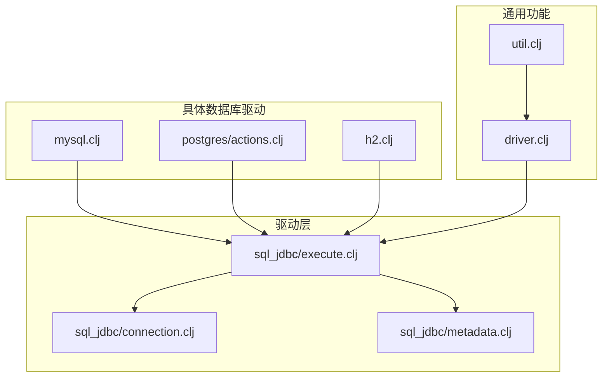
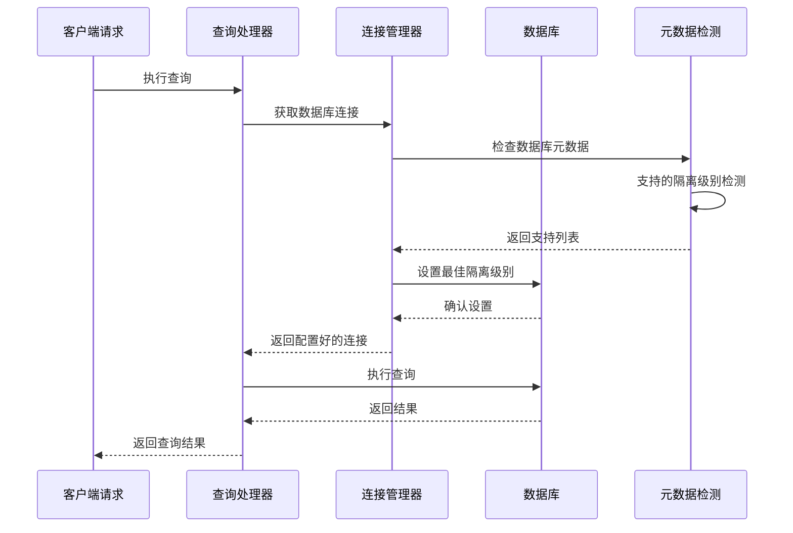
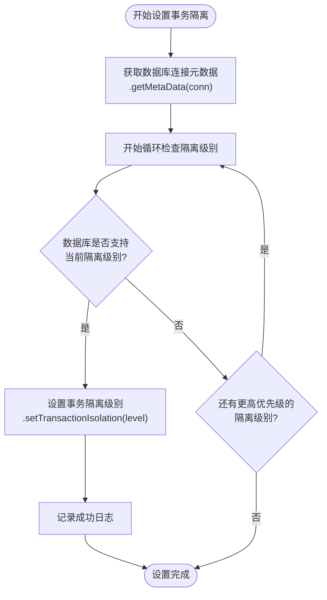
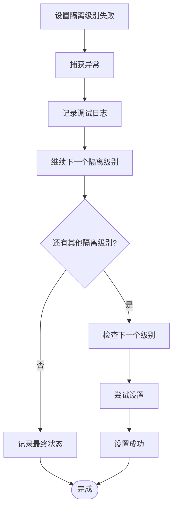
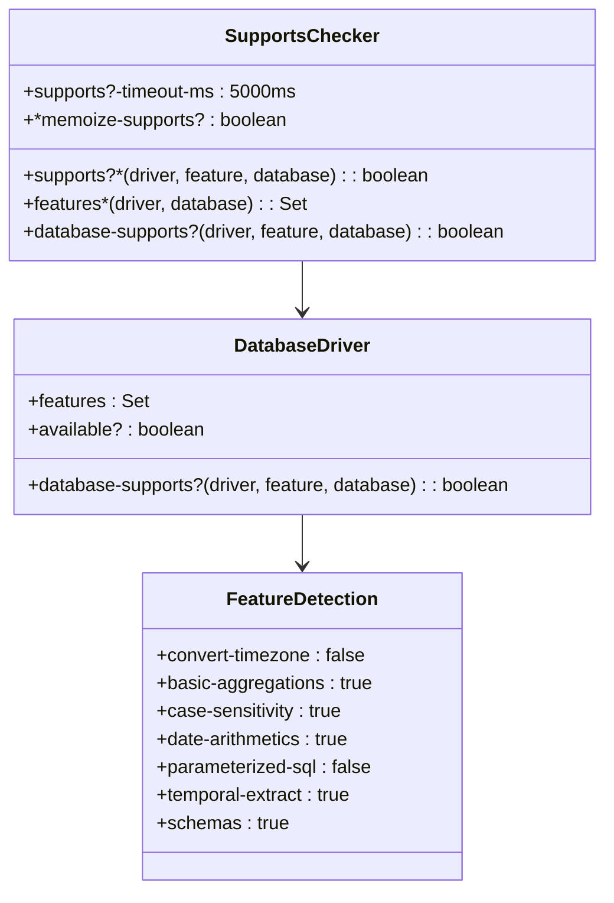
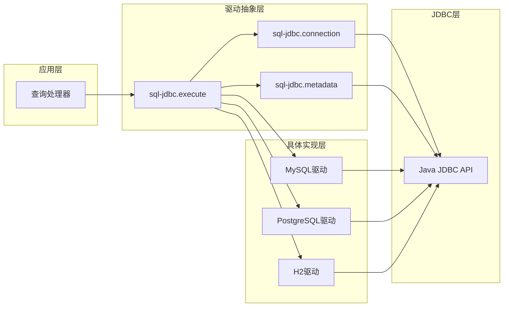

# 事务隔离级别

<cite>
**本文档中引用的文件**
- [execute.clj](file://src/metabase/driver/sql_jdbc/execute.clj)
- [mysql.clj](file://src/metabase/driver/mysql.clj)
- [postgres/actions.clj](file://src/metabase/driver/postgres/actions.clj)
- [h2.clj](file://src/metabase/driver/h2.clj)
- [util.clj](file://src/metabase/driver/util.clj)
- [driver.clj](file://src/metabase/driver.clj)
- [connection.clj](file://src/metabase/driver/sql_jdbc/connection.clj)
- [metadata.clj](file://src/metabase/driver/sql_jdbc/metadata.clj)
</cite>

## 目录
1. [简介](#简介)
2. [项目结构](#项目结构)
3. [核心组件](#核心组件)
4. [架构概览](#架构概览)
5. [详细组件分析](#详细组件分析)
6. [依赖关系分析](#依赖关系分析)
7. [性能考虑](#性能考虑)
8. [故障排除指南](#故障排除指南)
9. [结论](#结论)

## 简介

Metabase是一个开源的数据可视化平台，它通过JDBC连接与各种数据库进行交互。在处理大量数据分析查询时，事务隔离级别对于确保数据一致性和系统性能至关重要。本文档深入探讨了Metabase中事务隔离级别的实现机制，特别是`set-best-transaction-level!`函数的工作原理。

事务隔离级别定义了数据库事务之间的可见性规则，影响并发控制和数据一致性。不同的数据库管理系统对事务隔离的支持程度不同，Metabase通过智能检测机制为每种数据库选择最优的隔离级别。

## 项目结构

Metabase的事务隔离功能主要分布在以下关键模块中：

**图表来源**
- [execute.clj](file://src/metabase/driver/sql_jdbc/execute.clj#L1-L50)
- [connection.clj](file://src/metabase/driver/sql_jdbc/connection.clj#L1-L50)

**章节来源**
- [execute.clj](file://src/metabase/driver/sql_jdbc/execute.clj#L1-L100)
- [connection.clj](file://src/metabase/driver/sql_jdbc/connection.clj#L1-L100)

## 核心组件

### set-best-transaction-level! 函数

`set-best-transaction-level!`函数是Metabase事务隔离机制的核心，位于`sql_jdbc/execute.clj`文件中。该函数负责根据数据库支持情况动态设置最低锁定级别的事务隔离。

#### 主要特性

1. **自适应隔离级别选择**：从最宽松的`READ_UNCOMMITTED`开始，逐步尝试更严格的隔离级别
2. **JDBC元数据检测**：利用数据库连接的元数据信息检测支持的隔离级别
3. **错误处理机制**：优雅地处理设置失败的情况
4. **日志记录**：提供详细的调试信息

#### 隔离级别优先级

函数按照以下优先级顺序尝试设置事务隔离级别：

| 隔离级别 | JDBC常量 | 描述 | 性能影响 |
|---------|----------|------|----------|
| READ_UNCOMMITTED | TRANSACTION_READ_UNCOMMITTED | 最宽松，允许脏读 | 最高性能，最低一致性 |
| READ_COMMITTED | TRANSACTION_READ_COMMITTED | 只读取已提交数据 | 中等性能，平衡一致性 |
| REPEATABLE_READ | TRANSACTION_REPEATABLE_READ | 同一事务内重复读相同数据 | 较低性能，较高一致性 |

**章节来源**
- [execute.clj](file://src/metabase/driver/sql_jdbc/execute.clj#L240-L272)

## 架构概览

Metabase的事务隔离架构采用分层设计，确保跨数据库的一致性体验：

**图表来源**
- [execute.clj](file://src/metabase/driver/sql_jdbc/execute.clj#L360-L380)
- [connection.clj](file://src/metabase/driver/sql_jdbc/connection.clj#L125-L164)

## 详细组件分析

### 事务隔离设置流程

#### 1. 元数据获取阶段

**图表来源**
- [execute.clj](file://src/metabase/driver/sql_jdbc/execute.clj#L245-L272)

#### 2. 错误处理机制

当设置事务隔离级别失败时，Metabase采用以下策略：

**图表来源**
- [execute.clj](file://src/metabase/driver/sql_jdbc/execute.clj#L255-L265)

**章节来源**
- [execute.clj](file://src/metabase/driver/sql_jdbc/execute.clj#L240-L272)

### 不同数据库驱动的支持差异

#### MySQL驱动

MySQL驱动对事务隔离有特定的优化：

- **性能扩展**：使用`useLocalSessionState=true`减少数据库往返
- **连接属性**：自动添加程序名称标识符
- **时区处理**：专门的时区设置方法

#### PostgreSQL驱动

PostgreSQL驱动提供了高级的事务控制：

- **保存点支持**：使用保存点进行嵌套事务
- **约束解析**：解析数据库约束以提供更好的错误信息
- **类型映射**：丰富的数据类型映射支持

#### H2数据库

H2数据库的特殊处理：

- **限制**：不支持时区设置和事务级别更改
- **简化**：跳过事务级别设置步骤
- **安全**：禁止使用默认管理员账户执行SQL

**章节来源**
- [mysql.clj](file://src/metabase/driver/mysql.clj#L630-L640)
- [postgres/actions.clj](file://src/metabase/driver/postgres/actions.clj#L1-L50)
- [h2.clj](file://src/metabase/driver/h2.clj#L533-L563)

### 数据库功能检测机制

Metabase使用`supports?`函数来检测数据库功能支持：

**图表来源**
- [util.clj](file://src/metabase/driver/util.clj#L192-L241)
- [driver.clj](file://src/metabase/driver.clj#L796-L840)

**章节来源**
- [util.clj](file://src/metabase/driver/util.clj#L192-L301)
- [driver.clj](file://src/metabase/driver.clj#L796-L840)

## 依赖关系分析

### 核心依赖图

**图表来源**
- [execute.clj](file://src/metabase/driver/sql_jdbc/execute.clj#L1-L50)
- [connection.clj](file://src/metabase/driver/sql_jdbc/connection.clj#L1-L50)

### 功能支持矩阵

| 数据库 | READ_UNCOMMITTED | READ_COMMITTED | REPEATABLE_READ | SERIALIZABLE |
|--------|------------------|----------------|-----------------|--------------|
| MySQL | ✓ | ✓ | ✓ | ✓ |
| PostgreSQL | ✓ | ✓ | ✓ | ✓ |
| H2 | ✗ | ✗ | ✗ | ✗ |
| SQLite | ✓ | ✓ | ✓ | ✓ |

**章节来源**
- [mysql.clj](file://src/metabase/driver/mysql.clj#L1-L50)
- [postgres/actions.clj](file://src/metabase/driver/postgres/actions.clj#L1-L50)
- [h2.clj](file://src/metabase/driver/h2.clj#L1-L50)

## 性能考虑

### 事务隔离级别对性能的影响

不同事务隔离级别对系统性能的影响：

1. **READ_UNCOMMITTED**
   - **优点**：最高并发性能，无锁开销
   - **缺点**：可能读取未提交数据（脏读）
   - **适用场景**：报表查询、统计分析

2. **READ_COMMITTED**
   - **优点**：平衡性能与一致性
   - **缺点**：可重复读问题
   - **适用场景**：一般查询操作

3. **REPEATABLE_READ**
   - **优点**：防止脏读和不可重复读
   - **缺点**：较高的锁开销
   - **适用场景**：需要稳定数据视图的操作

### 优化策略

1. **连接池配置**：合理设置连接池大小
2. **超时设置**：避免长时间持有锁
3. **查询优化**：减少事务持续时间
4. **索引优化**：提高查询效率

## 故障排除指南

### 常见问题及解决方案

#### 1. 事务隔离设置失败

**症状**：日志中出现"Error setting transaction isolation level"错误

**原因**：
- 数据库用户权限不足
- 数据库配置限制
- 驱动版本不兼容

**解决方案**：
- 检查数据库用户权限
- 查看数据库配置参数
- 更新JDBC驱动版本

#### 2. 性能下降

**症状**：查询响应时间增加

**原因**：
- 使用了过于严格的隔离级别
- 锁争用严重
- 查询复杂度高

**解决方案**：
- 调整隔离级别设置
- 优化查询语句
- 增加硬件资源

#### 3. 数据一致性问题

**症状**：查询结果不一致

**原因**：
- 隔离级别设置不当
- 并发写入冲突
- 数据库配置问题

**解决方案**：
- 调整隔离级别
- 实现适当的并发控制
- 检查数据库配置

**章节来源**
- [execute.clj](file://src/metabase/driver/sql_jdbc/execute.clj#L255-L265)

## 结论

Metabase的事务隔离级别实现体现了现代数据库应用的最佳实践。通过`set-best-transaction-level!`函数，Metabase能够：

1. **智能适配**：根据数据库能力自动选择最优隔离级别
2. **性能优化**：优先选择高性能的隔离级别
3. **错误恢复**：优雅处理设置失败的情况
4. **跨数据库兼容**：统一的接口支持多种数据库

这种设计不仅提高了系统的可靠性和性能，还为开发者提供了透明的数据库访问体验。随着数据库技术的发展，Metabase的事务隔离机制也将继续演进，以满足不断增长的业务需求。

对于数据库管理员和开发者而言，理解这些机制有助于更好地配置和优化Metabase环境，确保在保证数据一致性的前提下获得最佳性能。