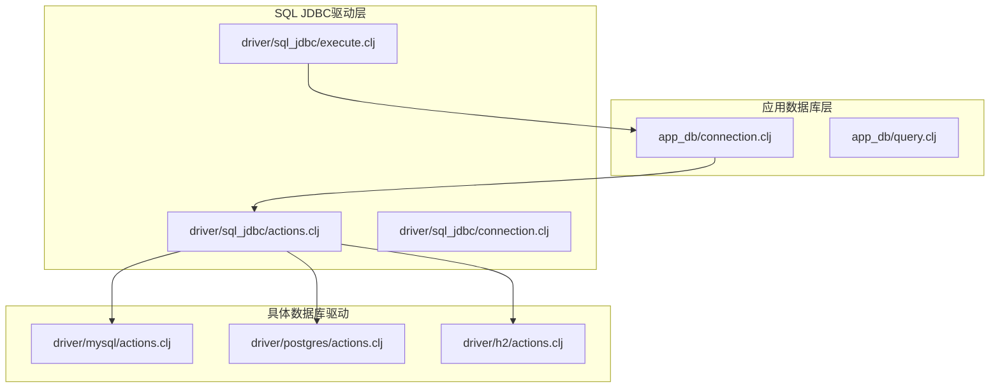
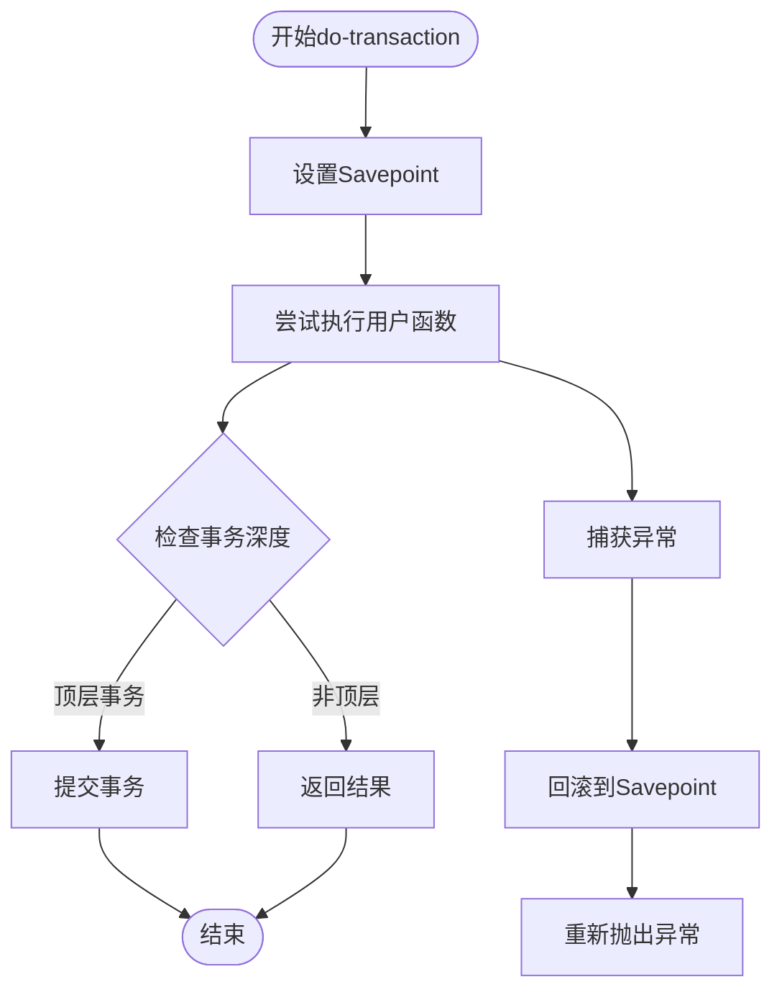
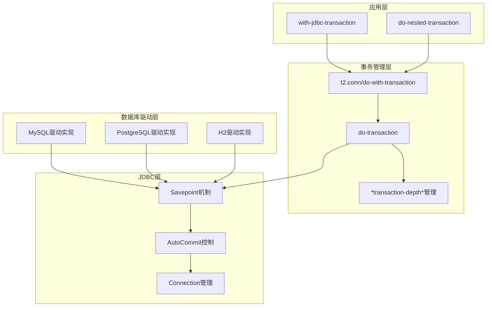
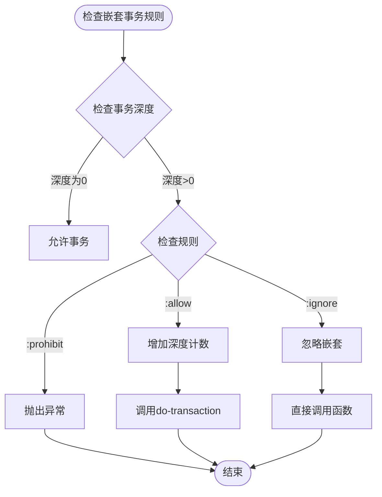
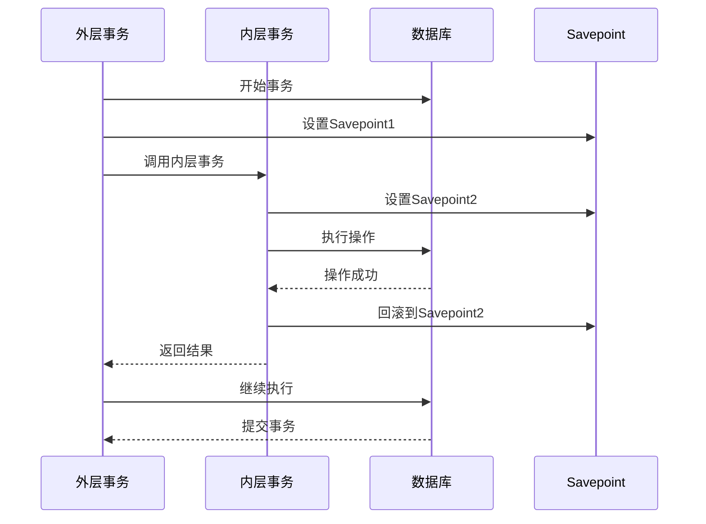
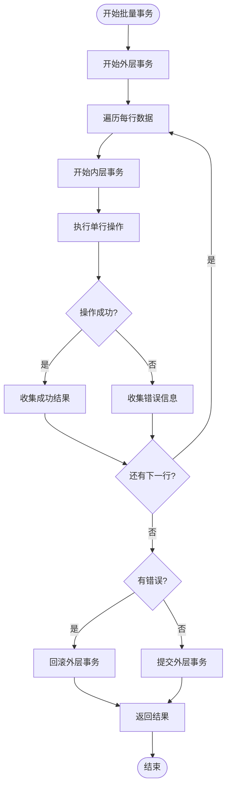
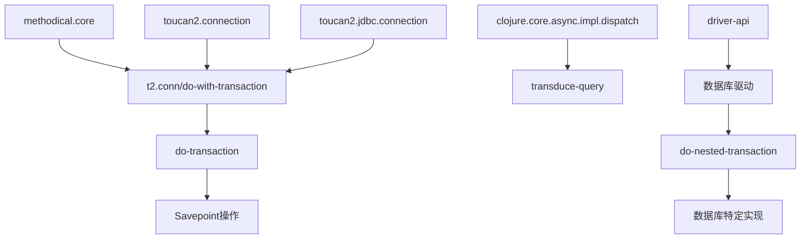

# 嵌套事务支持

<cite>
**本文档中引用的文件**
- [connection.clj](file://src/metabase/app_db/connection.clj)
- [actions.clj](file://src/metabase/driver/sql_jdbc/actions.clj)
- [execute.clj](file://src/metabase/driver/sql_jdbc/execute.clj)
- [mysql/actions.clj](file://src/metabase/driver/mysql/actions.clj)
- [postgres/actions.clj](file://src/metabase/driver/postgres/actions.clj)
- [h2/actions.clj](file://src/metabase/driver/h2/actions.clj)
</cite>

## 目录
1. [简介](#简介)
2. [项目结构](#项目结构)
3. [核心组件](#核心组件)
4. [架构概览](#架构概览)
5. [详细组件分析](#详细组件分析)
6. [依赖关系分析](#依赖关系分析)
7. [性能考虑](#性能考虑)
8. [故障排除指南](#故障排除指南)
9. [结论](#结论)

## 简介

Metabase的嵌套事务支持系统是一个复杂而精密的数据库事务管理机制，旨在解决多层事务调用栈中的事务隔离和回滚问题。该系统通过基于Savepoint的实现方式，为不同数据库提供了统一的嵌套事务支持，特别是针对MySQL等不原生支持传统嵌套事务的数据库。

该实现的核心创新在于：
- 使用Java JDBC的Savepoint机制来模拟嵌套事务行为
- 提供三种不同的嵌套事务规则策略：`:allow`、`:ignore`和`:prohibit`
- 支持批量操作中的错误收集和部分回滚
- 避免了锁机制导致的死锁问题

## 项目结构

Metabase的嵌套事务支持主要分布在以下关键模块中：



**图表来源**
- [connection.clj](file://src/metabase/app_db/connection.clj#L1-L211)
- [actions.clj](file://src/metabase/driver/sql_jdbc/actions.clj#L1-L776)

**章节来源**
- [connection.clj](file://src/metabase/app_db/connection.clj#L1-L50)
- [actions.clj](file://src/metabase/driver/sql_jdbc/actions.clj#L1-L50)

## 核心组件

### 动态变量管理

系统通过动态变量`*transaction-depth*`来跟踪当前事务的嵌套深度：

```clojure
(def ^:private ^:dynamic *transaction-depth* 0)
```

这个变量在事务开始时递增，在事务结束时递减，用于判断是否处于嵌套事务环境中。

### do-transaction函数

这是嵌套事务实现的核心函数，负责设置Savepoint并管理事务生命周期：



**图表来源**
- [connection.clj](file://src/metabase/app_db/connection.clj#L140-L164)

### methodical/defmethod 扩展

系统使用methodical库为`java.sql.Connection`类型定义了扩展方法：

```clojure
(methodical/defmethod t2.conn/do-with-transaction java.sql.Connection
  "Support nested transactions without introducing a lock like `next.jdbc` does...")
```

这种设计确保了不会被其他库的实现覆盖，保持了系统的稳定性。

**章节来源**
- [connection.clj](file://src/metabase/app_db/connection.clj#L125-L185)

## 架构概览

Metabase的嵌套事务架构采用分层设计，从底层的JDBC连接到上层的应用接口：



**图表来源**
- [connection.clj](file://src/metabase/app_db/connection.clj#L160-L209)
- [actions.clj](file://src/metabase/driver/sql_jdbc/actions.clj#L184-L224)

## 详细组件分析

### *nested-transaction-rule* 参数行为

系统提供了三种不同的嵌套事务规则策略：

#### :allow（默认）
允许嵌套事务，这是最灵活的模式，适用于大多数场景。

#### :ignore
忽略嵌套事务请求，直接执行用户函数。这种模式下，嵌套事务被视为普通操作。

#### :prohibit
严格禁止嵌套事务，如果检测到嵌套事务会抛出异常。这种模式适用于需要严格事务控制的场景。



**图表来源**
- [connection.clj](file://src/metabase/app_db/connection.clj#L184-L209)

### 数据库特定实现

#### MySQL实现
MySQL不需要特殊的嵌套事务处理，因为其事务机制天然支持部分回滚：

```clojure
(defmethod sql-jdbc.actions/do-nested-transaction :mysql
  [_driver _conn thunk]
  (thunk))
```

#### PostgreSQL实现
PostgreSQL需要显式使用Savepoint来支持嵌套事务：

```clojure
(defmethod sql-jdbc.actions/do-nested-transaction :postgres
  [_driver ^java.sql.Connection conn thunk]
  (let [savepoint (.setSavepoint conn)]
    (try
      (thunk)
      (catch Throwable e
        (.rollback conn savepoint)
        (throw e))
      (finally
        (.releaseSavepoint conn savepoint)))))
```

#### H2实现
H2同样不需要特殊处理，其事务行为与MySQL类似：

```clojure
(defmethod sql-jdbc.actions/do-nested-transaction :h2
  [_driver _conn thunk]
  (thunk))
```

**章节来源**
- [mysql/actions.clj](file://src/metabase/driver/mysql/actions.clj#L177-L180)
- [postgres/actions.clj](file://src/metabase/driver/postgres/actions.clj#L117-L127)
- [h2/actions.clj](file://src/metabase/driver/h2/actions.clj#L22-L25)

### 多层事务调用栈执行流程

当存在多层事务调用时，系统按照以下流程处理：



**图表来源**
- [connection.clj](file://src/metabase/app_db/connection.clj#L140-L164)
- [actions.clj](file://src/metabase/driver/sql_jdbc/actions.clj#L205-L224)

### 批量操作中的嵌套事务

系统特别优化了批量操作场景，允许收集所有行的错误而不中断整个事务：



**图表来源**
- [actions.clj](file://src/metabase/driver/sql_jdbc/actions.clj#L225-L241)

**章节来源**
- [actions.clj](file://src/metabase/driver/sql_jdbc/actions.clj#L205-L241)

## 依赖关系分析

系统的依赖关系体现了清晰的分层架构：



**图表来源**
- [connection.clj](file://src/metabase/app_db/connection.clj#L1-L15)
- [actions.clj](file://src/metabase/driver/sql_jdbc/actions.clj#L1-L20)

**章节来源**
- [connection.clj](file://src/metabase/app_db/connection.clj#L1-L20)
- [actions.clj](file://src/metabase/driver/sql_jdbc/actions.clj#L1-L30)

## 性能考虑

### Savepoint开销
使用Savepoint虽然避免了锁机制，但会带来一定的性能开销：
- 每个Savepoint都需要数据库资源
- 过多的Savepoint可能导致内存压力
- 不同数据库对Savepoint的支持程度不同

### 并发环境下的限制
在并发环境下，嵌套事务的行为存在不确定性：
- 多线程同时访问同一连接可能导致不可预测的结果
- 回滚操作可能影响其他正在运行的事务
- 数据一致性保证较弱

### 优化建议
1. **最小化嵌套层级**：避免过深的事务嵌套
2. **合理使用规则**：根据业务需求选择合适的`nested-transaction-rule`
3. **监控Savepoint使用**：定期检查数据库的Savepoint使用情况
4. **连接池配置**：合理配置连接池大小以减少上下文切换

## 故障排除指南

### 常见问题及解决方案

#### 死锁问题
**症状**：事务长时间挂起或超时
**原因**：使用了锁机制的事务管理器
**解决方案**：系统已避免使用锁机制，无需额外处理

#### 数据一致性问题
**症状**：部分数据更新成功，部分失败
**原因**：并发环境下嵌套事务的不确定性
**解决方案**：使用适当的事务隔离级别和重试机制

#### 性能下降
**症状**：事务执行时间显著增加
**原因**：过多的Savepoint操作
**解决方案**：优化事务边界，减少不必要的嵌套

**章节来源**
- [connection.clj](file://src/metabase/app_db/connection.clj#L170-L185)

## 结论

Metabase的嵌套事务支持系统是一个精心设计的解决方案，成功地解决了多层事务调用中的复杂问题。通过基于Savepoint的实现方式，系统不仅兼容了各种数据库，还避免了传统锁机制带来的死锁风险。

### 主要优势
1. **通用性**：支持多种数据库的嵌套事务需求
2. **灵活性**：提供三种不同的事务规则策略
3. **性能**：避免了锁机制导致的性能瓶颈
4. **可靠性**：在批量操作中提供错误收集能力

### 局限性
1. **并发限制**：在高并发环境下可能存在不确定性
2. **数据库依赖**：某些数据库的Savepoint支持有限
3. **复杂性**：实现相对复杂，维护成本较高

### 未来发展方向
1. **更好的并发支持**：改进并发环境下的事务行为
2. **性能优化**：进一步减少Savepoint的开销
3. **监控增强**：提供更详细的事务执行监控
4. **标准化**：推动数据库厂商对嵌套事务的标准化支持

该系统为Metabase提供了强大的事务管理能力，是其能够处理复杂业务逻辑的重要基础之一。