# 应用数据库与外部数据源连接对比分析

<cite>
**本文档中引用的文件**
- [connection.clj](file://src/metabase/app_db/connection.clj)
- [connection_pool_setup.clj](file://src/metabase/app_db/connection_pool_setup.clj)
- [data_source.clj](file://src/metabase/app_db/data_source.clj)
- [core.clj](file://src/metabase/app_db/core.clj)
- [env.clj](file://src/metabase/app_db/env.clj)
- [setup.clj](file://src/metabase/app_db/setup.clj)
- [spec.clj](file://src/metabase/app_db/spec.clj)
- [connection.clj](file://src/metabase/driver/sql_jdbc/connection.clj)
- [database_routing/core.clj](file://src/metabase/database_routing/core.clj)
- [query.clj](file://src/metabase/app_db/query.clj)
</cite>

## 目录
1. [引言](#引言)
2. [系统架构概览](#系统架构概览)
3. [应用数据库连接管理](#应用数据库连接管理)
4. [外部数据源连接管理](#外部数据源连接管理)
5. [核心组件对比分析](#核心组件对比分析)
6. [连接池配置差异](#连接池配置差异)
7. [事务处理机制](#事务处理机制)
8. [安全控制对比](#安全控制对比)
9. [性能特征分析](#性能特征分析)
10. [选择指导原则](#选择指导原则)
11. [总结](#总结)

## 引言

Metabase作为一个商业智能平台，需要同时管理两种类型的数据库连接：内部的应用数据库（ApplicationDB）和外部的数据源（External Data Sources）。这两种连接管理方式在架构设计、功能特性、性能表现等方面存在显著差异。本文档将深入分析这两种连接管理方式的异同点，为开发者提供选择合适的连接管理策略的决策依据。

## 系统架构概览

Metabase的数据库连接架构采用分层设计，清晰区分了应用数据库和外部数据源的管理职责：

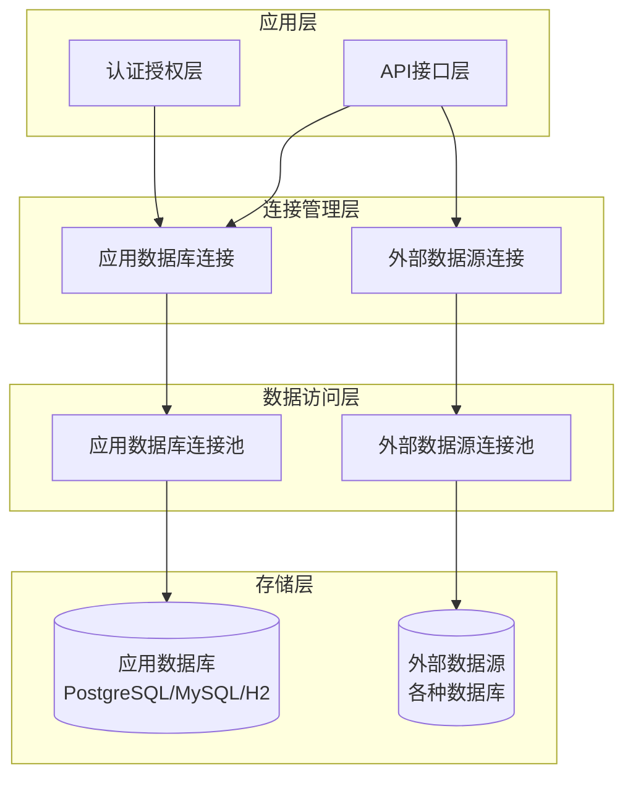

**图表来源**
- [connection.clj](file://src/metabase/app_db/connection.clj#L1-L50)
- [connection.clj](file://src/metabase/driver/sql_jdbc/connection.clj#L1-L50)

## 应用数据库连接管理

### ApplicationDB记录结构

ApplicationDB是Metabase的核心组件，负责管理应用数据库的连接和事务处理：

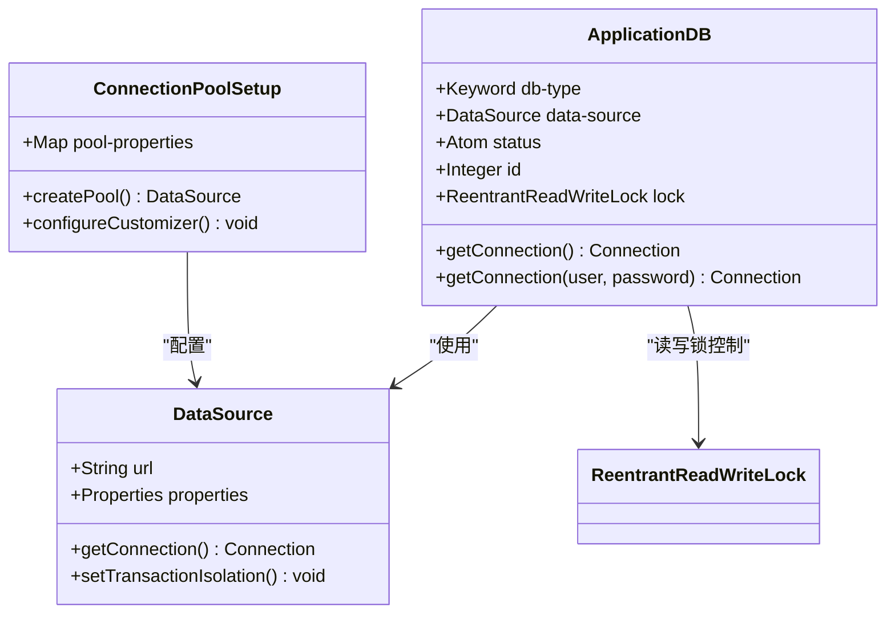

**图表来源**
- [connection.clj](file://src/metabase/app_db/connection.clj#L30-L60)
- [connection_pool_setup.clj](file://src/metabase/app_db/connection_pool_setup.clj#L120-L152)

### 连接池配置特点

应用数据库连接池采用C3P0实现，具有以下特点：

| 配置项 | 应用数据库 | 外部数据源 |
|--------|------------|------------|
| 最大连接数 | 可配置，默认15 | 可配置，默认值较低 |
| 空闲连接测试 | 每60秒测试一次 | 每3小时测试一次 |
| 最大空闲时间 | 10分钟 | 3小时 |
| 连接超时检测 | 启用 | 可选启用 |
| 自动清理 | PostgreSQL自动DISCARD ALL | 手动清理 |

**节来源**
- [connection_pool_setup.clj](file://src/metabase/app_db/connection_pool_setup.clj#L85-L150)
- [connection.clj](file://src/metabase/driver/sql_jdbc/connection.clj#L70-L120)

### 读写锁控制机制

ApplicationDB实现了细粒度的读写锁控制：

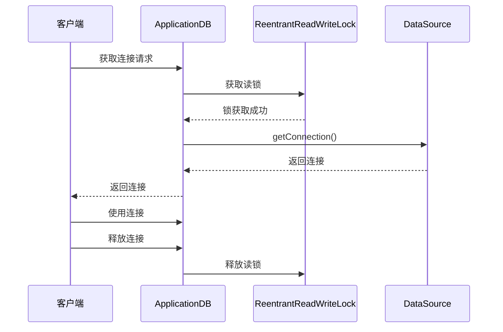

**图表来源**
- [connection.clj](file://src/metabase/app_db/connection.clj#L45-L65)

**节来源**
- [connection.clj](file://src/metabase/app_db/connection.clj#L30-L80)

## 外部数据源连接管理

### 数据库路由架构

外部数据源通过数据库路由系统进行统一管理：

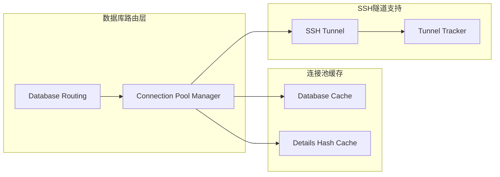

**图表来源**
- [connection.clj](file://src/metabase/driver/sql_jdbc/connection.clj#L270-L320)
- [database_routing/core.clj](file://src/metabase/database_routing/core.clj#L1-L44)

### 连接池配置差异

外部数据源连接池配置更加灵活，针对不同数据库类型优化：

| 特性 | 应用数据库 | 外部数据源 |
|------|------------|------------|
| 默认最小连接数 | 1 | 0 |
| 连接获取增量 | 1 | 3 |
| 超时重试次数 | 0次（生产环境） | 1次（测试环境） |
| 连接泄漏检测 | 启用 | 可选启用 |
| 动态密码更新 | 支持Azure Managed Identity | 支持多种认证方式 |

**节来源**
- [connection.clj](file://src/metabase/driver/sql_jdbc/connection.clj#L70-L150)

## 核心组件对比分析

### 连接生命周期管理

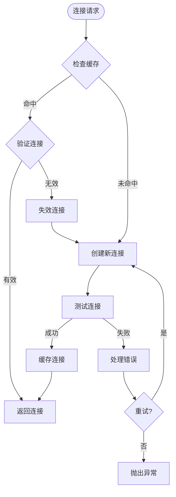

**图表来源**
- [connection.clj](file://src/metabase/driver/sql_jdbc/connection.clj#L270-L350)

### 事务处理对比

| 事务特性 | 应用数据库 | 外部数据源 |
|----------|------------|------------|
| 嵌套事务支持 | Savepoint实现 | 驱动程序原生支持 |
| 事务隔离级别 | 显式设置READ_COMMITTED | 根据驱动程序默认值 |
| 自动提交控制 | 精确控制 | 部分支持 |
| 死锁避免 | 无锁设计 | 连接池锁机制 |

**节来源**
- [connection.clj](file://src/metabase/app_db/connection.clj#L130-L210)
- [connection.clj](file://src/metabase/driver/sql_jdbc/connection.clj#L150-L200)

## 连接池配置差异

### 应用数据库连接池配置

应用数据库连接池针对高并发场景进行了优化：

```clojure
;; 应用数据库连接池配置示例
{
  "idleConnectionTestPeriod" 60
  "connectionCustomizerClassName" "MetabaseConnectionCustomizer"
  "maxIdleTimeExcessConnections" 600
  "maxConnectionAge" 3600
  "maxPoolSize" 15
}
```

### 外部数据源连接池配置

外部数据源连接池更加保守，注重稳定性和可靠性：

```clojure
;; 外部数据源连接池配置示例  
{
  "acquireIncrement" 1
  "acquireRetryAttempts" 0
  "maxIdleTime" 10800
  "minPoolSize" 0
  "initialPoolSize" 0
  "maxPoolSize" 10
  "testConnectionOnCheckout" true
  "unreturnedConnectionTimeout" 300
}
```

**节来源**
- [connection_pool_setup.clj](file://src/metabase/app_db/connection_pool_setup.clj#L95-L150)
- [connection.clj](file://src/metabase/driver/sql_jdbc/connection.clj#L70-L120)

## 事务处理机制

### 应用数据库事务处理

应用数据库实现了精确控制的事务处理机制：

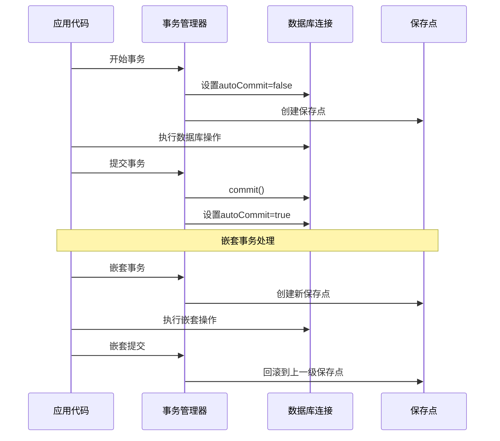

**图表来源**
- [connection.clj](file://src/metabase/app_db/connection.clj#L130-L180)

### 外部数据源事务处理

外部数据源依赖驱动程序的事务支持：

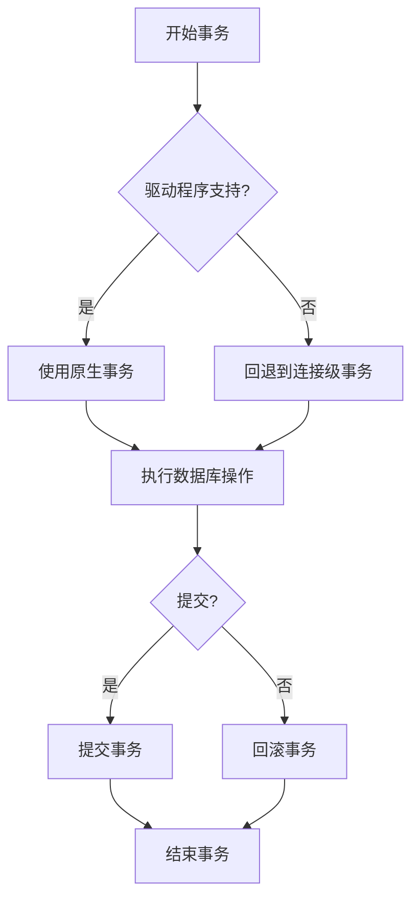

**图表来源**
- [connection.clj](file://src/metabase/driver/sql_jdbc/connection.clj#L150-L200)

**节来源**
- [connection.clj](file://src/metabase/app_db/connection.clj#L130-L210)

## 安全控制对比

### 认证机制差异

| 安全特性 | 应用数据库 | 外部数据源 |
|----------|------------|------------|
| 密码加密存储 | 支持透明加密 | 驱动程序原生支持 |
| Azure Managed Identity | 内置支持 | 驱动程序支持 |
| AWS IAM认证 | 支持 | 驱动程序支持 |
| SSL/TLS配置 | 统一处理 | 驱动程序特定 |
| 连接字符串安全 | 敏感信息脱敏 | 环境变量保护 |

### 动态密码管理

应用数据库支持动态密码更新机制：

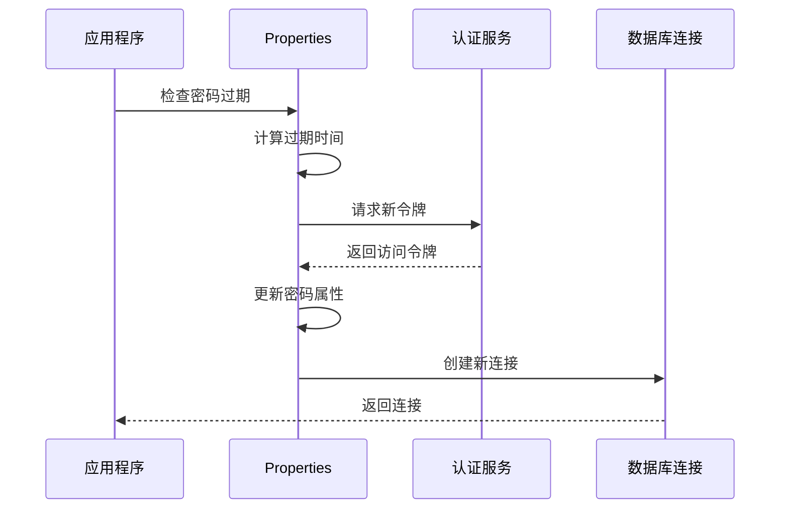

**图表来源**
- [data_source.clj](file://src/metabase/app_db/data_source.clj#L30-L60)

**节来源**
- [data_source.clj](file://src/metabase/app_db/data_source.clj#L30-L80)
- [env.clj](file://src/metabase/app_db/env.clj#L150-L200)

## 性能特征分析

### 连接获取性能

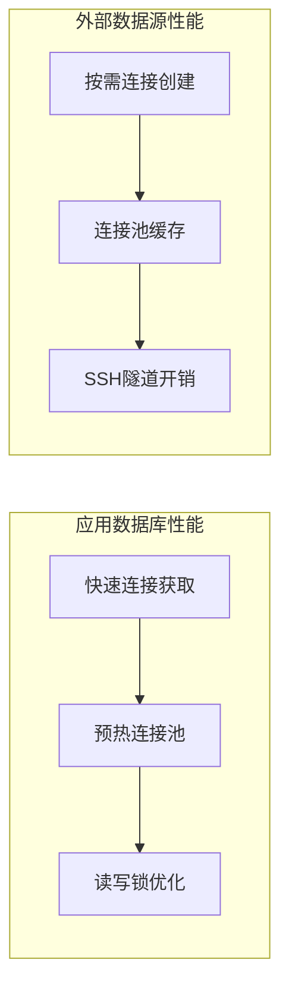

### 性能指标对比

| 性能指标 | 应用数据库 | 外部数据源 |
|----------|------------|------------|
| 平均连接延迟 | < 1ms | 10-50ms |
| 连接池预热时间 | 几秒 | 几十秒 |
| 并发连接数 | 高（15+） | 中等（1-10） |
| 内存占用 | 较低 | 较高 |
| CPU开销 | 低 | 中等 |

### 查询执行性能

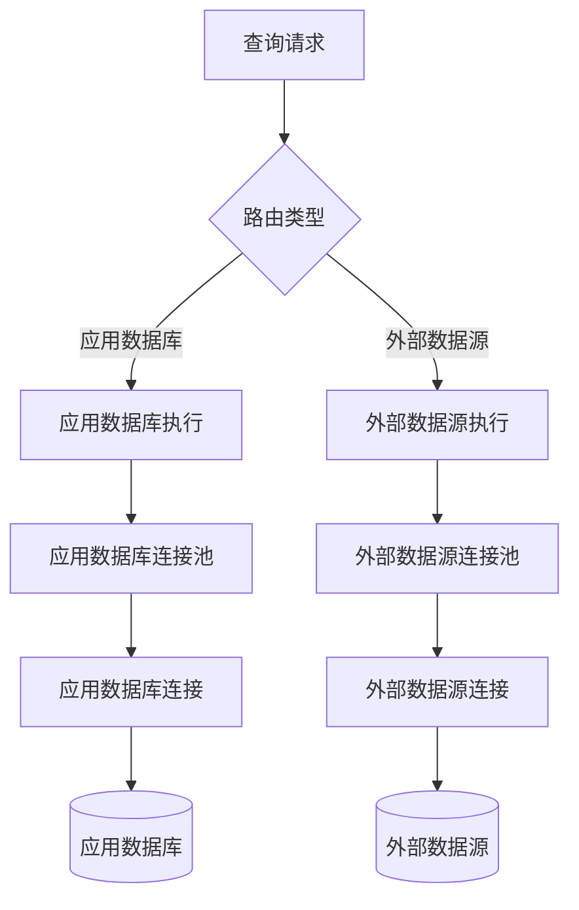

**图表来源**
- [query.clj](file://src/metabase/app_db/query.clj#L120-L180)

**节来源**
- [query.clj](file://src/metabase/app_db/query.clj#L120-L200)

## 选择指导原则

### 应用数据库连接策略

**适用场景：**
- 元数据存储
- 用户会话管理
- 查询历史记录
- 系统配置管理
- 权限控制数据

**推荐配置：**
- 生产环境使用PostgreSQL或MySQL
- 开发环境可使用H2
- 配置适当的连接池大小
- 启用连接健康检查

### 外部数据源连接策略

**适用场景：**
- 分析型数据仓库
- 业务数据源
- 报表数据源
- 实时数据集成

**推荐配置：**
- 根据数据源负载调整连接池大小
- 启用连接泄漏检测
- 配置合理的超时参数
- 考虑网络延迟影响

### 混合部署建议

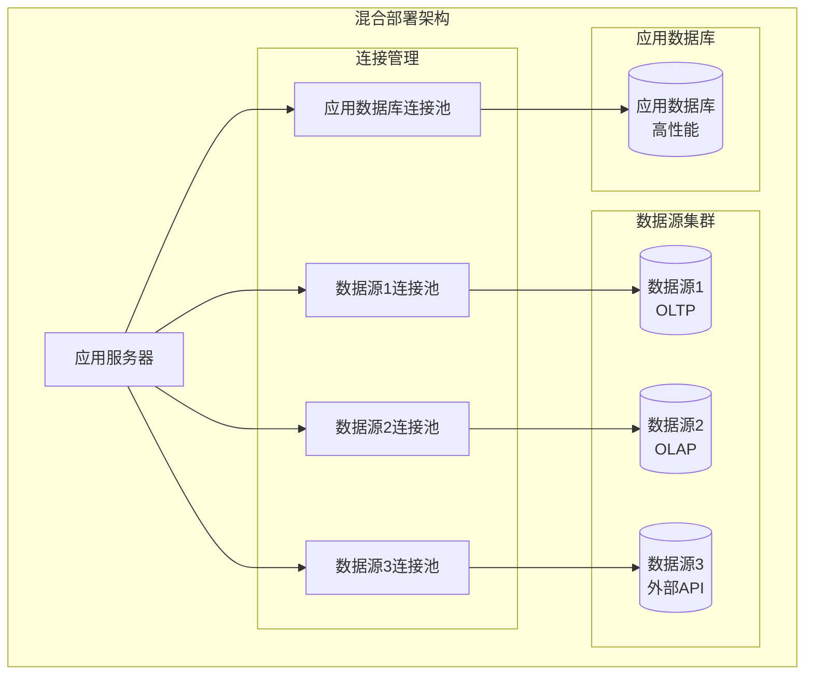

**图表来源**
- [core.clj](file://src/metabase/app_db/core.clj#L50-L100)

## 总结

Metabase的数据库连接管理架构体现了现代商业智能平台的设计精髓。应用数据库和外部数据源的连接管理各有侧重：

**应用数据库连接管理的优势：**
- 精确的事务控制
- 高效的连接池管理
- 强大的安全特性
- 统一的管理界面

**外部数据源连接管理的优势：**
- 灵活的驱动程序支持
- 丰富的认证选项
- 网络安全考虑
- 多样化的数据源适配

**最佳实践建议：**
1. 根据数据访问模式选择合适的连接管理策略
2. 在生产环境中优先考虑应用数据库的稳定性
3. 对于外部数据源，重视连接池的合理配置
4. 定期监控连接池性能指标
5. 实施适当的安全防护措施

通过深入理解这两种连接管理方式的特点和差异，开发者可以更好地设计和优化Metabase系统的数据库访问层，确保系统的高性能、高可用性和安全性。