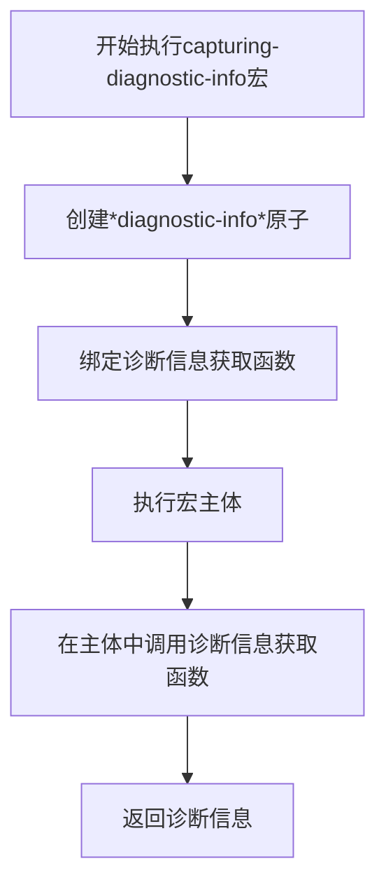
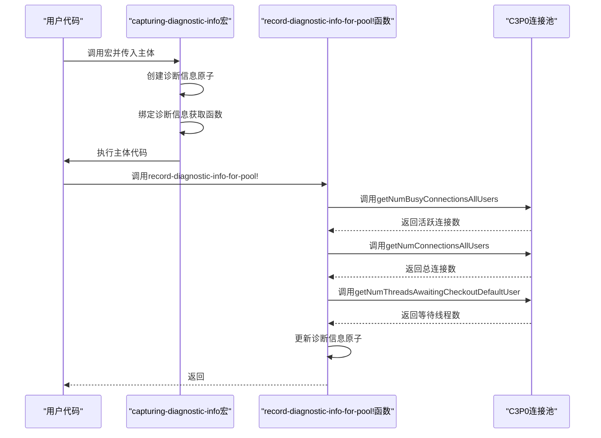
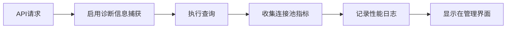
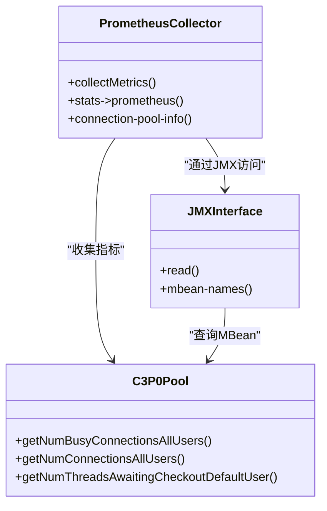

# 执行诊断

<cite>
**本文档中引用的文件**   
- [diagnostic.clj](file://src/metabase/driver/sql_jdbc/execute/diagnostic.clj)
- [execute.clj](file://src/metabase/driver/sql_jdbc/execute.clj)
- [log.clj](file://src/metabase/server/middleware/log.clj)
- [prometheus.clj](file://src/metabase/analytics/prometheus.clj)
- [connection.clj](file://src/metabase/driver/sql_jdbc/connection.clj)
</cite>

## 目录
1. [介绍](#介绍)
2. [诊断信息结构](#诊断信息结构)
3. [核心组件分析](#核心组件分析)
4. [使用场景和性能监控](#使用场景和性能监控)
5. [与其他监控系统的集成](#与其他监控系统的集成)
6. [实际使用示例](#实际使用示例)
7. [结论](#结论)

## 介绍
本文档详细介绍了Metabase系统中执行诊断功能的实现机制，重点阐述了如何使用`capturing-diagnostic-info`宏来捕获查询执行期间的诊断信息。文档涵盖了诊断信息的结构、使用场景、在性能监控中的应用，以及与其他监控系统的集成建议。通过分析C3P0连接池的性能指标收集机制，本文档为系统管理员和开发人员提供了深入了解Metabase数据库连接管理和性能监控的全面指南。

## 诊断信息结构
执行诊断功能收集的诊断信息以命名空间关键字的形式存储在映射(map)中，包含以下关键指标：

- `::database-id`：数据库ID
- `::driver`：数据库驱动类型
- `::active-connections`：连接池中的活跃连接数
- `::total-connections`：连接池中的总连接数
- `::threads-waiting`：等待获取连接的线程数

这些指标通过C3P0连接池的JMX接口获取，提供了数据库连接使用情况的实时视图。当活跃连接数接近最大连接数时，等待线程数的增加可以预警潜在的性能瓶颈。

**Section sources**
- [diagnostic.clj](file://src/metabase/driver/sql_jdbc/execute/diagnostic.clj#L32-L48)

## 核心组件分析

### capturing-diagnostic-info宏
`capturing-diagnostic-info`宏是执行诊断功能的核心，它通过动态绑定`*diagnostic-info*`原子来启用诊断信息捕获。该宏接受一个绑定形式和一个主体，将诊断信息获取函数绑定到指定的符号上。



**Diagram sources **
- [diagnostic.clj](file://src/metabase/driver/sql_jdbc/execute/diagnostic.clj#L18-L26)

### record-diagnostic-info-for-pool!函数
`record-diagnostic-info-for-pool!`函数负责从C3P0连接池收集具体的性能指标。该函数检查`*diagnostic-info*`是否已启用，如果启用则使用C3P0的API获取连接池状态并更新诊断信息。



**Diagram sources **
- [diagnostic.clj](file://src/metabase/driver/sql_jdbc/execute/diagnostic.clj#L32-L48)
- [execute.clj](file://src/metabase/driver/sql_jdbc/execute.clj#L211-L213)

## 使用场景和性能监控
执行诊断功能在多个场景中发挥重要作用，特别是在性能监控和故障排查方面。

### 性能监控场景
诊断信息被集成到系统的日志记录中间件中，为每个API请求提供详细的性能统计。这些信息包括：

- 应用数据库连接使用情况
- Jetty线程池状态
- 活跃查询数量
- 数据库连接等待情况



**Diagram sources **
- [log.clj](file://src/metabase/server/middleware/log.clj#L214-L224)

### 故障排查场景
当系统出现性能问题时，诊断信息可以帮助快速定位问题根源。例如，当等待线程数持续增加时，表明连接池可能成为瓶颈，需要调整连接池大小或优化查询性能。

**Section sources**
- [log.clj](file://src/metabase/server/middleware/log.clj#L59-L90)

## 与其他监控系统的集成
执行诊断功能与Prometheus监控系统深度集成，实现了指标的外部暴露和可视化。

### Prometheus集成
系统通过JMX接口收集C3P0连接池的详细指标，并将其转换为Prometheus格式的度量指标。这些指标包括：

- c3p0_max_pool_size：连接池最大大小
- c3p0_min_pool_size：连接池最小大小
- c3p0_num_connections：连接总数
- c3p0_num_idle_connections：空闲连接数
- c3p0_num_busy_connections：忙碌连接数
- c3p0_num_threads_awaiting_checkout_default_user：等待检查出的线程数



**Diagram sources **
- [prometheus.clj](file://src/metabase/analytics/prometheus.clj#L118-L141)
- [prometheus.clj](file://src/metabase/analytics/prometheus.clj#L141-L171)

## 实际使用示例
以下示例展示了如何在代码中使用执行诊断功能：

```clojure
(sql-jdbc.execute.diagnostic/capturing-diagnostic-info [diag-info-fn]
  ;; 执行数据库查询
  (execute-query driver database query)
  ;; 获取诊断信息
  (let [diag-info (diag-info-fn)]
    (when diag-info
      (log/info (format "数据库 %s 连接: %d/%d (%d 线程等待)"
                       (::database-id diag-info)
                       (::active-connections diag-info)
                       (::total-connections diag-info)
                       (::threads-waiting diag-info))))))
```

在实际应用中，此功能被集成到服务器中间件中，自动为所有API请求收集诊断信息：

```clojure
(defn log-api-call
  "记录API调用信息，包括性能统计和诊断信息。"
  [handler]
  (fn [request respond raise]
    (if-not (should-log-request? request)
      (handler request respond raise)
      (t2/with-call-count [call-count-fn]
        (sql-jdbc.execute.diagnostic/capturing-diagnostic-info [diag-info-fn]
          (let [info {:request request
                      :start-time (u/start-timer)
                      :call-count-fn call-count-fn
                      :diag-info-fn diag-info-fn}]
            (handler request respond raise)))))))
```

**Section sources**
- [execute.clj](file://src/metabase/driver/sql_jdbc/execute.clj#L207-L213)
- [log.clj](file://src/metabase/server/middleware/log.clj#L214-L224)

## 结论
执行诊断功能为Metabase系统提供了强大的性能监控能力。通过`capturing-diagnostic-info`宏和`record-diagnostic-info-for-pool!`函数的协同工作，系统能够实时收集和分析数据库连接池的使用情况。这些诊断信息不仅用于内部日志记录和性能分析，还通过Prometheus集成实现了外部监控和告警。对于系统管理员而言，这些功能提供了宝贵的洞察力，有助于优化系统性能、预防潜在问题并快速响应故障。建议在生产环境中启用这些诊断功能，并结合Prometheus等监控系统建立全面的性能监控体系。