# 查询执行流程

<cite>
**本文档中引用的文件**
- [execute.clj](file://src/metabase/driver/sql_jdbc/execute.clj)
- [pipeline.clj](file://src/metabase/query_processor/pipeline.clj)
- [query_cancelation.clj](file://src/metabase/app_db/query_cancelation.clj)
- [connection.clj](file://src/metabase/driver/sql_jdbc/connection.clj)
- [streaming.clj](file://src/metabase/query_processor/streaming.clj)
- [limit.clj](file://src/metabase/query_processor/middleware/limit.clj)
- [reducible.clj](file://src/metabase/query_processor/reducible.clj)
</cite>

## 目录
1. [简介](#简介)
2. [系统架构概览](#系统架构概览)
3. [核心执行流程](#核心执行流程)
4. [连接管理与生命周期](#连接管理与生命周期)
5. [查询执行阶段详解](#查询执行阶段详解)
6. [错误处理与取消机制](#错误处理与取消机制)
7. [性能优化策略](#性能优化策略)
8. [中间件系统](#中间件系统)
9. [流式处理与结果转换](#流式处理与结果转换)
10. [故障排除指南](#故障排除指南)
11. [总结](#总结)

## 简介

Metabase的查询执行流程是一个高度优化的、分层的系统，负责从用户请求到最终结果返回的整个过程。该系统采用可还原（reducible）查询模型，支持流式处理、并发控制和优雅的错误处理机制。

查询执行流程的核心特点包括：
- 基于可还原集合的高效数据处理
- 完整的连接生命周期管理
- 强大的取消和超时机制
- 分层的中间件架构
- 流式输出支持大结果集

## 系统架构概览

查询执行系统采用分层架构设计，主要包含以下层次：

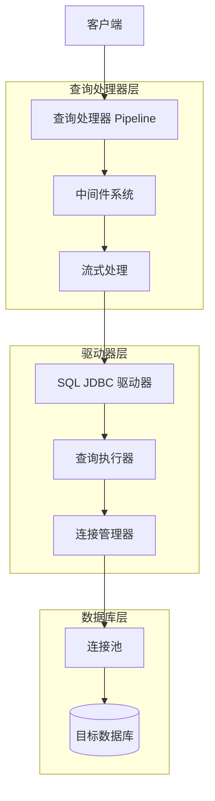

**图表来源**
- [pipeline.clj](file://src/metabase/query_processor/pipeline.clj#L1-L130)
- [execute.clj](file://src/metabase/driver/sql_jdbc/execute.clj#L1-L970)

## 核心执行流程

### execute-reducible-query 函数入口

查询执行的起点是 `execute-reducible-query` 函数，它作为所有SQL JDBC驱动器的标准实现：

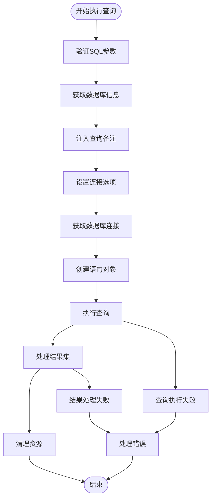

**图表来源**
- [execute.clj](file://src/metabase/driver/sql_jdbc/execute.clj#L748-L792)

**章节来源**
- [execute.clj](file://src/metabase/driver/sql_jdbc/execute.clj#L748-L792)

### do-with-connection-with-options 连接管理

`do-with-connection-with-options` 是连接生命周期管理的核心函数，负责：

1. **连接获取与配置**：根据数据库规范获取连接池连接
2. **事务隔离级别设置**：自动选择最适合的事务隔离级别
3. **只读模式配置**：根据查询类型设置连接为只读或读写
4. **会话时区设置**：配置适当的数据库会话时区
5. **连接保持策略**：管理连接的打开和关闭

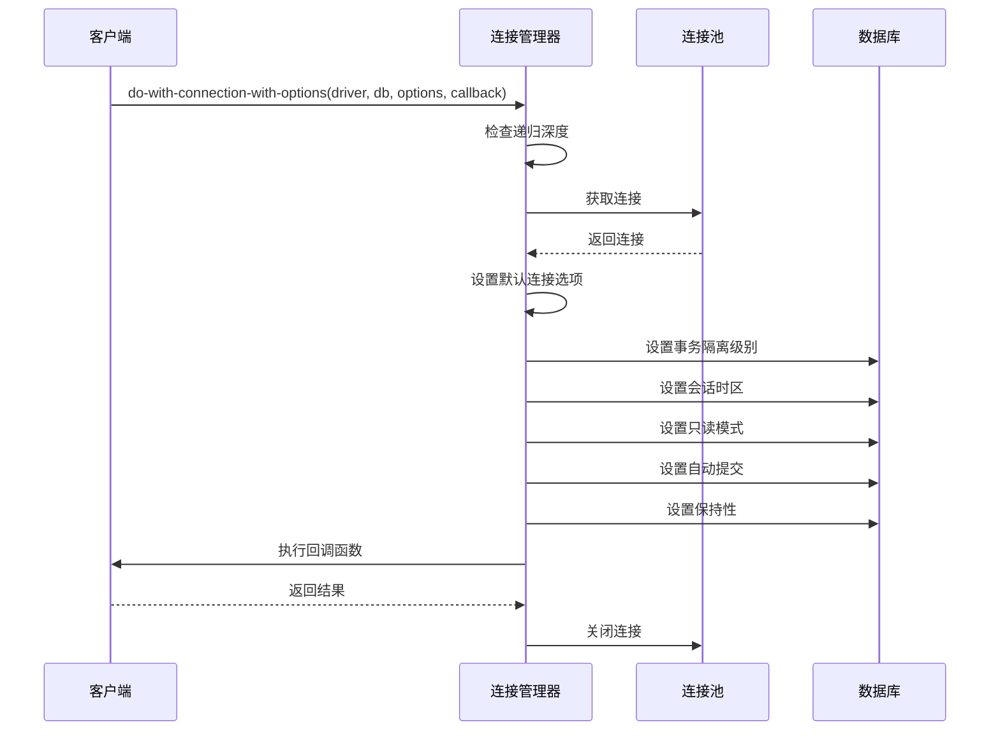

**图表来源**
- [execute.clj](file://src/metabase/driver/sql_jdbc/execute.clj#L339-L410)

**章节来源**
- [execute.clj](file://src/metabase/driver/sql_jdbc/execute.clj#L67-L128)

## 连接管理与生命周期

### 连接选项配置

连接管理器支持多种配置选项：

| 选项 | 类型 | 描述 | 默认值 |
|------|------|------|--------|
| `session-timezone` | 字符串 | 数据库会话时区 | 当前系统时区 |
| `write?` | 布尔值 | 是否允许写操作 | false |
| `download?` | 布尔值 | 是否为下载操作 | false |
| `keep-open?` | 布尔值 | 是否保持连接打开 | false |

### 事务隔离级别自动选择

系统会根据数据库支持情况自动选择最优的事务隔离级别：

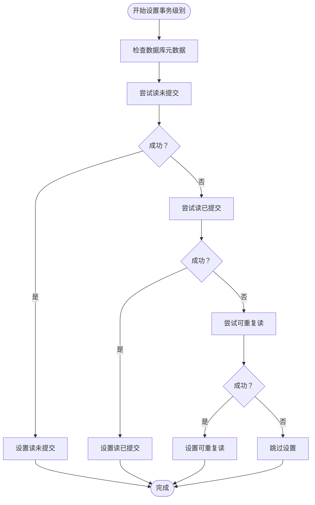

**图表来源**
- [execute.clj](file://src/metabase/driver/sql_jdbc/execute.clj#L245-L272)

**章节来源**
- [execute.clj](file://src/metabase/driver/sql_jdbc/execute.clj#L245-L272)

## 查询执行阶段详解

### 语句创建与准备

查询执行分为多个阶段，每个阶段都有特定的职责：

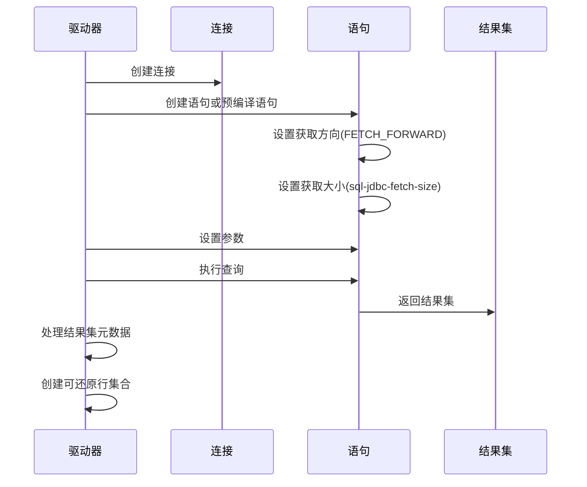

**图表来源**
- [execute.clj](file://src/metabase/driver/sql_jdbc/execute.clj#L564-L620)

### 取消机制实现

查询取消机制通过异步通道实现：

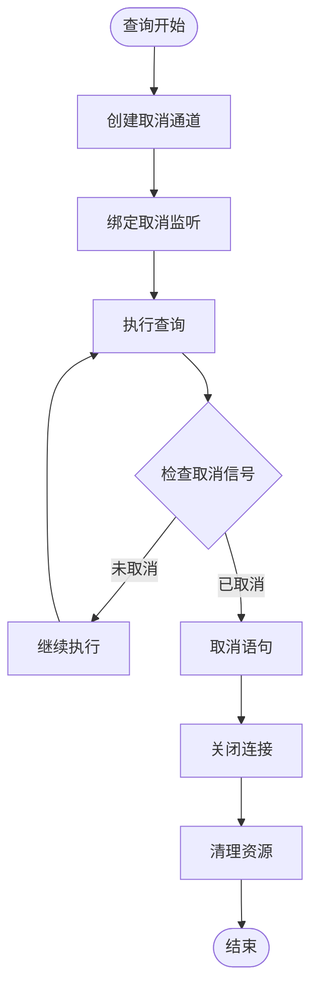

**图表来源**
- [execute.clj](file://src/metabase/driver/sql_jdbc/execute.clj#L530-L563)

**章节来源**
- [execute.clj](file://src/metabase/driver/sql_jdbc/execute.clj#L530-L563)

## 错误处理与取消机制

### 查询取消异常检测

系统针对不同数据库实现了专门的取消异常检测：

| 数据库类型 | 检测方法 | 错误码范围 |
|------------|----------|------------|
| H2 | 错误码检查 | STATEMENT_WAS_CANCELED |
| PostgreSQL | SQL状态检查 | QUERY_CANCELED |
| MySQL/MariaDB | 错误码检查 | 1317, 1969, 3024 |

### 取消通道机制

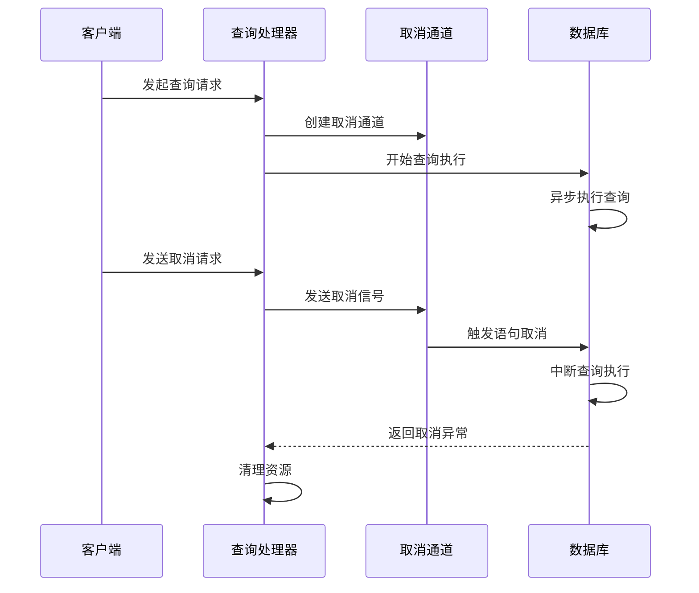

**图表来源**
- [query_cancelation.clj](file://src/metabase/app_db/query_cancelation.clj#L1-L54)

**章节来源**
- [query_cancelation.clj](file://src/metabase/app_db/query_cancelation.clj#L1-L54)

## 性能优化策略

### 连接池配置优化

连接池采用C3P0实现，支持动态配置：

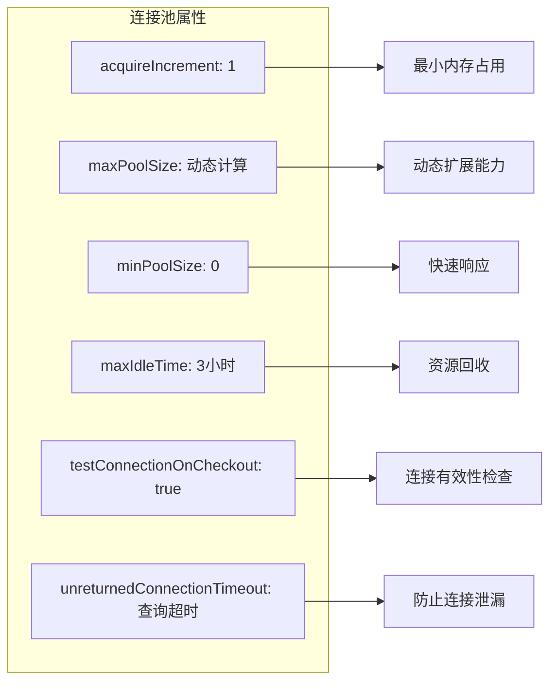

**图表来源**
- [connection.clj](file://src/metabase/driver/sql_jdbc/connection.clj#L80-L150)

### 结果集处理优化

系统采用多种策略优化大数据集处理：

1. **流式处理**：避免将整个结果集加载到内存
2. **分块处理**：定期将临时数据写入磁盘
3. **限制机制**：防止查询返回过多数据
4. **索引重排**：优化列顺序以提高导出效率

**章节来源**
- [connection.clj](file://src/metabase/driver/sql_jdbc/connection.clj#L80-L150)

## 中间件系统

### 中间件执行顺序

查询处理器采用管道模式，中间件按特定顺序执行：

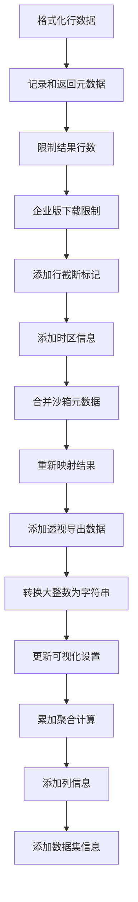

**图表来源**
- [postprocess.clj](file://src/metabase/query_processor/postprocess.clj#L21-L57)

### 限制中间件

限制中间件负责控制查询结果大小：

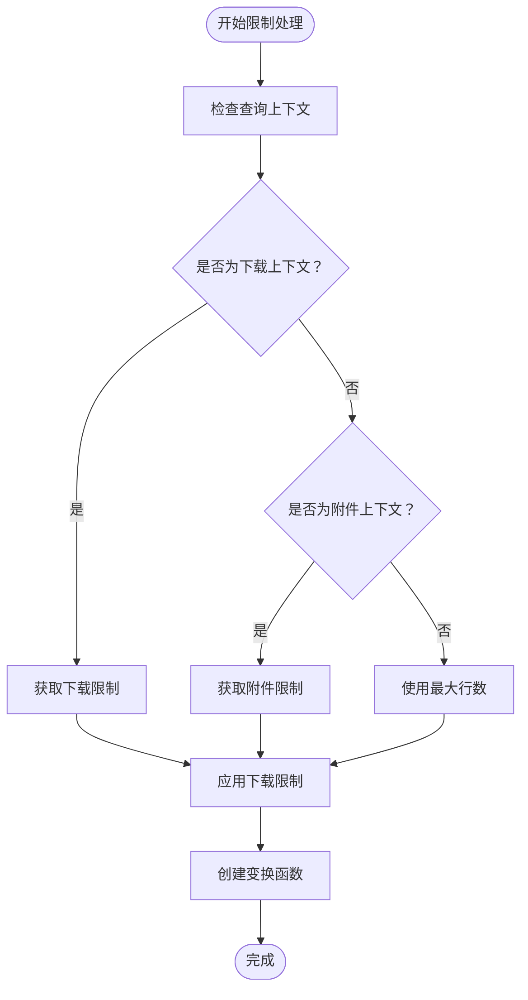

**图表来源**
- [limit.clj](file://src/metabase/query_processor/middleware/limit.clj#L57-L101)

**章节来源**
- [limit.clj](file://src/metabase/query_processor/middleware/limit.clj#L57-L101)

## 流式处理与结果转换

### 流式响应生成

系统支持多种导出格式的流式处理：

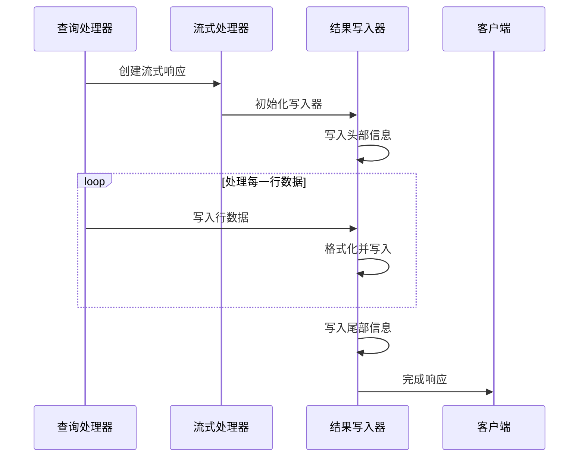

**图表来源**
- [streaming.clj](file://src/metabase/query_processor/streaming.clj#L195-L265)

### 可还原行处理

系统使用可还原集合来高效处理大量数据：

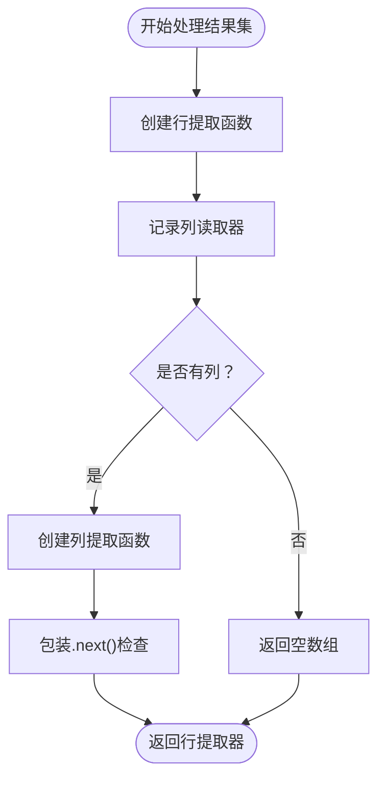

**图表来源**
- [execute.clj](file://src/metabase/driver/sql_jdbc/execute.clj#L621-L670)

**章节来源**
- [streaming.clj](file://src/metabase/query_processor/streaming.clj#L195-L265)

## 故障排除指南

### 常见问题诊断

| 问题类型 | 症状 | 可能原因 | 解决方案 |
|----------|------|----------|----------|
| 查询超时 | 查询被中断 | 数据库响应慢或网络延迟 | 调整查询超时设置 |
| 连接泄漏 | 连接池耗尽 | 连接未正确关闭 | 检查连接生命周期管理 |
| 取消失败 | 查询无法终止 | 数据库不支持取消操作 | 使用数据库特定的取消方法 |
| 内存溢出 | 大查询导致OOM | 结果集过大 | 启用流式处理或限制结果大小 |

### 性能监控指标

关键性能指标包括：

- **连接获取时间**：从连接池获取连接所需的时间
- **查询执行时间**：数据库查询的实际执行时间
- **结果处理时间**：结果集转换和处理的时间
- **取消响应时间**：查询取消信号的响应时间

**章节来源**
- [execute.clj](file://src/metabase/driver/sql_jdbc/execute.clj#L768-L792)

## 总结

Metabase的查询执行流程是一个精心设计的、高度优化的系统，具有以下核心优势：

1. **模块化架构**：清晰的分层设计便于维护和扩展
2. **强大的错误处理**：完善的异常捕获和恢复机制
3. **灵活的取消机制**：支持多种取消场景和数据库类型
4. **高性能处理**：流式处理和连接池优化
5. **可扩展中间件**：支持功能增强和定制

该系统为现代数据分析平台提供了可靠、高效的查询执行基础，能够处理从简单查询到复杂分析的各种场景需求。