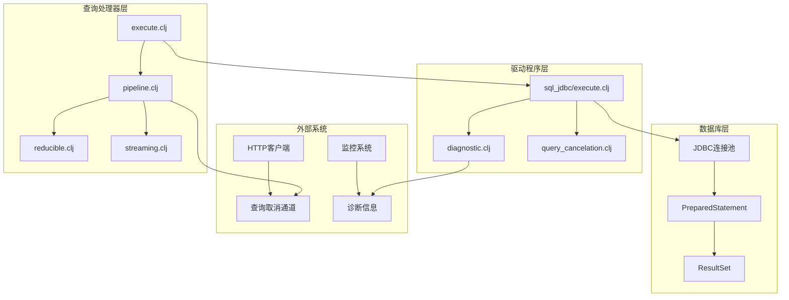
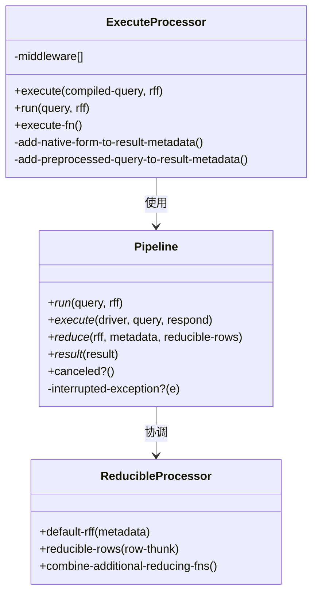
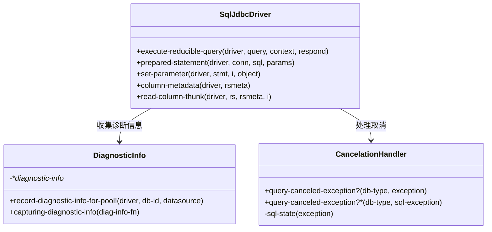
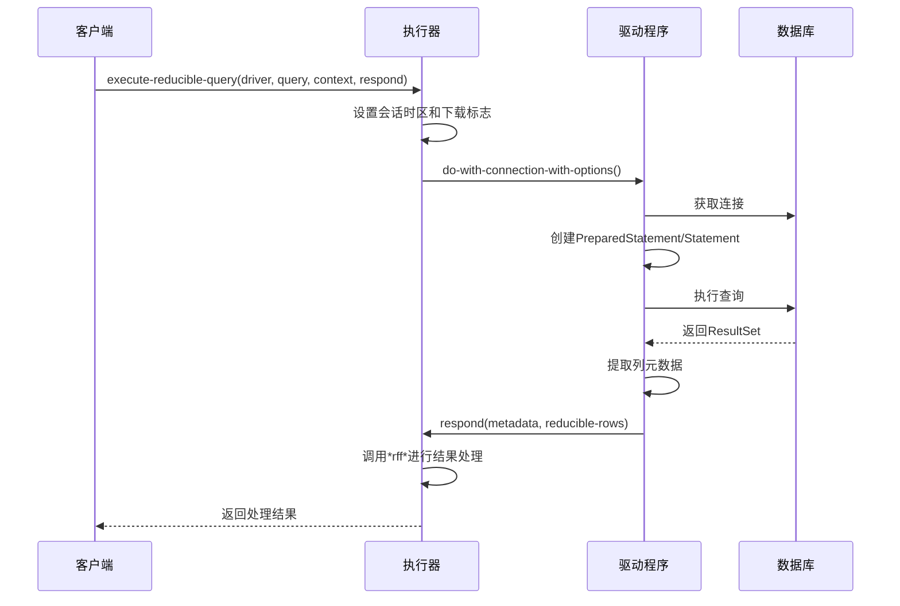
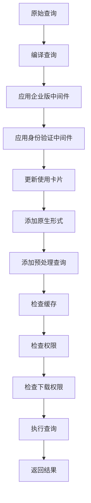
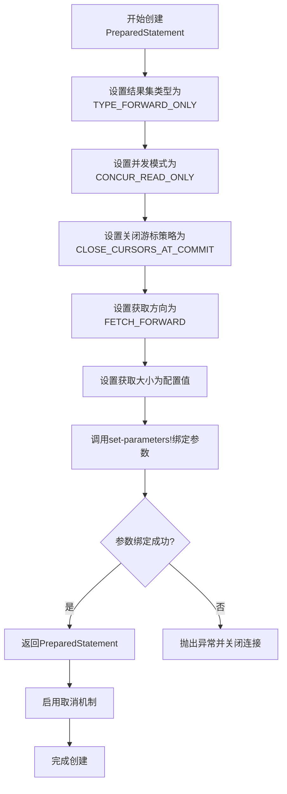
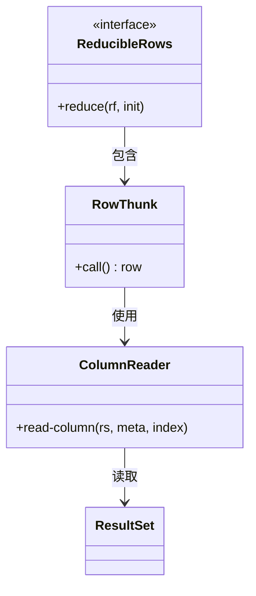
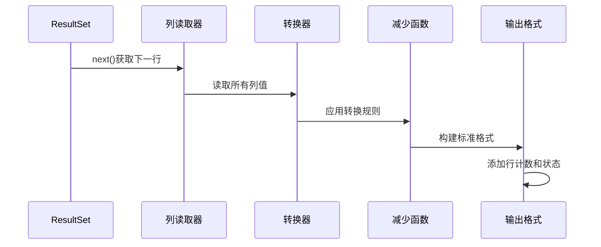
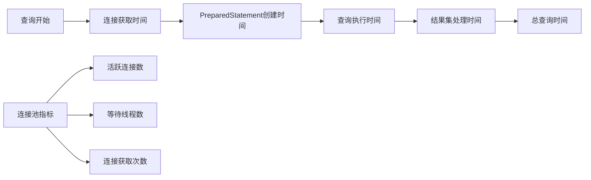

# 查询执行管道

<cite>
**本文档中引用的文件**
- [execute.clj](file://src/metabase/query_processor/execute.clj)
- [pipeline.clj](file://src/metabase/query_processor/pipeline.clj)
- [reducible.clj](file://src/metabase/query_processor/reducible.clj)
- [streaming.clj](file://src/metabase/query_processor/streaming.clj)
- [execute.clj](file://src/metabase/driver/sql_jdbc/execute.clj)
- [diagnostic.clj](file://src/metabase/driver/sql_jdbc/execute/diagnostic.clj)
- [query_cancelation.clj](file://src/metabase/app_db/query_cancelation.clj)
- [h2.clj](file://src/metabase/driver/h2.clj)
- [sql_jdbc.clj](file://src/metabase/driver/sql_jdbc.clj)
</cite>

## 目录
1. [简介](#简介)
2. [系统架构概览](#系统架构概览)
3. [核心组件分析](#核心组件分析)
4. [查询执行流程详解](#查询执行流程详解)
5. [PreparedStatement创建与参数绑定](#preparedstatement创建与参数绑定)
6. [结果集处理机制](#结果集处理机制)
7. [查询诊断与监控](#查询诊断与监控)
8. [取消机制与超时处理](#取消机制与超时处理)
9. [性能优化指南](#性能优化指南)
10. [故障排除指南](#故障排除指南)
11. [总结](#总结)

## 简介

Metabase的查询执行管道是一个高度优化的系统，负责将SQL查询从用户请求转换为最终的结果集。该管道采用流式处理架构，支持大结果集的高效处理，并提供了完善的错误处理、取消机制和性能监控功能。

查询执行管道的核心特点包括：
- **流式处理**：使用可缩减（reducible）集合处理大型结果集
- **连接管理**：智能的数据库连接池管理和生命周期控制
- **参数化查询**：安全的PreparedStatement创建和参数绑定
- **实时监控**：详细的查询诊断信息收集
- **取消支持**：优雅的查询取消和超时处理机制

## 系统架构概览

查询执行管道采用分层架构设计，主要包含以下层次：



**图表来源**
- [execute.clj](file://src/metabase/query_processor/execute.clj#L1-L100)
- [pipeline.clj](file://src/metabase/query_processor/pipeline.clj#L1-L130)
- [execute.clj](file://src/metabase/driver/sql_jdbc/execute.clj#L1-L970)

## 核心组件分析

### 查询处理器核心

查询处理器是整个管道的核心，负责协调各个组件的工作：



**图表来源**
- [execute.clj](file://src/metabase/query_processor/execute.clj#L25-L100)
- [pipeline.clj](file://src/metabase/query_processor/pipeline.clj#L50-L130)
- [reducible.clj](file://src/metabase/query_processor/reducible.clj#L15-L117)

**章节来源**
- [execute.clj](file://src/metabase/query_processor/execute.clj#L1-L100)
- [pipeline.clj](file://src/metabase/query_processor/pipeline.clj#L1-L130)
- [reducible.clj](file://src/metabase/query_processor/reducible.clj#L1-L117)

### 驱动程序接口

SQL JDBC驱动程序提供了统一的查询执行接口：



**图表来源**
- [execute.clj](file://src/metabase/driver/sql_jdbc/execute.clj#L745-L806)
- [diagnostic.clj](file://src/metabase/driver/sql_jdbc/execute/diagnostic.clj#L1-L50)
- [query_cancelation.clj](file://src/metabase/app_db/query_cancelation.clj#L1-L54)

**章节来源**
- [execute.clj](file://src/metabase/driver/sql_jdbc/execute.clj#L745-L806)
- [diagnostic.clj](file://src/metabase/driver/sql_jdbc/execute/diagnostic.clj#L1-L50)
- [query_cancelation.clj](file://src/metabase/app_db/query_cancelation.clj#L1-L54)

## 查询执行流程详解

### execute-reducible-query函数协调机制

`execute-reducible-query`函数是查询执行管道的核心协调器，它负责：

1. **查询准备阶段**：设置会话时区、下载模式等上下文信息
2. **连接获取阶段**：从连接池获取数据库连接
3. **语句创建阶段**：根据查询类型创建PreparedStatement或Statement
4. **执行阶段**：执行查询并获取结果集
5. **结果处理阶段**：通过回调函数传递结果元数据和可缩减行



**图表来源**
- [execute.clj](file://src/metabase/driver/sql_jdbc/execute.clj#L745-L806)
- [pipeline.clj](file://src/metabase/query_processor/pipeline.clj#L50-L130)

### 中间件管道处理

查询处理器使用中间件管道对查询进行预处理和后处理：



**图表来源**
- [execute.clj](file://src/metabase/query_processor/execute.clj#L45-L70)

**章节来源**
- [execute.clj](file://src/metabase/query_processor/execute.clj#L45-L100)
- [pipeline.clj](file://src/metabase/query_processor/pipeline.clj#L50-L130)

## PreparedStatement创建与参数绑定

### PreparedStatement创建流程

PreparedStatement的创建过程包含多个优化步骤：



**图表来源**
- [execute.clj](file://src/metabase/driver/sql_jdbc/execute.clj#L600-L650)

### 参数绑定机制

参数绑定采用多态方法，支持不同类型的数据：

| 数据类型 | JDBC类型 | 绑定方法 | 特殊处理 |
|---------|----------|----------|----------|
| LocalDate | Types.DATE | set-object | 直接绑定日期 |
| LocalTime | Types.TIME | set-object | 直接绑定时间 |
| LocalDateTime | Types.TIMESTAMP | set-object | 直接绑定时间戳 |
| OffsetDateTime | Types.TIMESTAMP_WITH_TIMEZONE | set-object | 直接绑定带时区时间戳 |
| ZonedDateTime | Types.TIMESTAMP_WITH_TIMEZONE | set-object | 转换为OffsetDateTime |
| Instant | Types.TIMESTAMP | set-object | 转换为UTC偏移时间 |

**章节来源**
- [execute.clj](file://src/metabase/driver/sql_jdbc/execute.clj#L550-L650)

## 结果集处理机制

### 可缩减行处理

可缩减行（Reducible Rows）是流式处理的核心概念：



**图表来源**
- [reducible.clj](file://src/metabase/query_processor/reducible.clj#L45-L76)

### 结果转换流程

结果集通过多个转换步骤被处理为标准格式：



**图表来源**
- [reducible.clj](file://src/metabase/query_processor/reducible.clj#L15-L45)

**章节来源**
- [reducible.clj](file://src/metabase/query_processor/reducible.clj#L1-L117)

## 查询诊断与监控

### 诊断信息收集

查询执行过程中会收集详细的诊断信息：


**图表来源**
- [diagnostic.clj](file://src/metabase/driver/sql_jdbc/execute/diagnostic.clj#L35-L50)

### 连接池监控指标

| 指标名称 | 描述 | 用途 |
|---------|------|------|
| ::active-connections | 当前活跃连接数 | 监控连接池压力 |
| ::total-connections | 总连接数 | 评估连接池配置 |
| ::threads-waiting | 等待获取连接的线程数 | 检测连接池瓶颈 |
| ::database-id | 数据库标识符 | 关联诊断信息 |
| ::driver | 驱动程序类型 | 分析不同驱动的性能特征 |

**章节来源**
- [diagnostic.clj](file://src/metabase/driver/sql_jdbc/execute/diagnostic.clj#L1-L50)

## 取消机制与超时处理

### 取消机制架构

查询取消机制通过异步通道实现：

```mermaid
graph TB
subgraph "HTTP层"
A[客户端请求] --> B[连接关闭检测]
B --> C[canceled-chan]
end
subgraph "查询处理器层"
D[查询执行] --> E[定期检查canceled-chan]
E --> F{是否已取消?}
F --> |是| G[抛出InterruptedException]
F --> |否| H[继续执行]
G --> I[清理资源]
H --> D
end
subgraph "数据库层"
J[Statement对象] --> K[Statement.cancel()]
K --> L[中断数据库操作]
end
C --> D
I --> J
```

**图表来源**
- [pipeline.clj](file://src/metabase/query_processor/pipeline.clj#L10-L50)
- [execute.clj](file://src/metabase/driver/sql_jdbc/execute.clj#L780-L795)

### 不同数据库的取消处理

| 数据库类型 | 取消方式 | 错误代码 | 实现细节 |
|-----------|----------|----------|----------|
| H2 | STATEMENT_WAS_CANCELED | ErrorCode/STATEMENT_WAS_CANCELED | 直接检查错误码 |
| PostgreSQL | QUERY_CANCELED | PSQLState/QUERY_CANCELED | 检查SQL状态 |
| MySQL/MariaDB | 超时/连接终止 | 1317, 1969, 3024 | 多种错误码支持 |

**章节来源**
- [query_cancelation.clj](file://src/metabase/app_db/query_cancelation.clj#L1-L54)
- [pipeline.clj](file://src/metabase/query_processor/pipeline.clj#L100-L130)

## 性能优化指南

### 查询性能优化策略

1. **连接池优化**
   - 合理配置最大连接数
   - 监控连接池使用率
   - 实施连接预热机制

2. **查询执行优化**
   - 使用PreparedStatement减少解析开销
   - 设置合适的fetch size
   - 实施查询超时控制

3. **结果集处理优化**
   - 采用流式处理避免内存溢出
   - 实施结果集分页
   - 使用压缩传输大结果集

### 性能监控指标



**图表来源**
- [diagnostic.clj](file://src/metabase/driver/sql_jdbc/execute/diagnostic.clj#L35-L50)

## 故障排除指南

### 常见问题诊断

1. **查询超时问题**
   - 检查数据库连接状态
   - 分析查询执行计划
   - 调整查询超时设置

2. **内存溢出问题**
   - 减少fetch size
   - 实施结果集分页
   - 优化查询范围

3. **连接池耗尽问题**
   - 增加最大连接数
   - 检查连接泄漏
   - 优化连接使用策略

### 调试工具和技巧

- 使用诊断信息监控连接池状态
- 启用详细日志记录查询执行过程
- 实施查询性能分析工具
- 监控取消事件和超时情况

**章节来源**
- [diagnostic.clj](file://src/metabase/driver/sql_jdbc/execute/diagnostic.clj#L1-L50)
- [query_cancelation.clj](file://src/metabase/app_db/query_cancelation.clj#L1-L54)

## 总结

Metabase的查询执行管道是一个精心设计的系统，它通过以下关键特性确保了高性能和可靠性：

1. **模块化架构**：清晰的分层设计使得各组件职责明确，易于维护和扩展
2. **流式处理**：可缩减行机制支持大结果集的高效处理，避免内存溢出
3. **智能取消**：多层次的取消机制确保系统响应及时，资源得到合理利用
4. **全面监控**：详细的诊断信息收集为性能优化和故障排除提供有力支持
5. **类型安全**：严格的类型检查和参数验证确保查询的安全性和正确性

该管道的设计充分考虑了生产环境的需求，提供了高可用性、高性能和高可靠性的查询执行能力，是现代数据分析平台的重要基础设施。