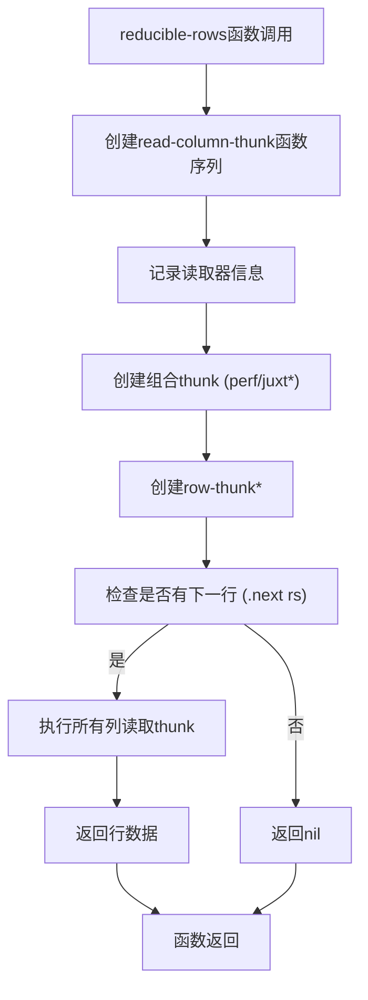
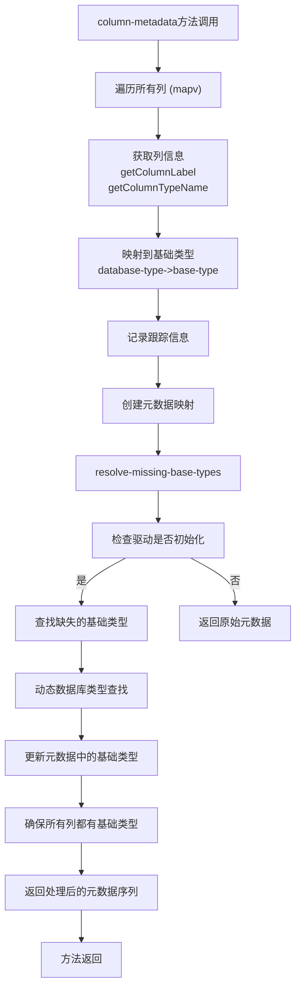
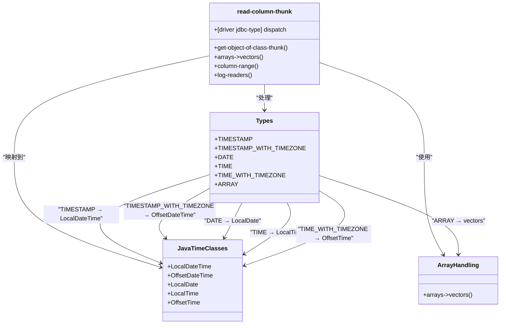
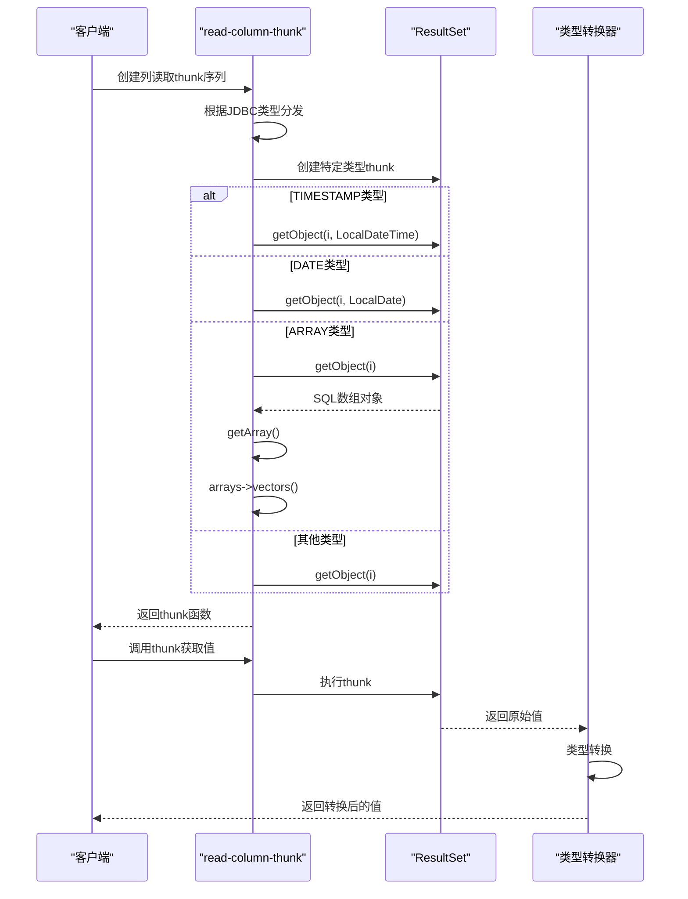
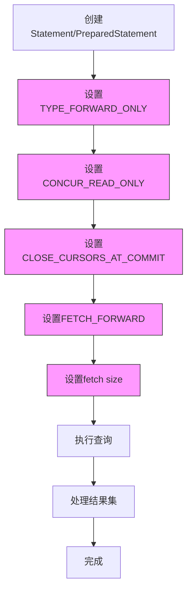
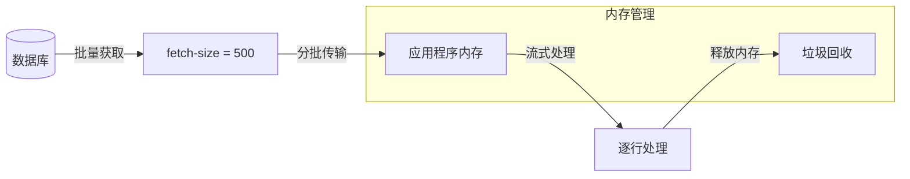
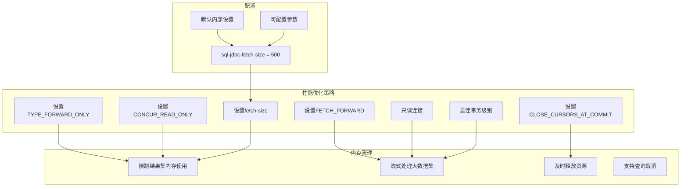

# 结果集处理

<cite>
**本文档中引用的文件**  
- [execute.clj](file://src/metabase/driver/sql_jdbc/execute.clj)
- [reducible.clj](file://src/metabase/query_processor/reducible.clj)
- [metadata.clj](file://src/metabase/driver/sql_jdbc/metadata.clj)
- [legacy_impl.clj](file://src/metabase/driver/sql_jdbc/execute/legacy_impl.clj)
- [settings.clj](file://src/metabase/driver/settings.clj)
</cite>

## 目录
1. [简介](#简介)
2. [核心组件](#核心组件)
3. [reducible-rows函数分析](#reducible-rows函数分析)
4. [column-metadata多态方法](#column-metadata多态方法)
5. [read-column-thunk多态方法](#read-column-thunk多态方法)
6. [性能考虑与内存管理](#性能考虑与内存管理)
7. [结论](#结论)

## 简介
本文档深入分析Metabase中结果集处理的核心机制，重点关注如何将JDBC ResultSet转换为可还原的行序列。文档详细说明了reducible-rows函数的工作原理、row-thunk的创建与执行、column-metadata多态方法如何从ResultSetMetaData提取列信息并映射到Metabase基础类型，以及read-column-thunk多态方法如何为不同JDBC类型创建适当的读取函数。

## 核心组件

本文档分析的核心组件包括：
- reducible-rows函数：将JDBC ResultSet转换为可还原的行序列
- row-thunk：用于逐行读取结果集的函数
- column-metadata多态方法：提取和处理列元数据
- read-column-thunk多态方法：为不同数据类型创建适当的读取函数

**节来源**
- [execute.clj](file://src/metabase/driver/sql_jdbc/execute.clj#L692-L719)
- [reducible.clj](file://src/metabase/query_processor/reducible.clj#L75-L96)

## reducible-rows函数分析

reducible-rows函数是Metabase中处理JDBC结果集的核心函数，它返回一个可还原的对象，用于以驱动程序特定的方式获取ResultSet中的行和列。

该函数通过调用row-thunk函数创建一个thunk，该thunk在每次调用时都会尝试移动到结果集的下一行，并返回该行的数据。如果结果集没有更多行，则返回nil。

**图来源**
- [execute.clj](file://src/metabase/driver/sql_jdbc/execute.clj#L659-L694)

**节来源**
- [execute.clj](file://src/metabase/driver/sql_jdbc/execute.clj#L692-L719)

## column-metadata多态方法

column-metadata多态方法负责从ResultSetMetaData中提取列信息并映射到Metabase基础类型。该方法通过遍历结果集的所有列，为每列创建包含名称、数据库类型和基础类型的元数据映射。

关键处理步骤包括：
1. 使用getColumnLabel获取列标签
2. 使用getColumnTypeName获取数据库类型名称
3. 通过database-type->base-type函数将数据库类型映射到Metabase基础类型
4. 处理缺失的基础类型，通过动态查找进行补充
5. 确保所有列都有基础类型，缺失的使用:type/*作为默认值

**图来源**
- [execute.clj](file://src/metabase/driver/sql_jdbc/execute.clj#L659-L694)

**节来源**
- [execute.clj](file://src/metabase/driver/sql_jdbc/execute.clj#L692-L719)
- [metadata.clj](file://src/metabase/driver/sql_jdbc/metadata.clj#L31-L40)

## read-column-thunk多态方法

read-column-thunk多态方法为不同的JDBC类型创建适当的读取函数，确保数据类型正确转换。该方法根据驱动程序和JDBC类型进行分发，为每种类型创建专门的thunk函数。

### 支持的JDBC类型处理

### 具体类型处理实现

#### 时间戳类型处理
对于TIMESTAMP类型，使用get-object-of-class-thunk创建一个thunk，该thunk调用ResultSet的getObject方法并指定java.time.LocalDateTime类。

#### 日期类型处理
对于DATE类型，同样使用get-object-of-class-thunk，但指定java.time.LocalDate类作为目标类型。

#### 数组类型处理
对于ARRAY类型，实现特殊处理：
1. 调用getObject获取SQL数组对象
2. 使用getArray方法获取数组数据
3. 通过arrays->vectors递归函数将Java数组转换为Clojure向量

#### 遗留实现
对于不完全支持JSR-310 java.time类的JDBC驱动程序，提供了legacy_impl中的替代实现，使用getString方法读取字符串并解析为日期时间对象。

**图来源**
- [execute.clj](file://src/metabase/driver/sql_jdbc/execute.clj#L590-L626)
- [legacy_impl.clj](file://src/metabase/driver/sql_jdbc/execute/legacy_impl.clj#L81-L105)

**节来源**
- [execute.clj](file://src/metabase/driver/sql_jdbc/execute.clj#L590-L659)
- [legacy_impl.clj](file://src/metabase/driver/sql_jdbc/execute/legacy_impl.clj#L52-L82)

## 性能考虑与内存管理

Metabase在结果集处理中实施了多项性能优化和内存管理策略，确保大规模数据集的高效处理。

### 结果集游标优化

通过设置适当的ResultSet属性来优化内存使用和性能：

### fetch-size配置

通过sql-jdbc-fetch-size设置控制每次从数据库获取的行数，防止整个结果集在内存中实例化：

### 性能优化最佳实践

1. **游标方向优化**：设置FETCH_FORWARD以优化前向遍历性能
2. **内存使用控制**：通过fetch-size限制内存占用
3. **连接属性优化**：设置只读连接和适当的事务隔离级别
4. **资源及时释放**：使用with-open确保资源正确关闭
5. **异步取消支持**：通过canceled-chan支持查询取消

**图来源**
- [execute.clj](file://src/metabase/driver/sql_jdbc/execute.clj#L498-L532)
- [settings.clj](file://src/metabase/driver/settings.clj#L157-L170)

**节来源**
- [execute.clj](file://src/metabase/driver/sql_jdbc/execute.clj#L498-L532)
- [settings.clj](file://src/metabase/driver/settings.clj#L157-L170)

## 结论
Metabase的结果集处理机制通过reducible-rows函数、row-thunk、column-metadata和read-column-thunk等组件，实现了高效、灵活的JDBC结果集处理。该机制不仅支持各种数据类型和数据库驱动程序，还通过fetch-size配置和游标优化等策略确保了良好的性能和内存管理。这种设计使得Metabase能够处理大规模数据集，同时保持系统的稳定性和响应性。