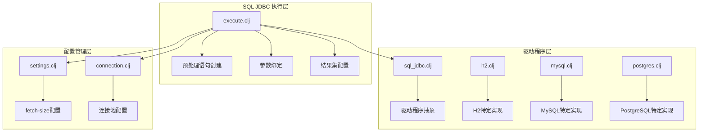
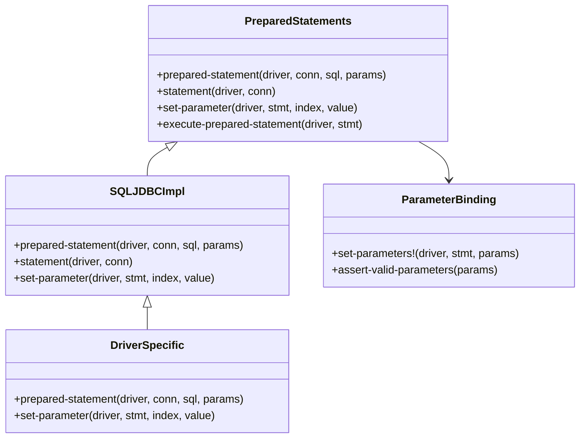
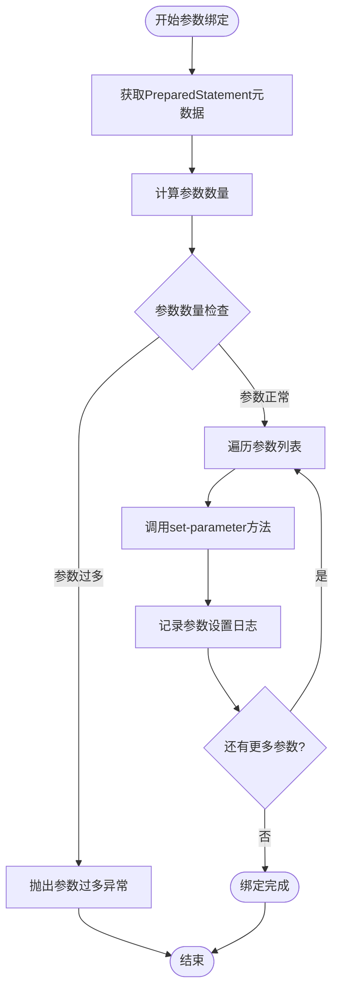
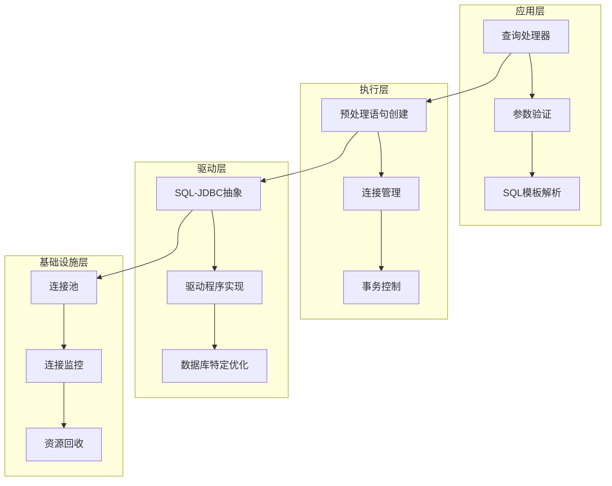
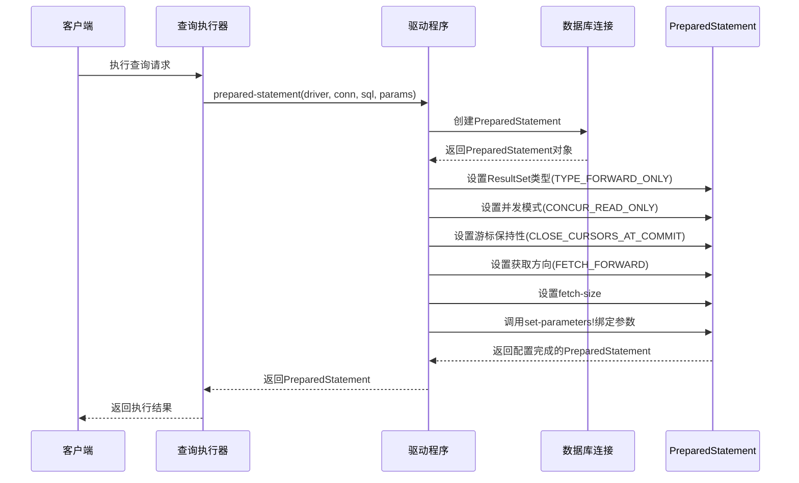
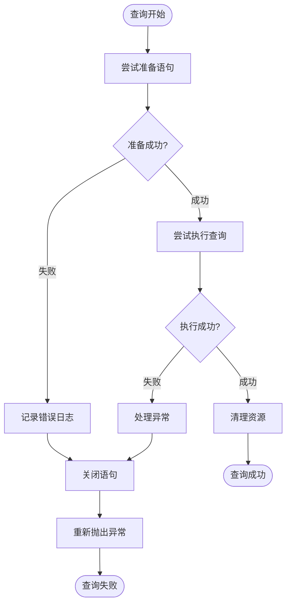
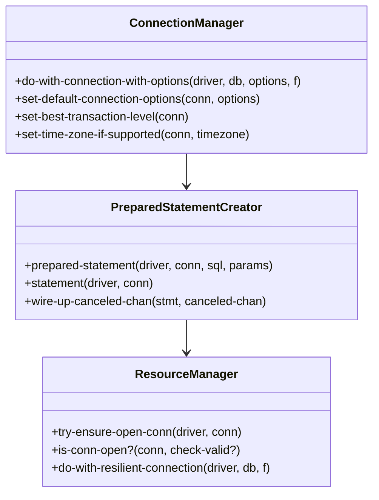
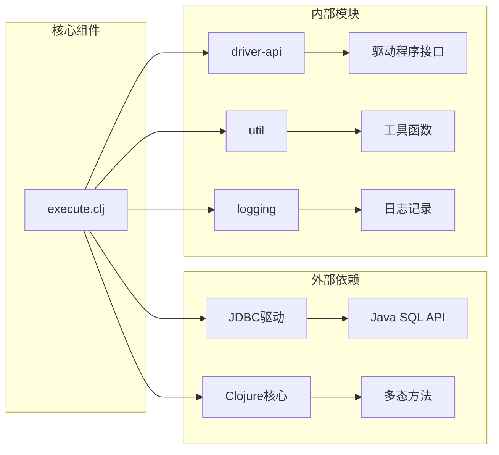
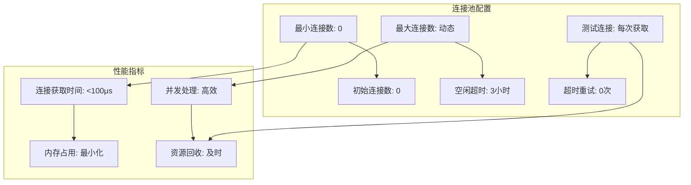
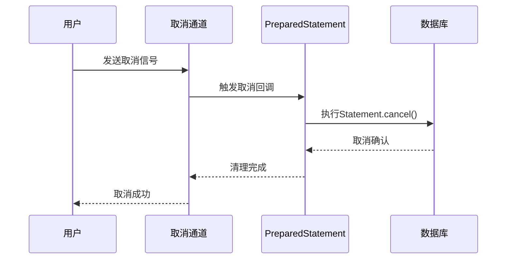

# 预处理语句创建

<cite>
**本文档中引用的文件**
- [execute.clj](file://src/metabase/driver/sql_jdbc/execute.clj)
- [settings.clj](file://src/metabase/driver/settings.clj)
- [connection.clj](file://src/metabase/driver/sql_jdbc/connection.clj)
- [sql_jdbc.clj](file://src/metabase/driver/sql_jdbc.clj)
- [params.clj](file://src/metabase/parameters/params.clj)
- [query_cancelation.clj](file://src/metabase/app_db/query_cancelation.clj)
- [catch_exceptions.clj](file://src/metabase/query_processor/middleware/catch_exceptions.clj)
</cite>

## 目录
1. [简介](#简介)
2. [项目结构概览](#项目结构概览)
3. [核心组件分析](#核心组件分析)
4. [架构概览](#架构概览)
5. [详细组件分析](#详细组件分析)
6. [依赖关系分析](#依赖关系分析)
7. [性能考虑](#性能考虑)
8. [故障排除指南](#故障排除指南)
9. [结论](#结论)

## 简介

Metabase的预处理语句创建系统是一个高度优化的数据库访问层，专门设计用于处理复杂的SQL查询执行场景。该系统通过多态方法实现了对不同数据库驱动程序的统一支持，同时提供了强大的参数绑定、结果集管理和异常处理机制。

本文档深入探讨了预处理语句创建的核心机制，包括PreparedStatement对象的动态创建、参数安全绑定、ResultSet配置优化以及与连接池的深度集成。系统采用分层架构设计，确保了跨数据库的兼容性和最佳性能表现。

## 项目结构概览

预处理语句创建功能主要分布在以下关键模块中：

**图表来源**
- [execute.clj](file://src/metabase/driver/sql_jdbc/execute.clj#L1-L50)
- [sql_jdbc.clj](file://src/metabase/driver/sql_jdbc.clj#L1-L50)
- [settings.clj](file://src/metabase/driver/settings.clj#L1-L50)

**章节来源**
- [execute.clj](file://src/metabase/driver/sql_jdbc/execute.clj#L1-L100)
- [sql_jdbc.clj](file://src/metabase/driver/sql_jdbc.clj#L1-L100)

## 核心组件分析

### 多态方法体系

预处理语句创建系统基于Clojure的多态方法（multimethod）机制构建，提供了灵活的扩展点：

**图表来源**
- [execute.clj](file://src/metabase/driver/sql_jdbc/execute.clj#L134-L180)
- [execute.clj](file://src/metabase/driver/sql_jdbc/execute.clj#L474-L532)

### 参数绑定机制

set-parameters!函数实现了安全的参数绑定机制，包含严格的参数数量验证：

**图表来源**
- [execute.clj](file://src/metabase/driver/sql_jdbc/execute.clj#L450-L473)

**章节来源**
- [execute.clj](file://src/metabase/driver/sql_jdbc/execute.clj#L450-L473)
- [params.clj](file://src/metabase/parameters/params.clj#L30-L52)

## 架构概览

预处理语句创建系统采用分层架构设计，确保了良好的可扩展性和维护性：

**图表来源**
- [execute.clj](file://src/metabase/driver/sql_jdbc/execute.clj#L800-L970)
- [connection.clj](file://src/metabase/driver/sql_jdbc/connection.clj#L1-L50)

## 详细组件分析

### PreparedStatement创建流程

预处理语句的创建过程包含了多个关键步骤，每个步骤都经过精心优化以确保最佳性能：

**图表来源**
- [execute.clj](file://src/metabase/driver/sql_jdbc/execute.clj#L474-L532)
- [execute.clj](file://src/metabase/driver/sql_jdbc/execute.clj#L530-L563)

### ResultSet配置优化

系统为不同的使用场景配置了最优的ResultSet属性：

| 配置项 | 值 | 用途 | 性能影响 |
|--------|-----|------|----------|
| ResultSet.TYPE_FORWARD_ONLY | TYPE_FORWARD_ONLY | 只向前遍历 | 减少内存占用 |
| ResultSet.CONCUR_READ_ONLY | CONCUR_READ_ONLY | 只读模式 | 提升并发性能 |
| ResultSet.CLOSE_CURSORS_AT_COMMIT | CLOSE_CURSORS_AT_COMMIT | 自动关闭游标 | 避免资源泄漏 |
| fetch-direction | FETCH_FORWARD | 正向获取 | 优化网络传输 |

### 异常处理机制

系统实现了多层次的异常处理策略：

**图表来源**
- [execute.clj](file://src/metabase/driver/sql_jdbc/execute.clj#L530-L563)
- [catch_exceptions.clj](file://src/metabase/query_processor/middleware/catch_exceptions.clj#L65-L94)

**章节来源**
- [execute.clj](file://src/metabase/driver/sql_jdbc/execute.clj#L474-L532)
- [execute.clj](file://src/metabase/driver/sql_jdbc/execute.clj#L530-L563)

### 连接管理集成

预处理语句创建与连接管理系统深度集成，确保资源的正确管理和回收：

**图表来源**
- [execute.clj](file://src/metabase/driver/sql_jdbc/execute.clj#L320-L420)
- [execute.clj](file://src/metabase/driver/sql_jdbc/execute.clj#L870-L970)

**章节来源**
- [execute.clj](file://src/metabase/driver/sql_jdbc/execute.clj#L320-L420)
- [execute.clj](file://src/metabase/driver/sql_jdbc/execute.clj#L870-L970)

## 依赖关系分析

预处理语句创建系统的依赖关系体现了清晰的分层架构：

**图表来源**
- [execute.clj](file://src/metabase/driver/sql_jdbc/execute.clj#L1-L30)
- [sql_jdbc.clj](file://src/metabase/driver/sql_jdbc.clj#L1-L30)

**章节来源**
- [execute.clj](file://src/metabase/driver/sql_jdbc/execute.clj#L1-L30)
- [sql_jdbc.clj](file://src/metabase/driver/sql_jdbc.clj#L1-L30)

## 性能考虑

### Fetch Size优化

系统提供了灵活的fetch-size配置机制，平衡内存使用和网络效率：

| 场景 | 推荐值 | 说明 |
|------|--------|------|
| 一般查询 | 500 | 平衡内存和性能 |
| 大数据量下载 | 1000-5000 | 优化批量传输 |
| 实时查询 | 100-200 | 减少延迟 |
| 内存受限环境 | 50-100 | 最小化内存占用 |

### 连接池优化

连接池配置针对不同使用场景进行了优化：

**图表来源**
- [connection.clj](file://src/metabase/driver/sql_jdbc/connection.clj#L69-L141)
- [settings.clj](file://src/metabase/driver/settings.clj#L158-L165)

### 查询取消机制

系统实现了高效的查询取消机制，支持长时间运行查询的优雅终止：

**图表来源**
- [execute.clj](file://src/metabase/driver/sql_jdbc/execute.clj#L540-L563)
- [query_cancelation.clj](file://src/metabase/app_db/query_cancelation.clj#L34-L52)

**章节来源**
- [settings.clj](file://src/metabase/driver/settings.clj#L158-L165)
- [connection.clj](file://src/metabase/driver/sql_jdbc/connection.clj#L69-L141)

## 故障排除指南

### 常见问题诊断

#### 参数绑定错误

**症状**: 参数数量不匹配异常
**原因**: SQL语句中的占位符数量与提供的参数数量不一致
**解决方案**: 
1. 检查SQL语句中的`?`占位符数量
2. 验证参数列表长度
3. 使用参数验证函数进行调试

#### 连接超时问题

**症状**: 数据库连接建立失败
**原因**: 网络延迟或数据库负载过高
**解决方案**:
1. 增加连接超时时间配置
2. 检查网络连通性
3. 优化数据库服务器性能

#### 内存溢出错误

**症状**: ResultSet过大导致内存不足
**原因**: fetch-size设置过小或查询结果集过大
**解决方案**:
1. 调整fetch-size配置
2. 优化查询语句减少返回行数
3. 使用分页查询处理大数据集

### 性能调优建议

#### 查询性能优化

1. **合理设置fetch-size**: 根据实际数据量调整fetch大小
2. **使用适当的ResultSet类型**: 选择最适合查询类型的ResultSet
3. **启用连接池**: 避免频繁创建和销毁数据库连接
4. **监控查询执行时间**: 及时发现性能瓶颈

#### 资源管理优化

1. **及时释放资源**: 确保PreparedStatement和ResultSet正确关闭
2. **连接池配置**: 根据应用负载调整连接池参数
3. **异常处理**: 实现完善的异常恢复机制

**章节来源**
- [execute.clj](file://src/metabase/driver/sql_jdbc/execute.clj#L450-L473)
- [catch_exceptions.clj](file://src/metabase/query_processor/middleware/catch_exceptions.clj#L65-L94)

## 结论

Metabase的预处理语句创建系统展现了现代数据库访问层的最佳实践。通过多态方法的设计、完善的异常处理机制、灵活的配置选项以及深度的连接管理集成，该系统在保证功能完整性的同时实现了优异的性能表现。

系统的主要优势包括：
- **跨数据库兼容性**: 通过驱动程序抽象层支持多种数据库
- **高性能**: 优化的ResultSet配置和连接池管理
- **可靠性**: 完善的异常处理和资源管理机制
- **可扩展性**: 基于多态方法的灵活架构设计

对于开发者而言，理解这些核心概念和实现细节有助于更好地利用Metabase的功能，同时也为系统的进一步优化和扩展奠定了坚实基础。