# 连接与事务管理

<cite>
**本文档中引用的文件**
- [sql_jdbc/connection.clj](file://src/metabase/driver/sql_jdbc/connection.clj)
- [app_db/connection.clj](file://src/metabase/app_db/connection.clj)
- [sql_jdbc/execute.clj](file://src/metabase/driver/sql_jdbc/execute.clj)
- [util/connection.clj](file://src/metabase/util/connection.clj)
- [driver/sql_jdbc/connection/ssh_tunnel.clj](file://src/metabase/driver/sql_jdbc/connection/ssh_tunnel.clj)
- [app_db/connection_pool_setup.clj](file://src/metabase/app_db/connection_pool_setup.clj)
- [driver/sql_jdbc/common.clj](file://src/metabase/driver/sql_jdbc/common.clj)
- [driver/settings.clj](file://src/metabase/driver/settings.clj)
- [analytics/prometheus.clj](file://src/metabase/analytics/prometheus.clj)
</cite>

## 目录
1. [概述](#概述)
2. [连接池架构](#连接池架构)
3. [SSH隧道支持](#ssh隧道支持)
4. [连接生命周期管理](#连接生命周期管理)
5. [查询执行管道](#查询执行管道)
6. [事务管理](#事务管理)
7. [错误恢复机制](#错误恢复机制)
8. [性能监控与诊断](#性能监控与诊断)
9. [连接泄漏检测](#连接泄漏检测)
10. [最佳实践指南](#最佳实践指南)

## 概述

Metabase的连接与事务管理系统是一个复杂而精密的架构，负责管理应用程序数据库和外部数据源之间的连接。该系统基于C3P0连接池实现，提供了强大的连接池管理、SSH隧道支持、事务控制和错误恢复功能。

### 核心组件概览

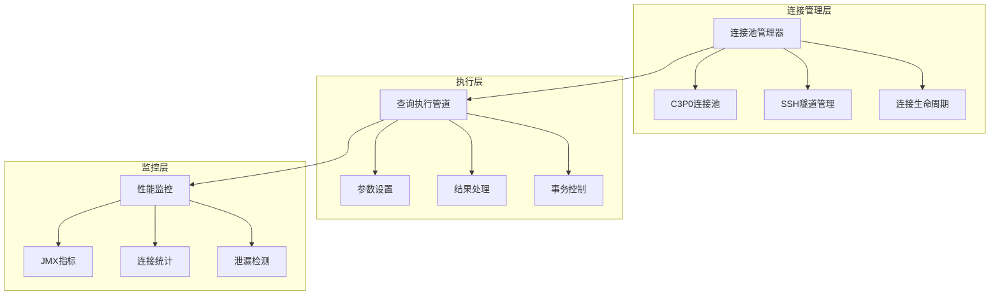

**图表来源**
- [sql_jdbc/connection.clj](file://src/metabase/driver/sql_jdbc/connection.clj#L1-L50)
- [sql_jdbc/execute.clj](file://src/metabase/driver/sql_jdbc/execute.clj#L1-L50)

## 连接池架构

### C3P0连接池配置

Metabase使用C3P0作为主要的连接池实现，为应用程序数据库和数据仓库提供高效的连接管理。

#### 应用程序数据库连接池

应用程序数据库连接池采用专门的配置策略：

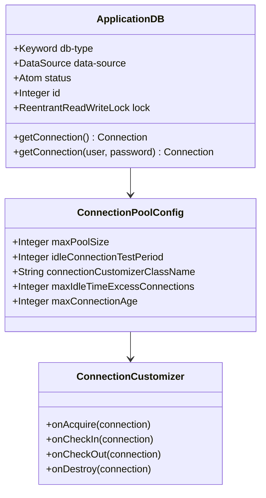

**图表来源**
- [app_db/connection.clj](file://src/metabase/app_db/connection.clj#L20-L60)
- [app_db/connection_pool_setup.clj](file://src/metabase/app_db/connection_pool_setup.clj#L80-L120)

#### 数据仓库连接池配置

数据仓库连接池针对大数据量查询进行了优化：

| 配置项 | 默认值 | 说明 |
|--------|--------|------|
| `acquireIncrement` | 1 | 每次获取连接的数量 |
| `maxPoolSize` | 动态计算 | 最大连接数，受环境变量控制 |
| `minPoolSize` | 0 | 最小空闲连接数 |
| `maxIdleTime` | 3小时 | 连接最大空闲时间 |
| `testConnectionOnCheckout` | true | 检查连接有效性 |
| `unreturnedConnectionTimeout` | 查询超时 | 连接未返回超时时间 |

**节来源**
- [sql_jdbc/connection.clj](file://src/metabase/driver/sql_jdbc/connection.clj#L60-L130)

### 连接池生命周期管理

连接池的创建、维护和销毁遵循严格的生命周期管理：

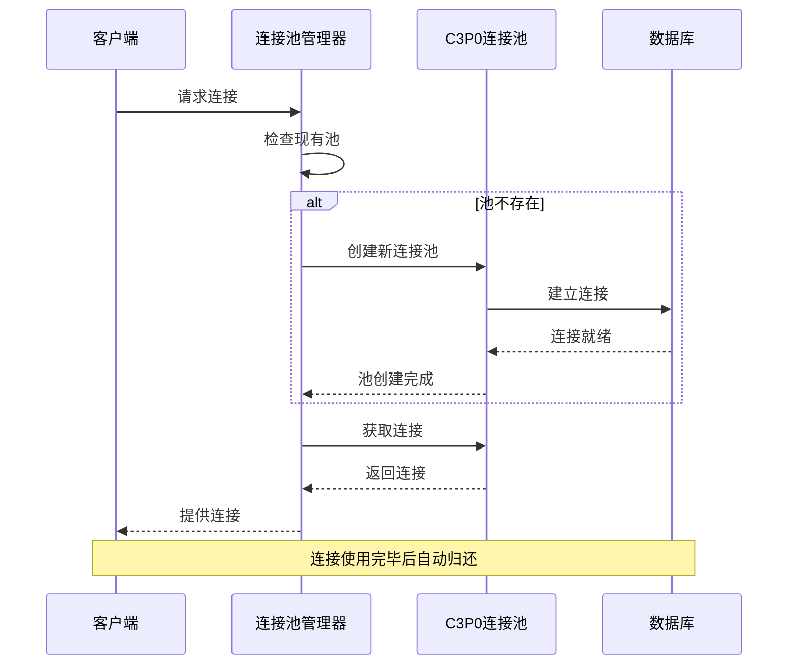

**图表来源**
- [sql_jdbc/connection.clj](file://src/metabase/driver/sql_jdbc/connection.clj#L200-L250)

## SSH隧道支持

### 隧道建立流程

SSH隧道为通过防火墙访问远程数据库提供了安全通道：

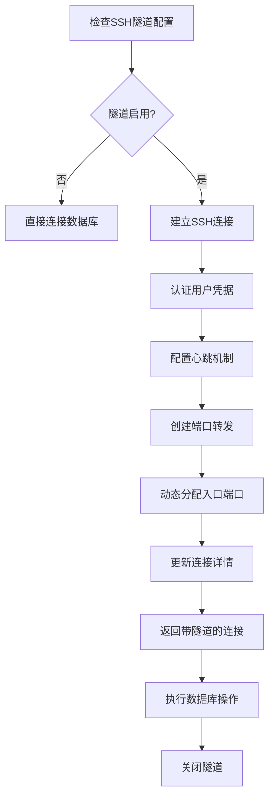

**图表来源**
- [driver/sql_jdbc/connection/ssh_tunnel.clj](file://src/metabase/driver/sql_jdbc/connection/ssh_tunnel.clj#L60-L100)

### 隧道配置参数

| 参数 | 类型 | 默认值 | 说明 |
|------|------|--------|------|
| `tunnel-host` | String | 必需 | SSH服务器主机名 |
| `tunnel-port` | Integer | 22 | SSH服务器端口 |
| `tunnel-user` | String | 必需 | SSH用户名 |
| `tunnel-pass` | String | 可选 | SSH密码 |
| `tunnel-private-key` | String | 可选 | 私钥内容 |
| `heartbeat-interval` | Integer | 180秒 | 心跳间隔 |

**节来源**
- [driver/sql_jdbc/connection/ssh_tunnel.clj](file://src/metabase/driver/sql_jdbc/connection/ssh_tunnel.clj#L20-L40)

## 连接生命周期管理

### 连接状态管理

每个连接都经历明确的状态转换：

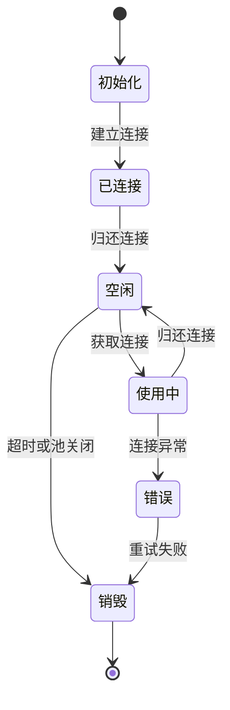

### 连接验证机制

系统实现了多层次的连接验证：

1. **连接池级验证**：C3P0定期测试连接有效性
2. **连接级验证**：每次获取连接时验证
3. **查询级验证**：关键查询前进行连接测试

**节来源**
- [sql_jdbc/connection.clj](file://src/metabase/driver/sql_jdbc/connection.clj#L110-L130)

## 查询执行管道

### 执行流程架构

查询执行管道提供了完整的查询处理链路：

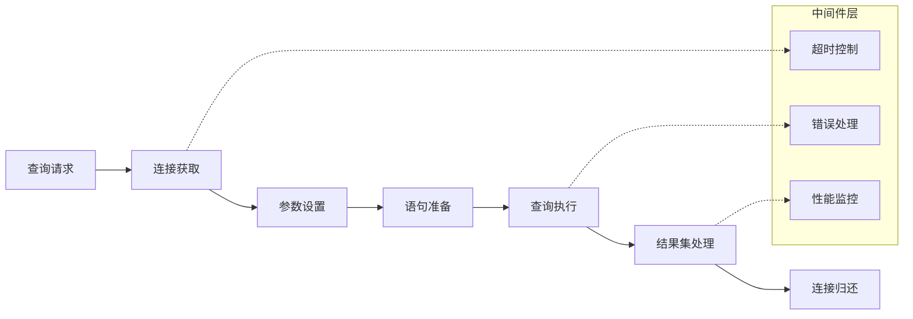

**图表来源**
- [sql_jdbc/execute.clj](file://src/metabase/driver/sql_jdbc/execute.clj#L400-L500)

### 参数绑定与类型转换

系统支持自动类型转换和参数绑定：

| 数据类型 | JDBC类型 | 处理方式 |
|----------|----------|----------|
| LocalDate | Types.DATE | 直接设置 |
| LocalTime | Types.TIME | 直接设置 |
| LocalDateTime | Types.TIMESTAMP | 直接设置 |
| OffsetDateTime | Types.TIMESTAMP_WITH_TIMEZONE | 直接设置 |
| ZonedDateTime | Types.TIMESTAMP_WITH_TIMEZONE | 转换为OffsetDateTime |

**节来源**
- [sql_jdbc/execute.clj](file://src/metabase/driver/sql_jdbc/execute.clj#L450-L500)

### 结果集处理

结果集处理采用流式处理模式，支持大数据量查询：

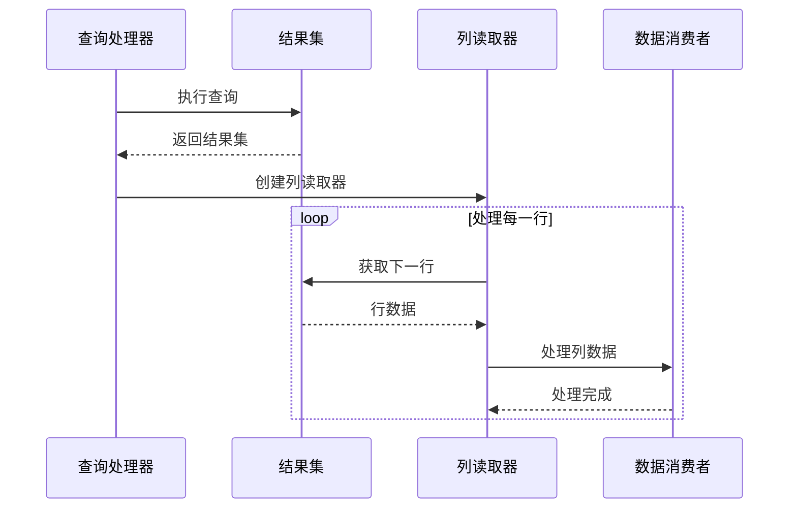

**图表来源**
- [sql_jdbc/execute.clj](file://src/metabase/driver/sql_jdbc/execute.clj#L700-L750)

## 事务管理

### 事务隔离级别控制

系统根据数据库特性自动选择最优的事务隔离级别：

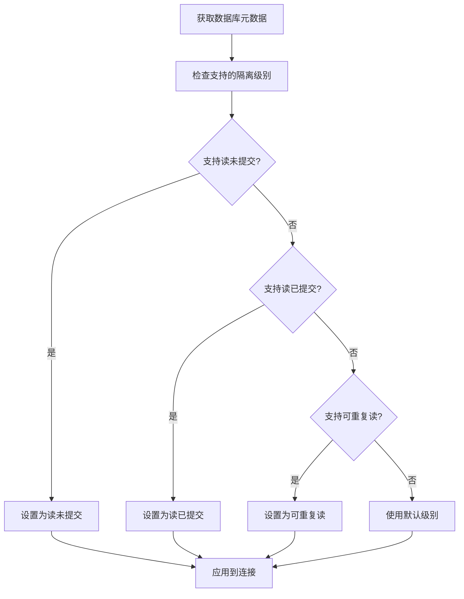

**图表来源**
- [sql_jdbc/execute.clj](file://src/metabase/driver/sql_jdbc/execute.clj#L350-L380)

### 嵌套事务支持

系统支持嵌套事务，使用Savepoint实现：

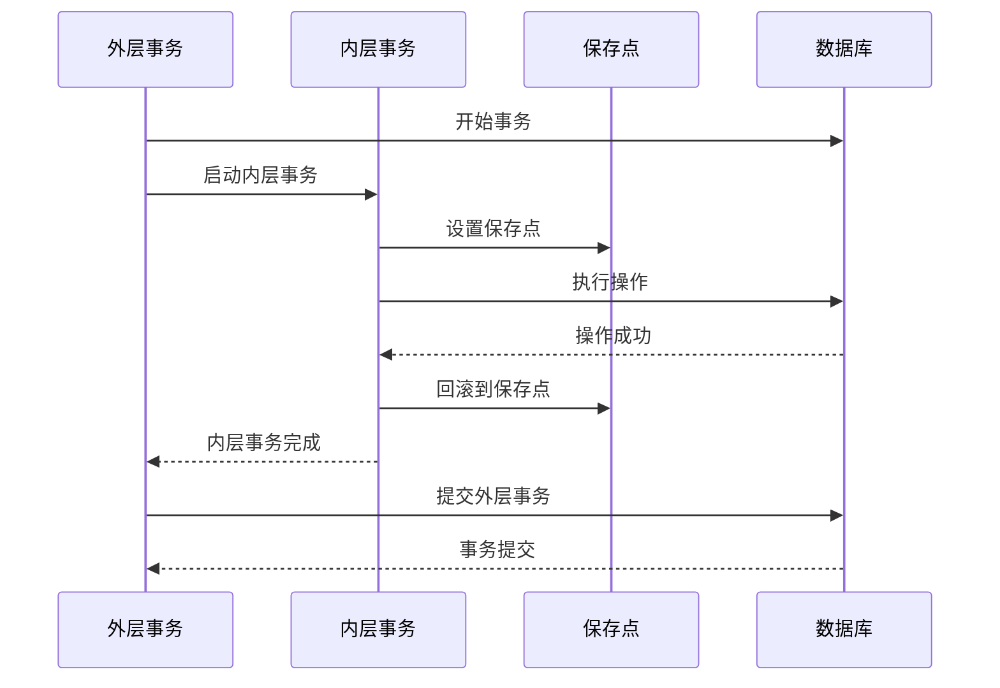

**图表来源**
- [app_db/connection.clj](file://src/metabase/app_db/connection.clj#L150-L200)

### 事务规则配置

| 规则类型 | 值 | 说明 |
|----------|-----|------|
| `:allow` | 允许嵌套事务 | 正常行为 |
| `:ignore` | 忽略内层事务 | 内层事务不生效 |
| `:prohibit` | 禁止嵌套事务 | 抛出异常 |

**节来源**
- [app_db/connection.clj](file://src/metabase/app_db/connection.clj#L180-L210)

## 错误恢复机制

### 连接故障检测

系统实现了多层连接故障检测机制：

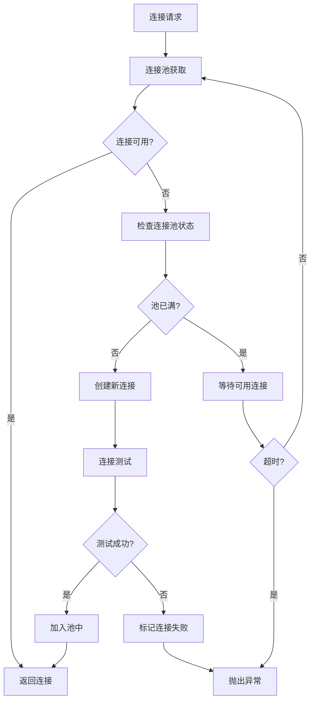

**图表来源**
- [sql_jdbc/execute.clj](file://src/metabase/driver/sql_jdbc/execute.clj#L900-L970)

### 自动重连机制

当连接失效时，系统会尝试自动重连：

1. **连接状态检查**：定期验证连接有效性
2. **异常捕获**：捕获连接相关的异常
3. **重连策略**：指数退避重连策略
4. **上下文保持**：保持事务上下文

**节来源**
- [sql_jdbc/execute.clj](file://src/metabase/driver/sql_jdbc/execute.clj#L930-L970)

### 错误分类与处理

| 错误类型 | 处理策略 | 示例 |
|----------|----------|------|
| 网络超时 | 重试 | `java.net.SocketTimeoutException` |
| 认证失败 | 不重试 | `java.sql.SQLException: Authentication failed` |
| 连接拒绝 | 重试 | `java.net.ConnectException` |
| 查询超时 | 中断查询 | `java.sql.SQLTimeoutException` |

**节来源**
- [driver/util.clj](file://src/metabase/driver/util.clj#L119-L143)

## 性能监控与诊断

### JMX指标收集

系统通过JMX暴露详细的连接池指标：

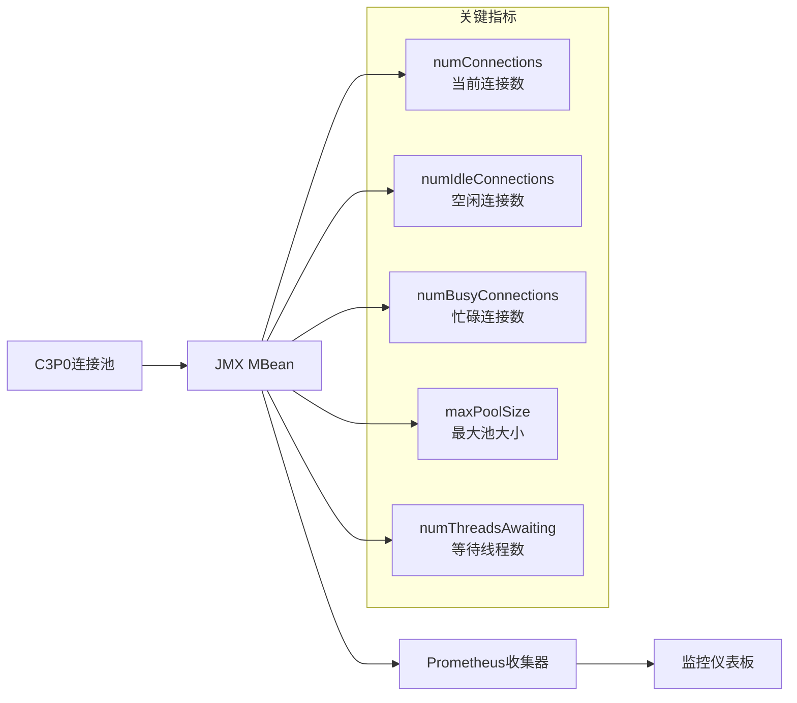

**图表来源**
- [analytics/prometheus.clj](file://src/metabase/analytics/prometheus.clj#L118-L171)

### 性能指标详解

| 指标名称 | 描述 | 监控意义 |
|----------|------|----------|
| `c3p0_num_connections` | 当前连接总数 | 连接池使用率 |
| `c3p0_num_idle_connections` | 空闲连接数 | 连接复用效率 |
| `c3p0_num_busy_connections` | 忙碌连接数 | 查询并发度 |
| `c3p0_max_pool_size` | 最大池大小 | 配置容量限制 |
| `c3p0_num_threads_awaiting_checkout` | 等待连接的线程数 | 连接竞争情况 |

**节来源**
- [analytics/prometheus.clj](file://src/metabase/analytics/prometheus.clj#L100-L120)

### 查询性能监控

系统记录查询执行的关键性能指标：

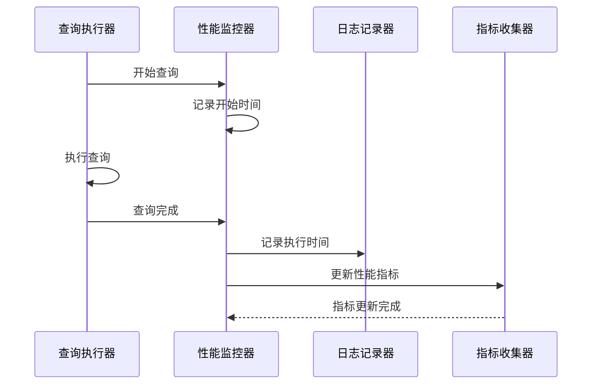

**图表来源**
- [sql_jdbc/execute.clj](file://src/metabase/driver/sql_jdbc/execute.clj#L800-L850)

## 连接泄漏检测

### 泄漏检测机制

系统实现了多层次的连接泄漏检测：

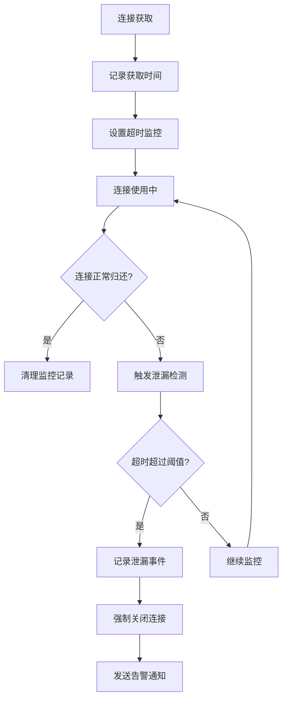

**图表来源**
- [sql_jdbc/connection.clj](file://src/metabase/driver/sql_jdbc/connection.clj#L120-L150)

### 泄漏检测配置

| 配置项 | 默认值 | 说明 |
|--------|--------|------|
| `unreturnedConnectionTimeout` | 查询超时 | 连接未返回超时时间 |
| `debugUnreturnedConnectionStackTraces` | false | 是否记录堆栈跟踪 |
| `maxIdleTimeExcessConnections` | 5分钟 | 多余空闲连接清理时间 |

**节来源**
- [driver/settings.clj](file://src/metabase/driver/settings.clj#L120-L150)

### 泄漏告警机制

当检测到连接泄漏时，系统会：

1. **记录详细日志**：包含堆栈跟踪信息
2. **发送告警通知**：通过监控系统告警
3. **强制清理资源**：关闭泄漏的连接
4. **更新统计指标**：记录泄漏次数

**节来源**
- [sql_jdbc/connection.clj](file://src/metabase/driver/sql_jdbc/connection.clj#L250-L280)

## 最佳实践指南

### 连接池配置建议

#### 生产环境配置

```clojure
;; 应用程序数据库
{:maxPoolSize 15
 :minPoolSize 1
 :maxIdleTime 3600
 :maxConnectionAge 3600
 :idleConnectionTestPeriod 60}

;; 数据仓库数据库  
{:maxPoolSize 50
 :minPoolSize 0
 :maxIdleTime 10800
 :testConnectionOnCheckout true
 :unreturnedConnectionTimeout 1200}
```

#### 开发环境配置

```clojure
;; 减少连接数以节省资源
{:maxPoolSize 5
 :maxIdleTime 1800
 :testConnectionOnCheckout false}
```

### 性能优化建议

1. **合理设置连接池大小**
   - 应用程序数据库：CPU核心数 × 2
   - 数据仓库数据库：CPU核心数 × 4

2. **启用连接验证**
   ```clojure
   {:testConnectionOnCheckout true
    :idleConnectionTestPeriod 60}
   ```

3. **配置适当的超时时间**
   - 连接超时：10秒
   - 查询超时：20分钟（生产环境）

4. **监控连接使用情况**
   - 定期检查连接池利用率
   - 监控连接泄漏事件

### 故障排除指南

#### 常见问题及解决方案

| 问题 | 症状 | 解决方案 |
|------|------|----------|
| 连接池耗尽 | 查询超时，连接等待 | 增加池大小或优化查询 |
| 连接泄漏 | 连接数持续增长 | 启用泄漏检测，检查代码逻辑 |
| SSH隧道失败 | 远程数据库连接失败 | 检查网络和认证配置 |
| 查询超时 | 长时间无响应 | 调整查询超时或优化查询 |

#### 监控检查清单

- [ ] 连接池利用率 < 80%
- [ ] 平均连接获取时间 < 100ms
- [ ] 连接泄漏事件 = 0
- [ ] SSH隧道状态正常
- [ ] 查询执行时间在预期范围内

**节来源**
- [driver/settings.clj](file://src/metabase/driver/settings.clj#L80-L120)
- [app_db/connection_pool_setup.clj](file://src/metabase/app_db/connection_pool_setup.clj#L80-L150)