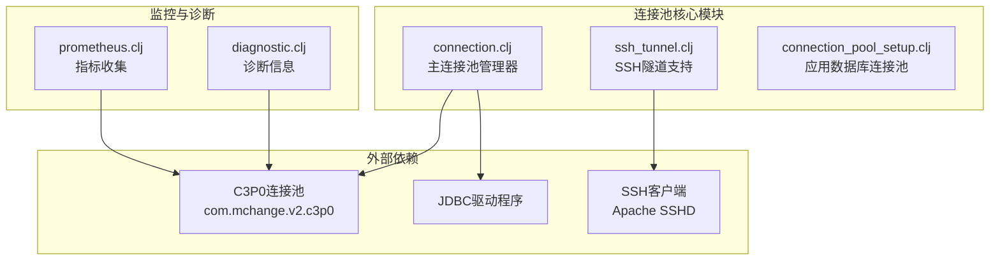
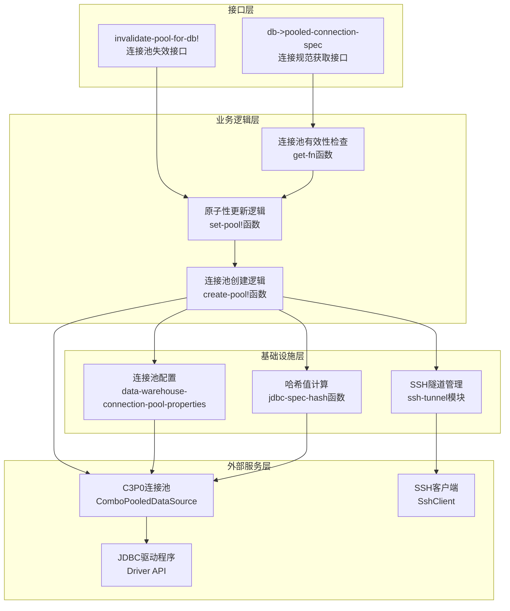
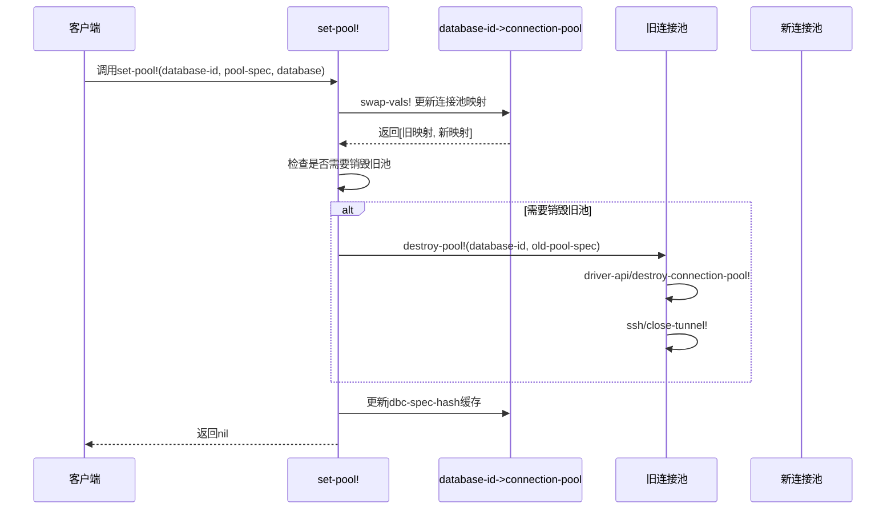
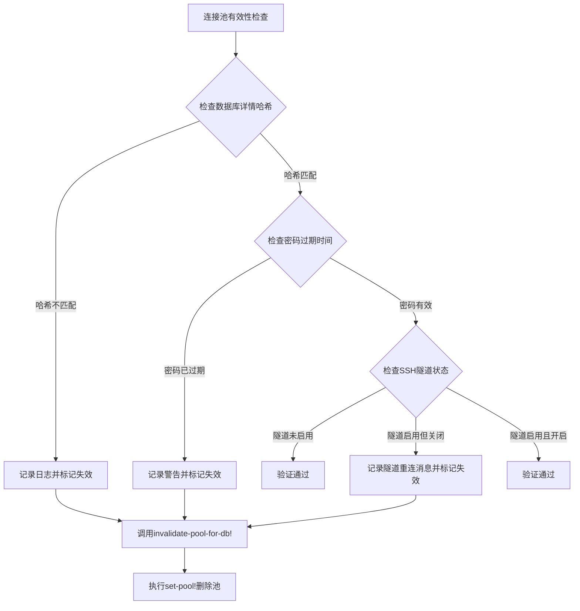
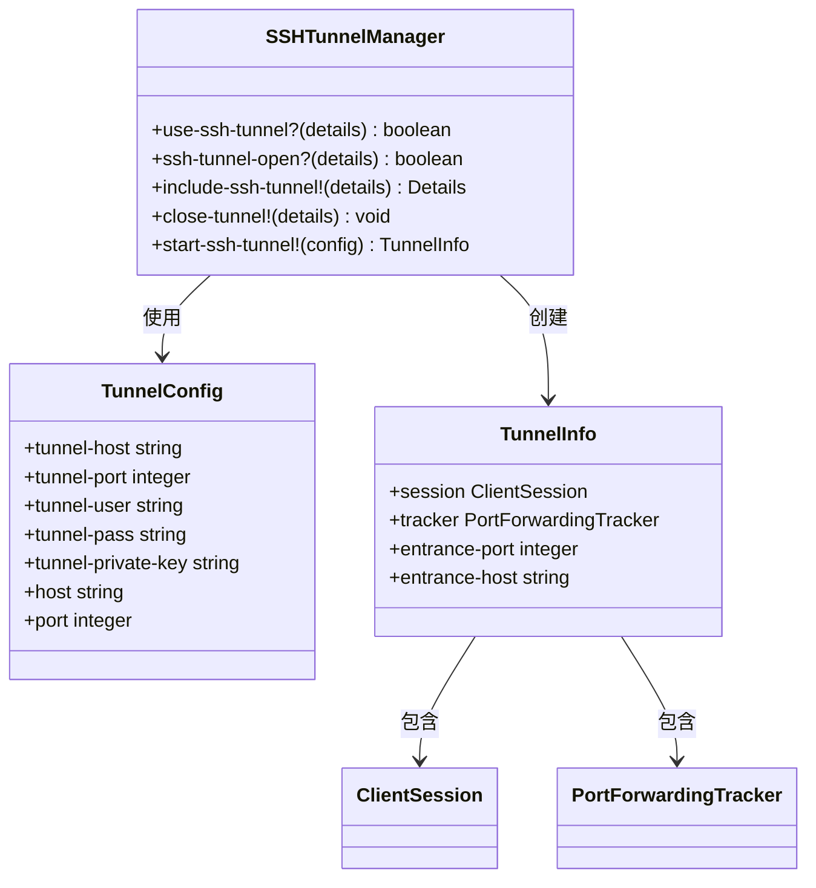
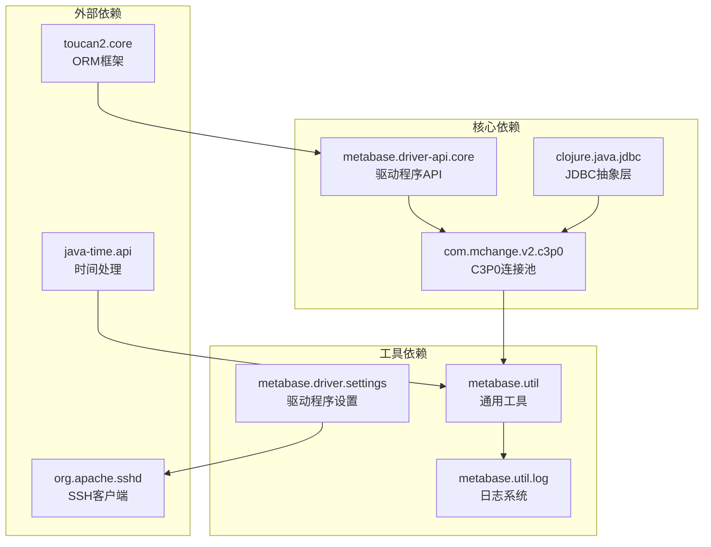

# 连接池生命周期管理

<cite>
**本文档中引用的文件**
- [connection.clj](file://src/metabase/driver/sql_jdbc/connection.clj)
- [ssh_tunnel.clj](file://src/metabase/driver/sql_jdbc/connection/ssh_tunnel.clj)
- [connection_pool_setup.clj](file://src/metabase/app_db/connection_pool_setup.clj)
- [prometheus.clj](file://src/metabase/analytics/prometheus.clj)
- [diagnostic.clj](file://src/metabase/driver/sql_jdbc/execute/diagnostic.clj)
</cite>

## 目录
1. [简介](#简介)
2. [项目结构概览](#项目结构概览)
3. [核心组件分析](#核心组件分析)
4. [架构概览](#架构概览)
5. [详细组件分析](#详细组件分析)
6. [依赖关系分析](#依赖关系分析)
7. [性能考虑](#性能考虑)
8. [故障排除指南](#故障排除指南)
9. [结论](#结论)

## 简介

Metabase的连接池生命周期管理系统是一个复杂而精密的架构，负责管理数据库连接池的创建、销毁、缓存和监控。该系统采用C3P0连接池作为底层实现，提供了高度可靠的连接管理机制，支持多数据库驱动程序、SSH隧道连接以及动态配置更新。

系统的核心设计理念是确保连接池的线程安全性、原子性操作和优雅的资源清理。通过精心设计的状态检测机制，系统能够及时识别并响应数据库配置变更、SSH隧道状态变化和密码过期等关键事件。

## 项目结构概览

连接池生命周期管理功能主要分布在以下模块中：

**图表来源**
- [connection.clj](file://src/metabase/driver/sql_jdbc/connection.clj#L1-L50)
- [ssh_tunnel.clj](file://src/metabase/driver/sql_jdbc/connection/ssh_tunnel.clj#L1-L30)
- [connection_pool_setup.clj](file://src/metabase/app_db/connection_pool_setup.clj#L1-L20)

**章节来源**
- [connection.clj](file://src/metabase/driver/sql_jdbc/connection.clj#L1-L383)
- [ssh_tunnel.clj](file://src/metabase/driver/sql_jdbc/connection/ssh_tunnel.clj#L1-L163)

## 核心组件分析

### 数据库连接池映射表

系统使用两个核心原子引用来维护连接池状态：

| 组件名称 | 类型 | 描述 | 键值类型 |
|---------|------|------|----------|
| database-id->connection-pool | Atom | 存储当前打开的连接池，键为数据库ID，值为连接池规范 | Integer → PoolSpec |
| database-id->jdbc-spec-hash | Atom | 缓存数据库详情的哈希值，用于检测配置变更 | Integer → HashValue |

### 连接池生命周期函数

系统提供了四个核心函数来管理连接池生命周期：

| 函数名 | 功能描述 | 参数类型 | 返回值 |
|--------|----------|----------|--------|
| create-pool! | 创建新的连接池实例 | Database对象 | PoolSpec |
| destroy-pool! | 销毁指定的连接池 | DatabaseId, PoolSpec | Void |
| set-pool! | 原子性更新连接池 | DatabaseId, PoolSpec, Database | Void |
| invalidate-pool-for-db! | 使指定数据库的连接池失效 | Database对象 | Void |

**章节来源**
- [connection.clj](file://src/metabase/driver/sql_jdbc/connection.clj#L208-L248)

## 架构概览

连接池生命周期管理系统采用分层架构设计，从上到下包含接口层、业务逻辑层、基础设施层和外部服务层：

**图表来源**
- [connection.clj](file://src/metabase/driver/sql_jdbc/connection.clj#L273-L338)
- [connection.clj](file://src/metabase/driver/sql_jdbc/connection.clj#L197-L226)

## 详细组件分析

### set-pool! 函数的原子性操作

`set-pool!`函数是连接池生命周期管理的核心，实现了线程安全的原子性操作：

**图表来源**
- [connection.clj](file://src/metabase/driver/sql_jdbc/connection.clj#L224-L248)

#### 原子性保证机制

系统通过以下机制确保操作的原子性：

1. **CAS操作**：使用`swap-vals!`进行无锁的并发更新
2. **状态比较**：通过`identical?`检查新旧池规格是否相同
3. **异常安全**：确保在异常情况下不会留下未清理的资源

**章节来源**
- [connection.clj](file://src/metabase/driver/sql_jdbc/connection.clj#L224-L248)

### 连接池无效化机制

连接池无效化是系统响应配置变更的关键机制，支持多种触发条件：

**图表来源**
- [connection.clj](file://src/metabase/driver/sql_jdbc/connection.clj#L273-L314)

#### 触发条件详解

| 触发条件 | 检查方法 | 处理策略 | 日志级别 |
|----------|----------|----------|----------|
| 数据库详情变更 | 哈希值比较 | 记录警告，重新创建连接池 | WARN |
| SSH隧道状态变化 | ssh-tunnel-open? | 记录隧道状态，重新建立连接 | WARN |
| 密码过期 | 时间戳比较 | 记录密码过期警告 | WARN |
| 连接池规格变更 | 对象标识符比较 | 立即销毁并重建连接池 | DEBUG |

**章节来源**
- [connection.clj](file://src/metabase/driver/sql_jdbc/connection.clj#L245-L273)

### SSH隧道连接池管理

SSH隧道支持为远程数据库连接提供了额外的安全层，系统对此有专门的管理机制：

**图表来源**
- [ssh_tunnel.clj](file://src/metabase/driver/sql_jdbc/connection/ssh_tunnel.clj#L99-L115)
- [ssh_tunnel.clj](file://src/metabase/driver/sql_jdbc/connection/ssh_tunnel.clj#L56-L74)

#### SSH隧道生命周期

SSH隧道的生命周期管理包括以下阶段：

1. **隧道检测**：`use-ssh-tunnel?`检查是否启用隧道
2. **状态验证**：`ssh-tunnel-open?`验证隧道是否处于活动状态
3. **隧道建立**：`include-ssh-tunnel!`建立新的隧道连接
4. **隧道关闭**：`close-tunnel!`优雅地关闭隧道会话

**章节来源**
- [ssh_tunnel.clj](file://src/metabase/driver/sql_jdbc/connection/ssh_tunnel.clj#L74-L100)

### 应用数据库连接池配置

应用数据库（App DB）使用特殊的连接池配置，针对Metabase内部查询进行了优化：

| 配置项 | 默认值 | 说明 | 用途 |
|--------|--------|------|------|
| maxPoolSize | 15 | 最大连接数 | 平衡性能与资源消耗 |
| maxConnectionAge | 1小时 | 连接最大存活时间 | 防止连接泄漏导致的问题 |
| maxIdleTimeExcessConnections | 10分钟 | 多余空闲连接的存活时间 | 及时释放不需要的连接 |
| idleConnectionTestPeriod | 60秒 | 空闲连接测试间隔 | 确保连接的有效性 |
| unreturnedConnectionTimeout | 可配置 | 未返回连接的超时时间 | 检测连接泄漏 |

**章节来源**
- [connection_pool_setup.clj](file://src/metabase/app_db/connection_pool_setup.clj#L85-L134)

## 依赖关系分析

连接池生命周期管理系统的依赖关系体现了清晰的分层架构：

**图表来源**
- [connection.clj](file://src/metabase/driver/sql_jdbc/connection.clj#L1-L20)
- [ssh_tunnel.clj](file://src/metabase/driver/sql_jdbc/connection/ssh_tunnel.clj#L1-L15)

**章节来源**
- [connection.clj](file://src/metabase/driver/sql_jdbc/connection.clj#L1-L30)
- [ssh_tunnel.clj](file://src/metabase/driver/sql_jdbc/connection/ssh_tunnel.clj#L1-L20)

## 性能考虑

### 连接池性能优化策略

系统采用了多层次的性能优化策略：

1. **连接复用**：通过连接池缓存避免重复创建连接
2. **智能预热**：根据访问模式动态调整连接池大小
3. **资源清理**：及时释放不再使用的连接资源
4. **监控反馈**：基于监控数据动态调整配置

### 内存管理

连接池的内存管理重点关注以下方面：

- **连接生命周期控制**：通过`maxConnectionAge`防止长期运行导致的内存泄漏
- **空闲连接清理**：利用`maxIdleTimeExcessConnections`及时回收空闲连接
- **连接定制器**：使用`ConnectionCustomizer`进行连接级别的资源清理

### 并发性能

系统通过以下机制提升并发性能：

- **无锁更新**：使用CAS操作减少锁竞争
- **细粒度锁定**：仅在必要时使用`locking`语句
- **连接预分配**：预先创建一定数量的连接以应对突发负载

## 故障排除指南

### 常见问题诊断

#### 连接池创建失败

**症状**：数据库连接失败，日志显示连接池创建错误

**诊断步骤**：
1. 检查数据库连接参数是否正确
2. 验证网络连接和防火墙设置
3. 确认SSH隧道配置（如适用）
4. 检查数据库驱动程序版本兼容性

**解决方案**：
- 更新连接参数配置
- 重启SSH隧道服务
- 升级数据库驱动程序

#### 连接池性能下降

**症状**：查询响应时间增加，连接等待队列增长

**诊断步骤**：
1. 监控连接池统计指标
2. 检查数据库服务器负载
3. 分析慢查询日志
4. 验证连接池配置参数

**解决方案**：
- 调整`maxPoolSize`参数
- 优化数据库查询性能
- 增加数据库服务器资源

#### SSH隧道连接问题

**症状**：使用SSH隧道的数据库连接不稳定或频繁断开

**诊断步骤**：
1. 检查SSH隧道状态
2. 验证认证凭据有效性
3. 监控网络连接质量
4. 检查隧道心跳配置

**解决方案**：
- 重新建立SSH隧道连接
- 更新SSH认证凭据
- 调整隧道超时参数

### 监控和调试最佳实践

#### 关键监控指标

| 指标类别 | 具体指标 | 正常范围 | 告警阈值 |
|----------|----------|----------|----------|
| 连接使用率 | numBusyConnections/numConnections | 0-1 | >0.8 |
| 连接等待 | numThreadsAwaitingCheckoutDefaultUser | 0 | >5 |
| 连接池大小 | numConnections | 0-maxPoolSize | 接近上限 |
| 错误率 | 异常连接数/总连接数 | <0.1% | >1% |

#### 调试工具和方法

1. **Prometheus指标收集**：通过`c3p0-stats`收集详细的连接池指标
2. **诊断信息记录**：使用`record-diagnostic-info-for-pool!`捕获连接池状态
3. **日志分析**：关注连接池相关的DEBUG和WARN日志
4. **JMX监控**：通过JMX接口实时监控连接池状态

**章节来源**
- [prometheus.clj](file://src/metabase/analytics/prometheus.clj#L64-L171)
- [diagnostic.clj](file://src/metabase/driver/sql_jdbc/execute/diagnostic.clj#L28-L48)

## 结论

Metabase的连接池生命周期管理系统展现了现代数据库连接管理的最佳实践。通过精心设计的架构，系统实现了以下关键目标：

### 技术优势

1. **高可靠性**：通过原子性操作和优雅降级确保系统稳定性
2. **高性能**：采用连接池复用和智能预热策略优化性能
3. **可扩展性**：支持多数据库驱动和动态配置更新
4. **可观测性**：提供全面的监控和诊断能力

### 设计亮点

- **线程安全的原子性操作**：通过CAS和细粒度锁定实现无锁并发
- **智能的失效检测机制**：自动响应配置变更和状态变化
- **完善的资源管理**：确保连接和隧道资源的及时清理
- **灵活的配置体系**：支持应用数据库和数据仓库的不同需求

### 未来发展方向

随着数据库技术和云原生环境的发展，连接池管理系统可以进一步优化：

- **云原生适配**：更好地支持容器化部署和微服务架构
- **智能调优**：基于机器学习的自动配置优化
- **增强监控**：集成更多的APM工具和分布式追踪
- **安全强化**：加强连接加密和身份验证机制

这个连接池生命周期管理系统为Metabase提供了坚实的基础设施支撑，确保了系统的稳定性和可维护性，是整个平台架构中的重要组成部分。