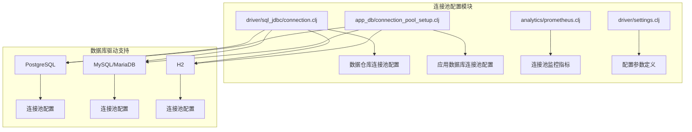
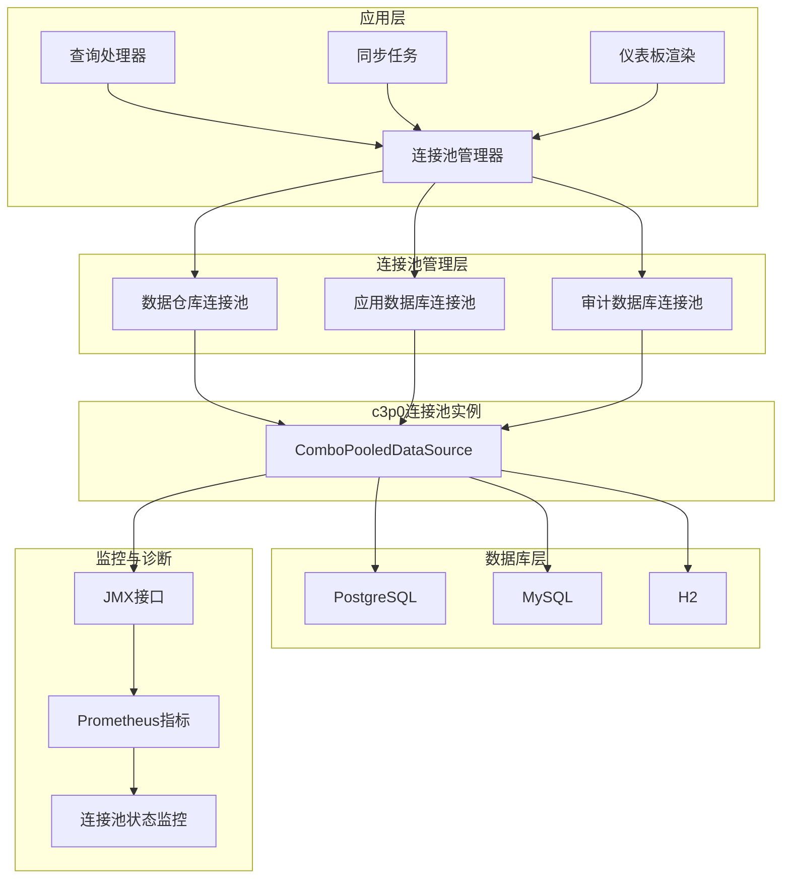
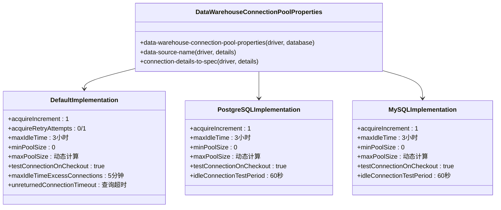
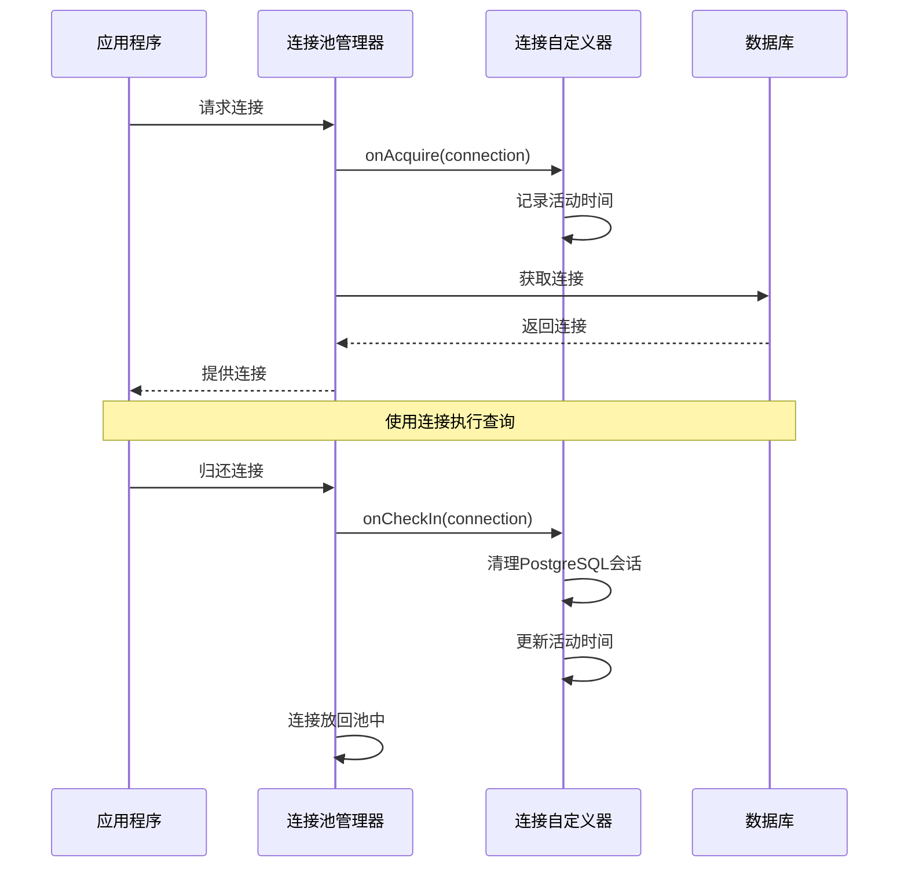
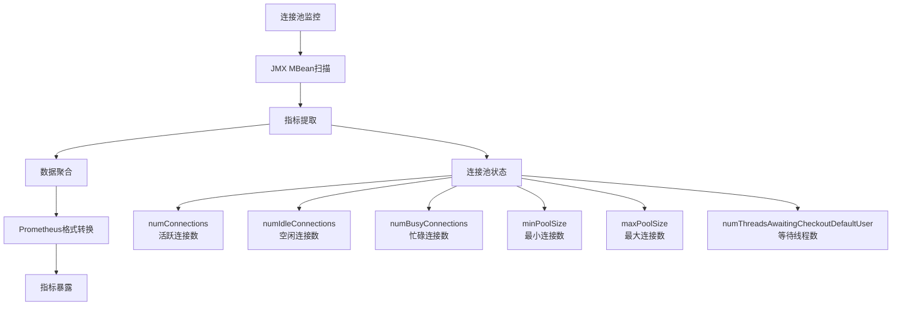
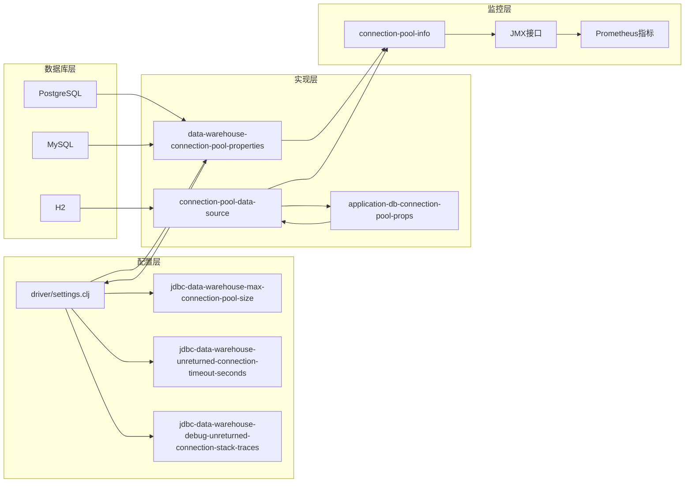

# 连接池配置

<cite>
**本文档中引用的文件**
- [connection.clj](file://src/metabase/driver/sql_jdbc/connection.clj)
- [connection_pool_setup.clj](file://src/metabase/app_db/connection_pool_setup.clj)
- [prometheus.clj](file://src/metabase/analytics/prometheus.clj)
- [settings.clj](file://src/metabase/driver/settings.clj)
- [spec.clj](file://src/metabase/app_db/spec.clj)
- [postgres.clj](file://src/metabase/driver/postgres.clj)
</cite>

## 目录
1. [简介](#简介)
2. [项目结构概览](#项目结构概览)
3. [核心组件](#核心组件)
4. [架构概览](#架构概览)
5. [详细组件分析](#详细组件分析)
6. [依赖关系分析](#依赖关系分析)
7. [性能考虑](#性能考虑)
8. [故障排除指南](#故障排除指南)
9. [结论](#结论)

## 简介

Metabase使用c3p0连接池作为其数据库连接管理的核心组件，为应用程序数据库和数据仓库数据库提供高效的连接池服务。本文档深入解析了c3p0连接池在Metabase中的具体配置，包括关键参数设置、多态方法实现机制以及性能调优最佳实践。

连接池配置是数据库性能优化的关键因素，直接影响系统的响应时间和资源利用率。Metabase通过精心设计的配置策略，在保证系统稳定性的同时最大化性能表现。

## 项目结构概览

Metabase的连接池配置主要分布在以下关键模块中：



**图表来源**
- [connection.clj](file://src/metabase/driver/sql_jdbc/connection.clj#L50-L70)
- [connection_pool_setup.clj](file://src/metabase/app_db/connection_pool_setup.clj#L60-L80)

**章节来源**
- [connection.clj](file://src/metabase/driver/sql_jdbc/connection.clj#L1-L50)
- [connection_pool_setup.clj](file://src/metabase/app_db/connection_pool_setup.clj#L1-L60)

## 核心组件

### c3p0连接池属性配置

Metabase使用多个关键属性来配置c3p0连接池，这些属性直接影响连接池的行为和性能：

#### 基础连接属性

| 属性名称 | 默认值 | 描述 | 性能影响 |
|---------|--------|------|----------|
| `minPoolSize` | 0 (数据仓库) / 15 (应用数据库) | 连接池中保持的最小连接数 | 影响启动时间和并发处理能力 |
| `maxPoolSize` | 动态计算 | 连接池中允许的最大连接数 | 直接影响内存使用和并发能力 |
| `initialPoolSize` | 0 (数据仓库) / 15 (应用数据库) | 启动时创建的初始连接数 | 影响初始化时间和预热效果 |
| `acquireIncrement` | 1 | 每次获取新连接的数量 | 影响内存消耗和获取效率 |

#### 连接生命周期管理

| 属性名称 | 默认值 | 描述 | 调优建议 |
|---------|--------|------|----------|
| `maxIdleTime` | 3小时 (数据仓库) / 1小时 (应用数据库) | 连接最大空闲时间 | 根据查询频率调整 |
| `maxIdleTimeExcessConnections` | 5分钟 (数据仓库) / 10分钟 (应用数据库) | 超出最小值的连接空闲时间 | 平衡内存和连接开销 |
| `maxConnectionAge` | 1小时 | 连接最大生存时间 | 防止长时间运行导致的问题 |

#### 连接验证策略

| 属性名称 | 默认值 | 描述 | 性能开销 |
|---------|--------|------|----------|
| `testConnectionOnCheckout` | true | 检出时验证连接有效性 | 中等，基于网络延迟 |
| `idleConnectionTestPeriod` | 60秒 | 空闲连接定期测试间隔 | 较低，定时任务开销 |
| `unreturnedConnectionTimeout` | 查询超时时间 | 未返回连接的超时时间 | 高，防止连接泄漏 |

**章节来源**
- [connection.clj](file://src/metabase/driver/sql_jdbc/connection.clj#L95-L130)
- [connection_pool_setup.clj](file://src/metabase/app_db/connection_pool_setup.clj#L105-L140)

## 架构概览

Metabase的连接池架构采用分层设计，支持多种数据库驱动和不同的使用场景：



**图表来源**
- [connection.clj](file://src/metabase/driver/sql_jdbc/connection.clj#L170-L200)
- [connection_pool_setup.clj](file://src/metabase/app_db/connection_pool_setup.clj#L130-L152)

## 详细组件分析

### data-warehouse-connection-pool-properties 多态方法实现

`data-warehouse-connection-pool-properties` 是一个关键的多态方法，用于根据不同数据库驱动类型提供定制化的连接池配置：



**图表来源**
- [connection.clj](file://src/metabase/driver/sql_jdbc/connection.clj#L50-L100)

#### 实现机制详解

该多态方法通过Clojure的`defmulti`系统实现，根据数据库驱动类型动态选择合适的配置策略：

1. **驱动分发机制**：基于`driver/dispatch-on-initialized-driver`确定目标驱动
2. **配置继承**：默认实现提供通用配置，特定驱动可重写
3. **动态计算**：部分参数（如`maxPoolSize`）根据环境动态计算

**章节来源**
- [connection.clj](file://src/metabase/driver/sql_jdbc/connection.clj#L50-L100)

### 应用数据库连接池配置

应用数据库连接池采用不同的配置策略，针对Metabase核心功能进行优化：



**图表来源**
- [connection_pool_setup.clj](file://src/metabase/app_db/connection_pool_setup.clj#L40-L80)

#### 关键特性

1. **连接自定义器**：`MetabaseConnectionCustomizer`负责连接生命周期管理
2. **PostgreSQL优化**：自动清理会话资源，防止内存泄漏
3. **活动监控**：实时跟踪连接使用情况

**章节来源**
- [connection_pool_setup.clj](file://src/metabase/app_db/connection_pool_setup.clj#L30-L100)

### 连接池监控与指标收集

Metabase提供了完整的连接池监控体系，通过JMX接口和Prometheus集成实现全方位监控：



**图表来源**
- [prometheus.clj](file://src/metabase/analytics/prometheus.clj#L140-L170)

#### 监控指标详解

| 指标名称 | 类型 | 描述 | 用途 |
|---------|------|------|------|
| `c3p0_num_connections` | Gauge | 当前连接总数 | 监控连接池使用率 |
| `c3p0_num_idle_connections` | Gauge | 空闲连接数 | 评估连接复用效率 |
| `c3p0_num_busy_connections` | Gauge | 忙碌连接数 | 检测性能瓶颈 |
| `c3p0_min_pool_size` | Gauge | 最小连接数 | 验证配置正确性 |
| `c3p0_max_pool_size` | Gauge | 最大连接数 | 监控资源限制 |
| `c3p0_num_threads_awaiting_checkout_default_user` | Gauge | 等待线程数 | 检测连接池饱和 |

**章节来源**
- [prometheus.clj](file://src/metabase/analytics/prometheus.clj#L80-L120)

### 高级配置选项

#### acquireIncrement 参数调优

`acquireIncrement` 控制每次从连接池获取新连接的数量：

- **默认值：1**：最小化内存使用，适合大多数场景
- **调优建议**：
  - 高并发场景：可适当增加到2-3
  - 内存受限环境：保持为1以减少内存占用
  - 批量操作：考虑更大的增量值

#### maxIdleTimeExcessConnections 策略

该参数控制超出最小连接数的连接的空闲时间：

- **数据仓库**：5分钟，平衡内存和连接开销
- **应用数据库**：10分钟，适应更频繁的访问模式
- **调优原则**：根据查询模式和内存压力调整

**章节来源**
- [connection.clj](file://src/metabase/driver/sql_jdbc/connection.clj#L120-L130)
- [connection_pool_setup.clj](file://src/metabase/app_db/connection_pool_setup.clj#L115-L125)

## 依赖关系分析

连接池配置涉及多个模块的协作，形成了复杂的依赖关系网络：



**图表来源**
- [settings.clj](file://src/metabase/driver/settings.clj#L98-L143)
- [connection.clj](file://src/metabase/driver/sql_jdbc/connection.clj#L50-L70)

### 关键依赖点

1. **配置源**：所有连接池配置最终依赖于`driver.settings`模块
2. **多态分发**：通过`driver/dispatch-on-initialized-driver`实现驱动特定配置
3. **监控集成**：连接池状态通过JMX接口与监控系统集成

**章节来源**
- [settings.clj](file://src/metabase/driver/settings.clj#L1-L50)
- [connection.clj](file://src/metabase/driver/sql_jdbc/connection.clj#L1-L50)

## 性能考虑

### 连接池大小优化

连接池大小的选择需要平衡多个因素：

#### 内存使用模型

```
总内存使用 = 连接数 × 平均连接大小
平均连接大小 ≈ 2MB (JDBC连接)
```

#### 推荐配置表

| 场景类型 | 最小连接数 | 最大连接数 | 推荐原因 |
|---------|-----------|-----------|----------|
| 开发环境 | 5 | 10 | 资源有限，适度并发 |
| 小型生产 | 10 | 20 | 基本并发需求 |
| 中型生产 | 20 | 50 | 支持中等并发查询 |
| 大型生产 | 50 | 100+ | 高并发场景 |

### 连接验证性能分析

#### testConnectionOnCheckout 性能影响

- **本地连接**：~100μs
- **远程连接**：~70ms（AWS East到West Coast）
- **网络延迟主导**：实际开销主要取决于网络距离

#### idleConnectionTestPeriod 优化

- **推荐值**：60秒
- **权衡考虑**：
  - 更短周期：更好的连接健康度检查
  - 更长周期：减少不必要的验证开销

### 内存泄漏防护

#### unreturnedConnectionTimeout 机制

该参数提供最后一道防线，防止连接泄漏导致的资源耗尽：

- **默认值**：与查询超时相同
- **安全考虑**：即使查询处理器失效，也能回收连接
- **调试支持**：配合`debugUnreturnedConnectionStackTraces`提供堆栈跟踪

**章节来源**
- [connection.clj](file://src/metabase/driver/sql_jdbc/connection.clj#L110-L140)

## 故障排除指南

### 常见问题诊断

#### 连接池饱和

**症状**：`numThreadsAwaitingCheckoutDefaultUser`持续增长
**解决方案**：
1. 检查查询执行时间
2. 增加`maxPoolSize`或优化查询
3. 检查连接泄漏

#### 内存使用过高

**症状**：连接池占用大量内存
**解决方案**：
1. 减少`maxPoolSize`
2. 缩短`maxIdleTimeExcessConnections`
3. 检查连接泄漏

#### 连接验证失败

**症状**：频繁的连接验证错误
**解决方案**：
1. 检查网络连接稳定性
2. 调整`testConnectionOnCheckout`设置
3. 检查数据库服务器状态

### 监控告警配置

#### 关键阈值建议

| 指标 | 警告阈值 | 严重阈值 | 告警条件 |
|------|----------|----------|----------|
| 连接使用率 | >80% | >95% | 连接数接近最大值 |
| 等待线程数 | >5 | >10 | 查询排队过多 |
| 连接泄漏 | >10分钟无变化 | >30分钟无变化 | 连接未及时归还 |

**章节来源**
- [prometheus.clj](file://src/metabase/analytics/prometheus.clj#L100-L140)

### 调试工具使用

#### 启用调试模式

```clojure
;; 启用未返回连接堆栈跟踪
(set! (driver.settings/jdbc-data-warehouse-debug-unreturned-connection-stack-traces) true)

;; 设置日志级别
(log/set-level! 'com.mchange :INFO)
```

#### 连接池状态检查

通过JMX接口可以实时检查连接池状态：

```bash
# 查看连接池基本信息
jmxcli -url localhost:9999 -o com.mchange.v2.c3p0:type=PooledDataSource,databaseId=*

# 监控连接使用情况
watch -n 1 'jmxcli -url localhost:9999 -o com.mchange.v2.c3p0:type=PooledDataSource,databaseId=*'
```

## 结论

Metabase的c3p0连接池配置展现了现代数据库应用中连接池管理的最佳实践。通过精心设计的多态配置系统、全面的监控机制和灵活的调优选项，Metabase实现了高性能、高可靠性的数据库连接管理。

### 关键优势

1. **灵活性**：支持多种数据库驱动和配置场景
2. **可观测性**：完整的监控指标和调试工具
3. **可靠性**：多重保护机制防止资源泄漏
4. **性能优化**：针对不同场景的专门优化

### 最佳实践总结

1. **合理配置连接池大小**：根据实际负载和资源限制确定
2. **启用适当的监控**：及时发现和解决连接池问题
3. **定期性能调优**：根据监控数据持续优化配置
4. **建立完善的告警机制**：预防性地发现问题

通过遵循本文档的指导原则和最佳实践，可以充分发挥Metabase连接池的性能潜力，确保系统的稳定性和高效运行。