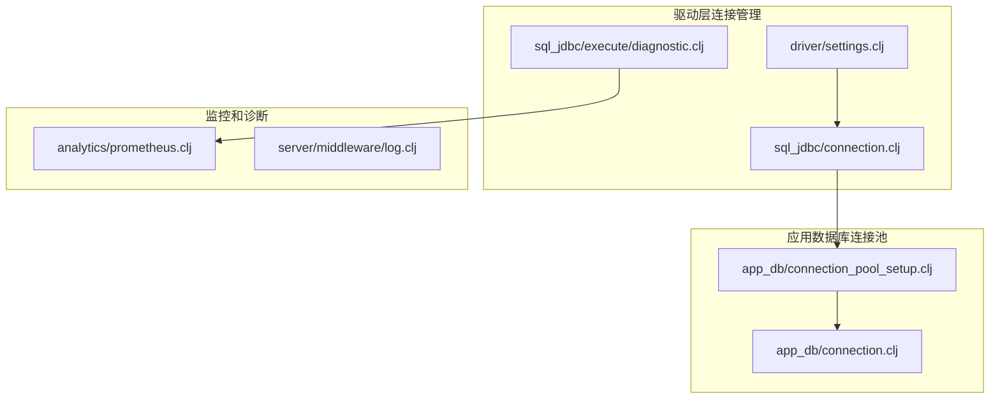
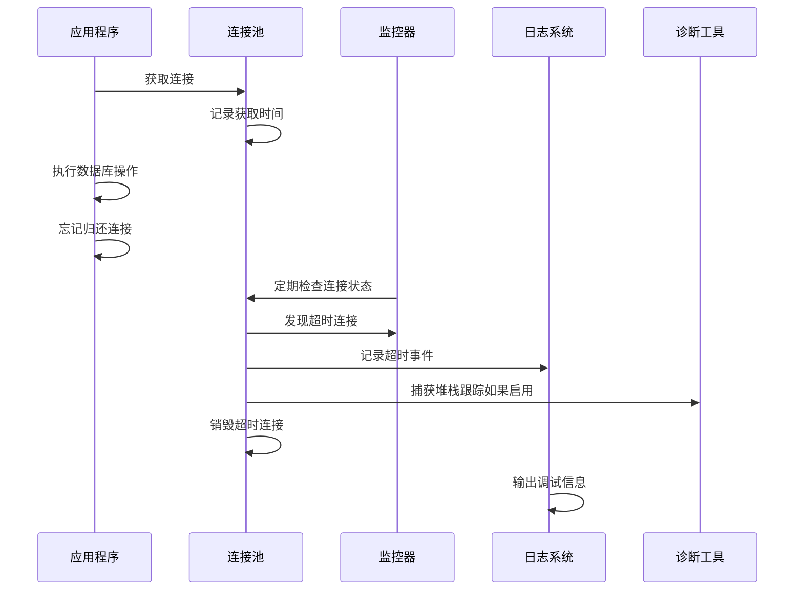
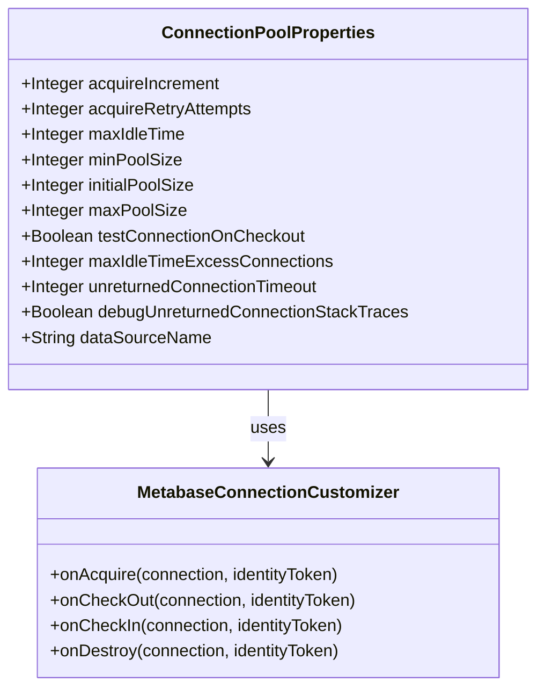
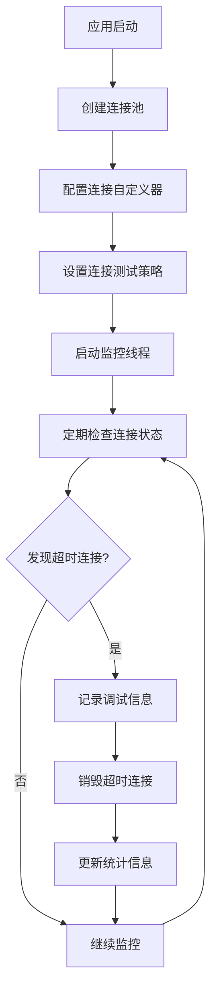
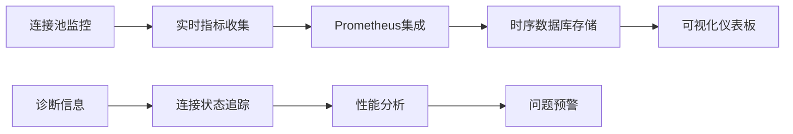
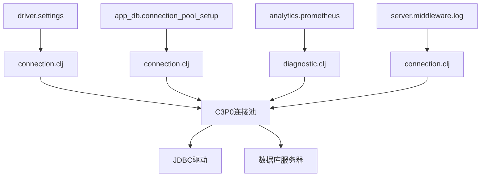
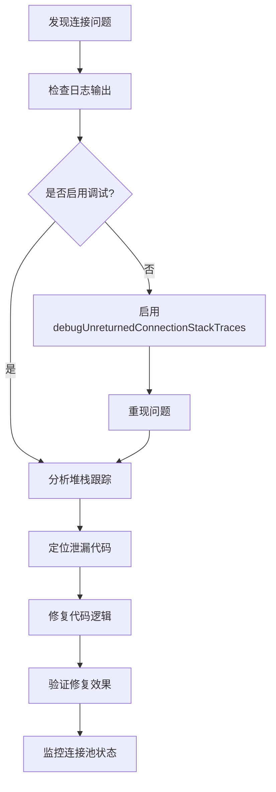

# 连接泄漏检测

<cite>
**本文档中引用的文件**
- [connection.clj](file://src/metabase/driver/sql_jdbc/connection.clj)
- [connection_pool_setup.clj](file://src/metabase/app_db/connection_pool_setup.clj)
- [connection.clj](file://src/metabase/app_db/connection.clj)
- [diagnostic.clj](file://src/metabase/driver/sql_jdbc/execute/diagnostic.clj)
- [settings.clj](file://src/metabase/driver/settings.clj)
- [prometheus.clj](file://src/metabase/analytics/prometheus.clj)
- [log.clj](file://src/metabase/server/middleware/log.clj)
</cite>

## 目录
1. [简介](#简介)
2. [项目结构概览](#项目结构概览)
3. [核心组件分析](#核心组件分析)
4. [架构概览](#架构概览)
5. [详细组件分析](#详细组件分析)
6. [依赖关系分析](#依赖关系分析)
7. [性能考虑](#性能考虑)
8. [故障排除指南](#故障排除指南)
9. [结论](#结论)

## 简介

Metabase 实现了一套完善的连接泄漏检测机制，通过 C3P0 连接池的 `unreturnedConnectionTimeout` 和 `debugUnreturnedConnectionStackTraces` 参数来监控和管理数据库连接的生命周期。该机制能够在连接长时间未归还时自动销毁连接，并提供详细的调试信息帮助开发者识别和解决连接泄漏问题。

连接泄漏检测是数据库连接池管理的重要组成部分，它能够防止应用程序因连接资源耗尽而导致的服务中断。当应用程序中的某些代码路径未能正确关闭数据库连接时，连接池会积累越来越多的未使用连接，最终可能导致整个系统无法处理新的查询请求。

## 项目结构概览

Metabase 的连接泄漏检测机制主要分布在以下几个关键模块中：



**图表来源**
- [connection.clj](file://src/metabase/driver/sql_jdbc/connection.clj#L50-L154)
- [connection_pool_setup.clj](file://src/metabase/app_db/connection_pool_setup.clj#L85-L151)

## 核心组件分析

### unreturnedConnectionTimeout 参数

`unreturnedConnectionTimeout` 是连接泄漏检测的核心参数，定义了连接在被检查出后必须在指定时间内归还的最大时间限制。

#### 工作原理

该参数通过以下机制工作：
1. **连接检查点标记**：每次从连接池获取连接时，C3P0 会记录当前时间戳
2. **超时检测**：定期检查所有活跃连接，识别超过设定时间的未归还连接
3. **自动销毁**：对超时的连接执行 `destroy()` 操作，强制释放资源
4. **预防机制**：允许应用程序在连接池耗尽前继续运行，避免服务完全不可用

#### 配置和计算

连接超时时间的计算逻辑如下：
- 默认值：基于查询超时时间（`*query-timeout-ms*`）除以 1000 秒
- 可配置：可通过环境变量或设置覆盖默认值
- 合理性验证：确保超时时间足够长，避免误杀正常使用的连接

**章节来源**
- [connection.clj](file://src/metabase/driver/sql_jdbc/connection.clj#L128-L141)
- [settings.clj](file://src/metabase/driver/settings.clj#L122-L135)

### debugUnreturnedConnectionStackTraces 功能

`debugUnreturnedConnectionStackTraces` 提供了详细的调试信息收集能力，用于定位连接泄漏的具体位置。

#### 堆栈跟踪捕获机制

该功能通过以下方式实现：
1. **异常对象创建**：为每个连接获取操作创建异常对象（包含调用堆栈）
2. **堆栈信息保存**：将堆栈跟踪信息与连接关联存储
3. **超时触发输出**：当连接超时时，输出对应的堆栈跟踪信息
4. **调试信息记录**：在日志中记录详细的调用链信息

#### 性能影响分析

启用该功能会带来以下性能开销：
- **内存使用**：每个连接获取操作额外消耗约 800 字节的堆栈跟踪信息
- **CPU 开销**：创建异常对象需要约 600 纳秒的额外处理时间
- **网络延迟**：堆栈跟踪信息可能增加日志输出的大小

**章节来源**
- [connection.clj](file://src/metabase/driver/sql_jdbc/connection.clj#L141-L154)
- [settings.clj](file://src/metabase/driver/settings.clj#L141-L154)

## 架构概览

连接泄漏检测机制的整体架构采用分层设计，确保各个组件之间的职责清晰分离：



**图表来源**
- [connection.clj](file://src/metabase/driver/sql_jdbc/connection.clj#L245-L273)
- [diagnostic.clj](file://src/metabase/driver/sql_jdbc/execute/diagnostic.clj#L28-L48)

## 详细组件分析

### 数据仓库连接池配置

数据仓库连接池的配置专门针对数据分析场景进行了优化：



**图表来源**
- [connection.clj](file://src/metabase/driver/sql_jdbc/connection.clj#L70-L154)
- [connection_pool_setup.clj](file://src/metabase/app_db/connection_pool_setup.clj#L60-L85)

#### 关键配置参数详解

| 参数名称 | 默认值 | 描述 | 性能影响 |
|---------|--------|------|----------|
| `acquireIncrement` | 1 | 每次获取新连接的数量 | 影响内存使用和连接建立速度 |
| `maxIdleTime` | 3小时 | 连接空闲最大时间 | 控制连接池大小和资源占用 |
| `maxPoolSize` | 15 | 连接池最大容量 | 影响并发处理能力和内存使用 |
| `testConnectionOnCheckout` | true | 检查时测试连接有效性 | 增加连接获取的延迟 |
| `unreturnedConnectionTimeout` | 查询超时/1000 | 未归还连接超时时间 | 防止连接泄漏导致的问题 |
| `debugUnreturnedConnectionStackTraces` | false | 是否记录堆栈跟踪 | 显著增加调试信息但影响性能 |

**章节来源**
- [connection.clj](file://src/metabase/driver/sql_jdbc/connection.clj#L96-L154)

### 应用数据库连接池配置

应用数据库连接池针对 Metabase 内部数据访问进行了特殊优化：



**图表来源**
- [connection_pool_setup.clj](file://src/metabase/app_db/connection_pool_setup.clj#L60-L151)

#### 连接生命周期管理

应用数据库连接池实现了完整的生命周期管理：

1. **连接获取**：记录获取时间和活动状态
2. **连接使用**：监控连接的活跃度和资源使用
3. **连接归还**：清理会话资源并更新状态
4. **连接销毁**：释放所有相关资源

**章节来源**
- [connection_pool_setup.clj](file://src/metabase/app_db/connection_pool_setup.clj#L60-L85)

### 诊断和监控系统

诊断系统提供了实时的连接池状态监控和历史数据分析：



**图表来源**
- [diagnostic.clj](file://src/metabase/driver/sql_jdbc/execute/diagnostic.clj#L28-L48)
- [prometheus.clj](file://src/metabase/analytics/prometheus.clj#L141-L171)

#### 监控指标定义

诊断系统收集的关键指标包括：

| 指标名称 | 类型 | 描述 |
|---------|------|------|
| `active-connections` | 数值 | 当前正在使用的连接数 |
| `total-connections` | 数值 | 连接池中的总连接数 |
| `threads-waiting` | 数值 | 等待获取连接的线程数 |
| `busy-connections` | 数值 | 忙碌状态的连接数 |
| `idle-connections` | 数值 | 空闲状态的连接数 |

**章节来源**
- [diagnostic.clj](file://src/metabase/driver/sql_jdbc/execute/diagnostic.clj#L35-L48)

## 依赖关系分析

连接泄漏检测机制涉及多个模块间的复杂依赖关系：



**图表来源**
- [connection.clj](file://src/metabase/driver/sql_jdbc/connection.clj#L1-L30)
- [connection_pool_setup.clj](file://src/metabase/app_db/connection_pool_setup.clj#L1-L20)

### 外部依赖

连接泄漏检测机制依赖以下外部组件：

1. **C3P0 连接池**：提供连接管理和超时检测功能
2. **JDBC 驱动**：实现具体的数据库连接协议
3. **日志框架**：支持调试信息的记录和输出
4. **监控系统**：提供性能指标的收集和展示

**章节来源**
- [connection.clj](file://src/metabase/driver/sql_jdbc/connection.clj#L1-L20)

## 性能考虑

### 连接泄漏检测的性能影响

连接泄漏检测机制在提供安全保障的同时，也会带来一定的性能开销：

#### CPU 性能影响

- **连接获取开销**：启用堆栈跟踪时增加约 600 纳秒的处理时间
- **定期检查开销**：监控线程的定期扫描会产生持续的 CPU 使用
- **垃圾回收压力**：频繁创建的异常对象可能增加 GC 负担

#### 内存性能影响

- **堆栈跟踪存储**：每个连接获取操作消耗约 800 字节内存
- **连接池扩展**：超时连接的销毁和重建可能暂时增加内存使用
- **日志缓冲区**：调试信息的记录需要额外的内存缓冲

#### 网络性能影响

- **日志传输**：大量调试信息可能增加网络带宽使用
- **监控数据**：Prometheus 指标收集可能产生额外的网络流量

### 性能优化建议

1. **合理设置超时时间**：避免过短的超时时间导致误杀正常连接
2. **选择性启用调试功能**：仅在开发和测试环境中启用堆栈跟踪
3. **监控连接池状态**：定期检查连接池的健康状况
4. **优化连接使用模式**：确保应用程序正确关闭数据库连接

## 故障排除指南

### 常见连接泄漏场景

#### 场景一：忘记关闭结果集

```clojure
;; 错误示例：忘记关闭结果集
(defn query-data []
  (let [conn (get-connection)]
    (jdbc/query conn ["SELECT * FROM large_table"])
    ;; 忘记关闭结果集和连接
    ))
```

#### 场景二：异常处理不当

```clojure
;; 错误示例：异常处理不完整
(defn safe-query []
  (let [conn (get-connection)]
    (try
      (jdbc/query conn ["SELECT * FROM table"])
      ;; 缺少 finally 块
      (catch Exception e
        (log/error e "Query failed")))))
```

#### 场景三：事务管理错误

```clojure
;; 错误示例：事务未正确提交或回滚
(defn transaction-example []
  (let [conn (get-connection)]
    (jdbc/with-transaction [tx conn]
      (jdbc/update! tx :table {:id 1} {:value "new"})
      ;; 忘记显式提交事务
      )))
```

### 调试连接泄漏的方法

#### 启用调试日志

要启用连接泄漏的调试功能，需要进行以下配置：

1. **设置环境变量**：
   ```bash
   MB_JDBC_DATA_WAREHOUSE_DEBUG_UNRETURNED_CONNECTION_STACK_TRACES=true
   ```

2. **配置日志级别**：
   ```xml
   <!-- log4j.xml -->
   <logger name="com.mchange">
       <level value="INFO"/>
   </logger>
   ```

#### 分析日志输出

当连接泄漏发生时，系统会输出类似以下的日志信息：

```
WARN  c.m.v2.c3p0.impl.NewPooledConnection - An existing PreparedStatement was garbage collected without being explicitly closed. The corresponding physical connection was null and was destroyed by the garbage collector. The stack trace of this event is:
java.lang.Exception: Stack trace of connection checkout
    at com.mchange.v2.c3p0.impl.NewPooledConnection.<init>(NewPooledConnection.java:100)
    at com.mchange.v2.c3p0.impl.PoolBackedDataSource.getConnection(PoolBackedDataSource.java:350)
    ...
```

#### 使用 Prometheus 监控

通过 Prometheus 接口可以获取详细的连接池指标：

```bash
# 获取连接池状态
curl http://localhost:3000/api/metrics/prometheus

# 监控连接使用情况
c3p0_num_connections{database="metabase-postgres-app-db"} 15
c3p0_num_busy_connections{database="metabase-postgres-app-db"} 5
c3p0_num_idle_connections{database="metabase-postgres-app-db"} 10
```

### 连接泄漏问题排查流程



**章节来源**
- [connection.clj](file://src/metabase/driver/sql_jdbc/connection.clj#L141-L154)
- [prometheus.clj](file://src/metabase/analytics/prometheus.clj#L118-L171)

### 最佳实践建议

1. **代码审查**：定期审查数据库连接的使用模式
2. **自动化测试**：编写单元测试验证连接的正确关闭
3. **监控告警**：设置连接池使用率的监控告警
4. **文档规范**：制定数据库连接使用的编码规范
5. **培训教育**：对开发团队进行连接管理的最佳实践培训

## 结论

Metabase 的连接泄漏检测机制通过 `unreturnedConnectionTimeout` 和 `debugUnreturnedConnectionStackTraces` 参数的协同工作，为应用程序提供了强大的连接管理保障。该机制不仅能够防止连接泄漏导致的服务中断，还提供了详细的调试信息帮助开发者快速定位和解决问题。

### 主要优势

1. **自动防护**：无需人工干预即可防止连接池耗尽
2. **详细调试**：提供完整的调用堆栈信息用于问题定位
3. **性能可控**：可选择性启用调试功能，平衡性能和调试需求
4. **监控完善**：集成多种监控手段，提供全面的状态视图

### 使用建议

- 在生产环境中谨慎启用堆栈跟踪功能，避免影响性能
- 定期监控连接池状态，及时发现潜在问题
- 建立完善的连接管理规范和代码审查流程
- 利用监控工具建立连接使用情况的基线和告警机制

通过合理配置和使用这些功能，开发团队可以显著提高应用程序的稳定性和可靠性，同时获得更好的问题诊断能力。