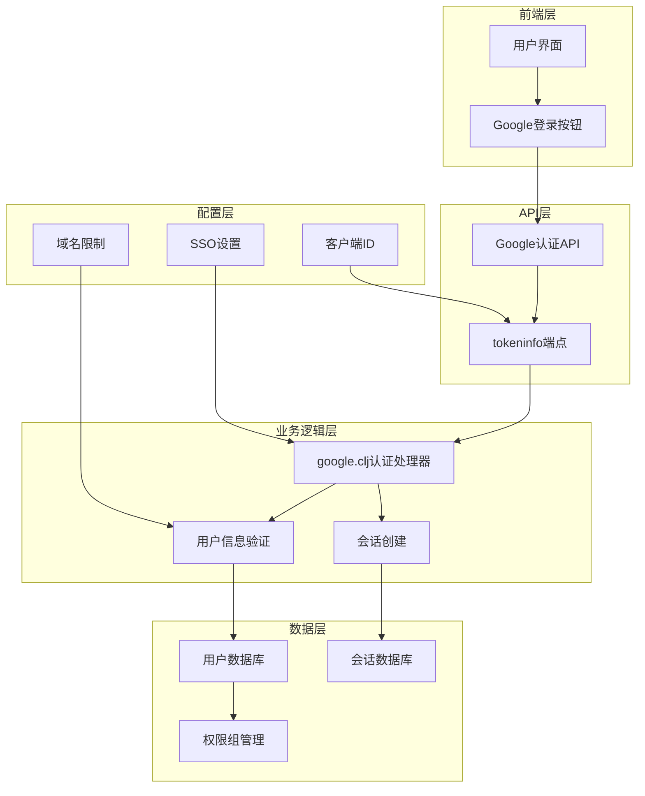
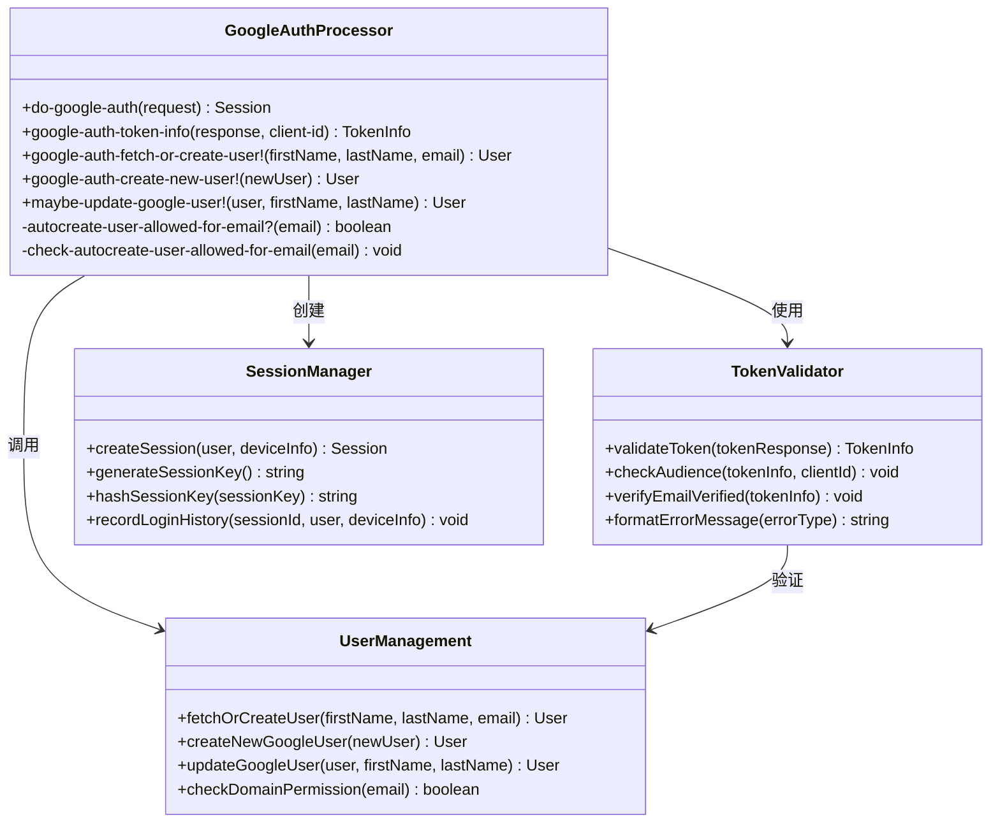
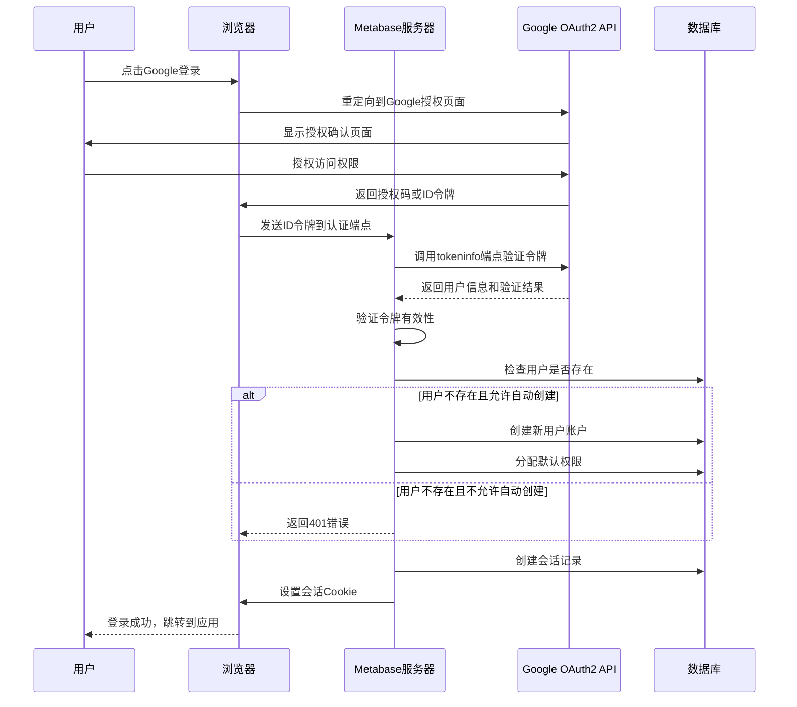
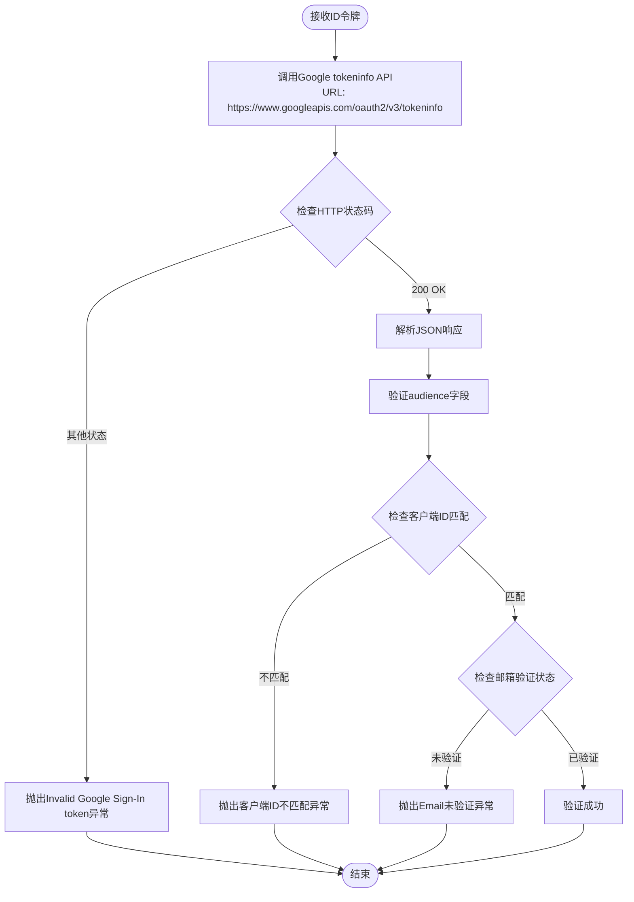
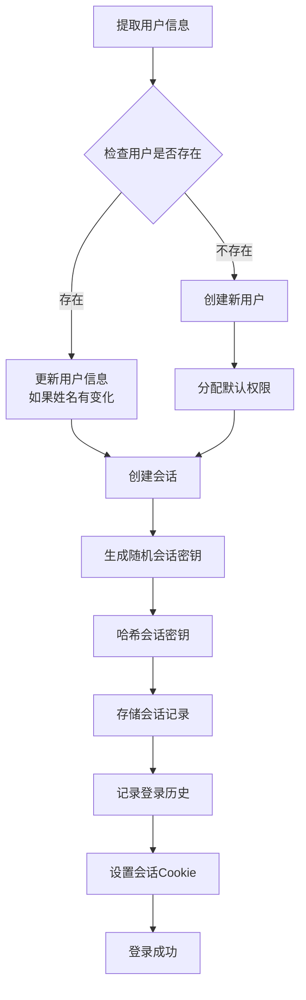
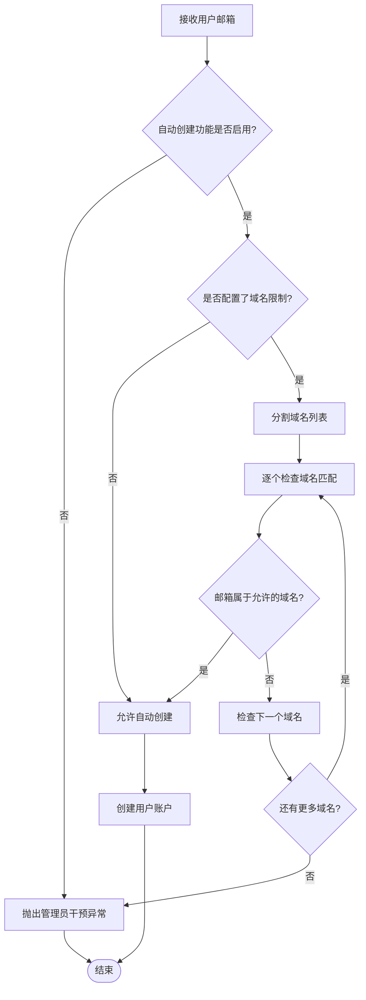
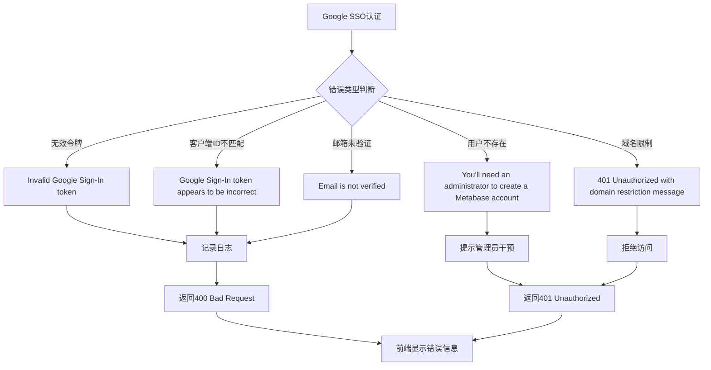
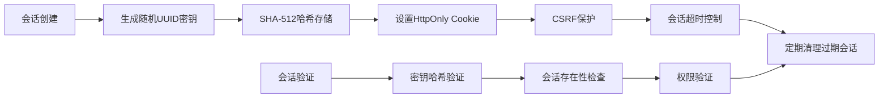

# Google SSO 集成

<cite>
**本文档中引用的文件**
- [google.clj](file://src/metabase/sso/google.clj)
- [core.clj](file://src/metabase/sso/core.clj)
- [common.clj](file://src/metabase/sso/common.clj)
- [settings.clj](file://src/metabase/sso/settings.clj)
- [api/google.clj](file://src/metabase/sso/api/google.clj)
- [user.clj](file://src/metabase/users/models/user.clj)
- [session.clj](file://src/metabase/session/models/session.clj)
- [cookies.clj](file://src/metabase/request/cookies.clj)
</cite>

## 目录
1. [简介](#简介)
2. [系统架构概览](#系统架构概览)
3. [核心组件分析](#核心组件分析)
4. [认证流程详解](#认证流程详解)
5. [ID令牌验证机制](#id令牌验证机制)
6. [用户信息提取与会话创建](#用户信息提取与会话创建)
7. [自动用户创建功能](#自动用户创建功能)
8. [错误处理策略](#错误处理策略)
9. [安全最佳实践](#安全最佳实践)
10. [配置指南](#配置指南)
11. [故障排除](#故障排除)
12. [总结](#总结)

## 简介

Metabase的Google SSO（单点登录）集成功为组织提供了安全便捷的用户认证解决方案。该系统通过OAuth2协议与Google身份验证服务进行交互，支持基于ID令牌的身份验证、自动用户创建以及细粒度的权限控制。本文档深入分析了Google SSO的实现细节，包括认证流程、安全机制和配置选项。

## 系统架构概览

Google SSO集成采用模块化设计，主要包含以下核心模块：



**图表来源**
- [google.clj](file://src/metabase/sso/google.clj#L81-L88)
- [core.clj](file://src/metabase/sso/core.clj#L1-L45)

## 核心组件分析

### Google认证处理器

Google认证的核心实现在`google.clj`文件中，包含以下关键函数：



**图表来源**
- [google.clj](file://src/metabase/sso/google.clj#L81-L88)
- [user.clj](file://src/metabase/users/models/user.clj#L315-L325)

**章节来源**
- [google.clj](file://src/metabase/sso/google.clj#L1-L90)
- [core.clj](file://src/metabase/sso/core.clj#L1-L45)

## 认证流程详解

Google SSO认证遵循标准的OAuth2流程，具体步骤如下：



**图表来源**
- [google.clj](file://src/metabase/sso/google.clj#L81-L88)
- [session.clj](file://src/metabase/session/models/session.clj#L70-L105)

**章节来源**
- [google.clj](file://src/metabase/sso/google.clj#L81-L88)

## ID令牌验证机制

### tokeninfo端点调用

Metabase通过Google提供的tokeninfo端点验证ID令牌的有效性：



**图表来源**
- [google.clj](file://src/metabase/sso/google.clj#L23-L59)

### 验证规则详解

1. **HTTP状态码验证**：确保API调用成功返回200状态码
2. **客户端ID验证**：检查令牌的audience字段是否包含配置的客户端ID
3. **邮箱验证状态**：确保用户的Google邮箱已经过验证

**章节来源**
- [google.clj](file://src/metabase/sso/google.clj#L23-L59)

## 用户信息提取与会话创建

### 用户信息提取

从Google ID令牌中提取的关键用户信息包括：

| 字段名 | 描述 | 来源 |
|--------|------|------|
| given_name | 用户名（First Name） | ID令牌中的given_name字段 |
| family_name | 姓氏（Last Name） | ID令牌中的family_name字段 |
| email | 用户邮箱地址 | ID令牌中的email字段 |
| email_verified | 邮箱验证状态 | ID令牌中的email_verified字段 |

### 会话创建流程



**图表来源**
- [google.clj](file://src/metabase/sso/google.clj#L67-L80)
- [session.clj](file://src/metabase/session/models/session.clj#L70-L105)

**章节来源**
- [google.clj](file://src/metabase/sso/google.clj#L67-L80)
- [session.clj](file://src/metabase/session/models/session.clj#L70-L105)

## 自动用户创建功能

### 域名限制机制

为了控制哪些用户可以自动创建账户，系统提供了基于域名的访问控制：



**图表来源**
- [google.clj](file://src/metabase/sso/google.clj#L41-L58)

### 用户属性映射

自动创建的Google用户具有以下属性特征：

| 属性 | 值 | 说明 |
|------|-----|------|
| sso_source | "google" | 标识SSO来源为Google |
| is_active | true | 默认激活状态 |
| password | 随机生成 | 提供密码以备后续本地登录 |
| password_salt | 随机生成 | BCrypt加密盐值 |
| type | "personal" | 用户类型标识 |

**章节来源**
- [google.clj](file://src/metabase/sso/google.clj#L41-L58)
- [user.clj](file://src/metabase/users/models/user.clj#L315-L325)

## 错误处理策略

### 主要错误类型及处理



**图表来源**
- [google.clj](file://src/metabase/sso/google.clj#L23-L59)

### 异常处理实现

系统使用Clojure的异常处理机制，每个错误类型都有特定的状态码和错误消息：

| 错误类型 | HTTP状态码 | 错误消息 | 处理方式 |
|----------|------------|----------|----------|
| 无效令牌 | 400 | "Invalid Google Sign-In token." | 抛出异常，记录日志 |
| 客户端ID不匹配 | 400 | "Google Sign-In token appears to be incorrect." | 抛出异常，检查配置 |
| 邮箱未验证 | 400 | "Email is not verified." | 抛出异常，建议用户验证邮箱 |
| 用户不存在 | 401 | "You'll need an administrator to create a Metabase account" | 提示管理员创建账户 |
| 域名限制 | 401 | 域名限制错误消息 | 拒绝访问，提示联系管理员 |

**章节来源**
- [google.clj](file://src/metabase/sso/google.clj#L23-L59)

## 安全最佳实践

### 令牌验证的防篡改机制

1. **HTTPS强制使用**：所有与Google OAuth2 API的通信必须通过HTTPS加密传输
2. **客户端ID验证**：严格验证令牌的audience字段与配置的客户端ID匹配
3. **邮箱验证检查**：确保用户邮箱已经过Google验证
4. **会话密钥哈希**：会话密钥在数据库中以SHA-512哈希形式存储

### 会话管理安全考虑



**图表来源**
- [session.clj](file://src/metabase/session/models/session.clj#L37-L70)
- [cookies.clj](file://src/metabase/request/cookies.clj#L117-L162)

### 密码安全策略

对于Google SSO用户：
- 自动生成随机密码用于本地登录回退
- 密码以BCrypt算法加盐存储
- 支持密码重置功能（当Google SSO禁用时）
- 不允许直接修改Google认证的密码

**章节来源**
- [session.clj](file://src/metabase/session/models/session.clj#L37-L70)
- [user.clj](file://src/metabase/users/models/user.clj#L325-L340)

## 配置指南

### 基础配置步骤

1. **Google Cloud Console配置**
   - 创建Google Cloud项目
   - 启用Google+ API
   - 配置OAuth2客户端ID
   - 设置授权重定向URI

2. **Metabase SSO配置**
   ```clojure
   ;; 在Metabase设置中配置
   {:google-auth-client-id "your-client-id.apps.googleusercontent.com"
    :google-auth-enabled true
    :google-auth-auto-create-accounts-domain "company.com"}
   ```

### 高级配置选项

| 配置项 | 类型 | 默认值 | 说明 |
|--------|------|--------|------|
| google-auth-client-id | string | null | Google OAuth2客户端ID |
| google-auth-enabled | boolean | false | 是否启用Google SSO |
| google-auth-auto-create-accounts-domain | string | null | 允许自动创建的域名（可多域名逗号分隔） |
| send-new-sso-user-admin-email? | boolean | true | 是否发送新用户通知邮件 |

### 域名限制配置

支持多种域名格式：
- 单域名：`company.com`
- 多域名：`company.com,partner.com`
- 子域名：`*.company.com`（需要Premium功能）

**章节来源**
- [settings.clj](file://src/metabase/sso/settings.clj#L150-L227)
- [api/google.clj](file://src/metabase/sso/api/google.clj#L1-L25)

## 故障排除

### 常见问题及解决方案

1. **"Invalid Google Sign-In token"**
   - 检查客户端ID配置是否正确
   - 确认Google Cloud Console中的OAuth2设置
   - 验证重定向URI配置

2. **"Google Sign-In token appears to be incorrect"**
   - 确认Google Cloud Console中的客户端ID与配置一致
   - 检查是否有多个客户端ID配置冲突

3. **"Email is not verified"**
   - 建议用户在Google账户中验证邮箱地址
   - 或者在Metabase中手动创建用户账户

4. **"You'll need an administrator to create a Metabase account"**
   - 管理员需要在Metabase中创建对应用户
   - 或者配置允许自动创建的域名

### 调试技巧

1. **启用详细日志**：在开发环境中启用DEBUG级别日志
2. **检查网络请求**：使用浏览器开发者工具监控API调用
3. **验证令牌结构**：使用在线工具解码Google ID令牌
4. **测试配置**：使用Google提供的OAuth2测试工具

**章节来源**
- [google.clj](file://src/metabase/sso/google.clj#L23-L59)

## 总结

Metabase的Google SSO集成为企业提供了安全可靠的单点登录解决方案。通过严格的令牌验证、灵活的用户管理策略和完善的错误处理机制，系统能够满足不同规模组织的认证需求。

### 关键特性总结

1. **安全性**：HTTPS传输、令牌验证、会话保护
2. **灵活性**：域名限制、自动创建、权限管理
3. **易用性**：无缝集成、简单配置、直观界面
4. **可扩展性**：模块化设计、插件架构、API接口

### 最佳实践建议

1. 始终使用HTTPS保护所有敏感通信
2. 定期审查和更新OAuth2客户端配置
3. 合理设置域名限制策略
4. 监控和审计用户登录活动
5. 保持系统和依赖库的及时更新

通过遵循本文档的指导和最佳实践，组织可以成功部署和维护一个安全高效的Google SSO系统。