# LDAP 认证集成

<cite>
**本文档中引用的文件**
- [ldap.clj](file://src/metabase/sso/ldap.clj)
- [default_implementation.clj](file://src/metabase/sso/ldap/default_implementation.clj)
- [settings.clj](file://src/metabase/sso/settings.clj)
- [common.clj](file://src/metabase/sso/common.clj)
- [api/ldap.clj](file://src/metabase/sso/api/ldap.clj)
- [session/api.clj](file://src/metabase/session/api.clj)
</cite>

## 目录
1. [简介](#简介)
2. [系统架构概览](#系统架构概览)
3. [核心组件分析](#核心组件分析)
4. [LDAP连接管理机制](#ldap连接管理机制)
5. [用户认证流程](#用户认证流程)
6. [用户信息同步](#用户信息同步)
7. [组同步机制](#组同步机制)
8. [配置参数详解](#配置参数详解)
9. [连接测试与故障排除](#连接测试与故障排除)
10. [错误诊断指南](#错误诊断指南)
11. [最佳实践建议](#最佳实践建议)

## 简介

Metabase的LDAP认证集成功为企业级身份验证提供了强大的解决方案。该系统通过与LDAP服务器建立安全连接，实现了用户身份验证、信息同步和权限管理的自动化。本文档详细解析了LDAP认证的核心实现机制，包括连接池管理、安全协议支持、超时控制以及完整的用户同步流程。

## 系统架构概览

LDAP认证系统采用分层架构设计，主要包含以下核心层次：

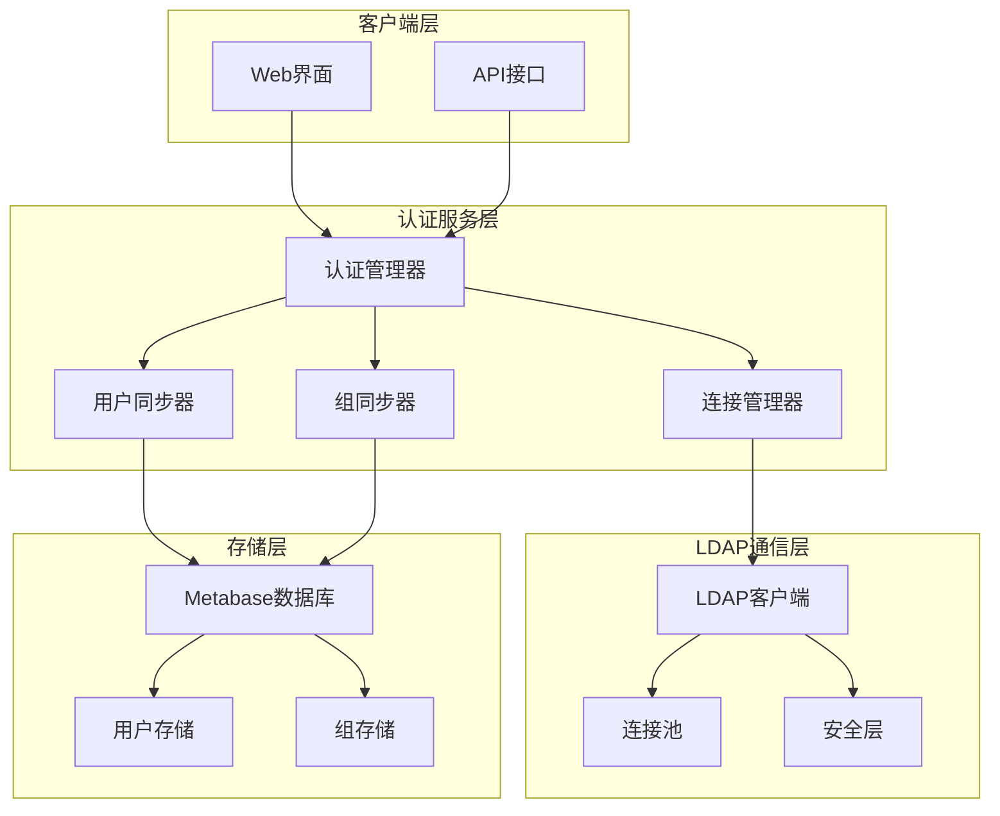

**图表来源**
- [ldap.clj](file://src/metabase/sso/ldap.clj#L1-L227)
- [default_implementation.clj](file://src/metabase/sso/ldap/default_implementation.clj#L1-L189)

## 核心组件分析

### 主要命名空间结构

LDAP认证系统的核心组件分布在多个命名空间中：

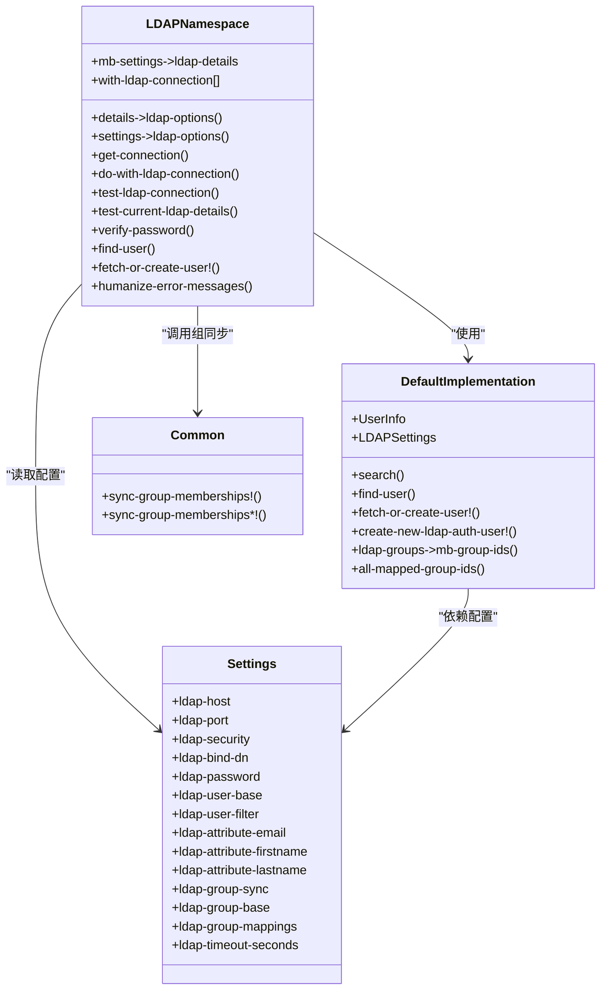

**图表来源**
- [ldap.clj](file://src/metabase/sso/ldap.clj#L17-L36)
- [default_implementation.clj](file://src/metabase/sso/ldap/default_implementation.clj#L17-L33)
- [settings.clj](file://src/metabase/sso/settings.clj#L15-L110)

**章节来源**
- [ldap.clj](file://src/metabase/sso/ldap.clj#L1-L227)
- [default_implementation.clj](file://src/metabase/sso/ldap/default_implementation.clj#L1-L189)
- [settings.clj](file://src/metabase/sso/settings.clj#L1-L228)

## LDAP连接管理机制

### 连接池配置与管理

LDAP连接管理系统基于UnboundID LDAP SDK构建，提供了高效的连接池管理机制：

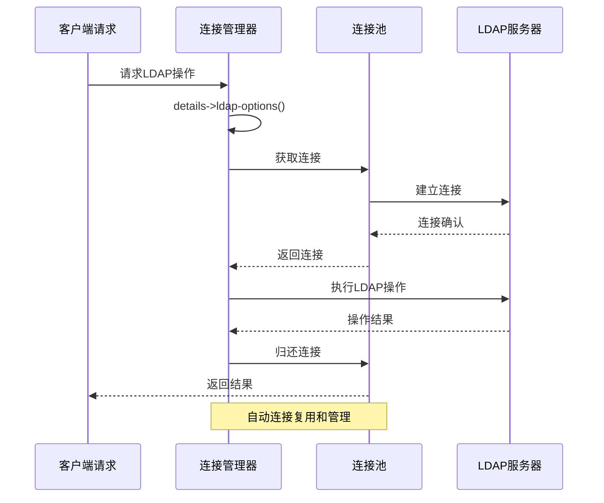

**图表来源**
- [ldap.clj](file://src/metabase/sso/ldap.clj#L45-L70)
- [ldap.clj](file://src/metabase/sso/ldap.clj#L65-L75)

### 安全协议支持

系统支持多种安全协议，确保数据传输的安全性：

| 协议类型 | 描述 | 端口 | 使用场景 |
|---------|------|------|----------|
| 无加密 | 明文传输 | 389 | 内网环境测试 |
| SSL | SSL加密连接 | 636 | 需要加密但不支持STARTTLS的环境 |
| STARTTLS | 启动TLS | 389 | 支持TLS升级的标准环境 |

### 超时控制机制

系统实现了多层次的超时控制：

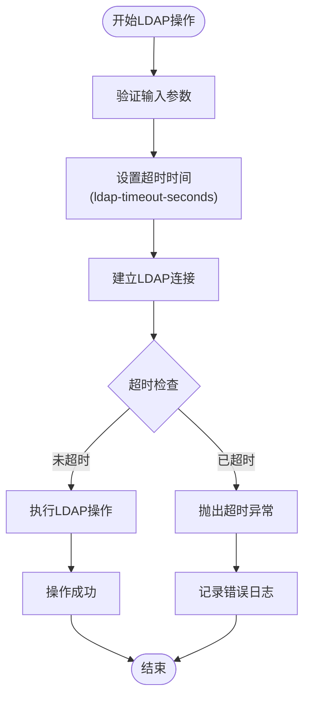

**图表来源**
- [ldap.clj](file://src/metabase/sso/ldap.clj#L129-L134)
- [settings.clj](file://src/metabase/sso/settings.clj#L132-L134)

**章节来源**
- [ldap.clj](file://src/metabase/sso/ldap.clj#L35-L75)
- [settings.clj](file://src/metabase/sso/settings.clj#L132-L134)

## 用户认证流程

### 完整认证流程

LDAP用户认证遵循严格的流程控制，确保安全性：

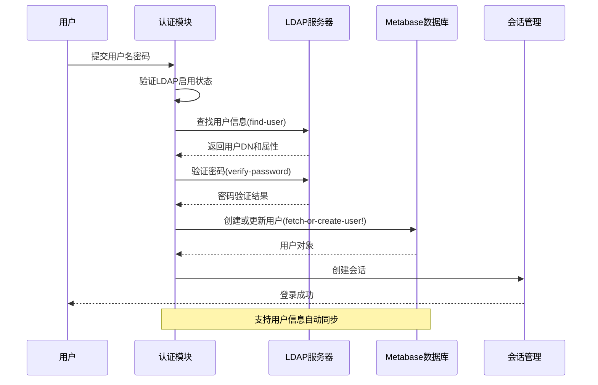

**图表来源**
- [ldap.clj](file://src/metabase/sso/ldap.clj#L145-L160)
- [session/api.clj](file://src/metabase/session/api.clj#L59-L82)

### 用户查找机制

用户查找过程采用智能过滤器匹配：

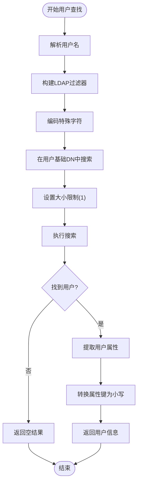

**图表来源**
- [default_implementation.clj](file://src/metabase/sso/ldap/default_implementation.clj#L45-L63)

**章节来源**
- [ldap.clj](file://src/metabase/sso/ldap.clj#L145-L160)
- [default_implementation.clj](file://src/metabase/sso/ldap/default_implementation.clj#L116-L143)

## 用户信息同步

### 属性映射机制

LDAP用户信息同步通过精确的属性映射实现：

| LDAP属性 | Metabase字段 | 默认值 | 描述 |
|---------|-------------|--------|------|
| email | email | mail | 用户邮箱地址 |
| givenName | first_name | givenName | 用户名字 |
| sn | last_name | sn | 用户姓氏 |
| memberOf | groups | - | 组成员关系 |

### 用户创建与更新逻辑

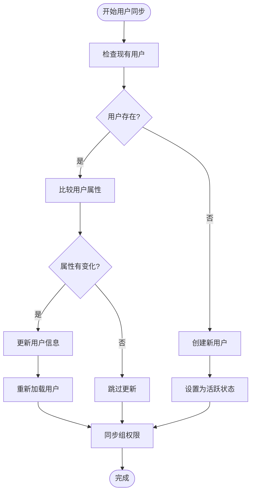

**图表来源**
- [default_implementation.clj](file://src/metabase/sso/ldap/default_implementation.clj#L143-L187)

**章节来源**
- [default_implementation.clj](file://src/metabase/sso/ldap/default_implementation.clj#L143-L187)

## 组同步机制

### 组映射配置

LDAP组同步通过精确的DN映射实现：

```mermaid
graph LR
subgraph "LDAP组"
LDAPGroup1["cn=Analysts,ou=Groups,dc=example,dc=com"]
LDAPGroup2["cn=Admins,ou=Groups,dc=example,dc=com"]
LDAPGroup3["cn=Readers,ou=Groups,dc=example,dc=com"]
end
subgraph "Metabase组"
MBGroup1["分析师组 (ID: 1)"]
MBGroup2["管理员组 (ID: 2)"]
MBGroup3["只读组 (ID: 3)"]
end
LDAPGroup1 --> MBGroup1
LDAPGroup2 --> MBGroup2
LDAPGroup3 --> MBGroup3
subgraph "映射配置"
Config["{\"cn=Analysts,...\": [1], \"cn=Admins,...\": [2], \"cn=Readers,...\": [3]}"]
end
Config --> LDAPGroup1
Config --> LDAPGroup2
Config --> LDAPGroup3
```

**图表来源**
- [settings.clj](file://src/metabase/sso/settings.clj#L85-L110)
- [common.clj](file://src/metabase/sso/common.clj#L1-L66)

### 组同步算法

组同步采用增量更新策略：

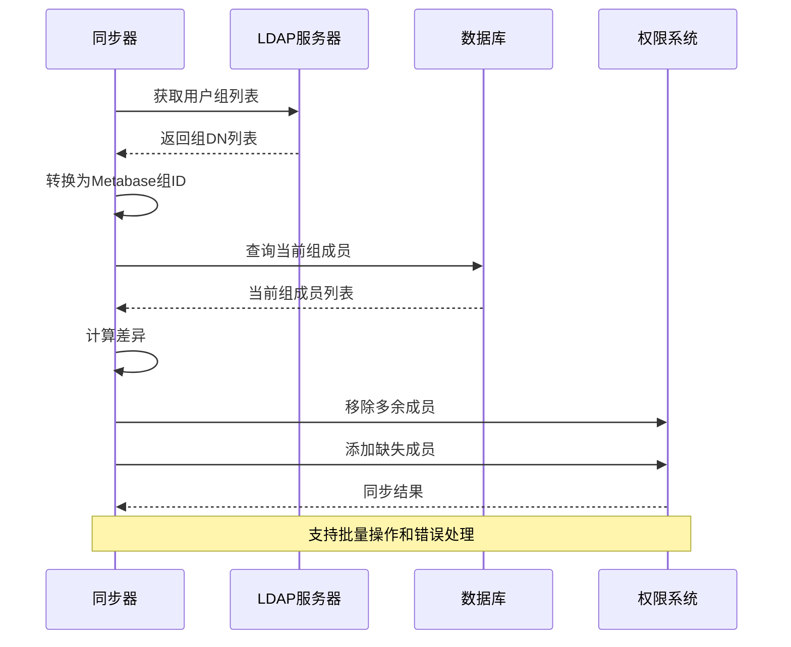

**图表来源**
- [common.clj](file://src/metabase/sso/common.clj#L25-L65)
- [default_implementation.clj](file://src/metabase/sso/ldap/default_implementation.clj#L143-L155)

**章节来源**
- [common.clj](file://src/metabase/sso/common.clj#L1-L66)
- [default_implementation.clj](file://src/metabase/sso/ldap/default_implementation.clj#L143-L155)

## 配置参数详解

### 核心配置参数表

| 参数名称 | 类型 | 默认值 | 必填 | 描述 |
|---------|------|--------|------|------|
| ldap-host | 字符串 | - | 是 | LDAP服务器主机名 |
| ldap-port | 整数 | 389 | 是 | LDAP服务器端口 |
| ldap-security | 关键字 | :none | 是 | 安全协议类型 |
| ldap-bind-dn | 字符串 | - | 是 | 绑定DN |
| ldap-password | 字符串 | - | 是 | 绑定密码 |
| ldap-user-base | 字符串 | - | 是 | 用户搜索基础DN |
| ldap-user-filter | 字符串 | (&(objectClass=inetOrgPerson)(\|(uid={login})(mail={login}))) | 否 | 用户查找过滤器 |
| ldap-attribute-email | 字符串 | mail | 否 | 邮箱属性名 |
| ldap-attribute-firstname | 字符串 | givenName | 否 | 名字属性名 |
| ldap-attribute-lastname | 字符串 | sn | 否 | 姓氏属性名 |
| ldap-group-sync | 布尔 | false | 否 | 是否启用组同步 |
| ldap-group-base | 字符串 | - | 否 | 组搜索基础DN |
| ldap-group-mappings | JSON | {} | 否 | 组映射配置 |
| ldap-timeout-seconds | 浮点数 | 15.0 | 否 | 超时时间(秒) |

### 高级配置选项

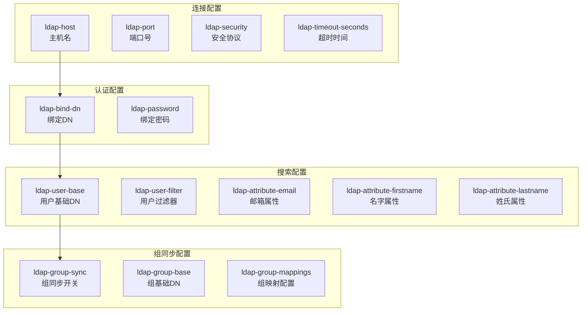

**图表来源**
- [settings.clj](file://src/metabase/sso/settings.clj#L15-L110)

**章节来源**
- [settings.clj](file://src/metabase/sso/settings.clj#L15-L110)

## 连接测试与故障排除

### 连接测试功能

系统提供了全面的连接测试功能：

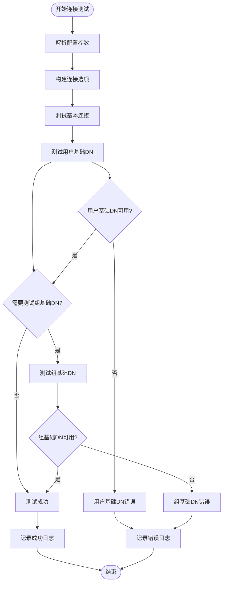

**图表来源**
- [ldap.clj](file://src/metabase/sso/ldap.clj#L80-L110)

### 常见错误消息诊断

系统提供了详细的错误消息映射机制：

| 错误模式 | 诊断信息 | 可能原因 | 解决方案 |
|---------|---------|---------|---------|
| UnknownHostException | Wrong host or port | 主机名解析失败 | 检查主机名和DNS配置 |
| ConnectException | Wrong host or port | 网络连接失败 | 检查网络连通性和防火墙 |
| SocketException | Wrong port or security setting | 端口或安全设置错误 | 验证端口和服务类型 |
| SSLException | Wrong port or security setting | SSL/TLS配置错误 | 检查SSL证书和协议版本 |
| password was incorrect | Password was incorrect | 密码错误 | 验证绑定密码 |
| Unable to bind as user | Wrong bind DN | 绑定DN错误 | 检查DN格式和权限 |
| AcceptSecurityContext error, data 525 | Wrong bind DN | 用户不存在 | 验证用户DN和账户状态 |
| AcceptSecurityContext error, data 52e | Wrong bind DN or password | 凭据错误 | 检查用户名和密码 |
| AcceptSecurityContext error, data 532 | Password is expired | 密码过期 | 更新LDAP账户密码 |
| AcceptSecurityContext error, data 533 | Account is disabled | 账户被禁用 | 启用LDAP账户 |
| AcceptSecurityContext error, data 701 | Account is expired | 账户过期 | 更新账户有效期 |

**章节来源**
- [ldap.clj](file://src/metabase/sso/ldap.clj#L80-L110)
- [ldap.clj](file://src/metabase/sso/ldap.clj#L183-L225)

## 错误诊断指南

### 分层诊断方法

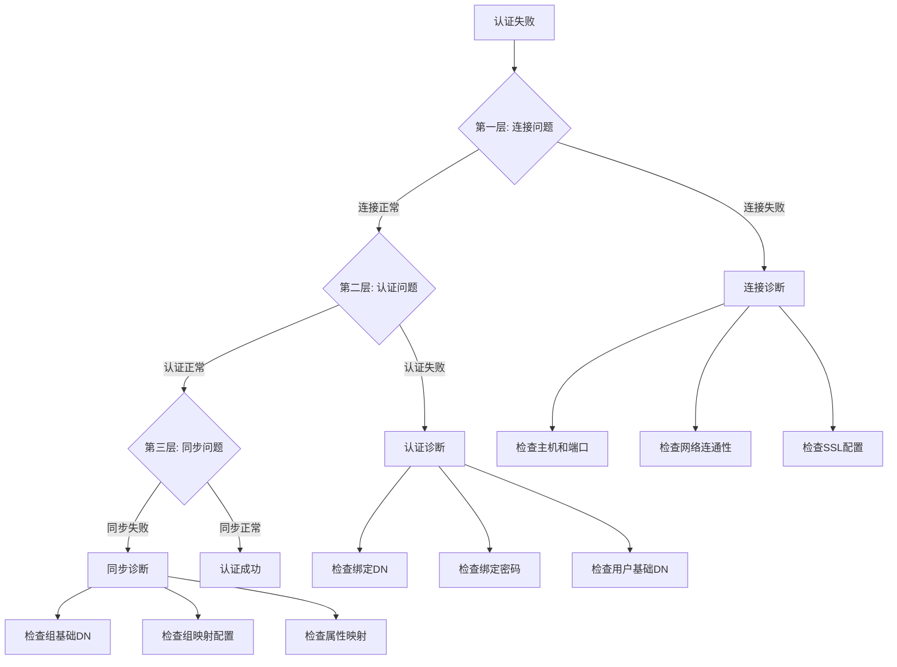

### 日志分析指南

系统提供了详细的日志记录机制，便于问题诊断：

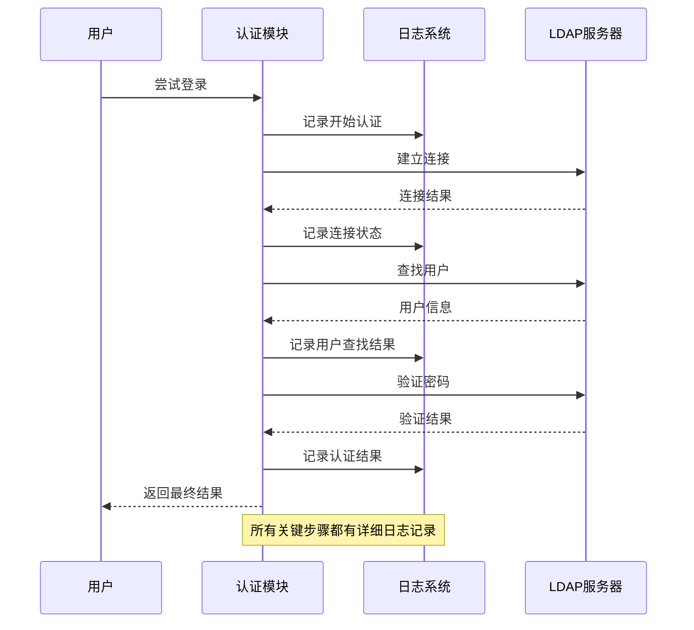

**章节来源**
- [ldap.clj](file://src/metabase/sso/ldap.clj#L183-L225)

## 最佳实践建议

### 安全配置建议

1. **使用安全连接**
   - 生产环境必须使用SSL或STARTTLS
   - 避免使用明文连接
   - 定期更新SSL证书

2. **最小权限原则**
   - 使用专用的绑定DN
   - 绑定DN仅具有必要的查询权限
   - 定期审查和更新权限

3. **性能优化**
   - 设置合理的超时时间(建议15-30秒)
   - 合理配置搜索范围和过滤器
   - 使用适当的连接池大小

### 监控和维护

1. **定期健康检查**
   - 定期运行连接测试
   - 监控认证成功率
   - 跟踪性能指标

2. **备份和恢复**
   - 备份LDAP配置
   - 记录重要的变更历史
   - 制定灾难恢复计划

3. **版本管理**
   - 跟踪LDAP服务器版本兼容性
   - 测试新版本的兼容性
   - 制定升级计划

### 故障排除清单

- [ ] 检查LDAP服务器是否可达
- [ ] 验证网络连接和防火墙设置
- [ ] 确认SSL/TLS配置正确
- [ ] 验证绑定DN和密码
- [ ] 检查用户基础DN是否存在
- [ ] 确认用户过滤器语法正确
- [ ] 验证组同步配置(如果启用)
- [ ] 检查Metabase日志中的错误信息
- [ ] 测试LDAP客户端工具连接

通过遵循这些最佳实践和诊断方法，可以确保LDAP认证系统的稳定运行和高效管理。