# LDAP连接管理技术文档

<cite>
**本文档中引用的文件**
- [ldap.clj](file://src/metabase/sso/ldap.clj)
- [settings.clj](file://src/metabase/sso/settings.clj)
- [default_implementation.clj](file://src/metabase/sso/ldap/default_implementation.clj)
- [ldap.clj](file://src/metabase/sso/api/ldap.clj)
- [session/api.clj](file://src/metabase/session/api.clj)
</cite>

## 目录
1. [简介](#简介)
2. [系统架构概览](#系统架构概览)
3. [核心组件分析](#核心组件分析)
4. [连接池机制](#连接池机制)
5. [安全协议支持](#安全协议支持)
6. [配置管理](#配置管理)
7. [连接测试功能](#连接测试功能)
8. [错误处理与故障排除](#错误处理与故障排除)
9. [性能优化建议](#性能优化建议)
10. [最佳实践](#最佳实践)

## 简介

Metabase的LDAP连接管理系统提供了企业级的身份认证和用户同步功能。该系统通过连接池机制管理LDAP服务器连接，支持多种安全协议（SSL/TLS），并提供了完善的连接测试和错误处理机制。

## 系统架构概览

LDAP连接管理系统采用分层架构设计，主要包含以下层次：

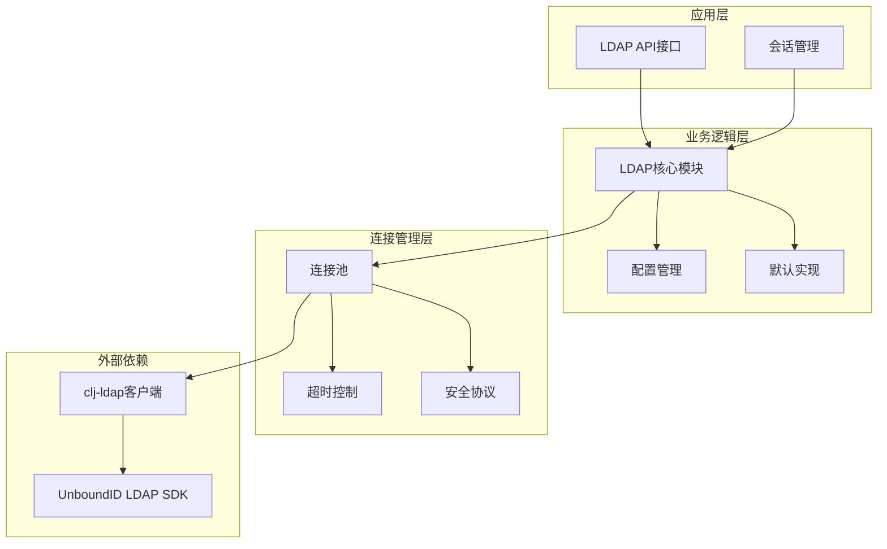

**图表来源**
- [ldap.clj](file://src/metabase/sso/ldap.clj#L1-L227)
- [settings.clj](file://src/metabase/sso/settings.clj#L1-L228)

## 核心组件分析

### LDAP连接核心模块

LDAP连接管理的核心功能集中在`metabase.sso.ldap`命名空间中，主要包含以下关键组件：

#### 连接选项映射

系统通过`mb-settings->ldap-details`映射将Metabase设置名称转换为LDAP连接参数：

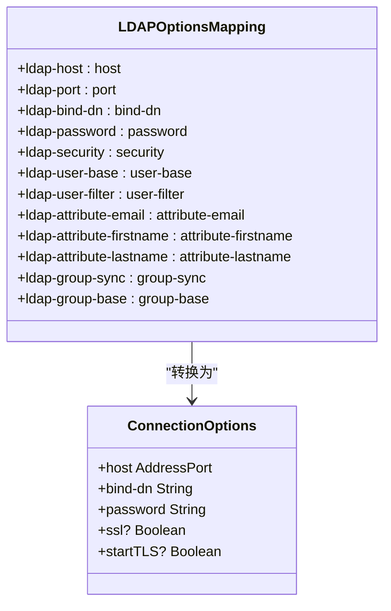

**图表来源**
- [ldap.clj](file://src/metabase/sso/ldap.clj#L17-L30)

#### 连接建立流程

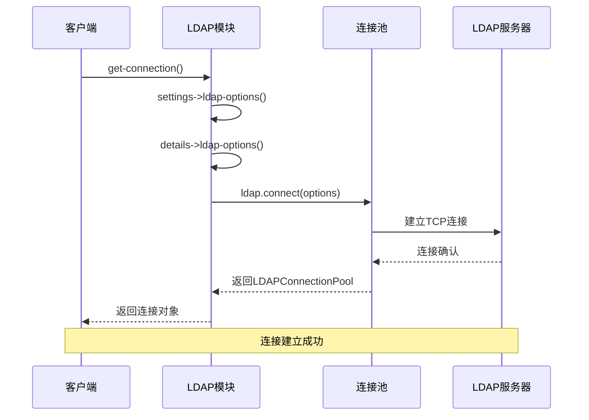

**图表来源**
- [ldap.clj](file://src/metabase/sso/ldap.clj#L50-L70)

**节来源**
- [ldap.clj](file://src/metabase/sso/ldap.clj#L17-L70)

### 默认实现模块

默认实现模块提供了LDAP用户查找和组同步的核心功能：

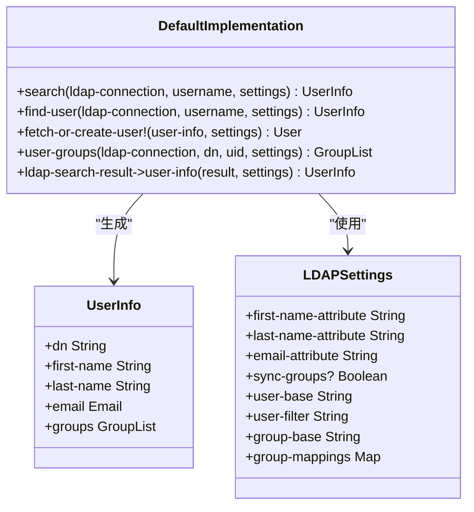

**图表来源**
- [default_implementation.clj](file://src/metabase/sso/ldap/default_implementation.clj#L20-L40)

**节来源**
- [default_implementation.clj](file://src/metabase/sso/ldap/default_implementation.clj#L1-L189)

## 连接池机制

### 连接池实现

Metabase使用UnboundID LDAP SDK提供的`LDAPConnectionPool`类来管理LDAP连接。连接池具有以下特性：

#### 连接生命周期管理

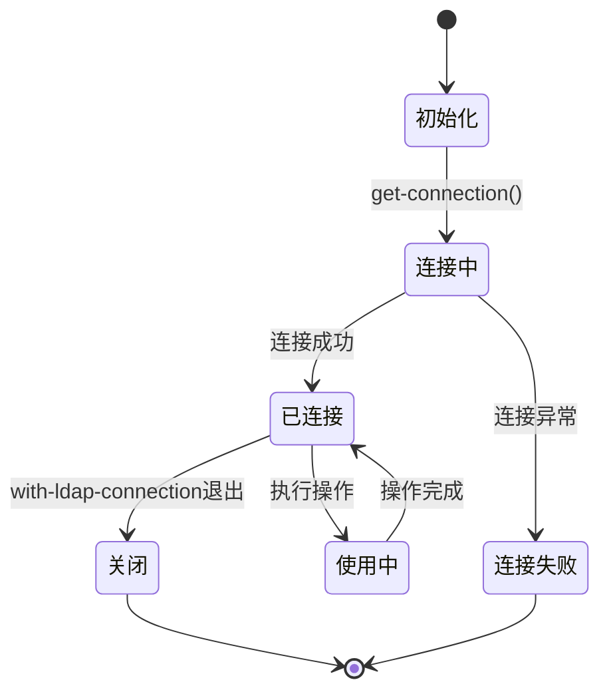

#### 连接获取机制

系统通过`with-ldap-connection`宏确保连接的正确管理和释放：

```clojure
(defmacro with-ldap-connection
  "执行`body`，将`connection-binding`绑定到LDAP连接。"
  [[connection-binding] & body]
  `(do-with-ldap-connection (fn [~(vary-meta connection-binding assoc :tag `LDAPConnectionPool)]
                              ~@body)))
```

**节来源**
- [ldap.clj](file://src/metabase/sso/ldap.clj#L65-L75)

### 超时配置

系统集成了`diehard.core`库来实现连接超时控制：

#### 超时配置表

| 配置项 | 类型 | 默认值 | 描述 |
|--------|------|--------|------|
| `ldap-timeout-seconds` | double | 15.0 | LDAP服务器最大等待时间（秒） |
| `timeout-ms` | integer | 15000 | 超时毫秒数（15秒） |
| `interrupt?` | boolean | true | 超时时是否中断操作 |

#### 超时控制流程

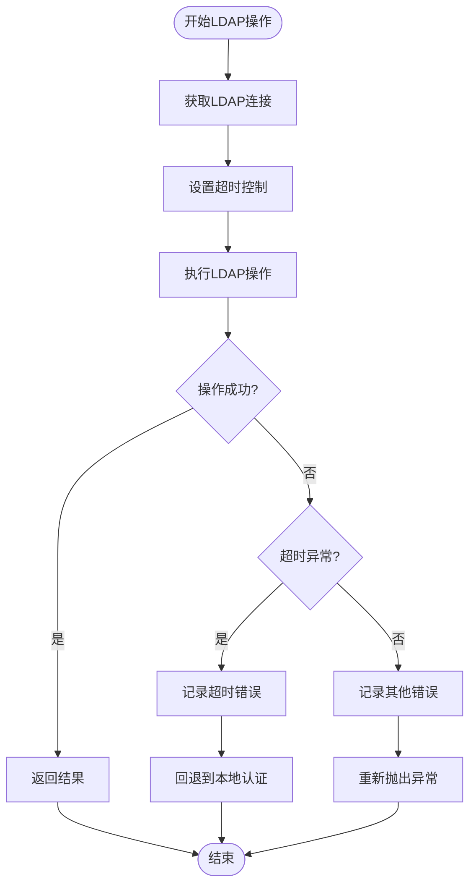

**图表来源**
- [ldap.clj](file://src/metabase/sso/ldap.clj#L125-L135)

**节来源**
- [ldap.clj](file://src/metabase/sso/ldap.clj#L125-L135)

## 安全协议支持

### 支持的安全协议

系统支持三种安全协议配置：

#### 协议配置表

| 安全协议 | 端口 | 加密方式 | 描述 |
|----------|------|----------|------|
| `:none` | 389 | 明文传输 | 无加密的LDAP连接 |
| `:ssl` | 636 | SSL/TLS加密 | LDAPS协议 |
| `:starttls` | 389 | 启动时升级 | 在明文连接上启动TLS |

#### 安全协议处理逻辑

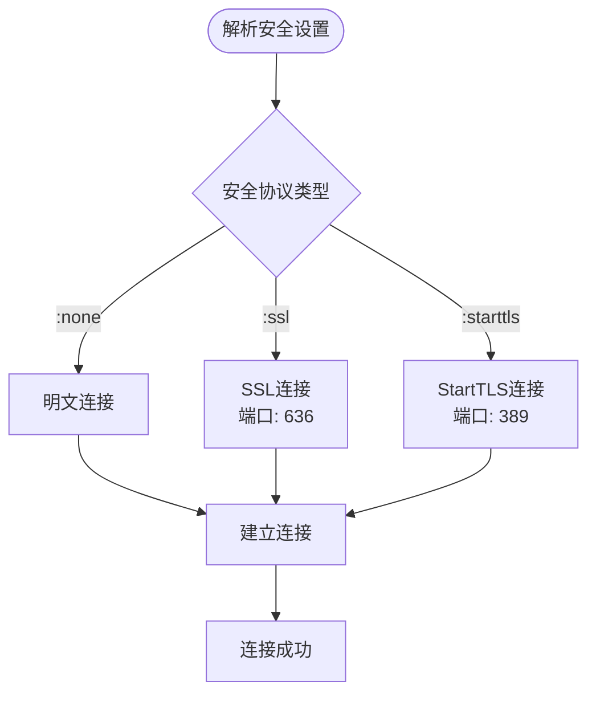

**图表来源**
- [ldap.clj](file://src/metabase/sso/ldap.clj#L35-L45)

### SSL/TLS证书验证

系统在建立SSL连接时会进行证书验证，确保通信安全：

#### 证书验证流程

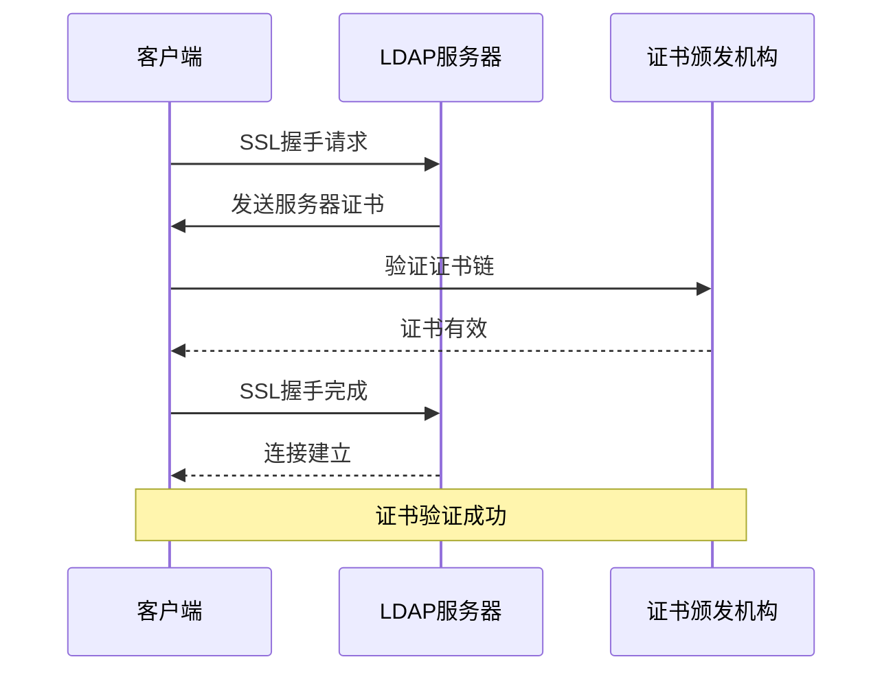

**节来源**
- [ldap.clj](file://src/metabase/sso/ldap.clj#L35-L45)

## 配置管理

### LDAP配置项

系统通过`metabase.sso.settings`命名空间管理所有LDAP相关配置：

#### 核心配置项

| 配置项 | 类型 | 默认值 | 必需性 | 描述 |
|--------|------|--------|--------|------|
| `ldap-host` | string | - | 必需 | LDAP服务器主机名 |
| `ldap-port` | integer | 389 | 必需 | LDAP服务器端口 |
| `ldap-security` | keyword | :none | 必需 | 安全协议类型 |
| `ldap-bind-dn` | string | - | 可选 | 绑定DN |
| `ldap-password` | string | - | 可选 | 绑定密码 |
| `ldap-user-base` | string | - | 必需 | 用户搜索基 |
| `ldap-user-filter` | string | 默认过滤器 | 可选 | 用户查找过滤器 |
| `ldap-attribute-email` | string | "mail" | 可选 | 邮箱属性 |
| `ldap-attribute-firstname` | string | "givenName" | 可选 | 名字属性 |
| `ldap-attribute-lastname` | string | "sn" | 可选 | 姓氏属性 |
| `ldap-group-sync` | boolean | false | 可选 | 是否启用组同步 |
| `ldap-group-base` | string | - | 可选 | 组搜索基 |
| `ldap-timeout-seconds` | double | 15.0 | 可选 | 连接超时时间 |

#### 配置验证机制

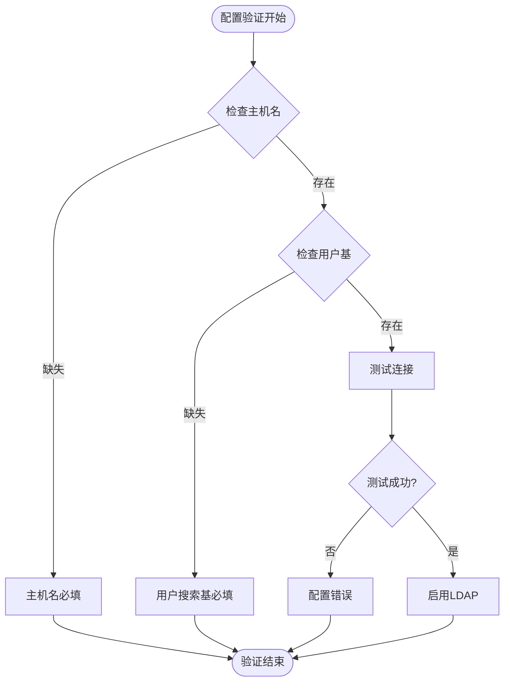

**图表来源**
- [settings.clj](file://src/metabase/sso/settings.clj#L115-L125)

**节来源**
- [settings.clj](file://src/metabase/sso/settings.clj#L17-L140)

### 配置更新流程

配置更新通过API接口实现，支持实时生效：

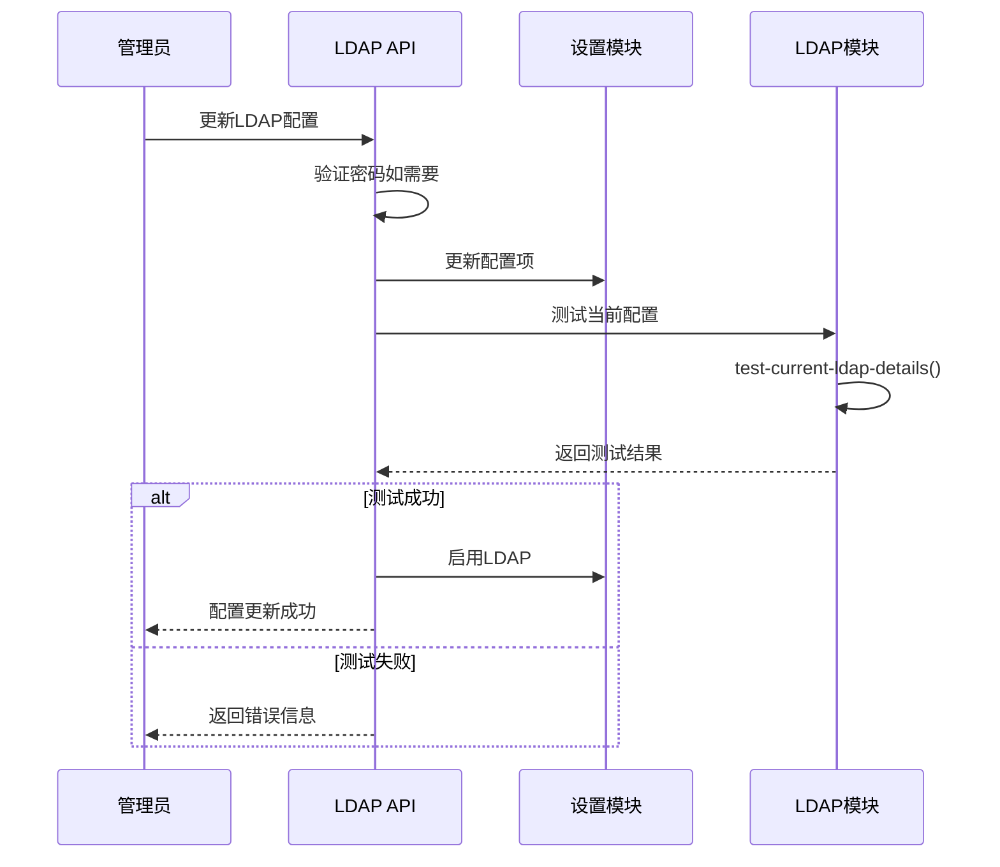

**图表来源**
- [ldap.clj](file://src/metabase/sso/api/ldap.clj#L32-L49)

**节来源**
- [ldap.clj](file://src/metabase/sso/api/ldap.clj#L1-L49)

## 连接测试功能

### 测试功能概述

系统提供了完整的LDAP连接测试功能，包括连通性测试和搜索基验证：

#### 测试功能架构

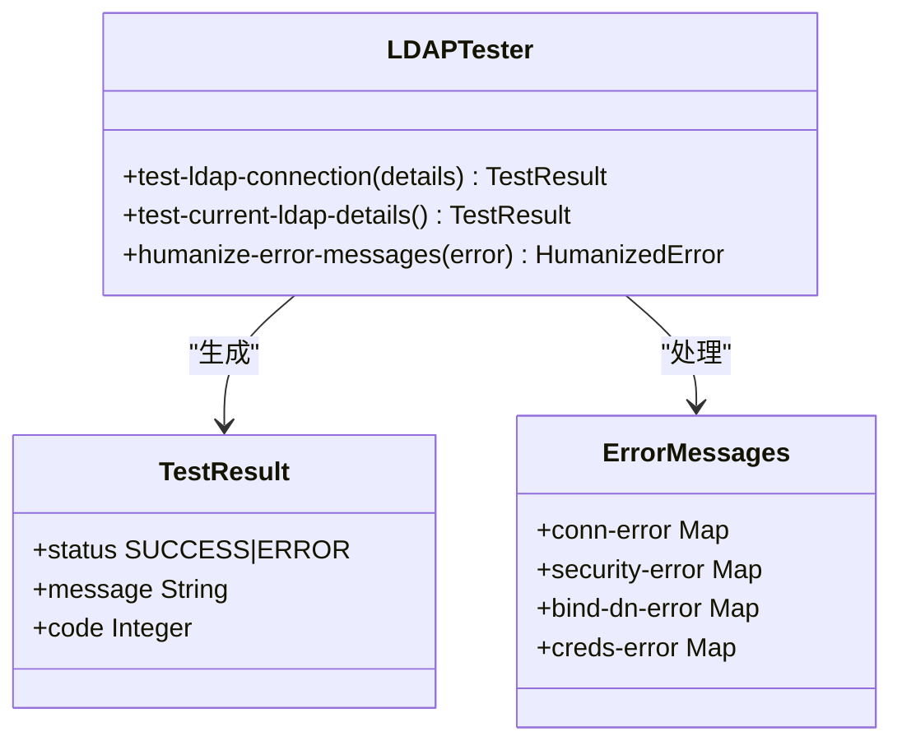

**图表来源**
- [ldap.clj](file://src/metabase/sso/ldap.clj#L80-L130)

### 连接测试流程

#### 测试步骤

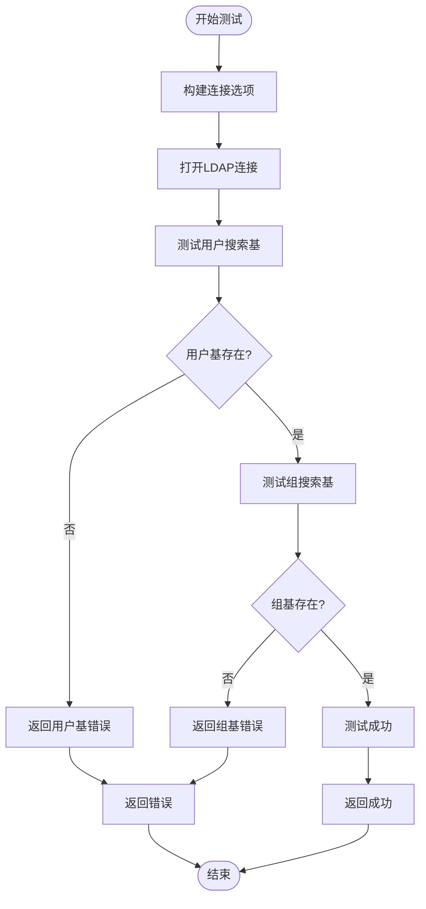

**图表来源**
- [ldap.clj](file://src/metabase/sso/ldap.clj#L80-L110)

### 错误消息人性化处理

系统对各种LDAP错误进行了分类和人性化处理：

#### 错误分类表

| 错误模式 | 人类可读错误 | 对应配置项 |
|----------|--------------|------------|
| `UnknownHostException.*` | Wrong host or port | ldap-host, ldap-port |
| `ConnectException.*` | Wrong host or port | ldap-host, ldap-port |
| `SocketException.*` | Wrong port or security setting | ldap-port, ldap-security |
| `SSLException.*` | Wrong port or security setting | ldap-port, ldap-security |
| `password was incorrect.*` | Password was incorrect | ldap-password |
| `Unable to bind as user.*` | Wrong bind DN | ldap-bind-dn |
| `AcceptSecurityContext error, data 525.*` | Wrong bind DN | ldap-bind-dn |
| `AcceptSecurityContext error, data 52e.*` | Wrong bind DN or password | ldap-bind-dn, ldap-password |
| `User search base does not exist.*` | User search base does not exist or is unreadable | ldap-user-base |
| `Group search base does not exist.*` | Group search base does not exist or is unreadable | ldap-group-base |

**节来源**
- [ldap.clj](file://src/metabase/sso/ldap.clj#L135-L225)

## 错误处理与故障排除

### 常见连接问题及解决方案

#### 主机不可达问题

**症状**: `UnknownHostException` 或 `ConnectException`

**原因**: 
- LDAP服务器地址配置错误
- 网络连接问题
- DNS解析失败

**解决方案**:
1. 检查`ldap-host`配置是否正确
2. 验证网络连通性
3. 确认DNS解析正常

#### 证书验证失败

**症状**: `SSLException`

**原因**:
- 服务器证书过期
- 证书链不完整
- 客户端信任库配置错误

**解决方案**:
1. 更新服务器证书
2. 配置正确的证书链
3. 将服务器证书添加到客户端信任库

#### 认证失败

**症状**: `BindException` 或 `Invalid credentials`

**原因**:
- 绑定DN配置错误
- 密码不正确
- 用户账户被禁用或过期

**解决方案**:
1. 验证`ldap-bind-dn`格式
2. 检查`ldap-password`是否正确
3. 确认用户账户状态

#### 搜索基不存在

**症状**: `User search base does not exist or is unreadable`

**原因**:
- `ldap-user-base`配置错误
- 权限不足无法访问搜索基
- 组织结构变更

**解决方案**:
1. 验证`ldap-user-base`路径
2. 检查绑定用户的权限
3. 更新组织结构映射

### 故障排除流程

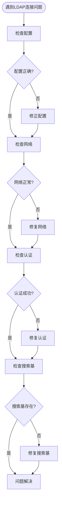

**节来源**
- [ldap.clj](file://src/metabase/sso/ldap.clj#L135-L225)

## 性能优化建议

### 连接池优化

1. **合理设置超时时间**: 根据网络环境调整`ldap-timeout-seconds`参数
2. **监控连接状态**: 定期检查连接池健康状况
3. **避免频繁重连**: 利用连接池复用连接

### 查询优化

1. **使用合适的过滤器**: 优化`ldap-user-filter`以减少搜索范围
2. **限制搜索结果**: 设置合理的`size-limit`参数
3. **缓存常用数据**: 缓存用户信息和组关系

### 网络优化

1. **使用本地LDAP代理**: 减少网络延迟
2. **配置负载均衡**: 分散LDAP服务器压力
3. **启用连接复用**: 复用现有连接

## 最佳实践

### 安全配置

1. **优先使用SSL/TLS**: 避免明文传输敏感信息
2. **定期更新证书**: 确保证书有效性
3. **最小权限原则**: 使用专用的绑定DN

### 监控和维护

1. **定期测试连接**: 确保LDAP服务可用性
2. **日志记录**: 记录连接和认证事件
3. **备份配置**: 保存重要的LDAP配置

### 故障恢复

1. **降级策略**: 连接失败时回退到本地认证
2. **自动重试**: 实现智能重试机制
3. **告警通知**: 及时发现和报告问题

**节来源**
- [ldap.clj](file://src/metabase/sso/ldap.clj#L1-L227)
- [settings.clj](file://src/metabase/sso/settings.clj#L1-L228)
- [default_implementation.clj](file://src/metabase/sso/ldap/default_implementation.clj#L1-L189)