# 用户与组同步

<cite>
**本文档中引用的文件**
- [default_implementation.clj](file://src/metabase/sso/ldap/default_implementation.clj)
- [ldap.clj](file://src/metabase/sso/ldap.clj)
- [common.clj](file://src/metabase/sso/common.clj)
- [settings.clj](file://src/metabase/sso/settings.clj)
- [api/ldap.clj](file://src/metabase/sso/api/ldap.clj)
- [users/events/last_login.clj](file://src/metabase/users/events/last_login.clj)
- [session/models/session.clj](file://src/metabase/session/models/session.clj)
</cite>

## 目录
1. [简介](#简介)
2. [系统架构概览](#系统架构概览)
3. [核心组件分析](#核心组件分析)
4. [用户属性映射机制](#用户属性映射机制)
5. [组成员关系同步](#组成员关系同步)
6. [同步触发机制](#同步触发机制)
7. [配置管理](#配置管理)
8. [错误处理与故障排除](#错误处理与故障排除)
9. [最佳实践](#最佳实践)
10. [总结](#总结)

## 简介

Metabase的用户与组同步功能提供了强大的单点登录(SSO)支持，特别是通过LDAP目录服务实现用户身份验证和权限管理。该系统的核心是`default_implementation.clj`文件中定义的默认同步策略，它负责将LDAP目录中的用户属性映射到Metabase用户模型，并处理复杂的组成员关系同步。

本文档深入分析了这一功能的实现细节，包括用户属性映射、组同步机制、触发时机以及最佳实践。

## 系统架构概览

Metabase的用户与组同步系统采用分层架构设计，主要包含以下核心层次：

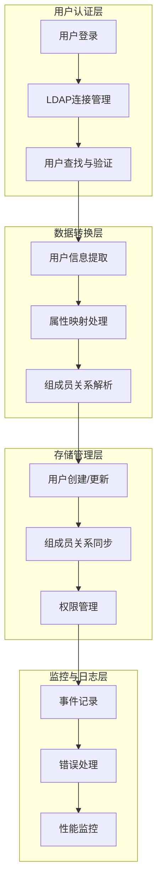

**图表来源**
- [default_implementation.clj](file://src/metabase/sso/ldap/default_implementation.clj#L1-L189)
- [ldap.clj](file://src/metabase/sso/ldap.clj#L1-L227)

## 核心组件分析

### 用户信息结构定义

系统使用严格的模式定义来确保数据完整性：

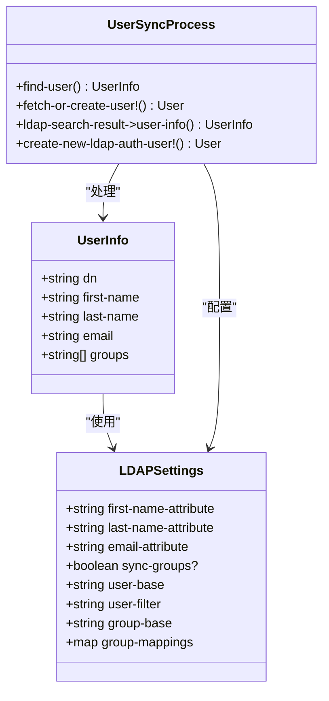

**图表来源**
- [default_implementation.clj](file://src/metabase/sso/ldap/default_implementation.clj#L18-L40)

### 连接管理与认证

LDAP连接管理采用连接池模式，确保资源的有效利用和连接的稳定性：

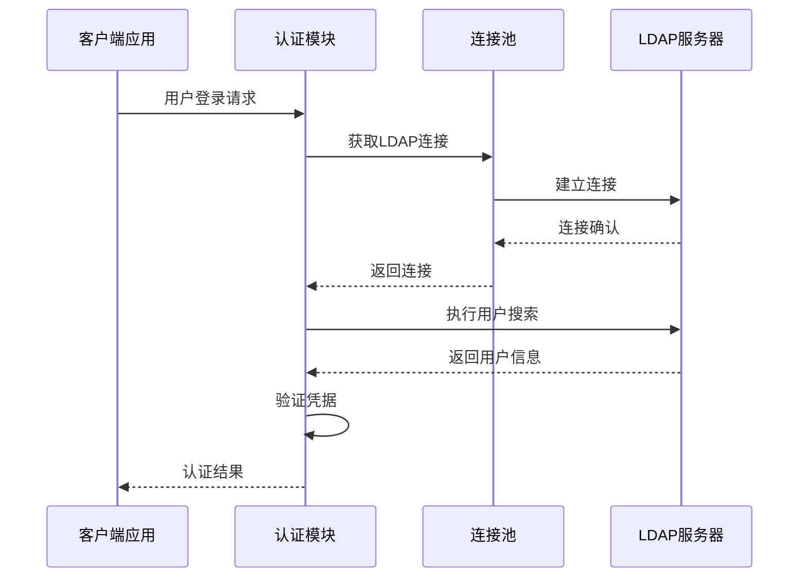

**图表来源**
- [ldap.clj](file://src/metabase/sso/ldap.clj#L50-L70)

**章节来源**
- [default_implementation.clj](file://src/metabase/sso/ldap/default_implementation.clj#L1-L189)
- [ldap.clj](file://src/metabase/sso/ldap.clj#L1-L227)

## 用户属性映射机制

### 属性映射配置

Metabase支持灵活的属性映射配置，允许将LDAP目录中的各种属性映射到Metabase用户模型：

| LDAP属性 | Metabase字段 | 默认值 | 描述 |
|---------|-------------|--------|------|
| `givenName` | first_name | - | 用户名或名字 |
| `sn` | last_name | - | 用户姓氏 |
| `mail` | email | mail | 用户电子邮件地址 |
| `userPrincipalName` | email | - | Windows域用户的主用户名 |

### 映射流程实现

属性映射过程遵循严格的验证和转换规则：

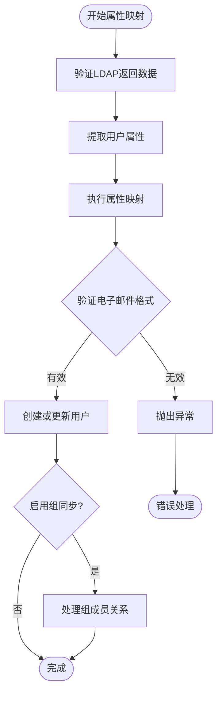

**图表来源**
- [default_implementation.clj](file://src/metabase/sso/ldap/default_implementation.clj#L95-L120)

**章节来源**
- [default_implementation.clj](file://src/metabase/sso/ldap/default_implementation.clj#L95-L120)
- [settings.clj](file://src/metabase/sso/settings.clj#L50-L85)

## 组成员关系同步

### 组同步机制

组同步功能支持两种模式：基于`memberOf`覆盖属性的直接查询和基于反向查询的传统方式：

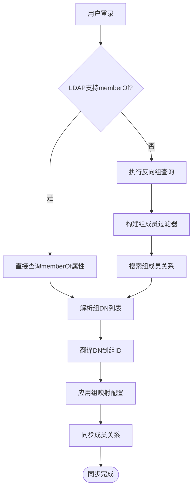

**图表来源**
- [default_implementation.clj](file://src/metabase/sso/ldap/default_implementation.clj#L105-L120)

### 组映射配置

组映射配置采用JSON格式，支持将LDAP组DN映射到Metabase组ID：

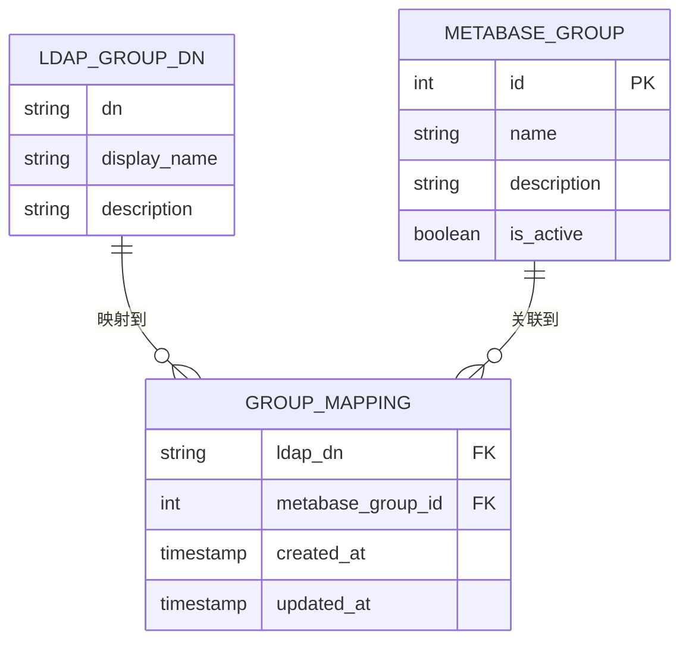

**图表来源**
- [settings.clj](file://src/metabase/sso/settings.clj#L90-L115)

### 成员关系同步算法

组成员关系同步采用增量更新策略，最小化数据库操作：

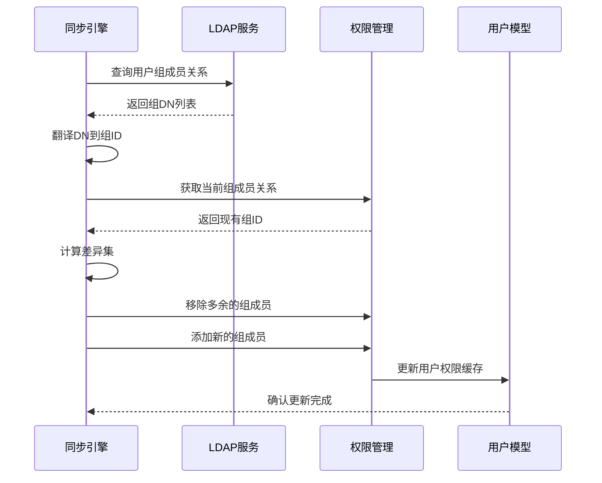

**图表来源**
- [common.clj](file://src/metabase/sso/common.clj#L15-L50)

**章节来源**
- [default_implementation.clj](file://src/metabase/sso/ldap/default_implementation.clj#L105-L145)
- [common.clj](file://src/metabase/sso/common.clj#L15-L65)

## 同步触发机制

### 登录时同步

用户登录时会自动触发同步流程，确保用户信息的及时更新：

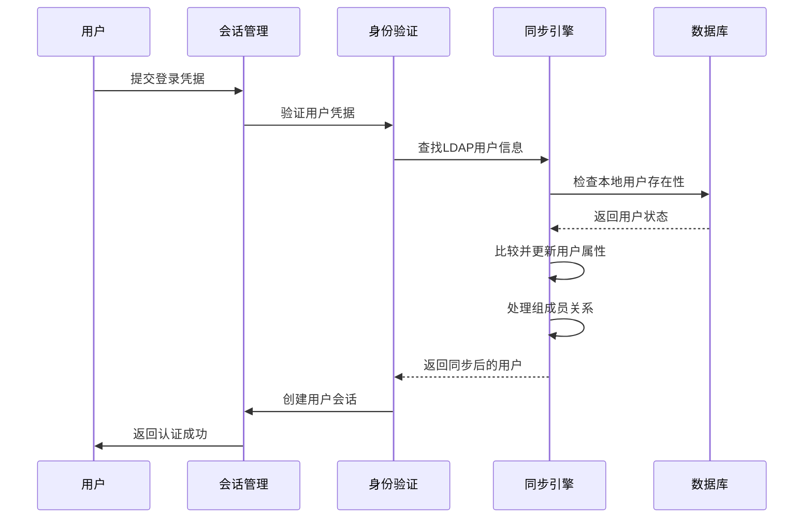

**图表来源**
- [session/models/session.clj](file://src/metabase/session/models/session.clj#L80-L105)
- [users/events/last_login.clj](file://src/metabase/users/events/last_login.clj#L10-L19)

### 事件驱动同步

系统还支持基于事件的同步触发机制：

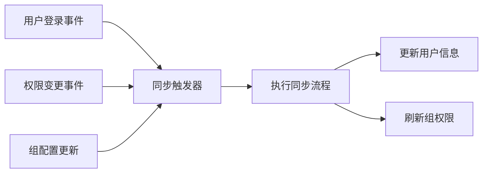

**图表来源**
- [users/events/last_login.clj](file://src/metabase/users/events/last_login.clj#L10-L19)

**章节来源**
- [session/models/session.clj](file://src/metabase/session/models/session.clj#L80-L105)
- [users/events/last_login.clj](file://src/metabase/users/events/last_login.clj#L10-L19)

## 配置管理

### LDAP设置配置

LDAP同步功能的配置通过专门的设置系统管理：

| 设置项 | 类型 | 默认值 | 描述 |
|-------|------|--------|------|
| `ldap-host` | 字符串 | - | LDAP服务器主机名 |
| `ldap-port` | 整数 | 389 | LDAP服务器端口 |
| `ldap-security` | 关键字 | :none | 安全协议类型 |
| `ldap-bind-dn` | 字符串 | - | 绑定用户DN |
| `ldap-user-base` | 字符串 | - | 用户搜索基础DN |
| `ldap-user-filter` | 字符串 | - | 用户搜索过滤器 |
| `ldap-attribute-email` | 字符串 | "mail" | 电子邮件属性名 |
| `ldap-attribute-firstname` | 字符串 | "givenName" | 名字属性名 |
| `ldap-attribute-lastname` | 字符串 | "sn" | 姓氏属性名 |
| `ldap-group-sync` | 布尔 | false | 是否启用组同步 |
| `ldap-group-base` | 字符串 | - | 组搜索基础DN |
| `ldap-group-mappings` | JSON | {} | 组映射配置 |

### 配置验证机制

系统提供完整的配置验证功能，确保LDAP连接的正确性：

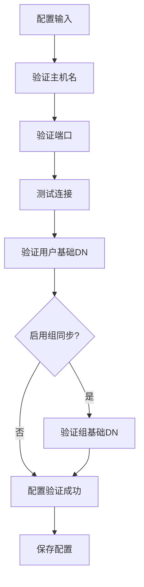

**图表来源**
- [api/ldap.clj](file://src/metabase/sso/api/ldap.clj#L32-L49)

**章节来源**
- [settings.clj](file://src/metabase/sso/settings.clj#L15-L132)
- [api/ldap.clj](file://src/metabase/sso/api/ldap.clj#L32-L49)

## 错误处理与故障排除

### 常见错误类型

系统针对不同类型的LDAP错误提供详细的诊断信息：

| 错误代码 | 描述 | 解决方案 |
|---------|------|----------|
| 525 | 用户不存在 | 检查用户DN和搜索基础DN |
| 52e | 凭据无效 | 验证用户名和密码 |
| 532 | 密码过期 | 提示用户重置密码 |
| 533 | 账户被禁用 | 联系管理员启用账户 |
| 701 | 账户已过期 | 更新账户有效期 |
| 401 | 认证失败 | 检查绑定DN和密码 |

### 错误处理流程

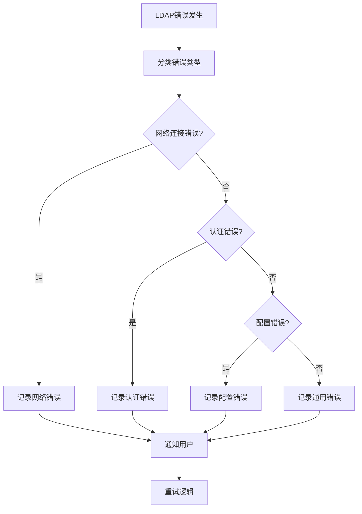

**图表来源**
- [ldap.clj](file://src/metabase/sso/ldap.clj#L183-L225)

### 故障排除指南

当同步出现问题时，可以按照以下步骤进行诊断：

1. **检查网络连接**：验证LDAP服务器可达性和防火墙设置
2. **验证认证凭据**：确认绑定DN和密码的正确性
3. **检查搜索基础DN**：确保用户和组搜索范围正确
4. **验证属性映射**：确认LDAP属性名称与配置匹配
5. **查看日志信息**：分析详细的错误日志和调试信息

**章节来源**
- [ldap.clj](file://src/metabase/sso/ldap.clj#L183-L225)

## 最佳实践

### 属性映射最佳实践

1. **选择稳定的属性**：优先使用不会频繁变化的LDAP属性
2. **实施数据验证**：在映射过程中添加数据验证逻辑
3. **处理空值情况**：为可选属性提供合理的默认值
4. **保持一致性**：确保属性命名的一致性

### 组同步最佳实践

1. **合理设计组结构**：避免过于复杂的组层次结构
2. **定期清理冗余映射**：移除不再使用的组映射关系
3. **监控同步性能**：关注大规模用户环境下的同步效率
4. **备份组映射配置**：定期备份重要的组映射设置

### 安全最佳实践

1. **加密敏感配置**：对LDAP密码等敏感信息进行加密存储
2. **限制绑定权限**：使用只读权限的绑定用户
3. **实施访问控制**：限制LDAP配置的访问权限
4. **定期审计日志**：监控和审计LDAP同步活动

### 性能优化建议

1. **使用连接池**：充分利用LDAP连接池提高性能
2. **批量操作**：在可能的情况下使用批量同步操作
3. **缓存策略**：合理使用缓存减少LDAP查询次数
4. **异步处理**：对于非关键同步操作采用异步处理

## 总结

Metabase的用户与组同步功能通过`default_implementation.clj`中精心设计的默认同步策略，提供了强大而灵活的LDAP集成能力。该系统具有以下核心优势：

1. **完整的属性映射**：支持将LDAP目录中的各种用户属性准确映射到Metabase用户模型
2. **智能的组同步**：提供灵活的组成员关系同步机制，支持多种LDAP目录服务
3. **健壮的错误处理**：完善的错误分类和处理机制，确保系统的稳定性
4. **灵活的配置管理**：直观的配置界面和验证机制，降低部署复杂度
5. **高效的触发机制**：支持登录时同步和事件驱动同步，满足不同场景需求

通过遵循本文档提供的最佳实践和故障排除指南，管理员可以有效地部署和维护基于LDAP的用户与组同步功能，为企业用户提供安全、便捷的身份认证体验。