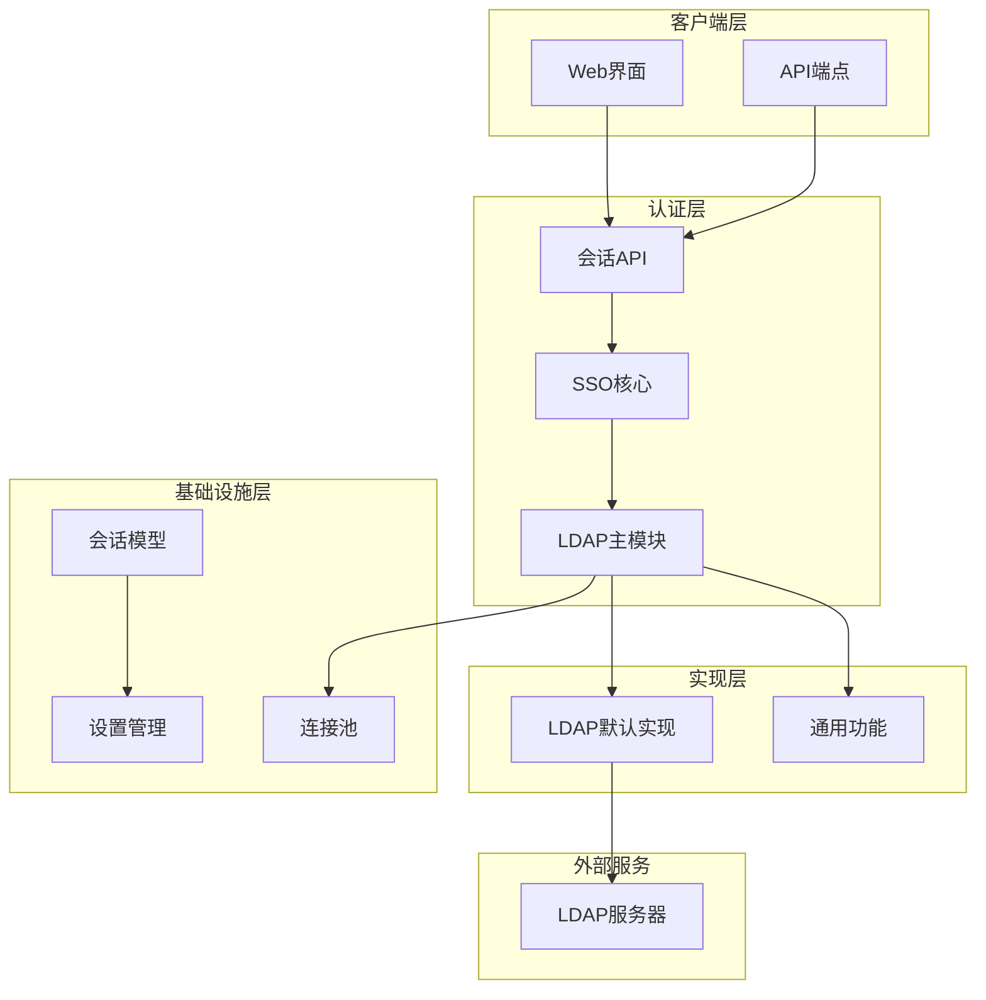
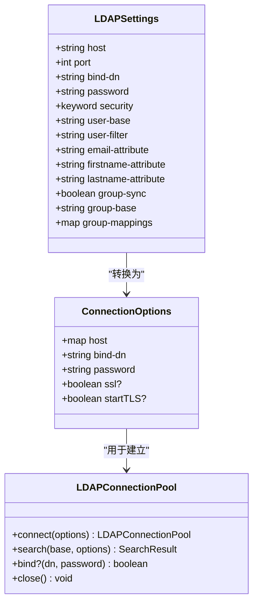
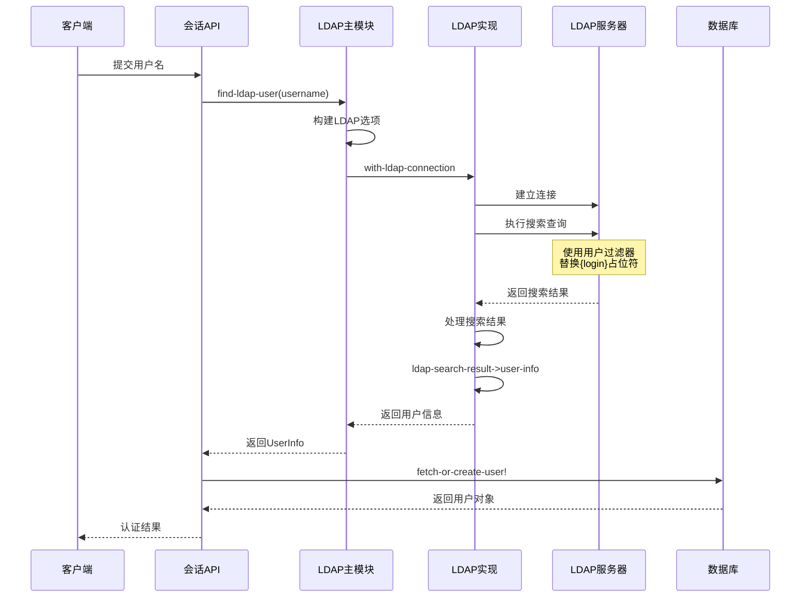
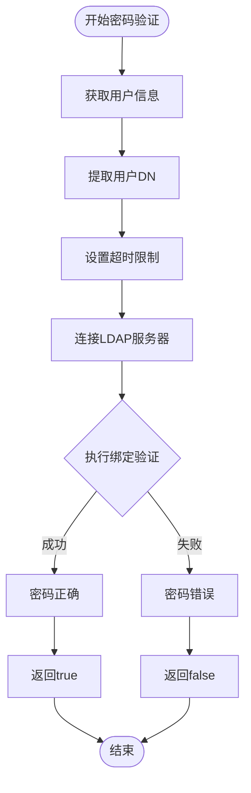
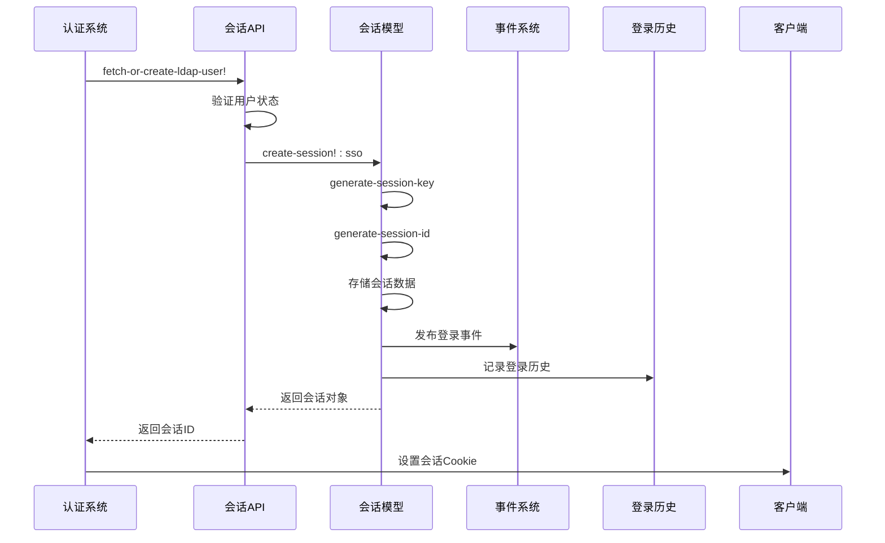
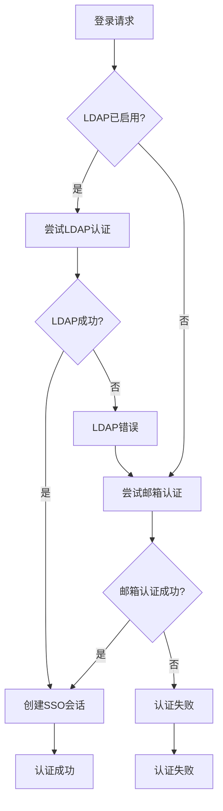
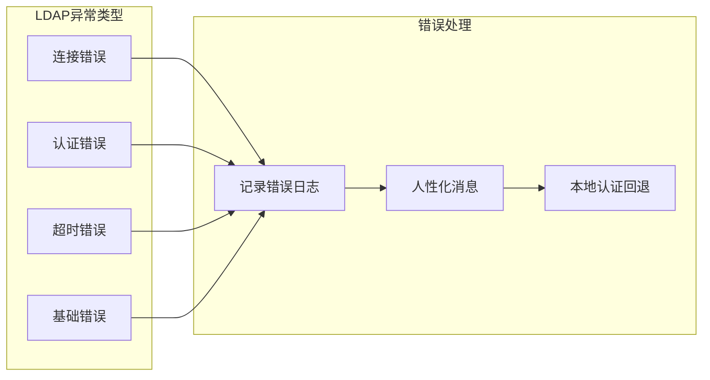

# 用户认证流程

<cite>
**本文档中引用的文件**
- [ldap.clj](file://src/metabase/sso/ldap.clj)
- [default_implementation.clj](file://src/metabase/sso/ldap/default_implementation.clj)
- [core.clj](file://src/metabase/sso/core.clj)
- [common.clj](file://src/metabase/sso/common.clj)
- [settings.clj](file://src/metabase/sso/settings.clj)
- [api.clj](file://src/metabase/session/api.clj)
- [session.clj](file://src/metabase/session/models/session.clj)
</cite>

## 目录
1. [简介](#简介)
2. [系统架构概览](#系统架构概览)
3. [LDAP连接与配置](#ldap连接与配置)
4. [用户查找流程](#用户查找流程)
5. [密码验证机制](#密码验证机制)
6. [会话创建过程](#会话创建过程)
7. [SSO通用逻辑集成](#sso通用逻辑集成)
8. [错误处理与安全机制](#错误处理与安全机制)
9. [性能优化考虑](#性能优化考虑)
10. [故障排除指南](#故障排除指南)

## 简介

Metabase的LDAP用户认证系统提供了一个完整的单点登录(SSO)解决方案，支持企业环境中的集中用户身份验证。该系统通过LDAP协议与企业目录服务进行交互，实现了从用户凭据验证到会话管理的完整认证流程。

本文档详细分析了LDAP认证的三个核心阶段：用户查找、密码验证和会话创建，同时探讨了与SSO通用逻辑的集成机制。

## 系统架构概览

Metabase的LDAP认证系统采用分层架构设计，确保了模块化和可扩展性：

**图表来源**
- [api.clj](file://src/metabase/session/api.clj#L1-L50)
- [core.clj](file://src/metabase/sso/core.clj#L1-L45)
- [ldap.clj](file://src/metabase/sso/ldap.clj#L1-L30)

## LDAP连接与配置

### 连接配置管理

LDAP连接通过统一的配置管理系统进行管理，支持多种安全传输协议：

**图表来源**
- [ldap.clj](file://src/metabase/sso/ldap.clj#L25-L45)
- [settings.clj](file://src/metabase/sso/settings.clj#L15-L80)

### 连接池管理

系统使用连接池模式来提高LDAP操作的性能和可靠性：

**章节来源**
- [ldap.clj](file://src/metabase/sso/ldap.clj#L47-L70)

## 用户查找流程

### LDAP搜索过滤器构建

用户查找是认证流程的第一步，系统通过构建动态LDAP搜索过滤器来定位目标用户：

**图表来源**
- [api.clj](file://src/metabase/session/api.clj#L47-L75)
- [ldap.clj](file://src/metabase/sso/ldap.clj#L151-L165)
- [default_implementation.clj](file://src/metabase/sso/ldap/default_implementation.clj#L61-L89)

### 搜索过滤器动态构建

系统使用模板化的用户过滤器，支持多种属性匹配：

**章节来源**
- [default_implementation.clj](file://src/metabase/sso/ldap/default_implementation.clj#L47-L63)

### 用户信息提取

从LDAP搜索结果中提取用户详细信息：

**章节来源**
- [default_implementation.clj](file://src/metabase/sso/ldap/default_implementation.clj#L95-L117)

## 密码验证机制

### 安全验证流程

密码验证采用安全的绑定验证机制，避免明文传输：

**图表来源**
- [ldap.clj](file://src/metabase/sso/ldap.clj#L127-L135)

### 超时保护机制

系统实现了严格的超时控制以防止LDAP服务器响应过慢：

**章节来源**
- [ldap.clj](file://src/metabase/sso/ldap.clj#L127-L135)

### 错误处理与安全

密码验证过程中实现了多层次的安全防护：

**章节来源**
- [api.clj](file://src/metabase/session/api.clj#L59-L65)

## 会话创建过程

### 会话生命周期管理

认证成功后，系统创建持久化会话以维护用户状态：

**图表来源**
- [api.clj](file://src/metabase/session/api.clj#L65-L75)
- [session.clj](file://src/metabase/session/models/session.clj#L70-L105)

### 会话数据结构

会话对象包含必要的认证和授权信息：

**章节来源**
- [session.clj](file://src/metabase/session/models/session.clj#L50-L70)

### 事件通知机制

系统自动发布用户登录事件以支持审计和监控：

**章节来源**
- [session.clj](file://src/metabase/session/models/session.clj#L85-L95)

## SSO通用逻辑集成

### 认证策略选择

系统实现了多策略认证机制，优先使用LDAP认证：

**图表来源**
- [api.clj](file://src/metabase/session/api.clj#L85-L105)

### 用户状态管理

SSO认证后的用户状态管理包括权限同步：

**章节来源**
- [default_implementation.clj](file://src/metabase/sso/ldap/default_implementation.clj#L170-L188)

### 权限组同步

系统支持LDAP组成员关系到Metabase权限组的自动映射：

**章节来源**
- [common.clj](file://src/metabase/sso/common.clj#L25-L65)

## 错误处理与安全机制

### 异常处理策略

系统实现了全面的异常处理机制：

**图表来源**
- [api.clj](file://src/metabase/session/api.clj#L65-L85)
- [ldap.clj](file://src/metabase/sso/ldap.clj#L195-L225)

### 安全防护措施

系统实现了多种安全防护机制：

**章节来源**
- [api.clj](file://src/metabase/session/api.clj#L37-L50)

### 故障回退机制

当LDAP认证失败时，系统自动回退到本地认证：

**章节来源**
- [api.clj](file://src/metabase/session/api.clj#L65-L85)

## 性能优化考虑

### 连接池优化

系统使用连接池来减少LDAP连接开销：

**章节来源**
- [ldap.clj](file://src/metabase/sso/ldap.clj#L47-L70)

### 查询优化

LDAP查询采用了多项优化策略：

**章节来源**
- [default_implementation.clj](file://src/metabase/sso/ldap/default_implementation.clj#L47-L63)

### 缓存策略

系统通过合理的缓存策略提升性能：

**章节来源**
- [session.clj](file://src/metabase/session/models/session.clj#L60-L70)

## 故障排除指南

### 常见问题诊断

系统提供了详细的错误消息映射机制：

**章节来源**
- [ldap.clj](file://src/metabase/sso/ldap.clj#L195-L225)

### 配置验证

系统支持LDAP连接测试功能：

**章节来源**
- [ldap.clj](file://src/metabase/sso/ldap.clj#L80-L135)

### 日志记录

系统提供了完整的日志记录机制：

**章节来源**
- [ldap.clj](file://src/metabase/sso/ldap.clj#L47-L55)