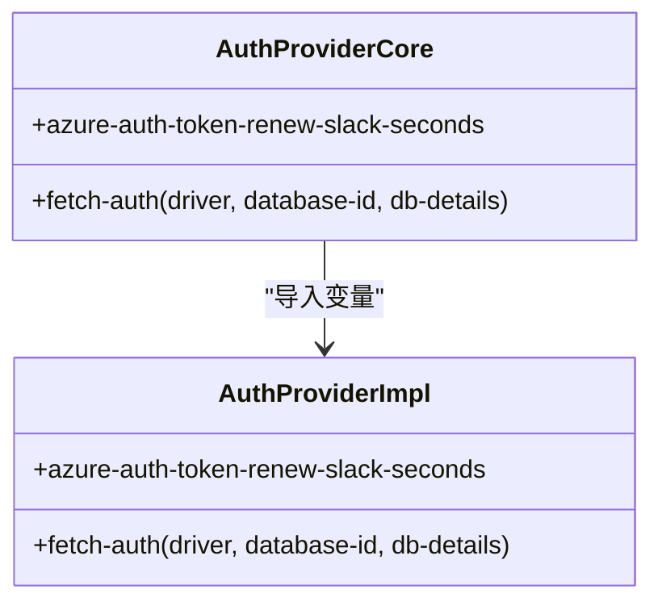
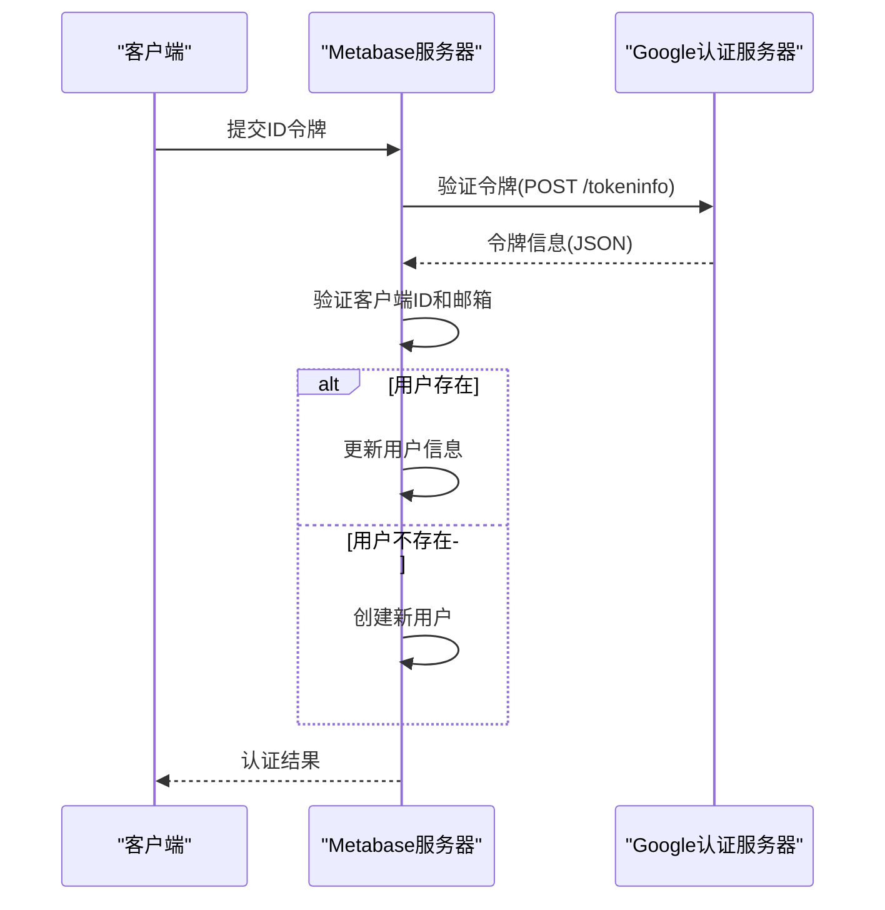
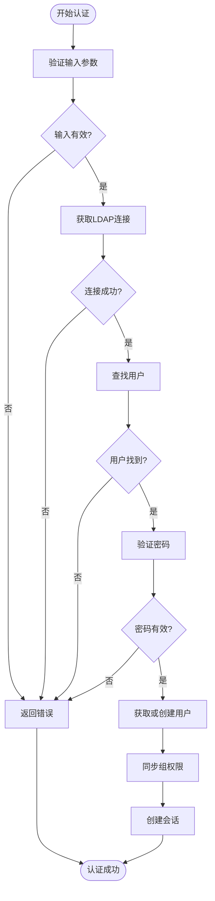
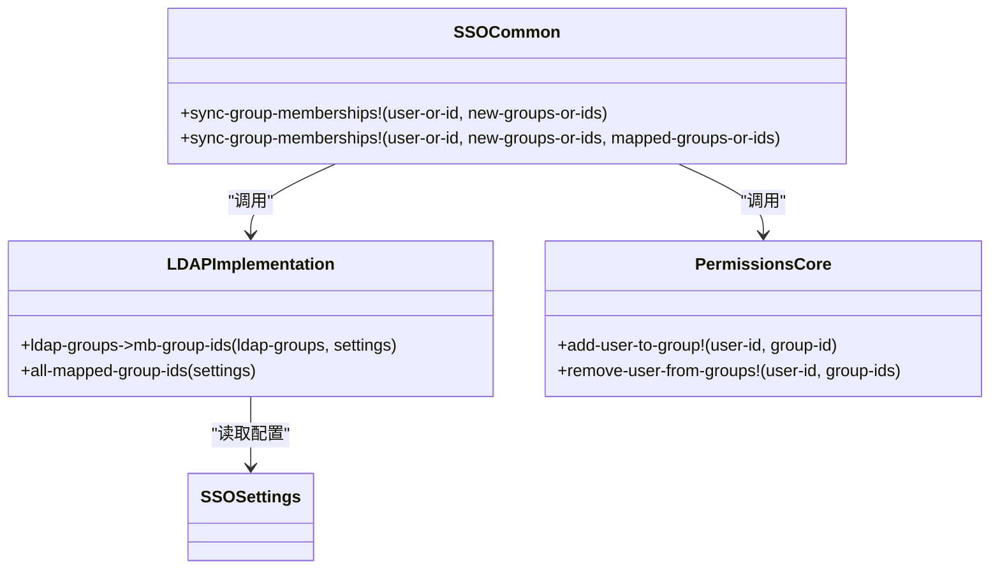

# 认证提供者扩展

<cite>
**本文档中引用的文件**  
- [auth_provider/core.clj](file://src/metabase/auth_provider/core.clj)
- [auth_provider/impl.clj](file://src/metabase/auth_provider/impl.clj)
- [sso/core.clj](file://src/metabase/sso/core.clj)
- [sso/google.clj](file://src/metabase/sso/google.clj)
- [sso/ldap.clj](file://src/metabase/sso/ldap.clj)
- [sso/ldap/default_implementation.clj](file://src/metabase/sso/ldap/default_implementation.clj)
- [sso/common.clj](file://src/metabase/sso/common.clj)
- [sso/settings.clj](file://src/metabase/sso/settings.clj)
- [sso/api/google.clj](file://src/metabase/sso/api/google.clj)
- [sso/api/ldap.clj](file://src/metabase/sso/api/ldap.clj)
</cite>

## 目录
1. [简介](#简介)
2. [认证提供者核心接口](#认证提供者核心接口)
3. [SSO核心架构](#sso核心架构)
4. [Google SSO集成](#google-sso集成)
5. [LDAP集成](#ldap集成)
6. [权限同步机制](#权限同步机制)
7. [安全考虑](#安全考虑)
8. [自定义认证提供者开发](#自定义认证提供者开发)
9. [配置指南](#配置指南)

## 简介
Metabase提供了灵活的认证提供者扩展机制，支持多种单点登录（SSO）协议，包括Google SSO和LDAP。该机制允许系统管理员配置外部身份验证源，实现用户认证、会话管理和权限映射的统一管理。本文档详细说明了认证提供者扩展接口的实现要求，提供了LDAP和Google SSO集成的具体配置指南，并分析了不同认证协议的适配模式。

## 认证提供者核心接口

认证提供者扩展机制的核心接口定义在`auth_provider/core.clj`文件中，主要通过`fetch-auth`函数实现。该接口为数据库连接提供动态认证信息，支持OAuth、Azure托管身份等认证方式。



**Diagram sources**
- [auth_provider/core.clj](file://src/metabase/auth_provider/core.clj)
- [auth_provider/impl.clj](file://src/metabase/auth_provider/impl.clj)

**Section sources**
- [auth_provider/core.clj](file://src/metabase/auth_provider/core.clj#L1-L11)
- [auth_provider/impl.clj](file://src/metabase/auth_provider/impl.clj#L1-L14)

## SSO核心架构

SSO核心架构通过`metabase.sso.core`命名空间组织，集成了Google和LDAP认证功能。该架构采用导入变量的方式，将不同认证协议的实现细节统一暴露给外部调用。

```mermaid
graph TB
subgraph "SSO核心"
SSOCore[sso.core]
SSOCommon[sso.common]
SSOSettings[sso.settings]
end
subgraph "认证协议实现"
Google[Google SSO]
LDAP[LDAP SSO]
LDAPImpl[LDAP默认实现]
end
SSOCore --> SSOCommon : "导入同步功能"
SSOCore --> SSOSettings : "导入配置"
SSOCore --> Google : "导入Google认证"
SSOCore --> LDAPImpl : "导入LDAP实现"
LDAP --> LDAPImpl : "依赖"
```

**Diagram sources**
- [sso/core.clj](file://src/metabase/sso/core.clj#L1-L44)
- [sso/common.clj](file://src/metabase/sso/common.clj#L1-L66)
- [sso/settings.clj](file://src/metabase/sso/settings.clj#L1-L228)
- [sso/google.clj](file://src/metabase/sso/google.clj#L1-L90)
- [sso/ldap.clj](file://src/metabase/sso/ldap.clj#L1-L227)

**Section sources**
- [sso/core.clj](file://src/metabase/sso/core.clj#L1-L44)

## Google SSO集成

Google SSO集成通过OAuth 2.0协议实现用户认证，主要包含令牌验证、用户创建和会话管理等功能。认证流程从客户端获取ID令牌开始，通过Google令牌信息端点验证令牌的有效性。



**Diagram sources**
- [sso/google.clj](file://src/metabase/sso/google.clj#L1-L90)
- [sso/settings.clj](file://src/metabase/sso/settings.clj#L140-L192)

**Section sources**
- [sso/google.clj](file://src/metabase/sso/google.clj#L1-L90)
- [sso/api/google.clj](file://src/metabase/sso/api/google.clj#L1-L25)

## LDAP集成

LDAP集成提供了企业级目录服务认证支持，包括用户查找、密码验证和组同步等功能。LDAP认证流程通过连接池管理LDAP连接，使用绑定操作验证用户凭据。



**Diagram sources**
- [sso/ldap.clj](file://src/metabase/sso/ldap.clj#L1-L227)
- [sso/ldap/default_implementation.clj](file://src/metabase/sso/ldap/default_implementation.clj#L1-L188)

**Section sources**
- [sso/ldap.clj](file://src/metabase/sso/ldap.clj#L1-L227)
- [sso/ldap/default_implementation.clj](file://src/metabase/sso/ldap/default_implementation.clj#L1-L188)
- [sso/api/ldap.clj](file://src/metabase/sso/api/ldap.clj#L1-L33)

## 权限同步机制

权限同步机制通过`sso.common`命名空间实现，负责将外部身份验证系统的组成员关系同步到Metabase的权限组中。该机制确保用户在外部系统中的组变更能够及时反映在Metabase中。



**Diagram sources**
- [sso/common.clj](file://src/metabase/sso/common.clj#L1-L66)
- [sso/ldap/default_implementation.clj](file://src/metabase/sso/ldap/default_implementation.clj#L1-L188)

**Section sources**
- [sso/common.clj](file://src/metabase/sso/common.clj#L1-L66)
- [sso/ldap/default_implementation.clj](file://src/metabase/sso/ldap/default_implementation.clj#L1-L188)

## 安全考虑

SSO流程中的安全考虑主要包括令牌验证、重定向处理和会话同步。系统通过严格的验证机制确保认证过程的安全性。

### 令牌验证
Google SSO使用ID令牌进行认证，系统会验证令牌的以下属性：
- 令牌必须由Google签发
- 客户端ID必须匹配配置
- 邮箱必须已验证
- 令牌必须未过期

### 连接安全
LDAP连接支持多种安全模式：
- 无加密（plain text）
- SSL加密
- StartTLS加密

系统通过超时机制防止连接阻塞，并使用连接池优化性能。

### 错误处理
系统对LDAP连接错误进行详细分类和处理，包括：
- 主机或端口错误
- 安全设置错误
- 绑定DN错误
- 密码错误
- 账户状态错误（禁用、过期）

**Section sources**
- [sso/google.clj](file://src/metabase/sso/google.clj#L1-L90)
- [sso/ldap.clj](file://src/metabase/sso/ldap.clj#L1-L227)
- [sso/settings.clj](file://src/metabase/sso/settings.clj#L1-L228)

## 自定义认证提供者开发

开发自定义认证提供者需要实现以下步骤：

### 接口实现
1. 定义新的认证提供者命名空间
2. 实现用户认证逻辑
3. 实现会话管理功能
4. 实现权限映射机制

### 注册集成
1. 在核心模块中导入新实现
2. 添加配置设置
3. 注册API端点
4. 集成到认证流程

### 开发模式
系统采用企业版扩展模式，通过`defenterprise`宏支持企业功能的条件编译。开发者可以基于此模式创建自己的扩展实现。

**Section sources**
- [auth_provider/impl.clj](file://src/metabase/auth_provider/impl.clj#L1-L14)
- [sso/ldap/default_implementation.clj](file://src/metabase/sso/ldap/default_implementation.clj#L1-L188)

## 配置指南

### Google SSO配置
1. 获取Google API控制台的客户端ID
2. 在Metabase管理界面配置客户端ID
3. 启用Google SSO
4. 可选：配置自动创建账户的域名

### LDAP配置
1. 配置LDAP服务器主机和端口
2. 设置绑定DN和密码
3. 配置用户搜索基础和过滤器
4. 设置属性映射（邮箱、姓名）
5. 可选：配置组同步和映射
6. 测试连接并启用LDAP认证

**Section sources**
- [sso/settings.clj](file://src/metabase/sso/settings.clj#L1-L228)
- [sso/api/google.clj](file://src/metabase/sso/api/google.clj#L1-L25)
- [sso/api/ldap.clj](file://src/metabase/sso/api/ldap.clj#L1-L33)