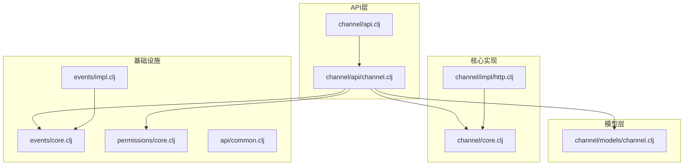
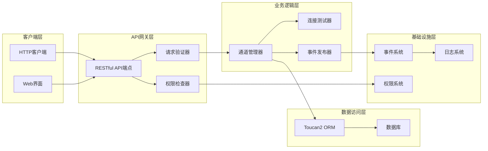
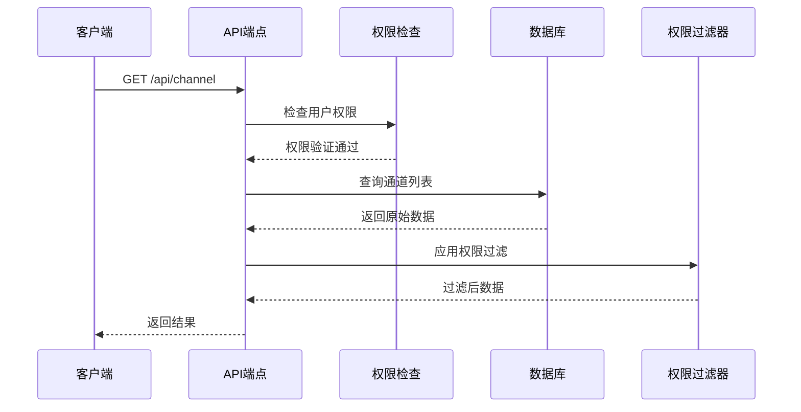
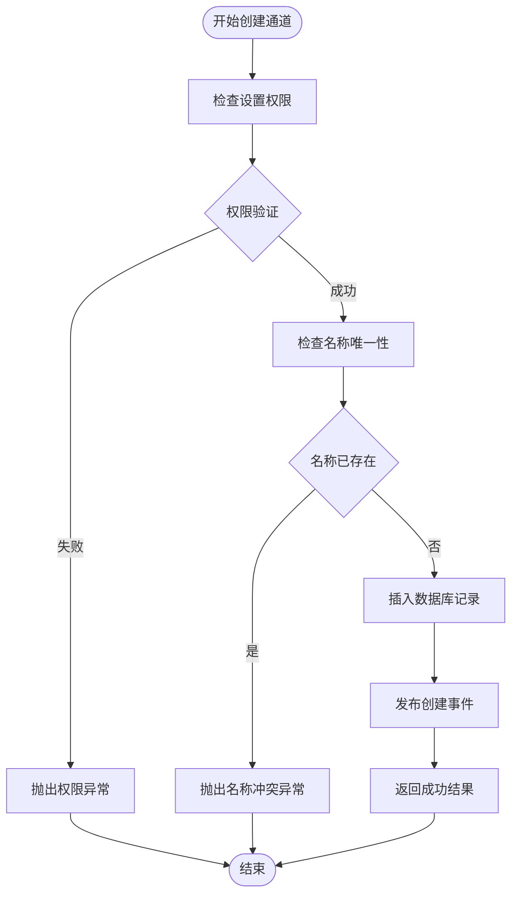
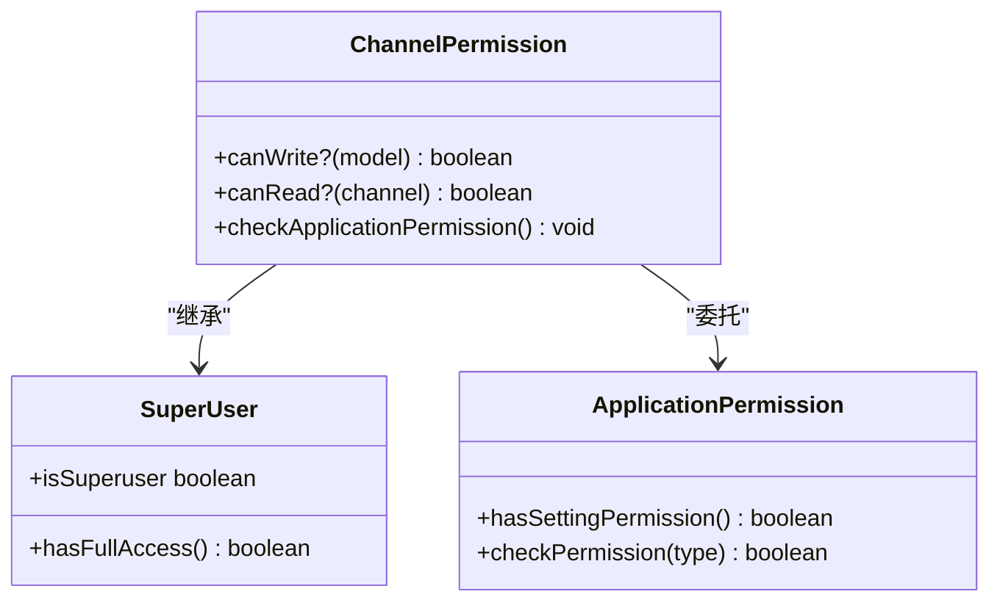
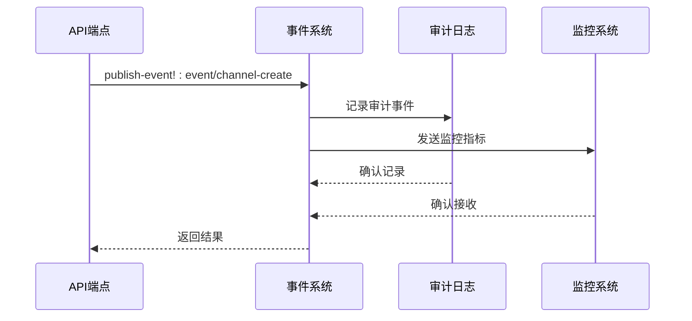
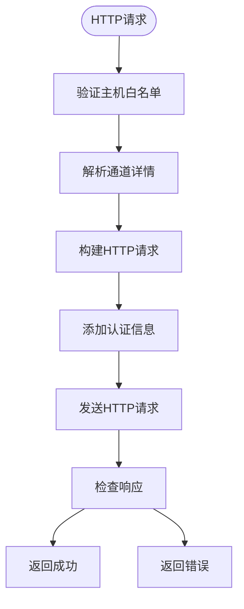
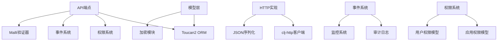

# API集成与配置端点

<cite>
**本文档中引用的文件**
- [channel.clj](file://src/metabase/channel/api/channel.clj)
- [models/channel.clj](file://src/metabase/channel/models/channel.clj)
- [api.clj](file://src/metabase/channel/api.clj)
- [core.clj](file://src/metabase/channel/core.clj)
- [http.clj](file://src/metabase/channel/impl/http.clj)
- [events/core.clj](file://src/metabase/events/core.clj)
- [events/impl.clj](file://src/metabase/events/impl.clj)
- [common.clj](file://src/metabase/api/common.clj)
- [permissions/core.clj](file://src/metabase/permissions/core.clj)
- [schema.clj](file://src/metabase/util/malli/schema.clj)
</cite>

## 目录
1. [简介](#简介)
2. [项目结构](#项目结构)
3. [核心组件](#核心组件)
4. [架构概览](#架构概览)
5. [详细组件分析](#详细组件分析)
6. [依赖关系分析](#依赖关系分析)
7. [性能考虑](#性能考虑)
8. [故障排除指南](#故障排除指南)
9. [结论](#结论)

## 简介

本文档全面介绍了Metabase中HTTP/Webhook通道的API集成接口系统。该系统提供了完整的RESTful API端点用于管理通道配置，支持通道的创建、读取、更新和删除操作，以及连接测试功能。系统采用Toucan2 ORM进行数据持久化，实现了严格的权限控制和事件发布机制。

## 项目结构

HTTP/Webhook通道系统的文件组织结构如下：

**图表来源**
- [channel.clj](file://src/metabase/channel/api/channel.clj#L1-L108)
- [models/channel.clj](file://src/metabase/channel/models/channel.clj#L1-L130)
- [api.clj](file://src/metabase/channel/api.clj#L1-L23)

**章节来源**
- [channel.clj](file://src/metabase/channel/api/channel.clj#L1-L108)
- [models/channel.clj](file://src/metabase/channel/models/channel.clj#L1-L130)
- [api.clj](file://src/metabase/channel/api.clj#L1-L23)

## 核心组件

### 通道类型验证系统

系统实现了严格的通道类型命名空间验证机制，确保所有通道类型都符合`channel/namespace`格式规范。

### 权限控制系统

采用基于应用权限的访问控制模型，通过`perms/check-has-application-permission :setting`进行权限验证。

### 数据模型层

使用Toucan2 ORM框架，提供类型安全的数据访问接口和自动化的数据转换功能。

**章节来源**
- [channel.clj](file://src/metabase/channel/api/channel.clj#L35-L64)
- [models/channel.clj](file://src/metabase/channel/models/channel.clj#L32-L69)

## 架构概览

HTTP/Webhook通道系统采用分层架构设计，清晰分离了API接口、业务逻辑、数据持久化和基础设施服务。

**图表来源**
- [channel.clj](file://src/metabase/channel/api/channel.clj#L1-L108)
- [core.clj](file://src/metabase/channel/core.clj#L1-L43)
- [events/impl.clj](file://src/metabase/events/impl.clj#L1-L127)

## 详细组件分析

### RESTful API端点设计

#### GET /api/channel - 获取通道列表

该端点支持两种查询模式：
- **活跃通道查询**：默认返回所有激活状态的通道
- **包含非活跃通道查询**：通过`include_inactive=true`参数获取全部通道

**图表来源**
- [channel.clj](file://src/metabase/channel/api/channel.clj#L25-L34)

#### POST /api/channel - 创建新通道

通道创建过程包含以下关键步骤：

1. **权限验证**：检查用户是否具有设置权限
2. **名称唯一性检查**：验证通道名称在系统中唯一
3. **数据插入**：使用Toucan2 ORM创建新记录
4. **事件发布**：触发通道创建事件

**图表来源**
- [channel.clj](file://src/metabase/channel/api/channel.clj#L44-L64)

#### PUT /api/channel/:id - 更新通道

通道更新操作支持部分字段更新，系统会自动记录更新前后的状态差异。

#### POST /api/channel/test - 测试连接

连接测试功能允许用户验证通道配置的有效性，支持多种认证方法和请求类型。

**章节来源**
- [channel.clj](file://src/metabase/channel/api/channel.clj#L25-L106)

### Toucan2 ORM模型交互

#### 数据模型定义

通道数据模型包含以下核心字段：

| 字段名 | 类型 | 描述 | 验证规则 |
|--------|------|------|----------|
| name | String | 通道名称 | 非空字符串，唯一约束 |
| type | Keyword | 通道类型 | 必须以`channel/`命名空间开头 |
| details | Map | 通道详情配置 | 加密存储，JSON格式 |
| active | Boolean | 激活状态 | 默认为true |
| description | String | 通道描述 | 可选字段 |

#### 权限控制机制

系统实现了细粒度的权限控制：

**图表来源**
- [models/channel.clj](file://src/metabase/channel/models/channel.clj#L44-L52)
- [permissions/core.clj](file://src/metabase/permissions/core.clj#L1-L128)

**章节来源**
- [models/channel.clj](file://src/metabase/channel/models/channel.clj#L32-L69)

### 事件发布机制

#### 事件类型定义

系统定义了两种主要的通道事件：

1. **channel-create**：通道创建时触发
2. **channel-update**：通道更新时触发

#### 事件发布流程

**图表来源**
- [events/impl.clj](file://src/metabase/events/impl.clj#L80-L126)

**章节来源**
- [events/impl.clj](file://src/metabase/events/impl.clj#L80-L126)

### HTTP通道实现

#### 请求处理流程

HTTP通道实现了完整的Webhook功能，支持多种认证方式和请求格式：

**图表来源**
- [http.clj](file://src/metabase/channel/impl/http.clj#L40-L70)

**章节来源**
- [http.clj](file://src/metabase/channel/impl/http.clj#L40-L111)

## 依赖关系分析

### 核心依赖图

**图表来源**
- [channel.clj](file://src/metabase/channel/api/channel.clj#L1-L15)
- [models/channel.clj](file://src/metabase/channel/models/channel.clj#L1-L15)

**章节来源**
- [channel.clj](file://src/metabase/channel/api/channel.clj#L1-L15)
- [models/channel.clj](file://src/metabase/channel/models/channel.clj#L1-L15)

## 性能考虑

### 数据库优化策略

1. **索引优化**：为`name`字段建立唯一索引
2. **查询优化**：使用Toucan2的延迟加载机制
3. **缓存策略**：对频繁访问的配置进行缓存

### 并发控制

系统通过以下机制确保并发安全性：
- 数据库事务隔离
- 唯一约束保证
- 权限检查的原子性

## 故障排除指南

### 常见问题及解决方案

#### 权限相关问题

**问题**：用户无法创建通道
**原因**：缺少设置权限
**解决方案**：检查用户的应用权限配置

#### 通道名称冲突

**问题**：创建重复名称的通道
**原因**：名称唯一性检查失败
**解决方案**：使用唯一的通道名称或删除现有同名通道

#### 连接测试失败

**问题**：HTTP通道连接测试失败
**原因**：网络配置或认证信息错误
**解决方案**：验证URL、认证信息和网络连通性

**章节来源**
- [channel.clj](file://src/metabase/channel/api/channel.clj#L50-L64)
- [http.clj](file://src/metabase/channel/impl/http.clj#L70-L111)

## 结论

Metabase的HTTP/Webhook通道API集成系统提供了一个完整、安全且可扩展的解决方案。通过RESTful API设计、严格的权限控制、完善的事件机制和灵活的ORM支持，系统能够满足企业级应用的各种需求。该架构的设计充分考虑了可维护性、性能和安全性，为未来的功能扩展奠定了坚实的基础。