# HTTP/Webhook请求处理机制

<cite>
**本文档引用的文件**
- [src/metabase/channel/impl/http.clj](file://src/metabase/channel/impl/http.clj)
- [src/metabase/util/malli/schema.clj](file://src/metabase/util/malli/schema.clj)
- [src/metabase/channel/render/core.clj](file://src/metabase/channel/render/core.clj)
- [src/metabase/channel/render/card.clj](file://src/metabase/channel/render/card.clj)
- [src/metabase/channel/render/image_bundle.clj](file://src/metabase/channel/render/image_bundle.clj)
- [src/metabase/channel/shared.clj](file://src/metabase/channel/shared.clj)
- [src/metabase/channel/settings.clj](file://src/metabase/channel/settings.clj)
- [src/metabase/actions/http_action.clj](file://src/metabase/actions/http_action.clj)
</cite>

## 目录
1. [简介](#简介)
2. [核心架构概述](#核心架构概述)
3. [HTTPDetails和HTTPChannel数据验证模式](#httpdetails和httpchannel数据验证模式)
4. [mu/defmethod channel/send! :channel/http实现详解](#mudefmethod-channelsend-http-channelhttp实现详解)
5. [认证头处理机制](#认证头处理机制)
6. [请求构建与超时配置](#请求构建与超时配置)
7. [响应验证流程](#响应验证流程)
8. [JSON有效负载结构](#json有效负载结构)
9. [图像渲染与base64编码](#图像渲染与base64编码)
10. [性能优化与最佳实践](#性能优化与最佳实践)
11. [故障排除指南](#故障排除指南)
12. [总结](#总结)

## 简介

Metabase的HTTP/Webhook请求处理机制是一个高度模块化和安全的系统，专门设计用于处理仪表板订阅和警报通知中的HTTP请求发送。该系统基于Malli数据验证框架，提供了强大的类型安全性和错误处理能力，同时支持多种认证方式和灵活的请求配置。

本文档深入分析了`src/metabase/channel/impl/http.clj`中实现的核心功能，包括请求构建、认证处理、响应验证以及JSON有效负载的生成机制。

## 核心架构概述

HTTP请求处理机制采用分层架构设计，主要包含以下核心组件：

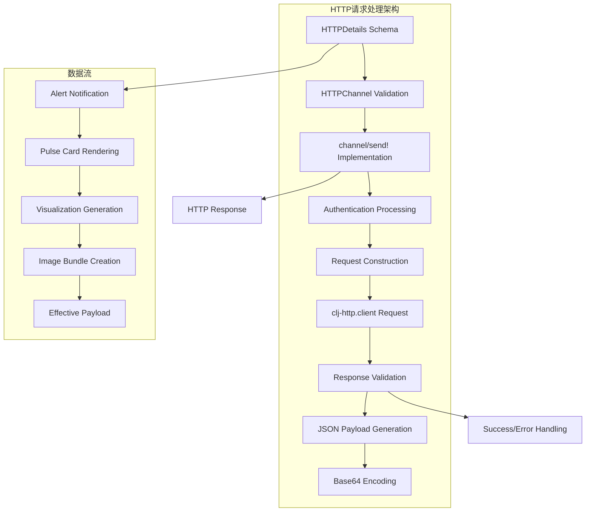

**图表来源**
- [src/metabase/channel/impl/http.clj](file://src/metabase/channel/impl/http.clj#L25-L38)
- [src/metabase/channel/render/core.clj](file://src/metabase/channel/render/core.clj#L1-L35)

**章节来源**
- [src/metabase/channel/impl/http.clj](file://src/metabase/channel/impl/http.clj#L1-L112)

## HTTPDetails和HTTPChannel数据验证模式

### HTTPDetails模式定义

HTTPDetails是系统中用于验证HTTP通道配置的核心Malli模式，它定义了HTTP请求的所有必要参数和可选配置：

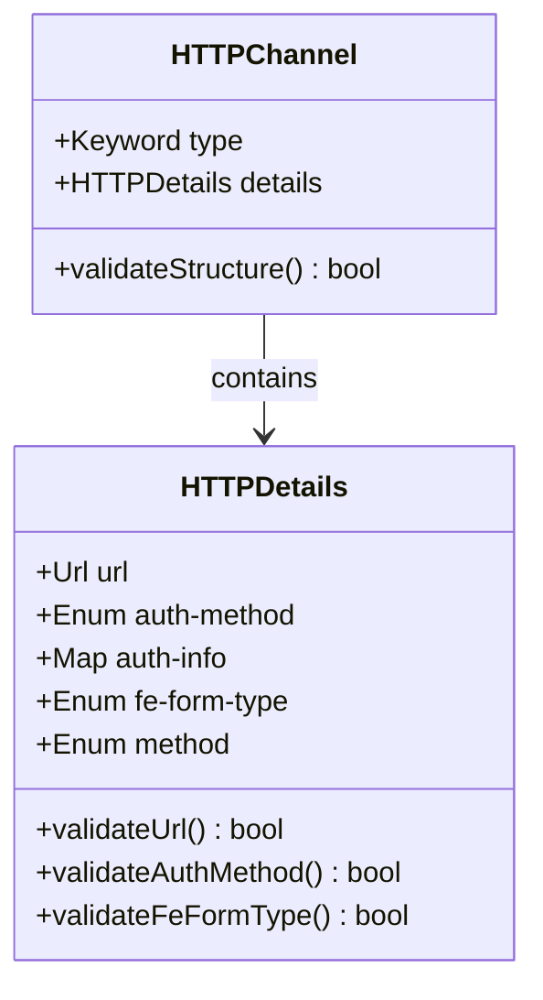

**图表来源**
- [src/metabase/channel/impl/http.clj](file://src/metabase/channel/impl/http.clj#L25-L38)

### 验证规则详解

HTTPDetails模式包含以下关键验证规则：

| 字段 | 类型 | 必需性 | 验证规则 | 描述 |
|------|------|--------|----------|------|
| url | Url | 必需 | Malli Url Schema | 有效的HTTP/HTTPS URL |
| auth-method | Enum | 必需 | ["none", "header", "query-param", "request-body"] | 认证方法选择 |
| auth-info | Map | 可选 | Map-of String Any | 认证信息键值对 |
| fe-form-type | Enum | 可选 | ["api-key", "bearer", "basic", "none"] | 前端表单类型 |
| method | Enum | 可选 | ["get", "post", "put"] | HTTP请求方法 |

**章节来源**
- [src/metabase/channel/impl/http.clj](file://src/metabase/channel/impl/http.clj#L25-L38)
- [src/metabase/util/malli/schema.clj](file://src/metabase/util/malli/schema.clj#L210-L220)

## mu/defmethod channel/send! :channel/http实现详解

### 核心实现逻辑

`mu/defmethod channel/send! :channel/http`是HTTP请求处理的核心入口点，它实现了完整的请求生命周期管理：

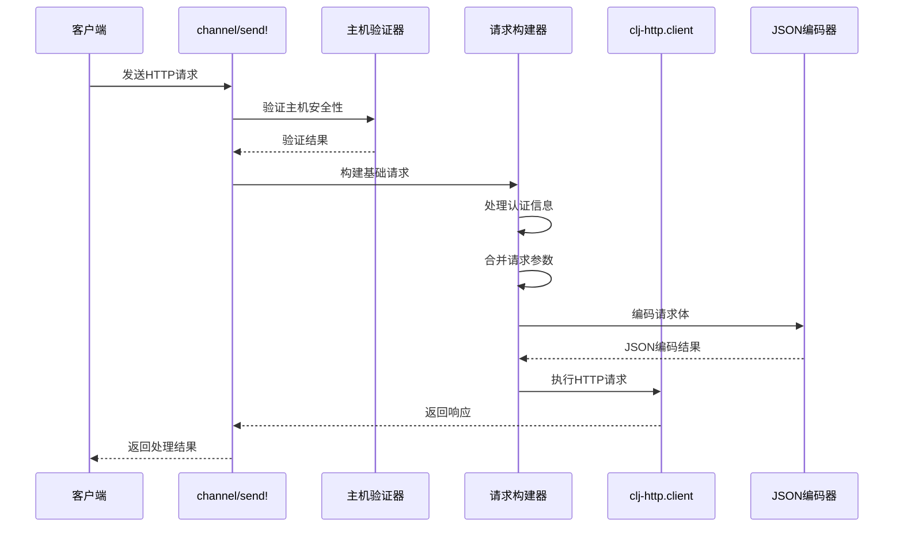

**图表来源**
- [src/metabase/channel/impl/http.clj](file://src/metabase/channel/impl/http.clj#L39-L56)

### 关键处理步骤

1. **主机安全性验证**：使用`u/valid-host?`函数检查目标URL是否指向内部托管元数据主机
2. **基础请求构建**：设置默认的JSON接受和内容类型
3. **认证信息处理**：根据认证方法动态合并认证信息
4. **请求体编码**：自动将复杂数据结构转换为JSON格式

**章节来源**
- [src/metabase/channel/impl/http.clj](file://src/metabase/channel/impl/http.clj#L39-L56)

## 认证头处理机制

### 三种认证方式详解

系统支持三种不同的认证处理方式，每种方式都有其特定的应用场景：

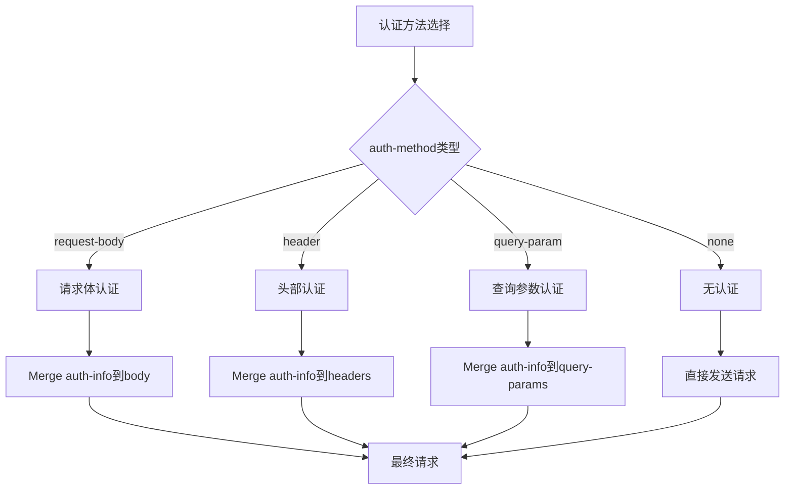

**图表来源**
- [src/metabase/channel/impl/http.clj](file://src/metabase/channel/impl/http.clj#L47-L52)

### 认证处理实现

认证信息的处理通过`cond->`宏实现条件合并：

| 认证方法 | 处理方式 | 示例用途 |
|----------|----------|----------|
| request-body | `update :body merge auth-info` | API密钥嵌入到请求体 |
| header | `update :headers merge auth-info` | Bearer Token或自定义头部 |
| query-param | `update :query-params merge auth-info` | 查询字符串认证参数 |

**章节来源**
- [src/metabase/channel/impl/http.clj](file://src/metabase/channel/impl/http.clj#L47-L52)

## 请求构建与超时配置

### 默认请求配置

系统为HTTP请求设置了标准化的默认配置：

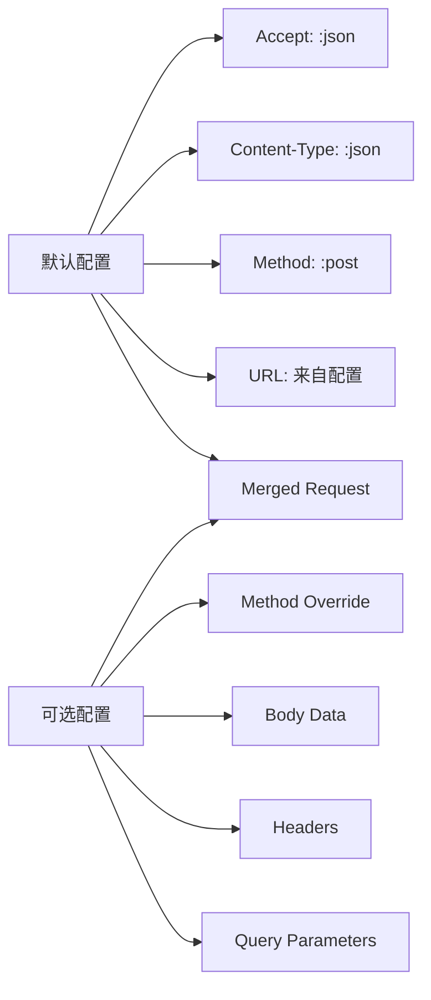

**图表来源**
- [src/metabase/channel/impl/http.clj](file://src/metabase/channel/impl/http.clj#L42-L52)

### 请求体处理逻辑

请求体的处理采用了智能判断机制：

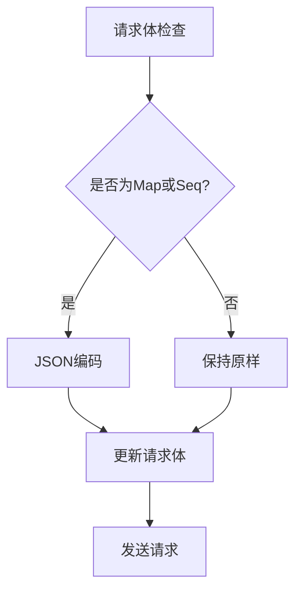

**图表来源**
- [src/metabase/channel/impl/http.clj](file://src/metabase/channel/impl/http.clj#L54-L56)

**章节来源**
- [src/metabase/channel/impl/http.clj](file://src/metabase/channel/impl/http.clj#L42-L56)

## 响应验证流程

### 连接测试机制

系统提供了专门的连接测试功能，确保HTTP通道的可用性：

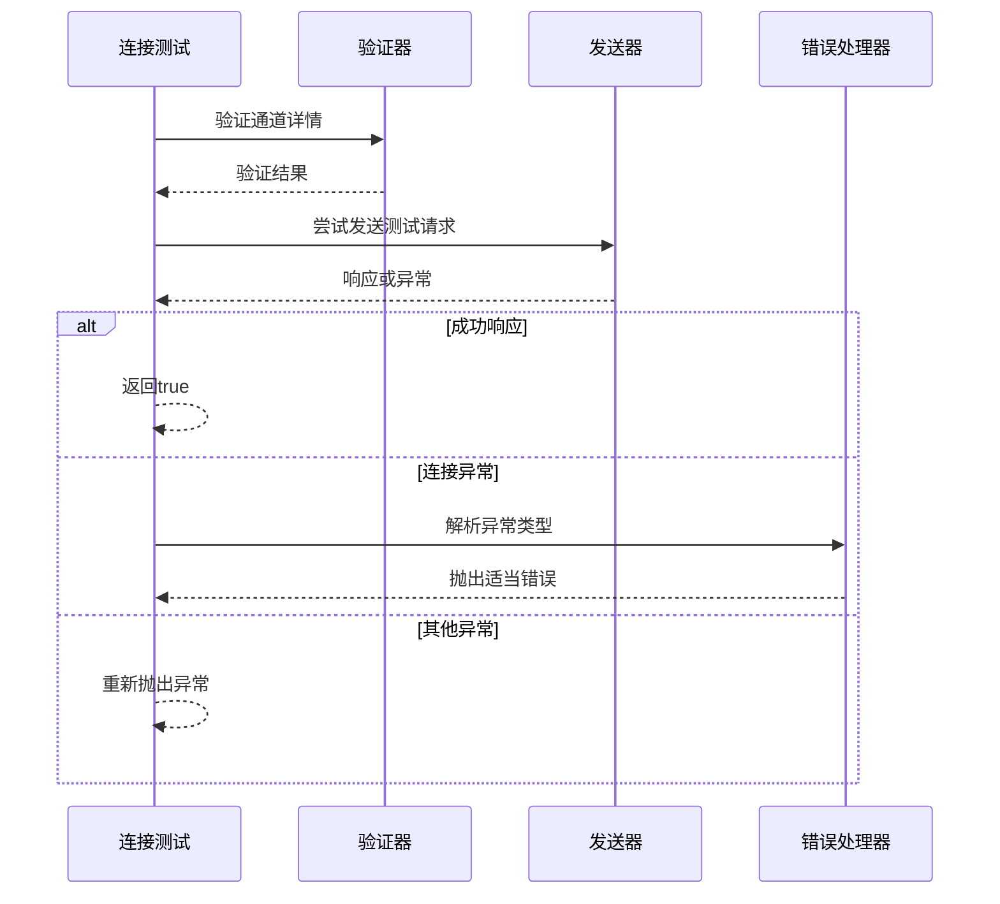

**图表来源**
- [src/metabase/channel/impl/http.clj](file://src/metabase/channel/impl/http.clj#L60-L71)

### 错误处理策略

系统实现了多层次的错误处理机制：

| 异常类型 | 处理策略 | 用户反馈 |
|----------|----------|----------|
| 连接失败 | 检查网络和URL | 显示连接错误信息 |
| 认证失败 | 验证凭据有效性 | 提示认证配置问题 |
| 超时异常 | 调整超时设置 | 建议增加超时时间 |
| 数据格式错误 | 验证输入数据 | 显示数据验证错误 |

**章节来源**
- [src/metabase/channel/impl/http.clj](file://src/metabase/channel/impl/http.clj#L60-L71)
- [src/metabase/channel/shared.clj](file://src/metabase/channel/shared.clj#L15-L25)

## JSON有效负载结构

### 有效负载架构

HTTP通知的有效负载遵循严格的JSON结构，包含警报标识符、创建者信息和可视化数据：

```mermaid
graph TB
subgraph "JSON有效负载结构"
A[Root Object] --> B[type: "alert"]
A --> C[alert_id: Number]
A --> D[alert_creator_id: Number]
A --> E[alert_creator_name: String]
A --> F[data: Object]
A --> G[sent_at: DateTime]
F --> H[type: "question"]
F --> I[question_id: Number]
F --> J[question_name: String]
F --> K[question_url: String]
F --> L[visualization: Base64String]
F --> M[raw_data: Object]
end
```

**图表来源**
- [src/metabase/channel/impl/http.clj](file://src/metabase/channel/impl/http.clj#L95-L110)

### 数据字段详解

| 字段 | 类型 | 描述 | 示例值 |
|------|------|------|--------|
| type | String | 通知类型标识 | "alert" |
| alert_id | Number | 警报唯一标识符 | 12345 |
| alert_creator_id | Number | 创建者用户ID | 67890 |
| alert_creator_name | String | 创建者姓名 | "John Doe" |
| data.type | String | 数据类型 | "question" |
| data.question_id | Number | 问题ID | 54321 |
| data.question_name | String | 问题名称 | "Monthly Sales Report" |
| data.question_url | String | 问题URL | "https://metabase.example.com/question/54321" |
| data.visualization | Base64String | 可视化图像的Base64编码 | "iVBORw0KGgoAAAANS..." |
| data.raw_data | Object | 原始数据表格 | {cols: [...], rows: [...]} |
| sent_at | DateTime | 发送时间戳 | "2024-01-15T10:30:00Z" |

**章节来源**
- [src/metabase/channel/impl/http.clj](file://src/metabase/channel/impl/http.clj#L95-L110)

## 图像渲染与base64编码

### 渲染管道

系统实现了复杂的图像渲染管道，将可视化图表转换为可传输的图像格式：

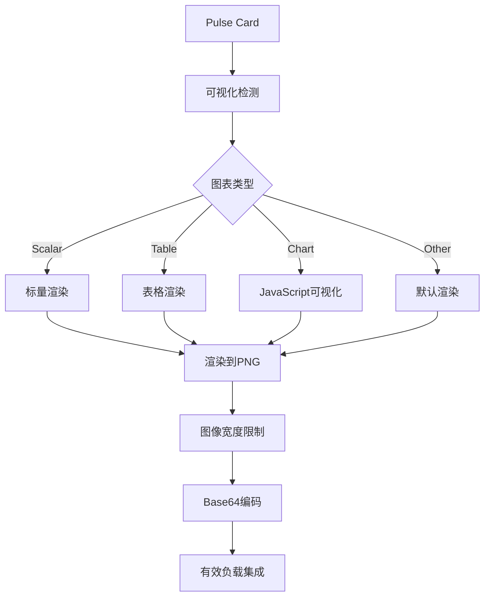

**图表来源**
- [src/metabase/channel/render/card.clj](file://src/metabase/channel/render/card.clj#L100-L150)
- [src/metabase/channel/render/image_bundle.clj](file://src/metabase/channel/render/image_bundle.clj#L40-L70)

### 图像宽度限制机制

系统设置了1200像素的图像宽度限制，以防止内容截断和内存问题：

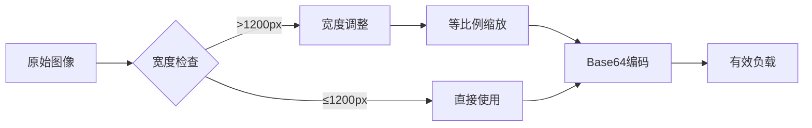

**图表来源**
- [src/metabase/channel/impl/http.clj](file://src/metabase/channel/impl/http.clj#L15-L17)

### 最佳实践建议

| 实践领域 | 建议 | 原因 |
|----------|------|------|
| 图表设计 | 使用简洁布局 | 减少渲染复杂度 |
| 数据量控制 | 限制行数在合理范围 | 避免内存溢出 |
| 宽度优化 | 预设合适的图表尺寸 | 确保显示完整性 |
| 编码效率 | 使用高效的Base64库 | 提升传输速度 |

**章节来源**
- [src/metabase/channel/impl/http.clj](file://src/metabase/channel/impl/http.clj#L15-L17)
- [src/metabase/channel/render/card.clj](file://src/metabase/channel/render/card.clj#L100-L200)

## 性能优化与最佳实践

### 内存管理策略

系统采用了多项内存优化措施：

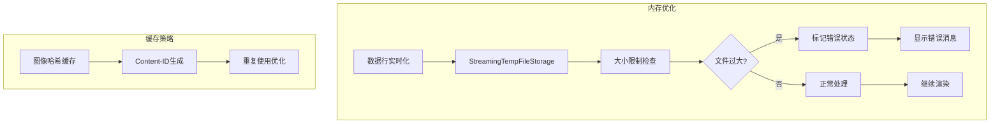

**图表来源**
- [src/metabase/channel/shared.clj](file://src/metabase/channel/shared.clj#L30-L60)

### 性能监控指标

| 指标类别 | 监控项 | 阈值建议 | 优化策略 |
|----------|--------|----------|----------|
| 内存使用 | 单次渲染内存峰值 | <500MB | 分页处理大数据集 |
| 响应时间 | HTTP请求延迟 | <5秒 | 设置合理超时 |
| 错误率 | 认证失败率 | <5% | 定期验证凭据 |
| 并发处理 | 同时请求数 | 根据服务器容量 | 实施队列控制 |

**章节来源**
- [src/metabase/channel/shared.clj](file://src/metabase/channel/shared.clj#L30-L60)

## 故障排除指南

### 常见问题诊断

系统提供了详细的错误诊断和处理机制：

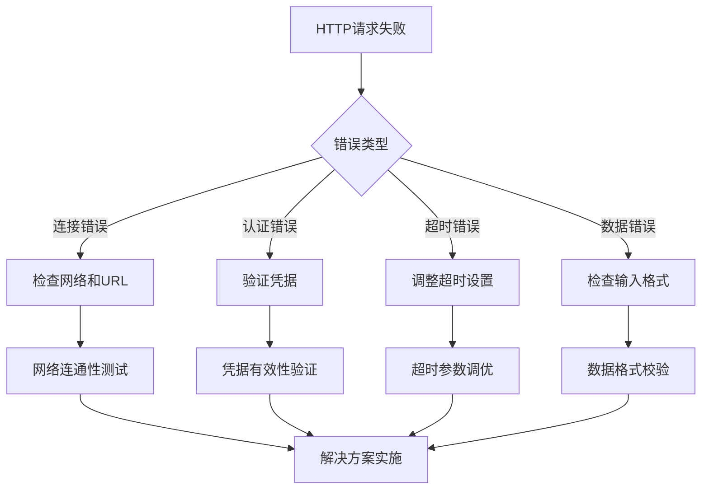

### 错误恢复策略

| 错误类型 | 检测方法 | 恢复策略 | 预防措施 |
|----------|----------|----------|----------|
| 网络连接失败 | 连接超时异常 | 重试机制 | 健康检查 |
| 认证凭据过期 | 401状态码 | 自动刷新 | 定期轮换 |
| 请求体过大 | 内存不足异常 | 分块处理 | 大小限制 |
| 图像渲染失败 | 渲染异常 | 降级处理 | 预览检查 |

**章节来源**
- [src/metabase/channel/impl/http.clj](file://src/metabase/channel/impl/http.clj#L58-L60)
- [src/metabase/channel/shared.clj](file://src/metabase/channel/shared.clj#L15-L25)

## 总结

Metabase的HTTP/Webhook请求处理机制展现了现代企业级应用的最佳实践。通过Malli数据验证框架，系统实现了强类型安全性和优雅的错误处理；通过模块化的认证处理机制，支持多种部署场景；通过智能的图像渲染和编码策略，确保了高效的数据传输。

该系统的设计充分考虑了生产环境的需求，包括内存管理、性能优化、错误恢复和监控诊断等各个方面。对于需要集成外部系统的开发者来说，这是一个值得参考的完整解决方案。

关键优势包括：
- **类型安全**：基于Malli的强类型验证
- **灵活认证**：支持多种认证方式
- **性能优化**：智能内存管理和缓存策略  
- **错误处理**：完善的异常捕获和恢复机制
- **可扩展性**：模块化设计便于功能扩展