# HTTP/Webhook通知扩展技术文档

<cite>
**本文档引用的文件**
- [impl/http.clj](file://src/metabase/channel/impl/http.clj)
- [api/channel.clj](file://src/metabase/channel/api/channel.clj)
- [urls.clj](file://src/metabase/channel/urls.clj)
- [core.clj](file://src/metabase/channel/core.clj)
- [shared.clj](file://src/metabase/channel/shared.clj)
- [settings.clj](file://src/metabase/channel/settings.clj)
- [send.clj](file://src/metabase/notification/send.clj)
- [retry.clj](file://src/metabase/util/retry.clj)
- [http.clj](file://src/metabase/util/http.clj)
- [json.clj](file://src/metabase/util/json.clj)
</cite>

## 目录
1. [简介](#简介)
2. [项目架构概览](#项目架构概览)
3. [核心组件分析](#核心组件分析)
4. [HTTP客户端实现](#http客户端实现)
5. [配置端点与API](#配置端点与api)
6. [回调URL生成](#回调url生成)
7. [JSON有效负载结构](#json有效负载结构)
8. [认证与安全机制](#认证与安全机制)
9. [错误处理与重试策略](#错误处理与重试策略)
10. [最佳实践指南](#最佳实践指南)
11. [故障排除](#故障排除)
12. [总结](#总结)

## 简介

Metabase的HTTP/Webhook通知扩展是一个强大的系统，用于向外部服务发送实时通知和数据回调。该系统支持多种认证方式、灵活的配置选项和健壮的错误处理机制，确保可靠的通知传递。

本文档深入分析了实现HTTP客户端的核心组件，包括请求构建、认证处理、超时配置、响应验证以及异步回调处理等关键技术特性。

## 项目架构概览

HTTP/Webhook通知扩展采用模块化架构设计，主要包含以下核心层次：

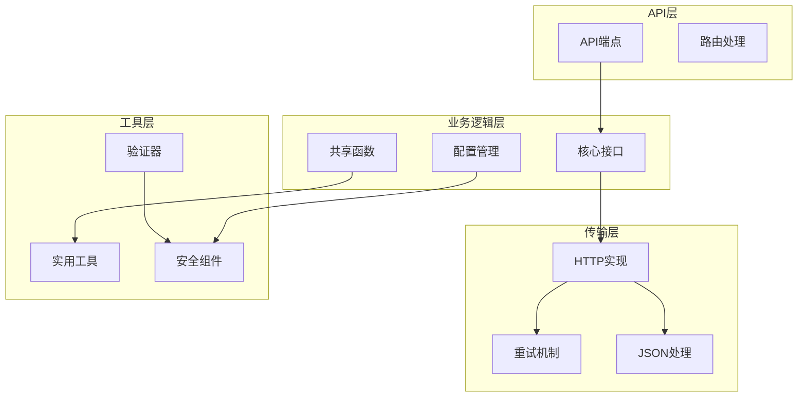

**图表来源**
- [api/channel.clj](file://src/metabase/channel/api/channel.clj#L1-L108)
- [core.clj](file://src/metabase/channel/core.clj#L1-L43)
- [impl/http.clj](file://src/metabase/channel/impl/http.clj#L1-L112)

## 核心组件分析

### 多方法架构

Metabase使用Clojure的多方法(Multi-Methods)模式来实现通道系统的可扩展性：

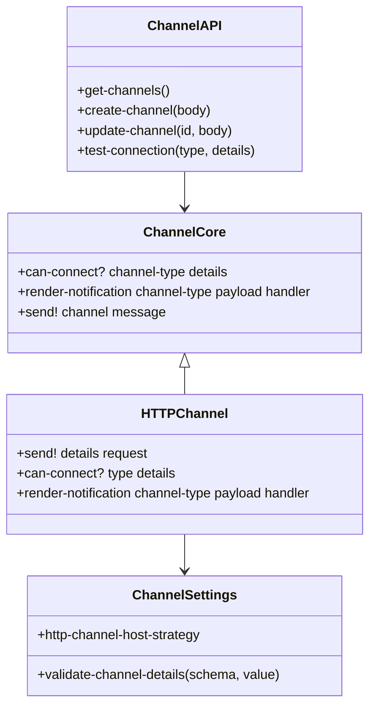

**图表来源**
- [core.clj](file://src/metabase/channel/core.clj#L10-L42)
- [api/channel.clj](file://src/metabase/channel/api/channel.clj#L1-L108)
- [settings.clj](file://src/metabase/channel/settings.clj#L1-L321)

**章节来源**
- [core.clj](file://src/metabase/channel/core.clj#L1-L43)
- [api/channel.clj](file://src/metabase/channel/api/channel.clj#L1-L108)

## HTTP客户端实现

### 请求构建与配置

HTTP客户端实现了灵活的请求构建机制，支持多种认证方式和配置选项：

#### 认证方法支持

系统支持四种认证方法：
- **无认证 (none)**: 不添加任何认证信息
- **头部认证 (header)**: 将认证信息作为HTTP头部发送
- **查询参数 (query-param)**: 将认证信息作为URL查询参数
- **请求体 (request-body)**: 将认证信息嵌入请求体

#### 请求配置流程

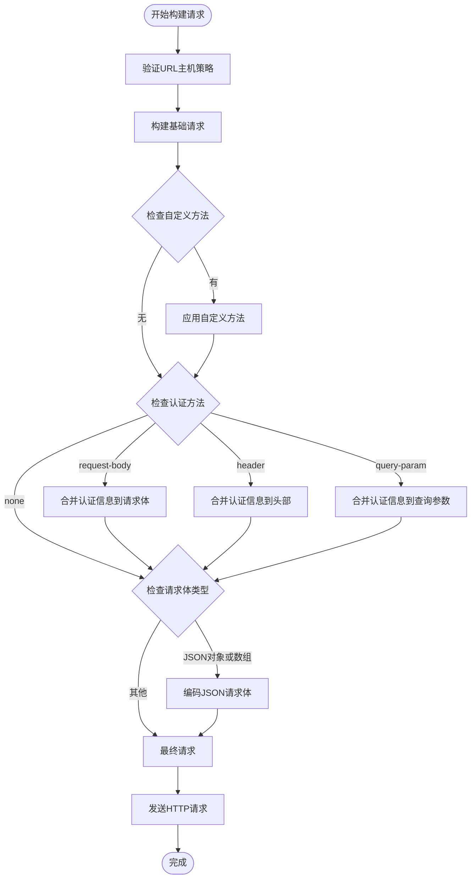

**图表来源**
- [impl/http.clj](file://src/metabase/channel/impl/http.clj#L34-L71)

#### 超时与连接配置

HTTP客户端集成了clj-http库，提供了完整的超时控制和连接管理：

- **接受类型**: 自动设置为`:json`
- **内容类型**: 默认为`:json`
- **默认方法**: POST请求
- **可配置方法**: 支持GET、POST、PUT

**章节来源**
- [impl/http.clj](file://src/metabase/channel/impl/http.clj#L34-L71)

### 响应验证机制

系统实现了多层次的响应验证：

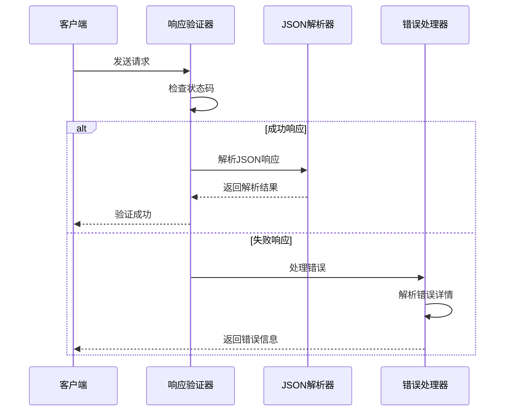

**图表来源**
- [impl/http.clj](file://src/metabase/channel/impl/http.clj#L73-L112)

**章节来源**
- [impl/http.clj](file://src/metabase/channel/impl/http.clj#L73-L112)

## 配置端点与API

### RESTful API端点

系统提供了完整的RESTful API来管理HTTP通道配置：

#### 端点概览

| HTTP方法 | 端点 | 功能描述 |
|---------|------|----------|
| GET | `/api/channel` | 获取所有通道列表 |
| POST | `/api/channel` | 创建新的HTTP通道 |
| GET | `/api/channel/:id` | 获取指定通道详情 |
| PUT | `/api/channel/:id` | 更新通道配置 |
| POST | `/api/channel/test` | 测试通道连接 |

#### 通道验证与测试

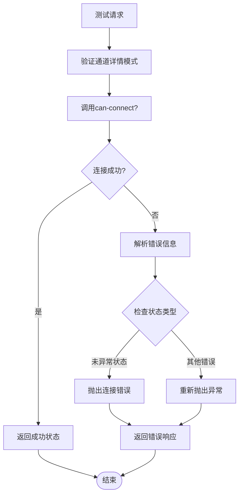

**图表来源**
- [api/channel.clj](file://src/metabase/channel/api/channel.clj#L85-L107)

**章节来源**
- [api/channel.clj](file://src/metabase/channel/api/channel.clj#L1-L108)

## 回调URL生成

### URL生成策略

系统提供了统一的URL生成机制，支持各种Metabase对象的深度链接：

#### URL生成函数族

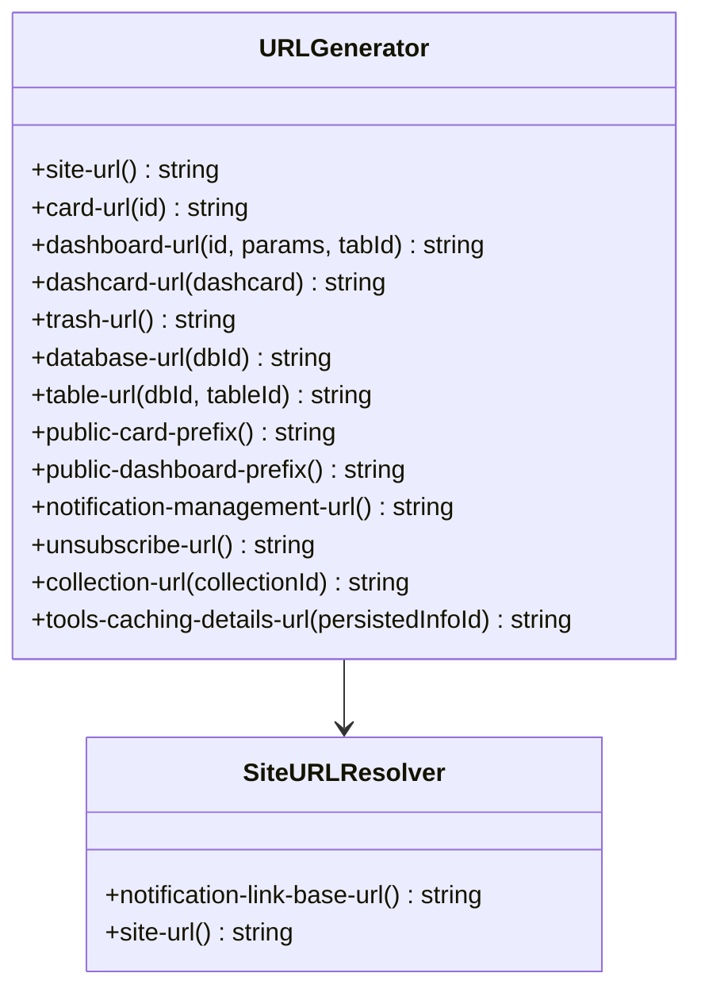

**图表来源**
- [urls.clj](file://src/metabase/channel/urls.clj#L15-L115)

#### 参数编码与深度链接

系统支持复杂的参数编码，用于生成带有预设参数的深度链接：

- **仪表板参数**: 支持URL参数编码
- **时间范围过滤**: 自动处理时间参数
- **标签页导航**: 支持特定标签页跳转

**章节来源**
- [urls.clj](file://src/metabase/channel/urls.clj#L1-L116)

## JSON有效负载结构

### 通知载荷格式

系统定义了标准化的通知载荷结构，支持不同类型的通知：

#### 卡片通知载荷

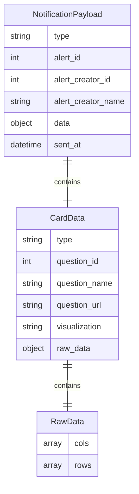

**图表来源**
- [impl/http.clj](file://src/metabase/channel/impl/http.clj#L85-L112)

#### Dashboard通知载荷

Dashboard通知使用不同的载荷结构，包含仪表板特定的信息：

- **仪表板ID**: 关联的仪表板标识符
- **参数信息**: 可选的查询参数
- **订阅信息**: 订阅者和触发条件

**章节来源**
- [impl/http.clj](file://src/metabase/channel/impl/http.clj#L85-L112)

### JSON序列化与反序列化

系统使用Cheshire库进行JSON处理，提供了以下特性：

- **日期格式**: 统一的ISO 8601日期格式
- **自定义编码器**: 支持复杂对象的序列化
- **键名转换**: 自动关键字化映射键
- **流式处理**: 支持大对象的流式序列化

**章节来源**
- [json.clj](file://src/metabase/util/json.clj#L1-L92)

## 认证与安全机制

### 主机验证策略

系统实现了严格的主机验证机制来防止内部元数据泄露：

#### 验证策略级别

| 策略名称 | 描述 | 限制 |
|---------|------|------|
| `external-only` | 仅允许外部主机 | 禁止私有网络和本地回环 |
| `allow-private` | 允许私有网络 | 禁止本地回环地址 |
| `allow-all` | 无限制 | 允许所有主机 |

#### 安全检查流程

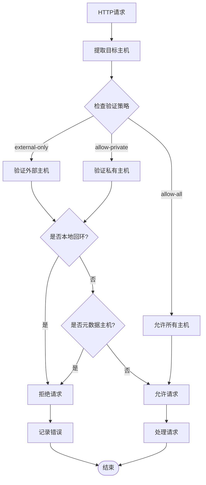

**图表来源**
- [http.clj](file://src/metabase/util/http.clj#L25-L43)

### 认证信息处理

系统支持多种认证信息的处理方式：

- **敏感信息掩码**: 在UI中自动掩码敏感字段
- **加密存储**: 敏感认证信息加密存储
- **动态获取**: 支持运行时动态获取认证令牌

**章节来源**
- [settings.clj](file://src/metabase/channel/settings.clj#L1-L321)

## 错误处理与重试策略

### 异常处理机制

系统实现了分层的异常处理机制：

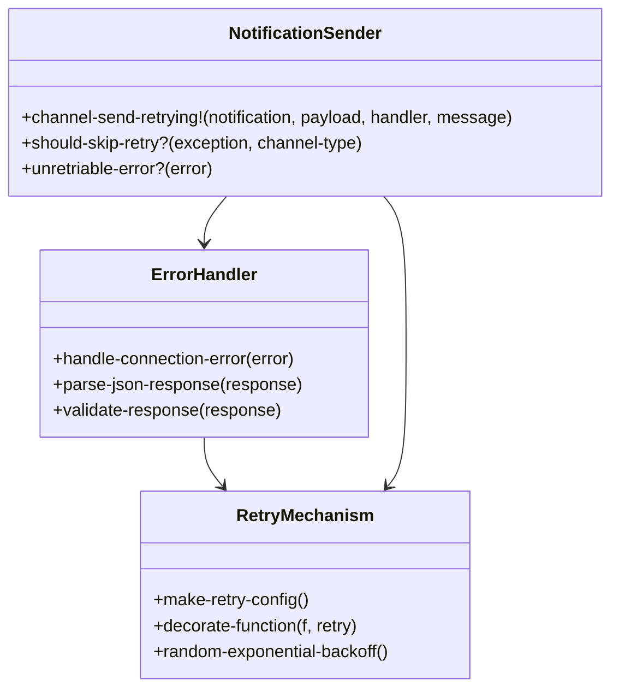

**图表来源**
- [send.clj](file://src/metabase/notification/send.clj#L40-L100)
- [retry.clj](file://src/metabase/util/retry.clj#L1-L121)

### 重试配置参数

系统提供了可配置的重试机制：

| 参数 | 默认值 | 描述 |
|------|--------|------|
| 最大尝试次数 | 开发环境: 2, 生产环境: 7 | 最大重试次数 |
| 初始间隔 | 500ms | 第一次重试的延迟 |
| 乘数 | 2.0 | 退避算法的乘数因子 |
| 随机化因子 | 0.1 | 随机化抖动程度 |
| 最大间隔 | 30000ms | 最大退避间隔 |

#### 重试决策流程

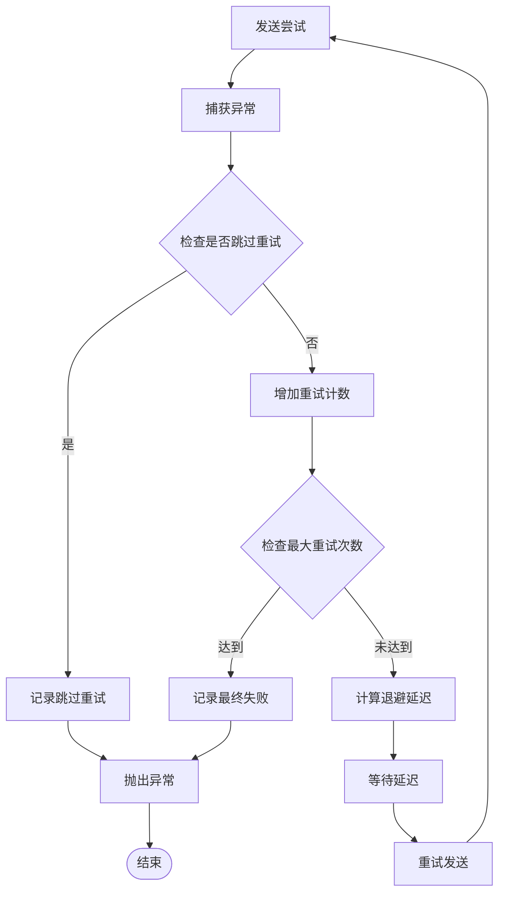

**图表来源**
- [send.clj](file://src/metabase/notification/send.clj#L66-L84)

**章节来源**
- [send.clj](file://src/metabase/notification/send.clj#L40-L100)
- [retry.clj](file://src/metabase/util/retry.clj#L1-L121)

## 最佳实践指南

### 自定义Webhook集成

#### 实现步骤

1. **通道配置**
   - 设置唯一的通道名称
   - 配置目标URL和认证方法
   - 定义请求方法和内容类型

2. **认证配置**
   - 选择合适的认证方式
   - 提供必要的认证凭据
   - 确保凭据的安全存储

3. **负载定制**
   - 根据接收方需求定制JSON结构
   - 实现适当的错误处理
   - 添加必要的元数据

#### 性能优化建议

- **批量处理**: 对于高频通知，考虑批量发送
- **连接池**: 合理配置HTTP连接池大小
- **缓存策略**: 缓存频繁使用的认证令牌
- **监控指标**: 监控发送成功率和延迟

### 安全性考虑

#### 数据保护

- **敏感信息加密**: 所有认证凭据必须加密存储
- **访问控制**: 实施严格的权限控制
- **审计日志**: 记录所有通道操作

#### 网络安全

- **主机验证**: 使用适当的主机验证策略
- **TLS要求**: 强制使用HTTPS连接
- **防火墙配置**: 正确配置网络访问规则

### 错误处理最佳实践

#### 分类处理

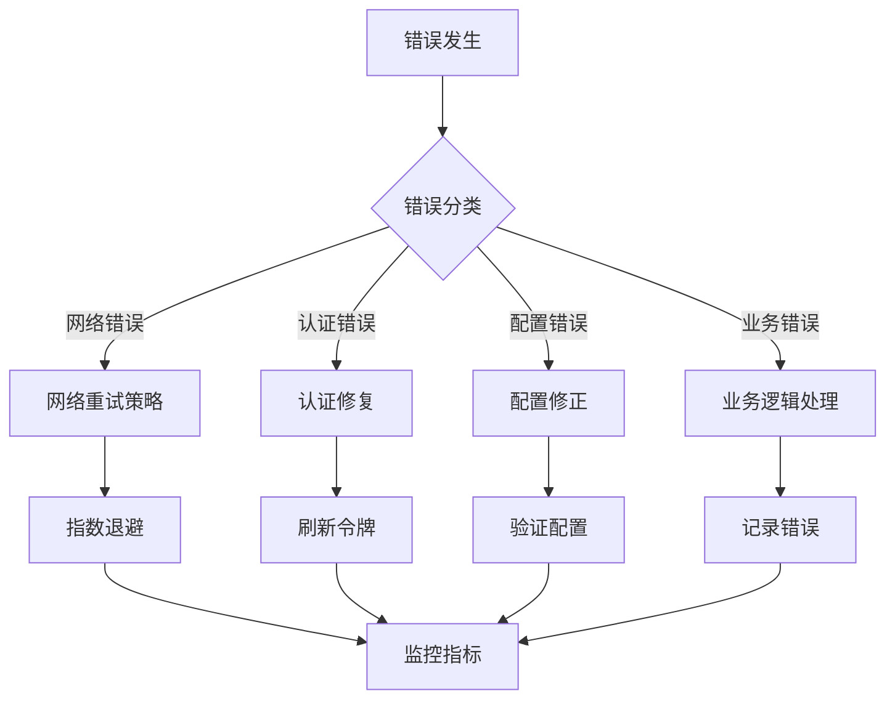

## 故障排除

### 常见问题诊断

#### 连接失败

**症状**: 通道测试失败，无法建立连接

**排查步骤**:
1. 检查目标URL的可达性
2. 验证主机验证策略配置
3. 确认网络防火墙设置
4. 检查认证凭据的有效性

#### 认证失败

**症状**: HTTP 401/403响应

**排查步骤**:
1. 验证认证方法配置
2. 检查认证凭据格式
3. 确认令牌有效期
4. 验证权限范围

#### 数据格式错误

**症状**: HTTP 400响应或解析错误

**排查步骤**:
1. 检查JSON载荷格式
2. 验证必需字段完整性
3. 确认数据类型正确性
4. 查看详细的错误信息

### 监控与调试

#### 关键指标

- **发送成功率**: 监控通知发送的成功率
- **响应时间**: 跟踪HTTP请求的响应时间
- **重试频率**: 监控重试发生的频率
- **错误类型分布**: 分析不同错误类型的分布

#### 日志分析

系统提供了详细的日志记录，包括：
- 请求和响应的完整内容
- 错误堆栈跟踪
- 性能指标数据
- 安全事件记录

## 总结

Metabase的HTTP/Webhook通知扩展提供了一个功能完整、安全可靠的解决方案，用于向外部系统发送实时通知。该系统的主要优势包括：

### 技术特性

- **模块化架构**: 基于多方法的可扩展设计
- **灵活认证**: 支持多种认证方式和配置选项
- **健壮错误处理**: 完整的异常处理和重试机制
- **安全机制**: 严格的安全验证和数据保护

### 开发优势

- **标准化接口**: 统一的API设计和数据格式
- **配置管理**: 灵活的配置选项和验证机制
- **性能优化**: 内置的重试策略和并发处理
- **监控支持**: 完善的指标收集和日志记录

### 应用场景

该扩展适用于各种需要实时通知的场景：
- 外部系统集成
- 第三方服务回调
- 实时数据同步
- 事件驱动架构

通过遵循本文档提供的最佳实践和指导原则，开发者可以有效地实现和维护HTTP/Webhook通知功能，确保系统的稳定性和可靠性。