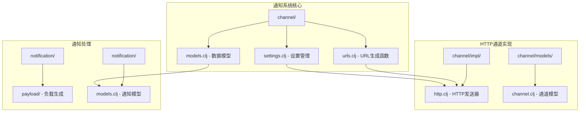
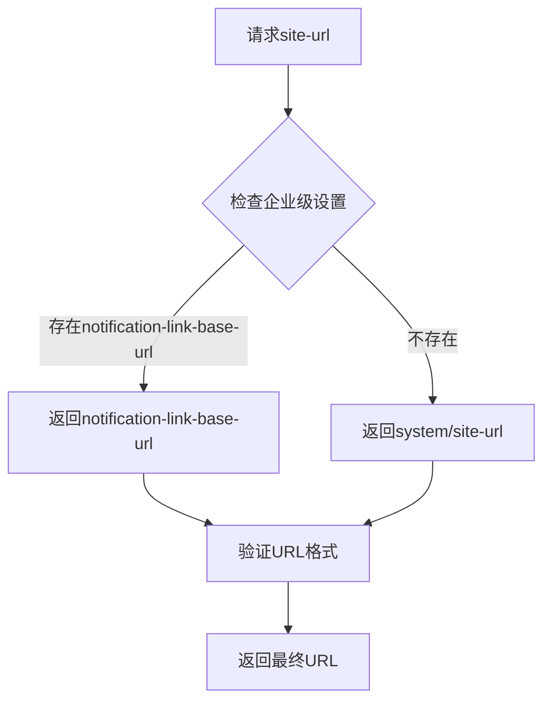
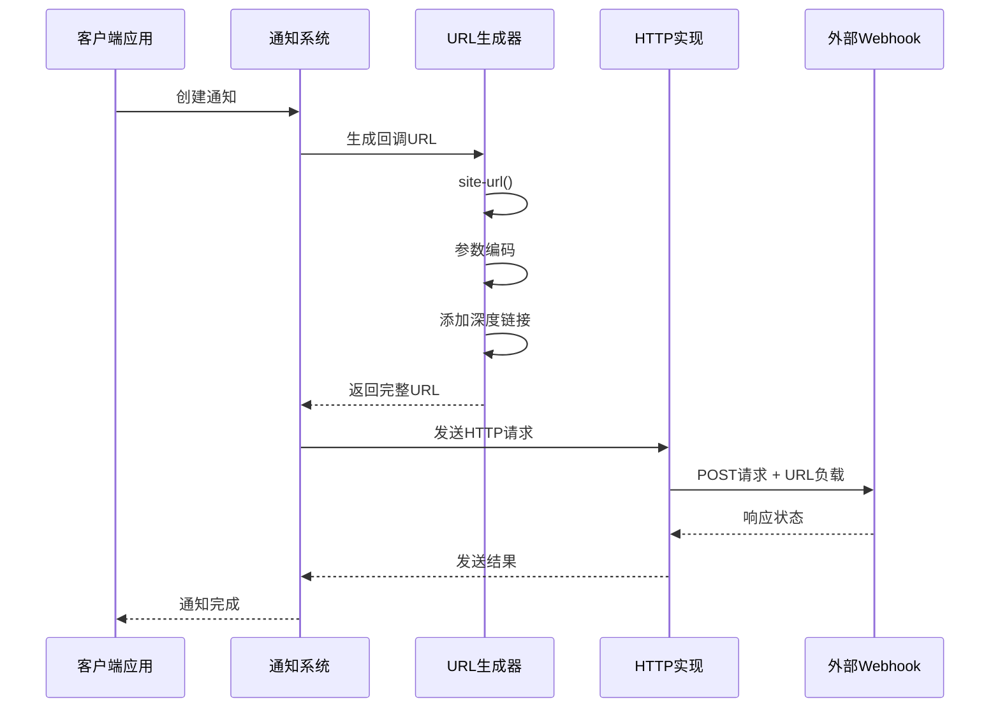
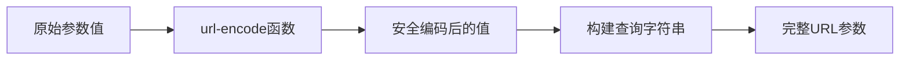
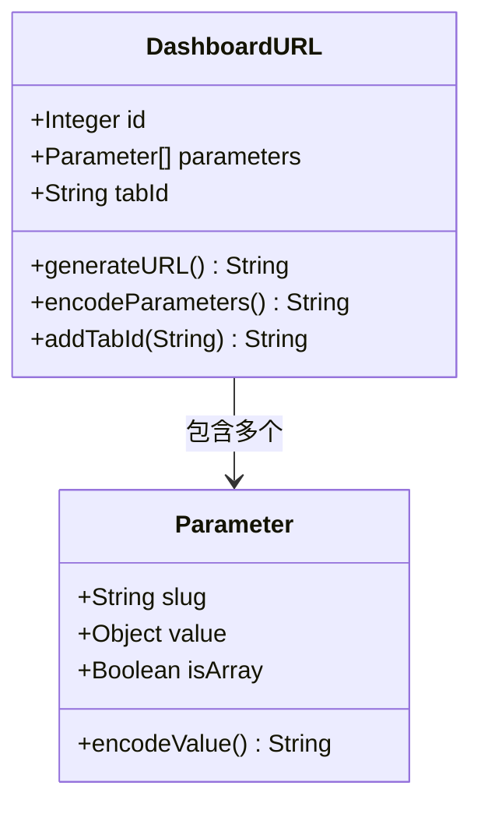
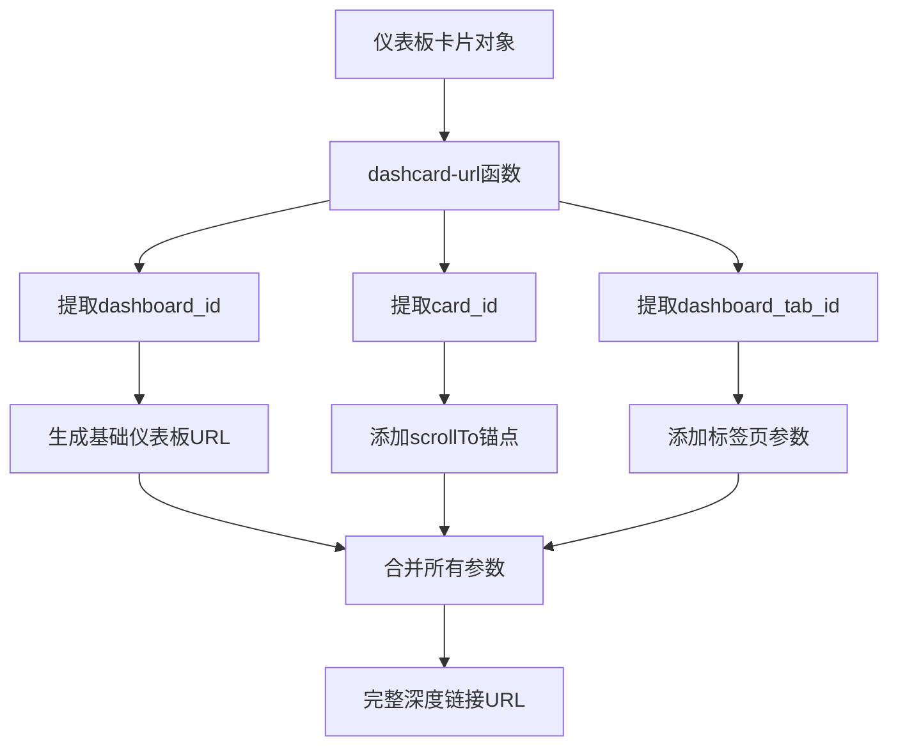
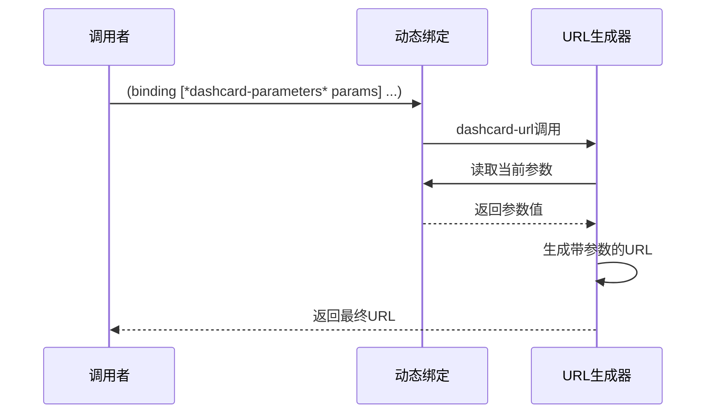
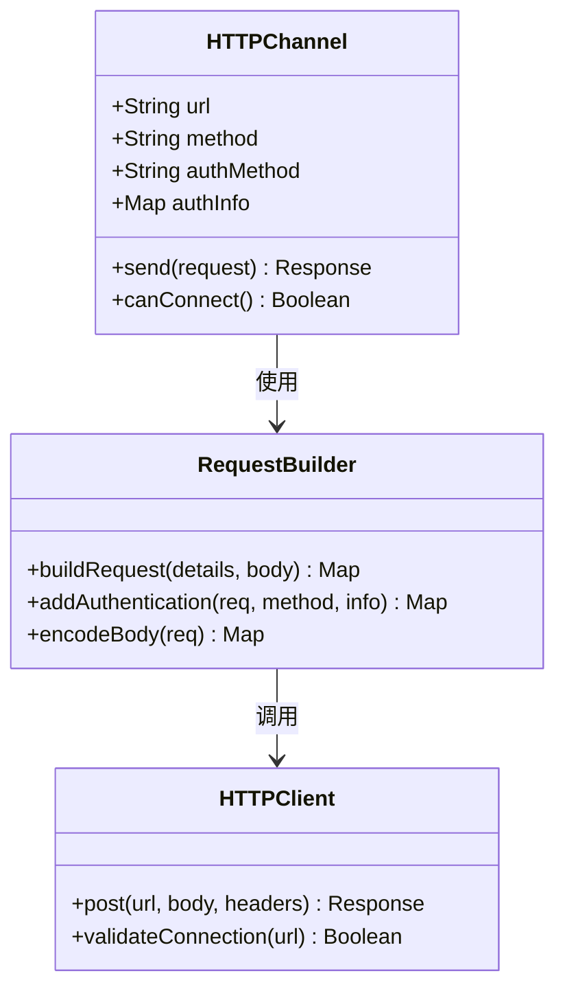
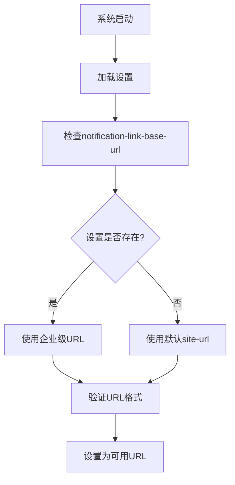
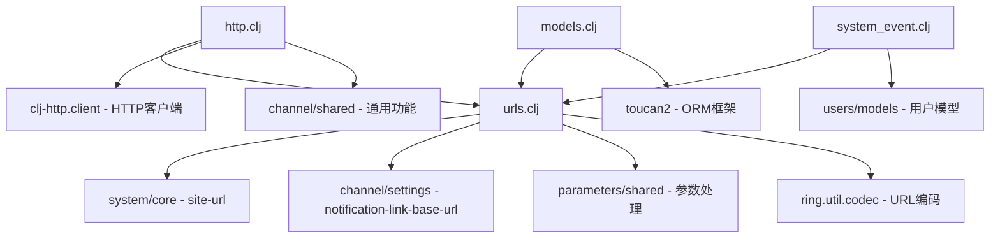

# 回调URL生成与链接管理

<cite>
**本文档中引用的文件**
- [urls.clj](file://src/metabase/channel/urls.clj)
- [settings.clj](file://src/metabase/channel/settings.clj)
- [models.clj](file://src/metabase/notification/models.clj)
- [http.clj](file://src/metabase/channel/impl/http.clj)
- [channel.clj](file://src/metabase/channel/models/channel.clj)
- [system_event.clj](file://src/metabase/notification/payload/impl/system_event.clj)
- [system.clj](file://src/metabase/system/settings.clj)
</cite>

## 目录
1. [简介](#简介)
2. [项目结构概览](#项目结构概览)
3. [核心组件分析](#核心组件分析)
4. [架构概览](#架构概览)
5. [详细组件分析](#详细组件分析)
6. [依赖关系分析](#依赖关系分析)
7. [性能考虑](#性能考虑)
8. [故障排除指南](#故障排除指南)
9. [结论](#结论)

## 简介

Metabase的HTTP/Webhook通知系统提供了一套完整的回调URL生成与管理机制，用于在各种通知渠道（包括电子邮件、Slack、Webhook）中生成可点击的跳转链接。该系统的核心功能包括：

- **统一的URL生成接口**：通过集中化的`urls.clj`模块提供所有前端URL的生成函数
- **灵活的站点URL优先级**：支持企业级环境变量覆盖机制
- **参数编码与深度链接**：支持仪表板参数传递和精确位置跳转
- **多渠道适配**：为不同通知渠道生成优化的链接格式

## 项目结构概览

Metabase的通知系统采用模块化设计，主要涉及以下关键目录：



**图表来源**
- [urls.clj](file://src/metabase/channel/urls.clj#L1-L116)
- [http.clj](file://src/metabase/channel/impl/http.clj#L1-L96)

**章节来源**
- [urls.clj](file://src/metabase/channel/urls.clj#L1-L116)
- [settings.clj](file://src/metabase/channel/settings.clj#L1-L321)

## 核心组件分析

### URL生成函数体系

Metabase提供了丰富的URL生成函数，涵盖各种用户界面元素：

| 函数名称 | 功能描述 | 参数类型 | 返回格式 |
|---------|---------|---------|---------|
| `site-url` | 获取基础站点URL | 无 | 字符串 |
| `card-url` | 生成卡片详情页URL | 整数ID | 完整URL字符串 |
| `dashboard-url` | 生成仪表板URL | 整数ID + 可选参数 | 带查询参数的URL |
| `public-card-prefix` | 公共卡片前缀 | 无 | URL前缀 |
| `public-dashboard-prefix` | 公共仪表板前缀 | 无 | URL前缀 |
| `dashcard-url` | 深度链接到仪表板卡片 | 结构化对象 | 带锚点的URL |

### 站点URL优先级机制

系统实现了智能的站点URL选择逻辑：



**图表来源**
- [urls.clj](file://src/metabase/channel/urls.clj#L18-L21)

**章节来源**
- [urls.clj](file://src/metabase/channel/urls.clj#L18-L21)
- [settings.clj](file://src/metabase/channel/settings.clj#L118-L125)

## 架构概览

### HTTP/Webhook通知流程



**图表来源**
- [http.clj](file://src/metabase/channel/impl/http.clj#L34-L71)
- [urls.clj](file://src/metabase/channel/urls.clj#L31-L64)

## 详细组件分析

### 参数编码与处理机制

#### URL参数编码实现

系统使用`ring.util.codec/url-encode`进行参数编码，确保特殊字符的安全传输：



**图表来源**
- [urls.clj](file://src/metabase/channel/urls.clj#L31-L48)

#### 仪表板标签页跳转支持

系统支持通过`tab-id`参数控制仪表板的初始显示标签页：



**图表来源**
- [urls.clj](file://src/metabase/channel/urls.clj#L31-L48)

**章节来源**
- [urls.clj](file://src/metabase/channel/urls.clj#L31-L64)

### 深度链接与锚点机制

#### scrollTo锚点实现

系统通过`#scrollTo=id`格式实现精确的页面定位：



**图表来源**
- [urls.clj](file://src/metabase/channel/urls.clj#L56-L61)

#### 动态参数绑定机制

系统使用动态绑定变量`*dashcard-parameters*`来管理深度链接参数：



**图表来源**
- [urls.clj](file://src/metabase/channel/urls.clj#L54-L55)

**章节来源**
- [urls.clj](file://src/metabase/channel/urls.clj#L54-L61)

### HTTP通道实现详解

#### Webhook请求构建

HTTP通道实现了完整的Webhook发送功能：



**图表来源**
- [http.clj](file://src/metabase/channel/impl/http.clj#L34-L71)

#### 认证方法支持

系统支持多种Webhook认证方式：

| 认证方法 | 描述 | 实现方式 |
|---------|------|---------|
| none | 无认证 | 直接发送请求 |
| header | 请求头认证 | 在headers中添加认证信息 |
| query-param | 查询参数认证 | 在URL参数中包含认证信息 |
| request-body | 请求体认证 | 在请求体中包含认证信息 |

**章节来源**
- [http.clj](file://src/metabase/channel/impl/http.clj#L34-L71)

### 企业级环境变量覆盖

#### notification-link-base-url设置

系统提供了企业级的URL覆盖机制：



**图表来源**
- [settings.clj](file://src/metabase/channel/settings.clj#L118-L125)

#### 环境变量配置示例

企业用户可以通过环境变量设置自定义的基础URL：

```bash
# 设置通知链接基础URL
MB_NOTIFICATION_LINK_BASE_URL=https://your-company.com/metabase

# 验证设置生效
curl -X GET "https://your-metabase-instance/api/session/properties" \
     -H "Authorization: Bearer YOUR_API_TOKEN" \
     | jq '.notification_link_base_url'
```

**章节来源**
- [settings.clj](file://src/metabase/channel/settings.clj#L118-L125)

## 依赖关系分析

### 核心依赖图



**图表来源**
- [urls.clj](file://src/metabase/channel/urls.clj#L7-L12)
- [http.clj](file://src/metabase/channel/impl/http.clj#L1-L12)

**章节来源**
- [urls.clj](file://src/metabase/channel/urls.clj#L7-L12)
- [http.clj](file://src/metabase/channel/impl/http.clj#L1-L12)

## 性能考虑

### URL生成优化策略

1. **缓存机制**：站点URL计算结果会被缓存，避免重复计算
2. **延迟加载**：只有在实际需要时才执行复杂的参数编码
3. **内存管理**：动态绑定变量在使用后自动清理

### 并发安全性

系统确保URL生成过程的线程安全：
- 使用不可变数据结构
- 避免共享可变状态
- 正确处理并发访问

## 故障排除指南

### 常见问题与解决方案

#### 1. URL生成失败

**症状**：通知中的链接无法正常打开
**原因**：站点URL配置错误或网络连接问题
**解决方法**：
- 检查`site-url`设置是否正确
- 验证`notification-link-base-url`配置
- 测试网络连通性

#### 2. 参数编码问题

**症状**：仪表板链接中的参数不生效
**原因**：参数值包含特殊字符未正确编码
**解决方法**：
- 确保使用`codec/url-encode`进行编码
- 检查参数值的数据类型
- 验证查询字符串格式

#### 3. Webhook连接失败

**症状**：HTTP通道发送失败
**原因**：目标URL无效或认证配置错误
**解决方法**：
- 使用测试功能验证连接
- 检查防火墙设置
- 验证认证凭据

**章节来源**
- [http.clj](file://src/metabase/channel/impl/http.clj#L68-L96)

## 结论

Metabase的HTTP/Webhook通知回调URL生成与管理系统提供了完整而灵活的解决方案。通过统一的URL生成接口、智能的站点URL优先级机制、完善的参数编码支持和强大的企业级配置能力，该系统能够满足各种复杂的通知场景需求。

### 主要优势

1. **一致性**：所有URL生成遵循统一的模式和规范
2. **灵活性**：支持多种配置选项和覆盖机制
3. **扩展性**：模块化设计便于功能扩展
4. **可靠性**：完善的错误处理和验证机制

### 最佳实践建议

1. **合理配置站点URL**：根据部署环境选择合适的URL基址
2. **正确使用参数编码**：确保特殊字符的安全传输
3. **定期测试Webhook连接**：及时发现和解决连接问题
4. **监控URL生成性能**：关注大规模通知场景下的性能表现

该系统为Metabase的企业级部署提供了坚实的技术基础，支持复杂的业务场景和多样化的集成需求。