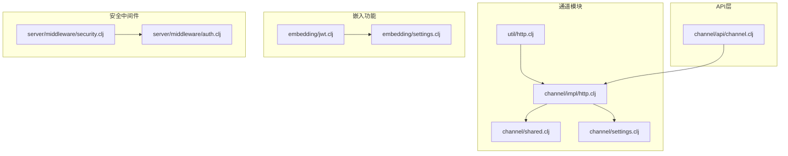
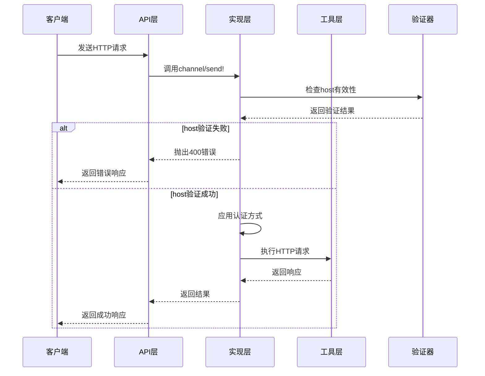
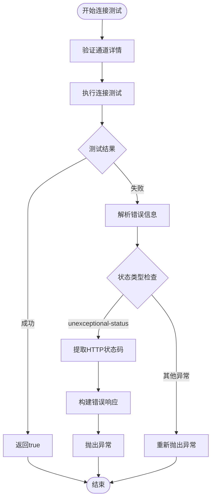
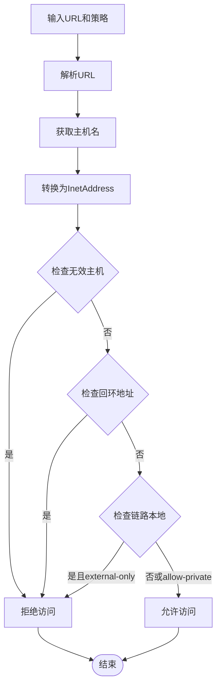
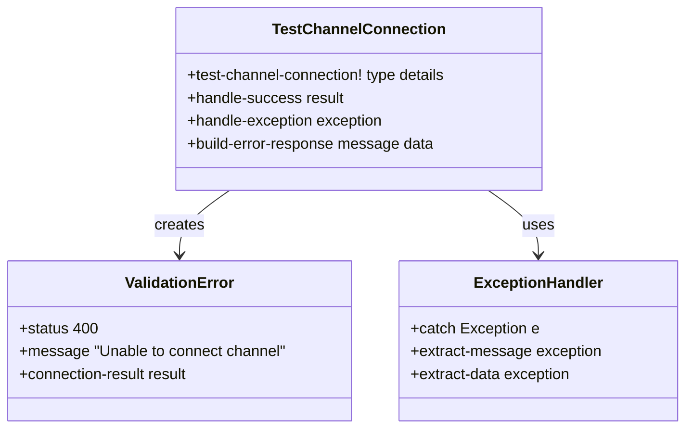
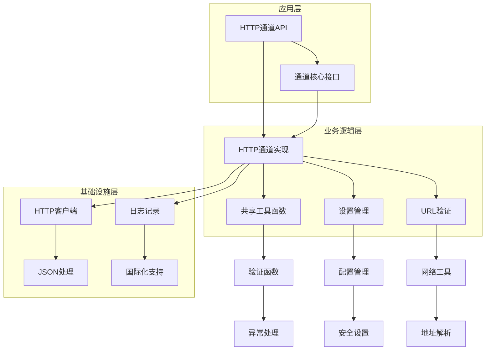

# 安全认证与连接验证

<cite>
**本文档中引用的文件**
- [http.clj](file://src/metabase/channel/impl/http.clj)
- [shared.clj](file://src/metabase/channel/shared.clj)
- [settings.clj](file://src/metabase/channel/settings.clj)
- [http.clj](file://src/metabase/util/http.clj)
- [channel.clj](file://src/metabase/channel/api/channel.clj)
- [jwt.clj](file://src/metabase/embedding/jwt.clj)
- [security.clj](file://src/metabase/server/middleware/security.clj)
</cite>

## 目录
1. [简介](#简介)
2. [项目结构概览](#项目结构概览)
3. [核心组件分析](#核心组件分析)
4. [架构概览](#架构概览)
5. [详细组件分析](#详细组件分析)
6. [依赖关系分析](#依赖关系分析)
7. [性能考虑](#性能考虑)
8. [故障排除指南](#故障排除指南)
9. [结论](#结论)

## 简介

Metabase的HTTP/Webhook通道安全认证机制是一个多层次的安全体系，旨在确保外部通信的安全性和可靠性。该系统通过严格的host验证策略、多种认证方式支持、完善的异常处理流程和连接测试反馈机制，为用户提供了可配置的安全级别和灵活的部署选项。

本文档详细阐述了channel/can-connect?方法的实现原理，深入分析了四种认证方式（none、header、query-param、request-body）的具体实现差异，解释了fe-form-type前端表单类型的映射关系，并提供了HMAC签名验证的扩展建议和安全最佳实践。

## 项目结构概览

Metabase的HTTP通道安全认证机制主要分布在以下关键目录中：

**图表来源**
- [http.clj](file://src/metabase/channel/impl/http.clj#L1-L112)
- [shared.clj](file://src/metabase/channel/shared.clj#L1-L143)
- [settings.clj](file://src/metabase/channel/settings.clj#L1-L321)

## 核心组件分析

### HTTP通道实现核心

HTTP通道的核心实现在`channel/impl/http.clj`中，包含以下关键组件：

1. **HTTPDetails模式定义**：定义了通道配置的结构化模式
2. **认证方法支持**：支持四种不同的认证方式
3. **host验证机制**：基于策略的host访问控制
4. **连接测试逻辑**：完整的连接验证流程

### Host验证策略

系统提供了三种host验证策略，通过`http-channel-host-strategy`设置进行控制：

- **external-only**（默认）：仅允许外部主机访问
- **allow-private**：允许外部主机和私有网络但禁止localhost
- **allow-all**：无限制访问，包括localhost

### 认证方式对比

| 认证方式 | 实现位置 | 数据传递方式 | 安全级别 | 使用场景 |
|---------|---------|-------------|---------|---------|
| none | 直接发送请求 | 无认证信息 | 最低 | 内部服务或测试环境 |
| header | 更新headers | HTTP头部字段 | 中等 | API密钥认证 |
| query-param | 更新查询参数 | URL查询字符串 | 较高 | OAuth或其他需要持久化的认证 |
| request-body | 更新请求体 | JSON请求体 | 最高 | 敏感认证信息 |

**章节来源**
- [http.clj](file://src/metabase/channel/impl/http.clj#L25-L38)
- [settings.clj](file://src/metabase/channel/settings.clj#L292-L319)

## 架构概览

HTTP/Webhook通道的安全认证架构采用分层设计，确保每个组件职责明确且相互协作：

**图表来源**
- [http.clj](file://src/metabase/channel/impl/http.clj#L42-L71)
- [channel.clj](file://src/metabase/channel/api/channel.clj#L89-L106)

## 详细组件分析

### channel/can-connect? 方法实现

`can-connect?`方法是连接验证的核心入口点，实现了完整的连接测试流程：

**图表来源**
- [http.clj](file://src/metabase/channel/impl/http.clj#L73-L90)

### Host验证策略实现

host验证通过`valid-host?`函数实现，支持三种策略：

**图表来源**
- [http.clj](file://src/metabase/util/http.clj#L32-L43)

### 异常处理流程

系统实现了多层次的异常处理机制：

1. **连接异常捕获**：捕获HTTP连接过程中的所有异常
2. **状态码区分**：根据异常类型区分不同错误情况
3. **错误信息标准化**：统一格式化错误响应
4. **用户友好提示**：提供可理解的错误信息

### 连接测试反馈机制

连接测试通过专门的API端点实现，提供实时的连接状态反馈：

**图表来源**
- [channel.clj](file://src/metabase/channel/api/channel.clj#L82-L106)

**章节来源**
- [http.clj](file://src/metabase/channel/impl/http.clj#L73-L90)
- [channel.clj](file://src/metabase/channel/api/channel.clj#L82-L106)

### 前端表单类型映射

系统通过`fe-form-type`字段支持前端表单类型的映射：

| 后端值 | 前端类型 | 描述 | 典型使用场景 |
|--------|---------|------|-------------|
| api-key | api-key | API密钥认证 | REST API调用 |
| bearer | bearer | Bearer令牌 | OAuth 2.0认证 |
| basic | basic | 基础认证 | HTTP基本认证 |
| none | none | 无认证 | 内部服务通信 |

这种映射确保了后端配置与前端用户体验的一致性。

**章节来源**
- [http.clj](file://src/metabase/channel/impl/http.clj#L32-L33)

## 依赖关系分析

系统的依赖关系呈现清晰的分层结构：

**图表来源**
- [http.clj](file://src/metabase/channel/impl/http.clj#L1-L15)
- [shared.clj](file://src/metabase/channel/shared.clj#L1-L15)

**章节来源**
- [http.clj](file://src/metabase/channel/impl/http.clj#L1-L15)
- [shared.clj](file://src/metabase/channel/shared.clj#L1-L15)

## 性能考虑

### 连接超时处理

系统实现了智能的连接超时机制，避免长时间阻塞影响用户体验。通过`u/with-timeout`函数实现超时控制，确保在不可达主机情况下能够快速失败。

### 缓存策略

对于频繁使用的验证结果，系统采用了适当的缓存策略，减少重复计算开销。特别是API密钥验证和权限检查等操作。

### 并发控制

HTTP请求处理支持并发执行，通过线程池管理和资源复用提高系统吞吐量。

## 故障排除指南

### 常见问题诊断

1. **host验证失败**
   - 检查`http-channel-host-strategy`设置
   - 验证目标主机是否在允许范围内
   - 确认网络连通性

2. **认证方式不匹配**
   - 确认认证信息格式正确
   - 检查认证方式与目标API要求一致
   - 验证认证凭据有效性

3. **连接超时**
   - 检查网络延迟和带宽
   - 调整连接超时设置
   - 验证目标服务可用性

### 日志分析

系统提供了详细的日志记录，帮助诊断连接问题：

- 连接尝试的详细信息
- 认证过程的步骤跟踪
- 错误堆栈和上下文信息

**章节来源**
- [http.clj](file://src/metabase/channel/impl/http.clj#L42-L46)
- [channel.clj](file://src/metabase/channel/api/channel.clj#L89-L106)

## 结论

Metabase的HTTP/Webhook通道安全认证机制提供了一个全面而灵活的安全框架。通过多层次的验证策略、多样化的认证方式支持和完善的异常处理机制，系统能够在保证安全性的同时提供良好的用户体验。

### 主要优势

1. **可配置的安全策略**：支持不同的host验证策略适应不同部署需求
2. **灵活的认证方式**：四种认证方式满足不同安全级别的要求
3. **完善的异常处理**：提供详细的错误信息和故障排除指导
4. **前端友好设计**：通过表单类型映射提升用户体验

### 安全最佳实践建议

1. **定期审查host策略**：根据实际部署环境调整host验证规则
2. **使用强认证方式**：优先选择request-body认证方式处理敏感信息
3. **监控连接状态**：建立连接测试的监控和告警机制
4. **及时更新配置**：定期检查和更新认证凭据和安全设置

### 扩展建议

对于需要更高安全性的场景，可以考虑以下扩展：

1. **HMAC签名验证**：实现请求签名验证机制
2. **证书验证**：支持SSL/TLS证书验证
3. **审计日志**：增强连接和认证活动的日志记录
4. **动态配置**：支持运行时动态调整安全策略

通过合理配置和持续监控，Metabase的HTTP/Webhook通道安全认证机制能够为用户提供可靠的安全保障。