# Slack API集成技术文档

<cite>
**本文档中引用的文件**
- [slack.clj](file://src/metabase/channel/slack.clj)
- [retry.clj](file://src/metabase/util/retry.clj)
- [send.clj](file://src/metabase/notification/send.clj)
- [slack.clj](file://src/metabase/channel/impl/slack.clj)
- [slack.clj](file://src/metabase/channel/api/slack.clj)
- [slack.clj](file://src/metabase/channel/events/slack.clj)
- [settings.clj](file://src/metabase/channel/settings.clj)
</cite>

## 目录
1. [简介](#简介)
2. [项目结构](#项目结构)
3. [核心组件](#核心组件)
4. [架构概览](#架构概览)
5. [详细组件分析](#详细组件分析)
6. [依赖关系分析](#依赖关系分析)
7. [性能考虑](#性能考虑)
8. [故障排除指南](#故障排除指南)
9. [结论](#结论)

## 简介

Metabase的Slack API集成功现了完整的Slack通信解决方案，支持OAuth 2.0认证、消息发送、文件上传、频道管理和错误处理。该系统采用分层架构设计，包含HTTP客户端调用模式、重试机制、缓存策略和安全配置。

## 项目结构

Slack集成功能分布在多个命名空间中，形成了清晰的模块化结构：

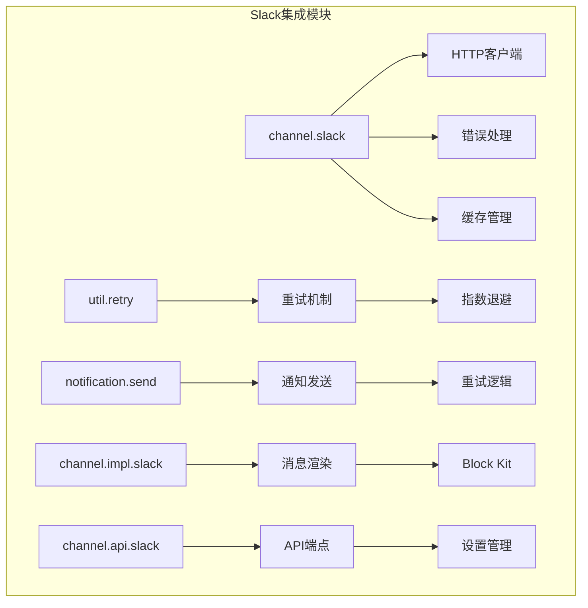

**图表来源**
- [slack.clj](file://src/metabase/channel/slack.clj#L1-L338)
- [retry.clj](file://src/metabase/util/retry.clj#L1-L121)
- [send.clj](file://src/metabase/notification/send.clj#L1-L464)

**章节来源**
- [slack.clj](file://src/metabase/channel/slack.clj#L1-L50)
- [settings.clj](file://src/metabase/channel/settings.clj#L1-L50)

## 核心组件

### HTTP客户端调用模式

Slack集成使用统一的HTTP客户端模式，支持GET和POST请求：

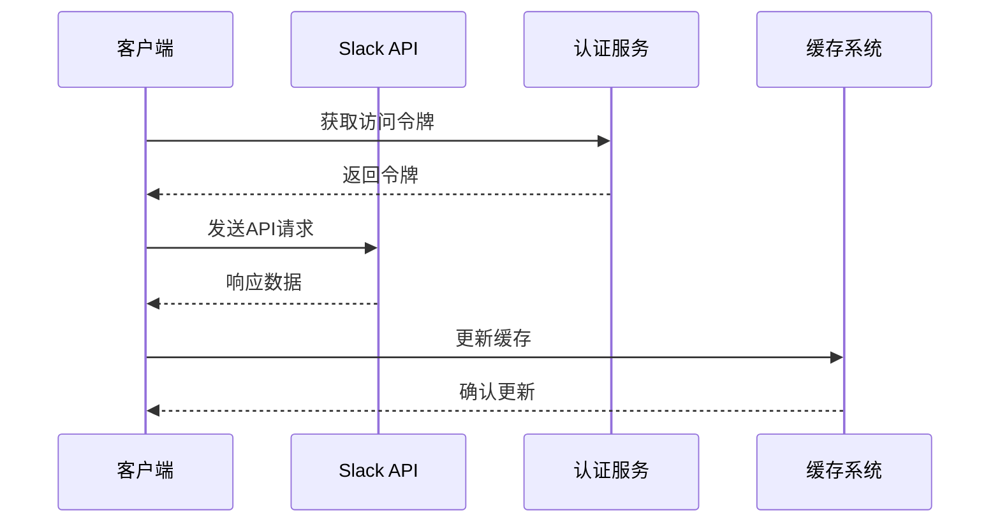

**图表来源**
- [slack.clj](file://src/metabase/channel/slack.clj#L77-L113)
- [slack.clj](file://src/metabase/channel/slack.clj#L87-L95)

### OAuth 2.0认证流程

系统支持两种认证方式：传统令牌和现代应用令牌：

| 认证类型 | 令牌格式 | 使用场景 | 安全级别 |
|---------|---------|---------|---------|
| 传统令牌 | `xoxb-...` | 旧版集成 | 中等 |
| 应用令牌 | `xapp-...` | 新版集成 | 高 |

**章节来源**
- [slack.clj](file://src/metabase/channel/slack.clj#L87-L95)
- [settings.clj](file://src/metabase/channel/settings.clj#L15-L35)

## 架构概览

Slack集成采用多层架构设计，确保高可用性和可扩展性：

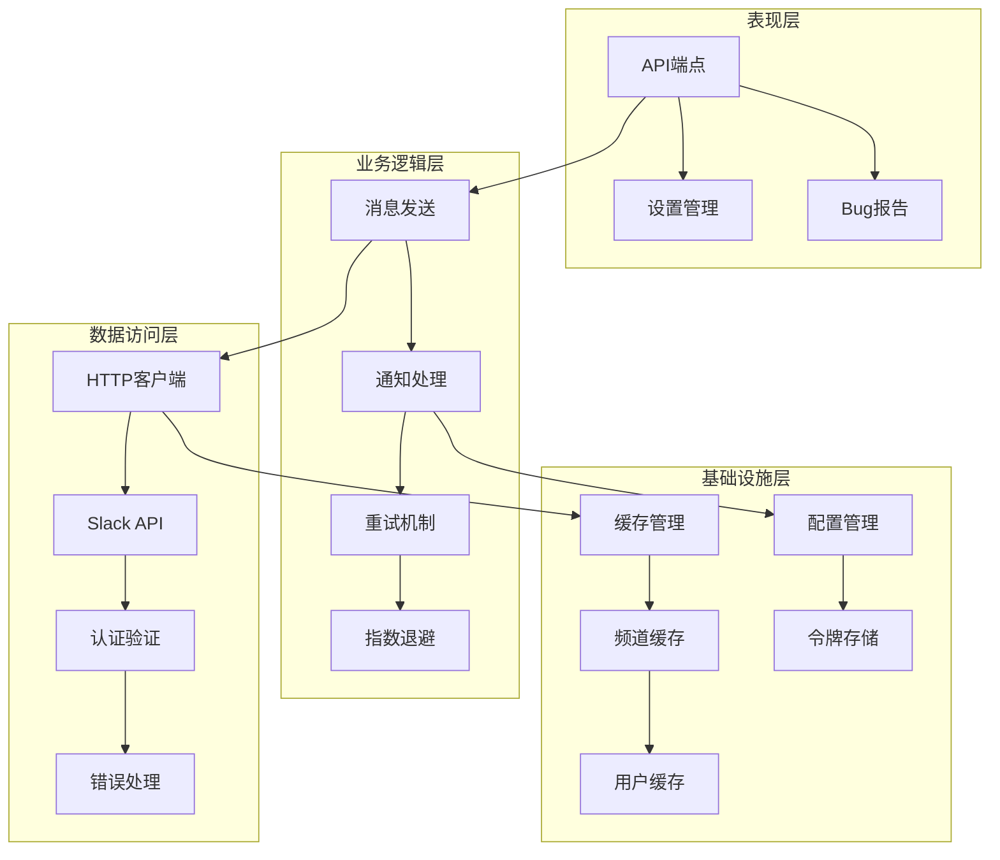

**图表来源**
- [slack.clj](file://src/metabase/channel/api/slack.clj#L60-L117)
- [slack.clj](file://src/metabase/channel/slack.clj#L139-L166)
- [send.clj](file://src/metabase/notification/send.clj#L40-L80)

## 详细组件分析

### HTTP客户端实现

#### 请求构建与认证

HTTP客户端实现了统一的请求构建模式，自动处理认证和超时配置：

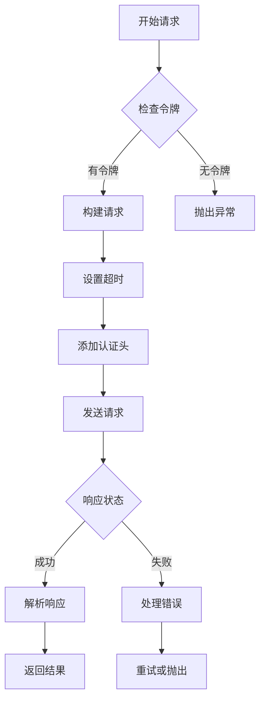

**图表来源**
- [slack.clj](file://src/metabase/channel/slack.clj#L77-L113)

#### 错误处理机制

系统实现了细粒度的错误分类和处理：

| 错误类型 | 处理策略 | 用户反馈 | 后续操作 |
|---------|---------|---------|---------|
| `invalid_auth` | 清除缓存 | 显示警告 | 触发重新配置 |
| `channel_not_found` | 记录日志 | 静默处理 | 跳过发送 |
| `rate_limited` | 指数退避 | 重试机制 | 自动恢复 |
| 其他错误 | 通用处理 | 异常抛出 | 手动干预 |

**章节来源**
- [slack.clj](file://src/metabase/channel/slack.clj#L38-L77)

### 重试机制与指数退避

#### 重试配置参数

系统提供了灵活的重试配置，支持自定义参数：

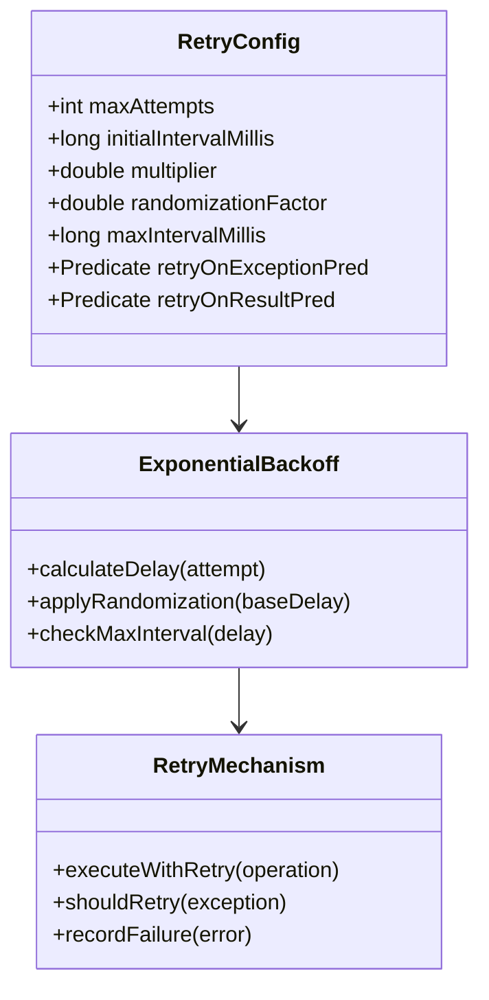

**图表来源**
- [retry.clj](file://src/metabase/util/retry.clj#L73-L101)
- [send.clj](file://src/metabase/notification/send.clj#L34-L67)

#### 不可重试错误识别

系统能够智能识别哪些错误不应该重试：

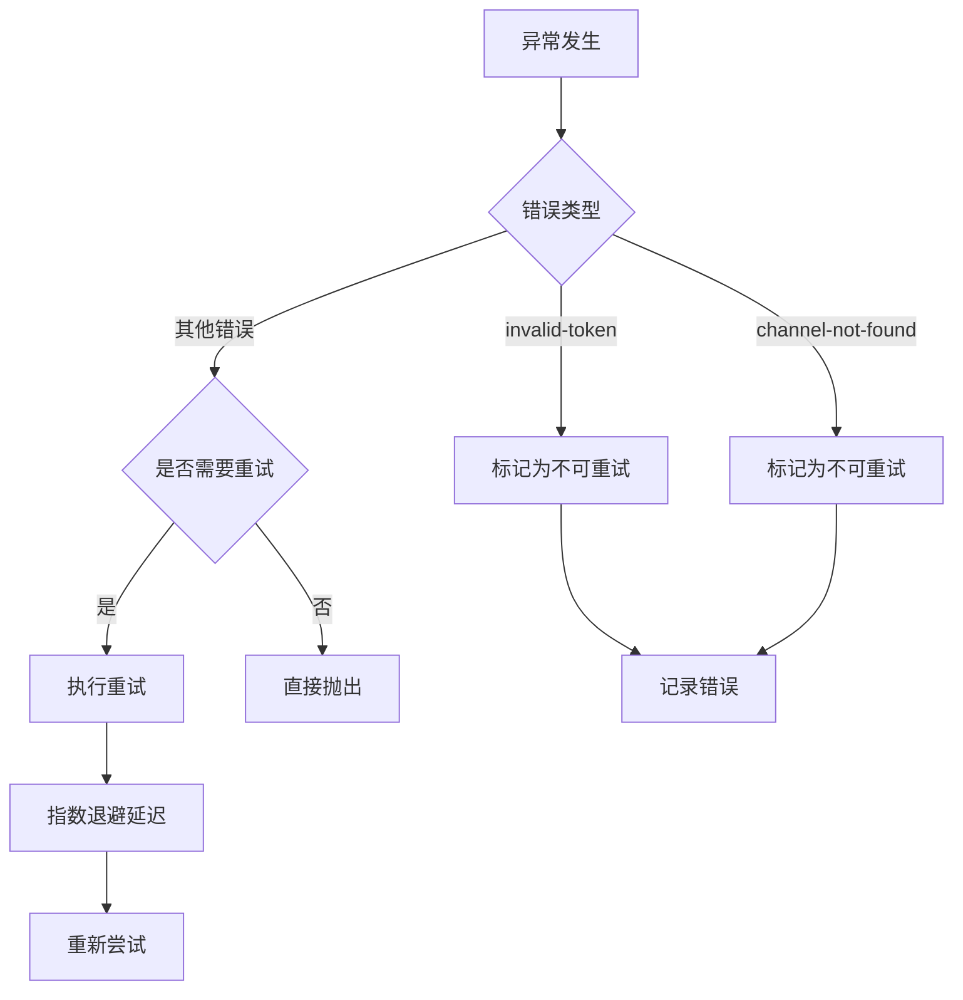

**图表来源**
- [send.clj](file://src/metabase/notification/send.clj#L44-L52)

**章节来源**
- [retry.clj](file://src/metabase/util/retry.clj#L1-L121)
- [send.clj](file://src/metabase/notification/send.clj#L34-L84)

### API端点封装

#### 主要API端点

系统提供了完整的Slack API端点封装：

| 端点名称 | 功能描述 | 参数要求 | 返回格式 |
|---------|---------|---------|---------|
| `chat.postMessage` | 发送消息到频道 | channel, blocks | MessageResponse |
| `conversations.list` | 获取频道列表 | types, exclude_archived | ConversationsList |
| `users.list` | 获取用户列表 | limit, cursor | UsersList |
| `files.getUploadURLExternal` | 获取上传URL | filename, length | UploadURLResponse |
| `files.completeUploadExternal` | 完成文件上传 | files | FileCompleteResponse |

**章节来源**
- [slack.clj](file://src/metabase/channel/slack.clj#L139-L220)
- [slack.clj](file://src/metabase/channel/api/slack.clj#L117-L153)

### 文件上传流程

#### 分块上传机制

系统实现了高效的文件上传机制，支持大文件处理：

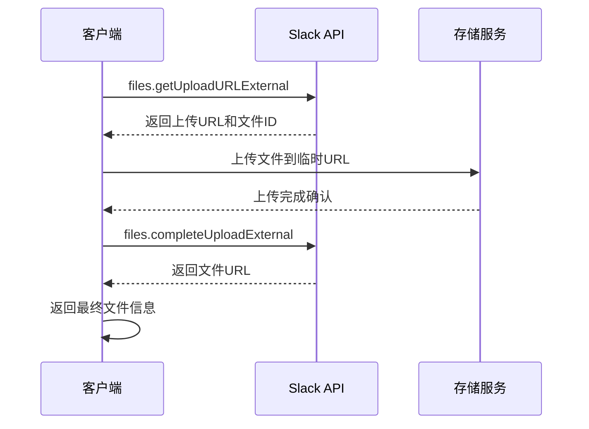

**图表来源**
- [slack.clj](file://src/metabase/channel/slack.clj#L254-L337)

**章节来源**
- [slack.clj](file://src/metabase/channel/slack.clj#L254-L337)

### 缓存管理系统

#### 频道和用户缓存

系统实现了智能缓存机制，减少API调用频率：

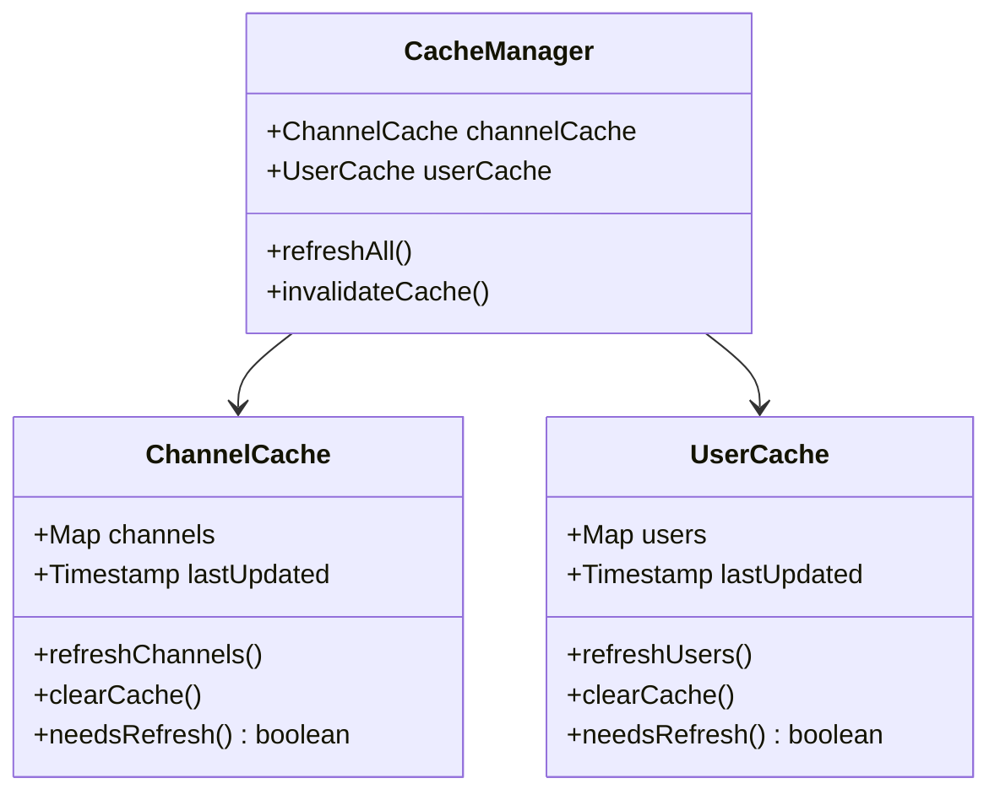

**图表来源**
- [slack.clj](file://src/metabase/channel/slack.clj#L221-L252)
- [settings.clj](file://src/metabase/channel/settings.clj#L45-L65)

**章节来源**
- [slack.clj](file://src/metabase/channel/slack.clj#L221-L252)
- [settings.clj](file://src/metabase/channel/settings.clj#L45-L85)

### 消息渲染与Block Kit

#### 消息块构建

系统支持Slack Block Kit格式的消息渲染：

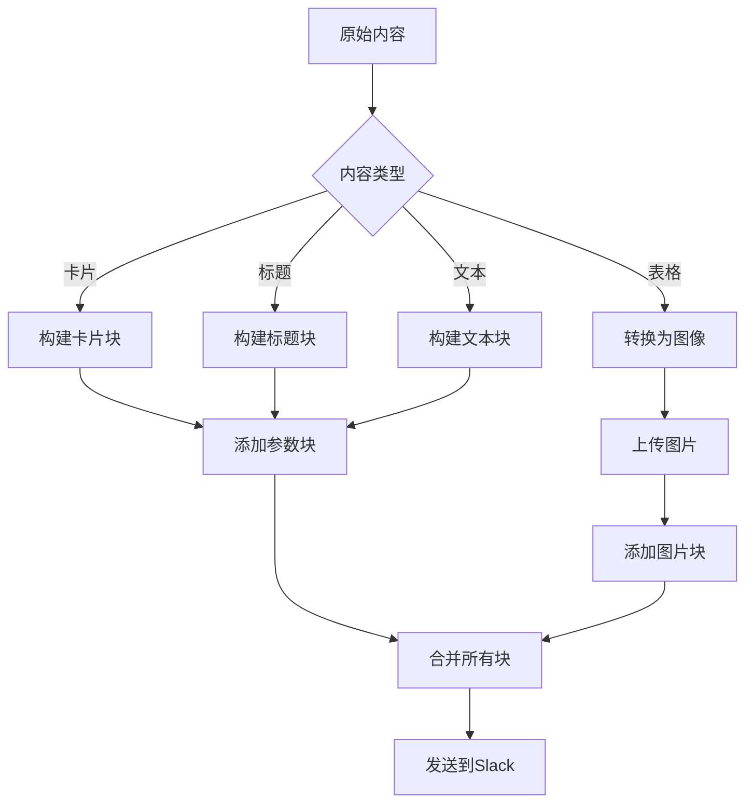

**图表来源**
- [slack.clj](file://src/metabase/channel/impl/slack.clj#L80-L150)

**章节来源**
- [slack.clj](file://src/metabase/channel/impl/slack.clj#L1-L204)

## 依赖关系分析

### 核心依赖图

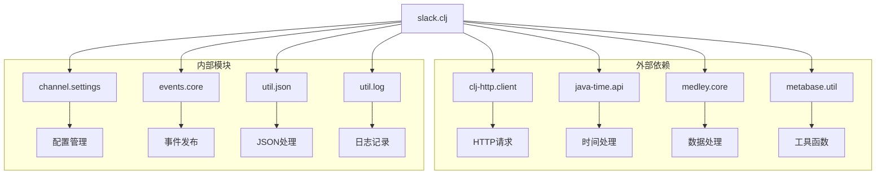

**图表来源**
- [slack.clj](file://src/metabase/channel/slack.clj#L1-L15)
- [retry.clj](file://src/metabase/util/retry.clj#L1-L15)

### 模块间交互

各模块通过明确定义的接口进行交互，确保松耦合设计：

| 模块 | 依赖模块 | 接口类型 | 交互频率 |
|------|---------|---------|---------|
| `channel.slack` | `channel.settings` | 配置读取 | 高频 |
| `channel.slack` | `events.core` | 事件发布 | 中频 |
| `notification.send` | `util.retry` | 重试控制 | 高频 |
| `channel.impl.slack` | `channel.slack` | API调用 | 中频 |

**章节来源**
- [slack.clj](file://src/metabase/channel/slack.clj#L1-L15)
- [send.clj](file://src/metabase/notification/send.clj#L1-L20)

## 性能考虑

### 连接池与超时配置

系统采用了优化的网络配置以确保最佳性能：

| 配置项 | 默认值 | 说明 | 优化目标 |
|-------|-------|------|---------|
| 连接超时 | 10秒 | 大数据量请求专用 | 避免长时间等待 |
| Socket超时 | 10秒 | 数据传输超时 | 平衡性能与稳定性 |
| 最大结果数 | 10000 | 分页限制 | 防止内存溢出 |
| 缓存刷新间隔 | 10分钟 | 缓存更新频率 | 平衡实时性与性能 |

### 并发处理

系统支持并发处理大量通知，通过线程池管理确保资源合理利用：

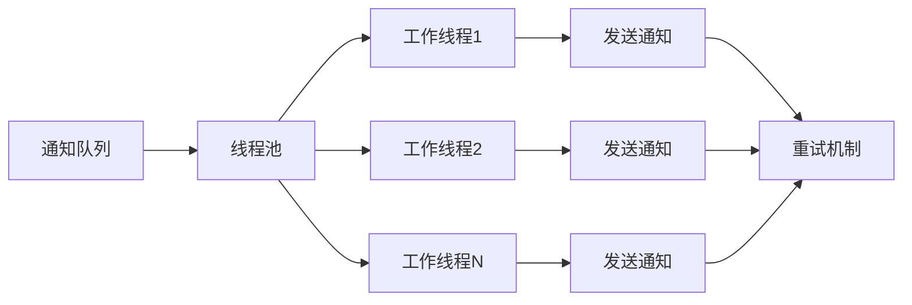

**图表来源**
- [send.clj](file://src/metabase/notification/send.clj#L380-L420)

## 故障排除指南

### 常见问题诊断

#### 认证问题

当遇到Slack认证相关问题时，系统会自动检测并处理：

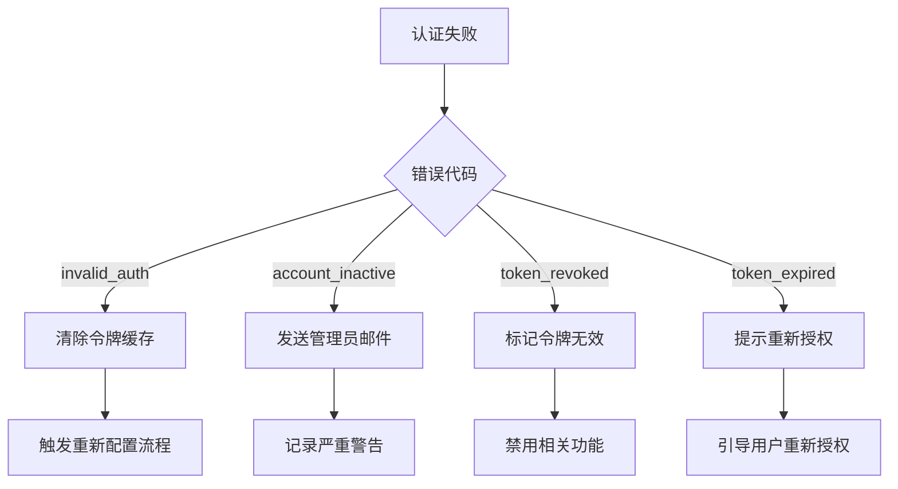

**图表来源**
- [slack.clj](file://src/metabase/channel/slack.clj#L38-L77)

#### 网络连接问题

系统具备完善的网络故障检测和恢复机制：

| 问题类型 | 检测方法 | 恢复策略 | 用户体验 |
|---------|---------|---------|---------|
| 网络超时 | 超时异常捕获 | 自动重试 | 后台处理 |
| API限流 | 状态码检查 | 指数退避 | 延迟发送 |
| 连接中断 | 异常类型判断 | 断线重连 | 状态提示 |
| 服务不可用 | 响应时间监控 | 失败降级 | 错误报告 |

**章节来源**
- [slack.clj](file://src/metabase/channel/slack.clj#L38-L77)
- [send.clj](file://src/metabase/notification/send.clj#L44-L84)

### 监控与日志

系统提供了全面的监控和日志记录功能：

#### 关键指标监控

| 指标类别 | 监控项目 | 告警阈值 | 处理动作 |
|---------|---------|---------|---------|
| 成功率 | API调用成功率 | < 95% | 发送告警邮件 |
| 延迟 | 平均响应时间 | > 5秒 | 性能优化 |
| 错误率 | 认证错误比例 | > 5% | 检查配置 |
| 缓存命中率 | 频道缓存命中率 | < 80% | 调整刷新策略 |

#### 日志级别配置

系统采用分级日志记录策略：

- **TRACE**: API请求详情（调试模式）
- **DEBUG**: 重试过程记录
- **INFO**: 正常操作日志
- **WARN**: 警告信息（令牌失效等）
- **ERROR**: 错误信息（系统异常）

**章节来源**
- [slack.clj](file://src/metabase/channel/slack.clj#L87-L95)
- [send.clj](file://src/metabase/notification/send.clj#L84-L100)

## 结论

Metabase的Slack API集成功现了一个完整、可靠且高性能的Slack通信解决方案。通过分层架构设计、智能重试机制、缓存优化和完善的错误处理，该系统能够满足企业级应用的需求。

### 主要优势

1. **高可靠性**：指数退避重试机制确保消息最终送达
2. **高性能**：智能缓存和并发处理提升系统吞吐量
3. **易维护**：模块化设计便于功能扩展和问题定位
4. **安全性**：完善的认证验证和错误隔离机制
5. **可观测性**：全面的日志记录和监控指标

### 技术特色

- 支持OAuth 2.0现代认证协议
- 实现了完整的Block Kit消息渲染
- 提供了灵活的重试策略配置
- 建立了智能的缓存管理系统
- 具备完善的故障诊断和恢复能力

该集成方案为Metabase用户提供了无缝的Slack通信体验，是企业级数据分析平台的重要组成部分。