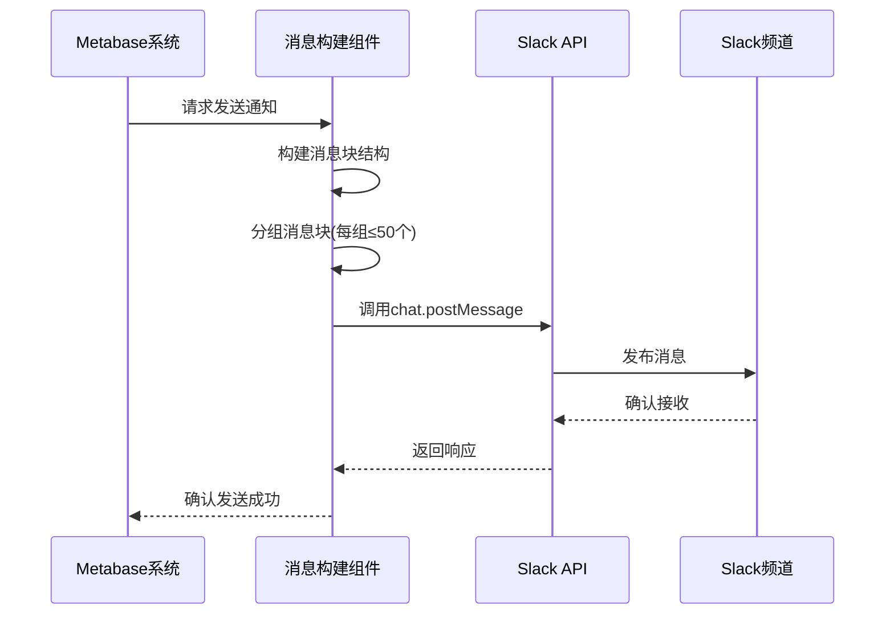
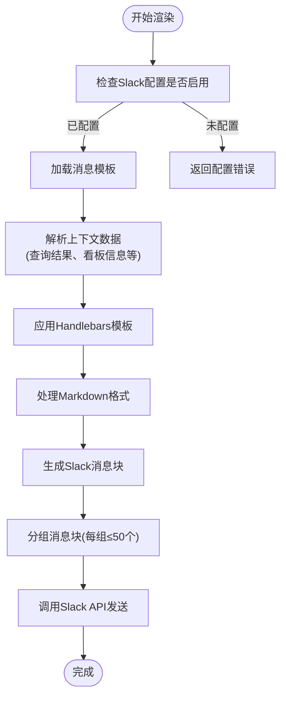
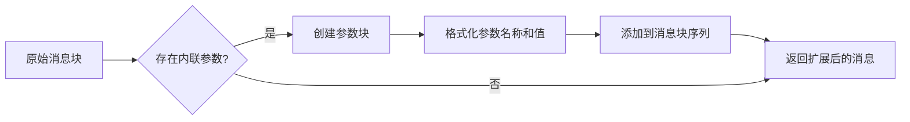

# Slack消息构建

<cite>
**本文档引用的文件**
- [slack.clj](file://src/metabase/channel/slack.clj)
- [impl/slack.clj](file://src/metabase/channel/impl/slack.clj)
- [render/core.clj](file://src/metabase/channel/render/core.clj)
- [template/core.clj](file://src/metabase/channel/template/core.clj)
- [template/handlebars.clj](file://src/metabase/channel/template/handlebars.clj)
- [render/card.clj](file://src/metabase/channel/render/card.clj)
- [util/markdown.clj](file://src/metabase/util/markdown.clj)
- [settings.clj](file://src/metabase/channel/settings.clj)
</cite>

## 目录
1. [简介](#简介)
2. [Slack消息块API构建机制](#slack消息块api构建机制)
3. [消息模板渲染流程](#消息模板渲染流程)
4. [消息结构组装过程](#消息结构组装过程)
5. [自定义消息格式扩展](#自定义消息格式扩展)
6. [最佳实践](#最佳实践)
7. [结论](#结论)

## 简介
本文档详细说明Metabase系统中Slack消息的构建机制。重点阐述如何利用Slack消息块（Blocks）API创建富文本通知，包括标题、描述、链接和交互式按钮的生成逻辑。文档还解释了消息模板的渲染流程，以及如何将查询结果、看板信息和警报详情动态填充到消息模板中。

## Slack消息块API构建机制

Metabase通过Slack消息块API构建结构化消息，实现丰富的通知功能。消息构建的核心逻辑位于`slack.clj`和`impl/slack.clj`文件中，通过分层设计实现消息的创建和发送。

消息构建机制首先通过`post-chat-message!`函数调用Slack API的`chat.postMessage`端点，将消息发布到指定频道。该函数接受包含频道、消息块、文本和附件等属性的消息内容映射。为了处理大型消息，系统将消息块分组为每组最多50个块的批次，确保符合Slack API的限制。



**图示来源**
- [slack.clj](file://src/metabase/channel/slack.clj#L320-L337)
- [impl/slack.clj](file://src/metabase/channel/impl/slack.clj#L149-L155)

消息块的构建遵循Slack Block Kit的设计规范，支持多种块类型：
- **Header块**：用于显示消息标题，支持emoji
- **Section块**：用于显示主要内容，支持markdown格式文本
- **Image块**：用于显示图表或图片附件
- **Actions块**：用于添加交互式按钮

系统通过`part->sections!`函数将通知部分转换为Slack块，根据部分类型（卡片、标题、文本等）应用不同的转换逻辑。对于包含内联参数的部分，系统会自动附加参数块，显示过滤器信息。

**本节来源**
- [impl/slack.clj](file://src/metabase/channel/impl/slack.clj#L122-L149)
- [slack.clj](file://src/metabase/channel/slack.clj#L320-L337)

## 消息模板渲染流程

消息模板渲染是Slack通知系统的核心功能，通过`render/core.clj`和`template/core.clj`文件中的组件协同工作，实现动态内容的填充和格式化。

渲染流程始于`render-notification`多方法，根据通知类型（卡片通知或看板订阅）调用相应的渲染逻辑。对于卡片通知，系统首先创建包含警报图标和卡片名称的标题块，然后调用`part->sections!`函数处理卡片部分。



**图示来源**
- [impl/slack.clj](file://src/metabase/channel/impl/slack.clj#L156-L174)
- [render/core.clj](file://src/metabase/channel/render/core.clj#L1-L36)

模板渲染的核心是Handlebars引擎，通过`template/handlebars.clj`文件中的`render`和`render-string`函数实现。系统创建了一个带有类路径模板加载器的Handlebars实例，并注册了默认助手函数。模板支持动态内容插入、条件语句和日期格式化等功能。

上下文数据通过`default-context`函数提供，包含应用程序名称、颜色、徽标URL、站点名称、站点URL等信息。这些数据在渲染时被注入模板，确保消息的一致性和品牌识别。

对于看板订阅通知，系统使用`slack-dashboard-header`函数创建包含看板名称、创建者和过滤器的头部块。如果未启用白标功能，还会添加"Made with Metabase"的品牌标识。

**本节来源**
- [template/core.clj](file://src/metabase/channel/template/core.clj#L1-L10)
- [template/handlebars.clj](file://src/metabase/channel/template/handlebars.clj#L1-L73)
- [impl/slack.clj](file://src/metabase/channel/impl/slack.clj#L174-L202)

## 消息结构组装过程

消息结构的组装是一个多阶段过程，涉及从查询结果到最终Slack消息块的转换。这个过程主要由`render/card.clj`文件中的函数实现，通过分层设计确保代码的可维护性和扩展性。

组装过程从`render-pulse-card`函数开始，该函数接受渲染类型、时区、卡片、看板卡片和查询结果作为参数。函数首先根据选项决定是否包含标题、描述和内联参数，然后调用`render-pulse-card-body`函数渲染卡片主体。

```mermaid
classDiagram
class render-pulse-card {
+render-type
+timezone-id
+card
+dashcard
+results
+options
+render-pulse-card()
}
class render-pulse-card-body {
+render-type
+timezone-id
+card
+dashcard
+results
+render-pulse-card-body()
}
class detect-pulse-chart-type {
+card
+maybe-dashcard
+data
+detect-pulse-chart-type()
}
class body/render {
+chart-type
+render-type
+timezone-id
+card
+dashcard
+data
+body/render()
}
class png/render-html-to-png {
+rendered-info
+width
+render-html-to-png()
}
render-pulse-card --> render-pulse-card-body : 调用
render-pulse-card_body --> detect-pulse-chart-type : 调用
render-pulse-card_body --> body/render : 调用
body/render --> png/render-html-to-png : 调用
```

**图示来源**
- [render/card.clj](file://src/metabase/channel/render/card.clj#L1-L282)
- [render/body.clj](file://src/metabase/channel/render/body.clj#L1-L660)

图表类型的检测是组装过程的关键步骤，`detect-pulse-chart-type`函数根据卡片的显示类型和查询结果的行列数确定渲染方式。系统支持多种图表类型，包括标量、条形图、表格、饼图等，并为每种类型提供相应的渲染逻辑。

对于包含图像的内容，系统使用`png-from-render-info`函数将HTML内容渲染为PNG图像，然后通过`upload-file!`函数上传到Slack。上传过程分为三个步骤：获取上传URL、上传文件到URL、完成上传并获取文件URL。

文本内容的处理通过`util/markdown.clj`文件中的`process-markdown`函数实现，该函数将Markdown格式转换为Slack支持的mrkdwn格式。系统还实现了`escape-mkdwn`函数，用于转义Slack mrkdwn特殊字符，确保消息的正确显示。

**本节来源**
- [render/card.clj](file://src/metabase/channel/render/card.clj#L1-L282)
- [render/body.clj](file://src/metabase/channel/render/body.clj#L1-L660)
- [util/markdown.clj](file://src/metabase/util/markdown.clj#L1-L430)

## 自定义消息格式扩展

Metabase的Slack消息系统设计为可扩展的，允许通过多种方式自定义消息格式。系统提供了灵活的API和配置选项，支持从简单的内容调整到复杂的模板修改。

最直接的扩展方式是通过通知设置中的内联参数。当看板卡片包含内联参数时，系统会自动在消息中添加参数块，显示当前的过滤器值。这通过`maybe-append-params-block`函数实现，该函数检查是否存在内联参数，如果存在则创建相应的消息块。



**图示来源**
- [impl/slack.clj](file://src/metabase/channel/impl/slack.clj#L63-L73)
- [render/card.clj](file://src/metabase/channel/render/card.clj#L1-L282)

对于更复杂的自定义需求，系统支持通过Handlebars模板进行深度定制。开发者可以创建自定义模板，利用Handlebars的表达式、条件语句和循环功能，创建高度个性化的消息格式。模板可以访问完整的上下文数据，包括查询结果、用户信息和系统设置。

系统还提供了多个可配置的限制参数，允许管理员根据需要调整消息格式：
- `header-text-limit`：标题块字符限制（150字符）
- `block-text-length-limit`：段落块字符限制（3000字符）
- `attachment-table-row-limit`：附件表格行数限制

这些参数可以通过系统设置进行调整，确保消息在不同环境下的最佳显示效果。

**本节来源**
- [impl/slack.clj](file://src/metabase/channel/impl/slack.clj#L33-L73)
- [settings.clj](file://src/metabase/channel/settings.clj#L1-L321)

## 最佳实践

为了确保Slack消息的有效性和用户体验，遵循以下最佳实践至关重要：

### 消息可访问性
确保消息内容对所有用户都可访问，包括使用屏幕阅读器的用户。使用清晰的标题结构，避免过度使用格式化，确保链接文本具有描述性。对于图像内容，提供替代文本（alt text）描述图像内容。

### 移动端适配
考虑到许多用户通过移动设备查看Slack消息，优化消息在小屏幕上的显示效果。避免创建过宽的表格或图表，使用简洁的文本描述。系统通过`slack-width`参数（1200像素）限制渲染PNG的宽度，确保内容在移动设备上可读。

### 截断处理
Slack对消息块有严格的字符限制，系统实现了智能截断机制。`truncate`函数检查文本长度，如果超过限制则截断并添加省略号。这确保了消息不会因过长而被拒绝，同时保持内容的可读性。

### 错误处理
系统实现了全面的错误处理机制，确保在Slack集成出现问题时能够及时通知管理员。当收到无效或已撤销的令牌错误时，系统会向所有管理员发送电子邮件，并在日志中记录警告。这有助于快速识别和解决集成问题。

### 性能优化
考虑到可能需要发送包含多个图表的复杂消息，系统实现了性能优化措施。消息块被分组发送，避免单个API调用过大。文件上传过程也进行了优化，通过外部文件上传API提高大文件的传输效率。

**本节来源**
- [impl/slack.clj](file://src/metabase/channel/impl/slack.clj#L33-L73)
- [slack.clj](file://src/metabase/channel/slack.clj#L1-L337)
- [settings.clj](file://src/metabase/channel/settings.clj#L1-L321)

## 结论
Metabase的Slack消息构建机制通过分层设计和模块化架构，实现了灵活、可扩展的通知系统。系统利用Slack消息块API创建丰富的富文本通知，通过Handlebars模板引擎实现动态内容填充，并提供了多种自定义选项。

消息构建流程从查询结果开始，经过图表类型检测、HTML渲染、PNG生成、文件上传等多个步骤，最终组装成符合Slack API规范的消息块。系统还考虑了可访问性、移动端适配和截断处理等最佳实践，确保消息在各种环境下的良好显示效果。

通过理解这一机制，开发者可以更好地利用Metabase的Slack集成功能，创建满足特定业务需求的定制化通知，提升团队的数据驱动决策能力。