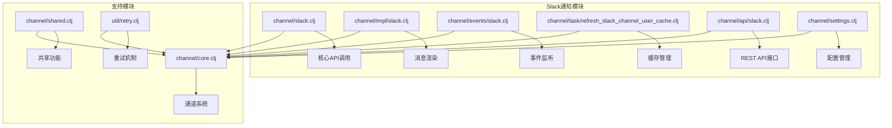
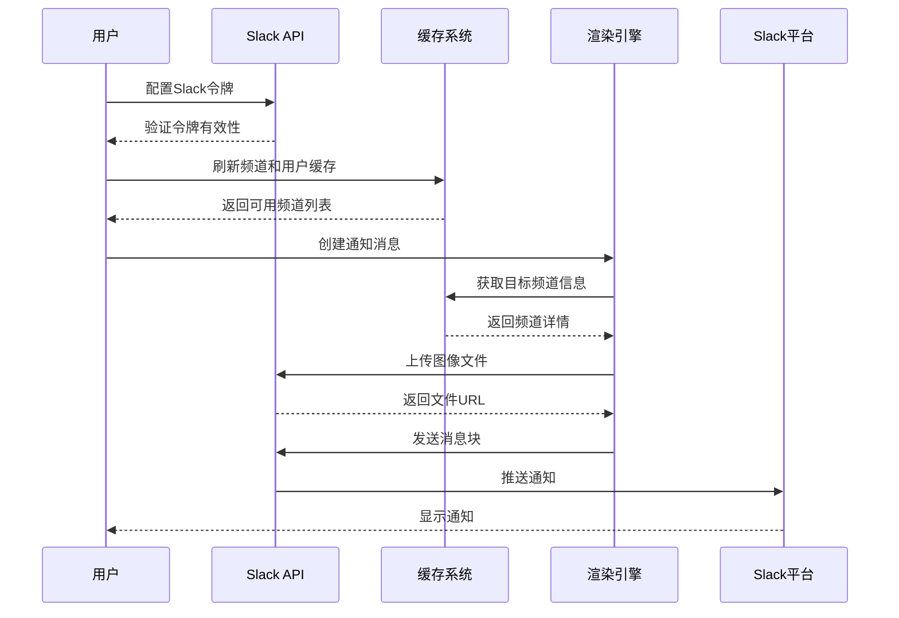
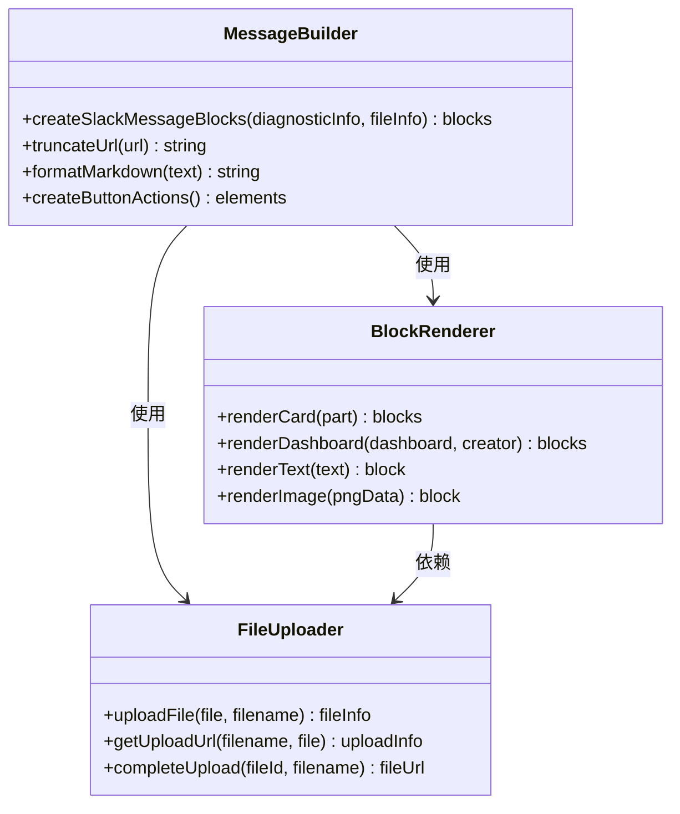
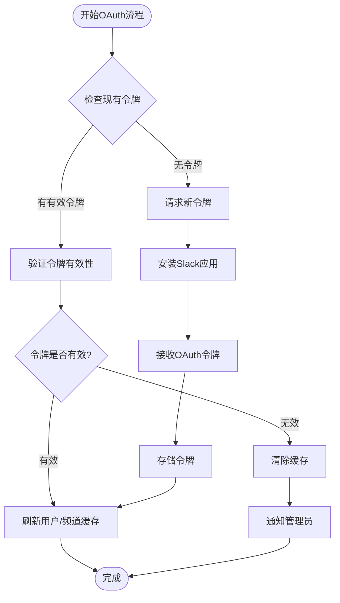
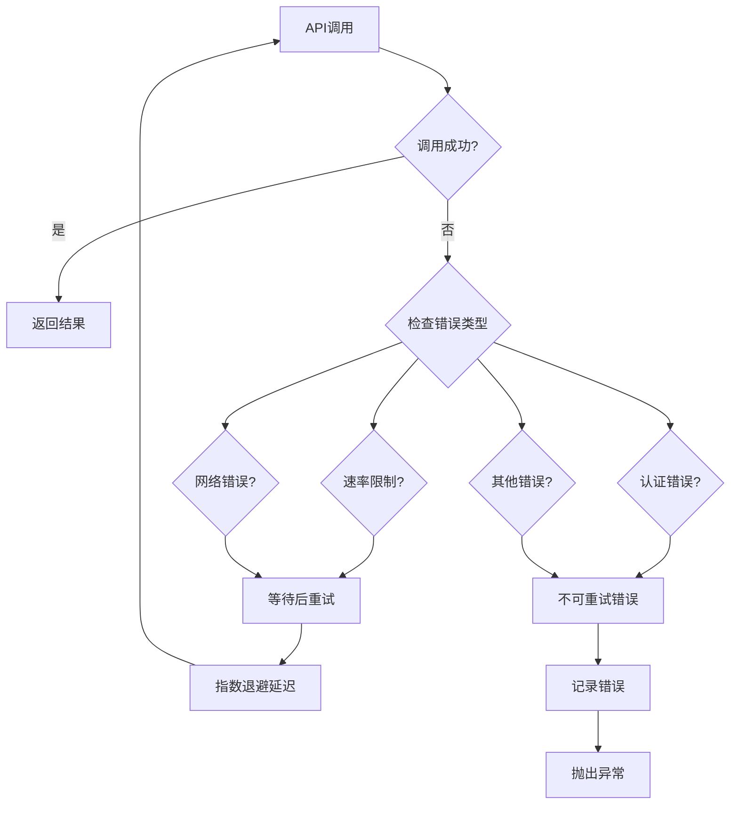
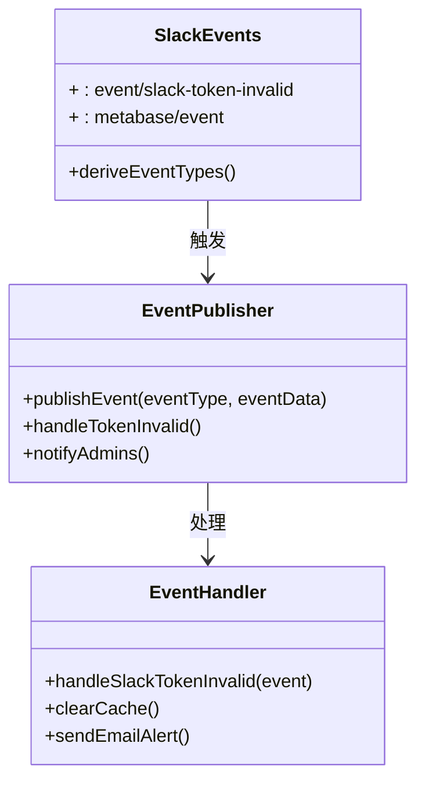
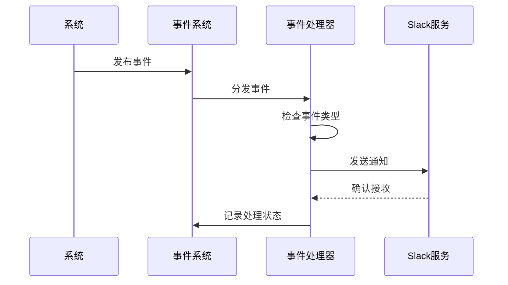
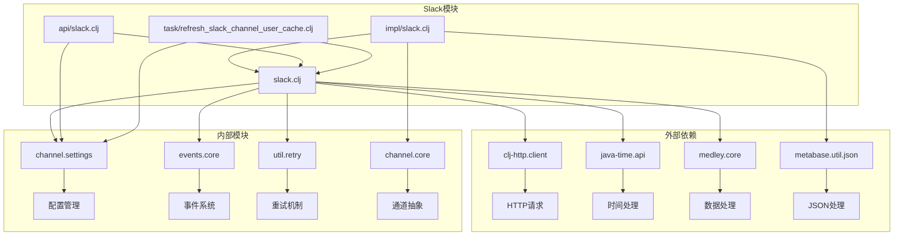

# Slack通知实现

<cite>
**本文档中引用的文件**
- [slack.clj](file://src/metabase/channel/slack.clj)
- [impl/slack.clj](file://src/metabase/channel/impl/slack.clj)
- [events/slack.clj](file://src/metabase/channel/events/slack.clj)
- [task/refresh_slack_channel_user_cache.clj](file://src/metabase/channel/task/refresh_slack_channel_user_cache.clj)
- [api/slack.clj](file://src/metabase/channel/api/slack.clj)
- [settings.clj](file://src/metabase/channel/settings.clj)
- [core.clj](file://src/metabase/channel/core.clj)
- [shared.clj](file://src/metabase/channel/shared.clj)
- [retry.clj](file://src/metabase/util/retry.clj)
</cite>

## 目录
1. [简介](#简介)
2. [项目结构](#项目结构)
3. [核心组件](#核心组件)
4. [架构概览](#架构概览)
5. [详细组件分析](#详细组件分析)
6. [依赖关系分析](#依赖关系分析)
7. [性能考虑](#性能考虑)
8. [故障排除指南](#故障排除指南)
9. [结论](#结论)

## 简介

Metabase的Slack通知集成功能提供了强大的实时通信能力，允许用户通过Slack平台接收仪表板订阅、警报通知和系统事件提醒。该系统采用模块化设计，支持多种消息格式、交互式按钮和OAuth认证流程，确保了高可用性和可扩展性。

## 项目结构

Slack通知功能在Metabase项目中的组织结构如下：



**图表来源**
- [slack.clj](file://src/metabase/channel/slack.clj#L1-L338)
- [impl/slack.clj](file://src/metabase/channel/impl/slack.clj#L1-L204)
- [core.clj](file://src/metabase/channel/core.clj#L1-L43)

**章节来源**
- [slack.clj](file://src/metabase/channel/slack.clj#L1-L50)
- [impl/slack.clj](file://src/metabase/channel/impl/slack.clj#L1-L30)

## 核心组件

### Slack API客户端

Slack API客户端是整个通知系统的核心，负责与Slack Web API进行交互。它实现了以下关键功能：

- **OAuth令牌管理**：支持新的Slack应用令牌和传统的bot令牌
- **API请求封装**：提供统一的HTTP请求接口
- **错误处理机制**：智能识别和处理各种API错误
- **重试策略**：实现指数退避重试算法

### 消息渲染引擎

消息渲染引擎负责将Metabase的内容转换为Slack Block Kit格式的消息块。主要特性包括：

- **Markdown处理**：安全地转换Markdown文本到Slack格式
- **图像上传**：自动处理仪表板截图和图表上传
- **参数嵌入**：动态插入查询参数信息
- **长度限制**：智能截断以符合Slack的字符限制

### 缓存管理系统

缓存管理系统确保用户和频道信息的及时更新，提高系统响应速度：

- **定时刷新**：每4小时自动刷新一次
- **按需更新**：在需要时立即更新缓存
- **并发控制**：使用锁机制防止重复刷新
- **内存优化**：合理管理缓存大小

**章节来源**
- [slack.clj](file://src/metabase/channel/slack.clj#L200-L338)
- [impl/slack.clj](file://src/metabase/channel/impl/slack.clj#L100-L204)

## 架构概览

Slack通知系统的整体架构采用分层设计，确保了各组件之间的松耦合和高内聚：



**图表来源**
- [slack.clj](file://src/metabase/channel/slack.clj#L150-L200)
- [impl/slack.clj](file://src/metabase/channel/impl/slack.clj#L150-L204)
- [api/slack.clj](file://src/metabase/channel/api/slack.clj#L130-L154)

## 详细组件分析

### Slack特定功能实现

#### 消息块构建器

消息块构建器是Slack通知的核心组件，负责创建符合Block Kit标准的消息结构：



**图表来源**
- [api/slack.clj](file://src/metabase/channel/api/slack.clj#L20-L60)
- [impl/slack.clj](file://src/metabase/channel/impl/slack.clj#L50-L100)

#### 交互式按钮系统

交互式按钮系统提供了丰富的用户交互功能：

| 按钮类型 | 功能描述 | 触发条件 | 响应行为 |
|---------|---------|---------|---------|
| 调试器链接 | 打开Metabase调试器 | 点击"Jump to debugger"按钮 | 导航到调试页面 |
| 下载报告 | 下载诊断信息文件 | 点击"Download the report"按钮 | 触发文件下载 |
| 图表预览 | 查看完整图表 | 图像块点击 | 显示原始图表 |

#### OAuth集成流程

OAuth集成流程确保了安全的Slack应用连接：



**图表来源**
- [slack.clj](file://src/metabase/channel/slack.clj#L280-L338)
- [api/slack.clj](file://src/metabase/channel/api/slack.clj#L65-L120)

**章节来源**
- [slack.clj](file://src/metabase/channel/slack.clj#L280-L338)
- [api/slack.clj](file://src/metabase/channel/api/slack.clj#L20-L154)

### Web API调用模式

#### 错误重试策略

系统实现了智能的错误重试机制，能够处理各种网络和API错误：



**图表来源**
- [slack.clj](file://src/metabase/channel/slack.clj#L32-L53)
- [retry.clj](file://src/metabase/util/retry.clj#L80-L121)

#### 速率限制处理

系统通过以下策略处理Slack API的速率限制：

- **连接超时**：设置10秒的长连接超时时间
- **请求限制**：单次请求最多包含50个消息块
- **分批发送**：自动将大量消息分批处理
- **并发控制**：避免同时发送过多请求

**章节来源**
- [slack.clj](file://src/metabase/channel/slack.clj#L77-L113)
- [retry.clj](file://src/metabase/util/retry.clj#L40-L80)

### 事件监听机制

#### 事件类型定义

系统定义了多种Slack相关的事件类型：



**图表来源**
- [events/slack.clj](file://src/metabase/channel/events/slack.clj#L1-L5)

#### 通知触发流程

通知触发流程确保系统事件能够及时传达给用户：



**图表来源**
- [events/slack.clj](file://src/metabase/channel/events/slack.clj#L1-L5)

**章节来源**
- [events/slack.clj](file://src/metabase/channel/events/slack.clj#L1-L5)

### 用户缓存刷新任务

#### 定时任务调度

用户缓存刷新任务采用Quartz调度器实现：

```mermaid
gantt
title Slack缓存刷新任务时间线
dateFormat HH:mm
axisFormat %H:%M
section 启动时刷新
立即执行 :active, startup, 00:00, 00:01
section 定期刷新
每4小时刷新 :active, regular, 04:00, 08:00, 12:00, 16:00, 20:00
section 错误恢复
60秒重试 :crit, retry, 00:01, 01:01
```

**图表来源**
- [task/refresh_slack_channel_user_cache.clj](file://src/metabase/channel/task/refresh_slack_channel_user_cache.clj#L40-L63)

#### 缓存刷新策略

缓存刷新策略确保数据的准确性和时效性：

| 刷新时机 | 触发条件 | 刷新范围 | 执行方式 |
|---------|---------|---------|---------|
| 系统启动 | 应用启动时 | 全量刷新 | 立即执行 |
| 定时刷新 | 每4小时 | 增量刷新 | 异步执行 |
| 手动刷新 | 令牌变更 | 全量刷新 | 即时响应 |
| 错误恢复 | 刷新失败 | 全量刷新 | 重试机制 |

**章节来源**
- [task/refresh_slack_channel_user_cache.clj](file://src/metabase/channel/task/refresh_slack_channel_user_cache.clj#L1-L63)

## 依赖关系分析

### 核心依赖图

Slack通知系统的依赖关系体现了良好的模块化设计：



**图表来源**
- [slack.clj](file://src/metabase/channel/slack.clj#L1-L15)
- [impl/slack.clj](file://src/metabase/channel/impl/slack.clj#L1-L15)

### 模块间通信

模块间的通信遵循清晰的接口约定：

- **API层**：通过REST API暴露功能
- **业务层**：实现具体的业务逻辑
- **数据层**：管理配置和缓存
- **工具层**：提供通用的辅助功能

**章节来源**
- [slack.clj](file://src/metabase/channel/slack.clj#L1-L30)
- [core.clj](file://src/metabase/channel/core.clj#L1-L43)

## 性能考虑

### 缓存优化策略

系统采用了多层次的缓存优化策略：

- **内存缓存**：将频繁访问的频道和用户信息保存在内存中
- **分布式缓存**：支持集群环境下的缓存同步
- **智能过期**：基于时间的自动缓存失效机制
- **懒加载**：按需加载缓存数据，减少内存占用

### 并发处理

系统通过以下机制优化并发性能：

- **异步处理**：文件上传和消息发送采用异步方式
- **连接池**：复用HTTP连接，减少建立连接的开销
- **限流控制**：防止过度消耗Slack API资源
- **错误隔离**：单个请求失败不影响其他请求

### 内存管理

内存管理策略确保系统在高负载下的稳定性：

- **对象池**：重用常用对象，减少GC压力
- **流式处理**：大文件采用流式上传，避免内存溢出
- **定期清理**：自动清理过期的临时数据
- **监控告警**：实时监控内存使用情况

## 故障排除指南

### 常见问题及解决方案

#### 令牌验证失败

**症状**：Slack集成无法正常工作，出现认证错误

**原因分析**：
- OAuth令牌已过期或被撤销
- 权限范围不足
- Slack应用未正确安装

**解决步骤**：
1. 检查令牌的有效性
2. 重新授权Slack应用
3. 验证所需的OAuth范围
4. 查看系统日志获取详细错误信息

#### 缓存数据不一致

**症状**：用户或频道列表显示不正确

**原因分析**：
- 缓存刷新任务失败
- 并发刷新导致的数据竞争
- 网络连接问题

**解决步骤**：
1. 手动触发缓存刷新
2. 检查任务调度状态
3. 验证网络连接
4. 清除并重建缓存

#### 消息发送失败

**症状**：通知消息无法发送到Slack

**原因分析**：
- 目标频道不存在或不可访问
- 消息格式不符合要求
- API配额耗尽

**解决步骤**：
1. 验证目标频道名称
2. 检查消息格式
3. 监控API使用情况
4. 实施重试机制

**章节来源**
- [slack.clj](file://src/metabase/channel/slack.clj#L32-L77)
- [api/slack.clj](file://src/metabase/channel/api/slack.clj#L65-L120)

### 最佳实践建议

#### Slack应用配置

1. **权限范围设置**：
   - `channels:read`：读取公共频道列表
   - `groups:read`：读取私有群组列表
   - `chat:write`：发送消息到频道
   - `files:write`：上传文件到频道

2. **Webhook管理**：
   - 使用HTTPS端点
   - 实现适当的认证机制
   - 设置合理的超时时间
   - 监控Webhook成功率

3. **错误处理**：
   - 实现指数退避重试
   - 记录详细的错误日志
   - 提供用户友好的错误信息
   - 设置告警阈值

#### 性能优化

1. **缓存策略**：
   - 合理设置缓存过期时间
   - 监控缓存命中率
   - 实现缓存预热机制
   - 定期清理过期缓存

2. **并发控制**：
   - 限制并发请求数量
   - 实现请求队列机制
   - 使用连接池管理
   - 监控系统资源使用

3. **监控告警**：
   - 设置关键指标监控
   - 实现自动化故障检测
   - 建立告警通知机制
   - 定期审查系统性能

## 结论

Metabase的Slack通知集成功能展现了现代企业级应用的设计精髓。通过模块化的架构设计、智能的错误处理机制和高效的缓存策略，该系统不仅提供了可靠的Slack集成功能，还为未来的扩展和优化奠定了坚实的基础。

系统的主要优势包括：

- **高可靠性**：完善的错误处理和重试机制确保服务的稳定性
- **高性能**：智能缓存和并发处理保证了良好的用户体验
- **易维护**：清晰的模块划分和标准化的接口设计便于维护
- **可扩展**：灵活的架构支持未来功能的扩展和定制

随着企业对实时通知需求的不断增长，这套Slack通知系统将继续发挥重要作用，为企业用户提供及时、准确的信息传递服务。